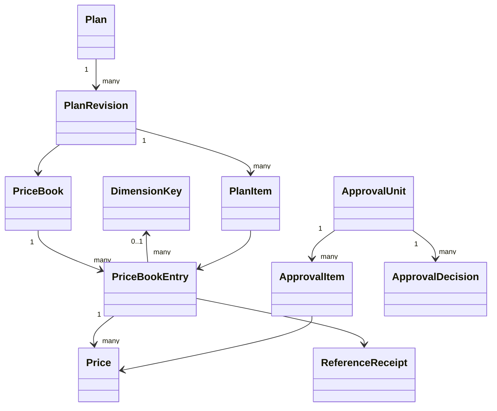
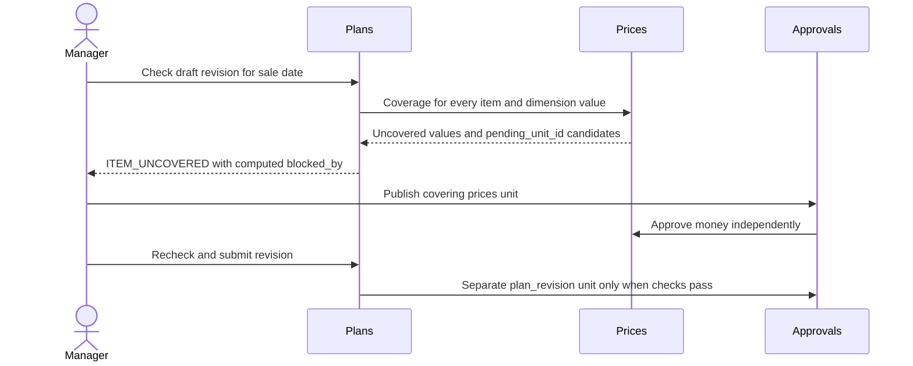

<!-- CONFLUENCE_TITLE: [BSS]: Pricing — PriceBook Design -->
<!-- Related: ./PRD.md, ./DECISIONS.md, ./design/ | Owners: BSS Pricing team -->

# DESIGN — Pricing: PriceBook

- [ ] `p1` - **DESIGN implementation status**

<!-- toc -->

- [1. Architecture Overview](#1-architecture-overview)
  - [1.1 Architectural Vision](#11-architectural-vision)
  - [1.2 Architecture Drivers](#12-architecture-drivers)
  - [1.3 Architecture Layers](#13-architecture-layers)
- [2. Principles & Constraints](#2-principles--constraints)
  - [2.1 Design Principles](#21-design-principles)
  - [2.2 Constraints](#22-constraints)
- [3. Technical Architecture](#3-technical-architecture)
  - [3.1 Domain Model](#31-domain-model)
  - [3.2 Component Model](#32-component-model)
  - [3.3 API Contracts](#33-api-contracts)
  - [3.4 Internal Dependencies](#34-internal-dependencies)
  - [3.5 External Dependencies](#35-external-dependencies)
  - [3.6 Interactions & Sequences](#36-interactions--sequences)
  - [3.7 Database schemas & tables](#37-database-schemas--tables)
- [4. Additional context](#4-additional-context)
- [5. Traceability](#5-traceability)
  - [Executable seam fixture boundary (D-509)](#executable-seam-fixture-boundary-d-509)

<!-- /toc -->

## 1. Architecture Overview

### 1.1 Architectural Vision

Products owns the SKU registry and reference barrier; Pricing owns per-currency books and immutable approved
money chains. A shared approval engine governs proposed business content through gear-local transactions.
Plans arrive in phase 3; the owner defers promotions (D-409), migration requests and retirement (D-410) and the
sold-as bundle and grants (D-411). Consumer resolution arrives in phase 4, and quote is not built (D-415).
This is the target design, not a claim that the legacy pricing implementation has already been replaced.

Authority is the PriceBook spec §2, §2.2 and §13, then [DECISIONS](DECISIONS.md), then code, then prose.
The plan's D-399 deviation removes the phase 2 SkuChanged listener; current SKU facts come from ProductsClient.

### 1.2 Architecture Drivers

| Requirement | Driver | Satisfied by |
| --- | --- | --- |
| `cpt-cf-bss-pricing-fr-dimension-registry` | A tenant registry stores dimension keys and their allowed values, seeded with region: with nothing stored, GET /dimension-keys reads region with no values, and the first entry naming it stores the seed in its own transaction. A key has no values yet or at least two (DIM_VALUES_FEW). Every read shows each value's use, the prices that carry it, and PATCH /dimension-keys adds and removes one key's values (D-436). | Books & Entries, phase 2; §3 and slice 02. |
| `cpt-cf-bss-pricing-fr-price-book` | A book has a tenant-unique code, name, immutable currency and optional valid_from/valid_until dates. | Books & Entries, phase 2; §3 and slice 02. |
| `cpt-cf-bss-pricing-fr-entry-key` | Inside a book there is one entry per (sku_id, charge_kind, period, model, usage_policy_digest), with null period and absent policy normalized for uniqueness; model and policy are fixed for the entry's life (D-427, D-502). | Books & Entries, phase 2; §3 and slice 02. |
| `cpt-cf-bss-pricing-fr-price` | Draft prices carry price_json in their entry's model, dates, optional dim_value and min_fee, eligibility all or new, note and author (D-427). | Prices, Windows & Dimension, phase 2; §3 and slice 03. |
| `cpt-cf-bss-pricing-fr-chain-windows` | Windows are half-open and close independently for each (price_book_entry_id, dim_value), including the null default chain. | Prices, Windows & Dimension, phase 2; §3 and slice 03. |
| `cpt-cf-bss-pricing-fr-pair-guard` | On a usage chain, a successor preserves package size and SKU metering as of each price's start (D-402); the model is the entry's (D-427). | Prices, Windows & Dimension, phase 2; §3 and slice 03. |
| `cpt-cf-bss-pricing-fr-min-fee` | The floor belongs to a price per subscription per billing period, aggregating every value and slice rated by that price; pricing stores and validates min_fee, and Rating applies the floor (D-415). | Prices, Windows & Dimension, phase 2; §3 and slice 03. |
| `cpt-cf-bss-pricing-fr-temporary-pair` | A temporary change on an existing chain creates two prices in one approval unit. | Prices, Windows & Dimension, phase 2; §3 and slice 03. |
| `cpt-cf-bss-pricing-fr-publish-changes` | Publish changes lists all draft prices of one book with full money, window, chain, predecessor and impact information, all pre-selected. | Approvals, phase 2; §3 and slice 05. |
| `cpt-cf-bss-pricing-fr-approval-units` | Use bss-approval for prices now and plan_revision in phase 3; the promotion (D-409) and migration (D-410) kinds are deferred. | Approvals, phase 2; §3 and slice 05. |
| `cpt-cf-bss-pricing-fr-reference-protocol` | Before reserve, claim the key and persist a create op; reserve with Products, re-read the SKU, commit the entry with reference_state = confirmation_pending and op written, then confirm and atomically finish the op and answer the key (D-401). | Prices, Windows & Dimension, phase 2; §3 and slice 03. |
| `cpt-cf-bss-pricing-fr-book-export` | Provide one read-only JSON export of a tenant-scoped book with its entries and prices. | Books & Entries, phase 2; §3 and slice 02. |
| `cpt-cf-bss-pricing-fr-settings` | Tenant settings provide default billing timing, rounding, GL code, tax category and invoice-line templates by SKU type. | Books & Entries, phase 2; §3 and slice 02. |
| `cpt-cf-bss-pricing-fr-events` | Persist PricesPublished and ApprovalUnitDecided with state and audit in the toolkit outbox, using broker TypedEvent envelopes; include PriceBookEntryReferenceLost for a failed reference confirmation that proves release. | Read Contract & Events, phase 2; §3 and slice 07. |
| `cpt-cf-bss-pricing-fr-plans` | A plan has immutable published revisions; each revision binds one book and contains items, availability, minimal Grants and optional sold-as bundle SKU; an item is a SKU and its entry in the plan's book (D-467). An approved revision whose sale date is after the day of its approval is scheduled and takes effect on that date (D-446, D-449, D-450). Grants and the sold-as bundle SKU are deferred (D-411). | Plans, phase 3; §3 and slice 04. |
| `cpt-cf-bss-pricing-fr-promotions` | A dated percentage promotion targets plans and recurring or recurring-plus-usage charges. | Promotions & Migrations; deferred by the owner (D-409); §3 and slice 06. |
| `cpt-cf-bss-pricing-fr-migrations` | An approved migration_request records target plan/revision, subscription ids, next_renewal or explicit date, and the period-aware preview, then emits SubscriptionMigrationRequested. | Promotions & Migrations; deferred by the owner (D-410); §3 and slice 06. |
| `cpt-cf-bss-pricing-fr-resolve` | GET /bss-pricing/v1/resolve (spec §7.1's /pricing/v1/resolve, D-419) accepts plan_revision_id, date, an optional item_id and optional pins (price_id, or price_id:dim_value for a default-chain price a value was bound to) and returns, for a published or superseded revision, or a scheduled one on or after its sale date (D-454), each item's full default/value chain matrix without totals; the active promotion (id, version) is deferred with promotions (D-409). | Read Contract & Events, phase 4; §3 and slice 07. |
| `cpt-cf-bss-pricing-fr-price-read` | GET /bss-pricing/v1/prices/{id} (spec §7.1's /pricing/v1/prices/{id}, D-422) serves an approved price forever, including closed, superseded and keep_for_bound prices, with its entry's SKU, charge kind, period, model (D-427), book and currency: stored facts only, nothing computed from today. A cancelled price is served too, with `status: cancelled`; an approved one carries no status (D-520). | Read Contract & Events, phase 4; §3 and slice 07. |
| `cpt-cf-bss-pricing-fr-quote` | GET /pricing/v1/quote is the Studio preview with quantities, returning totals (no plan item is optional since D-467). | Not built (D-415); §3 and slice 07. |
| `cpt-cf-bss-pricing-nfr-authz` | Every door authenticates and enforces deny-by-default pricing:read, author, submit, approve or settings through PolicyEnforcer. | Foundation, phase 2; §3 and slice 01. |
| `cpt-cf-bss-pricing-nfr-audit` | Append tenant, actor, subject, correlation and before/after facts with each governed act. | Foundation, phase 2; §3 and slice 01. |
| `cpt-cf-bss-pricing-nfr-tenant-isolation` | Every repository uses SecureORM and PDP-derived AccessScope; child prices are reached through scoped parents. | Foundation, phase 2; §3 and slice 01. |
| `cpt-cf-bss-pricing-nfr-two-backends` | The fresh migration chain, constraints and transactional rules work on SQLite and Postgres. | Foundation, phase 2; §3 and slice 01. |
| `cpt-cf-bss-pricing-nfr-idempotency-concurrency` | All pricing POSTs require Idempotency-Key; PATCH/PUT require If-Match. | Foundation, phase 2; §3 and slice 01. |

| Architectural decision | Effect |
| --- | --- |
| `cpt-cf-bss-pricing-adr-book-per-currency` | Books own currency and entry identity; plans select a book. |
| `cpt-cf-bss-pricing-adr-price-chains-per-dimension-value` | Windows normalize per value with default fallback. |
| `cpt-cf-bss-pricing-adr-one-approval-unit-shape` | One engine, independent subjects, generation-aware review. |
| `cpt-cf-bss-pricing-adr-reference-reservation` | Synchronous reserve, local commit and durable confirm/release recovery. |

### 1.3 Architecture Layers

REST doors → pure domain rules and ApprovalSubjects → SecureORM repositories and shared approval Store.
Ports isolate ProductsClient, the broker and clock. Infrastructure wires configuration, authz, scoped transactions,
toolkit outbox dispatch and durable reference retry. Pure book/entry/price/money rules port the prototype with
half-open band boundaries corrected by D-387. There is no domain filesystem dependency or SKU cache.

## 2. Principles & Constraints

### 2.1 Design Principles

**ID**: `cpt-cf-bss-pricing-principle-book-money-independent`

Book money and revision structure are independent facts. A rejected revision does not undo approved prices.
Bindings preserve the money price and dated SKU descriptors needed to replay an invoice.

**ID**: `cpt-cf-bss-pricing-principle-reserve-before-write`

Reserve before a durable reference; release only after durable cancellation or removal. A timeout is not proof
of rollback. Products keeps an unresolved reservation live and refuses retirement while it exists. A copied plan
item is the one exception: it is written unreserved and attaches after the write, because the source revision's
live reference already protects the SKU (D-413).

**ID**: `cpt-cf-bss-pricing-principle-business-content-fingerprint`

Hash proposed item business content and common date, excluding locks, versions and operational metadata.
Drift refreshes the unit, making old decisions stale; reviewers must see and vote on the new generation.

### 2.2 Constraints

**ID**: `cpt-cf-bss-pricing-constraint-two-backends`

SQLite and Postgres share invariants and scoped repository behavior. The migration chain starts at 000001.
The chain is deployed (D-427, which closes D-412): deployed data is kept, and every schema change is a new forward
migration after m20260926_000012, run in the toolkit runner's transaction on both dialects, with no PRAGMA. Both
schema goldens and real writer races are implementation gates.

**ID**: `cpt-cf-bss-pricing-constraint-no-row-locks`

SecureORM has no FOR UPDATE. Conditional versions and pending ownership serialize subjects; Postgres uses
serializable transactions for chain changes. Retry serialization once, with SQLite lock-upgrade errors using the
same bounded transaction retry path. Clone attempt inputs and re-read guards inside each attempt.

**ID**: `cpt-cf-bss-pricing-constraint-one-replay-store`

Require Idempotency-Key for POST and If-Match for PATCH/PUT. A 24-hour scoped replay store owns claims and
responses; no approval-unit key exists. A retry cannot allocate an unrelated entry/ref_id before consulting replay.

## 3. Technical Architecture

### 3.1 Domain Model

Glossary (the owner's rename, spec §2.3):

- **PriceBookEntry** — a book's line (SKU × charge kind × period × model); its Prices are dated amounts per
  dimension-value chain. It carries its model (fixed for its life, D-427), the dimension key, the invoice-line override
  and the Products reservation.
- **Price** — one dated amount in the chain of one dimension value: money (`price_json`, in its entry's model),
  min_fee, eligibility, window and state. A row may instead be a `cancel` or an `end` of another price
  (D-520, D-521): it names that price, carries no new money, and is not itself a price in force.
- **Chain** — the prices of one entry and one dimension value; a concept, not an entity.

Names before the rename, kept here on purpose so older records stay readable:

| Earlier name | Name now |
| --- | --- |
| `price`, table `pricing_price`, `/price-books/{id}/prices`, `/prices/{id}` | `price_book_entry`, table `pricing_price_book_entry`, `/price-books/{id}/entries`, `/price-book-entries/{id}` |
| `price_row`, table `pricing_price_row`, `/prices/{id}/rows`, `/rows/{id}`, `GET /pricing/v1/price-rows/{id}` | `price`, table `pricing_price`, `/price-book-entries/{id}/prices`, `/prices/{id}`, `GET /pricing/v1/prices/{id}` |
| `price_id` (on prices and reference ops), `row_id`, `row_ids` | `price_book_entry_id`, `price_id`, `price_ids` |
| approval kind `price_rows`; events `PriceRowsPublished`, `PriceReferenceLost`; reference kind `price` | `prices`; `PricesPublished`, `PriceBookEntryReferenceLost`; `price_book_entry` |
| op kinds `create_price`, `delete_price`, `rereserve_price` | `create`, `delete`, `rereserve` on `(ref_kind, ref_id)`, plus `attach` for a copied item (D-412, D-413) |
| line codes `PRICE_KEY_TAKEN`, `PRICE_REFERENCE_LOST`, `PRICE_PERIOD_INVALID`, `PRICE_ROWS_IN_USE`, `PRICE_NOT_FOUND`, `PRICE_CONFIRMATION_PENDING`, `PRICE_WRITE_REFUSED` | `ENTRY_KEY_TAKEN`, `ENTRY_REFERENCE_LOST`, `ENTRY_PERIOD_INVALID`, `ENTRY_PRICES_IN_USE`, `ENTRY_NOT_FOUND`, `ENTRY_CONFIRMATION_PENDING`, `ENTRY_WRITE_REFUSED` |
| amount codes `ROW_NOT_DRAFT`, `ROW_NOT_IN_BOOK`, `ROW_LOCKED_PENDING`, `ROW_VERSION_TAKEN`, `ROW_NOT_PENDING`, `ROW_NOT_FOUND`, `NO_DRAFT_ROWS`, `TEMPORARY_ROW_FIXED`; phase 3 `ROW_SKU_DEPRECATED` | `PRICE_NOT_DRAFT`, `PRICE_NOT_IN_BOOK`, `PRICE_LOCKED_PENDING`, `PRICE_VERSION_TAKEN`, `PRICE_NOT_PENDING`, `PRICE_NOT_FOUND`, `NO_DRAFT_PRICES`, `TEMPORARY_PRICE_FIXED`; phase 3 `ITEM_SKU_DEPRECATED` |

The shared approval engine still names its own lock conflict `ROW_LOCKED_PENDING` (Products answers it for SKUs);
the pricing doors answer `PRICE_LOCKED_PENDING` for a price and `ROW_LOCKED_PENDING` for a plan revision (phase 3).

PriceBook contains PriceBookEntry; PriceBookEntry contains Price chains keyed by nullable dim_value. SKU type determines
charge_kind; period is recurring-only. A price carries a pricing model and inputs, min_fee, eligibility, dates,
state and approval attribution. It contains no frozen descriptors. Plan, PlanRevision and PlanItem are
phase 3 types; Promotion (D-409) and MigrationRequest (D-410) are deferred by the owner; phase 4 assembles Resolution
outputs (Quote is not built, D-415). A plan projects its published revision number; a revision binds one book and
its items (D-407).



Approved prices are immutable money facts. Conditional normalization may close predecessor windows and set
keep_for_bound when the successor is new; it cannot rewrite money or remove historical pins. Value chains can
end explicitly. Tier arithmetic uses decimal/money types without binary float rounding and [from, to) bands.
Every decimal of a price (amount, rate, package size and package price, tier up_to and rate) travels as a JSON string;
a JSON number is refused 400 AMOUNT_INVALID, because reading it would round it through f64.
Min-fee accounting groups by price/subscription/period across values and slices before promotions; Rating applies it
(D-415).

### 3.2 Component Model

#### Books

**ID**: `cpt-cf-bss-pricing-component-books`

Phase 2: dimension registry, settings, book validity, entry identity and read-only export.

#### Prices

**ID**: `cpt-cf-bss-pricing-component-prices`

Phase 2: price models, chain normalization, pair guard, minimum fees and temporary pairs.

#### Approvals

**ID**: `cpt-cf-bss-pricing-component-approvals`

Phase 2 prices subject and unit doors; phase 3 plan_revision subject (the promotion and migration subjects are deferred, D-409, D-410). Shared Store and engine, generation refresh, SoD and atomic terminal acts. The approvals inbox (`bss-approvals`) reads and votes on these units through `api::rest::authoring::inbox_source::PricingApprovalSource`, which calls the unit doors themselves (D-490).

#### Reservations client

**ID**: `cpt-cf-bss-pricing-component-reservations-client`

Phase 2: ProductsClient reserve/re-read/write/confirm and durable cancellation/release. Persist reference loss. Phase 3 extends the protocol to plan_item; sold_as is deferred (D-411).

#### Events

**ID**: `cpt-cf-bss-pricing-component-events`

Phase 2 core TypedEvent payloads and toolkit outbox dispatcher; phase 3 adds the plan events PlanRevisionPublished (phase 8: for a scheduled revision, at its switch, D-450) and PlanReferenceLost (promotion events deferred, D-409; migration-request and retirement events deferred, D-410).

#### Plans

**ID**: `cpt-cf-bss-pricing-component-plans`

Phase 3: revision composition, sale-date checks, blocked_by and clone; retirement prerequisites are deferred (D-410). Phase 8: scheduled revisions. An approval before the sale date schedules the revision (D-449); the switch duty of the pricing ticker persists the switch on its date and announces it once (D-450); the copy, clone and unschedule doors catch a due switch up first, and a copy is refused while a revision waits (D-451); POST /plan-revisions/{id}/unschedule withdraws a waiting revision to a draft (D-452); every read derives the effective state, and the counts read the stored state (D-447, D-453). Phase 9: each plan of the plans list and read names its current revision (the draft or pending one, else the scheduled one, else the published one in effect) with its items' SKUs, and the published revision in effect (D-460); a revision says who made it and when it was submitted and approved (D-461), and a pending one its vote progress, counts only, under plan read (D-462); a plan's create and clone take its sale date (D-463); a plan submit carries a note (D-464); and a draft may add again a deprecated SKU the published revision in effect carries (D-465).

#### Promotions and migrations

**ID**: `cpt-cf-bss-pricing-component-promotions`

Deferred by the owner: approved migration requests without executing subscription moves (D-410) and nonoverlapping versioned promotions (D-409).

#### Read contract

**ID**: `cpt-cf-bss-pricing-component-read-contract`

Phase 4: resolve matrix, renewal walk, period bindings and durable pin reads; the Studio quote is not built (D-415); versioned Products reads at binding time.
D-501 adds the delivered `PricingReadV1` SDK with explicit authorized catalog tenants, typed complete
bindings and canonical JSON digests over the shared read snapshot. `current_revision` catches up due
scheduled revisions before returning the published pointer. REST's preview and approved-price goldens
remain unchanged; [slice 07](design/07-read-contract-events.md) defines the exact producer surface.
Acceptance, holds and usage-policy persistence are later deliveries.

### 3.3 API Contracts

The mounted authoring base is `/bss-pricing/v1`. Every mutation passes authenticated PolicyEnforcer scope,
headers + Bytes, preconditions::parse_body and correlation::establish. OperationBuilder registers matching
OpenAPI success/error schemas. Every operation declares a 503 problem, since every door judges its caller at the
policy decision point first, and an unreachable one is 503; the texts name REGISTRY_UNAVAILABLE on exactly the eight
operations that read Products hard (the checks, the item create, the plan submit, the approve, the entry create,
resolve, the price submit and publish-changes), never on a reject or an item PATCH. Every answer that sets an ETag
declares it: the eight reads and twenty-one write answers (D-469, and the cancel and end drafts, D-520, D-521),
and the plan list, the plan counts
and the book list, whose ETag is a weak tag of the JSON body and whose `Cache-Control` is
`private, no-cache`. A matching `If-None-Match` on those three reads is 304 with an empty body
(D-518). `GET /settings` keeps the strong version tag a `PUT` sends back as `If-Match`; an
`If-None-Match` that matches that tag is 304, and both answers send `Cache-Control: private,
no-cache` (D-518). Every actor id a read shows (`created_by`, `updated_by`, `actor`, `submitted_by`) carries a
sibling `<field>_name`: the current name through Account Management's user read, under the caller's own rights,
resolved once per answer after the read's transaction (ids deduplicated, chunks of 200, at most four at once, one 2 s
budget). It is null when no name is available now, and pricing's system actor reads "System". No write answer
names anyone, since a POST answer is the key's stored receipt. Names are never stored or cached; the weak tags cover them (D-519). POST
requires Idempotency-Key; PATCH/PUT require If-Match. Queue reads return
stored snapshots and live impact: a prices unit's GET /approval-units item and GET /approval-units/{id}, and the GET
publish-changes listing, carry the same impact object, {prices, entries, plans, subscriptions}: from phase 3, plans lists
every plan revision, in any state, whose items name an entry of the unit or listing, as { plan_id, code, revision_id,
rev_no, state }, and subscriptions reads "unavailable until the Subscriptions integration" (it read "unavailable until
phase 3" in phase 2). A plan_revision unit's impact is {subscriptions} alone, with the same text: publishing a revision
moves no existing pin (D-394). Never label unavailable impact as a measured zero. The stored prices snapshot also carries each
entry SKU's current descriptors, beside the fingerprinted after, never in it (D-408); their read is best-effort, and a
registry that cannot answer or refuses the caller records "descriptors": "unavailable" and refuses nothing (D-416).
Products read (D-416): the reads a rule needs are made as the caller, so the plan_revision submitter and its final
approver, readers of GET /plan-revisions/{id}/checks and GET /plan-revisions/checks, plan item authors, price-book entry authors (the period rule and
the create re-read), and the submitter and final approver of a prices unit on a usage chain (the dated metering read, D-402) need products read; an approve-only reviewer votes on every other
unit and rejects any unit.

| Area | Phase | Operations below the authoring base |
| --- | --- | --- |
| Books | 2 | POST/GET /price-books (a new book takes a currency the tenant settings offer, when they offer any: 409 CURRENCY_NOT_OFFERED, D-438); GET /price-books pages on the toolkit's OData pager: $filter over id, code, name, currency, valid_from and valid_until (id eq and id in already answer, D-516), $orderby code or name, $top 200 by default and at most 500, the cursor, q over the code and the name (ICU case folding on Postgres) and sku_id; any other key is 400 QUERY_INVALID and a cursor under another narrowing 400 FILTER_MISMATCH (D-442); GET/PATCH /price-books/{id}, with an optional description of at most 2000 characters (400 BOOK_DESCRIPTION_TOO_LONG; PATCH: omitted keeps it, null clears it, D-444); DELETE /price-books/{id} (If-Match, the book write grant) of a book no entry and no plan revision names: 204 and an audit row, else 409 BOOK_HAS_ENTRIES, BOOK_IN_PLAN or BOOK_IN_PLAN_HISTORY, in that order, and a row a concurrent writer adds is the same 409 (D-444); POST /price-books/{id}/archive and /unarchive (If-Match, the book write grant, an audit row each): an archive is refused 409 BOOK_IN_PLAN while a revision that is not superseded names the book, BOOK_HAS_PENDING while a prices unit of it is in review (a pending price, cancel or end), ENTRY_CONFIRMATION_PENDING while an entry's reference is being confirmed; it marks each confirmed or lost entry `released` with a `release` op (reason book_archived) driven after the commit, at most 8 at once and within 3 s for the whole door, the ticker finishing the rest, and makes the book's entries and prices read-only (409 BOOK_ARCHIVED); the unarchive is refused 409 ENTRY_RELEASE_PENDING while an entry's release or re-reservation is still open, else re-reserves each released entry and lists in `released_entries` those still released, or null when that read fails after its commit (D-522); the list's $filter names `archived` and hides an archived book unless asked `archived eq true` (D-522); both book reads carry each book's stats (D-441); GET /price-books/{id}/entries (each entry with its usage, D-428, its current_price, D-440, and its next_price, D-472, all judged on one day: as_of, a YYYY-MM-DD date, else today; a malformed date is 400 DATE_INVALID, D-473; paged on the toolkit's OData pager in the order (sku_id, charge_kind, model, id), limit 500 by default and at most 500, the cursor from page_info hashing $filter and the day, $filter over sku_id, charge_kind, model and reference_state; any other plain key is 400 QUERY_INVALID and a cursor under another $filter or as_of 400 FILTER_MISMATCH, D-483); GET /price-books/{id}/export |
| Entries | 2 | POST /price-books/{id}/entries with sku_id, model, period?, dimension_key?, invoice_line_override?, usage_rating_policy (required for usage, refused for other charge kinds, D-502) (model is required and fixed for the entry's life, D-427: 400 MODEL_INVALID for an unknown model, 400 MODEL_KIND_CHARGEKIND_MISMATCH for one the charge kind does not allow, judged at the door and again in Tx B; 409 ENTRY_KEY_TAKEN for a taken (SKU, charge kind, normalized period, model, policy digest) in the book; the PATCH does not carry model or policy); GET /price-book-entries/{id} reads one entry with its ETag, its usage, its usage_rating_policy (D-502), its current_price and its next_price (price_book_entry read, D-428, D-440, D-472); GET /price-book-entries/{id}/prices lists every price of the entry with its status today, the default chain first, filtered by status=, under price_book_entry read and price_book read on its book (403 PRICE_BOOK_READ_REQUIRED, D-440); GET /price-book-entries?sku_id= lists one SKU's entries across the tenant's books, narrowed, ordered and paged in memory (D-486: book_id, currency, q, status, changing; $orderby book_name or status; limit 500), and $filter=id in (...) of at most 200 ids (or id eq one id; a filter longer than 8192 bytes is 400 QUERY_INVALID before it is parsed) lists those entries instead of sku_id (D-517), each with its book's code, name and currency, its usage, its usage_rating_policy (D-502), status and changing on today, current_price, the default chain's approved price in force today, and next_price (D-472), both prices shown only to a caller who also holds price_book read (D-434); PATCH /price-book-entries/{id} for invoice_line_override (locked with 409 INVOICE_LINE_LOCKED once the entry has an approved or pending price, D-426) and permitted dimension_key changes; DELETE /price-book-entries/{id} answers 204 once removed, deleting its draft and rejected prices with it; approved or pending prices refuse 409 ENTRY_PRICES_IN_USE, and another author's draft 403 NOT_DRAFT_AUTHOR (D-404); from phase 3 an entry a plan item names, in a revision of any state, refuses 409 ENTRY_IN_USE, judged in the delete's transaction (D-408) |
| Prices | 2 | POST /price-book-entries/{id}/prices; PATCH/DELETE /prices/{id} draft only, by its author (D-404); the PATCH of a temporary draft takes effective_from and temporary_until and builds its pair again over them in the same transaction, the return kept, deleted or created, and a return's own dates, dim_value, an end on another price and a null end stay 400 TEMPORARY_PRICE_FIXED (D-443); neither carries model: a price's money is in its entry's model, and a shape that does not match it is 400 PRICE_MISSING; every price read carries model read-only, copied from the entry (D-427); POST /prices/{id}/cancel and POST /prices/{id}/end open a draft change of an approved price (D-520, D-521), answered 201 with that draft; POST /prices/{id}/submit (no body, no note); POST /price-books/{id}/publish-changes with price_ids?, common_effective_date? and note?, the submitter's note stored as the unit's submit_note (D-464) |
| Approval units | 2 | GET /approval-units?state&kind&ref_id&limit&cursor, one page in submission order (limit 200 by default, clamped at 500, the cursor of page_info; D-458), newest first with $orderby=submitted_at desc, the id breaking a tie the same way, a cursor carrying its order (the order is not in the narrowing's hash; $orderby beside a cursor is 400 ORDER_WITH_CURSOR), and impact=false to skip the live impact (impact null, no plan read) (D-470); GET /approval-units/counts, the list's narrowing counted by state and kind in one grouped statement, read outside any transaction (D-470); the list and the counts take a kind pricing records, prices or plan_revision, else 400 QUERY_INVALID on kind, and the repository reads a stored unit's kind through the same set (D-470); a client merging pricing's and products' pages compares submitted_at as an instant and then the id as lower-case hex (D-470, products P-D-227); GET /approval-units/{id}; every unit read and receipt carries caller_can_approve, whether the caller may approve the unit now, judged by bss_approval::approve_eligibility over its stored items' authors and decisions: Approve only (a reject judges no separation of duties) and not the grant (D-471); POST /approval-units/{id}/approve or /reject with generation, /withdraw by submitter. Every unit door dispatches on the unit's stored kind (phase 3): its subject, the domain event its apply writes and the impact its card shows; a stored kind pricing does not record is a corrupt row (500), never judged as `prices`. Every unit carries submit_note, the submitter's note of the unit shape products shares (D-445): the note a plan revision's submit or publish-changes sent, else null (D-464) |
| Policy/settings | 2 | GET/PUT /approval-policy, /settings, /dimension-keys; PUT /approval-policy sets the default (`*`) or one kind's quorum, `prices` or `plan_revision` (phase 3); any other kind is 400 POLICY_KIND_INVALID; DELETE /approval-policy/{kind} (If-Match) removes a kind's override so it follows the default again, and the default itself is 400 POLICY_DEFAULT_REQUIRED (D-435); PATCH /dimension-keys (If-Match) adds and removes the values of one declared key, and every registry answer carries each value's usage { prices } (D-436); the settings answer carries currencies, updated_at and updated_by, and PUT /settings requires currencies and a rounding of half_up, half_even, half_down, up or down (D-437, D-438); GET /approval-policy/{kind}/effective answers { kind, quorum_required } under price_book_entry read for prices and plan read for plan_revision, then reads the policy rows in the tenant scope so a resource constraint is not applied to kind (D-481) |
| Reference work | 2 | GET /reference-ops?state&limit&cursor lists the tenant's durable reference ops in op-id order (config settings permission); limit 1 to 1000, default 100; the next page starts after next_cursor; each op carries `reason`, the closed set `PricingReferenceOpReason`: `book_archived` for a `release` op (D-522) and null for every other; an op whose work record does not decode is a corrupt row (500) |
| Plans | 3 | POST /plans with code, name, book_id and an optional available_from, rev 1's sale date (D-463); the code is 1 to 32 characters of A-Z, 0-9, - and _, starting with a letter or a digit, judged as sent with no trim or case folding, else 400 PLAN_CODE_INVALID, and a code stored before the rule keeps reading (D-468) (201: the plan and its draft rev 1 on that book; the caller also needs price_book read on that book, and so do the clone and a PATCH that names a book: 403 PRICE_BOOK_READ_REQUIRED, D-456); GET /plans, set-based, and GET /plans?sku_id= for the plans whose draft, pending, scheduled or published revisions name the SKU through an entry (D-434), each revision header with the state it reads today (D-453) and book { id, code, name, currency } beside book_id (D-516), and each plan with current { revision_id, rev_no, state, item_count, sku_ids, created_by } and in_effect { revision_id, rev_no, sku_ids } (D-460, D-480), four statements whatever the number of plans; every header and revision carries submitted_at and approved_at, from the unit it names, and a header created_by and created_at (D-461); GET/PATCH /plans/{id} (name); POST /plans/{id}/revisions copies the published revision (book, availability, items) into a new draft under D-413, refused while a draft or pending revision exists (REVISION_DRAFT_EXISTS) or a revision waits for its sale date (REVISION_SCHEDULED), after a due scheduled revision is switched (D-451); GET /plan-revisions/{id}, a pending one with approval { unit_id, approvals, quorum_required } under plan read (D-462); PATCH /plan-revisions/{id} with book_id?, available_from?, draft only (REVISION_NOT_DRAFT), with no item list (D-407): a new book_id remaps each item to the new book's entry of the same (SKU, charge kind, normalized period, model, policy digest), with an equal dimension key (D-502), bumping the item's version, and an unmatched item keeps its entry (the checks then show ITEM_BOOK_FOREIGN); DELETE /plan-revisions/{id} draft only, with a delete op for every item reference (D-414), and the last revision of a never-published plan takes the plan with it in the same transaction, freeing its code (D-417); GET /plan-revisions/{id}/checks answers { checks, ready, sale_date } from one fresh SKU read (D-408, D-482); GET /plan-revisions/checks?revision_ids= answers the same checks for 1 to 50 revisions, and missing names a revision the tenant does not hold or the plan-read scope does not admit (D-482), each row with subjects, the items that turn it red { item_id, sku_id, price_book_entry_id }, and blocked_by_prices, the pending prices behind blocked_by { unit_id, price_id, price_book_entry_id } (D-466); POST /plan-revisions/{id}/submit (plan submit, D-418, as POST /prices/{id}/submit is price submit; an optional body { note }, the submitter's note stored as the unit's submit_note, D-464) makes an unlocked draft a plan_revision unit (201 { applied, unit, revision }; REVISION_NOT_DRAFT otherwise), judged by the checks of GET …/checks built by the same function from fresh SKU reads: a red check is 400 REVISION_CHECKS_RED with the red checks (code, label, detail, blocked_by, subjects, blocked_by_prices, D-466) in the problem detail and no unit; its lock is the conditional pending_unit_id, a lost one 409 ROW_LOCKED_PENDING; quorum 0 applies at once; an applied revision whose sale date is after today is scheduled, and published on that date (D-449, D-450); POST /plan-revisions/{id}/unschedule (plan submit, Idempotency-Key, no body) returns a waiting revision to a draft, 409 REVISION_IN_EFFECT for a published revision and REVISION_NOT_SCHEDULED for any other (D-452); POST /plans/{id}/clone with code (the rule of POST /plans, D-468), name and an optional available_from, which overrides the copied sale date or, null, clears it (D-463) (plan author, Idempotency-Key; 201 with the new plan, as POST /plans answers) makes a new plan whose draft rev 1 copies the source's published revision (book, availability, items), the one in effect (D-451), under D-413, without the source's decisions, approval identity or pins; a deprecated SKU is carried and the new plan's checks show ITEM_SKU_DEPRECATED (D-408). Deferred by the owner: grants and bundle_sku_id in the revision PATCH (D-411); POST /plans/{id}/retire with migration_request_id, and PLAN_RETIRING on a retiring plan (D-410) |
| Plans | 3 | POST /plans with code, name, book_id and an optional available_from, rev 1's sale date (D-463); the code is 1 to 32 characters of A-Z, 0-9, - and _, starting with a letter or a digit, judged as sent with no trim or case folding, else 400 PLAN_CODE_INVALID, and a code stored before the rule keeps reading (D-468) (201: the plan and its draft rev 1 on that book; the caller also needs price_book read on that book, and so do the clone and a PATCH that names a book: 403 PRICE_BOOK_READ_REQUIRED, D-456); GET /plans, set-based, and GET /plans?sku_id= for the plans whose draft, pending, scheduled or published revisions name the SKU through an entry (D-434), each revision header with the state it reads today (D-453) and book { id, code, name, currency } beside book_id (D-516), and each plan with current { revision_id, rev_no, state, item_count, sku_ids, created_by, book: { id, code, name, currency, valid_from, valid_until } (D-515) } and in_effect { revision_id, rev_no, sku_ids } (D-460, D-480, D-485), selling, change and last_activity_at (D-484), five statements for a non-empty page, and GET /plans/counts under the same narrowing (D-485); every header and revision carries submitted_at and approved_at, from the unit it names, and a header created_by and created_at (D-461); GET/PATCH /plans/{id} (name); POST /plans/{id}/revisions copies the published revision (book, availability, items) into a new draft under D-413, refused while a draft or pending revision exists (REVISION_DRAFT_EXISTS) or a revision waits for its sale date (REVISION_SCHEDULED), after a due scheduled revision is switched (D-451); GET /plan-revisions/{id}, a pending one with approval { unit_id, approvals, quorum_required } under plan read (D-462); PATCH /plan-revisions/{id} with book_id?, available_from?, draft only (REVISION_NOT_DRAFT), with no item list (D-407): a new book_id remaps each item to the new book's entry of the same (SKU, charge kind, normalized period, model, policy digest), with an equal dimension key (D-502), bumping the item's version, and an unmatched item keeps its entry (the checks then show ITEM_BOOK_FOREIGN); DELETE /plan-revisions/{id} draft only, with a delete op for every item reference (D-414), and the last revision of a never-published plan takes the plan with it in the same transaction, freeing its code (D-417); GET /plan-revisions/{id}/checks answers { checks, ready, sale_date } from fresh SKU reads (D-408), each row with subjects, the items that turn it red { item_id, sku_id, price_book_entry_id }, and blocked_by_prices, the pending prices behind blocked_by { unit_id, price_id, price_book_entry_id } (D-466); POST /plan-revisions/{id}/submit (plan submit, D-418, as POST /prices/{id}/submit is price submit; an optional body { note }, the submitter's note stored as the unit's submit_note, D-464) makes an unlocked draft a plan_revision unit (201 { applied, unit, revision }; REVISION_NOT_DRAFT otherwise), judged by the checks of GET …/checks built by the same function from fresh SKU reads: a red check is 400 REVISION_CHECKS_RED with the red checks (code, label, detail, blocked_by, subjects, blocked_by_prices, D-466) in the problem detail and no unit; its lock is the conditional pending_unit_id, a lost one 409 ROW_LOCKED_PENDING; quorum 0 applies at once; an applied revision whose sale date is after today is scheduled, and published on that date (D-449, D-450); POST /plan-revisions/{id}/unschedule (plan submit, Idempotency-Key, no body) returns a waiting revision to a draft, 409 REVISION_IN_EFFECT for a published revision and REVISION_NOT_SCHEDULED for any other (D-452); POST /plans/{id}/clone with code (the rule of POST /plans, D-468), name and an optional available_from, which overrides the copied sale date or, null, clears it (D-463) (plan author, Idempotency-Key; 201 with the new plan, as POST /plans answers) makes a new plan whose draft rev 1 copies the source's published revision (book, availability, items), the one in effect (D-451), under D-413, without the source's decisions, approval identity or pins; a deprecated SKU is carried and the new plan's checks show ITEM_SKU_DEPRECATED (D-408). Deferred by the owner: grants and bundle_sku_id in the revision PATCH (D-411); POST /plans/{id}/retire with migration_request_id, and PLAN_RETIRING on a retiring plan (D-410) |
| Plan items | 3 | POST /plan-revisions/{id}/items with sku_id and an optional price_book_entry_id: absent or null adds the SKU with no entry (D-512), and treatment, included_qty or qty_min is 400 BODY_UNEXPECTED (D-467) (a plan_item create op, D-407; at most 200 items per revision; a deprecated SKU only when the plan's published revision in effect carries it, else 400 ITEM_SKU_DEPRECATED, judged by the door and by the op's SKU re-read, D-465); the checks keep ITEM_ENTRY_MISSING ("Every item points at a price") red until a PATCH sets the entry, and submit refuses that revision; GET /plan-items/{id} reads one item with its plan_id, rev_no and its revision's state as it reads today (D-453), its version as the ETag (D-434); PATCH /plan-items/{id} with price_book_entry_id only, including on an item that has none (null is 400 ITEM_ENTRY_MISSING and never clears an entry; the three removed keys are 400 BODY_UNEXPECTED, D-467), draft only and never a SKU change; DELETE /plan-items/{id} (a delete op); the revision's creator edits it and its items (D-404) |
| Read contract | 4 | GET /resolve?plan_revision_id&date&item_id?&pins? (plan read, D-419): a published or superseded revision on one date, or a scheduled one on a date on or after its sale date (D-454), each item with its entry's model (null without an entry, D-427) and its chain matrix (default and every value, `binding` or `uncovered`), its SKU version as of the date and its resolved invoice inputs with their source (D-420, D-421); no totals, no promotion (D-409, D-415); pins are price_id or price_id:dim_value, at most 1 000. GET /prices/{id} (price read, D-422): an approved price of the tenant, whatever its window, with its entry's SKU, charge kind, period, model, book and currency, stored facts only. Both are reads: no audit row, no idempotency key, no binding |
| Promotions | deferred (D-409) | Deferred by the owner and not built in phase 3; the planned shape: POST /promotions with name, percent, from_date, to_date, plan_ids (at most 50), apply_to; GET /promotions; GET /promotions/{id} (the current approved version, the open version and the history); PATCH /promotions/{id} under If-Match on the promotion, editing the open draft version or creating it from the current approved one; POST /promotions/{id}/submit, /end-today, /cancel |
| Migrations | deferred (D-410) | Deferred by the owner and not built in phase 3; the planned shape: POST /plans/{id}/migrations with target_plan_id, target_revision_id, timing (next_renewal or date), at?, scope (all or listed) and subscriptions [{ subscription_id, current_plan_revision_id, current_period_end }] (at most 1000; caller-supplied, D-410) answers the request with its preview and its migration unit; GET /migration-requests/{id}; GET /plans/{id}/migrations |

D-503 adds exact-version semantic validation to D-502. Pricing consumes
`pricing-sdk::meter_semantics::UsageMeterSemanticsV1::resolve(ctx, MeterRef)` as the authorized
caller, before opening a Pricing transaction. `MeterSemantics` carries the exact meter identity
and version, canonical unit, SUM fold, accrual-policy version, source-integrated flag and provider
evidence digest. All quantity fields and the SKU's unit and usage-type identity must agree;
otherwise `METER_POLICY_MISMATCH` refuses the write. There is no substitution of a latest version.

New entry-create work uses schema version 2 and persists the captured declaration before reservation.
Recovery validates that captured evidence against the reservation's SKU without another meter lookup.
Unversioned and version-1 work keep their original recovery rules; they acquire no invented evidence.
The existing D-401 cancellation of unreserved abandoned creates remains unchanged. A later fresh
request must resolve its own evidence. Confirmation recovery preserves the original entry and policy.

D-503 validates a usage entry's policy at price and plan-revision submit and final apply.
Products and meter reads happen outside Pricing transactions, as the acting caller. The subjects
consume captured results, recheck the entry identity/version in their existing transaction and keep
provider evidence digests in approval snapshots. Dependency failures remain typed observations until
the engine reaches a semantic gate, preserving non-final votes, rejects and withdrawals. Authorized
successful command replay precedes dependency observations.

The revision fingerprint now includes each selected entry ID and its policy ID/version/digest,
read from entry rows in the same transaction. Policy content remains entry-owned; no plan-item
column or override is added. Changed selection refreshes the approval generation (`UNIT_STALE`)
and an old approval cannot publish it. A scheduled revision is checked at approval; D-450's later
switch does not revalidate dependencies. New usage approvals require a policy-bearing entry;
legacy approved prices and published revisions remain readable.

D-503 refuses CalendarHour with any `min_fee` at price create, submit and apply
(`UNSUPPORTED_TERMS`), and when publishing a revision selecting such approved money. D-504's
`refuses_minimum_fee` is that rule and the resource-scoped floor, at price validation, the plan
check and sale validation (amended 2026-10-02). A successor,
temporary pair and return keep their entry and therefore the same policy, window, scope and reset.
Policy changes require a different entry and an explicitly selected revision. The existing dated
SKU chain guard uses immutable Products history captured before the transaction.

D-503 projects the entry's optional typed `usage_rating_policy` on each REST resolve item
and each SDK binding. The materialized identity/content is loaded from local policy storage alongside
the selected entry; historical reads never call the meter provider. SDK bindings retain the same
`price_book_entry_id` as their price. Entry reads and exports retain D-502's optional projection.
A BillingCycle VM entry beside a CalendarHour cloudlet entry keeps two independent policies;
there is no plan-wide window or aggregation across subscription lines. Missing legacy policy is null.

**External production dependency E1 (not delivered by Pricing).** Types Registry owns immutable
meter declaration storage/lifecycle; Usage Collector owns the semantic read adapter; source/IRM
owners supply accrual-definition provenance. Their delivery is separate from this Pricing work.
The consumer port, validation and contract-test provider do not establish authoritative production
meter semantics. ClientHub must supply a real `UsageMeterSemanticsV1`; there is no successful
production fallback. Its absence is typed `UnconfiguredMeterSemantics` with canonical
`UNCONFIGURED_DEPENDENCY`; a configured outage is 503, and denial is 403. None becomes
`MISSING_RATING_POLICY` or an empty semantic result.

E1 blocks real usage-entry creation, new price/plan publication and usage sales at their semantic
gates until the authoritative provider is wired. Delivery must identify the implementing gear/adapter
and its tracked work item, and demonstrate exact-version resolution, canonical unit matching,
declared SUM/additivity, source integration provenance, historical immutability, caller authorization,
outage behavior and VM/cloudlet contract vectors against the real provider. These responsibilities
are required ownership for handoff, not evidence that another team has accepted or implemented the
work. Pricing's contract tests certify its consumer behavior only; production readiness remains
blocked until that external evidence exists.
E1 = E1a (raw meters, the usage collector / types registry; external) + E1b (derived meters, provided by Products since P-D-233).

**Owner amendment of D-503, 2026-10-01: E1 has a raw and a derived kind.** A derived (composite)
usage meter computes one quantity from other usage; a cloudlet is 128 MB of RAM and 400 MHz of CPU.
Products declares it as a derived usage type with an immutable version: its inputs at exact versions,
the formula as data, the granularity it applies at and its output unit. Rating evaluates it per
subscription line and rating window. The usage collector reports raw meters only. These are
products P-D-229 and rating T-D-39, decisions made on branch `bss/pricebook-meters` (`d8f78cf9b`)
and carried onto this branch by the derived usage types plan. E1 therefore has two parts:

- **E1a, raw meters:** Types Registry declarations answer through the Usage Collector's semantic
  adapter, with source/IRM accrual provenance, as above.
- **E1b, derived meters:** Products' derived usage type at its exact version answers: its
  canonical output unit and the digest of its stored declaration, which names the inputs at their
  exact versions and the formula (products P-D-233).

A policy's `MeterRef` names either kind. `UsageMeterSemanticsV1`, `validate_meter_policy` and the
publication and acceptance gates do not change: one provider behind the port answers both kinds,
and each kind owes the delivery evidence above against its own source. Pricing computes no derived
quantity.
E1 = E1a (raw meters, the usage collector / types registry; external) + E1b (derived meters, provided by Products since P-D-233).

**Amended 2026-10-01 by products P-D-233: E1b is provided; E1a is still external.** Products registers
the one `UsageMeterSemanticsV1` in the ClientHub. For a derived meter, named
`MeterRef { usage_type_id: "products.derived/<code>@<n>", version: "<n>" }`, it answers from its own
store, in the caller's tenant and under products `sku:read`: `canonical_unit` the version's output
unit, `fold` SUM, `accrual_policy_version` `derived-v1:<stored digest hex>`, `source_integrated` true,
and `digest` the stored SHA-256 of the declaration's canonical bytes. A `version` that is not canonical
or disagrees with `@<n>` is 400 `METER_POLICY_MISMATCH`; an unknown code, version or tenant is one 400
`METER_VERSION_UNKNOWN`; a store outage is 503 and a denial 403. Every other meter answers exactly as an
absent provider does (`UNCONFIGURED_DEPENDENCY`): the raw-meter provider (E1a) is not built, so raw usage
stays blocked at its semantic gates. A derived meter is sellable: products' `tests/derived_meter_e2e.rs`
sells a cloudlet through Pricing's entry, price, plan and sellability gates with no test provider.
Pricing's checks do not change.
E1 = E1a (raw meters, the usage collector / types registry; external) + E1b (derived meters, provided by Products since P-D-233).

D-502 binds an immutable UsageRatingPolicy to each new usage entry. The create requires
`usage_rating_policy` for usage (`MISSING_RATING_POLICY` otherwise) and refuses it for recurring
or one-time entries (`UNEXPECTED_RATING_POLICY`). The closed input contains rating_window
(BillingCycle or CalendarHour with UTC), aggregation_scope (subscription_line or resource),
reset (rating_window_start), fold (SUM), and partial_window (actual_quantity_full_thresholds).
D-514 stores those five rules. The meter, the unit and the accrual version are the SKU's, and the
entry stores `usage_sku_version`. A deploy-3 body may still send `quantity_semantics`; the server
verifies it and drops it. Empty or whitespace-only meter identifiers, versions, units or accrual
versions in that object are `METER_POLICY_MISMATCH`. The server assigns
policy_id, version 1 and the lowercase SHA-256 canonical content digest; author input refuses these
identity fields. The entry PATCH cannot change or clear policy. Item and price requests refuse policy
fields. Changed content requires a new entry, then a revision explicitly selecting it.

Policy rows are append-only on both databases and deduplicate by (tenant_id, digest), checking stored
content on every reuse. Migration 18 adds the nullable entry reference (id, version, digest), an
all-null-or-all-present check, and a tenant-qualified composite foreign key including digest. The entry
key is (book_id, sku_id, charge_kind, coalesce(period, ''), model, coalesce(usage_policy_digest, ''));
only absent policy uses the empty index token. Hourly and billing-cycle variants coexist; equal content
cannot evade uniqueness through a new UUID. Entry reads, export, write answers and durable create
receipts materialize policy content with its identity; legacy/non-usage entries return null.

Tx A persists typed content (schema version 1 in D-502, version 2 with meter evidence in D-503) before the remote reserve. Tx B
inserts or reuses the policy and writes the entry atomically. A crash cannot change content; replay
returns the confirmed receipt. Unversioned persisted creates decode as legacy and may recover with
null policy; new versioned usage creates cannot take that path. Re-reserve and delete preserve the
original entry reference. Migration assigns no policy to old entries, including published plans;
they continue to read and resolve. D-503 adds meter verification, publication gates and resolve
policy projection. E1 = E1a (raw meters, the usage collector / types registry; external) + E1b (derived meters, provided by Products since P-D-233).

D-502: a plan item remains a SKU and its selected entry (D-467), with no policy override,
treatment, included quantity or minimum quantity. Copy/clone within a book preserves entry IDs.
Changing a draft's book matches the full (SKU, charge kind, normalized period, model, policy digest)
key and an equal dimension key. With no equivalent target, the item retains the old entry and
ITEM_BOOK_FOREIGN blocks publication. An hourly entry never silently becomes monthly, and an absent
legacy policy never becomes a new policy. Explicit item selection chooses the replacement entry.

The two entry reads, GET /price-book-entries/{id} and GET /price-books/{id}/entries, answer
PricingPriceBookEntryReadDto: the fields of the entry, usage { prices { approved, pending, draft, scheduled, active,
superseded }, plans, plans_superseded_only } (D-428), current_price (D-440) and next_price (D-472). prices counts the
entry's prices by state, a rejected price excluded, and the approved ones by where their window stands today, so
approved = scheduled + active + superseded; plans counts the distinct plans with a draft, pending, scheduled or
published revision whose items name the entry; plans_superseded_only counts the distinct plans that name it only through
superseded revisions. The counts are read tenant-scoped, under price_book_entry read alone, with a fixed number of
set-based reads per request. current_price is the default chain's approved price in force today. next_price is the
default chain's earliest approved price that starts after today, else its newest draft or pending price (the highest
version_no, then the latest created_at), else null; a rejected price and a dimension value's price never count (D-472).
Both come from one read of the default chain's approved, pending and draft prices, so no read gains a statement, and
both are shown only when the caller's price_book read admits the entry's book, as D-434 shows it; otherwise they are
null. The POST and PATCH answers, the stored Tx B receipt, the export and the publish-changes listing keep
PricingPriceBookEntryDto, without usage, current_price or next_price. The book's entries list judges all of it on one
day, its as_of (a YYYY-MM-DD date, today by default): the counts by date, both prices and their statuses (D-473). A day
outside the book's validity still answers with the prices in force on it, which the book does not sell on that day. A day
other than today is money: it takes price_book read on the book, else 403 PRICE_BOOK_READ_REQUIRED (D-473), judged
before any entry is read (D-483). The list answers PricingPriceBookEntryList { items, page_info }: one page of 500
entries by default, ordered (sku_id, charge_kind, model, id), in seven statements per page (D-483). The
single read and the SKU's entry list stay dated on today.
GET /price-book-entries/{id}/prices answers PricingEntryPriceList { items: [PricingPriceDto] }: every price in every
state, each with its display status today; the default chain first, then each value's chain in ascending order, each
by effective_from then version_no (D-440).

The two book reads, GET /price-books and GET /price-books/{id}, answer PricingPriceBookReadDto: the fields of the
book and stats { entries, skus, plans, plans_superseded_only, prices { draft, pending, approved, scheduled, active,
superseded, rejected }, pending_units, last_change_at } (D-441). plans counts the distinct plans with a
non-superseded revision on the book, and plans_superseded_only those that name it only through superseded
revisions: one read, by which the book delete also judges BOOK_IN_PLAN and BOOK_IN_PLAN_HISTORY, so entries, plans
and plans_superseded_only are all 0 exactly when the delete succeeds (D-444); last_change_at is the latest instant
of the book, its entries, their prices and its prices units' submissions and decisions. Four grouped statements per
page or book, one per source. The list answers `Page<PricingPriceBookReadDto>` { items, page_info } (D-442). The write answers,
the export and publish-changes keep PriceBookDto.

The consumer surface named by spec §7.1, `GET /pricing/v1/resolve` and `GET /pricing/v1/prices/{id}`, is
`GET /bss-pricing/v1/resolve` and `GET /bss-pricing/v1/prices/{id}` below the gear's base (D-419, D-422; the Read contract
row above); phase 4 mounts them with golden contracts. `GET /pricing/v1/quote`, planned for the Studio, is not built,
and the Studio is not wired to the API (D-415).
Fields/query parameters are snake_case, including plan_revision_id, item_id, pins, price_id, dim_value, dim_used,
pinned_from, uncovered, sku_version, billing_timing, rounding_policy, promotion_id and promotion_version (the last two
deferred with promotions, D-409). Resolve returns inputs, not totals; slice 07 §6 gives the response field by field.
Every closed set on a response schema is an enum of exactly its stored tokens (D-439): charge_kind, period, model,
the entry's and the item's reference_state, eligibility, a price's state and display status, a pinned price's status
(`cancelled` alone, D-520), a revision's
state (published, superseded or scheduled in resolve), a reference op's kind, state and ref_kind, a unit's state, a decision, a
vote's outcome, default_timing and a resolved input's source. A stored token outside its set is a 500 (CorruptRow).
Request fields keep string, so each door keeps its code (MODEL_INVALID and the others); default_rounding and
rounding_policy, a unit's kind and ref_type, a check's code and a proposal's chain stay string on the responses.

| Condition | Response |
| --- | --- |
| Products unavailable before reservation/write | 503 REGISTRY_UNAVAILABLE; no entry |
| SKU fenced / retiring or retired / deprecated / draft for a new entry | 409 SKU_FENCED (Products' reserve refusal, passed through) / SKU_RETIRING / SKU_DEPRECATED / SKU_DRAFT |
| Bundle SKU, or a SKU type that no longer matches the charge kind | 409 BUNDLE_SKU_NOT_PRICEABLE / CHARGE_KIND_SKU_TYPE |
| Products refuses a SKU read a rule needs (a dated metering read, a plan check's read; for example no SKU read) | Products' own status and code, at submit, approve, reject and the checks door; only unavailability is 503 REGISTRY_UNAVAILABLE (D-402, D-416); a descriptor read refuses nothing and records "descriptors": "unavailable" (D-416) |
| Usage-chain package size or dated SKU metering changed | 400 CHAIN_MODEL_CHANGED (D-403); the model cannot change on a chain, it is the entry's (D-427) |
| Entry create: a model that is not flat, per_unit, graduated, volume or package; a model the charge kind does not allow (at the door or in Tx B) | 400 MODEL_INVALID; 400 MODEL_KIND_CHARGEKIND_MISMATCH, with nothing reserved at the door, or a 400 receipt and the reservation released in Tx B (D-427) |
| A temporary's return (or closed end) no longer matches the approved chain | 400 PAIR_RETURN_STALE at submit; APPLY_REFUSED at apply (D-391) |
| A price that starts inside a temporary window; a temporary whose window contains another price's start | 400 PRICE_INSIDE_TEMPORARY; 400 TEMPORARY_SPANS_A_CHANGE, at the draft door and at submit; APPLY_REFUSED at apply (D-406) |
| Invalid dimension or price window | DIM_KEY_INVALID, DIM_VALUES_FEW, DIM_VALUE_UNKNOWN, DIM_NOT_DECLARED, WINDOW_START_IN_PAST or WINDOW_OVERLAP; validation rejection |
| Money sent as a JSON number; NUL in body text | 400 AMOUNT_INVALID; 400 VALIDATION |
| Removing a registry key an entry names / a value a price uses | 409 DIMENSION_KEY_IN_USE / DIM_VALUE_IN_USE, naming the key or the value (D-436) |
| A settings rounding outside the five modes; a malformed or repeated offered currency | 400 ROUNDING_INVALID (D-437); 400 CURRENCY_INVALID (D-438) |
| A new book in a currency the tenant settings do not offer | 409 CURRENCY_NOT_OFFERED (D-438) |
| A book description over 2000 characters; the delete of a book an entry, a plan's live revision or only superseded revisions name | 400 BOOK_DESCRIPTION_TOO_LONG; 409 BOOK_HAS_ENTRIES, BOOK_IN_PLAN, BOOK_IN_PLAN_HISTORY, in that order (D-444) |
| The archive of a book a live revision names, with a pending price, or with an entry being confirmed; the unarchive of a book with an entry whose release or re-reservation is still open; a write on an archived book's entries; a write on an entry an unarchive left released | 409 BOOK_IN_PLAN, BOOK_HAS_PENDING, ENTRY_CONFIRMATION_PENDING, in that order; 409 ENTRY_RELEASE_PENDING; 409 BOOK_ARCHIVED; 409 ENTRY_REFERENCE_RELEASED (D-522) |
| A text over its cap (D-457): a code, a dimension key or value over 64 characters, a name over 200, a GL code or tax category over 64, an invoice line template over 2000, a usage-rating policy's usage_type_id, version, unit or accrual_policy_version over 64, or a list's q over 200; a price's, a vote's or a submitter's note over 2000 (a submitter's note judged before any read, D-464) | 400 FIELD_TOO_LONG on the field; 400 NOTE_TOO_LONG on note |
| Plan create, clone, or a revision PATCH naming a book, without price_book read on that book | 403 PRICE_BOOK_READ_REQUIRED; 503 when that grant cannot be judged (D-456) |
| A plan create or clone whose available_from does not read | 400 DATE_INVALID on available_from, among the body's refusals, before the 404 of the book or the source plan (D-463) |
| A plan revision submit with a body key other than note; a price submit with any body key | 400 BODY_UNEXPECTED (D-464) |
| An entry's prices read without price_book read on its book (the entry itself readable); an unknown status | 403 PRICE_BOOK_READ_REQUIRED; 400 QUERY_INVALID (D-440) |
| A book's entries list with a plain key other than as_of, limit and cursor, or one given twice; an as_of that is not a YYYY-MM-DD date | 400 QUERY_INVALID; 400 DATE_INVALID on as_of, after the 503 of the money's policy and before the 404 of the book (D-473, D-483) |
| A book's entries list with $orderby, $select, $count, a $filter it does not take, limit 0 or a cursor that does not read; a cursor under another $filter or as_of | 400; 400 FILTER_MISMATCH, before the 404 of the book (D-483) |
| A book's entries list with an as_of other than today, without price_book read on the book | 403 PRICE_BOOK_READ_REQUIRED, after the 404 of the book and before any entry, price or usage is read (D-473, D-483) |
| The book list: an unknown, repeated or malformed plain key; a cursor under another $filter, q or sku_id; $select or $count | 400 QUERY_INVALID; 400 FILTER_MISMATCH; 400 UNSUPPORTED_QUERY_PARAM (D-442) |
| Deleting the default quorum | 400 POLICY_DEFAULT_REQUIRED (D-435) |
| Changing an entry's invoice_line_override once it has an approved or pending price | 409 INVOICE_LINE_LOCKED (D-426) |
| Edit or delete of a price that is not an unlocked draft (a pending price included); an edit of a cancel or end row, which is deleted instead (D-520) | 409 PRICE_NOT_DRAFT |
| A cancel of a price that is not approved or has started, at its door or at submit; a cancel whose price started between submit and apply | 409 PRICE_NOT_SCHEDULED; 409 PRICE_ALREADY_STARTED, and the unit applies nothing (D-520) |
| A cancel or an end of a price another pending change names, or that one unit names twice; a cancel of a price that a consumer's binding names (an acceptance whose bindings name it; `keep_for_bound` alone never refuses) | 409 PRICE_CHANGE_PENDING; 409 PRICE_BOUND (D-520, D-521) |
| An end that is not a date, not after today, not after the price's start or after its current end, at its door or at submit; the same at apply; an end of a price that is not approved or has ended | 400 END_DATE_INVALID; 409 APPLY_REFUSED naming END_DATE_INVALID; 409 PRICE_ALREADY_ENDED (D-521) |
| Stale If-Match, or a conditional write that lost its version | 409 STALE_REVISION |
| A price another pending unit owns, at submit; a plan revision whose lock is lost at submit; a contended unit | 409 PRICE_LOCKED_PENDING; 409 ROW_LOCKED_PENDING (phase 3); 409 UNIT_CONTENDED |
| Transaction still contended after its bounded retries | 409 CONTENDED (an entry create that fails so, or with a 500, after its reserve is cancelled before the answer: no entry, key free, receipt released); UNIT_CONTENDED at an approval-unit door (submit, publish-changes, approve, reject, withdraw) |
| Author approval; a draft price edited or deleted by anyone but its author, or an entry delete that would take another author's draft | 403 SOD_VIOLATION; 403 NOT_DRAFT_AUTHOR (D-404) |
| Generation changed or content drift | 400 GENERATION_MISMATCH or committed UNIT_STALE with current generation |
| Duplicate vote / terminal unit / wrong withdrawer | 409 DUPLICATE_VOTE / UNIT_ALREADY_DECIDED; 403 NOT_SUBMITTER |
| Apply environment changed | APPLY_REFUSED, transaction rolls back |
| Released receipt on confirm | 409 REFERENCE_RELEASED from Products, or 404 for a reservation Products does not know; the entry stays confirmation_pending and a rereserve op re-reserves it; lost only when the SKU is fenced, retiring or retired (D-401) |
| Phase 3: a red plan check at submit; an item refused at its door; an entry a plan item names, deleted | 400 REVISION_CHECKS_RED with the red checks, no unit, ITEM_ENTRY_MISSING among them while an item has no entry (D-512); 400 ITEM_BOOK_FOREIGN, ITEM_ENTRY_SKU_MISMATCH, ITEM_SKU_DEPRECATED, ITEM_BUNDLE_SKU, REVISION_ITEMS_TOO_MANY, or BODY_UNEXPECTED for treatment, included_qty or qty_min (D-467), 409 ITEM_SKU_TAKEN; 409 SKU_FENCED, SKU_RETIRING or SKU_DRAFT from the item's create op (Products' reserve refusal or the re-read); 409 ENTRY_IN_USE (D-408) |
| Phase 3: an item delete, or a draft revision delete, while an item's confirm is outstanding | 409 ITEM_CONFIRMATION_PENDING; retry once the confirm completes |
| Phase 3: a blank plan code; a new plan's code off the rule (D-468); a plan code taken; a copy of a plan with no published revision; a clone of one | 400 PLAN_CODE_REQUIRED; 400 PLAN_CODE_INVALID; 409 PLAN_CODE_TAKEN; 409 PLAN_UNPUBLISHED; 409 CLONE_SOURCE_UNPUBLISHED |
| Phase 4: a resolve of a draft or pending revision; a date that is not YYYY-MM-DD; a pin that names no approved default or own-chain price of an entry this revision's items name (a :dim_value pin on a value-chain price included); two pins for one (item, value); more than 1 000 pins | 409 REVISION_NOT_PUBLISHED; 400 DATE_INVALID; 400 PIN_FOREIGN for the whole request (a :dim_value is not checked against today's registry); 400 PIN_DUPLICATE; 400 PINS_TOO_MANY (D-419) |
| Phase 4: an unknown or another tenant's revision; an item_id the revision does not have; a price that is not an approved price of the tenant; a price id that is not an id | 404, before any Products read; 404; 404 with one body for a draft, pending, rejected, unknown or foreign price and for a cancel or end row, while a cancelled price is answered (D-422, D-520); 400 ID_INVALID |
| Phase 4: which resource a read-contract refusal names | every GET /resolve refusal (query, grant, revision, item, state, pins) names resource type cf.bss.pricing.plan.v1~; every GET /prices/{id} refusal (id, grant, price) names cf.bss.pricing.price.v1~ (phase 4 review F1). The authoring doors still name cf.bss.pricing.price_book.v1~ for every refusal; one resource type per label there is owed |
| Phase 4: a resolve whose SKU version read Products cannot answer, refuses, or answers 404 | 503 REGISTRY_UNAVAILABLE; Products' own status and code; sku_version null, like no version on the date, never a pass-through 404 (D-421) |
| Phase 4: a chain that no price covers on the date | not an error: uncovered: true and no binding (D-420, PRD AC #18) |
| Deferred: migration, retirement and promotion refusals | MIGRATION_TARGET_UNPUBLISHED, MIGRATION_TARGET_CURRENT, MIGRATION_TARGET_RETIRING, MIGRATION_CURRENCY_MISMATCH, MIGRATION_SUBSCRIPTION_PENDING and RETIRE_MIGRATION_REQUIRED wait with migration requests and retirement (D-410); PROMOTION_VERSION_OPEN and PROMOTION_NOT_STARTED with promotions (D-409) |

Canonical toolkit RFC-9457 Problem carries code, field and message, retaining typed DbErr for retry classification.
Malformed body/precondition failures occur before domain work. A body string (value or key) that contains a NUL
character is 400 VALIDATION at parse_body, before any database work, so SQLite and Postgres answer alike. All four existing route censuses must agree with
mounted operations, permissions and preconditions; no Json<T> extractor replaces the retained pricing door shape.

### 3.4 Internal Dependencies

bss-approval supplies the engine, policy selection, Store contract, generation-aware decisions and prefixed DDL.
Repositories accept &impl DBRunner so state, items, replay, audit and outbox share the caller's transaction.
Toolkit database retries use per-attempt cloned inputs. Broker TypedEvent defines the durable event envelope;
outbox_migrations_with_prefix("bss_pricing_outbox") belongs in DatabaseCapability, with a live dispatcher.

### 3.5 External Dependencies

Products registers LocalReferenceRegistry::for_owner("pricing") during init under the
PricingReferenceRegistry ClientHub key. Pricing lazily resolves ReferenceRegistryV1 at each use; absence
returns 503 REGISTRY_UNAVAILABLE and does not prevent boot. Ownership is bound by Products, never by
request input. This is an explicit same-binary, same-deployment trust boundary. Calls use the caller's
subject for audit and record the bound owner. PRICING_SYSTEM_ACTOR with subject type bss-pricing.system
uses only the operation tenant's scope and is audited as system; other system subjects are refused.
No REST caller may act as it: both gears refuse a request whose context carries its subject type or its id,
403 SYSTEM_ACTOR_RESERVED, before the PDP (D-424, products P-D-222). REST resolve and `PricingReadV1::resolve` then read each admitted revision's SKU versions as that system actor, in the caller's tenant (D-424).
A future out-of-process transport uses the REST reference_principals mapping and pricing's configured
service_principal_id credentials with the same semantics; that transport is not implemented here.
The fresh sku_for_write read accepts every lifecycle; sku_version_as_of resolves the version in force
at each price start for the D-402 pair guard.
In the other direction, pricing implements Products' SkuUsageV1 port (products-sdk, P-D-197) and registers
it in the ClientHub at init as dyn SkuUsageV1; Products resolves it at each SKU read. For the SKU ids of one
tenant it answers each distinct id once with { sku_id, entries, currencies (sorted), prices { approved, pending,
draft }, plans }, plans distinct across the SKU's entries; an unknown, foreign or bundle SKU answers zeros; a
caller without price_book_entry read gets 403, which Products shows as no usage (D-428). Pricing reads only the
SKU ids it is given. Its usage_sets answers the tenant's priced and in-plan SKUs under the same rule, in two
set-based statements, for the Products list's priced and in_plan filters (Products P-D-212).
Pricing also implements the approvals inbox's source port, `bss_approvals_sdk::ApprovalSourceV1`, and registers it
at init in the ClientHub as `dyn ApprovalSourceV1`, scoped `pricing` (D-490). The inbox gear asks it as the caller and
merges its pages with products' by D-470's order, `(submitted_at, id)`. The source calls pricing's own doors: the
list's read (`approvals::list_units` over `page_units`) with a `CursorV1` it builds from the inbox's key, so the keyset
is the pager's compare; the counts' grouped statement on the plain connection; the card door, whose 404 is a miss; and
the vote door through the authoring router as `module.rs` serves it, so the grant, the idempotency endpoint and the
answer's bytes are the door's. A kind pricing does not record is an empty page and zero counts, after `state` has been accepted (D-496). An unknown state is the list door's 400. `subject_live` is null.
Reserve is idempotent on the live logical reference, not on a released receipt. The same tenant and SKU must be
bound to the receipt and object. Products versions?as_of provides descriptor history in phase 4. There is no
SkuChanged listener/local SKU read model in phase 2 (D-399). Subscriptions migration execution and Rating
adaptation are independent programmes; approval here cannot claim a subscription moved.

### 3.6 Interactions & Sequences

#### Publish changes

**ID**: `cpt-cf-bss-pricing-seq-publish-changes`

```mermaid
sequenceDiagram
  actor Author
  actor Reviewer
  participant Pricing
  participant DB
  Author->>Pricing: Select draft prices and common_effective_date
  Pricing->>DB: Replay check; transaction claim, collect, validate, unit, items, conditional ownership
  Pricing->>DB: Submission audit; quorum zero applies in same transaction
  Pricing-->>Author: Unit snapshot and generation
  Reviewer->>Pricing: Approve with generation and new client key
  Pricing->>DB: Conditional unit version; check SoD; recollect fingerprint
  alt Content drift
    Pricing->>DB: Refresh items/snapshot/hash; bump generation; stale earlier votes; commit receipt
    Pricing-->>Reviewer: UNIT_STALE with new generation
  else Quorum reached
    Pricing->>DB: Revalidate chains; normalize windows; approve; audit and toolkit outbox; commit
    Pricing-->>Reviewer: Approved
  else More votes needed
    Pricing->>DB: Commit current-generation vote
    Pricing-->>Reviewer: Pending
  end
```

A generation mismatch counts no vote. Apply failures roll back. Unit writes use version predicates and entry
chains are acquired in ascending id before prices, preventing inverse ordering across batches. Rejection and
withdrawal clear only owned pending locks and emit the terminal event without PricesPublished.

#### Reserve, write, confirm

**ID**: `cpt-cf-bss-pricing-seq-reserve-write-confirm`

```mermaid
sequenceDiagram
  participant Caller
  participant Pricing
  participant Products
  participant DB
  participant Retry
  Caller->>Pricing: Create entry, Idempotency-Key
  Pricing->>DB: Replay first; Tx A claim key, mint price_book_entry_id, create op reserving
  Pricing->>Products: Reserve SKU reference (price_book_entry, price_book_entry_id), idempotently
  Products-->>Pricing: reservation_id or fence/unavailable error
  Pricing->>Products: Re-read SKU type and lifecycle
  alt Write permitted
    Pricing->>DB: Tx B entry + reservation_id + reference_state confirmation_pending; op written
    Pricing->>Products: Confirm receipt
    alt Confirmation success
      Pricing->>DB: Tx C entry confirmed, op done, key answered
    else Timeout or transient failure
      Retry->>Products: Resume written op with bounded backoff; never release on timeout
    else REFERENCE_RELEASED or 404 unknown reservation
      Pricing->>DB: Entry stays confirmation_pending, rereserve op, op done, key answered
    end
  else Refusal after reserve
    Pricing->>DB: Op cancelling, persist outcome
    Retry->>Products: Release after cancellation is durable
    Retry->>DB: Op done, key answered
  end
```

Concurrent replays resolve to the same logical object or a nonmutating conflict. Tx A durably names the
reference before reserve: a crash between reserve and Tx B is recoverable by repeating the idempotent reserve.
The re-read feeds Tx B's own judgement of the create input against the SKU type the reservation froze: the period
and, from D-427, the model; a refusal there is a 400 receipt and takes the "Refusal after reserve" branch.
An unknown commit outcome is reconciled before cancellation. Deletion removes the entry and inserts a
delete op in releasing in one transaction, then release finishes the op. Every op not done is retried
with bounded backoff and never dropped. The ticker also checks confirmed entries through states(): a released
receipt on a live entry starts a rereserve op when the SKU is not fenced, else the entry becomes lost,
new prices fail ENTRY_REFERENCE_LOST and PriceBookEntryReferenceLost is emitted. A receipt released before its confirm
starts the same op; lost entries are re-reserved once their SKU admits a reservation again. No timeout
releases a reservation.

#### Temporary pair

**ID**: `cpt-cf-bss-pricing-seq-temporary-pair`

```mermaid
sequenceDiagram
  actor Author
  participant Prices
  participant Approvals
  participant DB
  Author->>Prices: Draft temporary_until for one chain
  Prices->>DB: Read existing chain and versionAt at end
  alt Existing chain
    Prices->>DB: Persist promo plus return with same dim_value and pair links
  else Previously unowned value
    Prices->>DB: Persist one closed price; no return copy of default
  end
  Author->>Approvals: Submit atomic set; optional common date
  Approvals->>DB: Shift both dates preserving duration; validate; conditional lock
  Approvals->>DB: On apply re-read chains; normalize per value; audit/outbox; commit
```

#### Blocked revision (phase 3)

**ID**: `cpt-cf-bss-pricing-seq-blocked-revision`



blocked_by is never a stored dependency graph or automatic submission trigger. Each check row also names the items
that turn it red (subjects) and the pending prices behind blocked_by (blocked_by_prices), from the same context (D-466). Plan and price approval outcomes
remain independent. Rejecting the revision leaves the approved money visible to existing revisions on the book.

### 3.7 Database schemas & tables

This is the target Postgres schema shape in bss; SQLite omits bss., maps uuid/date/timestamptz/jsonb to text and
bytea to blob, preserving checks and indexes. Mutable tenant entities carry concurrency versions and timestamps.
Tenant-scoped parent checks accompany entity-id foreign keys. Approval children are accessed through scoped units.
The actual migrations are authored in phase 2c with schema goldens on both backends, not in Part 2a.

The four approval tables are exactly `bss_approval::ddl::up` with prefix `pricing_` (spec §6 with §2.2
corrections: no unit idempotency_key or unique key index); the schema goldens pin that shape on both backends.
The shared DDL supports all Pricing subject kinds; only prices is executable in phase 2. The plan, revision
and item tables are phase 3's; they follow the reference-op prose below and slice 04 describes them. The promotion
(D-409) and migration-request (D-410) tables are deferred by the owner.

The chain starts with the schema guard m0000_pricing_refuse_a_legacy_or_stale_schema (D-423). Its name sorts it
before every other migration of the gear, including the coordination, broker and outbox ones, and it creates
nothing. It reads the catalog only and refuses to migrate a database that holds a legacy pricing_* table (the
pre-PriceBook chain's tables minus today's, a constant in the guard) or a stale shape: pricing_reference_op
without ref_kind, pricing_price_row, pricing_price without price_book_entry_id, or the legacy pricing_plan
(without code), which both chains name. Boot then fails with
"bss-pricing: this database holds a legacy|stale bss-pricing schema (…); PriceBook does not migrate it — start
from an empty data root / empty bss-pricing tables". Fresh databases and databases migrated by today's chain pass.

```sql
CREATE TABLE bss.pricing_settings (
  tenant_id uuid PRIMARY KEY, default_timing text NOT NULL CHECK (default_timing IN ('advance','arrears')),
  default_rounding text NOT NULL, default_gl text, default_tax_category text,
  invoice_line_templates jsonb NOT NULL, version bigint NOT NULL DEFAULT 1,
  created_at timestamptz NOT NULL, updated_at timestamptz NOT NULL
);
-- m20260927_000014 (D-438): the offered currencies ([] offers any) and the last writer.
ALTER TABLE bss.pricing_settings ADD COLUMN currencies jsonb NOT NULL DEFAULT '[]'::jsonb;
ALTER TABLE bss.pricing_settings ADD COLUMN updated_by uuid;
CREATE TABLE bss.pricing_dimension_key (
  tenant_id uuid NOT NULL, key text NOT NULL, "values" jsonb NOT NULL,
  version bigint NOT NULL DEFAULT 1, PRIMARY KEY (tenant_id, key)
);
CREATE TABLE bss.pricing_price_book (
  id uuid PRIMARY KEY, tenant_id uuid NOT NULL, code text NOT NULL, name text NOT NULL,
  currency char(3) NOT NULL, valid_from date, valid_until date, version bigint NOT NULL DEFAULT 1,
  created_at timestamptz NOT NULL, updated_at timestamptz NOT NULL,
  UNIQUE (tenant_id, code), UNIQUE (tenant_id, id),
  CHECK (valid_from IS NULL OR valid_until IS NULL OR valid_from < valid_until)
);
-- m20260928_000015 (D-444): the book's description, at most 2000 characters (judged by the door).
ALTER TABLE bss.pricing_price_book ADD COLUMN description text;
-- m20261003_000023 (D-522): the archive mark, null until the book is archived, set and cleared as a pair.
ALTER TABLE bss.pricing_price_book ADD COLUMN archived_at timestamptz, ADD COLUMN archived_by uuid;
ALTER TABLE bss.pricing_price_book ADD CONSTRAINT pricing_price_book_archive_mark_check
  CHECK ((archived_at IS NULL) = (archived_by IS NULL));
CREATE TABLE bss.pricing_approval_policy (
  tenant_id uuid NOT NULL, kind text NOT NULL, quorum integer NOT NULL CHECK (quorum >= 0),
  PRIMARY KEY (tenant_id, kind)
);
CREATE TABLE bss.pricing_approval_unit (
  id uuid PRIMARY KEY, tenant_id uuid NOT NULL, kind text NOT NULL, ref_type text NOT NULL, ref_id uuid NOT NULL,
  state text NOT NULL CHECK (state IN ('pending','approved','rejected','withdrawn')),
  common_effective_date date, quorum_required integer NOT NULL,
  generation integer NOT NULL DEFAULT 1, submitted_by uuid NOT NULL, submitted_at timestamptz NOT NULL,
  decided_at timestamptz, decided_note text, snapshot jsonb NOT NULL, snapshot_hash text NOT NULL,
  version bigint NOT NULL DEFAULT 1
);
-- m20260928_000016 (D-445): the submitter's note, by the approval library's separate step (its
-- ddl::up() above stays as 000002 shipped it); the note a plan revision's submit or publish-changes
-- sends (D-464), else null.
ALTER TABLE bss.pricing_approval_unit ADD COLUMN submit_note text;
CREATE INDEX ix_pricing_approval_unit_queue ON bss.pricing_approval_unit USING btree
  (tenant_id, state, kind, submitted_at);
CREATE TABLE bss.pricing_approval_unit_item (
  unit_id uuid NOT NULL REFERENCES bss.pricing_approval_unit(id), tenant_id uuid NOT NULL, item_type text NOT NULL,
  item_id uuid NOT NULL, created_by uuid NOT NULL, before_json jsonb, after_json jsonb NOT NULL,
  PRIMARY KEY (unit_id, item_type, item_id)
);
CREATE TABLE bss.pricing_approval_decision (
  unit_id uuid NOT NULL REFERENCES bss.pricing_approval_unit(id), tenant_id uuid NOT NULL, actor uuid NOT NULL,
  generation integer NOT NULL, decision text NOT NULL CHECK (decision IN ('approve','reject')), note text,
  at timestamptz NOT NULL, stale boolean NOT NULL DEFAULT false, PRIMARY KEY (unit_id, actor, generation)
);
CREATE TABLE bss.pricing_usage_rating_policy (
  tenant_id uuid NOT NULL, policy_id uuid NOT NULL, version bigint NOT NULL CHECK (version > 0),
  digest text NOT NULL CHECK (digest ~ '^[0-9a-f]{64}$'), content jsonb NOT NULL,
  created_at timestamptz NOT NULL, created_by uuid NOT NULL,
  PRIMARY KEY (tenant_id, policy_id, version), UNIQUE (tenant_id, digest),
  UNIQUE (tenant_id, policy_id, version, digest)
); -- UPDATE and DELETE refused by append-only triggers on both engines (D-502).
CREATE TABLE bss.pricing_price_book_entry (
  id uuid PRIMARY KEY, tenant_id uuid NOT NULL, book_id uuid NOT NULL REFERENCES bss.pricing_price_book(id),
  sku_id uuid NOT NULL, charge_kind text NOT NULL CHECK (charge_kind IN ('recurring','usage','one_time')),
  period text, dimension_key text, invoice_line_override text,
  reservation_id uuid NOT NULL,
  -- `released`: m20261003_000023 (D-522), the reference of an archived book's entry.
  reference_state text NOT NULL CHECK (reference_state IN ('confirmation_pending','confirmed','lost','released')),
  version bigint NOT NULL DEFAULT 1,
  created_at timestamptz NOT NULL, updated_at timestamptz NOT NULL,
  model text NOT NULL,  -- m20260926_000013 (D-427)
  usage_policy_id uuid, usage_policy_version bigint, usage_policy_digest text,
  CONSTRAINT pricing_entry_policy_complete CHECK (
    (usage_policy_id IS NULL AND usage_policy_version IS NULL AND usage_policy_digest IS NULL) OR
    (usage_policy_id IS NOT NULL AND usage_policy_version IS NOT NULL AND usage_policy_digest IS NOT NULL AND charge_kind = 'usage')),
  FOREIGN KEY (tenant_id, usage_policy_id, usage_policy_version, usage_policy_digest)
    REFERENCES bss.pricing_usage_rating_policy(tenant_id, policy_id, version, digest),
  FOREIGN KEY (tenant_id, dimension_key) REFERENCES bss.pricing_dimension_key(tenant_id, key),
  CHECK ((charge_kind = 'recurring' AND period IS NOT NULL AND period IN ('month','year'))
    OR (charge_kind IN ('usage','one_time') AND period IS NULL)),
  CONSTRAINT pricing_price_book_entry_model_check
    CHECK (model IN ('flat','per_unit','graduated','volume','package'))
);
CREATE UNIQUE INDEX pricing_price_book_entry_key
  ON bss.pricing_price_book_entry (book_id, sku_id, charge_kind, coalesce(period, ''), model, coalesce(usage_policy_digest, ''));
-- Migration 18 extends the model key with the immutable policy digest. The empty
-- token represents absent legacy/non-usage policy; equal policy content shares a key.
CREATE TABLE bss.pricing_price (
  id uuid PRIMARY KEY, tenant_id uuid NOT NULL, price_book_entry_id uuid NOT NULL REFERENCES bss.pricing_price_book_entry(id),
  version_no integer NOT NULL, dim_value text,
  price_json jsonb NOT NULL,  -- in its entry's model; the price's own model column is dropped by 000013 (D-427)
  min_fee text CHECK (min_fee ~ '^[0-9]+(\.[0-9]+)?$'), eligibility text NOT NULL CHECK (eligibility IN ('all','new')),
  effective_from date NOT NULL, effective_to date, keep_for_bound boolean NOT NULL DEFAULT false,
  closed_explicitly boolean NOT NULL DEFAULT false,
  temporary_until date, paired_price_id uuid REFERENCES bss.pricing_price(id),
  return_of_price_id uuid REFERENCES bss.pricing_price(id),
  state text NOT NULL CHECK (state IN ('draft','pending','approved','rejected')),
  pending_unit_id uuid REFERENCES bss.pricing_approval_unit(id),
  approved_by_unit_id uuid REFERENCES bss.pricing_approval_unit(id), note text, created_by uuid NOT NULL,
  approved_at timestamptz, version bigint NOT NULL DEFAULT 1,
  created_at timestamptz NOT NULL, updated_at timestamptz NOT NULL,
  UNIQUE (price_book_entry_id, version_no), CHECK (dim_value IS NULL OR dim_value <> ''),
  CHECK (effective_to IS NULL OR effective_from < effective_to)
);
CREATE UNIQUE INDEX pricing_price_approved_start
  ON bss.pricing_price (price_book_entry_id, coalesce(dim_value, ''), effective_from) WHERE state = 'approved' AND change_kind = 'set';
CREATE INDEX pricing_price_chain
  ON bss.pricing_price (price_book_entry_id, dim_value, effective_from) WHERE state = 'approved';
-- Migration m20261003_000022 adds change_kind, target_price_id and cancelled_by_unit_id, widens
-- state with cancelled, and limits pricing_price_approved_start to change_kind = 'set' (D-520).
-- Two CHECKs pair them: a change names its price and a price names none,
-- CHECK ((change_kind = 'set') = (target_price_id IS NULL)); a cancelled price names the unit
-- that cancelled it and no other row names one,
-- CHECK ((state = 'cancelled') = (cancelled_by_unit_id IS NOT NULL)).
CREATE TABLE bss.pricing_reference_op (
  op_id uuid PRIMARY KEY, tenant_id uuid NOT NULL,
  -- `release`: m20261003_000023 (D-522), an archived book's entry lets its reference go.
  kind text NOT NULL CHECK (kind IN ('create','delete','rereserve','attach','release')),
  ref_kind text NOT NULL CHECK (ref_kind IN ('price_book_entry','plan_item')),
  ref_id uuid NOT NULL, sku_id uuid NOT NULL, reservation_id uuid,
  idempotency_key text,
  state text NOT NULL CHECK (state IN ('reserving','written','cancelling','releasing','done')),
  outcome text, attempts integer NOT NULL DEFAULT 0, next_attempt_at timestamptz NOT NULL,
  last_error text, created_by uuid NOT NULL, created_at timestamptz NOT NULL, updated_at timestamptz NOT NULL
);
CREATE INDEX pricing_reference_op_due ON bss.pricing_reference_op (state, next_attempt_at) WHERE state <> 'done';
```

Policy kind is '*' or a registered pricing kind; a missing default fails safe to quorum 1. Subject validation
owns kind legality, quorum snapshots and item typing. The pending-unit column plus version predicate admits
one unit per element. Same-start uniqueness is enforced by the index; general non-overlap is enforced by the
serializable approve transaction re-reading each chain, with entries and prices ordered by id. Approved money
cannot be edited/deleted; only controlled window normalization and keep_for_bound changes are allowed.
The reference op is durable before reserve and has no FK to its reference: it survives cancellation and removal.
An op names its reference as (ref_kind, ref_id), a price book entry or a plan item (D-407); phase 3 edited
m20260926_000006 in place for this (D-412).
The ticker resumes every op not done with bounded backoff and never drops one. It reconciles confirmed entries
through states(): released receipts are re-reserved when the SKU is not fenced, otherwise the entry becomes
lost, refuses new prices with ENTRY_REFERENCE_LOST and emits PriceBookEntryReferenceLost (D-401). Plan items
use the same machine, with their own cursor: an item's write re-reads its revision (an unlocked draft) and its
entry (of the revision's book, for the item's SKU), so SSI orders it against a submit, a book change or a
delete (D-407); an attach of a copied item admits a deprecated SKU, a losing refusal makes the item lost and
any other refusal is retried, as for a rereserve, unless Products gave it to the ticker's system actor, which
Products authorizes to the tenant: that refusal is about the SKU and loses the item (D-413);
a lost item emits PlanReferenceLost and is re-reserved once its SKU admits a reservation again.
Settings and dimension values are versioned direct edits; invalid keys/value lists fail domain validation.

Phase 5 adds the forward migration m20260926_000013_model_on_the_entry (D-427), in the runner's transaction. On
Postgres it first locks pricing_price_book_entry and pricing_price ACCESS EXCLUSIVE, so its check and its backfill
judge the same prices. It fails, naming the entries and changing nothing, when an entry's prices of any state carry two
or more models. Otherwise
it adds pricing_price_book_entry.model (SQLite: ADD COLUMN … NOT NULL DEFAULT 'flat' with its CHECK, the default
staying in the schema; Postgres: a nullable column, then SET NOT NULL and the named CHECK), backfills each entry with
the one model of all its prices or, with no price, its charge kind's default (flat for recurring and one_time,
per_unit for usage), recreates pricing_price_book_entry_key with model last and drops pricing_price.model on both
dialects (SQLite keeps every other index and CHECK of the table; the schema goldens show it). Its down is an explicit
irreversible error. The DDL above is the shape after it.

Phase 3 adds m20260926_000010 to m20260926_000012 (D-412). Every partial unique index is its own CREATE UNIQUE
INDEX … WHERE statement on both dialects, never inline. included_qty is canonical decimal text, like min_fee. Since
D-467 no door writes treatment, included_qty or qty_min: the columns and their CHECKs stay for the rows stored before,
a new row stores 'paid', NULL and NULL, and only a copy of a legacy item without an entry keeps 'included'. A
plan item's reference starts unreserved when it is copied (D-413), and reservation_id is null until a reserve
answers; the reference columns of an item in a scheduled, published or superseded revision change only through
the reference machine.

Phase 8 adds the forward migration m20260929_000017_revision_scheduled (D-446). A revision may be stored
scheduled: approved, and waiting for its sale date. The state CHECK gains 'scheduled', and the partial unique
index pricing_plan_revision_scheduled admits one scheduled revision per plan (409 REVISION_SCHEDULED_EXISTS).
Postgres drops the CHECK and adds it again. SQLite rebuilds the family pricing_plan_revision + pricing_plan_item
in the runner's transaction, with no PRAGMA (the precedent is products m20260925_000007, P-D-196): new tables
with 000011's and 000012's text except the wider CHECK, every row copied, the child dropped and then the parent,
the renames, and the two partial indexes recreated with their original text. Its down is an explicit
irreversible error. The DDL below is the shape after it. A due scheduled revision reads as published from 00:00
UTC of its date (D-447), and the storage writes schedule, switch_due and unschedule are D-448's. The doors, the
switch job and the reads that use them are D-449 to D-454; no table or column changes for them.

```sql
CREATE TABLE bss.pricing_plan (
  id uuid PRIMARY KEY, tenant_id uuid NOT NULL, code text NOT NULL, name text NOT NULL, published_rev integer,
  version bigint NOT NULL DEFAULT 1, created_by uuid NOT NULL,
  created_at timestamptz NOT NULL, updated_at timestamptz NOT NULL,
  -- m20261002_000020 (D-484): time-stable list facts. selling and change are derived from these and the day.
  work_revision_id uuid, work_state text,
  scheduled_revision_id uuid, scheduled_from date,
  published_revision_id uuid,
  current_book_id uuid, current_currency text,
  last_activity_at timestamptz NOT NULL,
  CONSTRAINT pricing_plan_work_pair CHECK ((work_revision_id IS NULL) = (work_state IS NULL)),
  CONSTRAINT pricing_plan_work_state CHECK (work_state IS NULL OR work_state IN ('draft','pending')),
  CONSTRAINT pricing_plan_scheduled_pair CHECK ((scheduled_revision_id IS NULL) = (scheduled_from IS NULL))
);
CREATE UNIQUE INDEX pricing_plan_code ON bss.pricing_plan (tenant_id, code);
CREATE TABLE bss.pricing_plan_revision (
  id uuid PRIMARY KEY, tenant_id uuid NOT NULL, plan_id uuid NOT NULL REFERENCES bss.pricing_plan(id),
  rev_no integer NOT NULL, book_id uuid NOT NULL REFERENCES bss.pricing_price_book(id), state text NOT NULL,
  available_from date, pending_unit_id uuid REFERENCES bss.pricing_approval_unit(id),
  approved_by_unit_id uuid REFERENCES bss.pricing_approval_unit(id), published_at timestamptz,
  version bigint NOT NULL DEFAULT 1, created_by uuid NOT NULL,
  created_at timestamptz NOT NULL, updated_at timestamptz NOT NULL,
  CONSTRAINT pricing_plan_revision_no UNIQUE (plan_id, rev_no),
  -- m20260929_000017 (D-446) added 'scheduled'.
  CONSTRAINT chk_pricing_plan_revision_state
    CHECK (state IN ('draft','pending','scheduled','published','superseded'))
);
CREATE UNIQUE INDEX pricing_plan_revision_open ON bss.pricing_plan_revision (plan_id)
  WHERE state IN ('draft','pending');
CREATE UNIQUE INDEX pricing_plan_revision_published ON bss.pricing_plan_revision (plan_id)
  WHERE state = 'published';
-- m20260929_000017 (D-446): one scheduled revision per plan.
CREATE UNIQUE INDEX pricing_plan_revision_scheduled ON bss.pricing_plan_revision (plan_id)
  WHERE state = 'scheduled';
CREATE TABLE bss.pricing_plan_item (
  id uuid PRIMARY KEY, tenant_id uuid NOT NULL, revision_id uuid NOT NULL REFERENCES bss.pricing_plan_revision(id),
  sku_id uuid NOT NULL, price_book_entry_id uuid REFERENCES bss.pricing_price_book_entry(id),
  treatment text NOT NULL, included_qty text, qty_min integer, reservation_id uuid, reference_state text NOT NULL,
  version bigint NOT NULL DEFAULT 1, created_by uuid NOT NULL,
  created_at timestamptz NOT NULL, updated_at timestamptz NOT NULL,
  CONSTRAINT pricing_plan_item_sku UNIQUE (revision_id, sku_id),
  CONSTRAINT chk_pricing_plan_item_treatment CHECK (treatment IN ('paid','optional','included')),
  CONSTRAINT chk_pricing_plan_item_entry CHECK (treatment = 'included' OR price_book_entry_id IS NOT NULL),
  CONSTRAINT chk_pricing_plan_item_included_qty CHECK (included_qty ~ '^[0-9]+(\.[0-9]+)?$'),
  CONSTRAINT chk_pricing_plan_item_qty_min CHECK (qty_min >= 0),
  CONSTRAINT chk_pricing_plan_item_reference_state
    CHECK (reference_state IN ('unreserved','confirmation_pending','confirmed','lost'))
);
```

Unique conflicts map to stable codes: PLAN_CODE_TAKEN, REVISION_NO_TAKEN, REVISION_DRAFT_EXISTS (the open-revision
index), REVISION_PUBLISHED_EXISTS and ITEM_SKU_TAKEN. SQLite names only the columns of a partial index, so the two
single-column revision indexes are told apart by the state the write sets. Deferred by the owner and not in the
chain: the promotion tables (D-409), the migration-request table and the plan's retiring state (D-410), and the
plan's bundle SKU with its unique index, the revision's grants and its sold-as columns (D-411); slices 04 and 06
keep their planned shape.

Audit and idempotency use the Products document's retained shapes, renamed pricing_. The audit trigger permits
only the reserved one-way seal transition without changing record facts. The following is schema, not a new
pricing-owned outbox: the actual event schema comes from toolkit migrations under bss_pricing_outbox (D-400).

```sql
CREATE TABLE bss.pricing_audit (
            audit_id          uuid        NOT NULL,
            tenant_id         uuid        NOT NULL,
            actor_ref         uuid        NOT NULL,
            action            text        NOT NULL,
            subject_kind      text        NOT NULL,
            subject_id        uuid,
            subject_revision  bigint,
            error_code        text,
            attempted_key     text,
            reason            text,
            correlation_id    text,
            written_at        timestamptz NOT NULL,
            session_id        uuid,
            ceremony_ref      uuid,
            seal_state        text        NOT NULL,
            chain_id          uuid,
            seq               bigint,
            prev_hash         bytea,
            row_hash          bytea,
            CONSTRAINT pricing_audit_pkey PRIMARY KEY (audit_id),
            CONSTRAINT chk_pricing_audit_seal_state CHECK (seal_state IN ('unsealed', 'sealed')),
            CONSTRAINT chk_pricing_audit_seal_group CHECK (
                (seal_state = 'unsealed' AND chain_id IS NULL AND seq IS NULL AND prev_hash IS NULL AND row_hash IS NULL)
                OR
                (seal_state = 'sealed' AND chain_id IS NOT NULL AND seq IS NOT NULL AND row_hash IS NOT NULL)
            ),
            CONSTRAINT chk_pricing_audit_seq CHECK (seq IS NULL OR seq >= 0),
            CONSTRAINT chk_pricing_audit_subject_ref CHECK (subject_id IS NOT NULL OR attempted_key IS NOT NULL OR session_id IS NOT NULL)
        );

CREATE INDEX idx_pricing_audit_tenant_time ON bss.pricing_audit USING btree (tenant_id, written_at);

CREATE INDEX idx_pricing_audit_subject ON bss.pricing_audit USING btree (tenant_id, subject_kind, subject_id, written_at);

CREATE INDEX idx_pricing_audit_actor ON bss.pricing_audit USING btree (tenant_id, actor_ref, written_at);

CREATE OR REPLACE FUNCTION bss.pricing_audit_append_only() RETURNS trigger AS $$
        BEGIN
          IF TG_OP = 'DELETE' THEN
            RAISE EXCEPTION 'pricing_audit is append-only: DELETE is not permitted';
          END IF;

          IF OLD.seal_state = 'unsealed'
             AND NEW.seal_state = 'sealed'
             AND NEW.chain_id IS NOT NULL
             AND NEW.seq IS NOT NULL
             AND NEW.row_hash IS NOT NULL
             AND NEW.audit_id IS NOT DISTINCT FROM OLD.audit_id
             AND NEW.tenant_id IS NOT DISTINCT FROM OLD.tenant_id
             AND NEW.actor_ref IS NOT DISTINCT FROM OLD.actor_ref
             AND NEW.action IS NOT DISTINCT FROM OLD.action
             AND NEW.subject_kind IS NOT DISTINCT FROM OLD.subject_kind
             AND NEW.subject_id IS NOT DISTINCT FROM OLD.subject_id
             AND NEW.subject_revision IS NOT DISTINCT FROM OLD.subject_revision
             AND NEW.error_code IS NOT DISTINCT FROM OLD.error_code
             AND NEW.attempted_key IS NOT DISTINCT FROM OLD.attempted_key
             AND NEW.reason IS NOT DISTINCT FROM OLD.reason
             AND NEW.correlation_id IS NOT DISTINCT FROM OLD.correlation_id
             AND NEW.written_at IS NOT DISTINCT FROM OLD.written_at
             AND NEW.session_id IS NOT DISTINCT FROM OLD.session_id
             AND NEW.ceremony_ref IS NOT DISTINCT FROM OLD.ceremony_ref
          THEN
            RETURN NEW;
          END IF;

          RAISE EXCEPTION 'pricing_audit is append-only: % is not permitted', TG_OP;
        END;
     $$ LANGUAGE plpgsql;

CREATE TRIGGER trg_pricing_audit_append_only BEFORE DELETE OR UPDATE ON bss.pricing_audit FOR EACH ROW EXECUTE FUNCTION bss.pricing_audit_append_only();
```

```sql
CREATE TABLE bss.pricing_idempotency (
            tenant_id       uuid        NOT NULL,
            endpoint        text        NOT NULL,
            client_key      text        NOT NULL,
            state           text        NOT NULL,
            payload_hash    bytea       NOT NULL,
            response_status integer,
            response_body   jsonb,
            expires_at      timestamptz NOT NULL,
            entity_ref      uuid,
            CONSTRAINT pricing_idempotency_pkey PRIMARY KEY (tenant_id, endpoint, client_key),
            CONSTRAINT chk_pricing_idempotency_state CHECK (state IN ('claimed', 'answered')),
            CONSTRAINT chk_pricing_idempotency_response_group CHECK (
                (state = 'claimed' AND response_status IS NULL AND response_body IS NULL)
                OR
                (state = 'answered' AND response_status IS NOT NULL AND response_body IS NOT NULL)
            )
        );

CREATE INDEX idx_pricing_idempotency_expires ON bss.pricing_idempotency USING btree (tenant_id, expires_at);
```

The replay store retains responses for 24 hours and rejects payload mismatches. An unknown transaction outcome
is reconciled by replay/entity_ref before compensation. Audit inserts and terminal events use the same transaction;
no separate connection can make a failed act look successful. Implement append-only audit guards on SQLite too.

## 4. Additional context

The old 22-file set remains on bss/products-backup and in history. Seven slices map one-to-one to FEATUREs.
Part 2a writes all phases' contracts; phase 2b removes the legacy implementation; phase 2c builds only the core.
The prototype is the pure-model reference except where the spec corrects it, especially half-open tier bands.

Known limits (accepted by the owner). In broker mode (an EventBrokerApi is registered) the event-broker SDK's
ProducerOutbox::enqueue turns the outbox's database error into a string, so a contended outbox insert fails the
act with 500 instead of being retried by the transaction; Products has the same limit, and the SDK stays unchanged.

**Pure commercial compatibility (D-504).**

`domain/commercial_terms.rs` exposes pure `validate_commercial_terms(&NewSaleQuery,
&[AcceptedBinding])` and `validate_new_sale_observation(&SaleObservation)`. The exact matrix,
anchor rules, reason mapping and integration boundary are recorded in PRD §7.1 and D-504.
SDK `acceptance.rs` contains query/market/tenant/term/error values and the commercial capabilities;
`terms.rs` adds the Subscriptions-owned BillingTerms snapshot projection. D-505–D-508 add
versioned receipt persistence and authorized acceptance orchestration. `infra/commercial_terms_wire.rs` strictly decodes that snapshot without defaults.
The existing canonical JSON encoder now also hashes billing terms, request intent and accepted
terms. Runtime validation recomputes digests and reuses money tier validation. Authoritative
provider evidence and complete live revision selection remain the command orchestrator's inputs;
this layer neither queries dependencies nor opens transactions.

**Durable acceptance (D-507).**

SellabilityV1::check authorizes before immutable replay, then promotes due revisions, captures local
rows and resolves complete selections with detached Products/meter observations. One serializable
transaction rechecks local generations, samples the injected clock, enforces price windows and the
seller-policy version, and persists acceptance, command and audit. Bounded recapture prevents mixed
generations. Receipt schema 1 is unchanged. Exact retries and new keys on an identical order line
retain the original terms and deadline. D-508 adds original-binding fulfilment and frozen holds;
see design slice 07. Fresh checks compare receipt axes/digest/market, live SKU retirement and current
original-price ends, without traversing successors or replacing descriptors. Hold commits reread
local prices and sample Clock before atomically inserting the hold and command. Exact replay is
historical; another key requires fresh checks and never renews TTL. The first activation is pinned
inside the accepted window. Subscriptions retains committed order/attempt fencing; an eligibility
observation is never a reusable admission token.

## 5. Traceability

| Slice | Feature | Requirements / delivery |
| --- | --- | --- |
| 01 Foundation | foundation | `cpt-cf-bss-pricing-nfr-authz`, `cpt-cf-bss-pricing-nfr-audit`, `cpt-cf-bss-pricing-nfr-tenant-isolation`, `cpt-cf-bss-pricing-nfr-two-backends`, `cpt-cf-bss-pricing-nfr-idempotency-concurrency`; phase 2. |
| 02 Books & Entries | books-entries | `cpt-cf-bss-pricing-fr-dimension-registry`, `cpt-cf-bss-pricing-fr-price-book`, `cpt-cf-bss-pricing-fr-entry-key`, `cpt-cf-bss-pricing-fr-book-export`, `cpt-cf-bss-pricing-fr-settings`; phase 2. |
| 03 Prices, Windows & Dimension | prices-windows-dimension | `cpt-cf-bss-pricing-fr-price`, `cpt-cf-bss-pricing-fr-chain-windows`, `cpt-cf-bss-pricing-fr-pair-guard`, `cpt-cf-bss-pricing-fr-min-fee`, `cpt-cf-bss-pricing-fr-temporary-pair`, `cpt-cf-bss-pricing-fr-reference-protocol`; phase 2. |
| 04 Plans | plans | `cpt-cf-bss-pricing-fr-plans`; phase 3. |
| 05 Approvals | approvals | `cpt-cf-bss-pricing-fr-publish-changes`, `cpt-cf-bss-pricing-fr-approval-units`; phase 2. |
| 06 Promotions & Migrations | promotions-migrations | `cpt-cf-bss-pricing-fr-promotions`, `cpt-cf-bss-pricing-fr-migrations`; deferred by the owner (D-409, D-410). |
| 07 Read Contract & Events | read-contract-events | `cpt-cf-bss-pricing-fr-events`, `cpt-cf-bss-pricing-fr-resolve`, `cpt-cf-bss-pricing-fr-price-read`, `cpt-cf-bss-pricing-fr-quote`; phase 4 (core events in phase 2; quote not built, D-415). |

All four ADRs are cited in §1.2. [PRD](PRD.md) owns requirements; [DECISIONS](DECISIONS.md) owns D-384–D-433.
Source: `docs/superpowers/specs/2026-09-24-pricebook-model-design.md`, §2.2, §5–§8, §12–§13.

### Executable seam fixture boundary (D-509)

`pricing/tests/pricing_seam_contract.rs` decodes five schema-1 fixture scenarios using test-only typed
serde DTOs. Prices and plans pass their real authoring/approval paths; all seven ClientHub methods
retain their command/read classification and authorization. Full AcceptedBinding equality covers the
entry/policy identity, version/digest/content, money digest/model, dated SKU descriptors and invoice
pins. Expected commercial values are independent fixture inputs, not snapshots copied from resolve.
Mixed plans, policy reuse, exact-policy book remapping and policy mismatch are provider contracts.

The combined fixture view is not a new production DTO. Policy remains on the entry, money on its
price and BillingTerms on the accepted query. F23/F24 use only existing pure Pricing math; consumers
still own hourly work, source coverage, reset behavior and complete parent/invoice composition.
No production meter, timer, event or HTTP command is added. Remote deployment must bind the exact
PricingReadV1, PricingAcceptanceV1 and SellabilityV1 ports to the same services. SDK types remain
serde-free. The read-only atlas baseline and outstanding reconciliation are recorded in D-509.


**Final provider surface (D-510).** All methods are async, take `&self` and
`ctx: &SecurityContext`, and return `Result<Output, CanonicalError>`; the table gives the
remaining typed arguments and output. Only the two commands take `meta: CommandMeta`.

| Trait / method | Query | Output | Semantics |
| --- | --- | --- | --- |
| `PricingReadV1::resolve` | `ResolveQuery` | `ResolvedBindings` | SafeRead; dated preview |
| `PricingReadV1::price` | `PriceQuery` | `ImmutablePrice` | SafeRead; immutable money; `state` `Approved` or `Cancelled` (D-520) |
| `PricingReadV1::current_revision` | `PlanQuery` | `RevisionRef` | SafeRead; server-time due promotion |
| `PricingAcceptanceV1::acceptance` | `AcceptanceQuery` | `AcceptanceReceipt` | SafeRead; retained receipt |
| `PricingAcceptanceV1::hold` | `FulfilmentQuery`, `CommandMeta` | `HeldBindings` | IdempotentWrite; frozen first hold |
| `SellabilityV1::check` | `NewSaleQuery`, `CommandMeta` | `AcceptanceReceipt` | IdempotentWrite; durable acceptance |
| `SellabilityV1::check_fulfilment` | `FulfilmentQuery` | `FulfilmentEligibility` | SafeRead; fresh eligibility |

The declarations live in [read.rs](../pricing-sdk/src/read.rs) and
[acceptance.rs](../pricing-sdk/src/acceptance.rs); implementations are
[PricingReadProvider](../pricing/src/api/pricing_read.rs),
[PricingAcceptanceProvider](../pricing/src/api/pricing_acceptance.rs) and
[SellabilityProvider](../pricing/src/api/sellability.rs). Commands remain SDK-only; a remote
adapter must bind these ports to the same services. No REST command or consumer integration is implied.

PDP-derived scope and explicit catalog tenant qualify every lookup, including replay. Caller tenant
and subject come from SecurityContext, never the idempotency key or a system-looking actor name.
Malformed/unsupported terms retain typed `CommercialReason` metadata and 400; `ResolutionChanged`,
`IdempotencyConflict`, `AcceptanceMismatch`, `PriceClosed`, `HoldExpired`, `SkuRetired`,
`MarketChanged` and `ActivationOutsideAcceptedWindow` are 409; denial is 403 and an authorized missing
receipt is 404. An absent meter provider is typed `UNCONFIGURED_DEPENDENCY`; an unreachable configured
provider is 503. Dependency failure must not masquerade as MissingRatingPolicy or commercial refusal.

Acceptance business identity is `(catalog tenant, order_id, order_version, line_id)`; command identity
also includes authenticated caller tenant/subject, operation and key. Same-key changed content conflicts;
a new key with identical business content attaches to the original acceptance. Receipts, commands,
policy versions and schema-1 readers are retained indefinitely. The initial versioned seller hold policy
is 24 hours; expiry limits new eligibility, never historical reads or exact command replay. Neither replay
nor a different key refreshes accepted money or the deadline. First activation is within
`start_at <= activation_at < hold_until`, and server time must still be before `hold_until`.
A fresh eligibility result is an observation, not a reusable activation permission.

**Database conformance evidence.** [SQLite](../pricing/tests/sqlite_pricing_seams.rs) and
[PostgreSQL](../pricing/tests/postgres_pricing_seams.rs) invoke the same
[scenario suite](../pricing/tests/seam_parity_support/mod.rs) and
[acceptance race](../pricing/tests/seam_support/mod.rs). They cover one durable winner, changed payload
and business-key replay after 25 hours, authorization denial, explicit-close interleaving, money digest
stability, concurrent due promotion and immutable held policies. Crash and response-loss phases destroy
the runtime and reopen persisted storage with a new pool. Scoped persisted reads supply the race result.

The [upgrade proof](../pricing/tests/seam_parity_support/migration.rs) starts at the committed phase-9
chain through migration 17 and seeds policy-less usage entries, published revisions and old entry/item
reference-operation payloads. Migrations 18/19 preserve bindings and payloads, add no policy columns
to items or prices, leave receipt tables empty and match a fresh install on each engine.
The SQLite review regression additionally compares pre/post migration-18 sqlite_master DDL,
normalizing only quoting, formatting, clause order and the explicitly added policy clauses; every
old CHECK and UNIQUE clause survives, including unnamed constraints (D-511). Existing entries
remain readable without invented policy; new usage-entry authoring requires an explicit policy.
Concurrent identical-policy creates have one entry winner; different policies create distinct entries
and identical content is interned once per tenant. PostgreSQL goldens are compared, never regenerated.
G4 controller certification and atlas publication are orchestrator/atlas-owner work, separate from these tests.

**External production obligations remain open.** E1 = E1a (raw meters, the usage collector / types registry; external) + E1b (derived meters, provided by Products since P-D-233). E1a (raw meters): Types Registry owns immutable
declarations, Usage Collector the authorized exact-version semantic adapter, and source/IRM owners
the accrual provenance. E1b (derived meters; products P-D-229 and rating T-D-39) is delivered by
Products (products P-D-233): the one provider behind `UsageMeterSemanticsV1` answers a derived usage
type at its exact version with its canonical output unit and the digest of its stored declaration,
which names the inputs at their exact versions and the formula, and answers every raw meter as
unconfigured until E1a is delivered behind it. Delivery must identify the implementation and tracked
work and prove, for each kind, canonical units, SUM/additivity, source integration, historical
immutability, authorization, outage behavior and real VM/cloudlet vectors; for E1b that evidence is
products' meter-semantics tests and its `tests/derived_meter_e2e.rs`.
E2: Orders resolves Subscriptions-owned versioned BillingTerms and authenticates
payer/market; Subscriptions checks committed order/version and attempt fencing immediately before
activation. E3: deployment grants scoped actions to Orders, Subscriptions and Rating; names confer no
privilege. E4: Collector retains immutable source history, Subscriptions schedules incompatible policy
changes at the next UTC hour boundary, and Rating consumes the original history. Rating owns hourly
scheduling/reset/catch-up and exact amounts; Billing sums exact contributions before HALF_EVEN invoice
rounding. Pricing tests do not certify those downstream behaviors.
