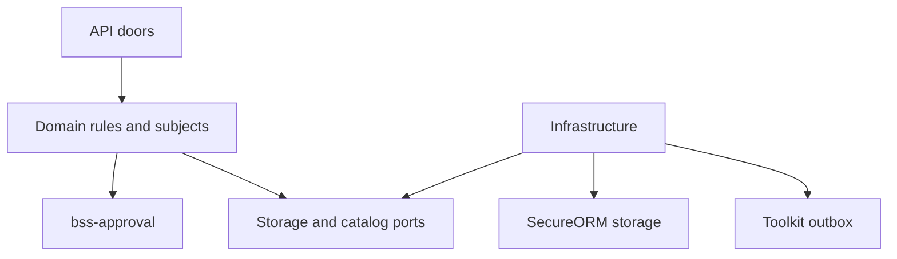
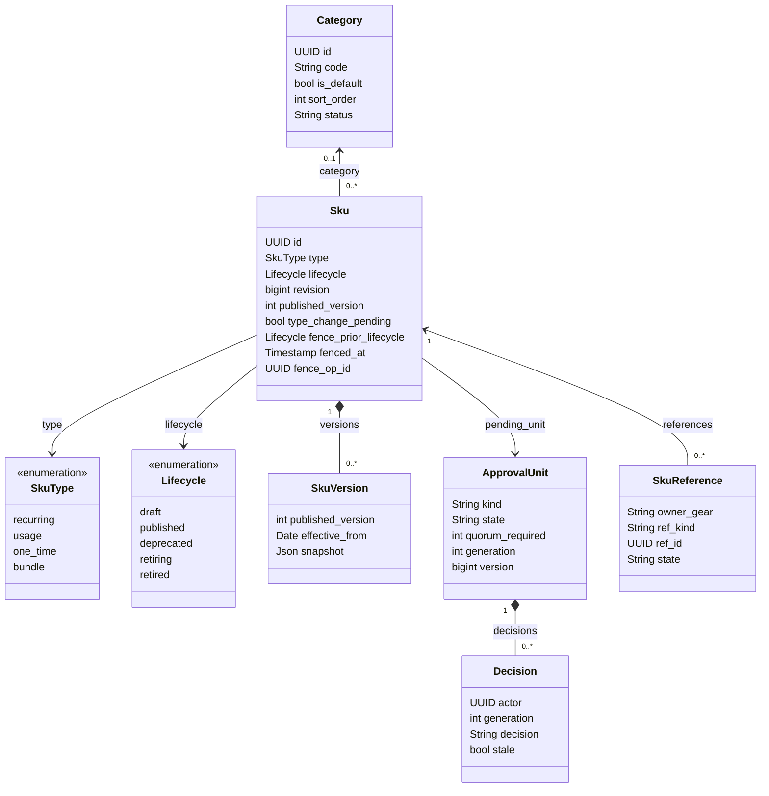
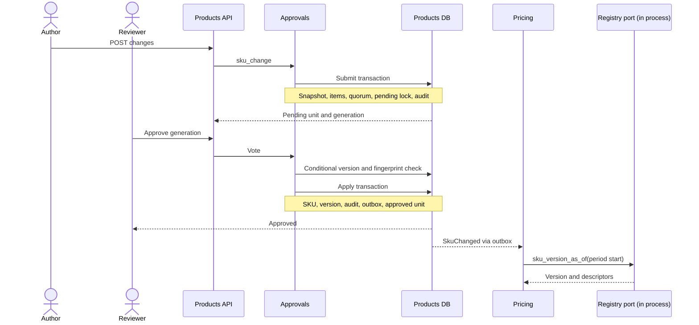
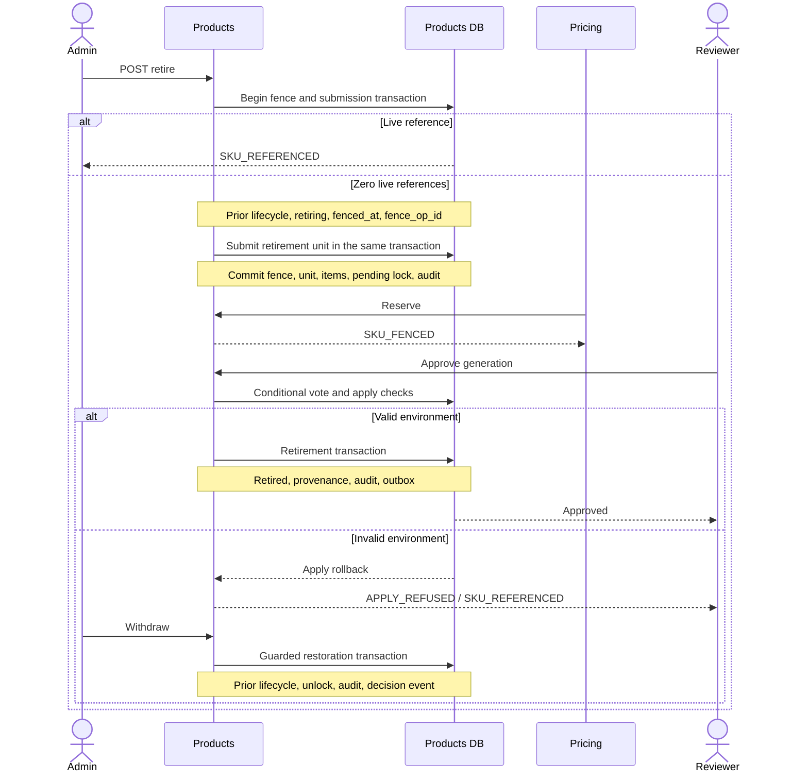
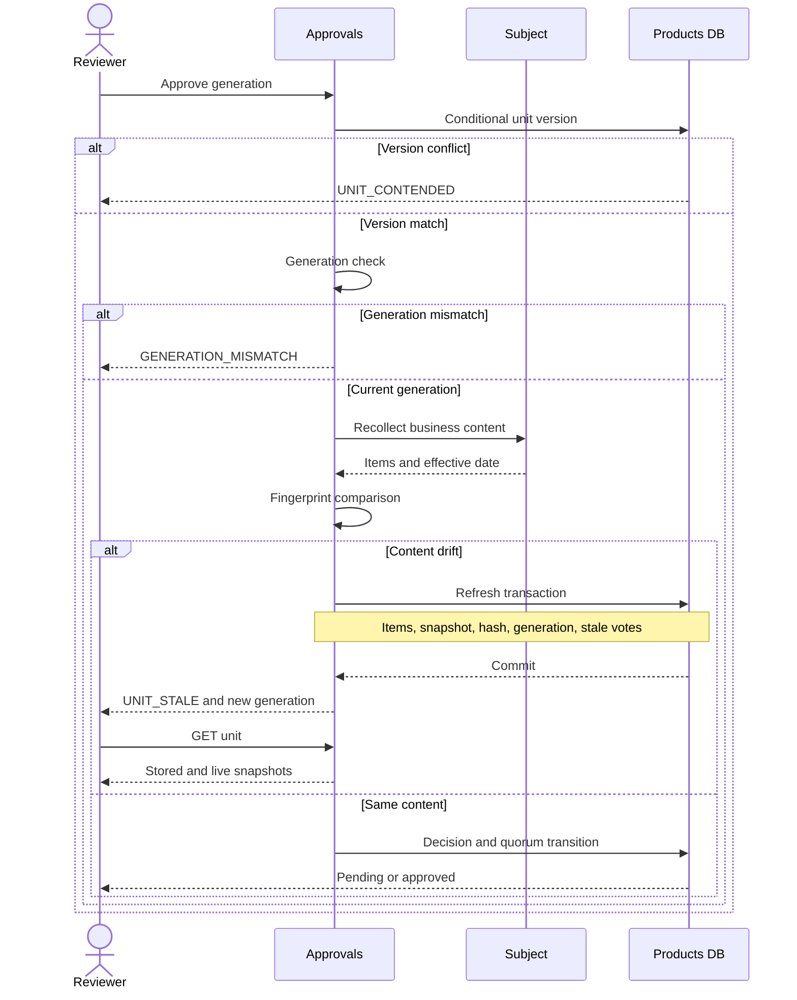
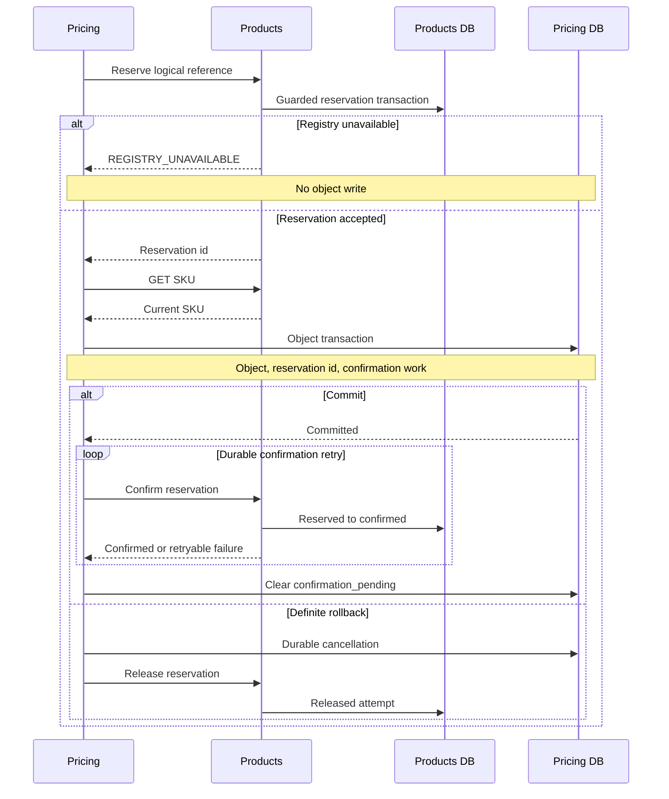

<!-- CONFLUENCE_TITLE: [BSS]: Products — Design (PriceBook rewrite) -->
<!-- Related: ./PRD.md, ./DECISIONS.md, ./design/ | Owners: BSS Product Catalog team -->

# DESIGN — Products: SKU Registry

- [ ] `p1` - **DESIGN implementation status**

<!-- toc -->

- [1. Architecture Overview](#1-architecture-overview)
  - [1.1 Architectural Vision](#11-architectural-vision)
  - [1.2 Architecture Drivers](#12-architecture-drivers)
  - [1.3 Architecture Layers](#13-architecture-layers)
- [2. Principles & Constraints](#2-principles--constraints)
  - [2.1 Design Principles](#21-design-principles)
  - [2.2 Constraints](#22-constraints)
- [3. Technical Architecture](#3-technical-architecture)
  - [3.1 Domain Model](#31-domain-model)
  - [3.2 Component Model](#32-component-model)
  - [3.3 API Contracts](#33-api-contracts)
  - [3.4 Internal Dependencies](#34-internal-dependencies)
  - [3.5 External Dependencies](#35-external-dependencies)
  - [3.6 Interactions & Sequences](#36-interactions--sequences)
  - [3.7 Database schemas & tables](#37-database-schemas--tables)
- [4. Additional context](#4-additional-context)
- [5. Traceability](#5-traceability)

<!-- /toc -->

## 1. Architecture Overview

### 1.1 Architectural Vision

Products owns two catalog entities, `Sku` and flat `Category`. A SKU is an independent definition;
publication, changes and retirement share one approval-unit shape from `bss-approval`. Append-only
`SkuVersion` snapshots preserve the descriptor history and its effective dates. Pricing owns books,
price book entries, prices and plans: it reads SKU type, descriptors and metering, binds the version in force at a period's
start, and consumes `SkuChanged`. Before writing a price book entry, plan item or sold-as relationship it reserves
that reference in Products, then confirms after its own commit. Products answers reference reads from
its own registry and fences against that registry in one local transaction (spec §2.2, §4, §6, §7.3,
§13; [DECISIONS](DECISIONS.md), P-D-185, P-D-189–194).

The requirements are [PRD](PRD.md). The content authority is
`docs/superpowers/specs/2026-09-24-pricebook-model-design.md` in the main checkout, referenced below as
“spec”. The amendments in §2.2 and decision 17 supersede earlier remote-count, row-lock and
approval-unit idempotency wording. This document specifies the phase 1 implementation, not its completion.

### 1.2 Architecture Drivers

Every PRD FR and NFR appears once in this allocation. Section references identify the design response;
§5 maps functional requirements to the four implementation slices.

| FR/NFR | Driver | Where satisfied |
| --- | --- | --- |
| `cpt-cf-bss-products-fr-sku-define` | Independent tenant-scoped identity and draft authoring | §3.1 Sku; §3.2 Registry; §3.7 unique code/name indexes |
| `cpt-cf-bss-products-fr-sku-type-frozen` | Live references exclude type changes | §2.1 Fence before count; §3.1 type fence; §3.7 registry predicates |
| `cpt-cf-bss-products-fr-sku-descriptors` | Governed, dated billing descriptors | §3.1 SkuVersion; §3.6 GL change |
| `cpt-cf-bss-products-fr-sku-metering` | Usage metering resolves at submit and apply | §3.1 type rules and the derived pin; §3.5 usage-type catalog and its derived sibling |
| `cpt-cf-bss-products-fr-derived-usage-type` | A derived meter is data with one evaluator, stored append-only, pinned by a usage SKU at its first publish | §3.1 derived usage declaration, type and pin; §3.3 derived usage type doors and the SKU doors' derived codes; §3.4 products-sdk; §3.5 the derived sibling and pricing's meter semantics; §3.7 derived usage tables |
| `cpt-cf-bss-products-fr-sku-bundle` | Bundle identity supports sold-as only | §3.1 bundle rules; §3.5 Pricing; §3.6 reserve/write/confirm |
| `cpt-cf-bss-products-fr-sku-lifecycle` | One approval shape governs lifecycle | §3.1 lifecycle; §3.2 Approvals; §3.6 fenced retirement |
| `cpt-cf-bss-products-fr-sku-versions` | Durable history determines dated truth | §3.3 dated read; §3.7 version table and ordering |
| `cpt-cf-bss-products-fr-sku-retire-fenced` | Retirement excludes new references and survives interruption | §3.1 fence state and recovery; §3.6 fenced retirement |
| `cpt-cf-bss-products-fr-category-flat` | At most one flat category per SKU | §3.1 Category; §3.3 category doors; §3.7 nullable category foreign key |
| `cpt-cf-bss-products-fr-approval-units` | Quorum, SoD and reviewed generations | §2.2 approval shape; §3.2 Approvals; §3.6 stale refresh; §3.7 four approval tables |
| `cpt-cf-bss-products-fr-events` | State, audit and events commit atomically | §3.2 Events; §3.4 outbox; §3.6 terminal transactions |
| `cpt-cf-bss-products-fr-read-model` | Scoped search, card, versions and reference summary | §3.2 Read model; §3.3 reads; §3.7 read indexes |
| `cpt-cf-bss-products-fr-reference-registry` | Durable reservations close the cross-gear race | §3.2 References; §3.6 reserve/write/confirm; §3.7 reference table |
| `cpt-cf-bss-products-fr-concurrency-idempotency` | Conditional writes and one replay contract | §2.2 no row locks; §3.3 headers; §3.7 replay store |
| `cpt-cf-bss-products-nfr-authz` | Deny-by-default permissions and SoD | §3.3 permission mapping; §3.4 PolicyEnforcer; §3.2 Approvals |
| `cpt-cf-bss-products-nfr-audit` | Durable submission and terminal provenance | §3.2 Events; §3.6 stale decisions; §3.7 append-only audit |
| `cpt-cf-bss-products-nfr-tenant-isolation` | No cross-tenant reads, writes or key collisions | §3.4 SecureORM; §3.7 tenant keys and scoped child access |
| `cpt-cf-bss-products-nfr-two-backends` | Identical behavior on SQLite and Postgres | §2.2 two backends; §3.7 type mapping and transaction rules |

**Architecture decisions.** [ADR-0001](./ADR/0001-cpt-cf-bss-products-adr-no-product-entity.md) — `cpt-cf-bss-products-adr-no-product-entity`: the SKU is the catalog's unit; there is no Product entity, categories are flat, and a bundle SKU has no composition in this gear (§3.1).

### 1.3 Architecture Layers

`products-sdk` remains the public contract crate for typed clients, DTOs, errors and event payloads. It also holds
the derived usage declaration and its one pure evaluator (§3.1, P-D-230).
Within `products`, `contract` declares REST/OpenAPI, `api` implements authenticated doors, `domain`
owns SKU rules and the three approval subjects, and `infra` supplies repositories, migrations, outbox
and port adapters. Domain rules depend on ports; infrastructure implements them. `bss-approval` is a
shared library layer for approval rules and types, with a Products-owned store and subject implementations.



## 2. Principles & Constraints

### 2.1 Design Principles

#### One catalog entity

- [ ] `p1` - **ID**: `cpt-cf-bss-products-principle-one-entity`

The SKU is the commercial definition; Category only groups it. There is no Product parent, lifecycle
cascade, bundle composition or CatalogVersion freeze. SKU descriptors belong to dated versions and
Pricing copies them into period bindings (P-D-185–187, P-D-191; spec §4).

#### Fence before count

- [ ] `p1` - **ID**: `cpt-cf-bss-products-principle-fence-before-count`

A read-only count cannot authorize retirement or a type change. Acquire the fence using a conditional
write guarded by absence of live local references, in the same transaction that
submits its approval unit. Reserved and confirmed rows both count. Reserve performs the reciprocal
fence check in its own write transaction. The identifier names the barrier principle, not a remote
count after an unguarded fence (P-D-188–189, P-D-194; spec decision 17 and §13).

#### Business-content fingerprint

- [ ] `p1` - **ID**: `cpt-cf-bss-products-principle-business-content-fingerprint`

Fingerprint each item's proposed business content and the effective date. Exclude pending locks,
concurrency versions and other storage metadata. Re-collect before counting a vote; changed content
refreshes the unit and invalidates earlier-generation votes. Environment checks can refuse apply
without pretending the business content changed (P-D-192; spec §2.2, §6).

### 2.2 Constraints

#### Two backends

- [ ] `p1` - **ID**: `cpt-cf-bss-products-constraint-two-backends`

SQLite and Postgres implement the same schema invariants, approvals, versions and reference barrier.
Postgres reserve/fence transactions use serializable isolation; SQLite serializes writers. Retry a
Postgres serialization failure once and SQLite lock-upgrade failures through the same bounded retry
loop. Verify both storage tiers at phase gates; migrations start a new chain without deployed-data migration
(spec §2 decisions 1 and 10, §2.2, §6, §10). The chain is deployed, so a later schema change is a new
forward migration. It runs inside the toolkit runner's transaction, so a SQLite rebuild of a parent table
rebuilds its children too and uses no PRAGMA (P-D-196).

#### One approval shape

- [ ] `p1` - **ID**: `cpt-cf-bss-products-constraint-approval-shape`

Use `bss-approval` for `sku_publish`, `sku_change` and `sku_retire`, with Products-owned tables.
Tenant policy supplies quorum with per-kind overrides; a missing `'*'` row means quorum 1.
No materiality threshold applies. Authors and submitters cannot approve their own unit even if both
permissions are held; category and policy edits are direct operations (P-D-190; spec §6, §14).
A draft belongs to its author: only its creator edits or deletes it (403 `NOT_DRAFT_AUTHOR` for anyone else), so every item's author is the one who wrote its content (pricing D-404). Only a never-published draft is deleted (`DELETE /skus/{id}`, P-D-206).

#### No database row locks

- [ ] `p1` - **ID**: `cpt-cf-bss-products-constraint-no-row-locks`

SecureORM exposes no `FOR UPDATE`. Every unit mutation is conditional on the observed `version` and
increments it; a lost race returns `UNIT_CONTENDED`. Pending ownership is acquired conditionally on
`pending_unit_id IS NULL` and the observed SKU revision, or submit rolls back with `ROW_LOCKED_PENDING`.
A pending lock is business ownership, not a database row lock (P-D-192; spec §2.2, §6).

## 3. Technical Architecture

### 3.1 Domain Model

| Type | Fields and invariants |
| --- | --- |
| `Sku` | Tenant, id, code, name, type, optional category (null when absent, no default fallback; P-D-196), description, sellable, lifecycle, revision (the concurrency version), published_version, descriptors, billing_timing, usage_type_ref, unit, pending_unit_id and approved_by_unit_id. Code and name are separately unique per tenant. Creator attribution supplies approval-item `created_by`. A retired SKU may carry the archive mark `archived_at`/`archived_by` (P-D-263): a mark, not a lifecycle; the SKU list hides it by default. |
| `SkuType` | `recurring`, `usage`, `one_time`, `bundle`. A priced SKU's type determines charge kind. Published/deprecated type changes are fenced against live references. Drafts cannot be reserved and change type without fencing. |
| `Lifecycle` | `draft`, `published`, `deprecated`, `retired`. Publish takes draft to published; change governs published/deprecated content and the published ↔ deprecated edges. A retire under review keeps the lifecycle and sets `retire_pending` (P-D-248). A dated change waits in `lifecycle_next` until its date (P-D-249). A half-set pair is a corrupt row. A filter uses an OR of the due next and the stored lifecycle. A text function on `lifecycle` (`contains`, `startswith`, `endswith`) is an `in` over the tokens its text matches, case-sensitively (P-D-264). Retired is terminal. A never-published draft is deleted, never retired (P-D-206). |
| `Category` | Tenant, id, code, name, is_default, sort_order, active/retired status and concurrency version. A retired category may carry the archive mark `archived_at`/`archived_by` (P-D-263), not a status; the category list hides it by default. At most one category per SKU, no parent. A SKU in `draft`, `published`, `deprecated` or `retiring` blocks category retirement; a retired SKU and a SKU without a category block none (P-D-208). |
| `SkuVersion` | Tenant, sku_id, published_version, effective_from, snapshot. Immutable history appended by publication and every applied change. |
| `ApprovalUnit` | Shared crate type: kind, subject reference, state, quorum, generation, snapshot/hash, date, submitter, decision metadata and concurrency version. |
| `Decision` | Shared crate type: unit, actor, generation, approve/reject, note, timestamp and stale flag. One vote per actor per generation. |
| `SkuReference` | Tenant, id, sku_id, owner_gear, price_book_entry/plan_item/sold_as kind, ref_id, reserved/confirmed/released state, timestamps, released_by and release_reason. Released attempts remain recorded. |
| `DerivedUsageDeclaration` | One version of a derived usage type (P-D-229, P-D-230), in `products-sdk`'s `derived` module: output unit, granularity (an hour), at least one raw input (name, GTS ref at its exact version, granule fold, a hold bound for a time-weighted input, unit), a formula over them, output scale and rounding. One input may be the identity wrapper of a raw meter (P-D-251). Stored per version with its digest (P-D-231). |
| `DerivedUsageType` | Tenant, id (UUID v7), code (`^[a-z0-9][a-z0-9._-]{0,63}$`, unique per tenant), name, creator and creation time, and versions 1, 2, … each holding one immutable declaration and the SHA-256 of its canonical bytes. No lifecycle and no approval of its own (O-1); the meter id of version `n` is `products.derived/<code>@<n>` (P-D-231). |

A usage SKU needs both `usage_type_ref` and `unit` at publication; submit and apply resolve the reference.
Metering fields are usage-only. Bundles reject metering, have no composition, and can only be sold as a
Pricing plan, never priced or included as a plan item (P-D-184–185).

**The derived usage declaration** (P-D-229, P-D-230). The `derived` module of `products-sdk` holds the declaration, its
grammar and its one evaluator. It is pure (no I/O, serde or hashing), so Rating evaluates through the function Products
validates with:
- `validate` refuses a declaration with one `DeclarationError` variant per rule: an unknown, unused or duplicate input, no
  inputs, a derived input, a division by zero, a `Max` or `Min` of fewer than two operands, a formula deeper than 32
  or of more than 256 nodes, a scale above 12, a hold missing on a time-weighted input, present elsewhere or outside
  1..=86,400 seconds, an input name off its pattern, and an empty or over-cap unit or input ref. Its walk is iterative.
- `evaluate` applies the formula to one granule's folded input quantities, keyed by input name, with checked decimal
  arithmetic, and rounds and normalizes the result; every failure is an `EvalError`, never a panic. `evaluate_window` sums
  a window's granule outputs, so the formula applies per granule and never to the window's summed inputs.
- `canonical_bytes` is the declaration's deterministic encoding (canonical JSON under a domain tag, decimals normalized,
  inputs in name order). The runtime hashes it and stores the digest.
- `MeterId` parses and formats `products.derived/<code>@<n>` and gives pricing's `(usage_type_id, version)` pair.

**The derived usage type** (P-D-231). The gear stores each type and its append-only versions (§3.7) and serves them
(§3.3). A version stores the declaration as the doors serve it and its digest, taken once at the write through `aws-lc-rs`;
every read answers the stored digest. A write judges the declaration (the SDK's rules and the wire shape's, each refusal 400
`DERIVED_DECLARATION_INVALID` naming its rule), then resolves each input through the `UsageTypeCatalog` port as the
caller, as a usage SKU's publish does (P-D-184, P-D-207). Products answers pricing's meter semantics for each version
(§3.5, P-D-233), so a pricing usage entry can name a derived meter.

**The derived pin** (P-D-232). A usage SKU names a derived version by `usage_type_ref = "products.derived/<code>@<n>"`.
The derived check comes first at the draft doors, at the resolution a submit or an approve makes, and in the publish rule:
the gear reads the tenant's version from its own store, before the unconfigured catalog's early answer and before any
catalog call, so the catalog is never asked for a derived ref. The ref binds when the tenant holds that version and the
SKU's unit, when named, is its output unit: otherwise 400 `DERIVED_USAGE_TYPE_UNKNOWN` (one answer for an unknown code or
version, another tenant's type and a non-canonical id) or `DERIVED_UNIT_MISMATCH`. A draft may move its pin and its unit.
A published usage SKU keeps both (P-D-258), raw or derived, except one move (P-D-251): a raw GTS ref may become
`products.derived/<code>@<n>` when that stored version wraps the raw meter — exactly one input, that ref whole-string,
the identity formula, and the same unit, which the change does not move. `metering_moves` refuses every other move of
the ref or the unit, and a type change away from usage, at the change door before any catalog is asked (400), at submit
(400) and at apply (409), `METERING_IMMUTABLE`: the field is `usage_type_ref` when the ref moves and `unit` when only
the unit moves. A new formula version is sold through a new usage SKU (M1).

The `sku` row holds the latest applied content, possibly future-effective. `revision` is the SKU concurrency
version for ETag, If-Match and compare-and-swap; `published_version` identifies each published
snapshot. A publish is effective immediately. A change defaults
`effective_from` to today and rejects a past requested date at submit. At apply, the version and
SkuChanged carry `max(requested_effective_from, apply_date)`; the unit snapshot retains the requested
date. The applied date cannot precede the latest stored version date (VERSION_ORDER); equal dates
are allowed and the higher published version wins. Consumers use the dated read, not the current SKU row (P-D-191).

Fence state on `Sku` comprises `type_change_pending`, `fence_prior_lifecycle`, `fenced_at` and
`fence_op_id`. Retirement stores the prior lifecycle before setting `retiring`; type change sets
`type_change_pending`. Both reject new reservations. Retry with a fence but no pending unit resumes
by rechecking the local registry and submitting. An orphan older than `fence_ttl_minutes` (a deployment
setting, P-D-209) is reverted
by the next SKU request or explicit unfence; a pending unit's fence cannot be cleared this way.
Reject/withdraw clears pending ownership and fence metadata in one conditional write guarded by unit
id and fence operation id, restoring the prior lifecycle. Successful apply clears fence metadata and
pending ownership, retains `approved_by_unit_id`, and installs the result; retired SKUs remain unavailable
for new references. Apply failure rolls back the apply transaction and leaves the committed fence intact
(P-D-189, P-D-194).



### 3.2 Component Model

| Component | Responsibility | Collaborators |
| --- | --- | --- |
| Registry — `cpt-cf-bss-products-component-registry` | SKU/category authoring, uniqueness, type and metering rules, lifecycle ownership | Approvals, References, usage-type catalog |
| Approvals — `cpt-cf-bss-products-component-approvals` | Three subjects, policy, generation-aware votes, conditional unit store, apply and unlock | Registry, Versions, Events; `bss-approval` |
| Versions — `cpt-cf-bss-products-component-versions` | Append snapshots on publish/change and resolve dated history | Approvals, Read model |
| References — `cpt-cf-bss-products-component-references` | Local reservation registry, reciprocal fence checks, confirm/release and force-release | Registry, Pricing owner, Events |
| Read model — `cpt-cf-bss-products-component-read-model` | Scoped list/search, SKU card, local reference summary, dated reads and retained browse transport | Registry, Versions, References |
| Events — `cpt-cf-bss-products-component-events` | Audit and outbox writes in state transactions; outbound domain and approval events | All mutating components, toolkit-db outbox |

Component definition sites:

- [ ] `p1` - **ID**: `cpt-cf-bss-products-component-registry`
- [ ] `p1` - **ID**: `cpt-cf-bss-products-component-approvals`
- [ ] `p1` - **ID**: `cpt-cf-bss-products-component-versions`
- [ ] `p1` - **ID**: `cpt-cf-bss-products-component-references`
- [ ] `p1` - **ID**: `cpt-cf-bss-products-component-read-model`
- [ ] `p1` - **ID**: `cpt-cf-bss-products-component-events`

The approval subject implements `collect`, `validate_submit`, `lock`, `snapshot`, `apply` and `unlock`.
Submit validates, records snapshot/items/quorum and conditionally acquires pending ownership, all in
one transaction with its audit row. Quorum zero applies immediately, records an approved unit with
`decided_at = submitted_at`, and creates no decisions. Otherwise, approve/reject must name the reviewed
generation; stale generation is refused before counting any vote. Re-collection and fingerprint comparison
precede voting. Approvals below quorum stay pending; quorum applies atomically with the terminal state.
One reject closes the unit and requires a note; only the submitter can withdraw. Every terminal path
clears pending ownership and emits audit plus `ApprovalUnitDecided`. Content drift commits a refresh;
environment failure returns `APPLY_REFUSED` and rolls back (P-D-190, P-D-192–193; spec §6).

### 3.3 API Contracts

Routes are relative to `/bss-products/v1`. Fields and query parameters use snake_case, including
`effective_from`, `ref_id` and `reservation_id` (P-D-191 supersedes the older PRD spelling); the dated version
read takes `date` at its own path (P-D-214).
Every closed set on a response schema is an enum of exactly its stored tokens (P-D-217): a SKU's `type`,
`lifecycle` and `billing_timing`, a category's `status`, the history's `from_lifecycle` and `to_lifecycle`, a
unit's `state`, a decision, a vote's `outcome`, and a reference's `kind` and `state`. A stored token outside its
set is a 500 (`CorruptRow`). Request fields keep `string`, so each door keeps its `VALIDATION` refusal; the
history's `action` and `unit_kind`, a unit's `kind` and `ref_type`, a reference's `owner`, a usage type's
`kind`, the picker's `source`, the `/browse` envelope and a derived usage declaration's tokens (stored as JSON, served as
written, P-D-231) stay `string`.
Responses use toolkit RFC-9457 `Problem` with domain `code`, `field` and `message`; stale-generation
responses additionally expose the current generation. All doors use authenticated OperationBuilder
registration and standardized errors. `GET /skus`, `GET /skus/counts`, `GET /derived-usage-types` and
`GET /categories` answer 304 when `If-None-Match` matches a weak ETag of the JSON body, and send
`Cache-Control: private, no-cache` (P-D-261). The derived-type list names its creators, so it revalidates like the
others; raw `GET /usage-types` carries no names and keeps `private, max-age=60` (P-D-247).
Every actor id a read shows (`created_by`, `actor`, `submitted_by`) carries a sibling `<field>_name`: the current name
through Account Management's user read, under the caller's own rights, resolved once per answer (ids deduplicated,
chunks of 200, at most four at once, one 2 s budget). It is null when no name is available now, the system's own acts
and pricing's system actor read "System", and no write answer names anyone. Names are never stored or cached; the
weak tags cover them (P-D-262).

| Surface | Routes | Contract |
| --- | --- | --- |
| SKU authoring | `POST /skus`; `PATCH /skus/{id}`; `DELETE /skus/{id}` | Create independent draft, `category_id` optional; patch drafts only (`category_id: null` clears it); reject edits while pending. A `usage_type_ref` of the form `products.derived/<code>@<n>` is judged from the tenant's derived store, never the catalog: 400 `DERIVED_USAGE_TYPE_UNKNOWN` or `DERIVED_UNIT_MISMATCH`; a draft may move its ref and its unit (P-D-232, P-D-258). Delete only a never-published draft, by its author, under `If-Match`: 204 and an audit row; `SKU_NOT_DRAFT`, `ROW_LOCKED_PENDING`, `SKU_REFERENCED` (P-D-206). |
| Usage-type picker | `GET /usage-types?q&kind&limit&cursor` | products:author; the raw GTS usage types a derived usage type names as inputs, read as the caller. It does not feed the SKU form (P-D-259). Derived usage types have their own list, `GET /derived-usage-types` (P-D-232): `{ source, items, page_info }`; 403 when the catalog refuses the caller, 501 unconfigured, 503 unreachable, 200 `[]` when empty. `q` is a case-insensitive substring of the id; over the usage collector products applies it, asking the collector with `kind eq` only, over at most 1000 types of that kind in id order, with a cursor bound to `q` and `kind` (400 when replayed with others); past 1000, 503 `USAGE_TYPE_CATALOG_TOO_LARGE` (P-D-207). A page answers `Cache-Control: private, max-age=60`, read as the caller (P-D-247). |
| SKU reads | `GET /skus?$filter&$orderby&$top&cursor&q&priced&in_plan&priced_in&not_priced_in&not_in_revision`; `GET /skus/counts?$filter&q&priced&in_plan&priced_in&not_priced_in&not_in_revision`; `GET /skus/{id}` | Tenant-scoped list on the toolkit's OData (P-D-210): `$filter` over id, code, name, lifecycle, type, category_id (`eq null`: none) and pending_unit_id (`ne null`: in review). `lifecycle` compares the lifecycle in force with `eq`, `ne` or `in`, or with `contains`, `startswith` or `endswith` as the `in` of the tokens the text matches (none matching keeps nothing), at the top level or joined by `and`; under `or` or `not` it is 400 (P-D-249, P-D-264). `$orderby` code, name or updated_at, tie-break id; `$top`/`limit` 50, clamped at 200; `cursor` from `page_info`; `q` a literal case-insensitive substring of code, name, unit, usage type and GL code; `priced` and `in_plan` keep or drop pricing's sets from the port's `usage_sets`, 403 `USAGE_FORBIDDEN` or 503 `USAGE_UNAVAILABLE` when it cannot answer (P-D-212). The pickers: `priced_in` or `not_priced_in` (a book id, at most one of the two) and `not_in_revision` (a revision id) keep or drop the scope's set from one `sku_ids_in` call per key, a revision under pricing plan read too, failing the read alike (P-D-246). `$filter=id in (...)` is the multi-id read (`$top` 200, the 8 KiB filter). Other keys, `$select` and `$count` are 400. The tab counts `{ all, draft, published, deprecated, retired, in_review, archived }` narrow alike, without `$filter`'s top-level `lifecycle` terms, text functions included, and `archived` terms (P-D-211, P-D-248, P-D-264); an archived SKU counts in `archived` only (P-D-263). `$filter` also names `retire_pending`, and `archived`: an archived SKU is left out of the list and the pickers unless `$filter` asks `archived eq true`, which lists only the archived ones (P-D-263). SKU card. Each list item and the card carry `usage` { entries, currencies, prices { approved, pending, draft }, plans } from pricing's `SkuUsageV1` port, one call per page, or `null` when the port is absent, refuses or cannot answer; the read never fails for it (P-D-197). |
| SKU history | `GET /skus/{id}/history?$top&cursor` | products:read; the SKU's audit rows and its approval units' rows, in the order the acts wrote them (`audit_id`, a UUID v7 minted in the act's transaction), as `Page<ProductsSkuHistoryEntry>`: `{ at, actor, action, from_lifecycle, to_lifecycle, unit_id, unit_kind, note }`; `$top`/`limit` 50, clamped at 200; other keys 400; 404 for a foreign SKU or a deleted draft (P-D-213). |
| Versions | `GET /skus/{id}/versions`; `GET /skus/{id}/versions/as-of?date=<date>` | The history is always an array, oldest first (empty before the first publication); any query key is 400. The dated read answers one version: greatest effective_from not after `date`, then greatest published_version; 404 `NO_VERSION_IN_FORCE` before the first version; a missing or malformed `date` is 400 (P-D-214). |
| Publication | `POST /skus/{id}/submit` | Submit `sku_publish`. An optional body `{ note }` carries the submitter's note (P-D-219). |
| Change | `POST /skus/{id}/changes` | Published/deprecated content and/or lifecycle proposal; effective_from defaults to today; submit `sku_change`; an optional `note` (P-D-213, P-D-219). A published usage SKU keeps its usage type and its unit: a change of either, a clear of either, or a type change away from usage is 400 `METERING_IMMUTABLE` before any catalog is asked, and again at apply (409), except a raw meter moving onto the identity wrapper of that meter in the same unit (P-D-258, P-D-251). |
| Retirement/recovery | `POST /skus/{id}/retire`; `POST /skus/{id}/unfence` | Guarded fence and `sku_retire` submission in one transaction, with an optional body `{ note }` (P-D-219); unfence only expired orphans. |
| Archive | `POST /skus/{id}/archive`; `POST /skus/{id}/unarchive`; `POST /categories/{id}/archive`; `POST /categories/{id}/unarchive` | Set or clear the archive mark under author, at the row's ETag (If-Match), with an audit row (`sku.archive`, `sku.unarchive`, `category.archive`, `category.unarchive`); the revision or version moves. Only a SKU whose lifecycle in force is retired is archived (409 `SKU_NOT_RETIRED`), only a retired category (409 `CATEGORY_NOT_RETIRED`); a stale tag is 409 `STALE_REVISION`; a row already in the asked state is answered unchanged. The 200 declares the `ETag` the next write sends as If-Match. Reads by id, `/browse`, the consumer reads and pinned facts ignore the mark (P-D-263). |
| Reference reads | `GET /skus/{id}/references` | products:read; live rows by default; include_released=true adds history with released_at, released_by, forced and release_reason. Live summary retains price_book_entries/plans/reserved totals and adds by_owner maps keyed by owner then kind, plus each owner’s reserved subset. |
| Reserve | `POST /skus/{id}/references/reserve { owner, kind, ref_id }` | 201 `{ reservation_id }`, or 200 existing live logical reservation; fenced SKU refuses a new reservation. |
| Confirm | `POST /references/{id}/confirm` | 200 also when already confirmed; released rows cannot reactivate. |
| Release | `DELETE /references/{id}` | Owner after durable cancellation/deletion; operator requires `force: true` and reason, with actor attribution and event. |
| Categories | `GET /categories?$filter&$orderby&$top&cursor`; `GET /categories/{id}`; `POST /categories`; `PATCH /categories/{id}`; `POST /categories/{id}/retire` | The reads answer `sku_count`, the SKUs that are not retired naming the category, from one grouped count; the list pages on the toolkit's OData in `sort_order`, then `code`, 200 to a page (P-D-215). Direct edits without approvals; refuse retirement while a SKU that is not retired points at it (`CATEGORY_IN_USE`); a retired category is `CATEGORY_RETIRED` (P-D-208). `is_default: true` on POST or PATCH moves the tenant's one default in the same write: the previous holder is cleared and audited; a lost race is 409 `CATEGORY_DEFAULT_TAKEN` (P-D-218). A retired category never becomes the default, and retiring the default clears it, audited, in the same transaction (P-D-220). The list's `$filter` names `archived`: an archived category is left out unless asked `archived eq true` (P-D-263). |
| Approval reads | `GET /approval-units?state&kind&ref_id&limit&cursor&$orderby`; `GET /approval-units/counts?state&kind&ref_id`; `GET /approval-units/{id}` | Queue and detail; the queue pages in submission order (P-D-224), newest first with `$orderby=submitted_at desc`, the id breaking a tie the same way and the cursor carrying its order, and the counts count the queue's narrowing by state and kind in one grouped statement, read outside any transaction (P-D-227); both take a kind products records, else 400 `VALIDATION` on `kind`; the list refuses any other query key (P-D-254), and the repository reads a stored unit's kind through the same set (P-D-227); every unit read and receipt carries `caller_can_approve`, `caller_can_reject` and `caller_can_withdraw` (P-D-255): approve is the engine's rule and the approve grant, reject is that grant with the unit pending and no vote by the caller in this generation, and withdraw is the submitter with the unit pending and the submit grant; each request compiles those grants once; the queue reads its page's item authors in one more statement (P-D-228); detail includes stored snapshot and live recomputation, `impact_live: null` once a rejected or withdrawn draft was deleted (P-D-206). Every unit carries `submit_note`: the note its submit, change or retire sent, or null (P-D-219). |
| Decisions | `POST /approval-units/{id}/approve`; `POST /approval-units/{id}/reject`; `POST /approval-units/{id}/withdraw` | Approve/reject carry generation; reject requires note; withdraw is submitter-only. |
| Approval policy | `GET /approval-policy`; `PUT /approval-policy`; `DELETE /approval-policy/{kind}` | Tenant default quorum and optional per-kind overrides; missing default is quorum 1. The GET answers a strong content `ETag`; the PUT requires it as `If-Match` (missing or malformed 400, stale 409 `STALE_REVISION`), authorization first (P-D-205). The DELETE removes one kind's override under the same `If-Match`, so the kind follows the default again; the default itself is 400 `POLICY_DEFAULT_REQUIRED`, and a kind without an override is 404 (P-D-216). The fence TTL is the deployment setting `fence_ttl_minutes`; no tenant settings door exists (P-D-209). |
| Derived usage types | `POST /derived-usage-types`; `POST /derived-usage-types/{code}/versions`; `GET /derived-usage-types?$top&cursor`; `GET /derived-usage-types/{code}`; `GET /derived-usage-types/{code}/versions/{n}` | Writes ask `author` on `derived_usage_type`, reads `sku:read` (O-3). Create `{code, name, declaration}` answers version 1, and a new version `{declaration}` version n + 1 (404 for an unknown code, asked before the catalog; 409 `CONTENDED` on a lost number race); earlier versions never change (O-1). Refusals: 400 `VALIDATION` or `FIELD_TOO_LONG` on the code or name, `DERIVED_DECLARATION_INVALID` naming the rule, `USAGE_TYPE_UNRESOLVED` per input; 403 `USAGE_TYPE_FORBIDDEN`; 409 `DERIVED_CODE_TAKEN`; 503 `USAGE_TYPE_UNAVAILABLE`, an unconfigured catalog included. The list pages by code, 50 to a page and at most 200, with a cursor. Each item carries `latest_version` and `latest`, the latest version in the version-read shape (`version`, `declaration` with its inputs and formula, `digest`, `meter_ref`, `canonical_unit`, `accrual_policy_version`, `created_by`, `created_at`), from one grouped read of the page (P-D-257); other keys are 400. The type read lists its versions' headers; the version read answers the declaration, the stored `digest`, `meter_ref` `{usage_type_id: "products.derived/<code>@<n>", version: "<n>"}`, `canonical_unit` and `accrual_policy_version` `derived-v1:<digest>`; a non-canonical `n` is 404 (P-D-231). |
| Retained browse | `GET /bss-products/v1/browse` (absolute) | Preserve `ProductCatalogClientV1` transport until phase 2; serve Published and Deprecated with lifecycle status and deprecated flag; drafts, retiring and retired are absent. |

SKU reads/writes expose `ETag` from `revision`, its concurrency version, which every change of the row moves, an applied
lifecycle change (a retirement included) as much as a content write; categories use `version`; the approval
policy a content tag (P-D-205). Every PATCH, the draft DELETE, the policy PUT and the policy's override DELETE require `If-Match`; compare-and-swap guards the write and increments the version. Stale versions return
409 `STALE_REVISION`; missing required preconditions use the toolkit precondition response. Every POST
accepts optional `Idempotency-Key`, with replay keyed by tenant, concrete endpoint and client key and retained
for the configured hours, 24 by default (P-D-198).
Authenticate and authorize first, then perform a read-only replay lookup before external resolution.
Claim, mutation and receipt commit in the same transaction for every POST, including decisions and
reference reserve/confirm. A keyed approval replays after the decision; a keyed reserve replays its
original attempt even after release. Policy PUT remains If-Match only. There is no approval-unit
idempotency column; reserve also deduplicates live logical references independently (P-D-193–194).

Permissions deny by default: `products:read` covers scoped reads, `products:author` draft/category and
reference mutations, the draft delete, the usage-type picker and orphan recovery, `products:submit` lifecycle proposals and withdrawal,
`products:approve` decisions, and `products:settings` approval-policy writes and reads. A derived usage type is the
resource `derived_usage_type` with one permission, `author`, for its two writes; its reads take `sku:read` (P-D-231, O-3). Reference operations also
check the authenticated owner gear; operator force-release requires explicit operator authorization and
reason. SoD and submitter checks apply in the domain regardless of grants (spec §6, §7.3).

| Error codes | HTTP / meaning |
| --- | --- |
| `SKU_CODE_TAKEN`, `SKU_NAME_TAKEN` | 409; tenant identity conflict |
| `CATEGORY_DEFAULT_TAKEN` | 409; a concurrent write made another category the default between this move's clear and its set (P-D-218) |
| `DERIVED_CODE_TAKEN` | 409; the tenant has a derived usage type with this code (P-D-231) |
| `DERIVED_DECLARATION_INVALID` | 400 on `declaration`, the detail led by the rule the SDK or the wire shape refused (P-D-231) |
| `DERIVED_USAGE_TYPE_UNKNOWN`, `DERIVED_UNIT_MISMATCH` | 400 on `usage_type_ref` or `unit` at a SKU's draft save, submit or change; 409 at apply. The tenant holds no such derived version, or a sent unit is not its output unit; names the SKU (P-D-232, P-D-259) |
| `DERIVED_USAGE_TYPE_REQUIRED` | 400 on `usage_type_ref` before any catalog is asked. A usage SKU's ref is not a derived usage type; names the SKU (P-D-259) |
| `METERING_IMMUTABLE` | 400 at a change's submit, 409 at its apply; the change moves a published usage SKU's ref or unit, or changes its type away from usage, other than a raw meter onto the identity wrapper of that meter in the same unit; on `usage_type_ref` or `unit`; names the SKU (P-D-258, P-D-251). Replaces `DERIVED_PIN_IMMUTABLE`. |
| `NOTE_TOO_LONG` | 400; a submitter's note over 2000 characters on submit, changes or retire, or a vote's note on approve or reject; nothing is written (P-D-219, P-D-225) |
| `FIELD_TOO_LONG` | 400 on the field; a text over its cap on a SKU create, draft PATCH or change, a category create or rename, or a forced release's reason; nothing is written (P-D-225) |
| `SKU_TYPE_FROZEN`, `SKU_REFERENCED`, `SKU_FENCED`, `REFERENCE_RELEASED` | 409; live reference, fence or terminal reservation conflict |
| `ROW_LOCKED_PENDING`, `STALE_REVISION`, `VERSION_ORDER`, `CATEGORY_IN_USE` | 409; pending ownership, concurrency, timeline or category reference conflict (a SKU that is not retired names the category, P-D-208) |
| `SKU_NOT_DRAFT`, `CATEGORY_RETIRED` | 409; a delete of a SKU that was ever published (P-D-206); a retirement of a retired category, an assignment to one, or `is_default: true` on one (P-D-196, P-D-208, P-D-220) |
| `UNIT_CONTENDED`, `UNIT_ALREADY_DECIDED`, `DUPLICATE_VOTE` | 409; conditional unit write, terminal state or duplicate generation vote |
| `CONTENDED` | 409; a transaction still contended after its bounded retries (an approval-unit door answers `UNIT_CONTENDED`) |
| `GENERATION_MISMATCH`, `UNIT_STALE` | 400 with current/new generation; mismatch refuses vote, stale refresh commits |
| `SOD_VIOLATION`, `NOT_SUBMITTER`, `NOT_DRAFT_AUTHOR` | 403; author/submitter approval, unauthorized withdrawal, or a SKU draft edited or deleted by anyone but its author |
| `USAGE_TYPE_FORBIDDEN` | 403; the usage-type catalog, read as the caller, refused the caller at submit or approve (P-D-207) |
| `SYSTEM_ACTOR_RESERVED` | 403 at every door, before the PDP; the caller's context carries pricing's system actor (the subject type `bss-pricing.system` or the id `PRICING_SYSTEM_ACTOR`), which acts in-process only (P-D-222) |
| `USAGE_NEEDS_METER`, `USAGE_TYPE_UNRESOLVED`, `BUNDLE_HAS_NO_METER` | Validation refusal; submit's failed subject checks are 400 with no unit created. Draft unresolved catalog reference is 400 per P-D-184. |
| `APPLY_REFUSED` | Apply failure with domain reason, including SKU_REFERENCED; transaction rolls back without success events |
| `NO_VERSION_IN_FORCE` | 404; date precedes first version |
| `SKU_RETIRING`, `SKU_DEPRECATED`, `ITEM_SKU_DEPRECATED` | Pricing-side adoption guards: a new price book entry refuses a retiring (`SKU_RETIRING`) or deprecated (`SKU_DEPRECATED`) SKU; in phase 3 a new plan revision refuses a deprecated SKU (`ITEM_SKU_DEPRECATED`) |
| `REGISTRY_UNAVAILABLE` | 503 from Pricing when reserve cannot succeed; Pricing writes nothing |

An unreachable configured usage-type catalog is 503 during publication validation; a catalog that refuses the
caller is 403 `USAGE_TYPE_FORBIDDEN` (P-D-207). The usage catalog's
authoring behavior is defined in §3.5; these codes do not turn a catalog non-answer into a draft-save outage.

### 3.4 Internal Dependencies

| Dependency | Design contract |
| --- | --- |
| `bss-approval` | Library types and state machine; Products implements subjects and the transactional Store. No shared cross-gear approval database. |
| toolkit-db / SecureORM | SecureConn and scoped transactions; PolicyEnforcer-derived AccessScope on all reads/writes, including audit, replay and child records. Conditional writes, no raw unscoped connection. |
| toolkit-db outbox | State, audit and outbox records share the same transaction; dispatch happens after commit, and the outbox's sequencer is woken only after it (P-D-221). No success event escapes a rollback. |
| toolkit REST / PolicyEnforcer | OperationBuilder, authenticated operations, RFC-9457 errors and deny-by-default resource/action checks. |
| products-sdk / ClientHub | Public SKU/version/catalog contracts, usage-type port, and the derived usage declaration with its pure evaluator (P-D-230); consumers resolve typed clients without importing gear internals. |

Outbound events are `SkuPublished`, `SkuChanged`, `SkuRetired`, `ApprovalUnitDecided` and
`ReferenceForceReleased`. Broker events follow this gear's camelCase convention. `SkuChanged` carries
`tenantId`, `skuId`, `changed`, `effectiveFrom`, `publishedVersion` and `actorRef`, with type id
`gts.cf.core.events.event.v1~cf.bss.products.sku_changed.v1~`. It identifies the committed version;
consumers read its snapshot separately. `ApprovalUnitDecided` carries `tenantId`, `unitId`, `kind`,
`state`, `generation` and `actors`. Every terminal decision, including reject, withdraw and quorum zero,
writes audit and the decision event; successful apply adds its domain event. Submission is audited
without an event unless quorum zero also applies. Stale refresh keeps stale votes but emits no successful
apply event (P-D-193; spec §6–§7.3).

### 3.5 External Dependencies

Pricing reads SKU/type/metering and dated descriptors, consumes `SkuChanged` to refresh its read model,
and owns durable confirmation work for its references. Its checks read many SKU heads in one
`skus_for_write` (P-D-245): an id the caller may not read is left out, and the caller is judged once. It uses Products' reference doors, including
sold-as reservations; Products has no `SkuReferences` remote-count port. Descriptor updates draft no
Pricing unit and require no book action. Pricing's reserve/write/confirm path arrives in phase 2
(P-D-194; spec §7.3, §13).

`UsageTypeCatalog` remains the pluggable resolution/listing port in `products-sdk`, with resolution
order and provenance: registered catalog, usage-collector adapter, then configured local-development
catalog or unconfigured mode. Resolution tests resolvability only. On draft save, a changed ref's
definitive unresolved answer is 400 `USAGE_TYPE_UNRESOLVED`; a catalog non-answer does not block save.
Submit and apply revalidate, fail closed for unresolved refs, and return 503 for an unreachable configured
catalog (P-D-184, carried from P-D-183 (backup); spec §4, §15). The catalog is read as the caller: a
catalog that refuses the caller is 403 `USAGE_TYPE_FORBIDDEN` at submit and approve, and does not block a
draft save; `GET /usage-types` serves the listing half of the port under products:author, so an author
needs usage-collector read granted with the role (P-D-207).

The port has a derived sibling (P-D-232): a `products.derived/<code>@<n>` ref names the tenant's derived usage type
version, which the gear reads from its own store (§3.7), first, at draft save, submit and apply. The catalog is never
asked for it, configured or not, and its picker lists GTS types only; derived types are listed by
`GET /derived-usage-types` (P-D-231).

Products answers pricing's meter-semantics port for its derived usage types (E1b, P-D-233). At its init it registers the
ClientHub's one `dyn UsageMeterSemanticsV1`, beside `PricingReferenceRegistry` and over the same runtime, not through
`#[toolkit::provides]`. A meter whose id carries the reserved `products.derived/` prefix is answered from the store, in the
caller's tenant (the store's key, beside `tenant_only()` of the `sku:read` scope, so a SKU `resource_id` does not filter the row): the version's output unit as `canonical_unit`, a `Sum` fold,
`derived-v1:<stored digest>` as `accrual_policy_version`, `source_integrated`, and the stored digest. A `version` that is not
canonical or disagrees with `@<n>` is 400 `METER_POLICY_MISMATCH`; an unknown code, version or tenant is one 400
`METER_VERSION_UNKNOWN`; a store failure is 503, a stored row that does not read is a data-loss 500 whose detail is `a stored derived meter row does not read` (the cause is logged and is not on the wire; pricing forwards that 500 and remaps every other provider 5xx to 503), and a denied `sku:read` 403. Every other meter answers exactly as an absent
provider does (`UNCONFIGURED_DEPENDENCY`). The raw-meter provider (E1a) is not built: when it exists, it registers under a
`products-sdk` trait that this dispatcher calls for every non-derived id.

`SkuUsageV1` is the second port in `products-sdk`, and pricing fills it (P-D-197; pricing D-428). Pricing
registers it in `ClientHub` at its init; Products resolves it at each `GET /skus` and `GET /skus/{id}`, calls
it once per list page on a task of its own and outside any transaction, and shows `usage: null` when it is
absent, refuses or cannot answer. The usage is display information: it never takes part in a fence, retirement
or type change, which stay on the local registry (P-D-188, P-D-194). The list's `priced` and `in_plan` filters
ask its `usage_sets` once per request, bind each set as one value, and fail the read (403 or 503) when the
port cannot answer them, never returning an unfiltered page (P-D-212). The picker keys ask its `sku_ids_in` once
per key, for one book or one plan revision, under the same rules; a revision's SKUs take pricing plan read too,
and a scope the tenant does not hold is the empty set (P-D-246).

This gear implements the approvals inbox's source port, `bss_approvals_sdk::ApprovalSourceV1`, and registers it at
init in the ClientHub as `dyn ApprovalSourceV1`, scoped `products` (P-D-250). The inbox gear asks it as the caller and
merges its pages with pricing's by P-D-227's order, `(submitted_at, id)`. The source calls this gear's own doors: the
list's read (`approval_units::page_of`) with a `CursorV1` it builds from the inbox's key, so the keyset is the pager's
compare; the counts door on the plain connection; the card door's read before its names (`approval_units::card`),
whose 404 is a miss and whose `impact_live` is the inbox's `subject_live`, so the inbox names the card in one lookup and
the source declares this gear's system actors to it (P-D-262, approvals AP-D-11); and the vote door through the approval-unit router under the gear's enforcer and the
platform's error layer, so the grant, the replay endpoint and the answer's bytes are the door's. A `sku_change` or
`sku_retire` unit's impact is pricing's `SkuUsage` of its SKU, from ONE `SkuUsageV1::usage` call per page, null when
the port refuses, cannot answer or is absent; never `usage_sets`. A kind products does not record, and any `book_id`,
are an empty page and zero counts, after `state` has been accepted (P-D-252). An unknown state is the list door's 400.

### 3.6 Interactions & Sequences

#### GL change

- [ ] `p1` - **ID**: `cpt-cf-bss-products-seq-gl-change`

The author proposes GL `4010-STOR` → `4012-STOR` from October 1. The diagram shows a quorum-one
approval; higher quorum commits intermediate votes without applying. The final transaction also
clears pending ownership and retains approval provenance. Pricing's existing period bindings remain
unchanged (PRD use case “Change a GL code”; P-D-190–191).



#### Fenced retirement

- [ ] `p1` - **ID**: `cpt-cf-bss-products-seq-fenced-retire`

Fence acquisition and submission commit in ONE transaction guarded by NOT EXISTS (live reference).
A fence found without a unit is resumed; an expired orphan is lifted.
The apply-reference check is defensive; ordinary reserve cannot pass the fence. Failure rolls back
only the apply transaction, preserving the pending unit and fence until reject/withdraw restores the
prior lifecycle (PRD use case “Retire a SKU”; P-D-189, P-D-194).



#### Stale refresh

- [ ] `p1` - **ID**: `cpt-cf-bss-products-seq-stale-refresh`

The generation supplied by a voter is checked inside the conditional unit transaction. A content
fingerprint change commits the refreshed snapshot/items/hash, increments generation and marks prior
decisions stale. The attempted vote does not count; reviewers read and vote again. Environmental
refusals instead roll back without a content refresh (P-D-192; spec §2.2, §6).



#### Reserve, write and confirm

- [ ] `p1` - **ID**: `cpt-cf-bss-products-seq-reserve-write-confirm`

Pricing's transaction stores the object, reservation id and confirmation work together. An unconfirmed
reservation remains live indefinitely; neither caller death nor a confirmation timeout releases it.
The same sequence covers price book entry, plan-item and sold-as references. Release follows durable cancellation
or removal; operator force-release is audited and evented so the owner can verify and re-reserve an
object that still exists. Products cannot detect a dishonest release beneath a live owner object
(P-D-194; spec §13).



### 3.7 Database schemas & tables

The following is the Postgres schema shape for the new migration chain. Logical names in spec §4 and
§6 gain the `products_` prefix in schema `bss`. SQLite drops `bss.`, maps UUID/timestamp/date/JSONB to
text and BYTEA to blob, preserving keys, checks, indexes and transaction behavior. SecureORM scopes
every table by tenant; approval items and decisions are accessed only through their scoped parent unit.
Tenant isolation uses SecureORM scoping and scoped reads of the parent category within the write
transaction; approval children are reached through the scoped unit. Foreign keys use entity ids.
Creator attribution on SKU is included so approval items can enforce author SoD.

The four approval tables implement spec §6 with the §2.2 correction: no `idempotency_key` column or
index on `products_approval_unit`. `common_effective_date` stores the SKU change's `effective_from`.
`'*'` is the required default policy row; if absent, runtime reads fail safe to quorum 1 (P-D-190).

```sql
CREATE TABLE bss.products_category (
    id uuid PRIMARY KEY,
    tenant_id uuid NOT NULL,
    code text NOT NULL,
    name text NOT NULL,
    is_default boolean NOT NULL DEFAULT false,
    sort_order integer NOT NULL DEFAULT 0,
    status text NOT NULL CHECK (status IN ('active', 'retired')),
    created_at timestamptz NOT NULL,
    updated_at timestamptz NOT NULL,
    version bigint NOT NULL DEFAULT 1,
    archived_at timestamptz, -- the archive mark of a retired category (P-D-263)
    archived_by uuid,
    UNIQUE (tenant_id, id),
    UNIQUE (tenant_id, code),
    -- A mark is whole or absent (P-D-263). SQLite: two triggers, insert and update.
    CONSTRAINT chk_products_category_archive_mark CHECK ((archived_at IS NULL) = (archived_by IS NULL))
);
-- At most one default per tenant (P-D-218), never a retired one (P-D-220, judged by the doors;
-- m20260928_000010 cleared the retired defaults stored before it, data only).
CREATE UNIQUE INDEX uq_products_category_default ON bss.products_category (tenant_id) WHERE is_default;

CREATE TABLE bss.products_approval_policy (
    tenant_id uuid NOT NULL,
    kind text NOT NULL CHECK (kind IN ('*', 'sku_publish', 'sku_change', 'sku_retire')),
    quorum integer NOT NULL CHECK (quorum >= 0),
    PRIMARY KEY (tenant_id, kind)
);

CREATE TABLE bss.products_approval_unit (
    id uuid PRIMARY KEY,
    tenant_id uuid NOT NULL,
    kind text NOT NULL CHECK (kind IN ('sku_publish', 'sku_change', 'sku_retire')),
    ref_type text NOT NULL,
    ref_id uuid NOT NULL,
    state text NOT NULL CHECK (state IN ('pending', 'approved', 'rejected', 'withdrawn')),
    common_effective_date date,
    quorum_required integer NOT NULL CHECK (quorum_required >= 0),
    generation integer NOT NULL DEFAULT 1,
    submitted_by uuid NOT NULL,
    submitted_at timestamptz NOT NULL,
    decided_at timestamptz,
    decided_note text,
    snapshot jsonb NOT NULL,
    snapshot_hash text NOT NULL,
    version bigint NOT NULL DEFAULT 1,
    -- m20260928_000009 (P-D-219): the submitter's note, ADD COLUMN, null before it.
    submit_note text,
    UNIQUE (tenant_id, id)
);
CREATE INDEX products_approval_queue
    ON bss.products_approval_unit (tenant_id, state, kind, submitted_at);

CREATE TABLE bss.products_approval_unit_item (
    unit_id uuid NOT NULL REFERENCES bss.products_approval_unit(id),
    item_type text NOT NULL,
    item_id uuid NOT NULL,
    created_by uuid NOT NULL,
    before jsonb,
    after jsonb NOT NULL,
    PRIMARY KEY (unit_id, item_type, item_id)
);

CREATE TABLE bss.products_approval_decision (
    unit_id uuid NOT NULL REFERENCES bss.products_approval_unit(id),
    actor uuid NOT NULL,
    generation integer NOT NULL,
    decision text NOT NULL CHECK (decision IN ('approve', 'reject')),
    note text,
    at timestamptz NOT NULL,
    stale boolean NOT NULL DEFAULT false,
    PRIMARY KEY (unit_id, actor, generation)
);

CREATE TABLE bss.products_sku (
    id uuid PRIMARY KEY,
    tenant_id uuid NOT NULL,
    code text NOT NULL,
    name text NOT NULL,
    type text NOT NULL CHECK (type IN ('recurring', 'usage', 'one_time', 'bundle')),
    category_id uuid, -- null: no category (P-D-196)
    description text,
    sellable boolean NOT NULL,
    lifecycle text NOT NULL CHECK (lifecycle IN ('draft', 'published', 'deprecated', 'retired')),
    revision integer NOT NULL DEFAULT 1,
    published_version integer NOT NULL DEFAULT 0,
    gl_code text,
    tax_category text,
    invoice_line_template text,
    billing_timing text CHECK (billing_timing IN ('advance', 'arrears')),
    usage_type_ref text,
    unit text,
    pending_unit_id uuid,
    approved_by_unit_id uuid,
    type_change_pending boolean NOT NULL DEFAULT false,
    fence_prior_lifecycle text CHECK (fence_prior_lifecycle IN ('draft', 'published', 'deprecated')),
    fenced_at timestamptz,
    fence_op_id uuid,
    created_by uuid NOT NULL,
    created_at timestamptz NOT NULL,
    updated_at timestamptz NOT NULL,
    archived_at timestamptz, -- the archive mark of a retired SKU (P-D-263)
    archived_by uuid,
    -- A mark is whole or absent (P-D-263). SQLite: two triggers, insert and update.
    CONSTRAINT chk_products_sku_archive_mark CHECK ((archived_at IS NULL) = (archived_by IS NULL)),
    UNIQUE (tenant_id, id),
    UNIQUE (tenant_id, code),
    UNIQUE (tenant_id, name),
    FOREIGN KEY (category_id) REFERENCES bss.products_category(id),
    FOREIGN KEY (pending_unit_id) REFERENCES bss.products_approval_unit(id),
    FOREIGN KEY (approved_by_unit_id) REFERENCES bss.products_approval_unit(id)
);
CREATE INDEX products_sku_browse
    ON bss.products_sku (tenant_id, lifecycle, type, category_id, id);
-- The SKU list hides archived rows by default (P-D-263, m20261003_000014): the default page walks
-- this index in code order and reads no archived row.
CREATE INDEX ix_products_sku_unarchived ON bss.products_sku (tenant_id, code) WHERE archived_at IS NULL;

CREATE TABLE bss.products_sku_version (
    tenant_id uuid NOT NULL,
    sku_id uuid NOT NULL,
    published_version integer NOT NULL,
    effective_from date NOT NULL,
    snapshot jsonb NOT NULL,
    PRIMARY KEY (sku_id, published_version),
    FOREIGN KEY (sku_id) REFERENCES bss.products_sku(id)
);
CREATE INDEX products_sku_version_as_of
    ON bss.products_sku_version (tenant_id, sku_id, effective_from, published_version);

CREATE TABLE bss.products_sku_reference (
    id uuid PRIMARY KEY,
    tenant_id uuid NOT NULL,
    sku_id uuid NOT NULL,
    owner_gear text NOT NULL,
    ref_kind text NOT NULL CHECK (ref_kind IN ('price_book_entry', 'plan_item', 'sold_as')),
    ref_id uuid NOT NULL,
    state text NOT NULL CHECK (state IN ('reserved', 'confirmed', 'released')),
    reserved_at timestamptz NOT NULL,
    confirmed_at timestamptz,
    released_at timestamptz,
    released_by uuid,
    release_reason text,
    FOREIGN KEY (sku_id) REFERENCES bss.products_sku(id)
);
CREATE UNIQUE INDEX products_sku_reference_live_key
    ON bss.products_sku_reference (tenant_id, owner_gear, ref_kind, ref_id)
    WHERE state <> 'released';
CREATE INDEX products_sku_reference_live_sku
    ON bss.products_sku_reference (tenant_id, sku_id, owner_gear, ref_kind)
    WHERE state <> 'released';
```

Version append and the `published_version` increment share the apply transaction. No update/delete
path is allowed for `products_sku_version`; enforce append-only storage guards on both backends.
The as-of query filters `effective_from <= :as_of`, orders by effective_from descending then
published_version descending, and takes one. `(sku_id, effective_from)` is deliberately not unique;
apply refuses earlier dates with `VERSION_ORDER` before inserting (P-D-191).

Reserve inserts only against an unfenced, non-retired SKU. Fence acquisition uses a conditional SKU
update guarded by `NOT EXISTS` on tenant/SKU references in `reserved` or `confirmed` state. The
reciprocal checks run in serializable transactions on Postgres; SQLite's writer serialization provides
the same exclusion. A same-live-reference retry returns the original reservation; after release a new
attempt gets a new id. Released rows never reactivate, and no expiry filter may exclude a live row
(P-D-189, P-D-194). Pending acquisition and all terminal SKU changes additionally guard version and
ownership; zero-row conditional writes cannot be treated as success.

Audit and replay below copy the Postgres statements from `bss/products-backup` migrations
`m20260829_000004_create_products_audit_log.rs` and `m20260829_000006_create_products_idempotency.rs`.
Column lists, types and nullability are verbatim, and so are the names: the chain creates the audit
table as `bss.products_audit_log`, with its constraints, indexes, the append-only function
`bss.products_audit_log_append_only()` and its trigger named after it
(`m20260925_000004_create_products_audit_log`). No old audit semantics are reintroduced merely because a
reserved column remains. Audit inserts use `seal_state = 'unsealed'`;
the reserved one-way sealing transition preserves every record column. Replay retains its column
shape, including nullable `entity_ref`, without reviving old clone or freeze flows (P-D-193).

```sql
CREATE TABLE bss.products_audit_log (
            audit_id          uuid        NOT NULL,
            tenant_id         uuid        NOT NULL,
            actor_ref         uuid        NOT NULL,
            action            text        NOT NULL,
            subject_kind      text        NOT NULL,
            subject_id        uuid,
            subject_revision  bigint,
            error_code        text,
            attempted_key     text,
            reason            text,
            correlation_id    text,
            written_at        timestamptz NOT NULL,
            session_id        uuid,
            ceremony_ref      uuid,
            seal_state        text        NOT NULL,
            chain_id          uuid,
            seq               bigint,
            prev_hash         bytea,
            row_hash          bytea,
            CONSTRAINT products_audit_log_pkey PRIMARY KEY (audit_id),
            CONSTRAINT chk_products_audit_log_seal_state CHECK (seal_state IN ('unsealed', 'sealed')),
            CONSTRAINT chk_products_audit_log_seal_group CHECK (
                (seal_state = 'unsealed' AND chain_id IS NULL AND seq IS NULL AND prev_hash IS NULL AND row_hash IS NULL)
                OR
                (seal_state = 'sealed' AND chain_id IS NOT NULL AND seq IS NOT NULL AND row_hash IS NOT NULL)
            ),
            CONSTRAINT chk_products_audit_log_seq CHECK (seq IS NULL OR seq >= 0),
            CONSTRAINT chk_products_audit_log_subject_ref CHECK (subject_id IS NOT NULL OR attempted_key IS NOT NULL OR session_id IS NOT NULL)
        );

CREATE INDEX idx_products_audit_log_tenant_time ON bss.products_audit_log USING btree (tenant_id, written_at);

CREATE INDEX idx_products_audit_log_subject ON bss.products_audit_log USING btree (tenant_id, subject_kind, subject_id, written_at);

CREATE INDEX idx_products_audit_log_actor ON bss.products_audit_log USING btree (tenant_id, actor_ref, written_at);

CREATE OR REPLACE FUNCTION bss.products_audit_log_append_only() RETURNS trigger AS $$
        BEGIN
          IF TG_OP = 'DELETE' THEN
            RAISE EXCEPTION 'products_audit_log is append-only: DELETE is not permitted';
          END IF;

          IF OLD.seal_state = 'unsealed'
             AND NEW.seal_state = 'sealed'
             AND NEW.chain_id IS NOT NULL
             AND NEW.seq IS NOT NULL
             AND NEW.row_hash IS NOT NULL
             AND NEW.audit_id IS NOT DISTINCT FROM OLD.audit_id
             AND NEW.tenant_id IS NOT DISTINCT FROM OLD.tenant_id
             AND NEW.actor_ref IS NOT DISTINCT FROM OLD.actor_ref
             AND NEW.action IS NOT DISTINCT FROM OLD.action
             AND NEW.subject_kind IS NOT DISTINCT FROM OLD.subject_kind
             AND NEW.subject_id IS NOT DISTINCT FROM OLD.subject_id
             AND NEW.subject_revision IS NOT DISTINCT FROM OLD.subject_revision
             AND NEW.error_code IS NOT DISTINCT FROM OLD.error_code
             AND NEW.attempted_key IS NOT DISTINCT FROM OLD.attempted_key
             AND NEW.reason IS NOT DISTINCT FROM OLD.reason
             AND NEW.correlation_id IS NOT DISTINCT FROM OLD.correlation_id
             AND NEW.written_at IS NOT DISTINCT FROM OLD.written_at
             AND NEW.session_id IS NOT DISTINCT FROM OLD.session_id
             AND NEW.ceremony_ref IS NOT DISTINCT FROM OLD.ceremony_ref
          THEN
            RETURN NEW;
          END IF;

          RAISE EXCEPTION 'products_audit_log is append-only: % is not permitted', TG_OP;
        END;
     $$ LANGUAGE plpgsql;

CREATE TRIGGER trg_products_audit_log_append_only BEFORE DELETE OR UPDATE ON bss.products_audit_log FOR EACH ROW EXECUTE FUNCTION bss.products_audit_log_append_only();
```

The forward migration `m20260927_000008_audit_lifecycle_move` adds two columns to `bss.products_audit_log`
above (P-D-213): `from_lifecycle text` and `to_lifecycle text`, both nullable, each held to the five lifecycles
by a named CHECK. An audit row on a SKU, or on one of its units, carries the SKU lifecycle its act found and the
one it left. It redefines `bss.products_audit_log_append_only()` (on SQLite, the trigger
`trg_products_audit_log_seal_unchanged`) so the seal also keeps both unchanged. Rows written before it read
null.

```sql
CREATE TABLE bss.products_idempotency (
            tenant_id       uuid        NOT NULL,
            endpoint        text        NOT NULL,
            client_key      text        NOT NULL,
            state           text        NOT NULL,
            payload_hash    bytea       NOT NULL,
            response_status integer,
            response_body   jsonb,
            expires_at      timestamptz NOT NULL,
            entity_ref      uuid,
            CONSTRAINT products_idempotency_pkey PRIMARY KEY (tenant_id, endpoint, client_key),
            CONSTRAINT chk_products_idempotency_state CHECK (state IN ('claimed', 'answered')),
            CONSTRAINT chk_products_idempotency_response_group CHECK (
                (state = 'claimed' AND response_status IS NULL AND response_body IS NULL)
                OR
                (state = 'answered' AND response_status IS NOT NULL AND response_body IS NOT NULL)
            )
        );

CREATE INDEX idx_products_idempotency_expires ON bss.products_idempotency USING btree (tenant_id, expires_at);
```

The replay store is the only client-key store, checked before fence/unit work and retained for
`idempotency_retention_hours` (default 24), clamped to at least 24 hours and at most ten years (P-D-198,
which amends P-D-193's fixed 24 hours). `payload_hash` distinguishes request content; response
status/body hold the replay result. Claim/answer writes use the same guarded operation's transaction;
resumable fence operations retain `fence_op_id` so a resumed orphan does not permit a second independent
operation. Audit records are append-only; retention/erasure remains outside this programme. Events use
the existing toolkit outbox table rather than a second Products-specific outbox.

The forward migration `m20261001_000012_derived_usage_type` creates the derived usage type store (P-D-231). A version is
append-only: one `PL/pgSQL` function refuses every `UPDATE` and `DELETE` (on SQLite, two triggers). Its foreign key is
tenant-qualified, so a version never names another tenant's type. A create and a new version each write one
`products_audit_log` row in their transaction (`subject_kind = derived_usage_type`, the type's id as the subject, the
version as its revision). The migration is reversible.

```sql
CREATE TABLE bss.products_derived_usage_type (
            tenant_id   uuid        NOT NULL,
            id          uuid        NOT NULL,
            code        text        NOT NULL,
            name        text        NOT NULL,
            created_by  uuid        NOT NULL,
            created_at  timestamptz NOT NULL,
            CONSTRAINT products_derived_usage_type_pkey PRIMARY KEY (tenant_id, id),
            CONSTRAINT chk_products_derived_usage_type_code CHECK (code ~ '^[a-z0-9][a-z0-9._-]{0,63}$')
        );

CREATE UNIQUE INDEX uq_products_derived_usage_type_code ON bss.products_derived_usage_type USING btree (tenant_id, code);

CREATE TABLE bss.products_derived_usage_type_version (
            tenant_id         uuid        NOT NULL,
            type_id           uuid        NOT NULL,
            version           bigint      NOT NULL,
            declaration_json  jsonb       NOT NULL,
            digest            text        NOT NULL,
            created_by        uuid        NOT NULL,
            created_at        timestamptz NOT NULL,
            CONSTRAINT products_derived_usage_type_version_pkey PRIMARY KEY (tenant_id, type_id, version),
            CONSTRAINT fk_products_derived_usage_type_version_type FOREIGN KEY (tenant_id, type_id)
                REFERENCES bss.products_derived_usage_type (tenant_id, id),
            CONSTRAINT chk_products_derived_usage_type_version_version CHECK (version >= 1),
            CONSTRAINT chk_products_derived_usage_type_version_digest CHECK (digest ~ '^[0-9a-f]{64}$')
        );

CREATE TRIGGER products_derived_usage_type_version_append_only BEFORE UPDATE OR DELETE ON bss.products_derived_usage_type_version FOR EACH ROW EXECUTE FUNCTION bss.products_derived_usage_type_version_append_only();
```

## 4. Additional context

The replaced design set lives only on `bss/products-backup` at `3a38f0b28` and in git history, under
`gears/bss/products/docs/`. Its shapes informed this document; its Product hierarchy, reference signals,
CatalogVersion freeze and materiality policy are not part of this design. Living decisions are
[P-D-184–194](DECISIONS.md); [ADR-0001](ADR/0001-cpt-cf-bss-products-adr-no-product-entity.md)
explains removal of Product. The usage-type catalog design of 2026-09-22 stays in force (spec §15).

The four planned slices and features are created in Tasks 7–9. Paths below are their allocation, not
claims that those later artifacts already exist; their identifiers are defined in those tasks.

| Slice | Feature | Scope |
| --- | --- | --- |
| `design/01-foundation.md` | `features/foundation.md` | New schema chain, scoped repositories, conditional unit Store, concurrency/replay, audit and outbox infrastructure on both backends. |
| `design/02-sku-categories.md` | `features/sku-categories.md` | SKU/category authoring, unique identity, type/metering/bundle rules and durable version reads. |
| `design/03-lifecycle-approvals.md` | `features/lifecycle-approvals.md` | Publish/change/retire subjects, policy, fences and recovery, generations, quorum and SoD. |
| `design/04-read-model-events.md` | `features/read-model-events.md` | Search/card/browse, reservation registry and reference summary, events and Pricing contracts. |

Implementation order is foundation → sku-categories → lifecycle-approvals → read-model-events, after
`bss-approval` is available. Registry/fence integration must pass before the Products phase gate;
Pricing's caller protocol arrives in phase 2. Phase 0 and phase 1 remain unmerged on `bss/pricebook`
until the phase 2 integration gate (spec §11). Rating, Subscriptions and Studio wiring are separate
programmes. The whole-project legacy marker and Rating-reference errors are recorded by Task 10.

Verification follows spec §10: domain rules and a fake approval subject exercise quorum 0/1/2, SoD,
duplicate votes, refreshed generations and concurrent decisions; both storage tiers verify conditional
writes, timeline ordering, scoped uniqueness and reserve/fence exclusion. Route tests pair success
with permission denial and applicable If-Match failures. Audit/outbox checks cover every terminal path,
force-release, stale refresh and rollback. Two tenants with overlapping codes and replay keys establish
isolation. These are implementation acceptance obligations, not tests run by this documentation task.

## 5. Traceability

The Architecture Drivers table allocates all FRs and NFRs to design responses. This table gives each FR
one primary slice/feature owner; shared storage and transaction infrastructure belongs to foundation.
Full paths for the numbered slices and feature slugs are in §4. No downstream feature or slice ID is
defined here.

| FR | Slice | Feature |
| --- | --- | --- |
| `cpt-cf-bss-products-fr-sku-define` | 02 | `sku-categories` |
| `cpt-cf-bss-products-fr-sku-type-frozen` | 02 | `sku-categories` |
| `cpt-cf-bss-products-fr-sku-descriptors` | 03 | `lifecycle-approvals` |
| `cpt-cf-bss-products-fr-sku-metering` | 02 | `sku-categories` |
| `cpt-cf-bss-products-fr-derived-usage-type` | none (P-D-230, P-D-231, P-D-232, P-D-233, P-D-257) | `derived-usage-types` |
| `cpt-cf-bss-products-fr-sku-bundle` | 02 | `sku-categories` |
| `cpt-cf-bss-products-fr-sku-lifecycle` | 03 | `lifecycle-approvals` |
| `cpt-cf-bss-products-fr-sku-versions` | 02 | `sku-categories` |
| `cpt-cf-bss-products-fr-sku-retire-fenced` | 03 | `lifecycle-approvals` |
| `cpt-cf-bss-products-fr-category-flat` | 02 | `sku-categories` |
| `cpt-cf-bss-products-fr-approval-units` | 03 | `lifecycle-approvals` |
| `cpt-cf-bss-products-fr-events` | 04 | `read-model-events` |
| `cpt-cf-bss-products-fr-read-model` | 04 | `read-model-events` |
| `cpt-cf-bss-products-fr-reference-registry` | 04 | `read-model-events` |
| `cpt-cf-bss-products-fr-concurrency-idempotency` | 01 | `foundation` |

The decision allocation is P-D-184 → metering; P-D-185–187 → SKU/category model; P-D-188–189 →
type and retirement barriers; P-D-190 → approval policy and subjects; P-D-191 → dated versions;
P-D-192 → generations and conditional writes; P-D-193 → audit/replay; P-D-194 → the reference
registry and Pricing protocol; P-D-196 → the optional category; P-D-197 → the SKU usage port;
P-D-198–P-D-204 → the rules carried from the backup register (replay mechanics, event delivery, the audit
shape, the request digest, the validation answer, the usage-type resolve bound, the authz label registration);
P-D-205 → the policy's `If-Match`; P-D-206 → the draft delete; P-D-207 → usage types as the caller and the
picker; P-D-208 → category retirement; P-D-209 → the fence TTL as a deployment setting; P-D-216 → the override reset; P-D-218 → moving the default category; P-D-219 → the submitter's note on the unit; P-D-220 → a retired category is never the default; P-D-229 → derived usage meters (Products declares, Rating evaluates); P-D-230 → the declaration, grammar, evaluator and canonical bytes; P-D-231 → the derived usage type's storage, doors, grants and audit; P-D-232 → a usage SKU's derived ref and its pin; P-D-233 → the derived meter semantics Products answers to pricing (E1b); P-D-250 → the approvals inbox's source; P-D-251 → one input, and a raw meter moving onto its identity wrapper; P-D-257 → the derived type list carries each type's latest version. Spec §2.2, §4, §6, §7.2–§7.3 and §13 govern the corresponding sections.
