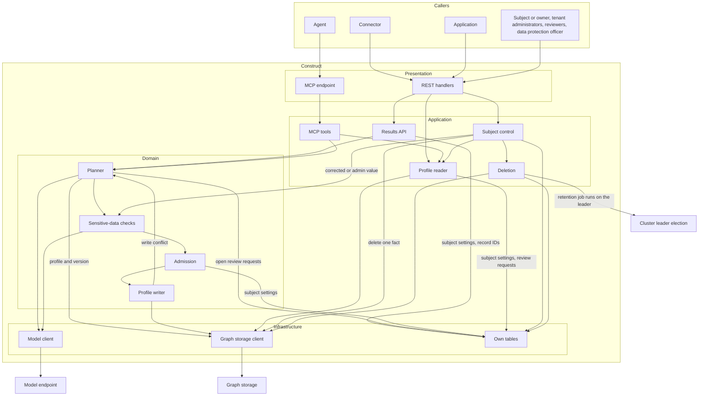
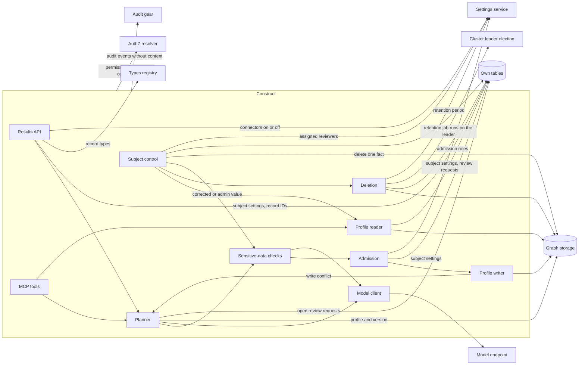
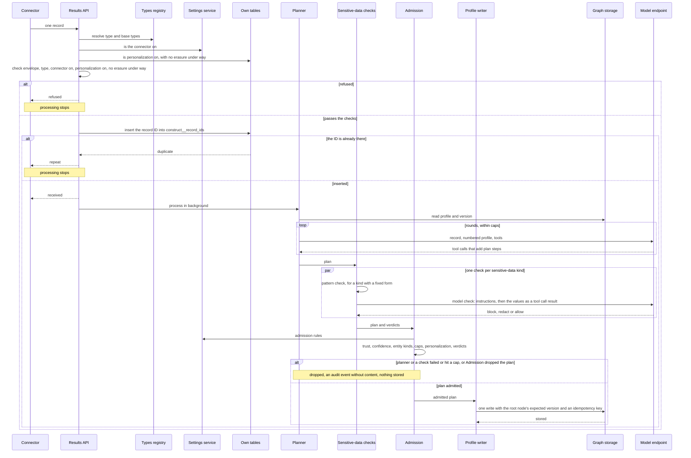
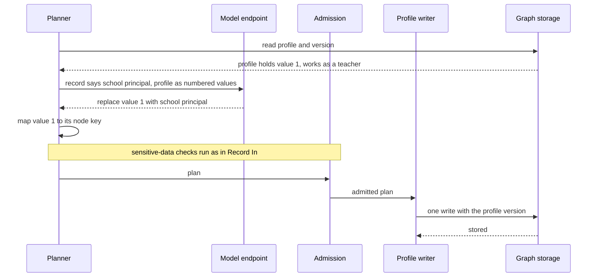
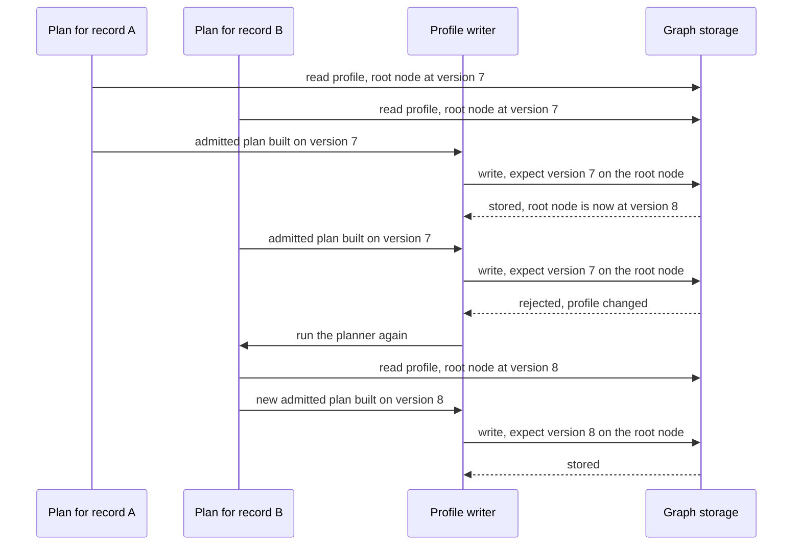
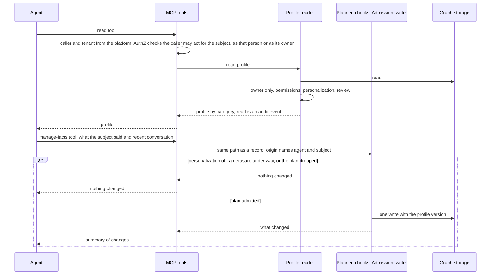
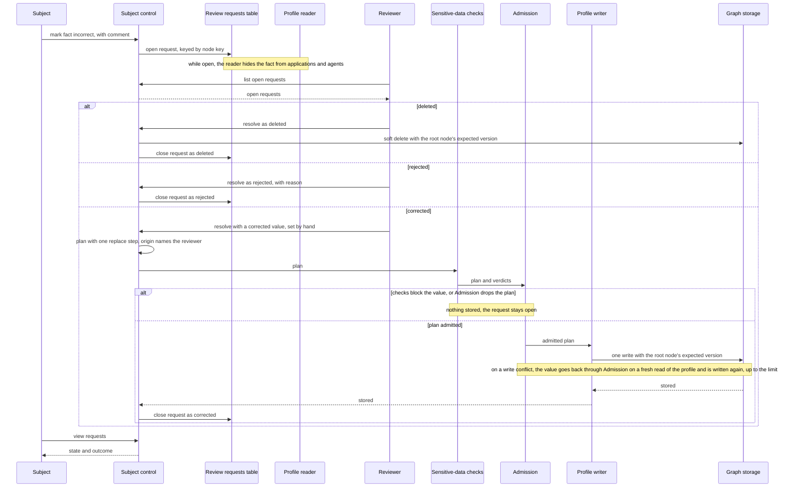
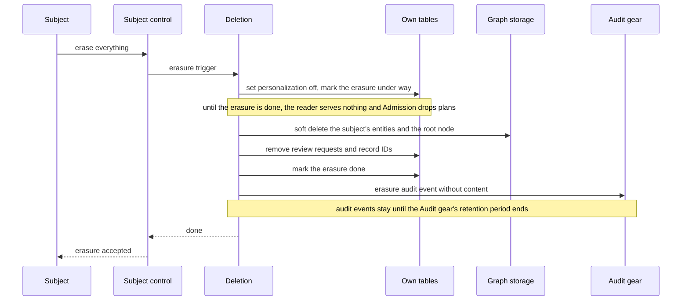
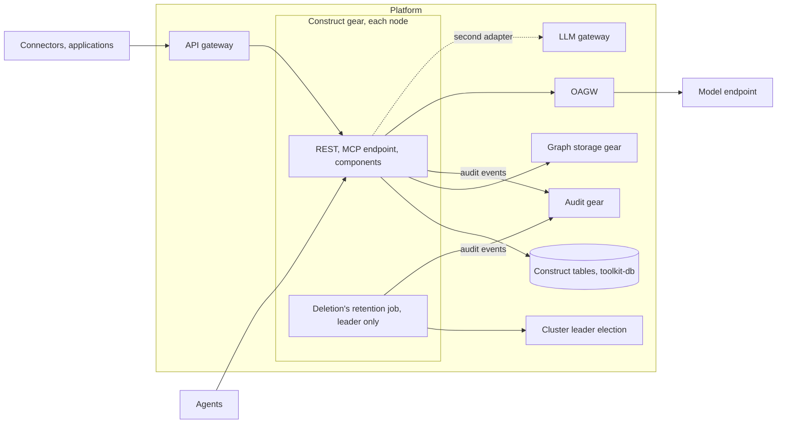

# Technical Design — Construct

- [ ] `p3` - **ID**: `cpt-cf-construct-design-construct-gear`

<!-- toc -->

- [1. Architecture Overview](#1-architecture-overview)
  - [1.1 Architectural Vision](#11-architectural-vision)
  - [1.2 Architecture Drivers](#12-architecture-drivers)
  - [1.3 Architecture Layers](#13-architecture-layers)
- [2. Principles & Constraints](#2-principles--constraints)
  - [2.1 Design Principles](#21-design-principles)
  - [2.2 Constraints](#22-constraints)
- [3. Technical Architecture](#3-technical-architecture)
  - [3.1 Domain Model](#31-domain-model)
  - [3.2 Component Model](#32-component-model)
  - [3.3 API Contracts](#33-api-contracts)
  - [3.4 Internal Dependencies](#34-internal-dependencies)
  - [3.5 External Dependencies](#35-external-dependencies)
  - [3.6 Interactions & Sequences](#36-interactions--sequences)
  - [3.7 Database schemas & tables](#37-database-schemas--tables)
  - [3.8 Deployment Topology](#38-deployment-topology)
- [4. Additional context](#4-additional-context)
  - [Risks](#risks)
  - [Scope Notes](#scope-notes)
- [5. Traceability](#5-traceability)

<!-- /toc -->

## 1. Architecture Overview

### 1.1 Architectural Vision

Construct is a gear. Connectors stay simple: they send typed records and know nothing else. Construct is the one place that decides what a record means for a subject. It asks: is the source trusted, is personalization on, is the record worth keeping, and how does it change the subject's profile? The profile is a graph: a subject linked to entities that carry properties. Construct writes the profile to graph storage. It is the only way applications and agents read it. The profile is read only for its owner: by the owner, and by applications and agents that act for the owner under platform permissions.

A language model proposes how a record changes the profile. Pattern checks in code and the model flag sensitive data. Construct runs that model step itself. The step is a small agent loop: the model calls a fixed set of tools in rounds. Then deterministic code decides what is stored. The model proposes; code decides.

Construct owns the rules around the model step: trust, confidence, allowed entity kinds, write caps, personalization and the sensitive-data verdicts. It also owns its own tables (subject settings, review requests and record IDs), the read path and erasure. The reasoning is in `cpt-cf-construct-adr-construct-is-a-gear`.

Two terms are used throughout. A record is **received** when it passes the intake checks and is taken for processing. That is no promise: a received record can still be dropped, and then nothing from it is stored. A change is **stored** when its plan passed the checks and the change is in the profile.

### 1.2 Architecture Drivers

Requirements that significantly influence architecture decisions.

#### Functional Drivers

| Requirement | Design Response |
|-------------|------------------|
| `cpt-cf-construct-fr-record-intake` | Results API checks the record against its GTS type and base types. Before any model call, it refuses a broken envelope or type, a repeat, a connector that is off, personalization off, or an erasure under way. It answers received, repeat or refused. It keeps only the received record's identity and its subject in `construct__record_ids`; the content stays in memory while the record is processed. If an instance of Construct stops before the record is processed, the record is lost, without an audit event. Connectors on or off is a tenant setting in the settings service. A new connector is a new registered type and needs no Construct code |
| `cpt-cf-construct-fr-fact-decisions` | Planner runs the agent loop over the record and the subject's current profile. Its plan adds, replaces or removes entities of that subject only; a replace removes the old value in the same plan. The reference evaluation set measures that no contradicting pair remains (see Risks, "Quality lives in the prompts") |
| `cpt-cf-construct-fr-deterministic-storage` | Profile writer applies the admitted plan in one write with the profile version the plan was built on. Graph storage rejects the write if the profile changed; the planner runs again, up to a small limit. Each write carries graph storage's idempotency key, and a plan's node keys are fixed when the plan is built. So storing the same changes again gives the same facts. Profile reader serves from graph storage, so the next read returns the stored value |
| `cpt-cf-construct-fr-fact-origin` | Each plan carries its origin from the record envelope, the MCP call, the reviewer or the tenant administrator. Profile writer stores it and the storing time with each entity. Profile reader and Subject control return it |
| `cpt-cf-construct-fr-admin-facts` | Subject control serves the admin operations on paths under `admin`. A read returns all facts of the subject with origin, like the subject's own view, and is a read audit event. An add or edit becomes a plan with one step and no planner. It passes the sensitive-data checks and Admission, and the Profile writer stores it with the administrator as its origin. A delete works like the subject's delete. A stored edit or a delete of a fact under an open review request closes the request as corrected or deleted. When nothing is stored, the call says so. Each change is an audit event without content |
| `cpt-cf-construct-fr-profile-read` | Profile reader serves the profile only for its owner: to the owner, and to applications and agents that act for the owner. It groups entities by entity kind, which is the PRD's category. It lists only permitted categories with at least one readable fact, and names the subject. Permissions come from the platform on each read |
| `cpt-cf-construct-fr-subject-access` | Subject control shows all facts with origin, the settings and the review requests. Each read is an audit event without content in the Audit gear. The subject's own view, the export and an administrator's read also write read audit events. The data protection officer finds the read audit events there per subject and per application, and gives them to the subject with the export |
| `cpt-cf-construct-fr-review-request` | Subject control creates a review request keyed by the graph node key. Profile reader hides the fact from applications and agents while the request is open. The planner skips it, so no record or agent changes it. If the subject deletes the fact or retention removes it first, the request closes as deleted. The assigned reviewers are a tenant setting in the settings service. Reviewers resolve a request as corrected, deleted or rejected. A corrected value becomes a plan with one replace step, which passes the sensitive-data checks and Admission. If they block or drop it, nothing is stored and the request stays open. Each correction and each resolution is an audit event without content |
| `cpt-cf-construct-fr-subject-delete` | Subject control deletes one fact in graph storage; each fact delete is an audit event without content. Deletion erases everything on request: the subject's entities, review requests and record IDs. It sets personalization off, marks the erasure under way until every step is done, and writes an erasure audit event without content. Results API refuses a repeat of a deleted fact's record by its identity in `construct__record_ids`. A deleted entity that returns gets a new node key |
| `cpt-cf-construct-fr-retention` | Deletion runs retention by age with the tenant's period, a tenant setting in the settings service. It runs as a job on the cluster leader and uses the same code as erasure. It covers facts, review requests and record IDs; audit events follow the Audit gear's retention period. Profile reader does not serve an item past the period, even before the job removes it. Tenant exit follows the platform's tenant offboarding protocol |
| `cpt-cf-construct-fr-settings` | Subject settings table keeps personalization on or off, and whether an erasure is under way. The personalization default for new subjects is a tenant setting in the settings service. While personalization is off or an erasure is under way, Results API refuses records, Admission drops plans, and Profile reader serves nothing |
| `cpt-cf-construct-fr-mcp-tools` | MCP tools offer a read tool that goes through Profile reader, like any application |
| `cpt-cf-construct-fr-mcp-manage-facts` | MCP tools offer the manage-facts tool. It takes what the subject said, with the recent conversation, through the same planner, checks and writer. The origin names the agent and the subject. It waits and returns what changed |
| `cpt-cf-construct-fr-mcp-caller-binding` | MCP tools take the caller and tenant from the platform only. For the subject a call names, the AuthZ resolver decides whether the caller may act for it, as that person or as the profile's owner. A call for a subject or tenant the caller may not act for gets the same answer as a subject that does not exist |
| `cpt-cf-construct-fr-sensitive-data-guardrails` | Sensitive-data checks run one check per sensitive-data kind on the values a plan would store: a pattern check in code, a model call, or both. Admission enforces block and redact before Profile writer runs. The checks have no off switch. Each block and redaction is an audit event with its sensitive-data kind and without content; the counts come from these events |
| `cpt-cf-construct-fr-tenant-isolation` | Every component takes the tenant from the platform security context. Graph storage calls and Construct's own tables are scoped to that tenant. Audit events carry the tenant, and the Audit gear confines reads of them to the caller's tenant |
| `cpt-cf-construct-fr-access-control` | Every REST operation and MCP tool needs a platform-authenticated caller and tenant, and asks the AuthZ resolver for its own separate permission (see 3.3). Exporting a subject's data and administering a subject's facts are permissions of their own. Tenant settings are changed in the settings service, and audit events are read in the Audit gear, under their own permissions |

#### NFR Allocation

This table maps non-functional requirements from PRD to specific design/architecture responses, demonstrating how quality attributes are realized.

| NFR ID | NFR Summary | Allocated To | Design Response | Verification Approach |
|--------|-------------|--------------|-----------------|----------------------|
| `cpt-cf-construct-nfr-deletion-time` | Deleted data is not served from the next read, and is gone from all storage within 30 days | `cpt-cf-construct-component-deletion`, `cpt-cf-construct-component-subject-control`, `cpt-cf-construct-component-profile-reader` | A delete or erasure takes effect in graph storage and Construct's tables on the request. Erasure sets personalization off, so Profile reader serves nothing at once. Profile reader does not serve an item past the tenant's retention period, even before the retention job removes it; the job then deletes it. Removal from all storage within 30 days needs graph storage's purge (see Risks). Tenant exit follows the platform's tenant offboarding protocol; graph storage's own offboarding comes after its v1. Audit events are outside this threshold; they follow the Audit gear's retention period | Acceptance tests for delete, erasure, retention and tenant exit; the 30-day removal is verified once graph storage's purge and offboarding exist |
| `cpt-cf-construct-nfr-guardrail-detection` | At least 95 % found per sensitive-data kind; 99 % for credentials | `cpt-cf-construct-component-sensitive-data-checks`, `cpt-cf-construct-component-model-client` | One check per sensitive-data kind on every value a plan would store: a pattern check in code, a model check with a structured answer, or both; credentials have a pattern check | The reference test set shipped with Construct, scored per sensitive-data kind |

#### Key ADRs

| ADR ID | Decision Summary |
|--------|-----------------|
| `cpt-cf-construct-adr-construct-is-a-gear` | Construct is a gear that owns its state and the rules around the model step |
| `cpt-cf-construct-adr-graph-storage-as-is` | Construct uses graph storage as it is, including its compare-and-set on writes and its soft delete |
| `cpt-cf-construct-adr-one-model-interface` | Construct calls models through one small interface. The chat completions adapter comes first; the LLM gateway adapter follows when the gateway runs |
| `cpt-cf-construct-adr-no-weights` | Construct stores no weight and does not rank facts. The Profile reader returns a subject's readable facts in no order of importance |

### 1.3 Architecture Layers

- [ ] `p3` - **ID**: `cpt-cf-construct-tech-rust-gear`

Construct is a Rust gear with the standard gear anatomy: an SDK crate with a client trait and models, and an implementation crate with API, domain and infrastructure layers.

| Layer | Responsibility | Technology |
|-------|---------------|------------|
| Presentation | REST operations for connectors, applications, subjects, reviewers, tenant administrators and the data protection officer; the MCP endpoint for agents | REST through the API gateway, registered with OperationBuilder; RFC 9457 Problem errors; MCP |
| Application | Intake, subject control, MCP tools, deletion and the read path | Rust services in the gear |
| Domain | The profile model, the planner, the sensitive-data checks, admission and the writer | Rust types over Construct's GTS profile types |
| Infrastructure | Model calls, graph storage calls, own tables, leader election | Model client adapters (the chat completions adapter through OAGW; the LLM gateway adapter through the gateway's SDK client); graph storage SDK client; toolkit-db; cluster leader election |

## 2. Principles & Constraints

### 2.1 Design Principles

#### Single Writer and Read Path

- [ ] `p2` - **ID**: `cpt-cf-construct-principle-single-profile-owner`

Construct is the only writer to a subject's profile graph and the only read path for it. Graph storage cannot apply Construct's read rules, so no application reads graph storage directly.

**ADRs**: `cpt-cf-construct-adr-construct-is-a-gear`, `cpt-cf-construct-adr-graph-storage-as-is`

#### Model Proposes, Code Decides

- [ ] `p2` - **ID**: `cpt-cf-construct-principle-model-proposes-code-decides`

The model proposes a plan. Nothing is stored unless the plan passes the deterministic checks in Admission.

**ADRs**: `cpt-cf-construct-adr-construct-is-a-gear`, `cpt-cf-construct-adr-one-model-interface`

#### Whole Plan or Nothing

- [ ] `p2` - **ID**: `cpt-cf-construct-principle-whole-plan-or-nothing`

A plan lands whole or not at all. Profile writer applies it in one write, so no reader sees half a change.

**ADRs**: `cpt-cf-construct-adr-graph-storage-as-is`

#### Verdicts Before Storage

- [ ] `p2` - **ID**: `cpt-cf-construct-principle-verdicts-before-storage`

Nothing reaches storage before the sensitive-data verdicts are enforced. Graph storage embeds text on ingest, so a later clean-up would come too late.

**ADRs**: `cpt-cf-construct-adr-construct-is-a-gear`, `cpt-cf-construct-adr-graph-storage-as-is`

#### No Mixed Records

- [ ] `p2` - **ID**: `cpt-cf-construct-principle-no-mixed-records`

Two records for one subject never mix. A plan is written only if the profile has not changed since the planner read it.

**ADRs**: `cpt-cf-construct-adr-graph-storage-as-is`

#### Base Record Only

- [ ] `p2` - **ID**: `cpt-cf-construct-principle-base-record-only`

Construct depends only on the base record shape. It never branches on a connector's type. The payload and its schema go to the model as data.

**ADRs**: `cpt-cf-construct-adr-construct-is-a-gear`

#### One Model Interface

- [ ] `p2` - **ID**: `cpt-cf-construct-principle-one-model-interface`

Construct calls models through one small model interface. The rest of Construct never knows which service is behind it.

**ADRs**: `cpt-cf-construct-adr-one-model-interface`

#### Model Never Sees IDs

- [ ] `p2` - **ID**: `cpt-cf-construct-principle-model-never-sees-ids`

The model never sees or writes an ID. It sees numbered values and plain keys (property names, not node keys). Construct maps each number back to its node key. So the model cannot invent or break an ID, and small or local models can do the job.

**ADRs**: `cpt-cf-construct-adr-one-model-interface`

### 2.2 Constraints

#### Graph Storage Soft-Deletes Only

- [ ] `p2` - **ID**: `cpt-cf-construct-constraint-graph-soft-delete-only`

Graph storage only soft-deletes in its v1. A soft delete leaves a tombstone: a marker that hides the node from every read. Purge and tenant offboarding come later in graph storage. A deleted node key cannot be reused before purge. So when a deleted entity comes back, Construct gives it a new node key.

**ADRs**: `cpt-cf-construct-adr-graph-storage-as-is`

## 3. Technical Architecture

### 3.1 Domain Model

**Technology**: GTS types for records and for the profile; Rust types in the gear.

**Location**: Construct's GTS profile types (`cpt-cf-construct-contract-person-types`) and the shared record base type (`cpt-cf-construct-contract-gts-record`), registered in the types registry. The record base type is `gts.cf.connectors.core.record.v1~`. The person types are `gts.cf.construct.person.identity.v1~`, `gts.cf.construct.person.roles.v1~`, `gts.cf.construct.person.skills.v1~` and `gts.cf.construct.person.preferences.v1~`, one per entity kind of a person. A person's subject ID is the UUID of the platform user, `gts.cf.core.am.user.v1~`.

**Core Entities**:

The profile is a tree. The subject node is its root, and the subject's entities hang from it. Each entity has an entity kind, such as a person's identity, roles, skills or preferences, and carries properties. Each kind of subject has its own entity kinds. An entity linked to the subject is what the PRD calls a fact, and its entity kind is the PRD's category. This document says "entity" for the graph and "fact" where it follows the PRD.

The PRD's "guardrails" are the sensitive-data checks. This document never says a bare "kind". An "entity kind" is the PRD's category. A "sensitive-data kind" is the PRD's special category.

The profile is read only for its owner: by the owner, and by applications and agents that act for the owner under platform permissions. A person owns their own profile. For any other subject, the user who creates the profile owns it and takes the subject's place wherever this document has the subject act or control the profile. The platform's authorization keeps who owns each profile; Construct keeps no record of it. A separate ADR will decide sharing with other people, organizations or contexts.

#### Record

- [ ] `p2` - **ID**: `cpt-cf-construct-entity-record`

One item a connector sends about one subject. Every connector's record type derives from one base record type. The base fixes the envelope: the type, where the record comes from (the connector and the record's identity), the record's version, when it was observed, the subject, and the payload. A connector's type refines only the payload. Construct implements the base only. It gives the payload, with its schema, to the model as data. A new connector is a new registered type and needs no Construct code.

A received record's content lives only in memory while the record is processed. Construct never writes it to any store. It keeps only the record's identity in its `construct__record_ids` table: the tenant, the connector and the record identity, with the subject the record names.

#### Profile

- [ ] `p2` - **ID**: `cpt-cf-construct-entity-profile`

The tree of one subject: the subject node as its root, and the entities that hang from it with their properties. Each entity carries its origin and the time it was stored. The profile version is the root node's version. Every write that changes the profile also writes the root node with its expected version. So graph storage's per-node compare-and-set covers the whole profile, and the writer uses it to detect a change between read and write.

#### Plan

- [ ] `p2` - **ID**: `cpt-cf-construct-entity-plan`

The steps the planner's tools build in memory for one record or one MCP call. A step adds, replaces or removes an entity or a property. The plan also holds its origin and the profile version it was built on. Each step carries the confidence the model gives it. The source for the trust check is the connector named in the plan's origin. A plan is never written as such; only its admitted steps reach the profile. A reviewer's corrected value also becomes a plan, with one replace step and no planner. So does a tenant administrator's added or edited fact, with one add or replace step.

#### Sensitive-Data Verdict

- [ ] `p2` - **ID**: `cpt-cf-construct-entity-sensitive-data-verdict`

The answer of one sensitive-data check for the values of a plan: block, redact or allow, per sensitive-data kind. The sensitive-data kind decides whether found content is blocked or redacted:

| Sensitive-data kind | PRD special category | Action when found |
|------|----------------------|-------------------|
| Personal IDs | Personal identifiers | Redact |
| Health | Health data | Block |
| Finance | Financial data | Redact |
| Biometrics | Biometric data | Block |
| Credentials | Authentication secrets | Block |
| Contacts | Contact details | Redact |
| Location | Precise geolocation | Redact |
| Politics | Political opinions | Block |
| Sex | Sex life or sexual orientation | Block |
| Other protected data | Other protected categories | Block |

A block or redact verdict changes only the affected values. Blocking drops the value and keeps the rest of the plan. Redacting removes the found content from the value.

These sensitive-data kinds are the special categories of a person's profile: data that must stay secret because of the law, security, safety, industry standards or contracts. Construct supports only a person for now. Another kind of subject may have other sensitive-data kinds, which need their own checks, so adding one changes this design.

#### Subject Settings

- [ ] `p2` - **ID**: `cpt-cf-construct-entity-subject-settings`

Whether personalization is on or off for one subject, and whether an erasure of the subject is under way. A new subject starts with the tenant's default, a tenant setting in the settings service.

#### Review Request

- [ ] `p2` - **ID**: `cpt-cf-construct-entity-review-request`

The subject's mark that a fact is incorrect, with an optional comment. It is keyed by the graph node key of the entity. It is open or closed, and a closed request holds its outcome: corrected, deleted, or rejected with a reason.

**Relationships**:

- Record → Plan: one received record gives at most one plan at a time; a rerun after a write conflict builds a new plan.
- Record → Profile: Construct keeps each received record's identity, so a repeat changes nothing, also for a deleted fact's record.
- Plan → Profile: a plan is built on one profile version and changes only that subject's profile.
- Plan → Sensitive-Data Verdict: each sensitive-data kind gives one verdict over the values the plan would store.
- Review Request → Profile: a review request points at one entity by its graph node key.
- Subject Settings → Profile: they decide whether the profile is served. It is served only for its owner.

### 3.2 Component Model

Construct has ten components. Records and MCP calls flow through the planner, the checks and the writer. All reads flow through the reader. Every operation asks the AuthZ resolver for its permission, and the components write audit events without content to the Audit gear.

#### Results API

- [ ] `p1` - **ID**: `cpt-cf-construct-component-results-api`

##### Why this component exists

Connectors need one simple intake that tells them at once whether a record is taken.

##### Responsibility scope

Takes one record per request. Refuses what is plainly wrong before any model call: a broken envelope or type, a repeat, a connector that is off, personalization off, or an erasure under way. It finds a repeat by the record's identity in `construct__record_ids`, also a repeat of a deleted fact's record. The table holds one row per tenant, connector and record identity. Inserting the identity is the repeat check, so two copies sent at once cannot both be received. Connectors on or off comes from the settings service; personalization and an erasure under way come from the subject settings table. A refusal names the type, the place in the record and the broken rule. Answers received, repeat or refused. Processing then runs in the background, best effort. A record that fails later is dropped, and the drop is an audit event without content.

A received record's content lives only in memory. Construct does not write it to any store, even for a short time, such as an outbox: a record can hold sensitive data that the checks would block. If an instance of Construct stops before the record is processed, the record is lost, without an audit event: only the stopped instance knew that the record was still in process. Its identity stays in `construct__record_ids`, so a resend is a repeat. A connector that needs the record processed sends it again with a new identity. This follows from best effort.

##### Responsibility boundaries

Does not decide what a record means; the planner does. Keeps only the record's identity and its subject in `construct__record_ids`; the content stays in memory while the record is processed and is never stored. Makes no model call.

##### Related components (by ID)

- `cpt-cf-construct-component-planner` — calls, in the background, for each received record

#### Planner

- [ ] `p1` - **ID**: `cpt-cf-construct-component-planner`

##### Why this component exists

Someone must decide how a record changes the profile. A language model proposes it; the planner runs that step.

##### Responsibility scope

Reads the subject's current profile and its version. Runs the agent loop over the record, or the MCP input, and the profile. The tools only add steps to a plan in memory; nothing is written during the loop. The model sees numbered values and plain keys (property names, not node keys), never IDs. Construct maps each number back to its node key, and gives each new entity a new node key. The planner skips a fact under an open review request: it does not change or remove it. It reads the open review requests from Construct's own tables. The loop has caps on rounds and tokens. If it hits a cap or fails, the record is dropped, and the drop is an audit event without content. Runs again when the writer reports a conflict, up to a small limit.

##### Responsibility boundaries

Writes nothing. Does not decide what is stored; Admission does. Does not know which model service is behind the model client.

##### Related components (by ID)

- `cpt-cf-construct-component-model-client` — calls for each round of the loop
- `cpt-cf-construct-component-sensitive-data-checks` — passes the plan to
- `cpt-cf-construct-component-profile-writer` — is called again by, on a write conflict

#### Sensitive-Data Checks

- [ ] `p1` - **ID**: `cpt-cf-construct-component-sensitive-data-checks`

##### Why this component exists

The profile must not become a store of sensitive data, and graph storage embeds text on ingest.

##### Responsibility scope

Runs one check per sensitive-data kind: personal IDs, health, finance, biometrics, credentials, contacts, location, politics, sex, and other protected data. A check is a pattern check in code, such as regular expressions, a model call, or both. Text cannot argue with a pattern check. So the kinds whose content has a fixed form have pattern checks: credentials, personal IDs, card and account numbers under finance, and contacts. A model check is one call with a structured answer. Its prompt holds only the instructions; the values to check reach the model as a tool call result, never inside the prompt. The checks run in parallel on the values the plan would store. Each returns block, redact or allow. If a check fails or hits a cap, the record is dropped, and the drop is an audit event without content.

##### Responsibility boundaries

Does not change the plan; Admission enforces the verdicts. Cannot be turned off.

##### Related components (by ID)

- `cpt-cf-construct-component-model-client` — calls, for each model check
- `cpt-cf-construct-component-admission` — passes the plan and the verdicts to
- `cpt-cf-construct-component-subject-control` — is called by, for a reviewer's corrected value and an administrator's value

#### Admission

- [ ] `p1` - **ID**: `cpt-cf-construct-component-admission`

##### Why this component exists

The model proposes; code decides. Admission is the code that decides.

##### Responsibility scope

Runs deterministic checks on the plan: source trust, the confidence floor, allowed entity kinds, write caps, personalization still on with no erasure under way, and the sensitive-data verdicts. The first four are admission rules, tenant settings in the settings service. Personalization and an erasure under way come from the subject settings table. Five checks drop the whole plan when it fails one: source trust, the confidence floor, allowed entity kinds, write caps, and personalization still on with no erasure under way. A block or redact verdict acts only on the affected values: blocking drops the value and keeps the rest of the plan, and redacting removes the found content from the value. Each block, redaction and drop is an audit event without content.

##### Responsibility boundaries

Makes no model call. Writes nothing to graph storage.

##### Related components (by ID)

- `cpt-cf-construct-component-profile-writer` — passes the admitted plan to

#### Profile Writer

- [ ] `p1` - **ID**: `cpt-cf-construct-component-profile-writer`

##### Why this component exists

A plan must land whole, and two records for one subject must not mix.

##### Responsibility scope

Applies the admitted plan to graph storage in one write. The write also writes the profile's root node, the subject node, with the profile version the plan was built on as its expected version. Each write carries graph storage's idempotency key. A write made again after a conflict, on a fresh read of the profile, is a new write with a new key; a write whose result is unknown is sent again with the same key. The plan's node keys were fixed when the plan was built, so storing the same changes again gives the same facts. Each entity is stored with its origin and the time it was stored. If another change reached the profile in between, graph storage rejects the write. The planner then runs again, up to a small limit. Past the limit, the record is dropped, and the drop is an audit event without content.

A reviewer's corrected value has no planner, and neither has a tenant administrator's added or edited fact. The planner skips a fact under review, so a record or an agent does not change it. On a write conflict, the value goes back through Admission on a fresh read of the profile, and the writer writes it again, up to the same small limit. If the fact to correct or edit is gone, because the subject deleted it or retention removed it, nothing is stored; that delete has already closed any review request on it as deleted.

##### Responsibility boundaries

Writes only admitted plans. Holds no copy of the profile.

##### Related components (by ID)

- `cpt-cf-construct-component-planner` — calls again on a write conflict

#### Profile Reader

- [ ] `p1` - **ID**: `cpt-cf-construct-component-profile-reader`

##### Why this component exists

Graph storage cannot enforce Construct's read rules, so Construct needs one read path.

##### Responsibility scope

The only read path for applications and agents. Applies owner only, platform permissions per category, personalization off, an erasure under way, and hidden-while-under-review. Owner only means the profile is served only for its owner: to the owner, and to applications and agents that act for the owner. Owner only binds applications and agents. Two roles read a subject's facts without acting for the subject, through Subject control: the data protection officer, for an export on the subject's request, and the tenant administrator, through the admin operations. Each of their reads is a read audit event too. It reads the subject settings and the review requests from Construct's own tables. It does not serve an item past the tenant's retention period, even before the retention job removes it. Groups entities by entity kind and lists only categories with at least one readable fact. Names the subject in every response. Each read it serves is an audit event without content: which application or agent, which subject, which categories, and when.

##### Responsibility boundaries

Does not write the profile. Does not decide permissions; the platform does.

##### Related components (by ID)

- `cpt-cf-construct-component-mcp-tools` — is called by, for the read tool
- `cpt-cf-construct-component-subject-control` — shares the read rules with; the subject's own view skips the rules that hide facts from others

#### Subject Control

- [ ] `p1` - **ID**: `cpt-cf-construct-component-subject-control`

##### Why this component exists

The subject controls their data: they see it, correct it and erase it. A tenant administrator reads and fixes a subject's facts through the same component.

##### Responsibility scope

View: all facts with origin, the settings and the review requests. Mark incorrect: creates a review request keyed by the graph node key. Delete: soft-deletes one fact in graph storage, closes an open review request on the fact as deleted, and writes the root node with its expected version. On a write conflict, it reads the profile again and writes again, up to the same small limit. Erase: hands the request to Deletion. Export: on the subject's request, the data protection officer exports all of the subject's data in Construct as a machine-readable file. This needs the export permission. The data protection officer adds the read audit events from the Audit gear. The subject's own view, the export and an administrator's read each write a read audit event without content. Also lists open review requests to the assigned reviewers and records their outcome, and keeps the subject's settings. The assigned reviewers are a tenant setting in the settings service.

For a corrected value, the reviewer sets the value by hand. Subject control turns it into a plan with one replace step, without the planner. The plan passes the sensitive-data checks and Admission like any plan, and the Profile writer stores it. Its origin names the reviewer. If the checks block the value or Admission drops the plan, nothing is stored, and the review request stays open.

Admin operations, for a tenant administrator: read all facts of a subject with origin, like the subject's own view; add, edit or delete one fact. An add or edit becomes a plan with one add or replace step, without the planner, and goes through the sensitive-data checks, Admission and the Profile writer like a corrected value. Its origin names the administrator. An add for a subject with no profile yet creates the profile's root node, as a first record does. If the checks block the value, Admission drops the plan (for example because personalization is off), or the fact to edit is gone, nothing is stored and the call says so. A delete works like the subject's delete. A stored edit or a delete of a fact under an open review request closes the request as corrected or deleted; an edit that the checks block or Admission drops leaves it open. Each admin read is a read audit event, and each change is an audit event without content.

##### Responsibility boundaries

Personalization off and erasure never block the subject's own view, delete, settings or export, or an administrator's read or delete. Does not store new values itself; a corrected value or an administrator's value goes through the sensitive-data checks, Admission and the Profile writer. Keeps no tenant settings: Construct builds no tenant-settings store or endpoint of its own. Tenant administrators change these values in the settings service.

##### Related components (by ID)

- `cpt-cf-construct-component-deletion` — calls for erasure
- `cpt-cf-construct-component-profile-reader` — shares the read path with
- `cpt-cf-construct-component-sensitive-data-checks` — calls for a reviewer's corrected value and an administrator's value

#### MCP Tools

- [ ] `p1` - **ID**: `cpt-cf-construct-component-mcp-tools`

##### Why this component exists

Agents are a main reader of the profile, and subjects often tell an agent something new.

##### Responsibility scope

Two tools. The read tool reads the profile, like any application does. The manage-facts tool takes what the subject said, with the recent conversation. It runs it through the same planner, checks and writer as a record. The origin names the agent and the subject. The tool waits for the result and returns what changed. When the plan is dropped, or personalization is off or an erasure is under way, the tool returns that nothing changed. The wire codes are left to the feature design. Every call is bound to the caller and tenant the platform authenticated, and to a subject the AuthZ resolver lets the caller act for, as that person or as the profile's owner.

##### Responsibility boundaries

The planner's own tools are not exposed: their numbers are valid only inside one loop.

##### Related components (by ID)

- `cpt-cf-construct-component-profile-reader` — calls for the read tool
- `cpt-cf-construct-component-planner` — calls for the manage-facts tool

#### Deletion

- [ ] `p1` - **ID**: `cpt-cf-construct-component-deletion`

##### Why this component exists

Erasure and retention must remove data from graph storage and from Construct's own tables, and one component must coordinate it.

##### Responsibility scope

One component with two triggers. Retention is automatic, by age, with the tenant's period, a tenant setting in the settings service. It runs as a job on the cluster leader. Erasure is the subject's request to remove everything now. Both use the same code. They remove the subject's entities from graph storage, and the subject's review requests and record IDs from Construct's own tables. Each delete in graph storage also writes the root node with its expected version. On a write conflict, Deletion reads the profile again, works out again what to delete, and writes again, up to the same small limit. So retention keeps a fact that a record changed in between, because it is no longer past the period. Erasure also soft-deletes the root node, the subject node, with the rest of the profile. Graph storage's purge removes it later, and a profile created after the erasure gets a new root key (see the constraint). Erasure sets personalization off and writes an erasure audit event without the erased content. It leaves no record identity of the subject behind, also not one that Results API inserts for a record received just before the erasure request. Every step can be repeated safely. If a step fails, Deletion runs the erasure again until every step is done. Until then, the subject settings mark the erasure as under way: Profile reader serves nothing about the subject and Admission drops its plans, even if personalization is turned on again. Neither trigger removes audit events; the Audit gear's retention period does. The Profile reader already stops serving an item once it is past the tenant's retention period. The job then deletes it. When retention removes a fact, an open review request on it closes as deleted.

Deletion also handles tenant exit. Construct follows the platform's tenant offboarding protocol, as [graph storage does](../../graph-storage/docs/DESIGN.md#tenant-offboarding-and-deletion-monotonicity). Deletion removes the leaving tenant's data from Construct's own tables. Graph storage removes the tenant's graph through its own offboarding. Audit events stay; the Audit gear's retention period removes them.

##### Responsibility boundaries

Cannot purge graph storage before graph storage offers purge (see the constraint and Risks). Does not remove a leaving tenant's graph itself; graph storage's own offboarding does, and it comes after graph storage's v1.

##### Related components (by ID)

- `cpt-cf-construct-component-subject-control` — is called by, for erasure

#### Model Client

- [ ] `p1` - **ID**: `cpt-cf-construct-component-model-client`

##### Why this component exists

The rest of Construct must not depend on one model service.

##### Responsibility scope

One small interface: messages and tools go in; text, tool calls or a structured answer come out. Two adapters sit behind it. The first speaks the OpenAI chat completions API through OAGW. It works with OpenAI, Azure, vLLM, Ollama, LiteLLM and most other servers. The second speaks the LLM gateway's API, once the gateway runs. Which one is used is configuration.

##### Responsibility boundaries

Knows nothing about records, plans or verdicts.

##### Related components (by ID)

- `cpt-cf-construct-component-planner` — is called by
- `cpt-cf-construct-component-sensitive-data-checks` — is called by

### 3.3 API Contracts

Construct offers three surfaces. REST and the Rust SDK realize `cpt-cf-construct-interface-rest-api`. The MCP tools realize `cpt-cf-construct-interface-mcp-tools`. Intake follows `cpt-cf-construct-contract-gts-record`; the profile follows `cpt-cf-construct-contract-person-types`.

**REST**

- **Contracts**: `cpt-cf-construct-contract-gts-record`, `cpt-cf-construct-contract-person-types`
- **Technology**: REST through the API gateway. Operations are registered with [OperationBuilder](../../../docs/toolkit_unified_system/04_rest_operation_builder.md). Errors are RFC 9457 Problem responses through the [toolkit error mapping](../../../docs/toolkit_unified_system/05_errors_rfc9457.md).
- **Location**: the gear's OpenAPI document, generated from the registered operations.

**Endpoints Overview**:

| Method | Path | Description | Permission | Stability |
|--------|------|-------------|------------|-----------|
| `POST` | `/api/construct/v1/records` | Connector intake: received, repeat or refused | Send records | unstable |
| `GET` | `/api/construct/v1/subjects/{subject_id}/profile` | Profile read by category for applications | Read profiles | unstable |
| `GET` | `/api/construct/v1/subjects/{subject_id}/facts` | The subject's own view of all facts with origin | Control the profiles one owns | unstable |
| `DELETE` | `/api/construct/v1/subjects/{subject_id}/facts/{fact_id}` | Delete one fact | Control the profiles one owns | unstable |
| `POST`, `GET` | `/api/construct/v1/subjects/{subject_id}/review-requests` | Mark a fact incorrect; list the subject's requests | Control the profiles one owns | unstable |
| `GET`, `PUT` | `/api/construct/v1/subjects/{subject_id}/settings` | Read and change personalization | Control the profiles one owns | unstable |
| `POST` | `/api/construct/v1/subjects/{subject_id}/erasure` | Erase everything about the subject | Control the profiles one owns | unstable |
| `GET` | `/api/construct/v1/subjects/{subject_id}/export` | The subject's data as a machine-readable file, for the data protection officer on the subject's request | Export a subject's data | unstable |
| `GET` | `/api/construct/v1/admin/review-requests` | List open requests | Resolve review requests | unstable |
| `POST` | `/api/construct/v1/admin/review-requests/{request_id}/resolution` | Resolve one request | Resolve review requests | unstable |
| `GET`, `POST` | `/api/construct/v1/admin/subjects/{subject_id}/facts` | Read all facts of a subject with origin; add one fact | Administer a subject's facts | unstable |
| `PUT`, `DELETE` | `/api/construct/v1/admin/subjects/{subject_id}/facts/{fact_id}` | Edit or delete one fact | Administer a subject's facts | unstable |

A resolution takes the outcome (corrected, deleted, or rejected with a reason) and, for a correction, the value the reviewer sets by hand. An add or edit takes the fact's entity kind and value. Their wire shapes are left to the feature design.

The four list reads are paged: the subject's facts, the subject's review requests, the open review requests and an administrator's read of a subject's facts. They use cursor pagination with a maximum page size, and OData `$filter` and `$orderby`, as in [OData and pagination](../../../docs/toolkit_unified_system/07_odata_pagination_select_filter.md). The page size limit and the fields to filter and order by are left to the feature design.

The reviewer queue and the admin operations sit under `/api/construct/v1/admin/`; the subject's own routes, such as marking a fact incorrect, stay under `subjects`. So a deployment can turn on one route-policy rule on `/api/construct/v1/admin/**` that rejects calls without the scope it chooses at the API gateway, as in [Gateway Scope Enforcement](../../../docs/arch/authorization/DESIGN.md#gateway-scope-enforcement-optional). Reviewers, including a data protection officer, then need that scope too. The AuthZ resolver still checks the permission of each operation.

Each operation has its own permission, checked through the AuthZ resolver. The permission classes come from `cpt-cf-construct-fr-access-control`. For a path with `{subject_id}` outside `admin`, the AuthZ resolver also decides whether the caller may act for that subject. An admin path needs only its permission in the caller's tenant: the administrator does not act for the subject. Everything is scoped to the caller's tenant, so a subject in another tenant gets the same answer as a subject with no profile. Tenant settings are changed in the settings service, not through Construct. Audit events are read in the Audit gear, under its own permissions.

**MCP**

The two tools of `cpt-cf-construct-component-mcp-tools`. The read tool reads the profile, under the read profiles permission. The manage-facts tool adds what the subject said, under the manage facts permission. Both act only for the subject and tenant the caller is authorized for. A tool change that breaks inputs or outputs gets a new tool version.

**Rust SDK**

- [ ] `p2` - **ID**: `cpt-cf-construct-interface-rust-sdk`

- **Contracts**: `cpt-cf-construct-contract-gts-record`, `cpt-cf-construct-contract-person-types`
- **Technology**: a Rust client trait in the SDK crate, registered in ClientHub, for in-process callers.
- **Location**: the Construct SDK crate.

The SDK offers the same operations as REST, under the same permissions. It is the Rust half of `cpt-cf-construct-interface-rest-api`. A breaking change brings a new major version of the API and the SDK.

### 3.4 Internal Dependencies

| Dependency Gear | Interface Used | Purpose |
|-------------------|----------------|----------|
| [Types registry](../../system/types-registry/docs/DESIGN.md) | SDK client | Resolve a record's type and base types; hold Construct's profile types |
| [AuthN resolver](../../system/authn-resolver/README.md) | SDK client | The caller's identity on every request |
| [AuthZ resolver](../../system/authz-resolver/README.md) | SDK client | A decision for every operation and category |
| [Tenant resolver](../../system/tenant-resolver/README.md) | SDK client | The caller's tenant on every request |
| [toolkit-db](../../../libs/toolkit-db/README.md) | Library | Construct's own tables, scoped to the tenant |
| [API gateway](../../system/api-gateway/README.md) | REST registration | Exposes Construct's REST operations |
| [Settings service](../../settings-service/docs/DESIGN.md) | SDK client | The tenant settings Construct contributes: connectors on or off, the retention period, the assigned reviewers, the admission rules, and the personalization default for new subjects |
| [Cluster](../../system/cluster/docs/DESIGN.md) | Leader election | Runs the retention job on one node |
| [OAGW](../../system/oagw/docs/DESIGN.md) | SDK client | Outbound model calls of the chat completions adapter |
| [LLM gateway](../../llm-gateway/docs/PRD.md) | SDK client | Model calls of the second adapter, once the gateway runs |

**Dependency Rules** (per project conventions):

- No circular dependencies
- Always use sdk modules for inter-gear communication
- No cross-category sideways deps except through contracts
- Only integration/adapter gears talk to external systems
- `SecurityContext` must be propagated across all in-process calls

### 3.5 External Dependencies

#### Graph Storage

- **Contract**: `cpt-cf-construct-contract-person-types`

| Dependency Gear | Interface Used | Purpose |
|-------------------|---------------|---------|
| [Graph storage](../../graph-storage/docs/DESIGN.md) | SDK client | Stores and serves the profile graph |

Construct uses graph storage as it is (`cpt-cf-construct-adr-graph-storage-as-is`). A batch of writes lands whole. Each node write may carry an expected version; a mismatch rejects the whole batch with a compare-and-set conflict. Every ingest request carries a tenant- and producer-scoped idempotency key. An identical retry returns the recorded outcome without touching graph state ([graph storage PRD](../../graph-storage/docs/PRD.md#bulk-idempotent-ingest)). Construct fixes a plan's node keys when it builds the plan, so storing the same changes again gives the same facts. Every write that changes a profile also writes its root node, the subject node, with its expected version. So the per-node compare-and-set covers the whole profile. Deletes are soft deletes (`cpt-cf-construct-constraint-graph-soft-delete-only`). Graph storage embeds text on ingest, so Construct blocks or redacts sensitive data before it writes. Node keys come from Construct and are unique per tenant.

#### Model Endpoint

- **Contract**: the OpenAI chat completions API, or the LLM gateway's API

| Dependency Gear | Interface Used | Purpose |
|-------------------|---------------|---------|
| Model endpoint | OpenAI chat completions API through OAGW, or the LLM gateway's API | Runs the planner loop and the sensitive-data checks |

This is the PRD's LLM gateway actor (`cpt-cf-construct-actor-llm-gateway`): the platform's LLM gateway, or a service with the OpenAI chat completions API that the deployment's configuration sets. The model endpoint gets the record payload with its schema, the numbered profile values, and the tools. It never gets an ID. Configuration chooses the adapter. Construct approves no models and no endpoints. Model policy belongs to the LLM gateway. With the chat completions adapter, the deployment's configuration sets the endpoint.

#### Audit Gear

- **Contract**: the Audit gear's SDK

| Dependency Gear | Interface Used | Purpose |
|-------------------|---------------|---------|
| [Audit gear](../../../docs/GEARS.md#audit) | SDK client | Holds Construct's audit events |

This is the PRD's Audit gear actor (`cpt-cf-construct-actor-audit`), a p1 dependency. Construct keeps no audit store of its own. It writes an audit event for each read, delete, correction, administrator change, review resolution and erasure, and for each block, redaction and drop. Each event carries the tenant, the subject, the application, agent or administrator, the event type and the time. A read event also names the categories read. A block or redaction event also names the sensitive-data kind. No event holds content. The Audit gear keeps events for its retention period. Erasure and the tenant's retention period do not remove them. The data protection officer queries them there, per subject and per application, under the Audit gear's own permissions. The Audit gear confines each read to the caller's tenant. The counts of blocks, redactions and drops come from these events.

**Dependency Rules** (per project conventions):

- No circular dependencies
- Always use SDK modules for inter-gear communication
- No cross-category sideways deps except through contracts
- Only integration/adapter gears talk to external systems
- `SecurityContext` must be propagated across all in-process calls

### 3.6 Interactions & Sequences

#### Record In

- [ ] `p1` - **ID**: `cpt-cf-construct-seq-record-in`

**Use cases**: `cpt-cf-construct-usecase-connector-sends-record`

**Actors**: `cpt-cf-construct-actor-connector`, `cpt-cf-construct-actor-types-registry`, `cpt-cf-construct-actor-settings-service`, `cpt-cf-construct-actor-llm-gateway`, `cpt-cf-construct-actor-graph-storage`

**Description**: A connector sends one record. Results API checks its envelope and type, whether the connector is on, and whether personalization is on with no erasure under way. A refused record gets its answer, and processing stops. Results API then inserts the record's identity into `construct__record_ids`; the insert is the repeat check. If the identity is already there, the record gets the answer "repeat", and processing stops. Otherwise the record is received and gets that answer. Its content stays in memory while it is processed. In the background, the planner builds a plan, the checks give verdicts, Admission decides, and the writer stores the plan in one write. If the record fails at any step, it is dropped: the drop is an audit event without content, and nothing from the record is stored. If an instance of Construct stops before the record is processed, the record is lost, without an audit event. Its identity stays in `construct__record_ids`, so a resend is a repeat. A connector that needs the record processed sends it again with a new identity.

#### Entity Replaced

- [ ] `p1` - **ID**: `cpt-cf-construct-seq-entity-replaced`

**Use cases**: `cpt-cf-construct-usecase-fact-replaced`

**Actors**: `cpt-cf-construct-actor-connector`, `cpt-cf-construct-actor-graph-storage`

**Description**: The model sees the old job as a numbered value and asks to replace it. Construct maps the number to the node key. The write removes the old value and adds the new one together, so the profile never holds both. The next read returns only the new value.

#### Two Records for One Subject at Once

- [ ] `p1` - **ID**: `cpt-cf-construct-seq-concurrent-records`

**Use cases**: `cpt-cf-construct-usecase-connector-sends-record`

**Actors**: `cpt-cf-construct-actor-connector`, `cpt-cf-construct-actor-graph-storage`

**Description**: Two records for one subject are planned at the same time. The first write wins. Graph storage rejects the second, because the root node's version changed. The planner runs again for the second record on the new profile, up to a small limit. The result equals storing the records one after the other.

#### Agent Reads and Adds over MCP

- [ ] `p1` - **ID**: `cpt-cf-construct-seq-agent-mcp`

**Use cases**: `cpt-cf-construct-usecase-chat-personalise`

**Actors**: `cpt-cf-construct-actor-consumer-app`, `cpt-cf-construct-actor-subject`, `cpt-cf-construct-actor-platform-auth`

**Description**: An agent reads the profile through the same reader as any application. Then it passes on what the subject said through the manage-facts tool. That input runs through the same planner, checks and writer as a record. The tool waits and returns what changed. When the plan is dropped, or personalization is off or an erasure is under way, the tool returns that nothing changed; the wire codes are left to the feature design. A call for another subject or tenant gets the same answer as a subject that does not exist.

#### Review

- [ ] `p1` - **ID**: `cpt-cf-construct-seq-review`

**Use cases**: `cpt-cf-construct-usecase-review-request`

**Actors**: `cpt-cf-construct-actor-subject`, `cpt-cf-construct-actor-tenant-admin`, `cpt-cf-construct-actor-dpo`

**Description**: The subject marks a fact incorrect. The open request hides the fact from applications and agents; the subject still sees it. A reviewer resolves it. A deleted fact is handled as a delete by the subject. A rejected fact is served again. For a corrected fact, the reviewer sets the value by hand. Subject control turns it into a plan with one replace step, without the planner. The plan passes the sensitive-data checks and Admission like any plan, and the Profile writer stores it. Its origin names the reviewer. If the checks block the value or Admission drops the plan, nothing is stored, and the request stays open. Every write here also writes the root node with its expected version. On a write conflict, Construct reads the profile again and writes again, up to the same small limit. While the request is open, the planner skips the fact, so no record or agent changes it. If the fact is gone before the correction is stored, because the subject deleted it or retention removed it, nothing is stored, and the request closes as deleted.

#### Erasure

- [ ] `p1` - **ID**: `cpt-cf-construct-seq-erasure`

**Use cases**: `cpt-cf-construct-usecase-delete-all`

**Actors**: `cpt-cf-construct-actor-subject`, `cpt-cf-construct-actor-dpo`, `cpt-cf-construct-actor-graph-storage`

**Description**: The subject asks to erase everything. Deletion first sets personalization off and marks the erasure as under way, so nothing is served and records received before it store nothing, even if personalization is turned on again before the erasure is done. It then removes the subject's entities and the root node from graph storage, and the subject's review requests and record IDs from Construct's tables. It writes an erasure audit event without content. It does not remove audit events; the Audit gear's retention period does. Retention runs the same code by age, as a job on the cluster leader. Removal from all storage within 30 days needs graph storage's purge (see Risks).

### 3.7 Database schemas & tables

- [ ] `p3` - **ID**: `cpt-cf-construct-db-own-tables`

Construct keeps three tables of its own through toolkit-db, scoped to the tenant. Their names carry the gear's `db_namespace`, `construct`, as in [Object Namespacing](../../../docs/arch/database/ADR/0001-cpt-cf-database-adr-object-namespacing.md); the same ADR sets the names of their indexes and constraints, such as `idx_<table>__<purpose>`. They are named here, not designed in detail. The columns are left to the feature design. Reads, deletes, corrections, administrator changes, review resolutions, erasures, blocks, redactions and drops are audit events, not tables. Who owns a profile, and so who may read it, is kept by the platform's authorization, so no Construct table records it.

#### Table: construct__subject_settings

- [ ] `p2` - **ID**: `cpt-cf-construct-dbtable-subject-settings`

**Holds**: whether personalization is on or off, and whether an erasure is under way, per subject.

**Additional info**: erasure sets it to off, and it stays off until the subject turns it on.

#### Table: construct__review_requests

- [ ] `p2` - **ID**: `cpt-cf-construct-dbtable-review-requests`

**Holds**: each review request, open or closed, and its outcome.

**Additional info**: keyed by the graph node key of the entity under review. Profile reader checks it to hide facts under review, and the planner checks it to skip them.

#### Table: construct__record_ids

- [ ] `p2` - **ID**: `cpt-cf-construct-dbtable-record-ids`

**Holds**: the identity of each received record: the tenant, the connector and the record identity, with the subject the record names, so that erasure finds the subject's rows. It holds no record content; that lives only in memory while the record is processed.

**Additional info**: one row per tenant, connector and record identity. Results API inserts the identity when it receives a record, and the insert is the repeat check. So two copies sent at once cannot both be received. This also refuses a repeat of a deleted fact's record. Retention and erasure apply to this table.

### 3.8 Deployment Topology

- [ ] `p3` - **ID**: `cpt-cf-construct-topology-deployment`

Construct runs as a gear on the platform. Graph storage, the Audit gear and the model endpoint are outside it. Model calls leave through OAGW, or go to the LLM gateway when that adapter is configured. The retention job runs on the cluster leader only. Construct serves its own MCP endpoint; it can use the serverless runtime's MCP server once that ships (see Risks).

## 4. Additional context

### Risks

| Risk | What it means |
|------|---------------|
| Erasure is a hard gate | A subject must be able to delete any of their data and erase all of it, removed from all storage within 30 days. That depends on graph storage's purge, which comes after its v1 |
| Quality lives in the prompts and patterns | The PRD's reference evaluation set proves that the plan decides well, and the PRD's reference test set proves that the checks find special-category content. Both have to exist before the first release |
| A model check can still be steered by the values it checks | The values come as a tool call result, not in the prompt, which lowers this risk but does not remove it. The kinds with a fixed form also have pattern checks, which text cannot argue with |
| Every planner round carries the whole current profile | Large profiles make each round heavy. The sensitive-data checks see only the values the plan would store |
| An instance of Construct stops while it processes a record | The record is lost, without an audit event. Its identity stays in `construct__record_ids`, so a resend is a repeat. A connector that needs the record processed sends it again with a new identity |
| The Audit gear is only planned | Construct's first release needs it for its audit events, also for the data protection officer's queries. Construct keeps no audit store of its own to fall back on |
| No MCP server exists in the platform yet | Construct serves its own MCP endpoint, or uses the serverless runtime's once it ships ([serverless runtime PRD](../../serverless-runtime/docs/PRD.md)) |

### Scope Notes

- **Security boundaries**: the platform authenticates every caller and supplies the tenant. Construct takes caller and tenant only from the platform, never from a record. Every operation has its own permission. Record text and agent input are untrusted. The model only proposes, Admission's deterministic checks decide, and the model never sees an ID. So text in a record cannot reach another subject's profile or change anything outside its plan. Encryption at rest and in transit follows the platform. [OAGW](../../system/oagw/docs/DESIGN.md) holds outbound credentials through credstore references.
- **Data protection**: verdicts are enforced before storage; audit events hold no content; erasure leaves an audit event without content.
- **Observability**: reads, deletes, corrections, administrator changes, review resolutions, erasures, blocks, redactions and drops are audit events without content. Construct writes them to the Audit gear, which keeps them for its retention period. The counts of drops, blocks and redactions come from these events; where the counts are stored is not part of this design. The PRD sets no other telemetry, so it is left to the feature design.
- **Testability**: the reference evaluation set and the reference test set from the PRD, and the PRD's acceptance tests.
- **Performance**: out of scope. The PRD sets no targets and inherits graph storage's.
- **Availability**: follows the platform's standard posture. The PRD sets no higher target.
- **User interface**: none. Host applications build it.
- **Cost**: every planner round carries the whole profile; the sensitive-data checks see only the values the plan would store (see Risks). The deployment chooses the endpoint.
- **Left to the feature design**: the cap values for the loop and the rerun limit; model-call timeouts; the patterns of the pattern checks, and which sensitive-data kinds also get a model check; the MCP tools' names, inputs and outputs, and the wire status codes for received, repeat and refused; how the personalization check, the identity insert and the write stay in step, so that a record received before personalization is turned off, or before an erasure request, stores nothing, also when personalization is turned off and on again, and an erasure leaves no identity of such a record behind; the properties of the person types; backup and recovery of Construct's own tables, which follow the platform default; how an erasure that stopped halfway is found and run again, also after an instance stops; which identity and tenant scope the background processing of a record, the retention job and tenant exit run under; how source trust and the confidence floor apply to plans from a reviewer, an administrator or an agent; how a review request that opens while a plan is in flight keeps that plan from changing the fact; how the root node is created for a new subject so that two first writes never both succeed, because graph storage's compare-and-set covers only nodes that exist; how a profile created after an erasure finds its new root key.

## 5. Traceability

- **PRD**: [PRD.md](./PRD.md)
- **ADRs**: [ADR/](./ADR/)
