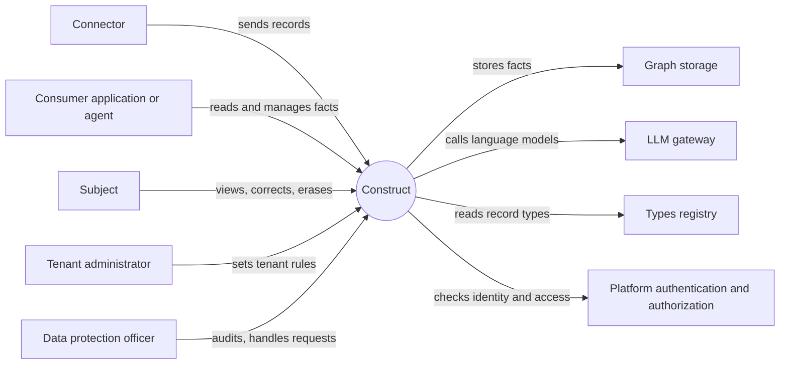

# PRD — Construct

<!-- toc -->

- [1. Overview](#1-overview)
  - [1.1 Purpose](#11-purpose)
  - [1.2 Background / Problem Statement](#12-background--problem-statement)
  - [1.3 Goals (Business Outcomes)](#13-goals-business-outcomes)
  - [1.4 Glossary](#14-glossary)
- [2. Actors](#2-actors)
  - [2.1 Human Actors](#21-human-actors)
  - [2.2 System Actors](#22-system-actors)
- [3. Operational Concept & Environment](#3-operational-concept--environment)
  - [3.1 Gear-Specific Environment Constraints](#31-gear-specific-environment-constraints)
- [4. Scope](#4-scope)
  - [4.1 In Scope](#41-in-scope)
  - [4.2 Out of Scope](#42-out-of-scope)
- [5. Functional Requirements](#5-functional-requirements)
  - [5.1 Intake](#51-intake)
  - [5.2 Facts](#52-facts)
  - [5.3 Profile Read](#53-profile-read)
  - [5.4 Subject Control](#54-subject-control)
  - [5.5 Personalization Settings](#55-personalization-settings)
  - [5.6 Agent Access over MCP](#56-agent-access-over-mcp)
  - [5.7 Sensitive Data](#57-sensitive-data)
  - [5.8 Tenancy and Access](#58-tenancy-and-access)
- [6. Non-Functional Requirements](#6-non-functional-requirements)
  - [6.1 Gear-Specific NFRs](#61-gear-specific-nfrs)
  - [6.2 NFR Exclusions](#62-nfr-exclusions)
- [7. Public Library Interfaces](#7-public-library-interfaces)
  - [7.1 Public API Surface](#71-public-api-surface)
  - [7.2 External Integration Contracts](#72-external-integration-contracts)
- [8. Use Cases](#8-use-cases)
- [9. Acceptance Criteria](#9-acceptance-criteria)
- [10. Dependencies](#10-dependencies)
- [11. Assumptions](#11-assumptions)
- [12. Risks](#12-risks)
- [13. Open Questions](#13-open-questions)
- [14. Traceability](#14-traceability)

<!-- /toc -->

## 1. Overview

### 1.1 Purpose

Construct is an open-source component of Constructor Fabric. It keeps one living profile for each subject and serves it to the applications and AI agents of a tenant. A subject is anything with a lasting identity. In this release, every subject is a person.

Connectors are any systems that learn something about a subject. They send what they learn to Construct as typed records, under GTS (Global Type System) contracts that the connectors own. Construct checks each record against its type and turns it into facts. A record may add, replace or remove facts, and Construct decides which on its own. Applications and agents read the profile to personalize what they do. The subject can see, correct and erase what Construct knows about them.

A team that builds a SaaS product can add Construct as a component instead of building its own profile store, privacy controls and agent access. The picture shows who talks to Construct, not how it is built.

### 1.2 Background / Problem Statement

A SaaS product wants to personalize what it does for each user. What it knows about a user is spread across many systems: a sign-up form, a chat, a learning system, a CRM, public web pages. Each system knows a part, and the parts often disagree.

Every product that personalizes builds the same parts again. It collects signals from many sources. It resolves facts that contradict each other. It keeps the profile current. It respects privacy and the right to erasure. And now it must give the profile to AI agents without letting an agent read or change data it must not touch. Each team builds these parts on its own, and each copy has its own gaps, most often in privacy. Construct gives these parts once, with the same rules for every product that uses it.

### 1.3 Goals (Business Outcomes)

- **G1 — One profile per subject that any app in the tenant can use.** Success metric: in the acceptance test suite, two consumer applications of one tenant with the same permissions get the same facts for the same subject in 100 % of reads, and a new consumer application reads profiles with platform permissions only and zero changes to Construct.
- **G2 — The profile stays current and has no contradictions.** Success metric: on the reference evaluation set shipped with Construct, at least 95 % of records give the expected add, replace or remove decision, and the final profiles hold zero pairs of contradicting facts.
- **G3 — The subject controls their data: they can see it, correct it and erase it.** Success metric: 100 % of view, mark-as-incorrect, delete and erase requests in the acceptance test suite give the expected result, and every erasure completes within 30 days (`cpt-cf-construct-nfr-deletion-time`).
- **G4 — AI agents can read and manage the profile through MCP.** Success metric: a standard MCP client reads facts, manages facts and sees question state with no Construct-specific code, and adversarial tests find zero MCP calls that reach a subject or tenant the caller is not authorized for.

### 1.4 Glossary

| Term | Definition |
|------|------------|
| Subject | The entity a profile is about: anything with a lasting identity. In this release, every subject is a person |
| Tenant | One customer organization in a deployment. Its data is kept apart from every other tenant's data |
| Fact | One statement about a subject, with its origin and the time it was stored |
| Category | A named group of facts of one kind, for example skills or preferences. Construct's GTS types define the categories |
| Origin | Where a fact came from: the connector and record, the subject or agent who stated it, or the reviewer who corrected it |
| Record | One item a connector sends about one subject. Its type is a GTS type that the connector owns |
| Connector | Any system that sends records to Construct |
| Agent | An AI agent that reads or manages the profile over MCP for a subject |
| Profile question | A question an agent asks the subject to fill a gap in the profile. Its state: asked or not, answered or not, and whether the subject turned such questions off and until when |
| MCP | Model Context Protocol: the protocol AI agents use to call tools |
| GTS | Global Type System — the platform's contract system of versioned, derivable JSON Schema types with `gts.` identifiers |

## 2. Actors

The tenant is the data controller for its subjects' data: it decides why and how the data is processed. The party that runs the Construct deployment is a processor for the tenant. System actors that receive personal data from Construct are sub-processors.

### 2.1 Human Actors

#### Subject

**ID**: `cpt-cf-construct-actor-subject`

- **Role**: The person a profile describes. Views their facts, marks a fact as incorrect, deletes a fact, erases everything, and sets their personalization settings, through an application or an agent that acts for them. Data-protection role: data subject.
- **Needs**: A profile that works for them in every application; a simple way to fix wrong data; erasure that really removes their data.

#### Tenant Administrator

**ID**: `cpt-cf-construct-actor-tenant-admin`

- **Role**: Runs Construct for one tenant. Turns connectors on or off; sets default personalization settings and the retention period; resolves review requests when the tenant assigns this task. Data-protection role: acts for the data controller.
- **Needs**: Control of sources and rules for the whole tenant; confidence that the tenant's data never mixes with another tenant's.

#### Data Protection Officer

**ID**: `cpt-cf-construct-actor-dpo`

- **Role**: Handles subjects' requests to see, correct or erase their data. Audits where facts came from, who read them, and what the guardrails blocked or redacted. Resolves review requests when the tenant assigns this task. Data-protection role: acts for the data controller.
- **Needs**: The origin of every fact; a record of every read; erasure that can be proven; sensitive-data counts without the sensitive content.

### 2.2 System Actors

#### Connector

**ID**: `cpt-cf-construct-actor-connector`

- **Role**: Any system that sends records about subjects, one at a time. It owns and registers its GTS record types, and never writes facts directly. Finding new sources is its job, not Construct's. Data-protection role: processor or sub-processor for the tenant, as the tenant's contract with it states.

#### Consumer Application or Agent

**ID**: `cpt-cf-construct-actor-consumer-app`

- **Role**: An application or AI agent that reads the profile to personalize what it does, and may manage facts on the subject's instruction. It acts only within the permissions the platform grants, and only for the subject and tenant it is authorized for. Data-protection role: processor for the same tenant.

#### Graph Storage

**ID**: `cpt-cf-construct-actor-graph-storage`

- **Role**: The platform gear that stores Construct's facts and the links between them; see the [graph storage PRD](../../graph-storage/docs/PRD.md). Data-protection role: sub-processor.

#### LLM Gateway

**ID**: `cpt-cf-construct-actor-llm-gateway`

- **Role**: The platform gear Construct uses to call language models: to decide how a record changes facts and to check for special categories. Data-protection role: sub-processor.

#### Types Registry

**ID**: `cpt-cf-construct-actor-types-registry`

- **Role**: The platform gear that holds GTS types. Connectors register their record types here; Construct registers the types of its categories and facts. Data-protection role: none; it holds no personal data.

#### Platform Authentication and Authorization

**ID**: `cpt-cf-construct-actor-platform-auth`

- **Role**: Authenticates every caller before a request reaches Construct, supplies the caller's identity and tenant with the request, and decides whether the caller may perform each operation. Data-protection role: sub-processor for identity data only.

## 3. Operational Concept & Environment

> **Note**: Runtime, OS, architecture, lifecycle policy, and gear integration patterns are defined in this repository's foundational documents — the [architecture manifest](../../../docs/ARCHITECTURE_MANIFEST.md) and [guidelines/](../../../guidelines/). This section captures only this gear's constraints.

### 3.1 Gear-Specific Environment Constraints

None beyond the project defaults.

## 4. Scope

### 4.1 In Scope

- Intake of records one at a time, and turning them into facts that Construct adds, replaces or removes
- A structured profile read by category, for applications and for agents over MCP
- Subject control and personalization settings, retention, and a record of every read
- Guardrails for special categories of data
- Tenant isolation, with identity and access from the platform

### 4.2 Out of Scope

- Batches: connectors send records one at a time
- Version history of facts: Construct keeps the current value only
- Subscribe and notify on profile changes, until graph storage ships its change events (see the [graph storage PRD](../../graph-storage/docs/PRD.md))
- Group subjects, such as teams or organizations
- Course or learning content
- Weights or ranking of facts
- A Construct setting to hide a category: the platform's permissions decide who reads which category
- A user interface: host applications build their own

## 5. Functional Requirements

> **Testing strategy**: All requirements verified via automated tests (unit, integration, e2e) targeting 90%+ code coverage unless otherwise specified. Document verification method only for non-test approaches (analysis, inspection, demonstration).

### 5.1 Intake

#### One Record per Request, Checked Against Its Type

- [ ] `p1` - **ID**: `cpt-cf-construct-fr-record-intake`

Construct **MUST** accept records from connectors, one record per request. Each record **MUST** name its GTS record type, its subject and a record identity the connector gives it. The identity is unique per tenant and connector. A record with the identity of an accepted record is a repeat, even when its content differs. Construct **MUST** check the record against its type and every base type that type derives from, and answer with one outcome: accepted, repeat, or refused. A refusal **MUST** name the type, the place in the record and the broken rule, and **MUST NOT** change stored data. A repeat of an accepted record **MUST NOT** change any fact. A record of a newly registered type **MUST** be accepted with no change to Construct's code. A tenant administrator **MUST** be able to turn each connector on or off; from the next request on, records from a connector that is off **MUST** be refused with that reason.

- **Rationale**: One simple intake lets new sources join without Construct changes, tells a connector exactly what to fix, and lets the tenant decide which sources are used.
- **Actors**: `cpt-cf-construct-actor-connector`, `cpt-cf-construct-actor-types-registry`, `cpt-cf-construct-actor-tenant-admin`

#### An Accepted Record Is Never Lost

- [ ] `p1` - **ID**: `cpt-cf-construct-fr-no-lost-records`

Once Construct has answered "accepted", it **MUST** process the record to the end, even when Construct, graph storage or LLM gateway stops and starts again in between. When processing cannot finish now, Construct **MUST** keep the record, try again later, and **MUST NOT** store a part of its result. The only exception: when the subject erases their data or turns personalization off, Construct **MUST** drop the subject's records that are not processed yet and store nothing from them.

- **Rationale**: The connector moves on after "accepted"; losing the record would lose data without anyone noticing.
- **Actors**: `cpt-cf-construct-actor-connector`, `cpt-cf-construct-actor-graph-storage`, `cpt-cf-construct-actor-llm-gateway`

### 5.2 Facts

#### Construct Decides How a Record Changes Facts

- [ ] `p1` - **ID**: `cpt-cf-construct-fr-fact-decisions`

For each accepted record, Construct **MUST** decide on its own whether the record adds facts, replaces stored facts, removes stored facts, or changes nothing. The changes **MUST** touch only the facts of the record's subject. When a record contradicts a stored fact, the profile **MUST NOT** hold both facts after the change.

- **Rationale**: Connectors send what they see; Construct keeps one consistent profile from it (G2).
- **Actors**: `cpt-cf-construct-actor-connector`, `cpt-cf-construct-actor-llm-gateway`

#### Deterministic Storage of Decided Changes

- [ ] `p1` - **ID**: `cpt-cf-construct-fr-deterministic-storage`

Once Construct has decided the changes for a record, it **MUST** store them fully or not at all, and storing the same changes again **MUST** give the same facts. Changes of two records for the same subject **MUST NOT** mix: the result **MUST** equal storing them one after the other. After a change is stored, the next read by any reader **MUST** return the new value and **MUST NOT** return a replaced or removed one.

- **Rationale**: A half-stored or mixed change leaves a profile that no source ever stated; a correction that some readers miss is not a correction.
- **Actors**: `cpt-cf-construct-actor-graph-storage`, `cpt-cf-construct-actor-consumer-app`

#### Origin on Every Fact

- [ ] `p1` - **ID**: `cpt-cf-construct-fr-fact-origin`

Every fact **MUST** carry its origin and the time it was stored: the connector and record it came from, the subject or agent who stated it, or the reviewer who corrected it. The subject and the data protection officer **MUST** be able to see the origin of every fact.

- **Rationale**: The subject needs the origin to judge a fact; the data protection officer needs it to audit collection.
- **Actors**: `cpt-cf-construct-actor-subject`, `cpt-cf-construct-actor-dpo`

### 5.3 Profile Read

#### Structured Profile by Category

- [ ] `p1` - **ID**: `cpt-cf-construct-fr-profile-read`

Construct **MUST** serve the profile of one subject with facts grouped by category, each fact with its origin and time, and **MUST** name the subject in every response. For each read, the platform **MUST** decide which categories the caller may read, per tenant, application and category. The response **MUST** list only categories with at least one fact the caller may read, so a denied category looks the same as an empty one. A change of permissions **MUST** apply from the next read.

- **Rationale**: Applications personalize only if they can read the profile in a predictable form, and each sees only its permitted share.
- **Actors**: `cpt-cf-construct-actor-consumer-app`, `cpt-cf-construct-actor-platform-auth`

### 5.4 Subject Control

#### View One's Own Facts and Who Read Them

- [ ] `p1` - **ID**: `cpt-cf-construct-fr-subject-access`

The subject **MUST** be able to see all facts about them with their origin, in every category, together with their settings, review requests and question state. Construct **MUST** record every read of a profile, through any interface: which application or agent, which subject, which categories, and when. The subject **MUST** see who read their profile, and the data protection officer **MUST** be able to query the records per subject and per application. On the subject's request, the data protection officer **MUST** be able to get all of this data as a machine-readable file.

- **Rationale**: The subject can only control what they can see; the right of access asks for all of it, including who received the data.
- **Actors**: `cpt-cf-construct-actor-subject`, `cpt-cf-construct-actor-dpo`, `cpt-cf-construct-actor-consumer-app`

#### Mark a Fact as Incorrect

- [ ] `p1` - **ID**: `cpt-cf-construct-fr-review-request`

The subject **MUST** be able to mark any fact as incorrect, with an optional comment, which creates a review request. While the request is open, Construct **MUST NOT** serve the fact to applications or agents; the subject still sees it. Construct **MUST** list open requests to the reviewers the tenant assigns (tenant administrator or data protection officer). A reviewer **MUST** resolve each request as corrected, deleted, or rejected with a reason. A corrected value comes from the reviewer, passes the same guardrails as any fact, and its origin names the reviewer; a deleted fact is handled as a delete by the subject; a rejected fact is served again. The subject **MUST** see the state and outcome of their requests.

- **Rationale**: Some wrong facts come from outside sources; the subject needs a way to flag them, and a request nobody closes gives no control.
- **Actors**: `cpt-cf-construct-actor-subject`, `cpt-cf-construct-actor-tenant-admin`, `cpt-cf-construct-actor-dpo`

#### Delete a Fact or Erase Everything

- [ ] `p1` - **ID**: `cpt-cf-construct-fr-subject-delete`

The subject **MUST** be able to delete any fact about them. From the next read on, the fact **MUST NOT** be served, and a repeat of its record **MUST NOT** bring it back. The subject **MUST** also be able to erase everything. From that request on, Construct **MUST** serve no facts about the subject to applications or agents, and personalization **MUST** stay off until the subject turns it on. Erasure **MUST** remove the subject's facts, review requests, question state, read records and records not processed yet, keeping only a record that the erasure happened, without the erased content. Both **MUST** complete within `cpt-cf-construct-nfr-deletion-time`.

- **Rationale**: The subject decides what stays. Construct does not remember deleted content, so a later, different record may add the same fact again, and the subject can delete it again.
- **Actors**: `cpt-cf-construct-actor-subject`, `cpt-cf-construct-actor-dpo`

#### Retention

- [ ] `p1` - **ID**: `cpt-cf-construct-fr-retention`

A tenant administrator **MUST** be able to set one retention period for the tenant. The period applies to everything Construct keeps about a subject: facts, review requests, question state, read records and records not processed yet. Construct **MUST** delete each item when the period ends, counted from the time it was stored. Without a period, this data is kept until the subject or the tenant deletes it. When a tenant leaves the deployment, Construct **MUST** delete all of its data.

- **Rationale**: Data must not be kept longer than its purpose needs; deletion on request alone does not meet this.
- **Actors**: `cpt-cf-construct-actor-tenant-admin`, `cpt-cf-construct-actor-dpo`

### 5.5 Personalization Settings

#### Personalization On or Off

- [ ] `p1` - **ID**: `cpt-cf-construct-fr-settings`

Construct **MUST** keep, for each subject, whether personalization is on or off. The subject **MUST** be able to read and change their settings; a tenant administrator **MUST** be able to set the defaults for new subjects. When personalization is off, Construct **MUST NOT** serve the subject's facts to applications or agents, and **MUST** refuse records about the subject with that reason. Personalization off and erasure never block the subject's own view, delete, settings or export. A change **MUST** apply from the next request.

- **Rationale**: The subject decides whether and how their profile is used.
- **Actors**: `cpt-cf-construct-actor-subject`, `cpt-cf-construct-actor-tenant-admin`

### 5.6 Agent Access over MCP

#### Read Facts and Question State over MCP

- [ ] `p1` - **ID**: `cpt-cf-construct-fr-mcp-tools`

Construct **MUST** offer agents MCP tools that read the subject's profile as in `cpt-cf-construct-fr-profile-read`, and that read and record the state of a profile question: asked or not, answered or not, and whether the subject turned such questions off and until when.

- **Rationale**: Agents are a main reader of the profile; without question state, an agent asks the same question again, or asks after the subject said stop.
- **Actors**: `cpt-cf-construct-actor-consumer-app`, `cpt-cf-construct-actor-subject`

#### Manage Facts over MCP

- [ ] `p1` - **ID**: `cpt-cf-construct-fr-mcp-manage-facts`

Construct **MUST** offer agents an MCP tool that adds, replaces or removes a fact on the subject's instruction and returns a summary of what changed. Such a fact **MUST** pass the same guardrails as a fact from a record, and its origin **MUST** name the agent and the subject.

- **Rationale**: Subjects often tell an agent something new about themselves; the profile must follow without a separate step.
- **Actors**: `cpt-cf-construct-actor-consumer-app`, `cpt-cf-construct-actor-subject`

#### Calls Bound to the Caller's Identity

- [ ] `p1` - **ID**: `cpt-cf-construct-fr-mcp-caller-binding`

Every MCP call **MUST** be bound to the caller identity the platform authenticated, and an agent **MUST** act only for the subject and tenant it is authorized for. A call that names another subject or tenant **MUST** be refused in a way the caller cannot tell apart from a subject that does not exist.

- **Rationale**: An agent that could reach another subject's facts would leak or damage them.
- **Actors**: `cpt-cf-construct-actor-consumer-app`, `cpt-cf-construct-actor-platform-auth`

### 5.7 Sensitive Data

#### Guardrails Before Storing

- [ ] `p1` - **ID**: `cpt-cf-construct-fr-sensitive-data-guardrails`

Before it stores any fact, Construct **MUST** check the content for these special categories: personal identifiers (PII) such as national ID, passport or tax numbers; health data; biometric data; financial data; authentication secrets; contact details; precise geolocation; political opinions; sex life or sexual orientation; and other protected categories (trade-union membership, religious or philosophical beliefs, criminal records). For each special-category item the check finds, Construct **MUST** block or redact it: block for authentication secrets, health, biometric data, political opinions, sex life or sexual orientation and other protected categories, and redact for personal identifiers, financial data, contact details and precise geolocation. Blocking drops the item and stores the rest of the record's facts; redacting stores the fact with the item removed. The record still counts as processed. Blocked or redacted content **MUST NOT** be served or kept after the record is processed. `cpt-cf-construct-nfr-guardrail-detection` sets how much the check must find. It **MUST NOT** be possible to turn the checks off. Construct **MUST** count every block and redaction per category, and the data protection officer **MUST** see the counts without the content.

- **Rationale**: Chats and public pages often hold sensitive data; the profile must not become a store of it.
- **Actors**: `cpt-cf-construct-actor-connector`, `cpt-cf-construct-actor-dpo`, `cpt-cf-construct-actor-llm-gateway`

### 5.8 Tenancy and Access

#### Tenant Isolation

- [ ] `p1` - **ID**: `cpt-cf-construct-fr-tenant-isolation`

Every operation **MUST** be confined to the caller's tenant. A read, count, search or error message **MUST NOT** reveal data of another tenant: facts, settings, review requests, read records or tenant settings. Adversarial tests that seed several tenants with the same subject identifiers and records **MUST** find zero such cases.

- **Rationale**: One deployment serves many tenants; a leak between them is a personal-data breach.
- **Actors**: `cpt-cf-construct-actor-platform-auth`, `cpt-cf-construct-actor-graph-storage`

#### Identity and Access from the Platform

- [ ] `p1` - **ID**: `cpt-cf-construct-fr-access-control`

Every request **MUST** carry a caller identity and a tenant that the platform has authenticated, and Construct **MUST** refuse a request without them. Construct **MUST** take the caller and the tenant only from the platform, never from the content of a record or request. The platform **MUST** authorize every operation. Sending records, reading profiles, managing facts, controlling one's own data, resolving review requests, changing tenant settings and reading audit data **MUST** be separate permissions.

- **Rationale**: Each actor needs a different level of access; separate permissions let the tenant grant exactly what each needs.
- **Actors**: `cpt-cf-construct-actor-platform-auth`, `cpt-cf-construct-actor-connector`, `cpt-cf-construct-actor-consumer-app`

## 6. Non-Functional Requirements

> **Global baselines**: Project-wide NFRs are defined in the [architecture manifest](../../../docs/ARCHITECTURE_MANIFEST.md) and [guidelines/](../../../guidelines/). Only gear-specific NFRs are documented here.
>
> **Testing strategy**: NFRs verified via automated benchmarks, security scans, and monitoring unless otherwise specified.

### 6.1 Gear-Specific NFRs

#### Deletion Time

- [ ] `p1` - **ID**: `cpt-cf-construct-nfr-deletion-time`

A deleted fact, an erasure, the end of a retention period, or a tenant leaving **MUST** remove the data from every read path at once and from all storage within 30 days.

- **Threshold**: Not served from the next read; removed from all storage in 30 days or less from the request or event
- **Rationale**: Data-protection law asks for an answer to an erasure request within one month.
- **Architecture Allocation**: See DESIGN.md § NFR Allocation

#### Guardrail Detection

- [ ] `p1` - **ID**: `cpt-cf-construct-nfr-guardrail-detection`

The guardrails **MUST** find special-category content on the reference test set shipped with Construct.

- **Threshold**: At least 95 % of items found in each category; at least 99 % for authentication secrets
- **Rationale**: A guardrail that misses content gives false safety.
- **Architecture Allocation**: See DESIGN.md § NFR Allocation

### 6.2 NFR Exclusions

- Performance (latency, throughput, scale): Construct sets no performance targets of its own and inherits the envelope of graph storage, which owns the store and measures it; see the [graph storage PRD](../../graph-storage/docs/PRD.md), section 6. A second set of numbers for the same store would only disagree with it.
- High availability beyond the platform default: Construct follows the platform's standard availability posture for gears.
- Accessibility and languages: Construct has no user interface; host applications own them.

## 7. Public Library Interfaces

### 7.1 Public API Surface

#### REST API and Rust SDK

- [ ] `p1` - **ID**: `cpt-cf-construct-interface-rest-api`

- **Type**: REST API and a Rust SDK
- **Stability**: unstable
- **Description**: Record intake for connectors; profile read for applications; settings, facts, review requests and erasure for the subject; review resolution, tenant settings, audit data and a subject's data export for tenant administrators and the data protection officer.
- **Breaking Change Policy**: A breaking change brings a new major version of the API and the SDK.

#### MCP Tools for Agents

- [ ] `p1` - **ID**: `cpt-cf-construct-interface-mcp-tools`

- **Type**: Protocol (MCP tools)
- **Stability**: unstable
- **Description**: Read the profile; add, replace or remove a fact; read and record the state of a profile question. Every call acts only for the subject and tenant the caller is authorized for.
- **Breaking Change Policy**: A breaking change to a tool's inputs or outputs requires a new tool version.

### 7.2 External Integration Contracts

#### Connector Record Types

- [ ] `p1` - **ID**: `cpt-cf-construct-contract-gts-record`

- **Direction**: required from connectors
- **Protocol/Format**: GTS record types that each connector derives from the shared GTS record base type, owns and registers in the types registry
- **Compatibility**: A published GTS version never changes; a change publishes a new version, and Construct accepts every registered version

#### Construct Profile Types

- [ ] `p1` - **ID**: `cpt-cf-construct-contract-person-types`

- **Direction**: provided by Construct
- **Protocol/Format**: GTS types for the categories of a person's profile and the facts in them, registered in the types registry and with graph storage
- **Compatibility**: A published GTS version never changes; facts stored under earlier versions stay readable and servable

## 8. Use Cases

#### A Connector Sends a Record

- [ ] `p1` - **ID**: `cpt-cf-construct-usecase-connector-sends-record`

**Actor**: `cpt-cf-construct-actor-connector`

**Preconditions**:
- The connector's record type is registered, the connector is on, and the subject's personalization is on

**Main Flow**:
1. The connector sends one record about a subject, and Construct answers "accepted"
2. Construct checks the content for special categories
3. Construct decides that the record adds two facts, and stores them

**Postconditions**:
- The two facts appear in the subject's profile, each with its origin

#### A New Fact Replaces an Old One

- [ ] `p1` - **ID**: `cpt-cf-construct-usecase-fact-replaced`

**Actor**: `cpt-cf-construct-actor-connector`

**Preconditions**:
- The profile holds the fact "works as a teacher"

**Main Flow**:
1. A connector sends a record that says the subject now works as a school principal
2. Construct decides that this record replaces the stored job fact, and stores the change

**Postconditions**:
- The profile holds "works as a school principal" and no longer holds "works as a teacher"; the next read by any application returns the new value

#### An Application Personalizes a Reply

- [ ] `p1` - **ID**: `cpt-cf-construct-usecase-chat-personalise`

**Actor**: `cpt-cf-construct-actor-consumer-app`

**Preconditions**:
- The subject has facts and personalization on, and the platform lets the application read the categories it needs

**Main Flow**:
1. The subject asks the application's agent a question
2. The agent reads the subject's profile over MCP
3. The agent answers, adapted to the subject, and Construct records the read

**Postconditions**:
- The reply uses the subject's facts, and the read is recorded

**Alternative Flows**:
- **The subject tells the agent a new fact**: the agent adds it over MCP, and its origin names the agent and the subject

#### The Subject Corrects a Fact

- [ ] `p1` - **ID**: `cpt-cf-construct-usecase-review-request`

**Actor**: `cpt-cf-construct-actor-subject`

**Preconditions**:
- The profile holds a wrong fact from a connector

**Main Flow**:
1. The subject views their facts and marks the wrong one as incorrect, with a comment
2. The assigned reviewer resolves the review request as corrected
3. The subject sees the outcome

**Postconditions**:
- Every reader gets the corrected value

**Alternative Flows**:
- **The subject does not want to wait**: the subject deletes the fact, or tells an agent the right value and the agent replaces it over MCP

#### The Subject Erases Their Data

- [ ] `p1` - **ID**: `cpt-cf-construct-usecase-delete-all`

**Actor**: `cpt-cf-construct-actor-subject`

**Preconditions**:
- The subject has a profile

**Main Flow**:
1. The subject asks to erase everything
2. Construct stops serving the subject's data at once and sets personalization to off
3. Construct removes the subject's facts, review requests, question state, read records and records not processed yet, and keeps a record of the erasure without content

**Postconditions**:
- Within 30 days, no read path and no storage holds the subject's data, and the data protection officer can prove the erasure

## 9. Acceptance Criteria

- [ ] Each success metric of G1 to G4 in section 1.3 is met in the acceptance test suite and on the reference evaluation set
- [ ] Intake: a refused record names type, place and rule and changes nothing; a repeat changes nothing; fault tests that stop Construct, graph storage or LLM gateway at random points lose zero accepted records and show no partial result
- [ ] Facts and read: two records for the same subject sent at once give the same facts as sent one after the other; every fact has origin and time; a denied category and an empty category give the same response
- [ ] Subject control and settings: after a delete, erasure, or personalization off, no application or agent gets the affected facts; every read appears in the read record, which the subject can see
- [ ] Sensitive data: the reference test set meets `cpt-cf-construct-nfr-guardrail-detection`; blocked and redacted content is never served or kept, and the checks cannot be turned off
- [ ] Tenancy: adversarial tests find zero cases of another tenant's data, and a request without a platform-authenticated identity and tenant is refused
- [ ] Retention, tenant exit and the rest: a fact past the tenant's retention period, and all data of a tenant that leaves, are not served from the next read and are gone from storage within 30 days; the data export holds all of a subject's data; a fact under an open review request is not served
- [ ] Every use case in section 8 passes as an end-to-end test

## 10. Dependencies

| Dependency | Description | Criticality |
|------------|-------------|-------------|
| Graph storage | Stores and serves facts. Erasure, retention and tenant exit need its purge of deleted data and its tenant offboarding, which graph storage plans as p2 | p1 |
| Types registry | Holds connectors' record types and Construct's own types | p1 |
| Platform authentication and authorization | Caller identity and tenant on every request; a decision for every operation | p1 |
| LLM gateway | Language-model calls to decide fact changes and check for special categories | p1 |
| At least one connector | The source of records; without one, profiles fill only through agents | p1 |

## 11. Assumptions

- The tenant, as data controller, has a legal basis for processing its subjects' data, and collects consent in its own product where the law requires it.
- Connectors give a record the same identity when they send it again.
- The platform identifies the subject behind every call from an application or agent.
- Host applications build the screens through which subjects and administrators use Construct.

## 12. Risks

| Risk | Impact | Mitigation |
|------|--------|------------|
| Graph storage ships purge and tenant offboarding (its p2 items) after Construct's first release | Deleted data stays in storage; erasure, retention and tenant exit miss the 30-day deadline | Agree with graph storage's owners that both ship before Construct's first stable release |
| Construct decides a fact change wrongly | The profile holds a wrong fact | The 95 % decision target of G2; origin on every fact; review requests and delete for the subject |
| A guardrail misses sensitive content | Special-category data is stored | `cpt-cf-construct-nfr-guardrail-detection`; strict defaults; counts for the data protection officer |
| An agent is tricked into changing facts the subject did not ask for | Wrong or harmful facts in the profile | Calls bound to the caller; guardrails on agent facts; origin names the agent; the subject can delete |
| A tenant serves minors | Their data is processed without a guardian's consent | Open question 1; until it is answered, the tenant's consent flow and the personalization setting apply |

## 13. Open Questions

1. Does Construct need its own way to mark a subject as under the digital age of consent, and to refuse their records until a parent or guardian agrees? Proposed answer: no; the tenant's consent flow and the personalization setting cover it. Owner: Anastasia Berseneva (Construct product owner). Target date: 2026-10-30.

## 14. Traceability

Links to related specification artifacts.

- **Design**: `DESIGN.md` in this folder, to follow
- **ADRs**: `ADR/` in this folder, to follow
- **Features**: `features/` in this folder, to follow
- **Graph storage**: [graph storage PRD](../../graph-storage/docs/PRD.md)
