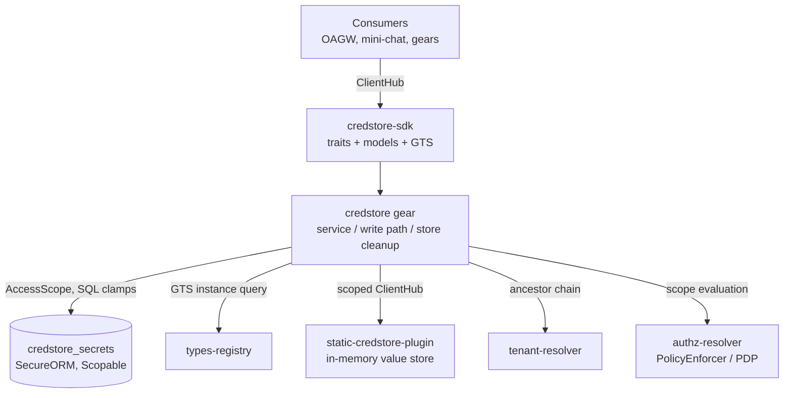
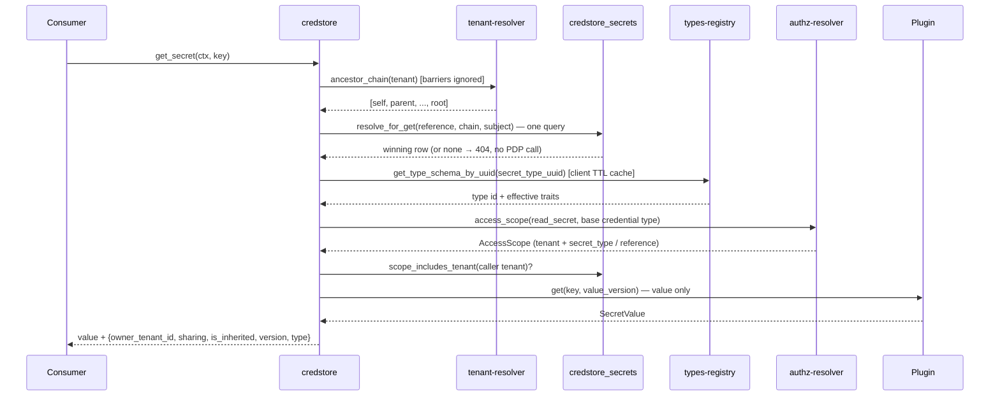
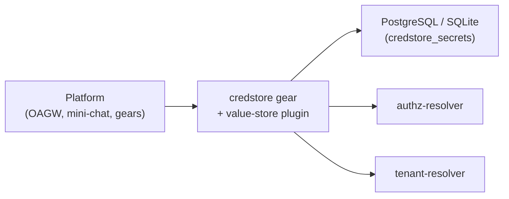

Updated:  2026-10-04 by Constructor Tech

# Technical Design — CredStore


<!-- toc -->

- [1. Architecture Overview](#1-architecture-overview)
  - [1.1 Architectural Vision](#11-architectural-vision)
  - [1.2 Architecture Drivers](#12-architecture-drivers)
  - [1.3 Architecture Layers](#13-architecture-layers)
- [2. Goals / Non-Goals](#2-goals--non-goals)
  - [2.1 Goals](#21-goals)
  - [2.2 Non-Goals](#22-non-goals)
- [3. Principles & Constraints](#3-principles--constraints)
  - [3.1 Design Principles](#31-design-principles)
  - [3.2 Constraints](#32-constraints)
- [4. Technical Architecture](#4-technical-architecture)
  - [4.1 Domain Model](#41-domain-model)
  - [4.2 Component Model](#42-component-model)
  - [4.3 API Contracts](#43-api-contracts)
  - [4.4 External Interfaces & Protocols](#44-external-interfaces--protocols)
  - [4.5 Service-to-Service Pattern](#45-service-to-service-pattern)
  - [4.6 Interactions & Sequences](#46-interactions--sequences)
  - [4.7 Database schemas & tables](#47-database-schemas--tables)
  - [4.8 Deployment Topology](#48-deployment-topology)
  - [4.9 Technology Stack](#49-technology-stack)
  - [4.10 Generation-bound validator](#410-generation-bound-validator)
- [5. Secret Types (GTS-Based, Registry-Driven)](#5-secret-types-gts-based-registry-driven)
  - [5.1 Concept](#51-concept)
  - [5.2 Type Traits](#52-type-traits)
  - [5.3 Built-in Type Catalog (Registry Seeds)](#53-built-in-type-catalog-registry-seeds)
  - [5.4 Enforcement Points](#54-enforcement-points)
  - [5.5 Storage & API Changes](#55-storage--api-changes)
- [6. Secret Lifecycle & Write Protocol](#6-secret-lifecycle--write-protocol)
  - [6.1 Status Model](#61-status-model)
  - [6.2 Value Write Protocol](#62-value-write-protocol)
  - [6.3 Delete Record and Key Purge](#63-delete-record-and-key-purge)
  - [6.4 Expired records](#64-expired-records)
  - [6.5 Residuals](#65-residuals)
- [7. Risks / Trade-offs](#7-risks--trade-offs)
  - [7.1 Architectural Trade-offs](#71-architectural-trade-offs)
  - [7.2 Security and Performance Risks](#72-security-and-performance-risks)
- [8. Migration Plan](#8-migration-plan)
- [9. Open Questions](#9-open-questions)
- [10. Additional context](#10-additional-context)
  - [Plugin Registration](#plugin-registration)
  - [Configuration](#configuration)
  - [Error Mapping](#error-mapping)
  - [Observability](#observability)
- [11. Traceability](#11-traceability)

<!-- /toc -->

<!--
=============================================================================
TECHNICAL DESIGN DOCUMENT
=============================================================================
PURPOSE: Define HOW the system is built — architecture, components, APIs,
data models, and technical decisions that realize the requirements.

DESIGN IS PRIMARY: DESIGN defines the "what" (architecture and behavior).
ADRs record the "why" (rationale and trade-offs) for selected design
decisions; ADRs are not a parallel spec, it's a traceability artifact.

SCOPE:
  ✓ Architecture overview and vision
  ✓ Design principles and constraints
  ✓ Component model and interactions
  ✓ API contracts and interfaces
  ✓ Data models and database schemas
  ✓ Technology stack choices

NOT IN THIS DOCUMENT (see other templates):
  ✗ Requirements → PRD.md
  ✗ Detailed rationale for decisions → ADR/
  ✗ Step-by-step implementation flows → features/

DESIGN LANGUAGE:
  - Be specific and clear; no fluff, bloat, or emoji
  - Reference PRD requirements using `cpt-cf-credstore-fr-{slug}` IDs
  - Sections describe the implemented design unless they say otherwise.
=============================================================================
-->

## 1. Architecture Overview

### 1.1 Architectural Vision

CredStore follows the ToolKit Gear + Plugins pattern: a **stateful gear** (`credstore`) owns all secret *metadata* (identity, sharing, ownership, lifecycle status, version) in its own database table, enforces authorization and hierarchical resolution, and exposes the public API; backend **plugins** are *versioned value stores* keyed per record, selected at runtime by GTS vendor configuration. The backend stores immutable secret value versions only — it carries no metadata schema, no sharing semantics, and no policy.

The SDK crate (`credstore-sdk`) defines two trait boundaries: `CredStoreClientV1` for consumers and `CredStorePluginClientV2` for backend implementations (the versioned contract of ADR-0006, §4.3: three required operations, `put`, `get` and `delete_key`, plus the optional `destroy`; `get` may also report a version as permanently unreadable). Consumers depend only on the gear trait and never interact with plugins directly, which allows runtime backend selection without changing consumer code.

Because metadata is local, hierarchical resolution (the walk-up that searches for secrets across tenant ancestors) is a **single indexed SQL query** over the metadata table followed by at most **one** backend read for the winning row. Writes are **announce-put-switch** (ADR-0006): a write first records a write intent in PG, the plugin then stores the value as a new immutable version and returns the value version the provider assigned, and one PG transaction retires the intent, switches the row's `value_version` pointer and, where the backend supports `destroy`, records the destroy of older versions as a cleanup debt in PG (`credstore_store_cleanup`); the same request executes that debt right after the commit is confirmed. The process does no background work (§6.2): a leftover of a crashed or interrupted request is healed by a later request that touches the same record ("Heal on access"). Deleting a record deletes the row and records a key purge debt in the same transaction, executed by the same request (§6.2, §6.3).

Authorization is delegated to the platform PDP (`authz-resolver`) via `PolicyEnforcer`: each operation evaluates an `AccessScope` that is enforced **in SQL** through SecureORM clamps on the metadata table. Tenant isolation is therefore enforced at the data layer, consistent with the rest of the platform.

### 1.2 Architecture Drivers

#### Functional Drivers

| Requirement | Design Response |
|-------------|-----------------|
| `cpt-cf-credstore-fr-put-secret` | Value write protocol (§6.2): a write intent is recorded in PG, `plugin.put` returns a `ValueVersion`, then one PG transaction retires the intent, switches the row's `value_version` (CAS on `(id, version)`) and (when the backend supports `destroy`) records the debt `destroy below vv` in PG, which the same request executes after the confirmed commit; one ordering for every precondition kind. REST: a single `PUT` on the record address carries record and secret together (§4.3.1) |
| `cpt-cf-credstore-fr-get-secret` | Single SQL resolution over the ancestor chain, then one plugin `get` for the winning row. The secret is read via `$select=secret` on `GET /credentials/{ref}`, independent of the metadata read (§4.3.1) |
| `cpt-cf-credstore-fr-delete-secret` | One PG transaction deletes the row and records a `purge` debt for the record key; the same request executes it right after the confirmed commit; the reference is free at once (§6.3). `DELETE` addresses the credential record, secret included (§4.3.1) |
| `cpt-cf-credstore-fr-tenant-scoping` | Gear derives tenant from `SecurityContext.subject_tenant_id()`; own-tenant gate + SecureORM scope clamp |
| `cpt-cf-credstore-fr-sharing-modes` | `sharing` column in the gear metadata table; partial unique indexes let private and tenant/shared coexist under one reference |
| `cpt-cf-credstore-fr-authz-pdp` | PDP `AccessScope` per operation on the secret GTS resource type, enforced in SQL; fail-closed. The resource type is `gts.cf.core.credstore.credential.v1~`, and the action set is the six actions of `cpt-cf-credstore-fr-authz-action-split` below (ADR-0010) |
| `cpt-cf-credstore-fr-optimistic-concurrency` | Monotonic `version` column; `GET` returns a strong generation-bound `ETag` (`"<id>.<version>"`, §4.10); `PUT`/`DELETE` require `If-Match` (a validator or `*`); the validator is enforced as a `version = ?` filter on the pointer-switching transaction (§6.2) |
| `cpt-cf-credstore-fr-secret-types` | GTS-based secret types with enforceable traits (§5) |
| `cpt-cf-credstore-fr-deprovisioning` | Row delete plus a recorded key purge debt (§6.3) |
| `cpt-cf-credstore-fr-credential-record` | Resource split (ADR-0004): the `credentials` collection item carries metadata only by default; the secret is a selectable `secret` field of that same item, disclosed only under `$select` and `read_secret`, never a separate sub-resource (§4.1, §4.3) |
| `cpt-cf-credstore-fr-list-credentials` | Upward-rooted collection read (ADR-0005): ancestor chain from tenant-resolver, tenant dimension as a PDP gate rather than a SQL clamp, `type`/`reference` as SQL clamps, `sharing`/`expires_at`/`fallback` filtered after reduction, `$select` sparse projection, reference-boundary cursor over reduced rows (§4.4, §4.6, §4.7) |
| `cpt-cf-credstore-fr-get-credential` | `GET /credentials/{ref}`: hierarchical resolution of the record without the secret; carries the strong `ETag` so a secret-blind caller can still perform a guarded write (§4.3) |
| `cpt-cf-credstore-fr-write-credential-record` | `PUT /credentials/{ref}` full replace of record and secret in one request (`If-None-Match`/`If-Match`; requires `write`, plus `write_secret` when it writes a secret or a `null` removes an existing one); `PATCH /credentials/{ref}` merge-patch partial update (requires `write` for metadata keys and `write_secret` for any `secret` key, string or `null`, unconditionally; both when both are present; never creates); type stays immutable under both (§4.1, §4.3; ADR-0007) |
| `cpt-cf-credstore-fr-read-secret` | `secret` selected via `$select` on `GET /credentials` or `GET /credentials/{ref}` — no dedicated address — `Cache-Control: no-store`, one audit record per returned secret (§4.3) |
| `cpt-cf-credstore-fr-write-secret` | Secret written through the record address, as `secret` in a full `PUT` or the `secret` member of a `PATCH`, under the record's one validator; `PATCH {"secret": null}` removes the secret (→ `declared`); requires `write_secret` when `secret` is a string or a `null` that removes an existing secret (plus `write` when metadata is also carried), but not when a `null` creates or leaves a secret-less record — `write_secret` guards changing a secret, not its absence; this exemption is `PUT`-only (a `PATCH` carrying a `secret` key, string or `null`, always requires `write_secret`); grants no read of that secret; a `PATCH` never creates a record (§4.3.1; ADR-0007) |
| `cpt-cf-credstore-fr-bulk-read-secrets` | `GET /credentials` with `$select` containing `secret`: the same paginated collection read as the metadata listing, `read_secret` per item, per-item value reads, `no-store`, one audit record per secret (§4.3, §4.6; ADR-0005 "Reading secrets through the collection") |
| `cpt-cf-credstore-fr-authz-action-split` | Six PDP actions on the resource type `gts.cf.core.credstore.credential.v1~`: `list` / `read` / `write` / `delete` on the record, `read_secret` / `write_secret` on the secret (§4.3, §4.4; ADR-0010) |
| `cpt-cf-credstore-fr-inheritance-status` | `inheritance` (own / inherited / overridden / suppressed) computed at resolution/reduction time from the ancestor-chain walk; never a filterable or orderable column (§4.1, §4.4; ADR-0009) |
| `cpt-cf-credstore-fr-suppression` | `fallback` column (`inherit`/`none`) on the record, set with `write`; a secret-less record with `none` wins resolution when nearest and yields 404 for its tenant and, per `sharing`, its descendants; suppressing an active own credential is one atomic `PATCH {"fallback": "none", "secret": null}`; suppressing without an own row is one atomic `PUT` with `If-None-Match: *` and `{"fallback": "none", "secret": null, …}`, needing only `write` (§4.3.1, §6.1; [ADR-0008](./ADR/0008-cpt-cf-credstore-adr-suppression-fallback.md) Suppression) |

#### NFR Allocation

| NFR ID | NFR Summary | Allocated To | Design Response | Verification Approach |
|--------|-------------|--------------|-----------------|----------------------|
| `cpt-cf-credstore-nfr-confidentiality` | Secret values never in logs or caches | SDK + gear + plugins | `SecretValue` wrapper with redacting `Debug`/`Display` and zeroize-on-drop; hand-written redacted `Debug` on REST DTOs; `Cache-Control: no-store` on `GET`; no lossy UTF-8 decode | Unit tests on redaction; code review |
| `cpt-cf-credstore-nfr-tenant-isolation` | No cross-tenant access outside PDP scope | Gear + repo | Scope clamps in SQL; own-tenant gate with `cross_tenant_denied` metric | Repo/service tests incl. scope cases |
| `cpt-cf-credstore-nfr-audit` | Audit event per secret read/write, best-effort | Gear | Publish through `event-broker` after the operation outcome is known; failure logs an error and counts `audit_publish_failed`, never alters the reply (§6.5) | Service tests with a failing/unavailable broker: reads and writes succeed, error logged, metric incremented |
| `cpt-cf-credstore-nfr-observability` | Gear | OpenTelemetry metrics: walk-up depth, read outcome, dependency timings, and counters for store-cleanup debts recorded and failed, write intents healed, verified commits, and read retries (§10); no inventory gauge (a `COUNT`-based gauge is disallowed by the platform's no-`COUNT` rule) | Metrics unit tests |

#### Key ADRs

| ADR ID | Decision Summary |
|--------|------------------|
| `cpt-cf-credstore-adr-stateful-gear` | Stateful gear, value-only backend: the gear owns the `credstore_secrets` metadata table (identity, sharing, ownership, lifecycle status, version); the backend plugin stores only values ([ADR-0001](./ADR/0001-cpt-cf-credstore-adr-stateful-gear.md)). The metadata row carries a `value_version` pointer, and the plugin is a versioned kv store keyed by `(tenant_id, record_id)` with three required operations (`put`, `get`, `delete_key`) plus the optional `destroy` |
| `cpt-cf-credstore-adr-deprovisioning-saga` | Superseded by ADR-0006: a delete is one row transaction plus a recorded key purge debt (§6.3) |
| `cpt-cf-credstore-adr-value-fingerprint-fence` | Superseded by ADR-0006; only its generation-bound validator remains (§4.10) |
| `cpt-cf-credstore-adr-secret-value-exposure` | Credential: metadata with a selectable secret. The credential record and its secret share one item shape: the default projection (`credentials` collection or point read) never carries a secret, and `secret` is a selectable `$select` field of that same item, disclosed only under `read_secret` — not a separate sub-resource ([ADR-0004](./ADR/0004-cpt-cf-credstore-adr-secret-value-exposure.md)) |
| `cpt-cf-credstore-adr-upward-collection-read` | The credential-record collection is rooted at the caller's tenant and reads upward only; the tenant dimension of PDP scope gates the caller's own tenant rather than clamping rows in SQL, so inherited rows survive; a collection read with `secret` selected (`$select=…,secret`) is the same paginated read, returning each item's secret ([ADR-0005](./ADR/0005-cpt-cf-credstore-adr-upward-collection-read.md)) |
| `cpt-cf-credstore-adr-immutable-value-versions` | Plugin-minted ordered value versions under one key per record `(tenant_id, record_id)`; the row holds the current `value_version`, switched by one PG transaction; every `put` is announced by a write intent and every store cleanup (`destroy` of older, lost or removed versions, `delete_key` of a deleted record's key) is a debt row in PG written in the transaction that made it necessary and executed by the same request after the confirmed commit; leftovers are healed by a later request that touches the same record (heal on access, no background work); statuses are `active`/`declared` ([ADR-0006](./ADR/0006-cpt-cf-credstore-adr-immutable-value-versions.md)) |
| `cpt-cf-credstore-adr-record-write-verbs` | Two write verbs on one address: `PUT` replaces the whole credential with a tri-state `secret` (absent → 400 `SECRET_REQUIRED`, a string → written, an explicit `null` → a secret-less `declared` record); `PATCH` is an RFC 7396 merge and never creates. Write actions follow the body — `write` for metadata keys present, `write_secret` for a `secret` key present ([ADR-0007](./ADR/0007-cpt-cf-credstore-adr-record-write-verbs.md)) |
| `cpt-cf-credstore-adr-suppression-fallback` | Suppression: a `fallback` field (`inherit`/`none`) on the tenant's own record, consulted only while it holds no secret; a `declared`+`none` row competes in resolution and, when nearest, blocks — canonical 404 for the tenant and, per `sharing`, its descendants (`inheritance: suppressed`); arming or lifting it is always one request ([ADR-0008](./ADR/0008-cpt-cf-credstore-adr-suppression-fallback.md)) |
| `cpt-cf-credstore-adr-no-ancestor-disclosure` | An inherited entry discloses nothing about the ancestor: `owner_tenant_id` and `is_inherited` are dropped; `inheritance` is the only hierarchy signal; `owner_id`, `fallback`, `version`, `updated_at` and a strong `ETag` are shown only for the caller's own row ([ADR-0009](./ADR/0009-cpt-cf-credstore-adr-no-ancestor-disclosure.md)) |
| `cpt-cf-credstore-adr-type-scoped-authorization` | Six actions on the credential type (`list`/`read`/`write`/`delete`/`read_secret`/`write_secret`); the type is the only scope axis — permissions are GTS instances, and the PDP's answer on the base credential type carries a constraint on the credential type, applied in SQL ([ADR-0010](./ADR/0010-cpt-cf-credstore-adr-type-scoped-authorization.md)) |

### 1.3 Architecture Layers

```
┌───────────────────────────────────────────────────────────────┐
│                Consumers (OAGW, mini-chat, gears)             │
├───────────────────────────────────────────────────────────────┤
│  credstore-sdk    │ Public API traits, models, errors, GTS    │
├───────────────────────────────────────────────────────────────┤
│  credstore        │ PDP authz, resolution, writes, REST,      │
│  (stateful)       │ store cleanup, metrics, credstore_secrets │
├───────────────────────────────────────────────────────────────┤
│  Plugins          │ Versioned per-tenant value stores         │
│  ┌────────────────────────────┐  ┌──────────────────────────┐ │
│  │ static-credstore-plugin    │  │ vault-credstore-plugin   │ │
│  │ (in-memory, dev/test)      │  │ (Vault / OpenBao KV v2)  │ │
│  │                            │  │ other stores: future     │ │
│  └────────────────────────────┘  └──────────────────────────┘ │
├───────────────────────────────────────────────────────────────┤
│  Platform deps    │ authz-resolver (PDP), tenant-resolver,    │
│                   │ types-registry (GTS), toolkit-db          │
└───────────────────────────────────────────────────────────────┘
```

| Layer | Responsibility | Technology |
|-------|---------------|------------|
| SDK | Public and plugin trait definitions, models, errors, GTS type declarations | Rust crate (`credstore-sdk`) |
| Gear | PDP authorization, hierarchical resolution, sharing enforcement, the value write protocol (write intents), store cleanup debts executed by the request and healed on access, plugin selection, REST API | Rust crate (`credstore`), Axum, SeaORM/SecureORM |
| Plugins | Backend-specific secret **value** storage (a versioned kv store per `(tenant_id, record_id)`: `put`/`get`/`delete_key`, plus an optional `destroy`; no policy, no hierarchy, no metadata, no list, no CAS) | Rust crates |
| Platform | Policy decisions (PDP), tenant hierarchy, plugin discovery | authz-resolver, tenant-resolver, types-registry |

The gear's write path is the announce-put-switch protocol of §6.2, with no asynchronous work: every store side effect is executed by the request that caused it, and leftovers are healed by a later request that touches the same record.

## 2. Goals / Non-Goals

### 2.1 Goals

- Provide secure, hierarchical secret storage for platform gears and tenant administrators
- Enable flexible sharing modes: `private` (owner-only), `tenant` (tenant-wide, default), `shared` (hierarchical)
- Support service-to-service secret retrieval (e.g., OAGW retrieving secrets on behalf of customer tenants)
- Enforce authorization via the platform PDP with SQL-level scope clamps (real tenant isolation at the data layer)
- Make writes crash-safe (announce the write, put a new immutable version, then switch the row's pointer in one PG transaction that also records the destroy of older versions as a debt in PG, executed by the same request; an interruption costs at most an unreachable version that an open intent or a recorded debt covers, healed by a later request that touches the record; no background work, §6.2), and reads race-free against half-written secrets (one bounded retry, §4.6)
- Enforce optimistic concurrency (version / `ETag` / mandatory `If-Match`) for lost-update detection — every update/delete states its concurrency stance; creation is the only preconditionless write
- Support multiple backend value stores via plugin architecture with GTS-based runtime selection
- Ensure secret values never appear in logs, error messages, debug traces, or intermediary caches
- Enable secret shadowing: child tenants can override parent credentials without breaking existing references
- Classify secrets by GTS-based *secret types* with enforceable traits (§5)
- Crash-safe deletion — one row transaction plus a recorded purge debt for the record key, executed by the same request (§6.3); the reference is free at once

### 2.2 Non-Goals

The following capabilities are explicitly out of scope:

- **Granular ACL beyond hierarchical**: fine-grained per-secret ACLs (role- or attribute-based) are out of scope. The three-tier sharing model plus PDP scope covers primary use cases.
- **Secret value history / rollback**: the `version` column supports optimistic locking only; superseded values are not readable through the gear, and, on a backend that supports `destroy`, are removed by the debt recorded with every successful write and executed by the same request (otherwise the backend retains them until record deletion).
- **Secret rotation automation**: automatic rotation is out of scope. (Secret types may carry *advisory* rotation traits, §5.2 — enforcement/automation is future work.)
- **Direct end-user access**: unauthenticated or untrusted client access is out of scope.
- **Secret templates or composition**: dynamic secret generation or derivation is out of scope.
- **Hierarchical resolution in backends**: plugins are versioned value stores — all hierarchy, sharing, and policy logic lives in the gear.
- **Secret discovery / search**: full-text search over values or references stays out of scope. A metadata listing is not a non-goal: it is required by `cpt-cf-credstore-fr-list-credentials` and designed in [ADR-0005](./ADR/0005-cpt-cf-credstore-adr-upward-collection-read.md); it is upward-rooted, never carries values, and never enumerates descendants.
- **MySQL support**: migrations target PostgreSQL and SQLite; MySQL fails fast with a typed error.

## 3. Principles & Constraints

### 3.1 Design Principles

#### Stateful Gear, Value-Only Backend

- [ ] `p1` - **ID**: `cpt-cf-credstore-principle-stateful-gear`

The gear owns all secret metadata in its own `credstore_secrets` table; the backend plugin stores values only, as immutable versions under one key per record, `(tenant_id, record_id)`, where `record_id` is the row's `id` — minted at create and never reused. The row alone knows which version is current (`value_version`), so the backend needs no metadata schema, no reference, no sharing class and no owner segment; private and tenant/shared rows under one reference are separate records with separate ids and therefore separate keys. This removes any backend metadata-schema prerequisite, eliminates encoded-external-ID collision risk, and makes resolution and authorization a single transactional query. The coexistence rule (partial unique indexes on the metadata table, §4.7) is unchanged, and `OwnerId` stays a row-level access-control key only, never part of the store key.

#### Authorization via PDP, Enforced in SQL

- [ ] `p1` - **ID**: `cpt-cf-credstore-principle-authz-pdp`

Every operation evaluates a PDP `AccessScope` for its action on the credential resource type (`gts.cf.core.credstore.credential.v1~`, §5.1) and enforces that scope in SQL through SecureORM clamps on the metadata table. The action set is `list`, `read`, `write`, `delete` on the record and `read_secret`, `write_secret` on the secret (ADR-0010, `cpt-cf-credstore-fr-authz-action-split`, §4.3.1). Both read and write paths additionally gate on an explicit own-tenant invariant (`scope_includes_tenant`) and emit a `cross_tenant_denied` metric. Out-of-scope access is fail-closed and surfaces as the canonical 404 (anti-enumeration) on a point read. On a write or delete the PDP decision is taken **before any row lookup** and a caller without permission on a record cannot tell whether it exists (§4.4 "Authorize first", §7.1): 403 is answered only from the decision itself, and a row the caller may not act on is answered exactly as a missing one. Plugins MUST NOT implement authorization.

**Every operation evaluates once per needed action, however many types exist** (§4.4): an operation on an existing credential — including the collection read — evaluates its action(s) on the **base** credential type, and the PDP answers with the tenant constraint plus a constraint on the credential type (the set of types the caller's grants cover), which is compiled to a SQL predicate. The number of PDP calls therefore never depends on how many credential types exist (hundreds are expected), which ones a tenant holds, or the page size. Only a create, whose type comes from the request, evaluates the requested concrete type.

#### Tenant from SecurityContext

- [ ] `p1` - **ID**: `cpt-cf-credstore-principle-tenant-from-ctx`

The operating tenant is always derived from `SecurityContext.subject_tenant_id()`, and the owner from `SecurityContext.subject_id()`. This reduces API surface, prevents misuse, and aligns with platform patterns. Service-to-service consumers (OAGW) construct a `SecurityContext` for the target tenant rather than passing tenant parameters.

#### Crash-Safe Writes (Write Intents, Pointer Switch, Cleanup Debts)

- [ ] `p1` - **ID**: `cpt-cf-credstore-principle-write-saga`

A write that spans the store and the metadata row is an announce-put-switch protocol (ADR-0006): every side effect on the value store is either **announced in PostgreSQL before it happens** (a write intent before each `put`) or **recorded as a cleanup debt in the same PG transaction that learned it is needed and executed by the same request after the confirmed commit** (the destroy of older, lost or removed versions, the purge of a deleted record's key). Leftovers of a crashed or interrupted request are healed by a later request that touches the same record (§6.2). The plugin writes a new immutable version and returns the value version the provider assigned, and one PG transaction retires the intent and switches the row's pointer (a CAS on `(id, version)`). A version is never overwritten, so a row never points at bytes it does not describe; every failure mode either leaves the row unswitched (the old value is still served) or leaves an unreachable version that an open intent or a recorded debt covers, until it is removed (§6.2, §6.5). No best-effort store call is ever relied on for cleanup. A crash can never permanently wedge a reference or leak a readable half-written secret.

### 3.2 Constraints

#### No Secret Logging

- [ ] `p1` - **ID**: `cpt-cf-credstore-constraint-no-secret-logging`

Secret values MUST NOT appear in any log output, error messages, or debug traces. `SecretValue` implements redacting `Debug`/`Display` and zeroizes on drop; request/response DTOs carry hand-written redacted `Debug`; the `GET` response sets `Cache-Control: no-store`; non-UTF-8 values are rejected with a typed error rather than lossily decoded.

#### Canonical Error Model

- [ ] `p1` - **ID**: `cpt-cf-credstore-constraint-canonical-errors`

All trait-boundary and REST errors follow the platform canonical error model ([ADR 0005](../../../docs/arch/errors/ADR/0005-cpt-cf-adr-sdk-canonical-projection.md)): domain errors map to canonical categories with stable `reason` codes (e.g. `OPTIMISTIC_LOCK_FAILURE`), and the wire strips internal diagnostics.

## 4. Technical Architecture

### 4.1 Domain Model

**Technology**: Rust structs (`#[domain_model]`)

**Core Entities**:

| Entity | Description |
|--------|-------------|
| `SecretRef` | Validated secret reference key (e.g., `partner-openai-key`). **Format**: `[a-zA-Z0-9_-]+`, 1–255 chars; validated on construction and re-validated by a DB `CHECK`. |
| `SecretValue` | Opaque byte wrapper (`Vec<u8>`) for secret data. Redacting `Debug`/`Display`, zeroize-on-drop, deliberately not `Serialize`/`Deserialize`. |
| `SharingMode` | Enum: `Private`, `Tenant` (default), `Shared` — controls access scope within the tenant hierarchy. |
| `OwnerId` | UUID identifying the creator (`SecurityContext.subject_id()`) — access control key for `Private` mode. |
| `SecretStatus` | Lifecycle status of the metadata row: two resting states, `Active` (2) and `Declared` (4) — `Declared` is a record whose secret was removed by a `PATCH {"secret": null}` or that was created with an explicit `null` secret (ADR-0007, §6.1). Only `Active` rows are visible to value resolution; `Declared` is additionally visible to the collection read (and, with `fallback = none`, competes in resolution as a suppression marker); no other status exists. Status codes 1 and 3 are reserved and never reused (§6.1). |
| `SecretRow` | Metadata row: `{ id, tenant_id, reference, sharing, owner_id, status, version, value_version, … }`. `id` is the record identity, minted at create and never reused; it is also the record part of the store key `(tenant_id, id)`. `value_version` is the value version the provider returned from `put` for the row's current secret (`NULL ⇔ status = declared`, §6.1), distinct from the row's own optimistic-concurrency counter `version`; the gear stores and returns it verbatim and never parses or compares it. Private and tenant/shared rows under one reference are distinct records with distinct ids, hence distinct store keys; `OwnerId` is a row-level access-control key only. |
| `NewSecret` | Insert shape for the create step of the write protocol (§6.2 step 4): carries the freshly minted record id and the `value_version` the plugin returned from `put` (`NULL` for a secret-less create). |
| `WritePrecondition` | Parsed `If-Match`, mandatory on update/delete: `Exists` (`*`, explicit last-writer-wins) or `Version { id, version }` (quoted `"<id>.<version>"`, generation-bound). |
| `SecretType` | Catalog-resolved secret type binding the enforceable traits (§5); immutable per secret. |
| `Credential` (ADR-0004; REST schema `Credential`) | The addressable **metadata** resource: reference, sharing, type, expiry, and two independent status fields. `status` is the state of the **caller's own row** — `none`/`declared`/`active`/`expired` (`expired` is an `active` row whose `expires_at` has passed, derived at read time and never stored; a `declared` row never expires) — while `inheritance` (`own`/`inherited`/`overridden`/`suppressed`) is the state of the **effective row** the reference resolves to. `fallback` (`inherit`/`none`, §6.1) is the caller's own row's policy for having no secret, shown only for that row; `version`, `updated_at` and `owner_id` (the creating subject) likewise describe the caller's own row and appear whenever `status` is not `none` — never for an inherited entry (ADR-0009). Identified by `SecretRef` in the `credentials` collection (§4.3) — the same item shape serves the point read and the collection. `secret` **MUST** be an optional field on `Credential` itself, present only when the caller's `$select` names it and only under the `read_secret` action; the default projection, and any projection that omits `secret`, never carries it — never a separate sub-resource. `Credential` never names the owning tenant (ADR-0009, "What a response carries, and for which row"). |
| `Secret` (ADR-0004; SDK convenience type, not a REST schema) | The secret with its usage envelope only: reference, type, expiry, secret — the shape `CredStoreClientV1::get_secret` returns, built over a record read with `$select=reference,type,expires_at,secret` and repackaging the sparse `Credential` result. Nothing administrative — `sharing`, `inheritance`, `status` never appear here, matching what `read_secret` alone can disclose. |
| `InheritanceStatus` (`cpt-cf-credstore-fr-inheritance-status`) | Enum, four variants: `Own` (the winning row is the caller's own, no ancestor involved); `Inherited` (the winning row is an ancestor's `shared` record); `Overridden` (the caller's own record shadows an ancestor's `shared` record under the same reference); `Suppressed`: the winning row is a secret-less record with `fallback: none` ([ADR-0008](./ADR/0008-cpt-cf-credstore-adr-suppression-fallback.md); §6.1) — the row may be the caller's own or an ancestor's `shared` one. Computed at resolution/reduction time, never a stored or filterable column (§4.4). |

**Relationships & uniqueness**:

- A secret belongs to exactly one tenant (`tenant_id`) and has exactly one owner (`owner_id`).
- For `tenant`/`shared` modes, `(tenant_id, reference)` is unique; for `private` mode, `(tenant_id, reference, owner_id)` is unique. Both are enforced as **partial unique indexes** (§4.7), which lets one private secret per owner and one tenant/shared secret **coexist** under the same reference.
- The uniqueness indexes ignore `status`, so a `declared` record holds its reference. A row is only ever inserted `active` or `declared` (§6.2 step 4), so there is no in-flight row to hold a reference open — a failed write leaves no row at all, not a wedged one.

**Sharing-mode access control** (evaluated during SQL resolution):

| Mode | Visible to | Inherited by descendants? |
|------|-----------|---------------------------|
| `private` | Only where `owner_id` equals the caller's subject id; wins over non-private at the same tenant level | No |
| `tenant` (default) | Only the owning tenant | No |
| `shared` | The owning tenant **and** all its descendants (including through isolation barriers) | Yes |

`sharing` is a **visibility** mode (who may read the secret), not a quota/limit that composes as `min(parent, child)`; resolution picks the closest accessible secret up the ancestor chain, which is how a child tenant *shadows* a parent's `shared` secret under the same reference.

**Record without a secret (ADR-0007).** A `PATCH {"secret": null}` against an existing, own record, or a `PUT` whose `secret` is an explicit `null`, are the only ways to reach this state (§4.3, §6.1) — reached only on purpose, never by omission: `PUT`'s `secret` is tri-state, and an absent `secret` key is rejected as `SECRET_REQUIRED` before anything is written, so there is no accidental path to `declared` through a forgotten field; only an explicit `null`, on create or on replace of an `active` row, produces it. It is a **stored lifecycle state** — `status = 4`, `declared`, within the narrowed `CHECK (status IN (2, 4))` — equivalent to a null `value_version`; §6.1 carries the reasoning and the predicate table. Naming it here without naming its column would leave each of the properties below resting on application logic over something the metadata row does not hold:

The column-level invariant is `declared ⇔ value_version IS NULL` — a `declared` row's pointer is null, an `active` row's is not. `PATCH {"secret": null}` sets the pointer to NULL in one PG CAS that also records, where `destroy` is supported, the debts that destroy the old version in the store (§6.1, §6.2).

- It **does not resolve** for a secret read, which is not the same as "the read returns not-found". The row is simply not a candidate: resolution already selects `status = 2`, so a `declared` row is excluded by a filter that is already there, and the walk up the ancestor chain continues past it. What the caller gets therefore depends on the chain — an ancestor's `shared` secret if one exists (next bullet), and the ordinary not-found only when the whole chain offers nothing. Reading these two bullets as "declared implies 404" is the mistake they exist to prevent.
- It **does not shadow** an ancestor: an inherited `shared` secret from a parent keeps resolving for the tenant and its descendants exactly as if the secret-less record did not exist. Removing a secret must not silently break inheritance that was working before it started. The collection read has to honour the same rule when it reduces a reference to one item, or the listing would claim the credential is configured locally while the point read serves the ancestor's secret ([ADR-0005](./ADR/0005-cpt-cf-credstore-adr-upward-collection-read.md) "Reducing a reference to one item").
- It is the only resting state **without a store version**: a `declared` row has no `value_version` and no store call is ever made for it, while an `active` row has both.
- It **is never produced by a crash**: a secret-carrying create is `plugin.put` followed by one row insert, landing a fully `active` row or none (§6.2); a `PUT` with an explicit `null` secret makes no store call at all and is a single row insert, landing a fully `declared` row or none. A crashed secret-carrying create leaves at most an unreachable version under a key no row names (§6.5), never a row in some in-between state. It **is not removed by any sweep** — there is none: it is reached by a completed write that deliberately requested it (a `PATCH {"secret": null}` or a `PUT` with an explicit `null`), not a stalled one.
- It **is visible in the catalogue**, unlike every other non-`active` status: the collection read selects `status IN (2, 4)` and surfaces the state, because an administrator who has removed a record's secret needs to see exactly that (§6.1).

### 4.2 Component Model



**Components**:

- [ ] `p1` - **ID**: `cpt-cf-credstore-component-sdk`

`credstore-sdk` — trait definitions (`CredStoreClientV1`, `CredStorePluginClientV2`), models, canonical `CredStoreError`, and the GTS declarations: the plugin spec type (`gts.cf.toolkit.plugins.plugin.v1~cf.core.credstore.plugin.v1~`) and the credential resource type (`gts.cf.core.credstore.credential.v1~`; exported as `CREDENTIAL_RESOURCE_TYPE` — the single source of truth pinned by unit tests).

- [ ] `p1` - **ID**: `cpt-cf-credstore-component-gear`

`credstore` — the stateful gear. Layers: `api/rest` (Axum routes, DTOs with redacted `Debug`, `If-Match` parsing), `domain` (service with the value write protocol and delete-and-purge of §6.2/§6.3 — authz scope evaluation, resolver port, metrics port, plugin selector port), `infra` (SecureORM repo, migrations, tenant-resolver adapter, GTS plugin selector, OTel metrics, canonical error mapping). Declares `deps = [authz-resolver, tenant-resolver, types-registry]` and capabilities `system, db, rest, stateful`. The gear runs no background work (§6.2): store cleanup (`purge` calls `delete_key`, `destroy` calls `destroy` on the plugin) is a debt recorded in PG in the transaction that made it necessary and executed by the request that caused it; leftovers are healed by a later request that touches the same record (§6.2 "Heal on access", §6.3).

- [ ] `p1` - **ID**: `cpt-cf-credstore-component-static-plugin`

`static-credstore-plugin` — in-memory versioned value store for development and testing (versions minted with a per-key counter), writable at runtime only through the gear; a value placed outside the API is never referenced by a row and therefore never served. Its configuration carries only `vendor` and `priority`: any other key fails config validation at boot (fail-fast by design). It logs a WARN at startup that it is a non-durable in-memory store for development and tests only. Registers its GTS instance and scoped `CredStorePluginClientV2` in ClientHub.

- [ ] `p2` - **ID**: `cpt-cf-credstore-component-production-backend`

Production value-store backends implementing the same `CredStorePluginClientV2` contract (§4.3: ordered versions, durable `put`, exact-bytes `get`). `vault-credstore-plugin` is the production-grade reference implementation, over Vault / OpenBao KV v2 (the key `{mount}/data/{path_prefix}/{tenant_id}/{record_id}` holds the versions of one record): it authenticates with a token taken from the configuration, a file (a Vault Agent sink) or the environment, and re-reads the source once when Vault answers 403; `get`, `delete_key` and `destroy` are retried with a bounded exponential backoff on transient failures, `put` never; it has no TLS settings (HTTPS uses the platform's trust roots) and runs no startup checks, so the mount settings and the ACL policy are the operator's obligations (§4.3). Its own PRD, DESIGN and TESTING documents are in the plugin's `docs/`. Other backends (GCP, AWS, Azure, OS keychain, KMS-backed store) are future plugins; none is part of the current codebase.

**Interactions**:

- Consumer → Gear: `CredStoreClientV1` via ClientHub (in-process) or REST.
- Gear → Repo: all metadata reads/writes clamped by the PDP `AccessScope` (SecureORM `Scopable`).
- Gear → Plugin: `CredStorePluginClientV2` via scoped ClientHub; the plugin is resolved lazily by GTS instance query filtered by the configured `vendor`.
- Gear → tenant-resolver: ancestor chain (`BarrierMode::Ignore` — inheritance crosses isolation barriers), read on every request that needs it (no local cache).
- Gear → PDP: `PolicyEnforcer.access_scope_with` per operation; no PEP capabilities advertised — the PDP hands the gear flat, pre-expanded tenant predicates (§4.4).

### 4.3 API Contracts

- [ ] `p1` - **ID**: `cpt-cf-credstore-interface-clienthub`

**Technology**: Rust traits (ClientHub) + REST/OpenAPI

#### ClientHub API (in-process)

`CredStoreClientV1` (public consumer API):

| Method | Signature | Description |
|--------|-----------|-------------|
| `get_record` | `(ctx, key: &SecretRef) → Result<Option<Credential>, CredStoreError>` | Hierarchical read of the record — metadata only, never the value. `Ok(None) covers both "does not exist" and "inaccessible" (single 404 surface, anti-enumeration). Requires `read`. |
| `get_secret` | `(ctx, key) → Result<Option<Secret>, CredStoreError>` | Hierarchical read of the resolved value with its usage envelope. A value-less or suppressed winner is `Ok(None)`; an expired winner is `SecretExpired`; a version the backend cannot return is an internal error (500, §4.6). Requires `read_secret`. |
| `put` | `(ctx, key, write: CredentialWrite, precondition: PutPrecondition) → Result<PutOutcome, CredStoreError>` | Whole-credential create-or-replace, record and tri-state secret in one call. `PutPrecondition::CreateOnly` is create (`Conflict` if the caller's own tenant already holds the reference); `Exists` (last-writer-wins) and `Matches(Validator)` (CAS) replace and never create. `write.secret_type` is required on create. Requires `write`, plus `write_secret` when it writes or removes a secret. |
| `patch` | `(ctx, key, patch: CredentialPatch, precondition: WritePrecondition) → Result<Validator, CredStoreError>` | Merge-patch partial update: metadata edit, secret rotation (`secret` only), or removal (`secret: null`); never creates. Requires `write` for metadata keys and `write_secret` for any `secret` key. |
| `list` | `(ctx, query: &ODataQuery) → Result<Page<CredentialListItem>, CredStoreError>` | The collection read of §4.4: metadata by default; `$select` containing `secret` adds the secret to each item of the same paginated page. |
| `delete` | `(ctx, key, precondition: WritePrecondition) → Result<(), CredStoreError>` | Delete the caller's own-tenant credential, guarded by the mandatory precondition. Requires `delete`. |

#### Store contract

The value store is a plain versioned byte store with one client: the CredStore gear of one installation (possibly several replicas). By design it is written and read only through the gear; direct access by other components is unsupported.

- **No metadata.** The store knows nothing about tenants, hierarchy, PDP, references, types, sharing or any other metadata. All of that lives in PG, and PG alone decides which version is current.
- **Required operations** (Vault, OpenBao, GCP, AWS, Azure): `put(key, value) → version` (durable, creates a new immutable version), `get(key, version)` (exactly those bytes, not found, or a permanent "unreadable" outcome), `delete_key(key)` (all versions; idempotent).
- **Optional operation** (Vault, OpenBao, GCP): `destroy(key, Below(version) | Exactly(version))`. A store that supports it **MUST** return ordered versions.
- **Required properties:**
  1. **The store never deletes, on its own, a version the gear references.** The version a record row points at disappears only through the gear's `destroy` or `delete_key`, so a retention-limited backend must be configured so that it never removes a referenced version by itself. A store that removes versions no row references any more (AWS) is harmless. Per provider: Vault / OpenBao `delete_version_after = 0s` (disabled) and a `max_versions` above the number of versions one key accumulates (KV v2 keeps 10 versions per key by default; the effective limit is the larger of the mount's and the key's value; sizing in the Plugin SPI obligations below); AWS a plugin-owned staging label on the version the row points at; GCP no `expire_time` / `ttl` on the secret. Azure has no automatic removal to disable.
  2. **Encryption at rest and in transit.**
  3. **Access only by the gear**, with permissions limited to the operations the gear uses and to its own key space under the installation prefix.
- **Opaque key.** The key `(tenant_id, record_id)` is opaque to the store: it is part of the path under the installation prefix, and the store does not interpret `tenant_id`.
- **Not required of the store:** CAS, listing, transactions, server-side logic.
- **Concurrent writes.** Concurrent `put`s to one key are allowed: each creates a new version, and the PG CAS decides the winner (§6.2).

#### Plugin SPI

`CredStorePluginClientV2` (backend SPI — a versioned kv store). Every operation takes the record key explicitly: `key = (tenant_id, record_id)`, where `record_id` is the row's `id` (minted at create, never reused). The gear chooses the key; the plugin only maps it to a physical location under its installation prefix (for example Vault `secret/data/<installation prefix>/<tenant_id>/<record_id>`). The credential reference, type and sharing are not part of the key. `ValueVersion` is the provider's own identifier of a stored value (a Vault/OpenBao `version`, a GCP secret version, an AWS `VersionId`, an Azure secret version); the provider chooses it, `put` returns it, and the gear stores it in the row column `value_version` and passes it back verbatim. Every call also carries the request context `ctx`, used only for correlation, never for authorization. Three operations are required of every backend and one is optional:

| Method | Signature | Description |
|--------|-----------|-------------|
| `put` | `(ctx, key, value: SecretValue) → Result<ValueVersion, CredStoreError>` | Required. Durably store a new immutable version under the key and return the version the provider assigned. Returns only after the bytes are durable. |
| `get` | `(ctx, key, version: &ValueVersion) → Result<Option<SecretValue>, CredStoreError>` | Required. Exactly the bytes written by the `put` that returned `version`, or `None` when that version is gone; never different bytes. May report the permanent outcome "this version exists but can never be read" (e.g. a lost decryption key), distinct from `None` and from a transport error. |
| `delete_key` | `(ctx, key) → Result<(), CredStoreError>` | Required. Delete the key with all its versions; idempotent. Issued when a `purge` debt is executed: right after a record delete commits, or when a later request heals a leftover (§6.2, §6.3). |
| `destroy` | `(ctx, key, selector: DestroySelector) → Result<(), CredStoreError>` | Optional. Permanently delete versions; idempotent. `DestroySelector::Below(vv)` selects every version older than `version`; `DestroySelector::Exactly(vv)` selects that one version. Issued when a `destroy` debt is executed — right after a confirmed commit, or later by a request that heals the record (§6.2): after a successful pointer switch (`Below`), for a writer that lost its CAS or whose attempt did not take effect (`Exactly`), and for secret removal (`Below(old_vv)` then `Exactly(old_vv)`). It is never called before the commit that made the version dead is confirmed. |

The plugin declares whether it supports `destroy` through a capability flag, and the gear never calls `destroy` on a plugin that does not declare it.

**Guarantees required of a backend**: **durability** — `put` returns only after the bytes are durable; **exact bytes** — as above; **an honest permanent outcome** — a read that can never succeed (a version the plugin knows exists but can never return, e.g. a lost decryption key or an entry it did not write) is reported as a permanent error, distinct from "not found" and from an outage, so the gear answers 500 and does not invite retries; **idempotent `delete_key`**. **Ordered versions per key** — a `put` that starts after another `put` on the same key has returned gets a greater version — are required only together with `destroy`, because `Below(vv)` is safe only when every version older than a committed version belongs to a writer with a stale base (§6.2). A backend without `destroy` does not need ordered versions. **Not required**: CAS, listing, cross-key transactions, linearizability beyond the version ordering, server-side logic.

**Proving the contract.** The guarantees above are executable: the SDK ships a conformance suite for `CredStorePluginClientV2` implementations (`credstore_sdk::conformance`, behind the SDK feature `conformance`). A plugin author, in-tree or out-of-tree, enables the feature in the plugin's dev-dependencies and proves the contract with one macro invocation, which generates one test per check against a fresh plugin value. The checks cover exact bytes (text, binary, empty, large), a new immutable version per `put`, absence (a never-written key, a never-issued version), key isolation across tenants and records, `delete_key` (all versions, idempotent), concurrent puts and, when the plugin declares `destroy`, `destroy` (`Below`, `Exactly`, idempotent) and ordered versions, observed through `destroy(Below)` because versions are opaque. A transient outage and a permanently unreadable version cannot be provoked from outside, so they remain the plugin's own tests. The static plugin runs the suite in its ordinary unit tests; the Vault plugin runs it against a real Vault in Docker, by hand (the tests are ignored by default and never run in CI), with a token that holds only the documented minimal policy, so a pass also shows that the policy suffices.

**Gear behaviour by capability.** With `destroy`: a committed write records the debt `destroy below vv`; a definite CAS loss records `destroy exact` of its own version (or a `purge` when the record has no row); a secret removal records `destroy below old_vv` and `destroy exact old_vv`, never `delete_key`; all of them in the transaction that made them necessary, and executed by the same request after the commit is confirmed, or later by a request that heals the record (§6.2). The plugin is never called before the commit, and no background task calls it. Without `destroy`: no destroy debt is ever recorded, and rotated, removed and orphaned versions stay in the backend, unreachable through the gear, until the record is deleted (`delete_key`; there is no tenant offboarding, a deleted tenant's records stay, CORNER-CASES CC-913); a record whose row never existed or is gone is still purged. This is the accepted behaviour of such backends (R3, §6.5). Record deletion: row delete plus a `purge` debt, executed by the same request.

**Backend compatibility** (`cpt-cf-credstore-fr-backend-compatibility`). Base compatibility (`put`, `get`, `delete_key`) is provided for HashiCorp Vault KV v2, OpenBao KV v2, Google Cloud Secret Manager, AWS Secrets Manager and Azure Key Vault. Full compatibility, which adds `destroy` with ordered versions, is provided for Vault, OpenBao and GCP.

| Backend | `put(key, value)` → version | `get(key, version)` | `delete_key` | `destroy` | Ordered versions |
|---------|-------------|------------|--------------|-----------|--------------|
| Vault KV v2 | write → `version` | `GET data/…?version=N` | `DELETE metadata/…` | `POST destroy/…` (versions listed from `metadata`) | yes (integers) |
| OpenBao KV v2 | same API as Vault | same | same | same | yes |
| GCP Secret Manager | `addSecretVersion` → version number | access by version number | `DeleteSecret` | `destroy` version | yes (integers) |
| AWS Secrets Manager | `PutSecretValue` → `VersionId` | `GetSecretValue` by `VersionId` | `DeleteSecret` (`ForceDeleteWithoutRecovery` or a recovery window) | not supported (a version cannot be deleted; unlabeled versions are auto-removed when more than 100 and older than 24 h) | no (UUIDs) |
| Azure Key Vault | `SetSecret` → new version | `GetSecret` by version | `DeleteSecret` (plus purge when soft-delete is on) | not supported (a version can only be disabled; its data stays) | no (opaque ids) |

Backend-specific obligations:

- Vault / OpenBao: the mount **MUST** have `delete_version_after = 0s` (disabled: no version expires by age) and `cas_required = false` (no CAS in the store). KV v2 keeps **10 versions per key by default** (`max_versions` of `0` or unset also means 10, not unlimited; the effective limit of a key is the **larger** of the mount's `max_versions` and the one in the key's own metadata, so a per-key value can raise the limit above the mount's but never lower it), and above the limit Vault permanently removes the oldest version; whoever needs more sets a larger `max_versions` on the mount (or raises it per key). For this protocol the limit means: normally a key holds the current version plus at most a few transient ones, because superseded versions are destroyed by the request that committed the write (or healed later), so 10 is enough unless many writes to the same record fail between successful ones. If more than the limit accumulate above the pointer (orphans of failed or ambiguous writes and the versions of writers that lost the CAS, destroyed or not, since destroyed versions still count; versions below the pointer are evicted first and are harmless), Vault removes the oldest versions, which can be the one the row points at, and that record then answers an internal error (500) until rewritten (§4.6; residual R6, §6.5). Destroyed versions still count toward the limit. These are operator configuration settings: the plugin does not check them at startup or later.
- GCP: the secret **MUST** have no `expire_time` and no `ttl` (the store must never expire a version or the secret on its own).
- AWS: the plugin **MUST** keep a plugin-owned staging label on the version the row points at (the built-in current label moves on every put), so that version is never deprecated and auto-removed; versions without the label are no longer referenced by any row, and the service's own removal of them is harmless.
- All backends: transport is TLS, data is encrypted at rest by the provider, and the plugin's credentials are scoped to the operations in the table above and to the installation's own key prefix.
- Azure: Key Vault does not limit the number of versions of a secret, and a version cannot be deleted, only disabled; every `put` adds a version that stays until the secret is deleted, and the plugin is not required to disable superseded versions. A secret with more than 500 versions cannot be backed up individually by Azure (its per-object backup limit), and backups of many versions are slower: an operational concern of the Azure deployment, not a limit of the protocol.

Other plugins: a PostgreSQL plugin uses a sequence-backed row id in an insert-only table, an in-memory plugin a per-key counter, a file plugin a per-key monotonic counter (not a random UUID); all can provide ordered versions and `destroy`. In the in-memory (static) plugin the version is a per-key counter: `destroy` keeps the counter, so destroyed version numbers are never reissued, and `delete_key` drops the counter together with the key, which is safe because a record id is never reused.

**Design rationale**: the plugin returns **no metadata** — sharing, ownership, inheritance, and version all come from the gear's metadata row resolved *before* the backend is touched, and the plugin learns nothing about references, owners or sharing: only a key (tenant and record id) and the opaque value versions it returned. This keeps every policy decision in one place and backends trivially simple.

**Shape (ADR-0004, `cpt-cf-credstore-adr-secret-value-exposure`; write shape per ADR-0007).** `CredStoreClientV1` is built around the one item shape, with the same nouns the REST surface uses: six methods, none named `create` or `read_secrets` — `put` under `PutPrecondition::CreateOnly` **is** create, and its `secret` may be a string or an explicit `null`, so there is no separate create-then-set-secret pair; `list` is the collection read, and its items carry `secret` only when selected, with the pagination, ordering and filters of the listing, as on the REST collection. The record read is `get_record`, which never returns the value; a caller that needs the value uses `get_secret`, the convenience over a record read with `secret` selected, returning the `Secret` usage envelope. The same names appear in `credstore-sdk/README.md`.

#### 4.3.1 REST API

> Decision: [ADR-0004](./ADR/0004-cpt-cf-credstore-adr-secret-value-exposure.md) (`cpt-cf-credstore-adr-secret-value-exposure`), **status: accepted** — one entity, one item shape, `secret` under `$select`. The write verbs are [ADR-0007](./ADR/0007-cpt-cf-credstore-adr-record-write-verbs.md), suppression is [ADR-0008](./ADR/0008-cpt-cf-credstore-adr-suppression-fallback.md), what a response withholds about an ancestor is [ADR-0009](./ADR/0009-cpt-cf-credstore-adr-no-ancestor-disclosure.md), and the six PDP actions are [ADR-0010](./ADR/0010-cpt-cf-credstore-adr-type-scoped-authorization.md) — the ADRs decide, this section is the single authoritative contract for all five. `{ref}` is the caller-chosen `SecretRef` — never the row UUID, which is a generation id kept out of every response body so the `ETag` remains the one CAS validator source. The machine-readable API is generated from the handlers: the platform-wide OpenAPI document lives at [`docs/api/api.json`](../../../docs/api/api.json) (regenerate with `make openapi`), and a credstore-scoped rendering is at [`openapi.yaml`](./api/openapi.yaml).

| Address | PDP action | Success | Key headers | Preconditions |
|---|---|---|---|---|
| `GET /credstore/v1/credentials` | `list` for the metadata listing (no `secret` selected), `read_secret` alone when `$select` contains `secret` (one evaluation, on the base type); `secret` together with a field other than `reference`, `type`, `expires_at` → 400 `SECRET_SELECT_FIELDS` | `200` | `Cache-Control: no-store` — the body varies by tenant and by subject; a read with `secret` selected is additionally audited per secret | OData `$filter`/`$orderby` on an indexed allowlist (§4.7), `$select` on the `Credential` field allowlist plus `secret` (unknown name → 400), opaque cursor, `limit`; no total count. `$select=…,secret` (besides `secret`, only `reference`, `type`, `expires_at`) adds each item's secret to the same paginated page ([ADR-0005](./ADR/0005-cpt-cf-credstore-adr-upward-collection-read.md) "Reading secrets through the collection"): `limit`, `cursor`, `$orderby` and `$filter` behave as without `secret`; records of a type the caller may not `read_secret` are omitted |
| `GET /credstore/v1/credentials/{ref}` | `read` for any record field selected or, with no `$select`, by default; `read_secret` when `$select` names `secret`; both when both | `200` | `ETag` (the CAS validator source, [ADR-0009](./ADR/0009-cpt-cf-credstore-adr-no-ancestor-disclosure.md)): strong `"<id>.<version>"` whenever the caller's tenant holds a row under the reference — `declared` or `active`, even while the effective secret is inherited — weak opaque `W/"…"` only when it holds none; `Cache-Control: no-store` | `$select` on the `Credential` field allowlist plus `secret` (unknown name → 400); without `$select` the item is the full `Credential` and never carries `secret`; the item shape is the collection's item shape — one entity, one representation |
| `PUT /credstore/v1/credentials/{ref}` | `write` always; `write_secret` when `secret` is a string, or a `null` that removes an existing secret (not required when `null` creates or leaves a secret-less record) | `201` create, `204` replace | `Location` **and `ETag`** on create; `ETag` on replace | `If-None-Match: *` (create-only, **409** if the caller's own tenant already holds a record; an inherited representation does not count), `If-Match: "<id>.<version>"` (guarded replace, 409 on mismatch), or `If-Match: *` (last-writer-wins); missing precondition → 400; `secret` is **tri-state** ([ADR-0007](./ADR/0007-cpt-cf-credstore-adr-record-write-verbs.md)): absent → 400 `SECRET_REQUIRED`; a string writes it and bumps `version`; an explicit `null` is accepted — on create it stores a `declared` record with no backend call, on replace of an `active` record it removes the secret in the same transaction (→ `declared`), on replace of an already-`declared` record it leaves the secret state unchanged |
| `PATCH /credstore/v1/credentials/{ref}` | `write` for metadata keys present in the body, `write_secret` for a `secret` key present, both when both are present ([ADR-0007](./ADR/0007-cpt-cf-credstore-adr-record-write-verbs.md)) | `204` | `ETag` | `Content-Type: application/merge-patch+json` (RFC 7396); `If-Match` mandatory (`"<id>.<version>"` or `*`); `If-None-Match: *` → 400; present fields replace, absent fields untouched; `sharing`, `fallback` or `type` of `null` → 400, a differing `type` is refused (`TYPE_IMMUTABLE`), `{}` → 400; never creates — no own record → 404; a body without `secret` whose metadata already matches the current record is a no-op (204, same `ETag`, no bump); a body carrying `secret` (string or `null`) always writes and bumps — `null` removes the secret (→ `declared`) |
| `DELETE /credstore/v1/credentials/{ref}` | `delete` | `204` | — | `If-Match` mandatory |

**Request/response examples.**

**Get credential, secret selected:**
```http
GET /credstore/v1/credentials/smtp-default?$select=reference,type,expires_at,secret
```
```json
200 OK
ETag: "3fae1e1e-....baa1.2"
Cache-Control: no-store
{
  "reference": "smtp-default",
  "type": "gts.cf.core.credstore.credential.v1~cf.core.credstore.basic_auth.v1~",
  "expires_at": null,
  "secret": "demo-secret-value-456"
}
```

**Get credential, no `$select` (record only, never a secret):**
```json
200 OK
ETag: "3fae1e1e-....baa1.2"
{
  "reference": "smtp-default",
  "type": "gts.cf.core.credstore.credential.v1~cf.core.credstore.basic_auth.v1~",
  "sharing": "tenant",
  "status": "active",
  "inheritance": "own",
  "fallback": "inherit",
  "version": 2,
  "updated_at": "2026-09-10T12:00:00Z"
}
```

**Create with a secret:**
```http
PUT /credstore/v1/credentials/partner-openai-key
If-None-Match: *
```
```json
{
  "type": "gts.cf.core.credstore.credential.v1~cf.core.credstore.api_key.v1~",
  "sharing": "tenant",
  "secret": "demo-secret-value-123"
}
```
`201 Created`, `Location: /credstore/v1/credentials/partner-openai-key`, `ETag`.

**Create secret-less (`declared`), no backend call:**
```json
{ "type": "...", "sharing": "tenant", "fallback": "none", "secret": null }
```
`201 Created` — suppression with no own row, one request, `write` only (no `write_secret` evaluation).

**Rotate, metadata untouched:**
```http
PATCH /credstore/v1/credentials/partner-openai-key
If-Match: "3fae1e1e-....baa1.2"
Content-Type: application/merge-patch+json
```
```json
{ "secret": "new-secret-value-789" }
```
`204 No Content`, new `ETag`.

**Secrets of a page, filtered by reference:**
```http
GET /credstore/v1/credentials?$filter=reference in ('smtp-default','stripe-key')&$select=reference,type,expires_at,secret
```

**Secrets of a page, filtered by type, with an explicit page size:**
```http
GET /credstore/v1/credentials?limit=25&$filter=type eq 'gts.cf.core.credstore.credential.v1~cf.core.credstore.basic_auth.v1~'&$select=reference,type,expires_at,secret
```
```json
200 OK
Cache-Control: no-store
{
  "items": [
    {
      "reference": "smtp-default",
      "type": "gts.cf.core.credstore.credential.v1~cf.core.credstore.basic_auth.v1~",
      "expires_at": null,
      "secret": "..."
    }
  ],
  "page_info": { "next_cursor": null, "limit": 25 }
}
```
A reference or type the caller may not `read_secret` is omitted from `items`, never reported; a further page, when there is one, is reached with `next_cursor` as for the metadata listing.

**`Credential.status` names only the caller's own row.** It takes `none`, `declared`, `active` or `expired` (§4.1).

**Metadata responses are `no-store` too, not only secret responses.** A record and a page of records carry no secret, but both vary by requesting tenant and by subject: the same URL legitimately yields a different catalogue to two callers, and an inherited entry depends on the caller's ancestor chain. An intermediary that cached one and served it to the other would disclose one tenant's catalogue to another — reconnaissance rather than secret disclosure, but disclosure. The alternative, an identity-aware cache partition, would have to key on tenant *and* subject *and* the resolved chain, which is more contract than a catalogue read is worth. So every credential address, metadata included, is `no-store`; only the secret addresses additionally carry per-secret audit.

**`PUT` and `PATCH` on the record, no `POST` on the collection** ([ADR-0007](./ADR/0007-cpt-cf-credstore-adr-record-write-verbs.md)). The record address carries two write verbs. `PUT` is a whole-resource replace — record and secret together — guarded by a create-only or a replace precondition; the collection needs no `POST` because `PUT` with `If-None-Match: *` is already create-only and idempotent. `PATCH` is an RFC 7396 JSON Merge Patch (`Content-Type: application/merge-patch+json`): fields present in the body replace, fields absent are untouched, and a `secret` of `null` removes the secret while the rest of the record stands. A merge-patch is exactly what lets a secret-blind caller edit `sharing` or `expires_at` without ever supplying — or being asked to supply — a secret, and what lets `fallback` and `secret` change together in one request ([ADR-0008](./ADR/0008-cpt-cf-credstore-adr-suppression-fallback.md) Suppression, below). `PATCH` never creates: a reference with no record of the caller's own is a 404. The record's `type` stays immutable under both verbs.

**Create is one request.** `PUT /credstore/v1/credentials/{ref}` with `If-None-Match: *` creates the record; `secret` is tri-state on that same body (§4.3.1 table above; [ADR-0007](./ADR/0007-cpt-cf-credstore-adr-record-write-verbs.md)): absent is rejected (400 `SECRET_REQUIRED`) before anything is written, a string creates the record and writes the secret atomically, and an explicit `null` creates the record `declared`, with no backend call at all. **A string `secret`:** through the value write protocol (§6.2) — `plugin.put` the bytes under the new record's key, then one transaction inserts the `active` row already pointing at the returned `value_version`; a crash before the insert leaves at most an unreachable version under a key no row names (§6.5), never a row. **An explicit `null` secret:** a single row insert with `status = declared` and `value_version` `NULL` — no `plugin.put`, no debt row, because there is no store write to protect against a crash; the row either exists `declared` or does not exist at all. `declared` (`status = 4`) is therefore reached in exactly two ways, both deliberate: a `PATCH {"secret": null}` against an existing record, or a `PUT` with an explicit `null` secret at creation (or at replace of an `active` record) (§6.1) — never by omission, since an absent `secret` key is rejected before either path runs.

**One resource, one validator.** The record and its secret are one resource, so every precondition, a secret write included, compares against the record's own `"<id>.<version>"`.

**No-op and the secret path** ([ADR-0007](./ADR/0007-cpt-cf-credstore-adr-record-write-verbs.md)). A `PATCH` whose body carries no `secret` key and whose metadata fields already match the current record is a no-op (204, unchanged `ETag`, no version bump, validation still applied). A `PATCH` that carries `secret` — a string or `null` — is never a no-op: it writes the store (or removes the version, for `null`) and bumps `version` even on identical bytes, because an "unchanged" check on the secret would be an equality oracle for a `write_secret` holder without `read_secret`; under immutable versions a re-write of identical bytes is simply a new version (a new `put`, a new `value_version`, the old version destroyed by a debt executed by the same request where supported). All failed preconditions are 409, matching the `OPTIMISTIC_LOCK_FAILURE` mapping; 412 is not used. The action set required on `PUT`/`PATCH` is derived from the request body rather than fixed per address: `write` when the body carries any metadata key — always true for a `PUT`, since a full replace's `type`/`sharing` are required fields — and on `PUT`, `write_secret` when `secret` is a string or a `null` that removes an existing secret, but not when a `null` creates or leaves a secret-less record (`write_secret` guards changing a secret, not its absence) — that exemption is **`PUT`-only**; on `PATCH`, `write_secret` whenever a `secret` key is present, string or `null`, unconditionally (even a `null` against an already `declared` record). A `PUT` therefore requires `write_secret` only when it is writing or removing a secret, not for every create; whichever actions apply are evaluated, and must both allow, before any side effect (§4.4).

**Actions follow the projection** ([ADR-0004](./ADR/0004-cpt-cf-credstore-adr-secret-value-exposure.md) "Read actions follow the projection"). The write side derives its action set from the request body (previous paragraph); the read side is the mirror image, deriving it from `$select` instead. On the point read, `read` is required for the item as a whole — by default with no `$select`, or for any record field named in one — and `read_secret` is required only when `$select` names `secret`, both when both apply; on the collection `list` is required for a metadata listing and `read_secret` alone when `secret` is selected, and `secret` together with any record field other than `reference`, `type`, `expires_at` is rejected with 400 `SECRET_SELECT_FIELDS`, so a collection read never combines `list` and `read_secret` and selecting `secret` never silently narrows a metadata listing. A caller who selects only `secret` needs `read_secret` alone; the envelope fields `reference`, `type` and `expires_at` are readable under either action, since they describe how to use whichever half was granted. Denial has two faces matching the two surfaces: on the point read it is the canonical 404, indistinguishable from a non-resolving reference; on the collection an item or field the caller may not read is simply omitted, never reported by name (§4.4).

**Reading secrets through the collection (`$select=secret`)** (`cpt-cf-credstore-fr-bulk-read-secrets`; [ADR-0005](./ADR/0005-cpt-cf-credstore-adr-upward-collection-read.md) "Reading secrets through the collection"). There is no separate address and no separate mode: naming `secret` in `$select` on `GET /credstore/v1/credentials` is the same paginated collection read as the metadata listing, exactly as it is the same item read on the point address — one item shape, one `$select` grammar. `$filter` (on the allowlisted fields of §4.7), `$orderby`, `limit` (default 50, capped at `list.max_limit`, default 200; a caller value above it is `400 INVALID_LIMIT`, not clamped) and `cursor` work exactly as without `secret`; there is no further cap. Filtering runs in SQL first — candidate rows across the caller's tenant and its ancestor chain — and the hierarchy is then reduced in memory to one winner per reference, as the metadata listing does (§4.4, §4.6). What selecting `secret` changes is only what disclosure requires: `read_secret` is evaluated once on the base credential type (its `secret_type` and `reference` constraints become the SQL row clamp, the same clamp that removes types the caller may not `list`), and the page therefore holds exactly the records whose secret the caller may read (the use case of an application fetching all the secrets it may read, e.g. its SMTP credentials; a UI that manages credentials lists metadata with `list` and reads one secret per point request), and a type or item the caller may not read is **omitted** entirely, never reported as not-found, because the filter found it, not the caller. Each returned secret is read at its own row's `value_version`, following the point-read retry rule (§4.6). The response carries `Cache-Control: no-store` and one audit record per secret returned; the wire shape is the `Page<CredentialListItem>` envelope of the metadata listing. Each item is one flat `CredentialListItem` — the selected `Credential` fields plus an optional `secret` — and besides `secret`, `$select` may name only `reference`, `type` and `expires_at` — those are what a consumer needs to use the secret; any other field together with `secret` is rejected with 400 `SECRET_SELECT_FIELDS`. An item whose winning record is expired (`active` with `expires_at` in the past) is **returned with status `expired` and without a secret** — no value read is attempted or audited for it, nothing falls through to an ancestor, and the request does not fail because of it; an item whose stored version cannot be read fails the whole request like any other backend read failure (§4.6); the page keeps its order. A page of secrets is bounded by `limit` times the largest secret a type allows.

**Suppression (`cpt-cf-credstore-fr-suppression`; [ADR-0008](./ADR/0008-cpt-cf-credstore-adr-suppression-fallback.md)).** A record carries a `fallback` field, `inherit` (default) or `none`, its policy for the time it holds no secret; it is written under `write`, the same action as `sharing`, and never by itself touches the secret. While the record is `active` its own secret always wins and `fallback` is stored but not consulted, so a policy can be armed ahead of time and takes effect only once the secret is gone. Resolution candidates are `status = 2 OR (status = 4 AND fallback = 2)`: a `declared` row with `fallback: none` competes and, when nearest, wins, and a winner with no secret yields 404 rather than letting the walk continue — reported as `inheritance: suppressed`. Suppression propagates exactly as any other row does, through the record's `sharing`: `shared` blocks the whole subtree, `tenant` blocks only that tenant. Suppressing an *active* own credential is one request: `PATCH {"fallback": "none", "secret": null}` under `If-Match` (`write` for `fallback`, `write_secret` for `secret`, both evaluated before the row is touched) updates the row to `declared`/`none` in one transaction that also records the debts destroying the old backend versions — no window in which the wrong secret is served. Suppressing with **no own row at all** is also one request: `PUT {"type": …, "sharing": …, "fallback": "none", "secret": null}` under `If-None-Match: *` creates the record directly `declared`/`none`, needing only `write` — no backend call, since `secret` is an explicit `null` on create. The `smtp-default` three-tenant scenario is walked step by step in §6.1.

### 4.4 External Interfaces & Protocols

#### PDP (authz-resolver)

- [ ] `p1` - **ID**: `cpt-cf-credstore-design-interface-pdp`

**Type**: platform service (in-process client via ClientHub)

Every operation calls `PolicyEnforcer.access_scope_with(ctx, resource, action, …)` **once per action**, with the `owner_tenant_id` PEP property and `action ∈ {list, read, write, delete, read_secret, write_secret}` on `credential.v1~` ([ADR-0010](./ADR/0010-cpt-cf-credstore-adr-type-scoped-authorization.md)), where the per-address mapping in §4.3.1 is authoritative. On `PUT`/`PATCH` of the record the action set is not fixed per address but derived from the request body ([ADR-0007](./ADR/0007-cpt-cf-credstore-adr-record-write-verbs.md)) — `write` for metadata fields present, `write_secret` when `secret` is a string or a `null` that removes an existing secret (not when `null` creates or leaves a secret-less record), both when both apply, both evaluated before any side effect (§4.3.1). **Actions follow the projection** on the read side, the mirror image of the body-derived write rule ([ADR-0004](./ADR/0004-cpt-cf-credstore-adr-secret-value-exposure.md)): on `GET` of the record or the collection the action set is derived from `$select` — `read` (point read) or `list` (collection) for any record field selected, or by default with no `$select` on the point read; `read_secret` when `$select` names `secret`; on the point read both when both are selected, on the collection `secret` selected with a field other than `reference`, `type`, `expires_at` is rejected (400 `SECRET_SELECT_FIELDS`), so the collection evaluates `list` or `read_secret`, never both (§4.3.1).

**The resource is the base credential type, and the credential type is a PDP property.** For every operation on an **existing** credential (point read, collection read, `PUT` replace, `PATCH`, `DELETE`) the `resource` is `gts.cf.core.credstore.credential.v1~` and the gear declares three supported properties: `owner_tenant_id`, `secret_type` and `reference`. The PDP matches the caller's grants — permissions whose `resource_type` is the base type, a concrete descendant, or a wildcard (§5.4) — and answers with constraints on those properties: the caller's tenant, and row constraints - `secret_type IN (…)`, the set of credential types the grants cover for that action, and/or `reference IN (…)`, the set of references (per-instance grants, e.g. application `email-sender` with `read_secret` on `reference in ["smtp-password"]`); each is absent when the grants do not narrow that property, and several alternatives may be returned as OR of ANDs ("type A, or reference x"). A per-instance grant names the reference, not the record id, because a re-created record gets a new id and an id-based grant would silently stop matching (ADR-0010). The values are the deterministic v5 UUIDs of the type GTS ids, the representation the `secret_type_uuid` column stores; the entity maps the property to that column, and the entity maps `reference` to its own column, so the compiled `AccessScope` filters the row lookup itself in SQL — the PDP's row constraints as returned, on both properties, the same predicate on the `SELECT`, the `UPDATE` and the `DELETE`; the tenant dimension remains a gate (§4.4). There is no per-type loop and no candidate type set derived from rows: a caller whose grants cover a hundred types costs the same one evaluation per action as one granted a single type. A PDP that cannot express these constraints is **row-blind**: it grants every credential in the tenant (the shipped tenant-resolver PDP plugin returns tenant constraints only and behaves this way; the shipped static PDP does too unless configured with property grants, which exist for development and tests) or denies; type- and reference-scoped grants therefore require a production PDP that answers a base-type request with `secret_type` and/or `reference` constraints (a deployment prerequisite, §5.4). **Create** is the one operation whose type comes from the request (and no row exists to constrain), so it evaluates the requested **concrete** type, (`generic` included); its answer is a yes/no plus the tenant constraint, and any `reference` constraint is evaluated in memory against the request (the requested reference must be admitted, otherwise 403, as for a PDP refusal; the unscoped name lookup that follows is unchanged). The requested type is resolved through the types-registry first (§5.4); an existing row's stored `secret_type_uuid` is resolved afterwards, only to name the type in the response and to enforce traits. The returned `AccessScope` is enforced in SQL. Enforcement is fail-closed: `Denied`/`CompileFailed` → 403 (404 on read, anti-enumeration), `EvaluationFailed` → 503.

**Authorize first: writes and deletes reveal nothing about existence (anti-enumeration).** A caller without permission on a record MUST NOT be able to tell whether the record exists, so on `DELETE`, `PUT` (create and replace) and `PATCH` the order is fixed: (1) request-only checks that never look at a row (malformed input, `EMPTY_PATCH`, `TYPE_REQUIRED`, create-time trait checks); (2) the **PDP decision, with no row read** — one evaluation per action the request needs (`delete`; `write`; `write_secret` for a body that carries a secret, derived as in §4.3.1) on the base credential type (create: the requested concrete type), each gated on the caller's own tenant. A PDP denial, or a scope that excludes the caller's own tenant, is 403 — a property of the decision and the caller, never of the data, so it is the same whether or not the record exists; a PDP outage is 503. The several actions' scopes are intersected into one. (3) the caller's own row is looked up **with that scope applied in SQL** (tenant, credential-type and reference predicates), so **no row, or a row of a type or reference the scope excludes, is answered exactly as a missing row** — `DELETE`/`PATCH` 404, replace 409 `OPTIMISTIC_LOCK_FAILURE` (a create looks the name up unscoped and answers 409 `ALREADY_EXISTS`); (4) only now the precondition (`If-Match`: 409; `If-None-Match: *`: 409 `ALREADY_EXISTS`), then immutability and trait checks, then the operation. A caller with permission on a type still learns what it may know: 409 on a wrong `If-Match` and 404/409 on a missing record are unchanged for it. A denied or not-found write is not audited.

*Create over a taken name.* The unique key is `(tenant, reference, sharing class)` and does not include the type, so a create over a taken name cannot succeed whoever the occupant is; every such collision answers the same 409 `ALREADY_EXISTS`, with a body that names neither type nor id, whether the occupant is of a type the caller may write or not. Answering 403 for the latter would add the caller's permission on the occupant's type to what the collision already says. The residual signal is therefore "this name is taken in my own tenant", visible only to a caller who may create under it. *Replace with a type change:* naming a type different from the stored one is `TYPE_IMMUTABLE` only for a row the scope admits; otherwise it is the missing answer (the named type is not itself evaluated on a replace). *`PUT` with `null`:* `write_secret` is needed when the `null` removes a value the row holds; it is evaluated (one more PDP call, on the base type) after the row is found under the `write` scope, and a refusal — a denial, or a `write_secret` type set that excludes the row's type — is 403, so a caller holding `write` but not `write_secret` learns whether that record holds a value — a property of a record it may already write.

**No PDP capabilities / no downward projection tables**: the gear advertises no PEP capabilities, so the PDP hands it pre-expanded, flat tenant predicates (`Eq`/`In` on `owner_tenant_id`) and resolves any subtree grant on its own side — the standard no-projection scenarios ([AUTHZ_USAGE_SCENARIOS](../../../docs/arch/authorization/AUTHZ_USAGE_SCENARIOS.md) S09–S11). What this rules out is **downward** expansion: the gear has no closure table to enumerate a subtree, so a structured `InTenantSubtree` predicate reaching it is a capability-contract breach and fails closed — unchanged by the collection read below.

**Upward-rooted collection read** ([ADR-0005](./ADR/0005-cpt-cf-credstore-adr-upward-collection-read.md), `cpt-cf-credstore-adr-upward-collection-read`, status: accepted): the credential-record collection (§4.3.1, `cpt-cf-credstore-fr-list-credentials`) does not break the no-projection premise, because it never expands downward either. It is rooted at the caller's tenant and spans only that tenant and its ancestor chain — the same chain already fetched from the Tenant Resolver for every point read (below), never from descendants. So "there is no LIST" is restated precisely as **"there is no downward listing"**.

For that collection, the flat tenant predicate is applied as a **gate** on the caller's own tenant, not as a SQL clamp on `owner_tenant_id`. The reason is precise, not just "it would drop rows": a PDP scope that respects isolation barriers excludes a barrier tenant's ancestors **by construction**, so a clamp built from such a scope would zero out the inherited half of the catalogue for exactly the tenants sitting behind a barrier — even though their applications keep receiving that inherited secret from the point read (`cpt-cf-credstore-fr-hierarchical-resolve`), via the same barrier-bypassing ancestor-chain lookup described below. Clamping the tenant dimension would therefore make the listing lie about what the point read actually returns. The gear filters in SQL first — the SQL step selects candidate rows across the whole ancestor chain under the same visibility rules the point read uses (private/tenant/shared, §4.1), clamped by whatever `reference`/`type` the request names — and then reduces the hierarchy in memory: the candidates are grouped by reference and reduced to one winner per reference (nearest resolvable row; a `declared`+`inherit` row never competes, a `declared`+`none` row blocks), and the winner is served or dropped. The PDP decision gates the **request** — "does the scope admit the caller's own tenant" — exactly as it does for a point read, so one authorization path serves both reads and a change to visibility rules cannot apply to one and miss the other. SQL clamps are exactly `reference`, the grouping key, and `type`, the one attribute **invariant across a reference's chain** by the override-type-consistency requirement (§5.4): the row clamp is the PDP's `secret_type` and `reference` constraints of ONE decision per action on the base credential type, kept as returned (alternatives and conjunctions are not flattened) and ANDed with the request's own `$filter type in (…)`, computed before the candidate query and applied through the secure ORM like any other PDP constraint — never a per-type decision, never a scan of the visible types. `sharing`, `updated_at`, `expires_at`, `fallback` and `owner_tenant_id` vary along a chain, so clamping them would change which row wins the reduction and could report an ancestor's credential as the effective one where a point read refuses it; they are filtered after reduction, or not at all. Even for the clampable fields the clamp only **narrows candidate references**: query two still fetches each candidate's rows whole and unclamped by type, so reduction sees every row a point read would; a winner the row clamp does not admit is dropped and never served in place of an ancestor's row (and, being outside what step one selected it for, counted as `list_type_invariant_violation`) — never a false catalogue entry (ADR-0005 "How authorization applies to a collection"). Only the tenant dimension is a gate rather than a predicate, and that asymmetry is deliberate, not an inconsistency to "fix" by adding a clamp.

Cross-tenant listing itself is still not provided: a parent that needs a descendant's catalogue acts in that tenant's context (§4.5), exactly as it already does for a point read (`cpt-cf-credstore-fr-service-retrieve`). Consequently credstore still projects no `tenant_closure`, requires no co-location with the Account Management database, and declares no new PEP capability for the collection; downward hierarchy knowledge stays entirely in the PDP, and upward hierarchy knowledge comes from the Tenant Resolver gear (below).

#### Roles and the actions they hold

The six actions (`list`, `read`, `write`, `delete`, `read_secret`, `write_secret`, [ADR-0010](./ADR/0010-cpt-cf-credstore-adr-type-scoped-authorization.md)) recombine into the role shapes the PRD's actors need. `read` is the floor the others imply and `delete` rides with `write` in every row below; they stay separate atoms for audit and for downward grants, not because a role needs them alone.

| Scenario | Role | Grant | PRD actor |
|---|---|---|---|
| Runtime consumption | Consumer | `read_secret`, with `read` alongside so a plain (no-`$select`) request does not 404 | `integration-app`, `oagw`, `platform-gear` |
| Runtime consumption | Self-rotating consumer | `read_secret` + `write_secret`; the `ETag` arrives with the secret, so no `read` is needed; rotates with `PATCH {"secret": ...}` | `self-rotating-app` |
| Administration without plaintext | Secret-blind configurator | `list` + `read` + `write` + `write_secret` + `delete`, never `read_secret` — creates or suppresses with a single `PUT` (with or without a secret), edits metadata and rotates with `PATCH`, without ever reading a secret | `integrations-admin` |
| Administration without plaintext | Catalogue and audit | `list` + `read` | `catalogue-auditor` |
| Machine provisioning | Injector | `write_secret` alone: writes and rotates secrets of records someone else created, via `PATCH {"secret": ...}`, guarded or `If-Match: *`; `write` too only if it also edits metadata | `provisioner` |
| Full control | Tenant admin, break-glass operator | all six; the operator differs by scope, not by action set | `tenant-admin` |

#### Tenant hierarchy (tenant-resolver)

- [ ] `p1` - **ID**: `cpt-cf-credstore-design-interface-tenant-resolver`

The gear fetches the requesting tenant's ancestor chain (self first, root last) with `BarrierMode::Ignore`: a `shared` secret is inherited by **all** descendants, including through `self_managed` (isolation-barrier) boundaries — publishing as `shared` is the owner's explicit sharing decision, and whether a caller may read at all is the PDP's decision, not the chain's. The chain carries no caller-specific data and is read from tenant-resolver on every request that needs it; the gear keeps no cache of it. If that becomes slow, a single shared cache belongs in tenant-resolver, for every gear and with its own invalidation, not in credstore. A cyclic or malformed tenant chain is the tenant-resolver's own invariant to hold, not something the gear re-checks — `get_ancestors` is expected to fail or terminate rather than return an unbounded or circular chain.

**Why the barrier is bypassed here, and only here** ([ADR-0005](./ADR/0005-cpt-cf-credstore-adr-upward-collection-read.md), `cpt-cf-credstore-adr-upward-collection-read`, status: accepted). Building an inheritance chain requires knowing **all** ancestors, so this ancestor-chain lookup is the single place in the gear that looks past an isolation barrier — deliberate, valid behaviour, not an oversight. A `self_managed` barrier isolates *management*, not previously published data: it stops a parent from administering a customer that runs its own subtree, but it does not retract a `shared` credential the parent already published downward — `cpt-cf-credstore-fr-hierarchical-resolve` states that consequence as a requirement (inheritance across `self_managed` boundaries). Four invariants keep the bypass narrow:

- it reads **ancestor identifiers only** — which of an ancestor's rows are then visible is still decided by the ordinary visibility rules, which admit `shared` rows and nothing else from an ancestor; `tenant` and `private` rows never leave their own tenant, barrier or not;
- it grants **no authority** — access is still decided by the PDP gate on the caller's own tenant, and role inheritance *into* a barrier tenant continues to respect barriers, so a parent still cannot manage or read inside a `self_managed` customer;
- it never traverses **downward** — the bypass makes ancestors visible to a descendant, never a subtree visible to an ancestor;
- it is confined to **one call site**, this ancestor-chain lookup, so the exception stays reviewable rather than becoming an ambient property of the gear.

In one sentence: data flows down through the barrier; authority does not.

#### Secret-type resolution & plugin discovery (types-registry)

- [ ] `p1` - **ID**: `cpt-cf-credstore-design-interface-gts`

The types-registry is a hard `deps` of the gear (fail-closed `init` when `TypesRegistryClient` is absent from ClientHub) and serves two roles:

**Secret-type resolution** (§5): every operation resolves the secret's stored type UUID via `get_type_schema_by_uuid` — one lookup against the registry client's built-in TTL cache; credstore adds no cache of its own, so type re-registrations take effect within the client TTL. The resolver (`GtsSecretTypeResolver`, mirroring AM's `GtsTenantTypeChecker`) verifies the schema descends from the base type (`gts.cf.core.credstore.credential.v1~`, §5.1), merges the chain's effective traits (`x-gts-traits`, leaf wins, base fills defaults), and deserializes them into `SecretTypeTraits`. Failure mapping is fail-closed: an unregistered/non-secret type is `UNKNOWN_SECRET_TYPE` (400) when the caller named it, 503 when it came from a stored row (deregistration is an operational inconsistency, not a caller error); registry outage / timeout (2 s probe) / malformed traits → 503. Calls are recorded on the `types_registry` dependency-health metrics.

**Plugin discovery**: plugins register GTS instances derived from the plugin spec type (`…~cf.core.credstore.plugin.v1~`). The gear lazily queries instances by type-id prefix, filters by the configured `vendor`, picks the highest-priority active instance, and resolves its scoped `CredStorePluginClientV2` from ClientHub. No plugin available surfaces as a non-retryable 503 ("no storage plugin registered").

#### Sharing-mode transitions

`tenant ↔ shared` is an in-place metadata update (same unique-index class). `private ↔ (tenant|shared)` crosses key classes; since private and non-private secrets coexist by design, such a "transition" has no atomic meaning and is **rejected** as `UnsupportedTransition` (400) rather than performed non-atomically. Writes always address the row of their own sharing class, so a write of one class never affects the other.

### 4.5 Service-to-Service Pattern

Two integration patterns share one API:

1. **Self-Service**: gears and tenant admins operate on their own tenant; tenant and owner derive from their `SecurityContext`.
2. **Service-to-Service**: authorized service accounts (OAGW) act on behalf of arbitrary tenants by constructing a `SecurityContext` for the target tenant (S2S client-credentials exchange) and calling the same `get_secret`.

**Flow (OAGW)**: OAGW builds a `SecurityContext` with the target tenant, calls `get_secret(ctx, key)`; the PDP decides whether that subject may `read_secret` in that tenant's scope; resolution and metadata behave identically to self-service. Audit/metrics record the caller subject and target tenant. OAGW consumes credstore only through the SDK client — there is no separate integration path.

**Provisioning note**: with the stateful gear a provider's backend secret may not exist at startup (secrets are created at runtime through the credstore API; there is no startup seed). Consumers that provision infrastructure from secrets at boot (e.g. mini-chat registering OAGW upstreams) treat a failed secret lookup as non-fatal: the affected provider is skipped and remains unavailable until its secret is provisioned.

### 4.6 Interactions & Sequences

#### Hierarchical read

- [ ] `p1` - **ID**: `cpt-cf-credstore-seq-hierarchical-read`



**Resolution query semantics** (single indexed query over `idx_credstore_lookup`): filter by `reference`, tenant ∈ ancestor chain, `status = active`, and sharing-class visibility (`private` rows only for the caller's `owner_id`; `tenant` rows only for the requesting tenant; `shared` rows for any chain member). The winner is picked in-process: **closest tenant wins; `private` beats non-private at the same level**. The backend is read once, for the winning row only. Walk-up depth and read outcome (own/inherited/miss) are recorded as metrics.

**Shadowing**: a child's accessible secret always wins over an ancestor's; an *inaccessible* child secret (e.g. someone else's private) does not block fallback to an ancestor's shared secret.

**Secret read (ADR-0006).** The diagram's last two steps read as follows. A metadata-only read or a listing replies from PG and never touches the store (J5). When the secret is selected, the PDP is evaluated on the base credential type (its `secret_type` and `reference` constraints must admit the decisive row; if they do not, the read is a miss and never falls through to an ancestor's value) before any store call, then `plugin.get(key, value_version)`: found → reply 200 with the secret and the `ETag` `(id, version)`; not found (a concurrent write switched the pointer and its destroy removed the old version) → re-read the row **once**, and if `value_version` changed, `get` again; a second miss after the pointer moved → 503, never a stale or empty value (J6). A version the row points at but the backend cannot return is a different, permanent failure and is not retried: the plugin reporting that the version exists but can never be read (e.g. a lost decryption key) answers 500 Internal (canonical `Internal`, the diagnostic stripped from the wire) at once, logs an error and does not re-read. The re-read is the same `resolve_for_get` call: if it finds the row gone, or a different record id (another generation now resolves), the read answers 404 and fails closed; if it finds the same `value_version` (the pointer did not move, yet its version is gone), the read answers 500 Internal at once, logs an error and does no second `get` — with the tolerated faults this cannot happen, it means the store was damaged by an out-of-model fault; retrying cannot help, and the record must be rewritten (`PUT`/`PATCH` with a secret) or deleted; if it finds a row that is now `declared` (the secret was removed concurrently), the read is a miss with no value; only a changed `value_version` earns one more `get`, and a second miss there (the pointer moved, so this is concurrent rotation, not a lost version) is 503. In a collection read with `secret` selected such an item fails the whole request, like any other backend read failure; an expired item is still returned without its secret. `value_version IS NULL` (a `declared` row) is never a resolution candidate for a secret read and never a store call; resolution continues per the hierarchy rules. Expiry is evaluated from the row at read time: if the decisive row is `active` with `expires_at <= now`, the read answers `SECRET_EXPIRED` (409) **before** any store call and is audited as `read`/`failure`; it never continues up the chain to an ancestor's value. This is the only race the read side has to absorb — every other failure mode is prevented upstream by the write protocol never overwriting a version in place (§6.2). The SQL that resolves the row also returns the "this record has pending cleanup debts" flag; when it is set, the read executes those debts best effort and deletes the rows on success, and a failure never changes the answer (§6.2 "Heal on access"). A read never touches expired intents: an orphan version is never served.

#### Value Write Protocol — see §6.2

- [ ] `p1` - **ID**: `cpt-cf-credstore-seq-write-saga`

```mermaid
sequenceDiagram
    participant C as Consumer
    participant GW as credstore
    participant DB as PostgreSQL
    participant P as Plugin

    C->>GW: put/patch(ctx, key, value, precondition)
    GW->>DB: read row + flags (pending debts, expired intents) (precondition, type); PDP on the row's type
    GW->>DB: tx0: INSERT credstore_write_intents (attempt_id, key, reference, lease_until)
    GW->>P: put(key, value)
    P-->>GW: vv
    GW->>DB: tx1: DELETE intent (must hit 1 row) + UPDATE/INSERT row (value_version = :vv, version + 1) CAS on (id, version) + record debt destroy below vv + delete expired intents of this record
    DB-->>GW: committed (confirmed)
    GW->>P: destroy(Below(vv)) (only when supported; best effort)
    GW->>DB: delete the executed debt row
    GW-->>C: 201 create / 204 replace + ETag
    Note over GW,DB: row read fails (PG unavailable) → 503; nothing written. tx0 fails → 503; nothing stored (an ambiguous tx0 may leave a harmless intent, healed after the lease)
    Note over GW,P: put fails → 503; the intent stays and is healed by a later request that touches the record
    Note over GW,DB: CAS lost (0 rows / unique violation) → intent deleted and a debt destroy exact vv (or purge) recorded in the same tx, then executed; 409 (an If-Match: * update retries once from the start with a new attempt)
    Note over GW,DB: tx1 definitely failed (PG unavailable, retries exhausted) → 503; vv and the intent stay and are healed by the record's next successful secret write or its delete (a create: by the next create or read of the reference)
    Note over GW,DB: own intent gone (0 rows) → tx1 rolled back, 503, nothing else
    Note over GW,DB: tx1 commit ambiguous → verification transaction (locking read of the own intent): committed → debts executed, success; not committed → tx1 re-run, success; not applied (CAS lost) → destroy exact vv (or purge) recorded and executed, 503; verification fails → 503, nothing executed
```

Steps: (1) authorize first — one PDP decision per needed action (create: on the requested type; otherwise on the base credential type, whose type constraint filters the lookup), with no row read (§4.4 "Authorize first"); then read the caller's own row under that scope (absent, or of a type the scope excludes: answered as a missing target), check the precondition, resolve the type and traits — all before any store call; (2) tx0 records the write intent; (3) `plugin.put` the bytes under the record's key and obtain the value version `vv`; (4) tx1 — retire the intent, CAS the row to point at `vv` (insert for create, update for replace), record the debt `destroy below vv` when the backend supports `destroy`, and delete expired intents of this record; (5) after a confirmed commit, execute the debts just recorded and delete each debt row on success. A tx1 whose commit is ambiguous goes through the verification transaction (§6.2); one that finds its own intent gone rolls back and answers 503. A metadata-only `PATCH` is one PG CAS with no store call and no intent. Two concurrent `If-Match: *` writers both put; the first to commit owns the pointer and the other re-reads, retries once and commits a later version, or returns 409 — never a lost silent write. Failure handling: §6.2 and `CORNER-CASES.md` (added with the code in #4741).

#### Delete — see §6.3

`DELETE /credentials/{ref}` is one PG transaction — `DELETE` the row (CAS on `version` for a version validator) and record a `purge` debt for `(tenant_id, record_id)` — after which the same request executes it (`delete_key`, deleting the debt row on success) and replies 204; a failed execution leaves the debt row and does not change the reply. `PATCH {"secret": null}`, which removes only the secret, is one PG transaction — the CAS (`value_version = NULL`) plus, where `destroy` is supported, the debts `destroy below old_vv` and `destroy exact old_vv` — executed after the confirmed commit, never `delete_key`. `DELETE` releases the reference at once: a re-create mints a new record id and a new key, so a lagging purge cannot touch it. Details: §6.3.

#### Credential listing (ADR-0005)

- [ ] `p1` - **ID**: `cpt-cf-credstore-seq-list-credentials`

```mermaid
sequenceDiagram
    participant C as Consumer
    participant GW as credstore
    participant TR as tenant-resolver
    participant DB as credstore_secrets
    participant GTS as types-registry
    participant PDP as authz-resolver

    C->>GW: list(ctx, filter, orderby, cursor, limit)
    GW->>TR: ancestor_chain(tenant) [barriers ignored]
    TR-->>GW: [self, parent, ..., root]
    GW->>DB: candidate rows across chain, reference ASC, id ASC — no tenant clamp; reference/type as SQL clamps
    DB-->>GW: candidate rows, page extended to the end of the last reference group
    GW->>GTS: get_type_schema_by_uuid per distinct secret_type_uuid on the page [client TTL cache]
    GTS-->>GW: type ids + effective traits
    GW->>PDP: access_scope(list, base credential type) [one call per action]
    PDP-->>GW: AccessScope (tenant + secret_type / reference constraints)
    GW->>DB: scope_includes_tenant(caller tenant)?
    GW-->>C: reduced items (own/inherited/overridden winner per reference) + next_cursor
```

The ancestor-chain fetch is the same `BarrierMode::Ignore` lookup as the point read (§4.4): for a tenant sitting behind an isolation barrier, this is exactly what makes its ancestors' `shared` rows candidates for the listing at all — data crosses the barrier, authority still does not, since the PDP gate below still targets only the caller's own tenant.

**Reduction and the cursor boundary.** Candidate rows are fetched across the ancestor chain under the point-read visibility rules (§4.1), sorted `reference ASC, id ASC`. Because the sort leads with `reference`, all rows of one reference are contiguous, so a page is extended to the end of the reference group it lands in, reduction picks one winner per group (`inheritance`: own/inherited/overridden), and the cursor always sits on a reference boundary — no winner can be split across pages (ADR-0005). A reference with no row of a permitted type never enters the candidate query and never consumes the cursor; an empty permitted set yields an empty page with no candidate query at all. `items.len()` may still be smaller than `limit` through post-reduction filters (`sharing`/`expires_at`/`fallback`) or a dropped winner outside the permitted types; clients treat `next_cursor`, not the item count, as the "more pages" signal, matching Account Management's own metadata listing.

#### Collection read with the secret selected

- [ ] `p1` - **ID**: `cpt-cf-credstore-seq-bulk-read-secrets`

Naming `secret` in `$select` on `GET /credstore/v1/credentials` (§4.3.1; [ADR-0005](./ADR/0005-cpt-cf-credstore-adr-upward-collection-read.md) "Reading secrets through the collection") is the same list flow above, not a separate sequence: the ancestor-chain fetch, the SQL-first candidate query, the in-memory reduction to one winner per reference, the keyset page, `$orderby` and `limit`/`cursor` are unchanged. Two things differ. First, the PDP call evaluates `read_secret` instead of `list` (a record field other than `reference`, `type`, `expires_at` selected alongside is rejected earlier with 400 `SECRET_SELECT_FIELDS`) — once on the base credential type, whatever the number of types — before the candidate query. Second, a type the caller may not `read_secret` never enters the candidate query, exactly as a `list`-denied type never enters the metadata listing — never reported as not-found, since the filter never saw the row, not the caller. Each returned secret is read at its own row's `value_version`, with the point-read retry rule (§4.6). The response is the same `Page<CredentialListItem>` envelope as the metadata listing, plus `Cache-Control: no-store` and one audit record per secret. The values of a page are read concurrently, at most `SECRET_READ_CONCURRENCY` (8) in flight, with the response preserving the page order regardless of completion order; one backend read failure fails the whole request, while an expired item comes with its metadata and without a secret.

### 4.7 Database schemas & tables

The gear owns three tables: `credstore_secrets` (migration `m0001_initial_schema`, reshaped by `m0002`; raw per-backend SQL to preserve `CHECK` and partial-index semantics; PostgreSQL and SQLite; MySQL fails fast), `credstore_write_intents` (the write-intent journal) and `credstore_store_cleanup` (the store cleanup debts); the last two are added inside `m0002`, the MR's single new migration. The block below is the schema **after `m0002`** (ADR-0005, ADR-0006, ADR-0008); the delta from `m0001_initial_schema` is listed after it.

```sql
CREATE TABLE credstore_secrets (
    id         UUID PRIMARY KEY,          -- record identity: minted at create, never reused; also the store key's record part
    tenant_id  UUID NOT NULL,
    reference  TEXT NOT NULL CHECK (length(reference) BETWEEN 1 AND 255),
    sharing    SMALLINT NOT NULL CHECK (sharing IN (1,2,3)),  -- private/tenant/shared
    owner_id   UUID NOT NULL,
    status     SMALLINT NOT NULL CHECK (status IN (2,4)),     -- active/declared (1 and 3 reserved, never reused)
    created_at TIMESTAMPTZ NOT NULL DEFAULT now(),
    updated_at TIMESTAMPTZ NOT NULL DEFAULT now(),
    version    BIGINT NOT NULL DEFAULT 1,                     -- row version: +1 on every change, metadata or secret
    secret_type_uuid UUID NOT NULL DEFAULT '<generic type v5 uuid>', -- deterministic v5 of the GTS type id
    expires_at TIMESTAMPTZ NULL,                              -- expirable types only
    fallback   SMALLINT NOT NULL DEFAULT 1 CHECK (fallback IN (1, 2)),  -- 1 = inherit, 2 = none (ADR-0008, Suppression)
    value_version  TEXT NULL,       -- value version the provider returned from put (not the row version); NULL = declared; never parsed or compared by the gear
    CONSTRAINT credstore_secrets_value_version_check CHECK ((value_version IS NULL) = (status = 4))
);
-- coexistence of a private and a tenant/shared secret under one reference:
CREATE UNIQUE INDEX uq_credstore_nonprivate ON credstore_secrets (tenant_id, reference)           WHERE sharing <> 1;
CREATE UNIQUE INDEX uq_credstore_private    ON credstore_secrets (tenant_id, reference, owner_id) WHERE sharing = 1;
-- walk-up resolution, expiry lookups, type clamp:
CREATE INDEX idx_credstore_lookup  ON credstore_secrets (reference, tenant_id, status);
CREATE INDEX idx_credstore_expiry  ON credstore_secrets (expires_at) WHERE expires_at IS NOT NULL AND status = 2;
CREATE INDEX idx_credstore_type    ON credstore_secrets (tenant_id, secret_type_uuid);

-- ADR-0006: the write-intent journal, one row per in-flight secret write attempt
-- (internal bookkeeping: not exposed, not scoped through the PDP)
CREATE TABLE credstore_write_intents (
    attempt_id  UUID PRIMARY KEY,       -- minted per write attempt, never reused
    tenant_id   UUID NOT NULL,          -- the store key (tenant_id, record_id) the attempt will put under
    record_id   UUID NOT NULL,
    reference   TEXT NOT NULL CHECK (length(reference) BETWEEN 1 AND 255),  -- the record's reference: lets a failed create be healed by reference (§6.2)
    lease_until TIMESTAMPTZ NOT NULL    -- database clock: now() + write.intent_lease_secs; an intent is not healed before this instant
);
-- point lookups only; no global index on lease_until (nothing scans the table)
CREATE INDEX idx_credstore_write_intents_record ON credstore_write_intents (tenant_id, record_id);
CREATE INDEX idx_credstore_write_intents_ref    ON credstore_write_intents (tenant_id, reference);

-- ADR-0006: the store cleanup debts, one row per obligation on the value store
-- (internal bookkeeping: not exposed, not scoped through the PDP)
CREATE TABLE credstore_store_cleanup (
    id         UUID PRIMARY KEY,
    tenant_id  UUID NOT NULL,          -- the store key (tenant_id, record_id) the debt applies to
    record_id  UUID NOT NULL,
    op         SMALLINT NOT NULL CHECK (op IN (1, 2)),        -- 1 = purge (delete_key), 2 = destroy
    selector   SMALLINT NULL CHECK (selector IN (1, 2)),      -- destroy only: 1 = below, 2 = exact; NULL for purge
    version    TEXT NULL,              -- destroy only: the value version (same type as credstore_secrets.value_version); NULL for purge
    created_at TIMESTAMPTZ NOT NULL DEFAULT now(),            -- database clock
    CONSTRAINT credstore_store_cleanup_shape_check CHECK ((op = 1 AND selector IS NULL AND version IS NULL) OR (op = 2 AND selector IS NOT NULL AND version IS NOT NULL))
);
CREATE INDEX idx_credstore_store_cleanup_record ON credstore_store_cleanup (tenant_id, record_id);
```

The `credstore_secrets` table is a `Scopable` SecureORM entity — PDP scope clamps are applied to every query, which is what makes authorization enforceable in SQL. The store key of a record is `(tenant_id, id)`; `value_version` is meaningful only under that key. Two different versions live in the table and must not be confused: the **row version** (`version`, a monotonic counter that is bumped on every change of the row and drives the CAS and the `ETag` `(id, version)`) and the **value version** (`value_version`, the provider's identifier of the stored secret value that `put` returned). The type of `value_version` is the gear's storage choice for an opaque, bounded string; the gear stores and returns it verbatim and leaves ordering to the plugin (required only with `destroy`). `credstore_write_intents` and `credstore_store_cleanup` are internal bookkeeping, not resources: they are accessed by the gear with an unconstrained scope (no PDP clamp, no tenant predicate), never exposed and never counted (no `COUNT`; heal on access uses `EXISTS` point lookups on the record's own indexes, §6.2).

**`m0002` (ADR-0005, ADR-0006, ADR-0008, landing together).** Schema plus a row cleanup, no value copy (it also creates the empty `credstore_write_intents` and `credstore_store_cleanup` tables and their indexes): it deletes every row left in a retired saga status (1 `provisioning`, 3 `deprovisioning`) and leaves every pre-existing `active` row `declared` (§8). On PostgreSQL the data statements run in place and their order matters: the shipped `CHECK (status IN (1, 2, 3))` rejects the new code `4`, so after the saga rows are deleted that `CHECK` is dropped first, then the `active` rows are demoted, and only then the narrowed `CHECK` is added (a greenfield deploy has no rows, so the statements touch nothing). **Guard:** because the migration cannot carry a value, it refuses to run — failing with a message that names the tool and its command, and changing nothing — while `credstore_secrets` holds a row with `status = 2` and the value-migration tool has not recorded that it finished copying (§8); a fresh installation has no such row and passes, and the check stays in the migration permanently (it is an existence check, never a count).

```sql
-- ADR-0008 Suppression, ADR-0005 type clamp
ALTER TABLE credstore_secrets ADD COLUMN fallback SMALLINT NOT NULL DEFAULT 1 CHECK (fallback IN (1, 2));
CREATE INDEX idx_credstore_type ON credstore_secrets (tenant_id, secret_type_uuid);

-- ADR-0006: the row points at the current store version; NULL = declared
ALTER TABLE credstore_secrets ADD COLUMN value_version TEXT NULL;

-- statuses 1 (provisioning) and 3 (deprovisioning) are reserved and no longer used.
-- Rows left in them are deleted;
-- the shipped CHECK (status IN (1, 2, 3)) is dropped BEFORE any row gets the new
-- code 4 (it would reject it); active rows are demoted to declared (no value
-- exists under the new key shape); only then is the narrowed CHECK added
DELETE FROM credstore_secrets WHERE status IN (1, 3);
ALTER TABLE credstore_secrets DROP CONSTRAINT <the shipped anonymous status CHECK>;
UPDATE credstore_secrets SET status = 4 WHERE status = 2;
ALTER TABLE credstore_secrets ADD  CONSTRAINT credstore_secrets_status_check CHECK (status IN (2, 4));
ALTER TABLE credstore_secrets ADD  CONSTRAINT credstore_secrets_value_version_check    CHECK ((value_version IS NULL) = (status = 4));

-- drop the value-fingerprint columns; their CHECK goes with them.
-- Applied in this same migration, which the value-migration tool (section 8) applies only after
-- it has verified every pre-existing value against its fingerprint and copied it to the
-- new key.
ALTER TABLE credstore_secrets DROP COLUMN value_fp;
ALTER TABLE credstore_secrets DROP COLUMN fp_key_id;

-- the index of the former status sweep serves nothing and is dropped
DROP INDEX idx_credstore_pending;

-- ADR-0006: credstore_write_intents and credstore_store_cleanup, with their indexes,
-- are created exactly as in the schema block at the top of this section (both empty)
```

On SQLite `m0002` rebuilds the table instead: it creates `credstore_secrets_new` with the final schema, copies only the `active` rows (rows in statuses 1 and 3 are therefore dropped) with every carried row set to `declared`, drops the old table, renames the new one in and recreates the indexes; `credstore_write_intents` and `credstore_store_cleanup` follow the same conventions as the rest of the SQLite schema (16-byte BLOB UUIDs, TEXT timestamps, SMALLINT codes with `CHECK`). The shipped anonymous status `CHECK` on PostgreSQL is located in `pg_constraint` by the column it references, never by a guessed name.

Nothing in the schema tracks garbage by itself. A version is found for cleanup by position under the record's key (`destroy`, §6.2, where supported), and a dead key is purged by a `purge` debt (§6.3); `credstore_write_intents` is the before-the-fact log of in-flight writes (what an unreachable version may exist for) and `credstore_store_cleanup` is the after-the-fact log of obligations on the store — neither is a task queue: nothing in the process polls them, they are read only by the request that touches the record they name (§6.2 "Heal on access"). The intents table is separate from `credstore_secrets` on purpose: it holds one row per in-flight attempt, a create has no record row yet, several writers of one record each have their own intent, and tx0 must not touch the record row. No unique index on `value_version` exists, because a reference is unique only within one record's key, not store-wide.

`fallback` follows the same SMALLINT-code-with-`CHECK` convention as `status` and `sharing`: an integer code in the database, a string name (`inherit`/`none`) on the wire — the rule types-registry documents in the header of `gears/system/types-registry/types-registry/src/infra/storage/entity/enums.rs` and account-management already follows for its own two-valued `conversion_requests.target_mode` column. With it, the resolution predicate widens from `status = 2` to `status = 2 OR (status = 4 AND fallback = 2)`, served by `idx_credstore_lookup (reference, tenant_id, status)` for both halves — the index is keyed by reference, tenant and status, so `status IN (2, 4)` is an index lookup — with `fallback` checked on the handful of rows it returns; no new index is needed.

A stored `status`, `sharing` or `fallback` code outside the documented set is storage corruption and answers 500 `Internal`; the REST surface never emits values outside the documented enums, and adding a value is a versioned API change.

`tenant_id` leads it, because no collection query omits the tenant-chain predicate. This index is not there for a future caller-supplied `$filter` only: it serves the **type clamp** itself (§4.4), which narrows candidate references by type before the chain's rows are read. That is the difference between a type-scoped application reading its own handful of credentials and reading every credential it may see. `owner_id` is deliberately **not** indexed and not filterable: it selects the private key class, which resolution handles, and exposing it would let a caller probe other subjects' private references.

The exact column and index list is finalized with the migration; the ones above are the minimum the type clamp and the `$filter`/`$orderby` allowlist (indexed fields only, ADR-0004, ADR-0005) require.

### 4.8 Deployment Topology

The gear is a gear inside the platform process; it requires a database (PostgreSQL in production, SQLite in dev/e2e) via the platform DB provider, and exactly one registered value-store plugin.



Development/testing runs the in-memory `static-credstore-plugin`; production deployments substitute `vault-credstore-plugin` (Vault / OpenBao KV v2) with no gear changes.

### 4.9 Technology Stack

| Layer | Technology | Rationale |
|-------|------------|-----------|
| Gear | Axum (REST), `#[toolkit::gear]` with `system, db, rest, stateful` capabilities | Platform standard |
| Persistence | SeaORM + SecureORM (`Scopable`), raw-SQL migrations | Scope clamps in SQL; partial unique indexes |
| AuthZ | `authz-resolver-sdk` `PolicyEnforcer` (PDP) | Platform policy plane |
| Hierarchy | `tenant-resolver-sdk` (`BarrierMode::Ignore`) | Full ancestor chains for upward inheritance |
| Discovery & typing | `toolkit-gts` / `types-registry-sdk` | Vendor-based plugin selection; runtime secret-type resolution (uuid → type id + traits) |
| Observability | OpenTelemetry metrics (typed port) | Operational visibility |
| Serialization | `serde` | Platform standard |
| Errors | `thiserror` + toolkit canonical errors | Platform standard ([ADR 0005](../../../docs/arch/errors/ADR/0005-cpt-cf-adr-sdk-canonical-projection.md)) |

### 4.10 Generation-bound validator

The strong `ETag` is `"<row-id>.<version>"`. The record id is minted fresh at create and never reused, so a validator from a deleted-and-recreated record's earlier generation never matches the new row even when the restarted version counters coincide (closing the ABA lost-update). `version` is the optimistic-lock counter, +1 on every change, metadata or secret, and the row-level CAS gates on it. The same id is the record part of the store key (§4.7), which is what keeps a lagging key purge of an old record away from the new record's versions.


## 5. Secret Types (GTS-Based, Registry-Driven)

> Requirement: `cpt-cf-credstore-fr-secret-types`. Implemented: registry seeds in the SDK + runtime resolution (`SecretTypeResolver`), gear trait enforcement on the resolved traits (incl. the PDP type constraint), UUID type column in `m0001_initial_schema`.

### 5.1 Concept

The platform stores materially different kinds of secrets (LLM provider API keys consumed by OAGW, OAuth2 client credentials, personal tokens, certificates), and their handling rules differ — most importantly *whether a secret may be shared down the tenant hierarchy at all*.

A **secret type** is a GTS type derived from the credstore secret base type (GTS segments are `vendor.package.namespace.type.vN`, so the derived segment carries the type name directly), e.g. for the built-in types:

```
gts.cf.core.credstore.credential.v1~cf.core.credstore.<name>.v1~
```

Each type declares a set of **traits** — machine-readable behavioral properties the gear enforces uniformly. The **types-registry is the runtime source of truth** (mirroring tenant types in Account Management): the base type `SecretV1` carries the trait vocabulary as its `x-gts-traits-schema` (generated from `SecretTypeTraits`, closed to unknown keys), every registered type derived from it declares its `x-gts-traits` values against that shape, and the gear resolves a type's effective traits from the registry per operation (§5.4). The compiled-in SDK catalog (`credstore_sdk::SECRET_TYPE_CATALOG`) only **seeds** the built-in type schemas through the link-time inventory; unit tests pin the seeds to the catalog descriptors so the two views cannot drift.

**Adding a type requires no credstore release**: registering a GTS schema that descends from the base type (with its `x-gts-traits`) makes the type immediately writable, trait-enforced, and addressable as a value of the PDP `secret_type` property and, for a create, as a PDP resource type — enabling per-type RBAC (e.g., a role that may read `api-key` secrets but not `certificate` secrets) without new authorization machinery. A permission's resource type may be a GTS wildcard (`…credential.v1~cf.core.credstore.basic_auth.v1~*`), which is what makes such a role one line; the caveat is that every subtype registered later under that wildcard is granted the moment it exists, so grants on secret types name concrete types or an explicit set unless the holder is an operator (ADR-0004, Authentication and authorization).

The type of a secret is chosen at creation (REST field `type`: the secret type's full GTS type id), is **required** on create (400 `TYPE_REQUIRED`; there is no default — `generic` is a valid type that must be named explicitly), and is **immutable** for the lifetime of the secret (rejected with `TYPE_IMMUTABLE`, mirroring the private ↔ non-private rule).

### 5.2 Type Traits

| Trait | Type | Semantics (gear-enforced unless noted) |
|-------|------|-------------------------------------------|
| `allow_sharing` | list of `SharingMode` | Sharing modes permitted for secrets of this type. A `put`/`create` with a mode outside the list is rejected (400, `SHARING_NOT_ALLOWED_FOR_TYPE`) — including a disallowed mode change on update. The traits schema constrains entries to the `SharingMode` enum, so a typo fails at registration. |
| `value_schema` | embedded JSON Schema (optional) | Structural validation of the (JSON) value on write (400, `VALUE_SCHEMA_VIOLATION`); violation details never echo the value. Absent ⇒ opaque value. Carried in `x-gts-traits` like every other trait; the validator is compiled per write (schemas are dynamic; the registry client caches the resolution). A registered schema that fails to compile is a broken registration → 503, not 400. |
| `max_size_bytes` | integer (optional) | Upper bound on value size (400, `VALUE_TOO_LARGE`); absent ⇒ no type-level size limit, only transport/request-body limits apply. |
| `expirable` | bool | Whether secrets of this type may carry `expires_at` (else 400, `EXPIRY_NOT_SUPPORTED_FOR_TYPE`; a past expiry is `EXPIRY_IN_THE_PAST`); the secret of an expired record is never served — a read of it answers `SECRET_EXPIRED` (409) while the record itself stays visible with status `expired` (the expiry is evaluated from the row on every read). Nothing sweeps an expired row; a replace or `PATCH` on the owner's own expired row updates it in place (renewal, same id), a create-only `PUT` over it is `409 ALREADY_EXISTS`, or its owner deletes it (§6.4). |
| `rotation_period_secs` | integer (optional, advisory) | Recommended rotation cadence; metadata-only — rotation automation stays a non-goal. |
| `utf8_only` | bool | Whether the value must be valid UTF-8 (400, `VALUE_NOT_UTF8`; only `generic` currently allows binary, reachable via the SDK). |

Trait values resolve through the GTS chain merge (`effective_traits`): leaf-declared values win, ancestors fill the rest — the base type declares generic values for every trait, so a derived type only states what it restricts. Traits are enforced in the gear domain layer at well-defined points (§5.4); plugins remain trait-agnostic value stores.

### 5.3 Built-in Type Catalog (Registry Seeds)

Built-in types seeded into the registry by the SDK (REST name → derived GTS segment uses `_`, e.g. `api-key` → `…~cf.core.credstore.api_key.v1~`):

| Type | `allow_sharing` | `value_schema` | Notes |
|------|-----------------|----------------|-------|
| `generic` | private, tenant, shared | — | No restrictions (binary allowed); a valid type that, like any other, must be named explicitly on create. |
| `api-key` | private, tenant, shared | — | Third-party provider keys (OpenAI etc.) — the core hierarchical-sharing use case (OAGW). |
| `personal-token` | **private only** | — ; `expirable` | Personal access tokens; the flagship `allow_sharing` restriction — can never be shared tenant-wide or inherited. |
| `oauth2-client` | tenant, shared | `{client_id, client_secret, [token_url, scopes]}` | Structured; consumed by OAGW OAuth2 client-credentials auth. |
| `basic-auth` | private, tenant, shared | `{username, password}` | Structured HTTP basic credentials. |
| `bearer-token` | private, tenant | — ; `expirable` | Short-lived tokens; the secret of an expired record is refused on read (`SECRET_EXPIRED`). |
| `certificate` | tenant, shared | — ; `expirable`, `rotation_period_secs` = 90 d advisory | TLS material; `not_after` maps to `expires_at`. Format (PEM) checks deferred. |
| `ssh-key` | private, tenant | — | Deploy/automation keys. Format checks deferred. |
| `webhook-hmac` | tenant, shared | — | Webhook signing secrets shared with descendant integrations. |
| `connection-string` | tenant | — ; `max_size_bytes` = 4 KiB | DSNs; tenant-local by policy (contain embedded endpoints/credentials). |

Adding a **built-in** type (shipped with the platform, with a short REST name) = adding a catalog entry + its seed registration in the SDK (one release). Adding a **custom** type = registering a GTS schema derived from the secret base type — no release; the type is addressed by its full GTS id on the API. The enforcement code changes only when a new *trait* is introduced.

### 5.4 Enforcement Points

1. **Type resolution** (every operation): the type UUID — from the stored row (read/overwrite/delete prefetch) or from the request (create; required, 400 `TYPE_REQUIRED` when absent) — is resolved through `SecretTypeResolver` against the types-registry: envelope check (must descend from the credential base type, §5.1) + effective-traits merge (§4.4). Unknown/non-secret type: `UNKNOWN_SECRET_TYPE` (400) on create, 503 for a stored row; registry outage/timeout/malformed traits: 503. No credstore-side cache — the registry client's TTL cache bounds both latency and staleness.
2. **Create / replace (`PUT`) and partial update (`PATCH`)**: validate whatever the body carries against the **resolved traits**, before any side effect — `sharing ∈ allow_sharing` and the expiry gate when those fields are present, the secret against `value_schema`/`max_size_bytes`/`utf8_only` when a `secret` key is present. `PUT` always carries `secret` (§4.3.1; ADR-0007), so every secret-shaped check applies; a `PATCH` without a `secret` key skips them entirely and validates only the metadata fields it carries. Violations → 400 (`InvalidArgument`) with the stable per-trait reason (§5.2).
3. **Immutability and replace vs. merge semantics**: type immutable on both verbs (`TYPE_IMMUTABLE` when an explicit differing `type` is sent — compared by UUID; absent `type` inherits the row's). `PUT` is a whole-record replace: fields absent from the body reset to their defaults, so omitting `expires_at` clears a stored expiry. `PATCH` follows RFC 7396 merge-patch semantics instead: fields absent from the body are untouched, and only a `PATCH` that carries no `secret` key and whose metadata already matches the current record is a no-op (§4.3.1).
4. **Read**: expiry applies to the secret, not to the record. An expired record (`active` with `expires_at <= now`; a `declared` row never expires) stays a resolution candidate and is the decisive record when it is the nearest one — an expired own override shadows an ancestor's value exactly as a live one would, and an expired decisive ancestor `shared` record stops the walk; `fallback` does not apply to it (it governs `declared` rows only). Metadata reads (point read without the secret, listing) show it with `status: expired` (own row) and its normal validator; a read that would return its secret — a point read with `secret` selected, `get_secret` — fails `SECRET_EXPIRED` (409), but only after the caller passed `read_secret`; any other caller gets the ordinary 404. A collection read with `secret` selected returns the item with status `expired` and no secret. `type` (and `expires_at`, when set) are returned in response metadata.
5. **Authorization**: one PDP evaluation per needed action. An operation on an existing credential targets the **base** credential type and receives row constraints on the `secret_type` property (compiled to `secret_type_uuid IN (…)`) and the `reference` property (compiled to a predicate on `reference`), as returned by the PDP; a create targets the requested **concrete** GTS type — including `generic` — as returned by the type resolution (step 1) and checks the `reference` constraint against the request. The `AccessScope` is enforced in SQL and its gate must include the **caller's** tenant (hierarchical visibility of inherited/shared secrets is decided by the resolver, not the PDP). Denial surfaces as the anti-enumeration 404 on read; on write/delete it is 403 only from the decision taken before any row lookup (§4.4 "Authorize first"), and a row of a type or reference the scope excludes is answered as a missing row (and an excluded decisive row is a miss, never a fall-through to an ancestor); a PDP outage is 503. Every type (incl. `generic` and custom types) is a value of the type property, so a per-type policy can be added with no credstore change. On read the PDP is consulted only for a secret that resolves (a missing secret is a 404 without a PDP or registry call). On write/delete the PDP is consulted first, whether or not the record exists, so that the number of PDP calls depends neither on the target nor on the number of types.
6. **Expiry**: nothing sweeps expired rows (§6.4). An expired own row stays visible: a metadata read returns it with status `expired` and its normal validator, and a replace (`PUT` with `If-Match`) or a `PATCH` addressed to it finds it and updates it in place — the way to renew it (new `expires_at`, rotated secret); the record keeps its id, and `If-Match: *` remains available to a client holding no validator. A create-only `PUT` (`If-None-Match: *`) over it is `409 ALREADY_EXISTS` like over any existing own row: the record is visible, so it is renewed or deleted instead (no replace-on-create, no purge on create).
7. **Type consistency on create** (`cpt-cf-credstore-fr-override-type-consistency`): `private` records are exempt. A new `private` record is never checked, neither upward nor downward, and may carry any registered type; when a non-private (`tenant` or `shared`) record is created, private records are ignored. For a non-private create there are two checks, both at step 1 of the write protocol (§6.2), before any store call. **Upward**: the reference is resolved for the creator among non-private records (its tenant and ancestor chain, as a read would resolve it, private rows set aside; in practice the nearest ancestor's `shared` record, because a same-tenant non-private record cannot exist, `uq_credstore_nonprivate`); if it resolves to a credential of a different type, the create is `409 TYPE_MISMATCH_WITH_INHERITED`, whose detail names that type. **Downward**: an unscoped lookup on `idx_credstore_lookup` returns the tenants of non-private rows with the same reference and a different type outside the creator's tenant, in bounded pages and never counted; for each such tenant the gear asks tenant-resolver whether the creator is its ancestor, isolation barriers ignored (a tenant tenant-resolver no longer knows is not a descendant), and the first hit is `409 TYPE_MISMATCH_WITH_DESCENDANT`, whose detail names neither the tenant nor the type. Non-private rows in any status count, and the check runs for both non-private sharing modes. Its cost is proportional to the number of non-private rows of that reference with another type, usually none, not to the size of the subtree; a tenant-resolver outage during it is 503. Neither check is repeated in tx1, so this is a check at creation, not an invariant (§7.2 "Risk: Type consistency is checked at creation, not maintained").

### 5.5 Storage & API Changes

- `credstore_secrets` carries `secret_type_uuid UUID NOT NULL DEFAULT '<generic v5 uuid>'` — the deterministic v5 UUID of the type's GTS id (`GtsID::to_uuid`, pinned as `credstore_sdk::GENERIC_TYPE_UUID_STR`), like AM's `tenants.tenant_type_uuid` — and `expires_at TIMESTAMPTZ NULL`, plus the partial expiry index (§4.7, §8). The stored UUID is opaque to the storage layer; only the type resolution interprets it.
- REST: `type` (the secret type's full GTS type id; required on create) and optional `expires_at` (RFC 3339) on `PUT`; `GET` metadata returns `type` (the resolved full GTS type id) and `expires_at`.
- SDK: `CredStoreClientV1::put` takes a `CredentialWrite { secret_type: Option<GtsId>, sharing, fallback, expires_at, secret }` and a `PutPrecondition` (`CreateOnly` / `Exists` / `Matches`) — the gear resolves the `GtsId` to the type's deterministic UUID; `secret_type` is required on create and must equal the stored type on replace. `patch` takes a `CredentialPatch`; `delete` a `WritePrecondition`. `Credential.secret_type` is the resolved full GTS type id.
- Plugin SPI: types are a metadata/policy concern — the SPI never sees them (§4.3).

## 6. Secret Lifecycle & Write Protocol

> Decision: [ADR-0006](./ADR/0006-cpt-cf-credstore-adr-immutable-value-versions.md) (`cpt-cf-credstore-adr-immutable-value-versions`). This section is the authoritative statement of the protocol. Invariants referenced as J1–J7 are the ones the protocol must hold: **J1** no dangling pointer (a row with `value_version = r` has value version `r` in the store under its key); **J2** exact bytes (the bytes at `value_version` are those of the write that committed that pointer); **J3** committed writes are not lost; **J4** versions under one key strictly increase in real-time `put` order; **J5** metadata operations never touch the store; **J6** reads are linearizable (a finished secret read returns a value that was the row's committed value at some moment during the read, or reports 503 — never an uncommitted, destroyed or deleted value); **J7** a record id is never reused, so a store key belongs to one record lifetime.

### 6.1 Status Model

Two resting states only. `CHECK (status IN (2, 4))`; status codes `1` and `3` are reserved and never reused. There is no in-flight status because a write is a store `put` followed by one pointer-switching transaction, not a sequence of externally observable row states.

```
                 PUT / PATCH{secret}                      PATCH{secret: null}
  ┌────────┐  put; INSERT/UPDATE value_version = vv       ┌────────┐  UPDATE value_version = NULL  ┌──────────┐
  │(no row)├─────────────────────────────────────►│ active ├──────────────────────────►│ declared │
  └────────┘                                      └───┬────┘                           └────┬─────┘
                                                      │ DELETE (row delete + purge debt, one txn)
                                                      ▼                                     ▼
                                                   (gone)                                (gone)
```

| Status | smallint | Visible to resolution | Holds unique index |
|--------|----------|----------------------|--------------------|
| `active` | 2 | **yes** | yes |
| `declared` (ADR-0007) | 4 | no — unless `fallback = none` (Suppression, below) | yes |

`value_version IS NULL` holds exactly for `declared`. Both `active → declared` and either state `→ (gone)` are one PG transaction; the store never blocks the transition, and the cleanup that follows it is a debt row committed with it and executed by the same request.

**Declared (ADR-0007).** A record reaches this state in exactly two ways, both deliberate: a `PATCH {"secret": null}` (or a `PUT` with an explicit `null` secret replacing an `active` record) against an existing record, or a `PUT` with an explicit `null` secret at creation (§4.1, §4.3.1) — never by omission, since `PUT`'s `secret` is tri-state and an absent key is rejected (`SECRET_REQUIRED`) before either path runs. It is a distinct, deliberately long-lived resting state, not a mid-write step: no timer ever touches it, and a crash cannot produce it.

**How a record reaches it.** Removing a secret from an existing record is one PG CAS: `UPDATE … SET value_version = NULL, status = 4, version = version + 1, <metadata keys> WHERE id = :id AND version = :v1` (§6.2, "Remove the secret"); in the same transaction, where `destroy` is supported, the gear records the debts `destroy below old_vv` and `destroy exact old_vv`, and after the confirmed commit the same request executes them and deletes the debt rows. A failing execution leaves the debt row; a later request that touches the record executes it again (§6.2 "Heal on access"); a backend without `destroy` leaves an unreachable old version that stays until record deletion — the row never points at it. `PUT` with an explicit `null` secret **at creation** is a plain `INSERT` of a `declared` row: no `put`, no store call, no debt, because there was never a version to account for; the row either exists `declared` or does not exist.

| What happened | Row / store left behind | Collected |
|---|---|---|
| The secret was removed with `PATCH {"secret": null}`, or an existing `active` record was replaced with `PUT {"secret": null, …}` | row `declared`, `value_version` NULL; the old version remains until the two destroy debts committed with the removal are executed | by those debts (executed right after the commit, or by a later request that touches the record); the row itself is a resting state — `fallback` decides whether the reference now inherits or resolves to nothing |
| A record was created with `PUT {"secret": null, …}` | row `declared`; nothing in the store | nothing to collect |
| The transaction itself failed midway | nothing — one transaction either commits or does not | n/a |
| A secret-carrying create crashed after `put` and before the commit | **no row at all**; one unreachable version under a key that no row names, and an open write intent for it | after the lease expires, a later create or read of the same reference heals it: since no row with that record id exists, the intent is deleted and a `purge` of the key is recorded and executed (§6.2 "Heal on access", §6.5); there is no row state resembling a crashed write |

`declared` is a stored status, equivalent to a null pointer: `value_version IS NULL ⇔ status = 4`. It stays a stored status rather than a computed one because resolution and the collection read need to filter and index on it directly. The predicates that distinguish the two statuses:

| Predicate | Rule |
|---|---|
| Resolution (`resolve_for_get`, `list_candidates_for_records`) | `status = 2 OR (status = 4 AND fallback = 2)` — a `declared` row with `fallback = 1` neither resolves nor shadows; with `fallback = 2` it competes and, when nearest, blocks (ADR-0008, Suppression) |
| Unique-name hold | partial unique indexes over all statuses, so a `declared` record still reserves its reference |
| Collection read | `status IN (2, 4)`, with the record's state surfaced to the caller — a catalogue that hid declared-but-unset credentials would be useless to the administrator who is mid-configuration |
| Pointer invariant | `value_version IS NULL ⇔ status = 4` (§4.7 `credstore_secrets_value_version_check`) |

The consequence worth stating: the collection read is the only surface where the two statuses diverge, and it is the reason a record's state has to appear in the record's representation rather than being inferred from a missing secret the response never carries.

**Suppression (`cpt-cf-credstore-fr-suppression`; [ADR-0008](./ADR/0008-cpt-cf-credstore-adr-suppression-fallback.md)).** Suppression is not a third `status`; it is `fallback`, a policy column (`inherit`/`none`, default `inherit`) a tenant sets on its own record. A `declared` record with `fallback: none` competes in resolution and, when nearest, wins: secret reads at that tenant and its descendants (per `sharing`) resolve as not-found, while the ancestor's record and secret are left untouched. An `active` record ignores `fallback` entirely — its own secret always wins — so the policy can be armed while a secret is present and takes effect only once the secret is removed. Suppressing an active credential is one request: `PATCH {"fallback": "none", "secret": null}` is one PG CAS that moves the row to `declared`/`none`, whose transaction also records, where `destroy` is supported, the destroy debts of the old version — the row never passes through an intermediate `declared`/`inherit` state in which the ancestor's secret would be served. Suppressing with no own row is likewise one request: `PUT {"fallback": "none", "secret": null, …}` under `If-None-Match: *` inserts the row already `declared`/`none`, with no store call. Propagation follows the record's `sharing`: `shared` suppresses for the whole subtree, `tenant` for the holding tenant alone. The `smtp-default` three-tenant scenario is walked step by step below.

**Scenario** (T1 partner tenant; T2 its child; T3 T2's child):

0. T1 publishes `smtp-default` as `shared`, secret `V1`. T2 and T3 resolve `V1`, `inheritance: inherited`.
1. T2: `PUT /credentials/smtp-default` `If-None-Match: *` `{type, sharing: shared, fallback: inherit, secret: V2}` → 201. T2's row `active`, `overridden`; T2 and T3 resolve `V2`.
2. T2: `PATCH /credentials/smtp-default {"secret": V3}` `If-Match` → 204. T2 and T3 resolve `V3`.
3. T2: `PATCH /credentials/smtp-default {"fallback": "none", "secret": null}` `If-Match` → 204. T2's row `declared`/`none`, `suppressed`; T2 and T3 get 404; T1 and its other descendants are untouched.
4. T2: `DELETE /credentials/smtp-default` `If-Match` → 204. T2's row gone; T2 and T3 resolve `V1` again. **Alternative to 4**: `PATCH {"fallback": "inherit"}` instead — T2 keeps its (still `declared`) record; same resolution outcome.

### 6.2 Value Write Protocol

Sequence ID: `cpt-cf-credstore-seq-write-saga` (declared in §4.6).

**Principle.** Every side effect on the value store is either announced in PostgreSQL before it happens (a write intent before `plugin.put`) or recorded as a **cleanup debt** in PostgreSQL (`credstore_store_cleanup`) in the same transaction that makes store content dead, and executed by the request that recorded it once the commit is confirmed. No best-effort store call is ever relied on for cleanup, and nothing is executed before the commit that made a version dead is confirmed. **No background work in the process** (stated here once; other sections refer to it): no workers or tasks, no timers, no database polling, no deferred work, no work at startup. Several instances run at once, and PostgreSQL, the value store or the process may lose the network or stop at any moment; the leftovers of an interrupted request are healed by a later request that touches the same record ("Heal on access" below).

Every write that carries a `secret` — `PUT` create, `PUT` replace, or a `PATCH` carrying `secret` — follows one protocol regardless of which REST verb reaches it: announce, put, then a single transaction that retires the announcement and switches the pointer.

1. **Authorize, then read and check.** First one PDP decision per needed action (create: on the request's type; replace: on the base credential type), with **no row read** (§4.4 "Authorize first"); a denial is 403. Then read the caller's own row under the decision's scope (create: unscoped): none, or of a type the scope excludes, is a missing target (replace: 409 `OPTIMISTIC_LOCK_FAILURE`). If this read fails because PostgreSQL is unavailable, the answer is 503 and nothing was written. The same SQL returns two existence flags ("this record has pending cleanup debts", "this record has expired intents"), which drive "Heal on access" below. Only then check the client precondition (`Matches` = `(id, version)`, or `Exists`), the type traits and, on create, type consistency with the records above and below the creator (§5.4), **before any store call**. Create over an own row → 409 (`ALREADY_EXISTS`) whatever the occupant's type and whether or not it is expired. A replace or `PATCH` finds an expired own row like a live one and updates it in place (renewal). A create mints its record id here.
2. **Announce (tx0).** In its own transaction insert the write intent into `credstore_write_intents`: `{attempt_id (random, minted per attempt, never reused), tenant_id, record_id, reference, lease_until = now() + lease}`, the lease being `write.intent_lease_secs` on the database clock. A definite failure (PostgreSQL unavailable, or the retries of (A) exhausted) → 503; nothing was written to the store. An ambiguous commit of tx0 is not verified: 503, `put` is not called, and if tx0 did commit, a harmless intent without a version remains and is healed after the lease. The intent stores the record's `reference` so that a failed create, which leaves no record row, can be found again by reference ("Heal on access"); tx0 never touches the record row.
3. **Put the value.** `vv = plugin.put(key, value)` with `key = (tenant_id, record_id)`; `vv` is the value version the provider assigned. A store error → 503; the intent stays and is healed by a later request that touches the record ("Heal on access"); an orphan version may exist (the failure can be ambiguous).
4. **Commit (tx1), one PG transaction.** First `DELETE FROM credstore_write_intents WHERE attempt_id = :attempt`; it must affect exactly one row. Zero rows means the intent was healed by another request (possible only for a writer alive past its lease, an out-of-model fault): roll the whole transaction back and answer 503; nothing else is done, and the version it put stays untracked (CORNER-CASES). Otherwise, in the same transaction:
   - **create**: `INSERT` the row `active` with the new id, `version = 1`, `value_version = :vv`. A unique-key violation on `(tenant, reference, class)` (a concurrent create won) is a **definite loss**: the intent deletion still commits, together with a recorded `purge` debt for the key (the freshly minted record id can never get a row); the answer is 409 `ALREADY_EXISTS`. PostgreSQL aborts a transaction on a unique violation, so the insert must be conflict-tolerant (`ON CONFLICT DO NOTHING`, or a savepoint) for the intent deletion and the debt to commit together; an implementation that rolls back and records the loss in a second transaction stays correct, because the intent remains open until that transaction commits and a later request heals a stop in between;
   - **replace / patch**: `UPDATE … SET value_version = :vv, <fields>, version = version + 1 WHERE id = :id AND version = :v1`. Success (1 row) → record the debt `destroy below vv` (backend with `destroy`) and delete the expired intents of this record (`DELETE FROM credstore_write_intents WHERE tenant_id = :t AND record_id = :id AND lease_until < now()`, the condition re-checked in the DELETE; the `destroy below vv` also covers whatever version a crashed writer may have landed, because versions are ordered and that writer's version is older). 0 rows is a **definite loss**: in the same transaction record `destroy exact vv` if a row with this record id still exists, otherwise a `purge` debt; the answer is 409 `OPTIMISTIC_LOCK_FAILURE`. For an `Exists` (last-writer-wins) update that carries a secret: re-read the row and retry once from step 1 with a **new** `attempt_id` before returning 409;
   - **definite failure** (PostgreSQL unavailable, or the retries of (A) exhausted) → 503; nothing is executed. The row did not change; `vv` stays above the pointer and the writer's own intent stays. Both are healed by the record's next successful secret write (its tx1 deletes the expired intent and its `destroy below` removes `vv`) or by the delete of the record; for a create, by a later create or read of the same reference;
   - **ambiguous** (the client cannot tell whether COMMIT happened, e.g. the connection was lost around it) → do **not** answer yet, and in particular do **not** delete `vv` and execute no debt: the commit may have made `vv` the live pointer. Run the **verification transaction** ("Verification after an ambiguous commit" below), once; it decides between "committed", "retried and committed", "not applied" (503) and "verification failed" (503, nothing executed).

   **Committed** → go to step 5, then reply with the new validator `(id, version)`: create 201 + `Location` + `ETag`; replace/patch 204 + `ETag`. A definite loss answers 409 after step 5 as well.
5. **Execute the debts after a confirmed commit.** Once the transaction that recorded debts (tx1, the definite-loss path, a verification, a delete, a secret removal) is confirmed committed, the same request executes exactly the debts it just recorded: `plugin.destroy(key, selector)` or `plugin.delete_key(key)`, and deletes each debt row after its execution succeeds. A failure is logged and counted (`store_cleanup_failed_total{op}`), the debt row stays, and the client's answer does not change. After an ambiguous commit nothing is executed until the verification transaction has resolved it.

**Transaction retry (A).** Every PostgreSQL transaction of the protocol (tx0, tx1, the secret-removal commit, the record-delete commit, the failed-create heal, the debt-row delete and the verification transaction below) runs through the platform's transaction retry for definite rollbacks (`transaction_with_retry`: 3 attempts by default, millisecond backoff with jitter). It retries only errors the database rolled back definitively: a PostgreSQL serialization failure (`40001`) or deadlock (`40P01`), or a busy SQLite. An ambiguous commit is never retried by it, because re-running a body whose first run may have committed is not safe in general; that case goes to the verification transaction. Retried bodies contain SQL only and are idempotent: no store call, no metric and no "success" log runs inside; those happen after the transaction returns. A store `put` is never inside a retried transaction.

`destroy` debts are recorded only when the selected plugin supports `destroy` (the service knows the plugin at write time); `purge` debts always. Creating over an expired own row is not a path: an expired own row still holds the reference, so a create-only `PUT` over it ends at step 1 with 409 `ALREADY_EXISTS`; renewal is a replace or `PATCH` in place, and a `purge` debt is recorded only by a delete, by a definite loss of a key with no row, by a verification that finds the attempt not applied, or by the failed-create heal (§6.3).

**Metadata-only patch** (no `secret` member): one PG CAS (`version + 1`); no store call and no intent (J5).

**Under `If-Match: *`** only a secret-carrying write is version-gated: it compare-and-sets on the row version it read in step 1 and, on a lost CAS, re-reads and retries once from step 1 (a new intent, a new `put`). Remove-secret, record delete and a metadata-only patch have no version gate and no retry under `If-Match: *`; they act on the row as found.

**Remove the secret** (`PATCH {"secret": null}`, including suppression `{"fallback": "none", "secret": null}`, and a `PUT` with `null` over an `active` row): **one PG transaction** — the CAS that sets `value_version = NULL` (`declared`) **and**, where `destroy` is supported, the recorded debts `destroy below old_vv` and `destroy exact old_vv`, `old_vv` being the pointer that transaction nulled (under `If-Match: *` it may differ from the one read in step 1). No intent (nothing is put); after the confirmed commit the same request executes the two debts (step 5). Never `delete_key` here: a concurrent writer may already have put a newer version under the same key (below). A lost CAS (the row changed after the read) → 409 with nothing recorded and nothing written; the client re-reads. A definite failure → 503, nothing written. The commit is not verified: an ambiguous commit → 503 with nothing executed, and if it did commit, its debts are executed by the next read or write of the record.

**Cleanup debts** (`credstore_store_cleanup`). One row per obligation on the value store: `id`, `tenant_id`, `record_id`, `op` (`purge` or `destroy`), `selector` (`below` or `exact`; NULL for `purge`), `version` (same type as `value_version`; NULL for `purge`) and `created_at` on the database clock. A debt is written **in the same PG transaction** that makes store content dead:

| Transaction | Debts recorded |
|---|---|
| tx1 committed a new pointer `vv` | `destroy below vv` (only when the plugin supports `destroy`) |
| tx1 lost the CAS (definite loss) | `destroy exact vv` if a row with this record id exists (plugin supports `destroy`), else `purge` |
| secret removal (`PATCH secret=null`, `PUT secret=null` over an `active` row) | `destroy below old_vv` and `destroy exact old_vv` (plugin supports `destroy`) |
| record delete | `purge` |
| verification: the attempt did not take effect | `destroy exact vv` (row exists) or `purge` |
| failed-create heal | `purge` of the key of each expired intent whose record id has no row |

Every debt is safe to execute at any later time, any number of times and by any instance: `destroy below vv` never touches `vv` or anything above it; `destroy exact` names a version no row will ever point at; `purge` is recorded only for a record id that has no row and is never reused (J7). Executing a debt is idempotent, and deleting an already-deleted debt row affects zero rows, so two instances executing the same debt at once are harmless.

**Failure handling.** The faults this version tolerates and the outcome of every combination are catalogued in `CORNER-CASES.md` (added with the code in #4741) (tolerated faults and the section "Failure scenarios: tolerated"); the steps above state the answer at each step. What the protocol guarantees:

- A pointer never dangles and never serves other bytes than were written (J1, J2); a write confirmed to the client is not lost (J3) (for the tolerated faults; a burst of writes can still evict a version, `201-STORAGE-EVICT`).
- The client always gets a definite answer: success, or an error after which a retry is safe (404, 409, 503); a dropped connection if the process stops.
- Every version the row does not point at is covered by an open write intent or a recorded cleanup debt, and both are removed by a later request ("Heal on access"): debts by the next read or write of the record, expired intents and their versions by the next successful secret write or delete, failed creates by the next create or read of the reference; the exceptions are the residuals of §6.5 (R4b in particular).
- Scenarios the version does not handle (a frozen process or a late `put` past the lease, version eviction, manual changes in the store, restores from backup, configuration errors) are the out-of-model faults of CORNER-CASES.md (accepted risks; the section "Failure scenarios: out-of-model"); runbook and monitoring apply.

**Timeouts and retries.** Per-call timeouts for backend I/O belong to the plugin (the Vault plugin's `timeout_secs`, default 5 s); the gear adds none and retries nothing except the single documented read re-check (§4.6), the `Exists` write retry, the transaction retry on a definite rollback (above) and the single verification after an ambiguous commit (below). A timed-out `put` is treated as ambiguous: 503, an orphan version possibly left, covered by its open intent. A failed debt is retried by the next request that touches the record ("Heal on access"). **Lease requirement.** The intent lease (`write.intent_lease_secs`, default 300 s, floor 60 s enforced at config validation) is the time after which an intent of a crashed writer may be healed. It must be well above the longest time the value store may still apply a request it has received (Vault cancels a request after its maximum request duration, 90 s by default); this is a deployment requirement, and no in-process check enforces it (a violation can leave an untracked version, R2a and R2b).

**Why destroy is safe — ordered versions.** This argument applies to `destroy(Below(vv))` only; it relies on the plugin's ordering guarantee (J4), which a backend must provide if and only if it supports `destroy`: a `put` that starts after another `put` on the same key has returned gets a greater version. Let a writer commit `vv = r` and destroy below `r`. A concurrent writer whose `put` is **older** than `r` holds a stale base — the commit bumped `version`, so its CAS matches nothing (definite loss, step 4) and its version is destroyed by exact selector; the version being destroyed was never going to become a pointer. A writer whose `put` is **newer** than `r` read the row after the commit, which happened after the first `put` returned, so its version is greater than `r` and `destroy(Below(r))` never touches it. Committed versions therefore strictly increase in commit order, the row's current `value_version` is never destroyed, and no pointer dangles (J1). The argument does not depend on **when** the destroy runs: a `destroy below vv` executed later by a healing request, after further writes, still touches only versions older than a committed pointer, because every version committed later is greater than `vv`. `destroy(Exactly(vv))` is safe on its own: it names a version no row references (a lost CAS) or one the removal has just made unreachable. A backend without ordered versions cannot host `destroy`; it runs without it, and the protocol stays correct because nothing is ever destroyed.

**Why heal is safe, and what the lease is for.** Heal cannot dangle a pointer, whenever it runs, even against a live writer: (1) tx1 can commit only while its intent exists — deleting it is tx1's first statement and must hit exactly one row — so once heal has taken an intent no pointer to that attempt's version can ever be committed (a writer still alive past its lease, an out-of-model fault, rolls back in tx1 and answers 503; its version stays untracked); (2) heal purges only a key whose record has no row, and record ids are never reused, so nobody reads that key again. Safety (J1–J7) therefore never depends on the lease; it decides only hygiene, i.e. when an expired intent may be healed.

**Why `delete_key` is not used on the remove-secret path.** The record survives as `declared` and its key will be reused. A concurrent writer may have put a newer version under that key and be about to commit, or may put and commit right after the removal; `delete_key` would delete that version before its pointer switch and leave a dangling pointer. The remove-secret path destroys by position and by exact version only, which can touch only versions the removal itself made unreachable. `delete_key` runs only after the row is gone (as a `purge` debt), against a key no future record will use (J7).

**Concurrent writers.** Two guarded writers: the loser's CAS matches nothing → 409, and it records the removal of its own version as a debt. Two `If-Match: *` writers: both announce and put; the first to commit owns the pointer, the other re-reads, retries once from step 1 with a new attempt and commits a later version, or returns 409. Last-writer-wins is ordinary RFC 9110 semantics with no healing role.

**REST/SDK mapping (ADR-0007).** `PUT /credentials/{ref}` runs this protocol once per request when its `secret` is a **string**, whether the precondition is create-only or a replace; `PATCH {"secret": ...}` (non-null) runs it identically. Neither verb runs the put path for an explicit `null` secret: `PATCH {"secret": null}` and a `PUT` with `null` replacing an `active` record run the remove-the-secret transaction above; a `PUT` with `null` **at creation** runs neither — a plain row insert with no store call and no intent (§6.1).

#### Verification after an ambiguous commit

An ambiguous commit of tx1 (or of a record delete, §6.3) does not answer 503 at once. The request first runs one **verification transaction** (B) that uses a **locking read**, so that it waits for the ambiguous transaction to resolve instead of racing a late commit: a COMMIT delayed in the network may still be applied after a plain read has seen the old state. On PostgreSQL the locking read is `SELECT … FOR UPDATE`; on SQLite, which has no row locks, an ordinary read inside the writing transaction is used, because SQLite serializes writers.

For a **secret write** the transaction locks the attempt's own intent row by `attempt_id` (tx1 always deletes it first, so a pending tx1 holds that lock) and reads the record row by record id:

- **Own intent still present** → tx1 did not commit. Run tx1 again in this same transaction (same `vv`, same base row version, same rules, including a definite loss); commit; then continue as after a normal commit (step 5, reply).
- **Own intent gone and the row points at `vv`** → tx1 committed. Execute the record's pending debts (step 5) and reply success, the validator coming from the row just read.
- **Own intent gone and the row does not point at `vv`** → the attempt did not take effect (a committed CAS loss). In this transaction record `destroy exact vv` (or `purge` when no row has the record id), **only if no row points at `vv`**; commit; execute it; answer 503 (a retry by the client is safe).
- **The verification transaction itself fails** → 503, nothing executed (if tx1 committed, its debts are durable and a later request executes them; if not, the intent is open and a later request heals it).

For a **record delete** the transaction locks the record row by record id (a pending delete holds that lock):

- **Row gone** → the delete committed. Execute the record's pending debts (its `purge`) and reply 204.
- **Row present** → the delete did not commit. Run the delete again in this same transaction with the same precondition (a row that changed answers as a precondition failure); commit; execute; reply.
- **The verification transaction fails** → 503, nothing executed.

At most one verification runs per request, and the verification transaction itself runs through the transaction retry (A). The outcome is counted by `write_commit_verified_total{op,outcome}` (§10).

**Why it is safe.** A pointer at `vv` can only be set by this attempt's tx1, because versions are unique per key. The locking read cannot observe a state that a still-pending ambiguous transaction will later change: it either waits for that transaction or, if the transaction never reaches the database, the lock is free and the transaction can no longer commit. `destroy exact vv` is recorded only in a transaction that sees no row pointing at `vv` and holds the lock a late tx1 would need, so the debt can never name a live pointer. Not verified: tx0 and the commit of a secret removal (503; if the removal committed, its debts are executed by the next access to the record).

#### Heal on access

Leftovers are healed by the requests that touch them (no background work, §6.2). The single SQL that reads the record row also returns two existence flags (`EXISTS` point lookups on `(tenant_id, record_id)`, never `COUNT`): **this record has pending debts**, and **this record has expired intents** (`lease_until < now()` on the database clock).

- **Pending debts.** A read or a write of a record with pending debts executes them best effort and deletes each debt row on success; a failure is logged and counted and does not change the answer. A read executes them after resolving the row, so a debt never delays or alters the reply.
- **Expired intents of a live record.** Deleted in tx1 of the next successful secret write to that record (the condition `lease_until < now()` is re-checked in the DELETE). That write's `destroy below vv` also covers whatever version a crashed writer may have landed, because versions are ordered and the crashed writer's version is older. Reads never touch expired intents: an orphan version is never served.
- **Failed create.** A create or a read of a reference finds the expired intents of that reference (`(tenant_id, reference)` lookup) whose record id has **no row** (a failed create, or a write to a record deleted meanwhile); in one transaction it deletes them and, for each, records a `purge` debt for the intent's key, then executes the debts after the confirmed commit. The condition (expired, no row for the record id) does not depend on the sharing class, so the intent needs no owner: it is internal bookkeeping, healing someone else's expired orphan discloses nothing, and the purge touches only a key no row names. A failure of this heal is logged and does not change the answer; an ambiguous commit of its transaction can leave a `purge` debt without an intent (R4b).
- **Idempotent and concurrent.** Healing is idempotent and safe when several instances heal the same record at once. A writer still alive past its lease (out-of-model) whose intent a heal removed cannot commit: tx1 requires its own intent, so it rolls back and answers 503. Safety never depends on the lease.
- **Not healed.** A record that nobody reads or writes again, and a failed create whose reference nobody asks for again, keep their debts and intents until they are touched (R4a, §6.5). The `purge` debt of a **deleted** record (or of a lost create) whose execution failed is **not** healed by any access: no row names the record id and ids are never reused (R4b). An external cleanup job that retries recorded debts and expired intents is a possible later addition, not part of this design.

### 6.3 Delete Record and Key Purge

> Requirement: `cpt-cf-credstore-fr-deprovisioning`.

`DELETE /credentials/{ref}` is one PG transaction plus a key purge executed by the same request:

1. Authorize first: ONE PDP `delete` decision on the base credential type, with no row read (403 on a denial — the same whether or not the record exists). Then read the caller's own row under that scope (tenant and type predicates in SQL): no row, or a row of a type the caller may not delete → 404, identical to a missing record. Only then check the precondition (`If-Match`, mandatory — `*` gates on existence only): 409 on a mismatch.
2. One PG transaction: `DELETE` the row (CAS on `version` for `Matches`) and record a `purge` debt for `(tenant_id, record_id)` in `credstore_store_cleanup`, in the same transaction.
3. After the commit is confirmed, the same request executes the debt: `plugin.delete_key(key)` (idempotent), then deletes the debt row. A failure leaves the debt row, is logged and counted, and does not change the reply.
4. Reply 204.

An **ambiguous commit** in step 2 is resolved by a verification transaction before anything is executed or answered (§6.2, "Verification after an ambiguous commit"): it locks the record row by record id; a missing row means the delete committed (execute the debts, 204), a present row means it did not (the delete is run again in the same transaction with the same precondition). If the verification itself fails: 503, nothing executed.

**Name released at once.** Step 2 is the whole visible effect: the reference is free to reuse the instant the transaction commits, because a re-create mints a new record id and therefore a new store key, which a lagging purge cannot touch (J7).

**Failure handling.** A definite transaction failure in step 2 (PostgreSQL unavailable, retries exhausted) → 503 and leaves the row and the reference exactly as they were — there is no partial "deleted but reference held" state. A failing `delete_key` is invisible to the caller (the row is already gone and the reference already free); the debt row stays and is counted (`store_cleanup_failed_total{op="purge"}`, §10). **It is not healed by any later access**: no row names the record id any more and ids are never reused, the failed-create heal covers only expired write intents, and nothing retries in the background, so the key and the debt stay until a possible external cleanup job (residual R4b, §6.5).

Every side effect that must follow a commit is a debt of this kind: the key purge of a delete (and of a definite loss or a not-applied verification for a record with no row, and of a failed-create heal) and the `destroy` debts of §6.2. Both operations are idempotent and keyed by an id nothing will reuse, so execution at any later time, any number of times, by any instance is exactly right. A secret write records its debts in its own commit transaction; the only effect a write announces *before* the commit is the `put`, through the write intent.

### 6.4 Expired records

An expired row stays visible with status `expired`; only its secret is withheld (`SECRET_EXPIRED`, evaluated from the row, §5.4). A replace (`PUT` with `If-Match`) or a `PATCH` addressing the caller's own expired row finds it and updates it in place (renewal; the id is kept; the validator comes from the metadata read, or `If-Match: *`), while a create-only `PUT` over it is `409 ALREADY_EXISTS`. Nothing removes an expired row on a timer: it stays in the catalogue until it is renewed or its owner deletes it, and its versions go with it through the `purge` debt of the delete.

### 6.5 Residuals

R1 to R4b are garbage only and never affect consistency; R6 makes a record unreadable. The scenarios are catalogued in `CORNER-CASES.md` (added with the code in #4741); the residuals below are the leftovers that can stay. An unreachable version is otherwise always covered by an open write intent or a recorded debt.

- **R1 — Orphan above the pointer of a live record.** A crash (or an ambiguous tx1, or a lost `put` answer) after `put` leaves a version above the pointer; its intent stays and tracks the key. Never served. Removed by the record's next successful secret write (its tx1 deletes the expired intent and its `destroy below` removes the orphan; it also survives a secret removal until then) or by the record's delete (`purge`). A record that is never written or deleted again keeps it (tracked in PG; CC-925). Not fixable without a plugin listing.
- **R2a — Late put on a live record (untracked).** The store applies a `put` after the writer's intent was healed (the writer froze or its request timed out for longer than the lease, or the lease is shorter than the store's maximum request time, §6.2), and a later write healed the intent meanwhile: the late version lands above the new pointer with no intent and no debt. Never served; removed by the record's next successful write (`destroy below`) or delete (`purge`). CC-970, CC-995.
- **R2b — Late put on a dead key (untracked, permanent).** The same late landing after the key was purged (record deleted, or failed-create heal): nothing ever touches that key again (CC-864). Closing R2a and R2b needs a conditional put in the plugin contract (Vault and OpenBao KV v2 `cas`; GCP Secret Manager, AWS Secrets Manager and Azure Key Vault have no conditional version creation): not done.
- **R3 — Backends without `destroy`** (AWS Secrets Manager, Azure Key Vault) keep rotated and removed versions, and orphans under a live key, until the record is deleted (`delete_key`); accepted (see the backend compatibility table in §4.3). Keys whose record has no row are still purged.
- **R4a — Tracked leftovers of a live record or of a failed create.** Debt rows whose execution failed or was interrupted, and the intents and versions of a crashed write. Healed by the next read or write of the record (debts), the next successful secret write (intents, orphan versions) or the next create or read of the same reference (failed create). They stay, tracked in PG, while nobody comes back (CC-570, CC-730, CC-925).
- **R4b — Dead key.** The `purge` debt of a deleted record (or of a lost create) whose execution failed or was interrupted (store down, process crash), or whose delete had an ambiguous commit followed by a failed verification (CC-762). No row names the record id and ids are never reused, so no access reaches it: the debt and the key stay, tracked in PG, until a possible later external job. There is no in-process retry.
- **R6 — More versions above the pointer than the store keeps.** On Vault and OpenBao KV v2 `max_versions` (default 10; destroyed versions still count): the store evicts the pointed-at version, and that record answers an internal error (500) until rewritten. The versions above the pointer come from failed writes in a row or from a burst of concurrent writers on one record (the losers' versions land after the winner's). Operator setting (§4.3; CC-887).

Not garbage, stated for completeness:

- **Integrity** comes from immutable versions and the exact-bytes `get`; a backend that returns different bytes violates its contract. Out-of-band tampering detection is not provided by the gear.
- **The PG database is the system of record for metadata** and must be backed up together with the store; the index is not rebuildable from the store (the plugin offers no listing). Index rebuild is out of scope.
- **Backup and restore ordering.** Take the database snapshot first, then the store snapshot, and restore both from the same pair. A store newer than the database is safe: it only holds extra unreferenced versions. A database newer than the store is not: rows point at versions the store lacks, and those records answer an internal error (500) until rewritten or deleted (§4.6).
- **The in-memory plugin is not a production store.** It is non-durable, logs a WARN at startup saying so, and must not be used in production.
- **Audit** (`cpt-cf-credstore-nfr-audit`): every read of a secret (point read, `get_secret`, a collection read with `secret` selected) and every write of a secret (create or replace carrying a secret, a patch that sets or removes the secret, deleting a record that holds a secret) publishes an audit event through the platform `event-broker` gear. Events name the subject, the tenant acted in, the reference, the credential type, the operation and its outcome, and never contain the secret. Publishing is best-effort: if the broker is unavailable or rejects the event, the operation continues without interruption, the gear logs an error (without the secret) and increments the `audit_publish_failed` metric (§10 Observability); the audit never blocks, fails or rolls back a read or a write.
  - **Not audited:** attempts the PDP denies, and reads that resolve nothing (misses). Only operations that reach the secret or change it produce a record.
  - **Topic and event type:** events go to the topic `gts.cf.core.events.topic.v1~cf.core.credstore.audit.v1` as event type `gts.cf.core.events.event.v1~cf.core.credstore.secret_audit.v1~`; both are declared in the types-registry at gear init (a registration failure is non-fatal: publishing then fails per event and is counted).
  - **Payload:** `subject_id`, `reference`, `secret_type`, `operation` (`read`, `create`, `replace`, `remove` or `delete`) and `outcome` (`success` or `failure`). The event's tenant is the tenant acted in, never the tenant that owns an inherited secret and never an ancestor tenant. No field can hold the secret.
  - **Publisher:** events are published as the system principal `credstore.system`, not as the caller (a caller allowed to read or write a secret need not be allowed to publish). That principal needs permission to publish to the audit topic; granting it is a deployment policy, not something the gear provisions.
  - **Broker dependency:** the broker is not an init dependency. The client is resolved at call time on every event; if it is absent the event is dropped, counted, and the error is logged once. Each publish is bounded by a 500 ms timeout.

## 7. Risks / Trade-offs

### 7.1 Architectural Trade-offs

#### Stateful gear (metadata table) vs stateless pass-through

**Decision**: the gear owns metadata; backends store values only.

- ✅ Hierarchical resolution and authorization in one transactional, indexed SQL query — latency independent of hierarchy depth on the metadata side
- ✅ No backend metadata-schema prerequisite; any dumb value store qualifies as a backend
- ✅ Sharing/uniqueness rules enforced by partial unique indexes rather than by backend-specific behavior
- ✅ No encoded-external-ID collision surface
- ❌ The gear needs a database and migrations (`stateful` capability)
- ❌ Metadata and backend are two stores with no shared transaction — mitigated by immutable versions, write intents, a pointer switched in one PG transaction and request-executed destroy debts where supported (§6.2); for the tolerated faults divergence is bounded to an unreachable version under one record key that an intent or a recorded debt covers, never a pointer to missing bytes; the residuals of §6.5 come from out-of-model faults (R2a and R2b are untracked, R6 evicts the pointed-at version). The PG database becomes the system of record for metadata and must be backed up together with the store; the index is not rebuildable from the store (§6.5)

#### Authorization via PDP scope in SQL (not permission strings)

**Decision**: PDP `AccessScope` + SecureORM clamps instead of coarse `Secrets:Read`/`Secrets:Write` permission checks.

- ✅ Real tenant isolation enforced at the data layer, consistent with platform RBAC/PDP
- ✅ No projection tables: subtree grants arrive pre-expanded from the PDP. This remains sufficient once the collection read is upward-rooted ([ADR-0005](./ADR/0005-cpt-cf-credstore-adr-upward-collection-read.md)): the gear never expands a subtree, so no `tenant_closure` projection and no co-location with the Account Management database are required
- ❌ Every operation pays a PDP evaluation (timed as a dependency metric; 503 on PDP outage — fail-closed)

#### Three-tier sharing model (not RBAC/ABAC per secret)

Simple to reason about, covers the primary use cases; per-secret ACLs remain out of scope. Secret types add a *type-level* restriction axis (`allow_sharing`, §5) without introducing per-secret ACLs.

#### 404 for inaccessible secrets (not 403)

Prevents enumeration; per-secret access failures are indistinguishable from absence. A point read that the PDP denies always answers 404, never 403.

**Writes and deletes follow the same principle**. A caller without permission on a record MUST NOT be able to tell whether it exists. The PDP decision is therefore taken before any row lookup, and its scope — tenant, credential-type and reference predicates — filters the lookup; a row that is absent or of a type or reference the caller may not act on is answered as a missing row; the precondition is evaluated after authorization. 403 is answered only from the decision itself (a denial, or the own-tenant gate), never from a row. Cost: one PDP evaluation per needed action on every write and delete (the number depends neither on the target nor on the number of credential types), instead of one per candidate type. Residual signals, accepted: a name collision on create (409 `ALREADY_EXISTS`, visible to a caller who may create under the name, §4.4 "Authorize first"); response latency (a request that finds a row does a little more work than one that does not); a caller holding `write` but not `write_secret` learning that a record it may write holds a value; the `TYPE_MISMATCH_WITH_INHERITED` detail, which names an ancestor's type to a caller permitted to create the requested type; and `TYPE_MISMATCH_WITH_DESCENDANT`, which tells such a caller that some descendant tenant, one behind an isolation barrier included, holds the reference with another type, without naming the tenant or the type.

### 7.2 Security and Performance Risks

#### Risk: Secret values leaked through logs or caches

**Mitigation**: `SecretValue` redaction + zeroize; hand-written redacted `Debug` on DTOs; `Cache-Control: no-store`; no lossy UTF-8 decode; code review. **Likelihood**: Medium | **Impact**: Critical | **Priority**: P1

#### Risk: Metadata/backend divergence (partial write or delete failure)

**Impact**: garbage — an unreachable immutable version under a record's key (a `put` whose commit failed ambiguously, a writer that crashed after `put`, or old versions left below a pointer or by a backend without `destroy`). No row can point at it, so it is a storage cost only; there is no "value-less row" failure mode from a partial write — `declared` is reached only by a completed write that requested it (§6.1).

**Mitigation**: announce-put-switch ordering for every precondition kind; every `put` is announced by a write intent, and every destroy or purge is a debt row recorded in the transaction that made it necessary and executed by the same request after the confirmed commit, and retried by the next request that touches the record (§6.2, §6.3); there is no background work (§6.2); expired intents of a live record are deleted by the next successful write to it, and those of a failed create by the next create or read of the same reference, which purges the key; the next successful write to a record also destroys everything below its pointer, which removes orphans above older pointers; counters for debts recorded and failed, intents healed and commits verified, for operational visibility (§10). Residual (§6.5): orphans above the pointer of a live record that is never written again stay until its delete (R1); a writer paused past its lease can leak one version (R2a, R2b); tracked leftovers of records nobody touches again stay until touched (R4a), and a failed purge of a deleted record's key stays (R4b); a backend without `destroy` keeps superseded versions until the record is deleted (R3); version eviction by the store (R6).

**Likelihood**: Medium | **Impact**: Low | **Priority**: P2

#### Risk: PDP or tenant-resolver outage

**Impact**: all operations fail (503) — fail-closed by design.

**Mitigation**: dependency latency/outcome metrics; PDP evaluation is per-request with no local policy cache (deliberate: policy freshness over availability).

**Likelihood**: Low | **Impact**: High | **Priority**: P1

#### Risk: Type consistency is checked at creation, not maintained

**The rule.** A non-private (`tenant` or `shared`) create must carry the type of the credential the reference currently resolves to for its creator among non-private records (in practice an ancestor's `shared` record): `409 TYPE_MISMATCH_WITH_INHERITED`. It must also match every non-private record of that reference held by a descendant tenant of the creator, isolation barriers included, in any status: `409 TYPE_MISMATCH_WITH_DESCENDANT` (§5.4). A `private` record is read only by its owner, who chose its type, so it is exempt: never checked, never counted, and it may carry any registered type. Existing records are never re-checked; the type is immutable.

**Impact**: both checks read rows at step 1 and the create inserts its own row in tx1, after its `put`, so the pair is not one transaction and nothing locks the other tenant's rows. Different types can still meet on one chain in two ways: two creates of one reference with different types, one in an ancestor and one in a descendant, whose windows overlap (each passes its check before the other's row exists; the window is the duration of a create, normally milliseconds, at most the store timeout), including an ancestor deleting and re-creating its record while a descendant's create is in flight; and a tenant moved under a parent that holds the reference with another type (no write, so no check; Account Management does not offer re-parenting yet). The result is a locally inconsistent type pairing, never a disclosure or an authorization bypass: each record is exactly what its creator asked for, and a listing stays correct because the reduction reads a reference's rows unclamped by type and drops a winner outside the permitted types ([ADR-0005](./ADR/0005-cpt-cf-credstore-adr-upward-collection-read.md)).

**Mitigation**: the two creation-time checks close the ordinary sequential cases (an ancestor re-creating a name with another type after descendants hold it, an ancestor creating a name a descendant already holds). Closing the overlap would need both checks repeated in tx1 under a per-reference lock; closing the move needs a hierarchy change signal from the tenant resolver. Neither is done: the rule protects consumers' type contract and is not an authorization boundary. Accepted costs of the downward check: the creator learns that some descendant, possibly behind an isolation barrier, holds the name with another type, and descendants holding a name with one type prevent their ancestor from creating it with another. Catalogued as `284-RACE-TYPE` in `CORNER-CASES.md` (added with the code in #4741).

**Likelihood**: Low | **Impact**: Low | **Priority**: P3

## 8. Migration Plan

Schema is managed by SeaORM migrations (raw per-backend SQL, PostgreSQL + SQLite, MySQL fails fast). The gear starts from one consolidated migration:

- **`m0001_initial_schema`** — the shipped schema, reshaped by `m0002`.

Future schema changes are additive migrations on top. **Compatibility** for clients: a create must name its `type` (400 `TYPE_REQUIRED` otherwise); the DB column default stays the `generic` type's UUID as storage only. Rollback is restoring the pre-migration snapshots (§8), not a schema `down` migration against live data.

**`m0002`** (`m0002_value_versions`; ADR-0005, ADR-0006, ADR-0008 — landing together, §4.7): the `fallback` column and collection-read indexes, plus `value_version`, the narrowed `status` `CHECK (status IN (2, 4))` and `credstore_secrets_value_version_check`, and the removal of the fence artifacts (`value_fp`, `fp_key_id`, their `CHECK`) and of `idx_credstore_pending`. The migration creates the two small internal tables of the write protocol, `credstore_write_intents` and `credstore_store_cleanup` (§4.7), both empty. `m0002` moves no store bytes and mints no `value_version`; the values are moved by the value-migration tool before it runs. Its only data effects are on the metadata rows (§4.7): on PostgreSQL it deletes rows left in the retired saga statuses 1 (`provisioning`) and 3 (`deprovisioning`), drops the shipped status `CHECK`, demotes every `active` row to `declared` and only then adds the narrowed `CHECK`; the SQLite rebuild carries only `active` rows, all as `declared`. A **guard** in `m0002` refuses to run while credentials written before this release exist and the tool has not run (below).

A deployment with no pre-existing rows (nothing written before ADR-0006 shipped) needs nothing further. A deployment that already holds rows under the old key shape `(tenant_id, key, key-class)` additionally needs the one-off, out-of-gear data migration ADR-0006 requires. It is done by the **value-migration tool**: sources shipped in the gear's repository, but not part of the gear and not linked into it, and deleted from the repository once every installation has migrated (together with the runbook). The procedure, the safety rules and the rollback are in the [runbook](./migration/value-migration.md); in design terms:

- **The tool owns the migration and its state.** The operator stops the old version, snapshots the database and the old store, and runs `credstore-value-migration migrate` until it exits `0` (exit `1`: the run aborted, fix the cause and run it again; exit `2`: a decision is needed, `--accept-losses`, or `--discard-values` for an installation whose old backend was the in-memory plugin, which kept no values). Then the new version is started. After the migrated values have been verified in the running gear, `credstore-value-migration cleanup` (with `--dry-run`, `--include-fence-key` and `--drop-state`) retires the superseded entries of the old store.
- **Phases, in the tool's own progress tables.** The tool keeps one header row (`credstore_value_migration`: the phase and the operator's persisted decisions) and one row per credential row of the shipped table (`credstore_value_migration_rows`: the old address, the fingerprint columns that `m0002` drops, the row's state and the `ValueVersion` the new store returned); neither table ever holds a secret value or a fence key, and the gear's migrations never touch them. The phases are `verifying`, `copying`, `schema`, `activating`, `tidying` and `done`; each is idempotent, the header names the one a restart resumes in, and the per-row state says what is left within it, so a run that stops for any reason is simply run again.
  - `verifying` snapshots the rows and reads every `active` value from the old store by the old address, checking it against `value_fp` (the shipped fingerprint, with the old fence key); it writes nothing but the snapshot. A row seeded out of band without a fingerprint, which the shipped gear served on trust, is copied and recorded `unverified_copied`. Values that fail verification (a fingerprint mismatch, an unknown fence key) or are missing are not copied and are reported; the run then exits `2` until the operator accepts the loss.
  - `copying` writes each verified value into the new store under the new key `(tenant_id, record_id = row id)` with `put`, reads it back by the returned `ValueVersion`, compares, and records the version.
  - `schema` applies the gear's own migrations through the **platform migration runner** under the gear's name, so the gear, when it starts, finds `m0001` and `m0002` recorded in its migration history and has nothing left to do for the table.
  - `activating` points each copied row at its version (`status = 2`, `value_version`, the row `version` bumped), one short transaction per row together with its progress update; rows left without a value stay `declared` and are marked `fallback: none` so they do not fall through to an ancestor's value, and wait for re-provisioning.
  - `tidying` calls `destroy(key, Below(value_version))` for every copied row, which removes the versions an interrupted `put` left behind (nobody else writes during the downtime and versions are ordered); it is skipped when the new store does not support `destroy`.
- **The `m0002` guard.** `m0002` fails, changing nothing, when `credstore_secrets` holds a row with `status = 2` and the tool's header is not in a phase past copying (`schema` or later) and does not record `discard_values`. So a new version started too early fails at boot instead of demoting rows whose values were never moved; a fresh installation passes; the guard stays permanently and becomes inert once no installation holds shipped rows. It uses existence queries only, like the rest of the gear.
- **Failures.** A transient store error (`ServiceUnavailable`, an unavailable old store) is retried with a bounded backoff, then aborts the run (exit `1`) with nothing wrongly marked. Rows that end up without a value (missing, fingerprint mismatch, unknown fence key) are reported and need a decision before the run proceeds. A store contract violation (the new store returns other bytes than were written, or nothing at the version it just returned) stops the run: it is a store failure, not a property of the data.
- **Cleanup.** `cleanup` deletes the old store entries strictly by the addresses recorded in the progress table (never by enumerating the store), keeps the entries that failed verification as evidence (and so their progress rows), removes the reserved fence-key entry last and only with `--include-fence-key`, and refuses to delete anything when an old reference has the shape of a new key (a UUID equal to a credential record id), because the old and the new store may share a mount. It is the point of no return for the old store.
- **Deletion.** The tool is a one-off utility: both crates, the runbook and the `docs/migration/` directory are deleted from the repository once every installation has migrated. The `m0002` guard remains.

**Two crates, and out-of-tree plugins.** The tool consists of an **engine** in the workspace (`credstore-value-migration`: phases, progress tables, commands, and a small legacy-store interface through which it reads, and later deletes, a value at the old address `(tenant_id, reference, owner)`) and a **front** outside the workspace (`credstore-value-migration-v1`), which accepts an existing implementation of the published 0.2 `CredStorePluginClientV1` directly and brings the reference layout of the old store on Vault and the end-to-end rehearsal. The front is outside the workspace because depending on the published SDK puts a second version of `credstore-sdk` into the Cargo graph, which would make every package-scoped cargo command ambiguous. A plugin that keeps its values behind its own code (in-process encryption, a private store layout) cannot be read by a generic tool, so the operator, with the plugin author's help, builds a small operator binary (about twenty lines): it constructs the plugin's pre-ADR-0006 implementation and the plugin's new `CredStorePluginClientV2` implementation directly, outside the ClientHub, with the deployment's own configuration, and calls the front's `run(old, new)`. The plugin author ships, before the cutover, the new implementation (with ordered versions) and keeps the old code compiling for this binary only. The binary is rehearsed on a restored copy of the database and a scratch store before the window opens (the tool has no separate dry run); building it is described in Part 2 of the runbook.

**Constraints.** The migration is stop-the-world by design, not a rolling/mixed-version rollout: the old and new key shapes and plugin contracts cannot both serve the same reference, so the order — snapshot (database and store), stop the old version, `migrate`, start the new version, `cleanup` after testing — is the only supported sequence. Its rollback, before `cleanup`, is restoring the pre-migration database snapshot and starting the old version; after `cleanup` the old store snapshot is restored too; never a schema `down` migration against live data (`m0002`'s `down` always fails). The old and the new store must not share a mount and a prefix. Only one run works on a database at a time: on PostgreSQL a session advisory lock enforces it (so the tool's connection must be direct or through a session-mode pooler, not a transaction-mode one); on SQLite the operator guarantees a single process, and an in-memory SQLite database is refused. The new store must be a `CredStorePluginClientV2` backend with ordered versions (for Vault/OpenBao, a KV v2 mount with `delete_version_after = 0s` and `cas_required = false`, and `max_versions` sized as described in §4.3) before the tool runs. The same stop-the-world window also carries PDP grant reissuance for [ADR-0010](./ADR/0010-cpt-cf-credstore-adr-type-scoped-authorization.md)'s resource type and six-action split — see that ADR's Consequences for who reissues what and why there is no dual-grant coexistence period.

The tool runs stop-the-world with no concurrent writer, so it records no write intents: it `put`s through the new plugin implementation and sets `value_version` itself, and `m0002` creates the (empty) `credstore_write_intents` and `credstore_store_cleanup` tables. After the migration, the PG database is the system of record for metadata and must be backed up together with the store (§6.5).

## 9. Open Questions

4. **Page-boundary test coverage.** The reference-boundary reduction of the collection read ([ADR-0005](./ADR/0005-cpt-cf-credstore-adr-upward-collection-read.md)) is the platform's first row-reducing cursor pagination, so its page-boundary behaviour needs its own dedicated test suite.
5. **Route-level throttling of secret disclosure.** The gateway matches route policies on paths; since a secret read and a metadata read now share one address (`GET /credentials[/{ref}]`, distinguished only by `$select`), a secret-specific rate limit or WAF rule needs a query-aware gateway rule, which does not exist today ([ADR-0004](./ADR/0004-cpt-cf-credstore-adr-secret-value-exposure.md), [ADR-0005](./ADR/0005-cpt-cf-credstore-adr-upward-collection-read.md)). Same limitation for secret **writes** on `PUT`/`PATCH /credentials/{ref}`, distinguished only by body ([ADR-0007](./ADR/0007-cpt-cf-credstore-adr-record-write-verbs.md)).
6. **Operators cannot tell a missing `list` grant from an empty catalogue** on the collection read ([ADR-0005](./ADR/0005-cpt-cf-credstore-adr-upward-collection-read.md)). The gear evaluates the base `credential` type for the collection (§4.4), but a refused `list` still answers an empty page by design; distinguishing the two is a status-code change, not an authorization-mechanism one.
7. **The Tenant Resolver may grow an HTTP API** exposing the ancestor chain to callers ([ADR-0009](./ADR/0009-cpt-cf-credstore-adr-no-ancestor-disclosure.md)). If it does, the case for withholding `owner_tenant_id`/`is_inherited` weakens and re-adding an ancestor-identifying field would cost nothing. Pending confirmation with the Tenant Resolver's owners on whether the chain is meant to stay unpublished.
8. **A "secret present, not served" fourth state is explicitly out of scope** ([ADR-0008](./ADR/0008-cpt-cf-credstore-adr-suppression-fallback.md)): a tenant cannot keep an active secret's bytes while suspending resolution. Suppression via `fallback` after removing the secret is the offered alternative; revisit if a product need for the fourth state appears.

## 10. Additional context

### Plugin Registration

Following the ToolKit plugin pattern:

1. The SDK's `CredStorePluginSpecV1` schema reaches types-registry automatically via the `toolkit-gts` link-time inventory (no per-init registration).
2. Each plugin registers its GTS instance and its scoped `CredStorePluginClientV2` in ClientHub.
3. The gear lazily resolves the active plugin: instance query by type-id prefix → filter by configured `vendor` → highest-priority active instance.

**Exactly one storage plugin is active per deployment** (vendor match). The gear handles all cross-cutting concerns; plugins are per-tenant value stores only.

**GTS Types:**
- Plugin spec: `gts.cf.toolkit.plugins.plugin.v1~cf.core.credstore.plugin.v1~`
- Credential resource type: `gts.cf.core.credstore.credential.v1~` (= `CREDENTIAL_RESOURCE_TYPE`, the PDP resource type; registered with an empty property set — authorization needs only the type id); §5.1
- Secret types: derived from the base type — built-ins `…credential.v1~cf.core.credstore.<name>.v1~` (one seed per catalog entry, traits as `x-gts-traits`), plus any custom registered descendant; §5

### Configuration

```yaml
gears:
  credstore:
    database:
      server: "postgres_main"        # platform DB provider reference
    config:
      vendor: "constructorfabric"      # selects the value-store plugin by GTS vendor (default: "constructorfabric")
      write:
        intent_lease_secs: 300 # write-intent lease on the DB clock (>= 60): after this time an intent of a crashed writer may be healed by a request that touches the record; deployment requirement: well above the longest time the store may still apply a put (Vault: 90 s)
      list:
        max_limit: 200        # page-size cap (> 0); a caller `limit` above this is 400 INVALID_LIMIT, not clamped
```

Config is validated at init (`deny_unknown_fields`; non-empty vendor; every limit > 0; `write.intent_lease_secs` >= 60 s); an invalid config fails gear startup. The relation of the lease to the store's request time is a deployment requirement (§6.2), not validated.

Unknown configuration keys are rejected at init.

### Error Mapping

Domain → canonical (wire) mapping (`sdk_error_mapping`, pinned by tests):

| DomainError | Canonical category | HTTP |
|-------------|--------------------|------|
| `InvalidSecretRef`, `InvalidPrecondition`, `UnsupportedTransition` | `InvalidArgument` | 400 |
| `NotFound` | `NotFound` | 404 |
| `Conflict` | `AlreadyExists` | 409 |
| `SecretExpired` | `FailedPrecondition` (`SECRET_EXPIRED`; the occurrence's HTTP status is overridden from the category default 400 to 409 with the platform's explicit status override) | 409 |
| `VersionConflict` | `Aborted` (`OPTIMISTIC_LOCK_FAILURE`) | 409 |
| `AccessDenied` | `AccessDenied` | 403 |
| `ServiceUnavailable` (incl. "no storage plugin registered") | `ServiceUnavailable` (+ `Retry-After` when hinted) | 503 |
| `Internal` | `Internal` (diagnostic stripped from the wire) | 500 |

Plugin-layer `CredStoreError`s are normalized by `map_plugin_err`; a plugin returning `UnsupportedTransition`, `InvalidSecretRef` or `SecretExpired` is a contract violation surfaced as `Internal`.

**Listing reason codes (ADR-0004, ADR-0005, ADR-0007).** `GET /credentials`, with or without `secret` selected (§4.3.1), reuses the platform's standard OData/cursor-pagination reason codes (`guidelines/DNA/REST/PAGINATION.md`) rather than defining its own:

| Reason code | Canonical category | HTTP | Scenario |
|-------------|--------------------|------|----------|
| `INVALID_FILTER` | `InvalidArgument` | 400 | Malformed `$filter` expression |
| `INVALID_ORDERBY_FIELD` | `InvalidArgument` | 400 | `$orderby` names a field outside the indexed allowlist (§4.7) |
| `INVALID_CURSOR` | `InvalidArgument` | 400 | Opaque cursor is malformed or fails to decode |
| `INVALID_LIMIT` | `InvalidArgument` | 400 | `limit` outside the accepted range |
| `ORDER_MISMATCH` | `InvalidArgument` | 400 | `$orderby` on a later page does not match the order the cursor was minted with |
| `FILTER_MISMATCH` | `InvalidArgument` | 400 | `$filter` on a later page does not match the filter the cursor was minted with |
| `ORDER_WITH_CURSOR` | `InvalidArgument` | 400 | `$orderby` supplied together with a cursor (order is fixed at the first page) |
| `FILTER_TOO_LONG` | `InvalidArgument` | 400 | `$filter` expression exceeds the platform length limit |
| `FILTER_TOO_COMPLEX` | `InvalidArgument` | 400 | `$filter` expression exceeds the platform complexity limit |
| `EMPTY_PATCH` | `InvalidArgument` | 400 | `PATCH` body touches nothing at all — no metadata key present and no `secret` key |
| `NULL_NOT_ALLOWED` | `InvalidArgument` | 400 | Merge-patch `null` on `type`, `sharing`, or `fallback` — none is a nullable column (`expires_at`/`secret` do accept `null`) |
| `TYPE_REQUIRED` | `InvalidArgument` | 400 | `PUT` create with no `type` in the body — there is no default type |
| `SECRET_SELECT_FIELDS` | `InvalidArgument` | 400 | On the collection, `$select` names `secret` together with a field other than `reference`, `type`, `expires_at` |
| `SECRET_REQUIRED` | `InvalidArgument` | 400 | `PUT` with no `secret` key in the body at all — `secret` is tri-state ([ADR-0007](./ADR/0007-cpt-cf-credstore-adr-record-write-verbs.md)), and the absent key is the only shape rejected; an explicit `null` is accepted and creates or leaves the record without a secret (§4.3.1, §6.1) |
| `PRECONDITION_REQUIRED` | `InvalidArgument` | 400 | `PUT` sent neither `If-None-Match` nor `If-Match`, or sent both |
| `IF_MATCH_REQUIRED` | `InvalidArgument` | 400 | `PATCH` or `DELETE` sent no `If-Match` (`PUT` uses `PRECONDITION_REQUIRED`, since it accepts either header) |
| `INVALID_IF_MATCH` | `InvalidArgument` | 400 | Malformed `If-Match` (neither `*` nor a quoted `"<id>.<version>"`), or an `If-None-Match` naming anything but `*` |
| `SECRET_EXPIRED` | `FailedPrecondition` (HTTP status overridden to 409) | 409 | The secret of the decisive record is requested (point read with `secret` selected, `get_secret`) but that `active` record's `expires_at` has passed — the caller's own override or the decisive ancestor `shared` record; resolution never continues past it. Disclosed only to a caller authorized to read the secret of that type (else 404); renewing the record (`PATCH expires_at`, a replace) restores the secret |
| `TYPE_IMMUTABLE` | `Aborted` | 409 | `PUT`/`PATCH` names a `type` differing from the stored record's type |
| `TYPE_MISMATCH_WITH_INHERITED` | `Aborted` | 409 | A non-private (`tenant` or `shared`) record is created for a reference that currently resolves, for its creator, to an existing non-private credential — in practice an ancestor's `shared` one — but names a different secret type; `private` records are exempt (`cpt-cf-credstore-fr-override-type-consistency`) |
| `TYPE_MISMATCH_WITH_DESCENDANT` | `Aborted` | 409 | A non-private record is created for a reference that a descendant tenant of its creator (in the tenant hierarchy inheritance uses, isolation barriers included) already holds as a non-private record, in any status, with a different secret type; `private` records are neither checked nor counted (`cpt-cf-credstore-fr-override-type-consistency`); the detail names neither the tenant nor the type |
| `UNSUPPORTED_MEDIA_TYPE` | `InvalidArgument` (HTTP status overridden to 415) | 415 | `PATCH` sent without `Content-Type: application/merge-patch+json` |

### Observability

Typed OpenTelemetry metrics via `CredStoreMetricsPort`:

- `walkup_depth` — ancestor distance of the winning row
- `read_outcome` — own / inherited / miss / expired
- `dependency` — latency + outcome per dependency (PDP evaluate, tenant-resolver chain, types-registry type resolution, plugin get/put/delete)
- `cross_tenant_denied` — own-tenant gate rejections
- `write_intents_healed_total` — expired write intents removed by heal on access: the next successful write's tx1 for a live record, or the failed-create heal (a writer that crashed between announcing a store write and committing it, §6.2)
- `store_cleanup_recorded_total{op="purge"|"destroy"}` — cleanup debt rows written, by operation
- `store_cleanup_failed_total{op="purge"|"destroy"}` — an immediate or heal-time execution of a debt (`delete_key`, `destroy`) failed; the debt row stays and is retried by the next request that touches the record (§6.2, §6.3); a persistently rising value means a purge or destroy is stuck (R4a, R4b)
- `write_commit_verified_total{op="write"|"delete", outcome="committed"|"not_committed"|"not_applied"|"failed"}` — the verification transaction after an ambiguous commit (§6.2): the commit had happened, had not happened (the transaction was run again), the attempt did not take effect (503), or the verification itself failed (503, nothing executed); a rising `failed` means PostgreSQL is unreliable around commits
- `audit_publish_failed` (exported as `credstore_audit_publish_failed_total`) — an audit event for a secret read or write that the `event-broker` gear could not accept (absent, rejected or timed out); the operation itself is unaffected and an error without the secret is logged (§6.5); a persistently rising value means audit events are being lost
- `read_retry` — a secret read that found its version gone, re-read the row once and retried (§4.6); the outcome (recovered / second miss after the pointer moved → 503) is a label

There is no inventory gauge, because counting rows is forbidden (no `COUNT`). Metric labels carry no secret reference or secret.

## 11. Traceability

- **PRD**: [PRD.md](./PRD.md)
- **ADRs**: [ADR/](./ADR/) — [ADR-0001 stateful gear](./ADR/0001-cpt-cf-credstore-adr-stateful-gear.md) (accepted; amended by ADR-0006), [ADR-0002 deprovisioning saga](./ADR/0002-cpt-cf-credstore-adr-deprovisioning-saga.md) (superseded by ADR-0006), [ADR-0003 value-fingerprint fence](./ADR/0003-cpt-cf-credstore-adr-value-fingerprint-fence.md) (superseded by ADR-0006), [ADR-0004 credential: metadata with a selectable secret](./ADR/0004-cpt-cf-credstore-adr-secret-value-exposure.md) (accepted), [ADR-0005 upward-rooted collection read](./ADR/0005-cpt-cf-credstore-adr-upward-collection-read.md) (accepted), [ADR-0006 immutable value versions](./ADR/0006-cpt-cf-credstore-adr-immutable-value-versions.md) (accepted), [ADR-0007 record write verbs](./ADR/0007-cpt-cf-credstore-adr-record-write-verbs.md) (accepted), [ADR-0008 suppression fallback](./ADR/0008-cpt-cf-credstore-adr-suppression-fallback.md) (accepted), [ADR-0009 no ancestor disclosure](./ADR/0009-cpt-cf-credstore-adr-no-ancestor-disclosure.md) (accepted), [ADR-0010 type-scoped authorization](./ADR/0010-cpt-cf-credstore-adr-type-scoped-authorization.md) (accepted)
- **Requirements added by ADR-0004 / ADR-0005** (PRD §5.8): `cpt-cf-credstore-fr-credential-record`, `-fr-list-credentials`, `-fr-get-credential`, `-fr-read-secret`, `-fr-bulk-read-secrets`, `-fr-inheritance-status`
- **Requirements added by ADR-0006** (PRD §5.8): `cpt-cf-credstore-fr-immutable-value-versions`
- **Requirements added by ADR-0007** (PRD §5.8): `cpt-cf-credstore-fr-write-credential-record`, `-fr-write-secret`
- **Requirements added by ADR-0008** (PRD §5.8): `cpt-cf-credstore-fr-suppression`
- **Requirements added by ADR-0009** (PRD §5.8): `-nfr-tenant-isolation` (ancestor-disclosure bound on `cpt-cf-credstore-fr-inheritance-status`)
- **Requirements added by ADR-0010** (PRD §5.8): `cpt-cf-credstore-fr-authz-action-split`, `-fr-override-type-consistency`
- **Features**: features/ (planned)
