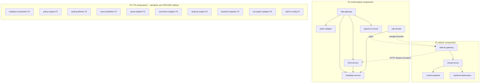
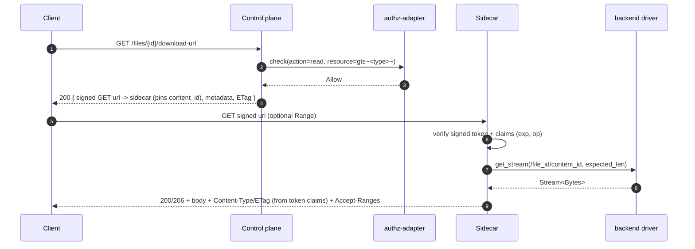
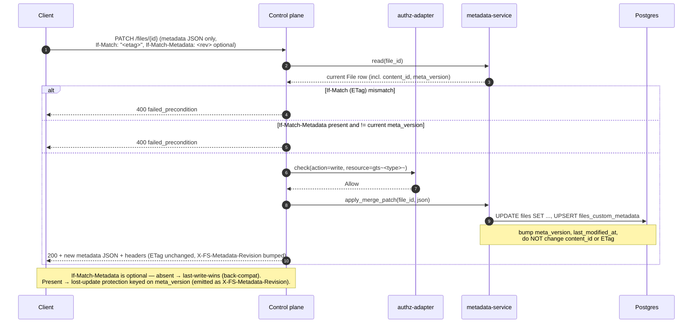
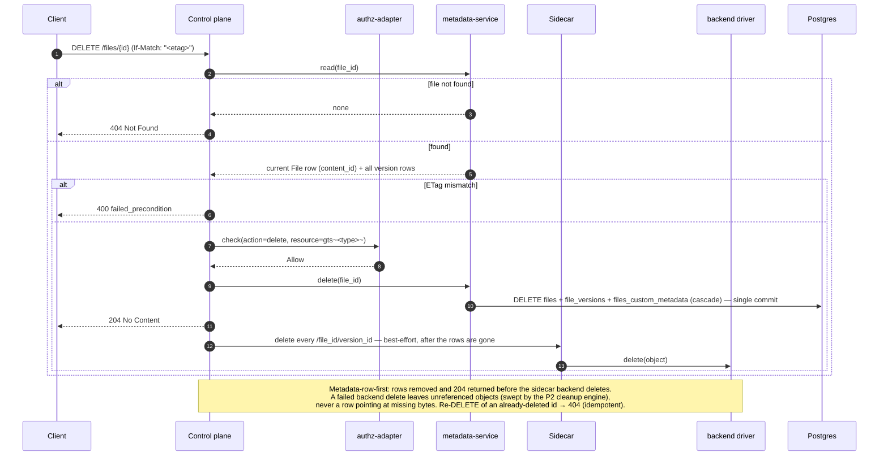
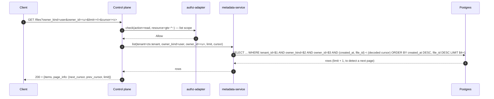
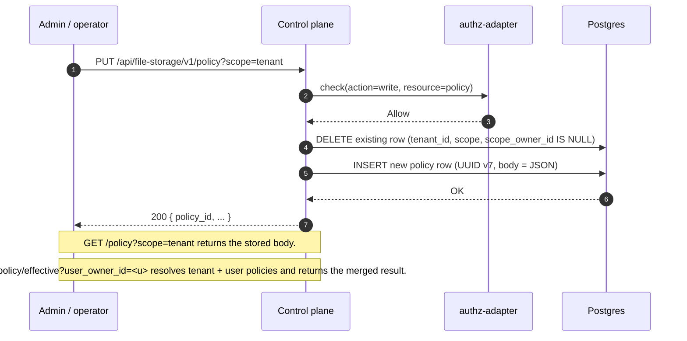

# Technical Design — FileStorage


<!-- toc -->

- [1. Architecture Overview](#1-architecture-overview)
  - [1.1 Architectural Vision](#11-architectural-vision)
  - [1.2 Architecture Drivers](#12-architecture-drivers)
  - [1.3 Architecture Layers](#13-architecture-layers)
- [2. Principles & Constraints](#2-principles--constraints)
  - [2.1 Design Principles](#21-design-principles)
  - [2.2 Constraints](#22-constraints)
- [3. Technical Architecture](#3-technical-architecture)
  - [3.1 Domain Model](#31-domain-model)
  - [3.2 Component Model](#32-component-model)
  - [3.3 API Contracts](#33-api-contracts)
  - [3.4 Internal Dependencies](#34-internal-dependencies)
  - [3.5 External Dependencies](#35-external-dependencies)
  - [3.6 Interactions & Sequences](#36-interactions--sequences)
  - [3.7 Database Schemas & Tables](#37-database-schemas--tables)
  - [3.8 Deployment Topology](#38-deployment-topology)
- [4. Additional Context](#4-additional-context)
  - [4.1 Random Read Access](#41-random-read-access)
  - [4.2 Hash & ETag Pipeline](#42-hash--etag-pipeline)
  - [4.3 Concurrency & Streaming Backpressure](#43-concurrency--streaming-backpressure)
  - [4.4 Quality Attribute Coverage](#44-quality-attribute-coverage)
  - [4.5 Signed-URL signature](#45-signed-url-signature)
  - [4.6 Worked example (LMS image upload and display)](#46-worked-example-lms-image-upload-and-display)
  - [4.7 Worked example (multipart upload and resume)](#47-worked-example-multipart-upload-and-resume)
  - [4.8 P1 implementation notes & decisions](#48-p1-implementation-notes--decisions)
  - [4.9 Testing](#49-testing)
- [5. Traceability](#5-traceability)

<!-- /toc -->

- [ ] `p1` - **ID**: `cpt-cf-file-storage-design-overview`
## 1. Architecture Overview

### 1.1 Architectural Vision

FileStorage is a tenant-aware, owner-aware file storage service for Gears, split into two cooperating planes (see
[ADR-0003](./ADR/0003-cpt-cf-file-storage-adr-sidecar-data-plane.md)):

- a **control plane** (the FileStorage API/SDK) that owns metadata, authorization, versioning, and conditional-request
  semantics, and whose REST surface **never carries file content** — it issues short-lived signed URLs instead;
- a **data-plane sidecar** that is the only component to move user bytes; it sits in front of a pluggable layer of
  backend drivers (local filesystem, S3-compatible object storage; more in later phases) and serves content only
  through those signed URLs.

Consumers never address backends directly — the signed URL always points at the sidecar — so backend opacity,
centralized per-byte metering, and uniform audit/policy coverage are preserved while the byte-moving data plane scales
independently of the control plane. A **read** is two requests: a control request to mint a signed GET URL, then a
data request against the sidecar. A **write** is presign (control — pre-registers a `pending` version and mints a
signed PUT URL) → `PUT` (data — the sidecar streams bytes to the backend) → finalize (data→control, a
token-authenticated HTTP callback — within a trusted network boundary, or over TLS/equivalent authenticated
encryption when it crosses an untrusted network — the sidecar makes after a successful `PUT` — the same signed
`fs-token` is its sole authorization, with no separate app-token or on-behalf-of delegation — flipping the version
`pending → available`). In the default `bind: "auto"` flow of `POST /files` that same finalize also binds the new
file's first content inline, so the write is two client requests (`POST /files` + `PUT`). With `bind: "manual"` —
and for `POST /files/{id}/versions` uploads, which never auto-bind — a `bind` (control — a separate, later request
the client issues to swap the file's `content_id` pointer under `If-Match`) follows, for three control-plane touches
and one data-plane touch. See §3.2 (`bind-service`, `sidecar-gateway`) for the finalize contract and §3.6 for the
sequence diagram.

The P1 architecture is deliberately narrow:

- A control-plane ToolKit gear (in-process, consumed by other Gears through ClientHub) plus a sidecar data plane on
  its own domain; **only the control plane touches the metadata DB** — the sidecar has no DB connection of any kind
  and resolves everything it needs (backend id, backend path, MIME, ETag) from the verified signed token's claims
- The control-plane HTTP namespace is auth-required (`/api/file-storage/v1`), platform-JWT-enforced, no anonymous
  surface in P1; content moves only over signed URLs against the sidecar
- Streaming I/O on the sidecar path; no full-file buffering regardless of file size
- A single, hard-coded content-hash algorithm — SHA-256, computed on the sidecar's streaming upload path (see
  [ADR-0002](./ADR/0002-cpt-cf-file-storage-adr-content-hash-selection.md)) — with two hash **modes** per
  [ADR-0006](./ADR/0006-cpt-cf-file-storage-adr-content-hash-modes.md): whole-object (`whole-sha256`) and a
  multipart offset-manifest composite (`multipart-composite-sha256`, §4.2). There is no configurable
  `hash_policy`/algorithm-allow-list surface in code
- Backend configuration via the platform's gear YAML config (control plane) and `FS_SIDECAR_*` env vars (sidecar);
  runtime/DB configuration is P3
- Content is an **immutable blob per version** at `/{file_id}/{version_id}`; a file's live content is the `content_id`
  pointer, swapped under optimistic CAS. Backend objects are **never mutated in place**
- Signed URLs carry an opaque, control-minted **Ed25519-signed compact token** — `base64url(payload).base64url(signature)`,
  codec-equivalent to PASETO `v4.public` (ADR-0004) but not literally PASETO (no footer, no `kid`; see §4.5) —
  stateless, pointing only at the sidecar. FileStorage issues no anonymous, per-recipient, or sharing links in P1 —
  that is the deferred sharing surface (see "Sharing boundary (P3)" below)

**Sharing boundary (P3).** Anonymous/public access, time-bounded URLs, named recipients, group targeting, per-link
download counters, and any other sharing primitives are out of P1/P2 scope and deferred to P3. The working name
for this future capability is "FileShare"; whether it ships as a separate Gear or as an extension of
FileStorage itself is **not decided here** and will be settled by a future ADR at the time the functionality is
implemented. FileStorage P1/P2 stores no sharing-related state, exposes no anonymous URL namespace, has no JWT-bypass
paths, and has no endpoints tied to that future decision.

Versioning itself is **P1** (FileStorage-level, backend-agnostic: each version is a distinct immutable object plus a
`content_id` pointer — see §3.1). P2 introduces multipart upload (server-authoritative parts plan with per-part
SHA-256 hashing — see §4.2 and ADR-0006 for the content-hash combiner), audit + events + quota + usage outbound flows, backend migration
(relocating bytes between backends without rotating URLs), the policy engine, and the **cleanup engine** (version
retention + orphan reconciliation). P3 adds runtime BYOS backend configuration, server-side encryption, read audit,
and the sharing capability described above (signing-key rotation is not a P3 item: the sidecar's ordered public-key
set — §4.5, `docs/operations.md` → `signing_key_seed` → Rotation — already makes a `signing_key_seed` rotation a
zero-outage operation). These phases are declared in the component model below with forward references to future
FEATURE artifacts; their detailed designs are deliberately out of scope for this document.

### 1.2 Architecture Drivers

#### Product Requirements

See [PRD.md](./PRD.md) §1 "Overview" and §1.3 "Goals":

- Unified storage for all Gears and platform users
- Tenant-scoped + principal-scoped ownership (`owner_kind ∈ {user, app}`, `tenant_id` mandatory)
- Persistent URLs that outlive provider-issued URLs (e.g., LLM Gateway media outputs)
- Pluggable backends without service rebuild

#### Functional Drivers

| PRD FR ID                                              | Design Response                                                                                                                                                          |
|--------------------------------------------------------|--------------------------------------------------------------------------------------------------------------------------------------------------------------------------|
| `cpt-cf-file-storage-fr-upload-file`                   | Control `POST /files` (authz) → signed PUT URL to the sidecar; sidecar streams bytes (incremental SHA-256, no in-stream MIME check) to the backend object `/{file_id}/{version_id}`, then calls the token-authenticated **finalize** callback (`pending → available`, size check via backend metadata, control-plane MIME check on a ranged prefix read); with `bind: "manual"` the client then separately **binds** the version (`content_id`) under `If-Match` — the default `bind: "auto"` binds inline in finalize (see `cpt-cf-file-storage-fr-auto-bind`) |
| `cpt-cf-file-storage-fr-download-file`                 | Control presign (authz) → signed GET URL to the sidecar; the sidecar streams the current `content_id` blob from its `backend-abstraction` driver                                                                                 |
| `cpt-cf-file-storage-fr-delete-file`                   | Control `DELETE /files/{id}` (requires `If-Match`): **metadata-row-first** — the `files` row and **all** its version rows are deleted in a committed transaction and `204` is returned, *then* the sidecar deletes the backend objects best-effort; a failed backend delete leaves only unreferenced objects swept by the P2 cleanup engine (never a row pointing at missing bytes). Idempotent: re-deleting returns `404`. Sequence in §3.6 |
| `cpt-cf-file-storage-fr-get-metadata`                  | Control `GET /files/{id}` (metadata JSON, supports `If-None-Match` → `304`) reads `files` + `files_custom_metadata` via `metadata-service` — no content on this surface; the sidecar has its own `HEAD` route on the signed download URL (same auth/`404` contract as `GET`, no body — api.md); there is no separate `HEAD` route on the control plane (§3.3) |
| `cpt-cf-file-storage-fr-list-files`                    | `GET /files` with mandatory `owner_kind` filter; tenant-scoped DB query through `metadata-service`                                                                       |
| `cpt-cf-file-storage-fr-content-type-validation`       | Validated on the **control plane, post-write**, not in-stream at the sidecar: `finalize`/`complete_multipart` read a bounded MIME-sniff prefix (ranged read) (`infra::content::mime`, `MIME_SNIFF_PREFIX_BYTES` ≈ 8 KiB) and reject a declared/actual mismatch with `400`, before the version is ever marked `available` |
| `cpt-cf-file-storage-fr-file-ownership`                | Columns `tenant_id`, `owner_kind`, `owner_id` on `files`; immutable except via P2 ownership transfer                                                                     |
| `cpt-cf-file-storage-fr-authorization`                 | Control `authz-adapter` calls PolicyEnforcer with `gts.cf.fstorage.file.type.v1~<gts_file_type>~` on presign/bind; the signed URL carries the decision to the sidecar. The sidecar's finalize callback is authorized solely by that same signed token — no separate authz call, no app-token/on-behalf-of delegation |
| `cpt-cf-file-storage-fr-tenant-boundary`               | DB queries scoped by `SecurityContext.tenant_id` via SecureConn; cross-tenant rows are invisible                                                                         |
| `cpt-cf-file-storage-fr-data-classification`           | No-op — FileStorage stores opaque bytes; classification is consumer concern                                                                                              |
| `cpt-cf-file-storage-fr-file-type-classification`      | `gts_file_type` column on `files`; format-validated on upload; included as resource attribute in every `authz-adapter` call                                              |
| `cpt-cf-file-storage-fr-metadata-storage`              | System columns + `files_custom_metadata` table; exposed as JSON on `GET` body and as `X-FS-*` headers on every response                                                  |
| `cpt-cf-file-storage-fr-update-metadata`               | Control `PATCH /files/{id}` JSON Merge Patch on metadata; bumps `meta_version`/`last_modified_at` and leaves `content_id`/ETag intact |
| `cpt-cf-file-storage-fr-retention-indefinite`          | No background purge in P1; files live until owner deletes                                                                                                                |
| `cpt-cf-file-storage-fr-backend-abstraction`           | `StorageBackend` async trait (in the **sidecar**) with capability sub-traits; backend types: `local-filesystem`, an opt-in in-memory backend, `s3-compatible`                                                                 |
| `cpt-cf-file-storage-fr-backend-capabilities`          | `BackendCapabilities` struct per driver, exposed via `GET /storages`; **no `versioning_native`** (versioning is FileStorage-level); `multipart_native` is active for `s3-compatible`/in-memory, inactive for `local-filesystem`; `encryption_native` inactive (P3)                     |
| `cpt-cf-file-storage-fr-backend-config-source`         | Platform gear YAML config (`gear_config`) loaded at gear startup → in-memory `BackendRegistry`; sidecar loads its own equivalent set from `FS_SIDECAR_*` env vars; surfaced read-only via `/storages`                                                                     |
| `cpt-cf-file-storage-fr-rest-api`                      | Control-plane Axum router under `/api/file-storage/v1`: metadata, listing, version bind, and signed-URL issuance via OperationBuilder — **no content endpoints** (content lives on the sidecar)                                                   |
| `cpt-cf-file-storage-fr-range-requests`                | See §4.1 Random Read Access for the full mechanics                                                                                                                       |
| `cpt-cf-file-storage-fr-conditional-requests`          | Content-only `ETag` derived from `(file_id, content_id)`; `If-None-Match` enforced on the control plane's metadata `GET` (→ `304`), `If-Match` on delete and on bind (required to rebind already-bound content, omittable only on a file's first bind); neither is processed on the sidecar's content `GET` |
| `cpt-cf-file-storage-fr-signed-urls`                   | Control plane mints an Ed25519-signed compact token (PASETO `v4.public`-equivalent codec, sole issuer); sidecar verifies with the public key; AND-combined claims (`op`, `file_id`, `version_id`, `backend_id`, `backend_path`, `exp`, upload size/hash) carried in the query (`?fs-token=`) or a header — `ip`/token-claim predicates are a documented, not-yet-implemented extension point — see §4.5 |
| `cpt-cf-file-storage-fr-file-versioning`               | `file_versions` table (P1); each version a distinct immutable object `/{file_id}/{version_id}`; current = `content_id` pointer; restore = re-bind a prior `version_id`; backend-agnostic |
| `cpt-cf-file-storage-fr-multipart-upload`              | P2 resumable multipart upload, owned by the `multipart-coordinator` component: `POST .../multipart` computes a server-authoritative parts plan (one signed sidecar URL per part); the sidecar streams each part without buffering; `complete` assembles and hashes the parts (offset-manifest composite, ADR-0006) and finalizes the version; `abort`/`introspect` round out the session lifecycle |
| `cpt-cf-file-storage-fr-auto-bind`                     | `bind: "auto"` (default) has the control plane's finalize handler (the sidecar's callback) bind the first content itself under a `content_id IS NULL` CAS, in the same transaction as the `pending → available` flip — the dominant single-file upload is 2 requests (`POST /files` + `PUT`); `bind: "manual"` keeps the separate, client-issued `bind` request |
| `cpt-cf-file-storage-fr-multipart-complete-lease`      | `complete_multipart_upload` is idempotent and returns `202 {state: "completing", retry_after_secs}` while another caller holds the completion lease, instead of a second concurrent assembly running; a retry (including after a page reload) replays the persisted result |
| `cpt-cf-file-storage-fr-sidecar-callbacks`             | The sidecar's `finalize`/`report-part` callbacks are token-authenticated HTTP `POST`s back to the control plane's `bind-service`, within a trusted network boundary or over TLS/equivalent authenticated encryption when crossing an untrusted network — no FS SDK call, no app-token, no on-behalf-of delegation; the previously-verified signed token is the callback's sole authorization |
| `cpt-cf-file-storage-fr-callback-internal-token`       | A mandatory interim gear-local shared-secret second factor (`x-fs-internal-token`, `FinalizeAuth`) layered on top of the signed upload token for the finalize/report-part callbacks; a stop-gap until the platform's `internal_auth` profiles are deployable in this gear |
| `cpt-cf-file-storage-fr-allowed-types-policy`          | `policy-engine` (P2): tenant/user-scoped allowed-MIME-type policy, resolved most-restrictive-wins and enforced on every storage-increasing write |
| `cpt-cf-file-storage-fr-size-limits-policy`            | `policy-engine` (P2): tenant/user-scoped size-limit policy (with per-MIME overrides), same most-restrictive-wins resolution and enforcement points as the allowed-types policy |
| `cpt-cf-file-storage-fr-metadata-limits`               | `policy-engine` (P2): per-file custom-metadata value-length and count limits, enforced at the service layer (P1 only applies coarse sanity limits) |
| `cpt-cf-file-storage-fr-retention-policies`            | `cleanup-engine` (P2): tenant/user/file-scoped retention rules (age / inactivity / metadata, OR semantics) are meant to drive a cleanup job that prunes whole expired files (**not enforced yet**: no background worker runs it) |
| `cpt-cf-file-storage-fr-orphan-reconciliation`         | `cleanup-engine` (P2): the same cleanup job (**not running yet**) is meant to reclaim abandoned `pending` versions and reaps expired multipart sessions (`AbortMultipartUpload`, part + pending-version rows removed) past their `expires_at` grace window |
| `cpt-cf-file-storage-fr-backend-migration`             | `backend-migrator` (P2): relocates a non-versioned file's content between backends (cost-tier moves, deprecation, residency, rebalancing, DR) after a mode-aware verified copy, without rotating `file_id`/`version_id` |
| `cpt-cf-file-storage-fr-upload-idempotency`            | Owner-scoped idempotency for uploads: an `idempotency_keys` table (P2) lets a retried `POST /files` with the same key replay the original ticket instead of creating a duplicate pending version |

#### NFR Allocation

| NFR ID                                          | Summary                                                              | Allocated To                                                                                                                              | Design Response                                                                                                                                                                                                                                                | Verification                                                                                                                                          |
|-------------------------------------------------|----------------------------------------------------------------------|-------------------------------------------------------------------------------------------------------------------------------------------|----------------------------------------------------------------------------------------------------------------------------------------------------------------------------------------------------------------------------------------------------------------|-------------------------------------------------------------------------------------------------------------------------------------------------------|
| `cpt-cf-file-storage-nfr-metadata-latency`      | reads/listings `<300 ms` p95 (1 thread, 1 core, 2M files); sync mutations `<2 s` p95 | `cpt-cf-file-storage-component-metadata-service`, `cpt-cf-file-storage-component-http-gateway`                                            | Single-row Postgres lookup on PK; covering index on `(tenant_id, owner_kind, owner_id, created_at)`. No backend round-trip on the `GET /files/{id}` metadata path                                                                                            | Load test driving `GET /files/{id}` at expected p95 traffic; p95 latency captured by OpenTelemetry histogram on `http-gateway`                       |
| `cpt-cf-file-storage-nfr-transfer-latency`      | `<2 s` fixed overhead p95 on content transfer                        | `cpt-cf-file-storage-component-stream-proxy`, `cpt-cf-file-storage-component-backend-abstraction`                                         | Streaming I/O end-to-end (axum `Body` ↔ `Stream<Bytes>` ↔ backend client); no full-file buffering. Range translated to backend-native range where supported                                                                                                    | Measure fixed delta between request arrival at the sidecar and first byte returned by backend; histogram per backend driver                           |
| `cpt-cf-file-storage-nfr-url-availability`      | URLs available for retention duration matching platform SLA          | `cpt-cf-file-storage-component-metadata-service`, `cpt-cf-file-storage-component-backend-abstraction`                                     | URLs are derived from `file_id` and remain valid as long as the file row exists; deleted files return `404`; ETag changes do not invalidate URLs (only their cached representations)                                                                            | Long-running soak: re-fetch a set of `file_id`s over the SLA window; verify no transient `5xx`/`404` for live files                                  |
| `cpt-cf-file-storage-nfr-durability`            | no service-induced loss of acknowledged writes; service RTO ≤ 15 min (DB/storage RPO/RTO: platform backup policy) | `cpt-cf-file-storage-component-metadata-service`, `cpt-cf-file-storage-component-backend-abstraction`                                     | DB row committed *after* the backend's streaming write (`put_stream`/`publish_exclusive`) returns success; backend durability is inherited from the chosen driver. A request-scoped **best-effort cleanup guard** fires `backend.delete(backend_path)` on any error between a successful streamed write and the committed `INSERT` (DB blip, client drop, panic), so the only residual leak is a hard process kill in that window — bounded and swept by the P2 `orphan-reconciler`. RTO covered by Postgres HA + gear restart procedures                                                                                       | Chaos test: kill gear mid-upload — partial uploads MUST NOT leave a committed row pointing to missing content; inject a post-write DB failure and assert the backend object is cleaned up (no orphan)                                       |
| `cpt-cf-file-storage-nfr-scalability`           | 2 million files in total; linear horizontal scaling                  | All P1 components — they are stateless except for the metadata DB                                                                         | No instance-local state in the request path; every instance can serve any file given the shared metadata DB and backend driver. Streaming I/O keeps **CPU and memory** bounded per request. The **bandwidth** dimension — the cost consciously accepted by `cpt-cf-file-storage-adr-sidecar-data-plane`, and confined to the sidecar — is modeled separately in `cpt-cf-file-storage-nfr-bandwidth`                                                                  | Load test: scale N → 2N instances, verify near-2× throughput; per-instance concurrency target measured at saturation                                  |
| `cpt-cf-file-storage-nfr-bandwidth`             | Per-sidecar-instance ingress+egress budget; full content traffic transits the sidecar | `cpt-cf-file-storage-component-stream-proxy`, `cpt-cf-file-storage-component-backend-abstraction`, deployment topology                    | `cpt-cf-file-storage-adr-sidecar-data-plane` routes every uploaded and downloaded byte through the sidecar, so per-sidecar-instance bandwidth — not CPU/memory, and not the control plane — is the binding constraint. P1 deployment budget: **target ≥ 2.5 GiB/s combined ingress+egress per instance** (≈ 1.25 GiB/s each way on a 25 GbE NIC, sized so the ≥1000 concurrent-ops target is bandwidth- rather than CPU-bound at typical media object sizes). Capacity = `ceil(peak aggregate transfer rate / per-instance budget)` instances; transfer load scales horizontally with the stateless replicas. Download caching is offloaded to the API-Gateway / CDN layer keyed on the content-only `ETag` the sidecar emits (plus any `Cache-Control`/`Vary` policy applied at that layer), so repeat-read egress need not re-transit the sidecar | Load test: saturate a single sidecar instance's NIC with concurrent downloads, confirm it sustains the per-instance budget before CPU saturates; verify CDN/proxy serves conditional re-reads from cache (no FileStorage egress on a cache hit) |

#### Key ADRs

| ADR ID                                                | Decision Summary                                                                                                                                                                                       |
|-------------------------------------------------------|--------------------------------------------------------------------------------------------------------------------------------------------------------------------------------------------------------|
| `cpt-cf-file-storage-adr-sidecar-data-plane`          | Control/data-plane split: the control plane issues signed URLs; the **sidecar** moves all bytes; backends never addressed directly by clients          |
| `cpt-cf-file-storage-adr-signed-url-transport`        | The signed-URL credential is a single opaque, Ed25519-signed compact token (PASETO `v4.public`-equivalent codec), carried in the query (`?fs-token=`) or a header; its format is private to control + sidecar (others treat it as opaque bytes)      |
| `cpt-cf-file-storage-adr-content-hash-selection`      | Content hash is a single hard-coded algorithm, SHA-256, with no configurable `hash_policy`/`allowed_algorithms`/allow-list surface; the two hash **modes** (whole-object, multipart-composite) are defined by `cpt-cf-file-storage-adr-content-hash-modes` (ADR-0006)                                                    |
| `cpt-cf-file-storage-adr-s3-client-selection`         | `S3Backend` (`durable: true`, `multipart_native: true`) is built on `rusty-s3` (+ `quick-xml`), executed over the crate's existing `reqwest` stack — no second HTTP/TLS stack; presigning is unused, since the sidecar is the sole holder of S3 credentials. Shipped and opt-in (`s3_backends` config), pending ADR-0005's security-review gate before use in a production release path |
| `cpt-cf-file-storage-adr-content-hash-modes`          | Two SHA-256 content-hash modes — whole-object (single-part) and a multipart offset-manifest composite (`root = sha256` of per-part `{offset}:sha256(part)` manifest), computed on-the-fly at upload, never by re-reading; client-verifiable. |
| `cpt-cf-file-storage-adr-storage-layout-rules`        | Storage key/backend placement stays the fixed `default_backend_id` + `/{file_id}/{version_id}` convention today; a single placement seam removes the duplicated/recomputed path formula, with an opt-in `StoragePlacementResolver` Rust plugin (resolved via the platform's GTS/`ClientHub` plugin pattern, falling back to today's convention when unset) as the extension point for hierarchical keys and dynamic per-tenant private-backend routing |

#### Quality Vectors

This design follows the Constructor Gears Quality Framework's five vectors in their priority order — Efficiency →
Reliability → Performance → Security → Versatility — and the trade-off rule from [PRD.md](./PRD.md) §6.4: that
order picks between otherwise-compliant options and never weakens a **MUST**-level requirement (tenant isolation,
authorization, content integrity foremost). See PRD.md §6.4 for the per-vector show-stopper requirements, and
§4.4 below for the concrete design mechanisms and observable signals behind each vector.

### 1.3 Architecture Layers

```mermaid
graph LR
    Client([Client / Browser / SDK]) -->|1. control: presign| AGW[API Gateway]
    AGW -->|/api/file-storage/v1<br/>JWT enforced| HGW
    Client -->|2. data: signed URL| SCGW

    Gear[Gear] -->|ClientHub trait| SDK[sdk-facade]
    SDK --> Meta
    SDK -.->|presign + transfer<br/>in consumer process| SCGW

    subgraph CP["Control plane (FileStorage ToolKit gear)"]
      HGW[http-gateway]
      HGW --> Meta[metadata-service]
      HGW --> AZ[authz-adapter]
      HGW --> SUI[signed-url-issuer]
      HGW --> BIND[bind-service]
      Meta --> DB[(Postgres<br/>file_storage schema)]
    end

    subgraph SC["Sidecar (data plane, own domain)"]
      SCGW[sidecar-gateway<br/>verify signature + token] --> Stream[stream-proxy]
      Stream --> Pipe[content-pipeline]
      Stream --> BA[backend-abstraction]
      BA --> S3D[s3-compatible driver]
      BA --> LFS[local-filesystem driver]
    end

    SCGW -.->|HTTP POST finalize<br/>token-authenticated (fs-token)| BIND
    SUI -.->|mint signed token| SCGW
    AZ -->|PolicyEnforcer| AuthZ[Authorization Service]
    S3D -.->|HTTPS| S3[(S3-compatible store)]
    LFS -.->|fs| Disk[(Local Disk)]
```

| Layer          | Plane    | Responsibility                                                                                                  | Technology                                                                       |
|----------------|----------|-----------------------------------------------------------------------------------------------------------------|----------------------------------------------------------------------------------|
| API            | control  | Metadata routing, conditional-request semantics, signed-URL issuance, version bind; **no content**              | axum, hyper, tower middleware, OperationBuilder                                  |
| Data plane     | sidecar  | Signature + token verification, streaming upload/download, Range, SHA-256 hashing (no in-stream MIME check), `Content-Type`/`ETag` echo from token claims | axum/hyper streaming, `rusty-s3` + `quick-xml` (S3, via `reqwest`), `tokio::fs`  |
| Application    | both     | Orchestration: presign, bind/CAS, metadata CRUD, capability discovery (control); byte pipeline (sidecar)        | Rust async services (tokio)                                                      |
| Domain         | control  | File identity, ownership, `content_id`/`meta_version`, ETag derivation, versions                                | Rust structs + SeaORM entities                                                   |
| Infrastructure | both     | Postgres metadata (control plane only — the sidecar has no DB connection); backend drivers (sidecar); PolicyEnforcer; platform gear YAML config (control) / env vars (sidecar backends); Ed25519 signing keys | SeaORM + SecureORM + SecureConn; `rusty-s3` + `quick-xml`; `tokio::fs`; Ed25519 via `ring` behind an in-house `SignatureProvider` abstraction (ADR-0004) |

## 2. Principles & Constraints

### 2.1 Design Principles

#### Backend opacity

- [x] `p1` - **ID**: `cpt-cf-file-storage-principle-backend-opacity`

Backends are an internal implementation detail. No public API surface — control REST, signed URL, SDK, or otherwise —
exposes backend-addressable URLs, backend-native identifiers, or backend-specific error shapes. Even the signed URL
points at the sidecar, not a backend. Clients learn at most that a backend has certain *capabilities*, never *which*
backend they are talking to.

**ADRs**: `cpt-cf-file-storage-adr-sidecar-data-plane`

#### Control plane carries no content

- [x] `p1` - **ID**: `cpt-cf-file-storage-principle-control-no-content`

The control-plane REST surface accepts and returns only metadata and signed URLs — never file bytes. All content is
moved by the sidecar over signed URLs. The single exception is the in-process SDK proxy mode, which streams in the
*consumer gear's* process (not the control-plane service). This is what lets the bandwidth-bound data plane scale
independently of the control plane.

**ADRs**: `cpt-cf-file-storage-adr-sidecar-data-plane`

#### Signed URLs, control-minted

- [x] `p1` - **ID**: `cpt-cf-file-storage-principle-signed-urls`

Content access is authorized by a short-lived, opaque **Ed25519-signed compact token** (PASETO `v4.public`-equivalent
codec, ADR-0004) that the **control plane alone mints** (holds the private key); the **sidecar only verifies** (holds
the public key) and can never forge one. The token carries AND-combined claims (`op`, `file_id`, `version_id`,
`backend_id`, `backend_path`, `exp`, and, for uploads, `max_size`/`exact_size`/`expected_hash`; download tokens also
carry `content_type`/`etag`, plus `content_sha256` for `whole-sha256`-mode versions only — verified end-to-end
against the full (non-`Range`) response stream, see api.md's "Signed URLs" §claims table) under one signature; it is
carried in the URL query (`?fs-token=`) or a header. An
`ip`/CIDR constraint and a token-claim predicate are a documented, not-yet-implemented extension point — `Claims`
carries no such fields today. Its **format is private to control + sidecar** — everyone else treats it as opaque
bytes and must not parse it (ADR-0004 "Token Opacity Contract"). Stateless: no DB lookup to verify, no per-token
revocation (revocation is the auth module's token revocation). See §4.5.

**ADRs**: `cpt-cf-file-storage-adr-sidecar-data-plane`, `cpt-cf-file-storage-adr-signed-url-transport`

#### Immutable blob + pointer

- [x] `p1` - **ID**: `cpt-cf-file-storage-principle-immutable-blob`

A backend object `/{file_id}/{version_id}` is written once and never mutated. A file's live content is the `content_id`
pointer; replacing content writes a **new** version and swaps the pointer under optimistic CAS (`If-Match`). This makes
versioning backend-agnostic, makes a concurrent-write conflict cheap to recover (re-bind, never re-upload), and keeps
the content-only ETag stable per version.

**ADRs**: `cpt-cf-file-storage-adr-sidecar-data-plane`

#### Streaming over buffering

- [x] `p1` - **ID**: `cpt-cf-file-storage-principle-streaming`

The sidecar's byte path moves bytes in chunks (axum `Body`/`Stream<Bytes>`) without holding whole files in memory.
This applies to uploads, downloads, and range requests. SHA-256 hashing is a tap-like operation that updates on each
chunk; it never blocks the chunk from continuing downstream. Magic-bytes/MIME detection is not part of this
in-stream tap — it runs on the control plane, post-write (§4.2).

**ADRs**: `cpt-cf-file-storage-adr-sidecar-data-plane`

#### Content-only content ETag

- [x] `p1` - **ID**: `cpt-cf-file-storage-principle-content-only-etag`

ETag is a function of `(file_id, content_id)` and hash is a function of the bytes only. Metadata updates change
`meta_version` and `last_modified_at` but not ETag or hash — keeping ETag a pure content cache-validator (so CDNs do
not invalidate cached bytes on a metadata-only change). Because ETag is deliberately content-only, `If-Match` on a
metadata-only update protects against concurrent **content** writes but cannot detect concurrent **metadata** writes.

Rather than leave metadata writes silently last-write-wins, P1 exposes the metadata revision as its own conditional
validator: the `meta_version` is already on the wire as `X-FS-Metadata-Revision: <u64>`, and a metadata-only update
MAY carry **`If-Match-Metadata: <u64>`**, matched against the current `meta_version` (mismatch →
`400 failed_precondition`). The header is
optional: absent, the write falls back to last-write-wins for back-compatibility; clients that store real state in
custom metadata (billing tags, classification, policy labels) opt in to lost-update protection. This keeps the wire
contract locked in P1 without composing it into ETag (which would defeat CDN caching on metadata-only changes).

**ADRs**: `cpt-cf-file-storage-adr-content-hash-selection`

#### Capability discovery, not feature flags

- [x] `p2` - **ID**: `cpt-cf-file-storage-principle-capabilities`

Optional backend features (multipart, encryption) are declared per backend as capabilities, not bolted on as runtime
flags. Clients query `/storages` and adapt. `multipart_native` is active where the backend supports it
(`s3-compatible`, the in-memory test backend; not `local-filesystem`); `encryption_native` remains declared but
inactive (P3). Versioning is **not** among the capabilities — it is FileStorage-level (§3.1), not a backend
capability.

**ADRs**: `cpt-cf-file-storage-adr-content-hash-selection`

### 2.2 Constraints

#### ToolKit in-process control gear

- [x] `p1` - **ID**: `cpt-cf-file-storage-constraint-toolkit-gear`

The **control plane** runs as an in-process ToolKit gear, registered via `#[toolkit::gear]`. Inter-gear callers use
the generated SDK trait via ClientHub. There is no out-of-process gRPC variant of the control plane in P1; the OoP
SDK path is reserved as a P3 escape hatch (it hands callers a signed URL rather than streaming through the control
plane).

#### Sidecar is a separate deployable with no DB access

- [x] `p1` - **ID**: `cpt-cf-file-storage-constraint-sidecar`

The **sidecar** is a separate deployable on its own domain, scaled independently of the control plane. It holds no
authoritative state of its own and has **no direct DB connection at all** (§3.8) — it resolves everything it needs
purely from the verified signed token's claims and verifies signed URLs with a control-distributed public key. This
is what makes it a full FileStorage data plane that can be relocated/co-located without a wire-contract change
(see §3.8).

#### Postgres as the metadata store

- [x] `p1` - **ID**: `cpt-cf-file-storage-constraint-postgres`

File metadata, custom metadata, and (P3) backend configurations are persisted in Postgres via SeaORM + SecureORM.
Tenant scoping happens through SecureConn — there is no direct un-scoped DB access from request handlers.

#### Configuration via the platform's gear YAML config

- [x] `p1` - **ID**: `cpt-cf-file-storage-constraint-toml-config`

Backend definitions (`local-fs`, the opt-in `memory` backend, and any `s3_backends` entries) are loaded from the
gear's own YAML config section (`FileStorageConfig`, via the platform's `gear_config`) at gear startup; the sidecar
reads its own equivalent set from `FS_SIDECAR_*` env vars (`FS_SIDECAR_S3_BACKENDS`).
Changing the set of backends or their credentials requires a restart. Runtime/DB-driven configuration with admin
tooling is a P3 deliverable (`cpt-cf-file-storage-fr-runtime-backends`).

## 3. Technical Architecture

### 3.1 Domain Model

**Technology**: Rust structs (`file-storage-sdk` crate) backed by SeaORM entities (`file-storage` crate's infra layer)
per the [ToolKit SDK layering guide](../../../docs/toolkit_unified_system/02_gear_layout_and_sdk_pattern.md).

**Location**: the SDK crate's public model types, backed by SeaORM entities in the gear's storage
infrastructure layer.

**Core Entities**:

| Entity                | Description                                                                                                                                |
|-----------------------|--------------------------------------------------------------------------------------------------------------------------------------------|
| `File`                | Logical file: identity (`file_id`), tenant, owner, gts type, current content pointer (`content_id`), `meta_version`, timestamps. Holds **no** bytes |
| `Version`             | An immutable content blob of a file: `(file_id, version_id, size, hash_algorithm, hash_value, hash_mode, part_count, status, is_current, created_at)`; backend object at `/{file_id}/{version_id}`. `hash_mode` (ADR-0006) is `whole-sha256` or `multipart-composite-sha256`; `part_count` is set only for the latter, whose manifest lives in `version_hash_manifest` |
| `CustomMetadata`      | User-defined key-value pairs attached to a `File`; one row per `(file_id, key)`                                                            |
| `OwnerPrincipal`      | Tagged union `{User(UserId), App(GearId)}`; carried as `(owner_kind, owner_id)` on `File`                                                |
| `VersionState`        | Enum `{Pending, Available}`; a version is `Pending` from pre-register until **finalize** (the sidecar's post-`PUT` callback), then `Available`. Binding — swapping which version is the file's current `content_id` — does not itself change a version's status (it follows finalize: inline in the same transaction for `bind: "auto"`, otherwise a separate, later client request) |
| `ContentId`           | The `version_id` currently bound as the file's live content (`File.content_id`); changing it is a pointer swap                              |
| `ETag`                | Opaque `String` (HTTP-quoted lowercase hex of a truncated SHA-256 digest — `domain::etag::content_etag`); derived from `(file_id, content_id)`; **MUST NOT** equal `hash_value`                     |
| `SignedUrl`           | A control-minted **Ed25519-signed compact token** (`base64url(payload).base64url(signature)`), codec-equivalent to PASETO `v4.public` but not literally PASETO (no footer, no `kid`) — carrying claims `(op, file_id, backend_id, backend_path, version_id, exp, constraints)`; **opaque** to all but control+sidecar; carried as `?fs-token=` query or `X-FS-Token` header (§4.5) |
| `ByteRange`           | Parsed `Range` request: `Inclusive(start, end)`, `OpenEnded(start)`, `Suffix(length)`                                                       |
| `HashPolicy`          | **Not implemented.** No `HashPolicy`/`hash_policy` config surface exists in code (P1/P2 hash algorithm is hard-coded SHA-256; see ADR-0006 for the two shipped `hash_mode`s instead) |
| `BackendCapabilities` | Per-backend feature flags: `multipart_native`, `encryption_native`, `range_native`, `presigned_url_internal` (no `versioning_native` — versioning is FS-level) |
| `BackendConfig`       | Declared instance: `id`, `kind`, `endpoint`, `credentials`, `capabilities` (no `hash_policy` — that surface is not implemented, see above). Loaded from the platform gear YAML config in P1 (control plane); the sidecar loads its own equivalent set from `FS_SIDECAR_*` env vars |

**Relationships**:

- `File` → `OwnerPrincipal` (composition; immutable except via P2 ownership transfer)
- `File` → `Version` (1:N; all cascade-deleted with the file). `File.content_id` references the current `Version`
- `File` → `CustomMetadata` (1:N; cascade-deleted with the file)
- `Version` → `BackendConfig` (reference by `backend_id`; immutable per version. A new content write creates a new
  `Version` — possibly on a different backend — rather than mutating an existing one; the P2 `backend-migrator`
  relocates a version's bytes without rotating the `file_id`/`version_id`)
- `ETag` ← derived from `(file_id, File.content_id)`
- `BackendCapabilities` ← embedded in `BackendConfig`; surfaced read-only via `GET /storages`

### 3.2 Component Model



#### `http-gateway`

- [x] `p1` - **ID**: `cpt-cf-file-storage-component-http-gateway`

##### Why this component exists

The **control-plane** HTTP entry point. Owns route registration, security middleware, conditional-request semantics,
and error mapping to RFC 7807 Problem+JSON. It carries **no file content** — content moves over signed URLs against
the sidecar.

##### Responsibility scope

- Register the auth-required router `/api/file-storage/v1/*` with the platform `security_context_layer`; **all
  endpoints are JSON** via OperationBuilder (metadata CRUD, listing, `GET /storages`, presign, bind)
- Parse and validate conditional headers and enforce conditional-request semantics (return `304` for cache validation
  and `400 failed_precondition` for failed preconditions, per the platform canonical-error mapping), including the optional `If-Match-Metadata` precondition on
  metadata-only updates (matched against `meta_version`)
- Dispatch presign requests to `signed-url-issuer` (upload / download / multipart-part) and bind/rebind requests to
  `bind-service`; metadata reads/writes to `metadata-service`
- Map domain errors to status codes + Problem+JSON bodies per `docs/toolkit_unified_system/05_errors_rfc9457.md`
- Populate **metadata** response headers (`ETag`, `Last-Modified`, all `X-FS-*` system metadata, `X-FS-Meta-<key>`
  with RFC 8187 encoding for non-ASCII). Content-transfer headers (`Accept-Ranges`, `Content-Range`) are the sidecar's

##### Responsibility boundaries

Does not perform authorization decisions itself — delegates to `authz-adapter`. Does not stream or buffer file bytes
— that is the sidecar (`sidecar-gateway` / `stream-proxy`). Does not sign URLs itself — delegates to
`signed-url-issuer`.

##### Related components

- `cpt-cf-file-storage-component-authz-adapter` — calls before every auth-required handler
- `cpt-cf-file-storage-component-metadata-service` — calls for metadata read/write
- `cpt-cf-file-storage-component-signed-url-issuer` — mints signed URLs for content operations
- `cpt-cf-file-storage-component-bind-service` — pre-register / bind / rebind under CAS

#### `signed-url-issuer`

- [x] `p1` - **ID**: `cpt-cf-file-storage-component-signed-url-issuer`

##### Why this component exists

Mints the Ed25519-signed tokens (PASETO `v4.public`-equivalent codec, §4.5) that authorize a content operation
against the sidecar. The control plane is the **sole minter** (holds the private key).

##### Responsibility scope

- Mint a token carrying the claims `(op, file_id, version_id, backend_id, backend_path, exp, upload constraints,
  and, for downloads, content_type/etag, plus content_sha256 for whole-sha256 versions only)`, signed with the
  control-plane Ed25519 private key (§4.5). It is returned as a `?fs-token=<token>` URL or to be sent as an `X-FS-Token` header. Because the sidecar has no DB connection
  (§3.8), **`backend_id`/`backend_path` are carried directly in the token** rather than resolved from the version
  row at verify time
- Resolve the target: for download, the file's current `content_id` (or an explicit `version_id`); for upload, allocate
  nothing here (the version is pre-registered by the control plane itself, in the same request that returns this
  token — see `bind-service`)
- Attach AND-combined constraints: `exp` required; `max_size`/`exact_size`/`expected_hash` optional (upload).
  `content_type`/`etag` are populated on download tokens only — there is no general response-header override
  mechanism (no `Content-Disposition`/`Cache-Control` claim). An `ip`/CIDR constraint and a token-claim predicate
  are a documented, not-yet-implemented extension point (§4.5)
- Never emit a backend-addressable URL — the URL host is always the sidecar

##### Responsibility boundaries

Does not verify signatures (that is the sidecar). Does not touch bytes. Does not write metadata.

##### Related components

- `cpt-cf-file-storage-component-http-gateway` — caller
- `cpt-cf-file-storage-component-sidecar-gateway` — verifier of what this issues

#### `bind-service`

- [x] `p1` - **ID**: `cpt-cf-file-storage-component-bind-service`

##### Why this component exists

Owns the version lifecycle on the control side: **pre-register** a `pending` version (part of the presign request the
client makes *before* any bytes move), **finalize** it once the sidecar reports a successful `PUT` (data→control
callback), and **bind** a finalized version as the file's current `content_id` under optimistic CAS.

##### Responsibility scope

- **Pre-register**: `INSERT` a `pending` `file_versions` row and allocate `version_id` as part of handling
  `POST /files` / `POST /files/{id}/versions` — this runs on the control plane *before* the signed PUT URL is even
  returned, not as a separate call the sidecar makes later
- **Finalize** (`status: pending → available`): invoked by the **sidecar**, over a token-authenticated HTTP `POST` —
  within a trusted network boundary, or over TLS/equivalent authenticated encryption when it crosses an untrusted
  network — authorized by the same signed upload token (`fs-token`) that authorized the `PUT` plus the mandatory
  `x-fs-internal-token` credential — no FS SDK call, no on-behalf-of delegation. Trusts the sidecar-measured
  size/hash, checks the size against the stored object (metadata), and validates MIME from a ranged prefix read
  rather than re-reading the blob. With a `bind: "manual"` token (and for
  `POST /files/{id}/versions` uploads) it does **not** touch `content_id`; a `bind: "auto"` token (a new file's first
  content) makes it also bind the version in the same transaction, under a strict `content_id IS NULL`
  compare-and-set that can never replace existing content, and return the outcome to the sidecar for transparent
  forwarding (`X-FS-Bound`/`ETag`/`X-FS-Current-ETag`)
- **Bind** (`content_id := version_id`): optimistic CAS on the current `content_id`/ETag via `If-Match`; on mismatch
  return a precondition-failed error (client re-reads the ETag and retries). `If-Match` may be omitted only on the
  first bind of a file that has no content yet; rebinding already-bound content requires it (precondition-failed
  otherwise). Invoked by the client as a separate, later control-plane request — for `bind: "manual"` uploads,
  `POST /files/{id}/versions` uploads, and a rebind after a lost auto-bind compare-and-set. The sidecar itself never
  binds and never calls this on the client's behalf (in the default `bind: "auto"` flow the control plane's finalize
  handler performs the first-content swap inline)
- Validate a client bind against the DB: the target `version_id` must exist with status `available` (i.e. already
  finalized)
- Bump nothing else — content writes do not bump `meta_version`

##### Responsibility boundaries

Does not stream bytes. Trusts the sidecar-reported `size`/`hash` (the callback is authenticated by the mandatory internal credential) — finalize
only cross-checks the size against the stored object's length and reads a MIME prefix; it does not re-read or re-hash the object.

**Traces to**: the sidecar-callbacks and callback-internal-token requirements — see
[§1.2 Architecture Drivers](#12-architecture-drivers)

##### Related components

- `cpt-cf-file-storage-component-metadata-service` — persists the version rows + pointer swap
- `cpt-cf-file-storage-component-sidecar-gateway` — calls finalize over a token-authenticated HTTP callback (not the
  FS SDK, no app-token/on-behalf-of); bind is called by the client directly, never by the sidecar

#### `sidecar-gateway`

- [x] `p1` - **ID**: `cpt-cf-file-storage-component-sidecar-gateway`

##### Why this component exists

The **sidecar's** HTTP entry point on its own domain. Verifies the signed URL, then drives the byte path. The only
component clients hit for content.

##### Responsibility scope

- Verify the signed token (Ed25519, §4.5) with the control-distributed public key; check the signature, `exp`, and
  the `op`/`file_id`/`version_id` binding (plus `part_number` for multipart-part tokens); reject with `403` on any
  failure. `ip`/CIDR and token-claim predicates (`tok.<claim>`) are not implemented — `Claims` carries no such
  fields and the sidecar makes no platform-JWT call of any kind (see §4.5's verification checklist)
- Parse the `Range` header (to `ByteRange`) and conditional headers; serve `200`/`206`/`416` for downloads. There is
  no conditional `304` on this path — `If-None-Match` is not implemented on the sidecar (§4.1)
- On upload: stream the body through `stream-proxy` to the backend first (the version was already pre-registered by
  the control plane at presign time — the sidecar does **not** pre-register); once bytes have landed, call the
  control plane's token-authenticated **finalize** callback (same `fs-token`, no app-token, no on-behalf-of
  delegation, no FS SDK call) to flip the version `pending → available`. The sidecar does **not** bind (it never
  reads the bind claim and never calls the bind endpoint) — for a `bind: "manual"` upload, binding (the CAS swap of
  `content_id`) is a separate request the client issues to the control plane afterwards; for the default
  `bind: "auto"`, the control plane's finalize handler performs the first-content swap inline and the sidecar only
  forwards the outcome on its `PUT` response (`X-FS-Bound`/`ETag`/`X-FS-Current-ETag`)
- Echo the token's `content_type`/`etag` claims as `Content-Type`/`ETag` — the only response-header values the
  token carries; advertise `Accept-Ranges: bytes`
- Own the **best-effort cleanup**: on any error after the streaming write started (the sidecar itself aborts only on stream
  errors and the size/hash constraint checks — there is no in-sidecar `415` magic-bytes abort, see
  `content-pipeline` above), delete the partially-written object; a hard crash leaves an orphan swept by the P2
  cleanup engine
- **CORS is not implemented.** The sidecar emits no `Access-Control-*` response headers and answers no preflight
  `OPTIONS` request. A browser issuing the signed-URL `PUT`/`GET`/part-upload directly against the sidecar from a
  different origin than the sidecar's own will have the request blocked by the browser itself before it ever
  reaches the token-verification step above. Deployments that serve browser clients from a different origin than
  `sidecar_base_url` must front the sidecar with a CORS-terminating proxy/gateway until this is implemented.

##### Auth model (exception to gateway-auth)

Because the sidecar is **not** fronted by the API Gateway (it is the data-plane exception, see PRD §1.1), it does
**not** receive a gateway-derived `SecurityContext`. Authorization for a content request is carried entirely by the
**signed token** (the delegated authorization artifact, see §4.5): the sidecar verifies the token's signature and
claims and treats that as the access decision for this resource + operation until `exp` — it performs **no fresh PDP
call** and makes **no platform-JWT call of any kind**. A platform JWT in `Authorization` gated by a token-claim
predicate is not implemented (§4.5) — the sidecar never validates one today. The sidecar derives no tenant/owner
`SecurityContext` of its own beyond what the token asserts.
Request-id propagation and rate-limiting are the sidecar's own responsibility (it is not behind the gateway): it
honours/propagates `X-Request-Id` and applies its own per-instance connection/bandwidth limits; the per-URL
`max_rate`/`max_conns` claims described in §4.5 are not implemented.

##### Responsibility boundaries

Makes no authorization *decision* — it enforces the decision already encoded in the signed URL and the token
predicates. Does not own metadata authority — it calls control `bind-service`'s finalize endpoint over a
token-authenticated HTTP callback, within a trusted network boundary or over TLS/equivalent authenticated encryption
when it crosses an untrusted network (not the FS SDK, no delegated identity); it never calls bind.

##### Related components

- `cpt-cf-file-storage-component-stream-proxy` — the byte path it drives
- `cpt-cf-file-storage-component-bind-service` — token-authenticated finalize callback only (never bind)
- `cpt-cf-file-storage-component-signed-url-issuer` — issuer of the URLs it verifies

#### `stream-proxy`

- [x] `p1` - **ID**: `cpt-cf-file-storage-component-stream-proxy`

##### Why this component exists

The data plane. Wires the byte path from HTTP body ↔ hashing tap ↔ backend driver, in both upload and download
directions, without buffering the whole file at any point.

##### Responsibility scope

- **Upload path**: receive the raw `axum::body::Body` of the signed `PUT` (or one multipart part); tee chunks through
  the incremental SHA-256 hasher (no in-stream MIME/magic-byte check — see `content-pipeline` above for why); forward
  chunks to the selected backend driver via `StorageBackend::publish_exclusive()`/`put_stream()` at
  `/{file_id}/{version_id}`. On stream completion, emit final hash and the persisted `ObjectRef` from the driver
- **Download path**: invoke `StorageBackend::get_stream(backend_path, expected_len)` (whole object) or
  `get_range_stream(backend_path, range, expected_len)` and pipe the returned `Stream<Bytes>` into the HTTP response
  body. Pass `ByteRange` through to backends that declare `range_native = true`; otherwise the driver's own range
  adapter applies (see §4.1)
- **Backpressure**: respect the slowest of (client, backend) by holding flow control on the stream; no internal
  queueing beyond the natural one-chunk lookahead
- **Cancellation**: if the client drops, the upstream backend operation is aborted (S3 SDK abort / fs handle drop)

##### Responsibility boundaries

Does not perform authorization, validation, or metadata persistence. Does not know about HTTP semantics — only `Body`
in and `Body` out. Does not decide which backend to use — the target `/{file_id}/{version_id}` and its `backend_id`
come from the pre-registered version carried in the signed-URL context.

##### Related components

- `cpt-cf-file-storage-component-content-pipeline` — taps the upload stream
- `cpt-cf-file-storage-component-backend-abstraction` — calls drivers for put/get/delete/stat
- `cpt-cf-file-storage-component-sidecar-gateway` — its byte-source and byte-sink

#### `content-pipeline`

- [x] `p1` - **ID**: `cpt-cf-file-storage-component-content-pipeline`

##### Why this component exists

Runs the one streaming tap the sidecar performs on every upload: incremental SHA-256 hashing, computed as bytes flow
through to the backend so the digest is available the instant the stream ends, with no re-read of the body.
MIME/magic-byte validation is a **separate, control-plane** check (see below and §4.1), not a second in-sidecar tap —
this component's own surface is hashing only.

##### Responsibility scope

- **SHA-256 hasher**: the sidecar's upload handlers hash incrementally as bytes stream to the backend
  (`hash::Hasher`), and the control plane trusts the digest the sidecar reports on the authenticated finalize callback
  (see §4.2). Algorithm tag is `"SHA-256"`, the sole hard-coded algorithm
  (`cpt-cf-file-storage-adr-content-hash-selection`)
- **Magic-bytes / MIME validation runs on the control plane, not the sidecar.** There is no in-stream sidecar-side
  magic-byte tap and no in-sidecar `415` abort path. MIME validation (`infer`-crate-based sniffing,
  `infra::content::mime`) runs **on the control plane**, after the bytes have already fully landed: at single-part
  `finalize` and at multipart `complete` (which additionally issues one bounded ~8 KiB ranged read of the assembled
  object purely for this sniff — see §4.2). A mismatch there is rejected with `400`, and the version is never marked
  `available`; any bytes already written to the backend become an orphan (reclaimed once a cleanup job exists; none runs yet), not deleted
  synchronously
- **No buffering of subsequent bytes** (sidecar hashing tap): once a chunk is hashed it passes through unchanged

##### Responsibility boundaries

Does not maintain state across requests. Does not own backend selection. Does not transform bytes — only inspects.
Does not validate MIME/content-type — that runs on the control plane (see above).

##### Related components

- `cpt-cf-file-storage-component-stream-proxy` — invokes the pipeline per chunk (in the sidecar)

#### `metadata-service`

- [x] `p1` - **ID**: `cpt-cf-file-storage-component-metadata-service`

##### Why this component exists

Owns the `files`, `file_versions`, and `files_custom_metadata` tables. Every request that needs to know "does this
file exist, who owns it, which version is current?" goes through here. Owns ETag derivation, the `content_id` pointer,
and `meta_version`. (The pointer-swap CAS itself is driven by `bind-service`; this component is its persistence layer.)

##### Responsibility scope

- CRUD on `files` rows (create, read, metadata update, delete-with-all-versions) and on `file_versions`
  (`pending`/`available`, `is_current`, per-version `size`/`hash`)
- CRUD on `files_custom_metadata` (JSON Merge Patch applied row-by-row)
- Derive the opaque `ETag` on the fly from `(file_id, content_id)` per §4.2 — there is no persisted ETag column;
  `content_id` (the current `version_id`) is the only stored input
- Persist the bind: set `File.content_id := version_id` and flip that version to `is_current`/`available`. Content
  writes do **not** bump `meta_version`; metadata-only updates bump `meta_version` and `last_modified_at`
- Enforce tenant boundary via SecureConn — every query/mutation passes through the request's `SecurityContext`
- Tenant + mandatory owner filter on `GET /files`; keyset cursor pagination, navigable in either direction
  (`limit`/`cursor` query params, default 25, max 200, capped by `FileStorageConfig::max_page_size`);
  ordered `created_at DESC, file_id DESC` (the `file_id` tie-breaker keeps the keyset page boundary stable across
  rows sharing a `created_at` instant), index-backed by `(tenant_id, owner_kind, owner_id, created_at DESC, file_id
  DESC)`. `GET /files`, `GET /files/{id}/versions`, and `GET /retention-rules` all return
  `{items, page_info: {next_cursor, prev_cursor, limit}}` (`toolkit_odata::Page<T>`), never a bare JSON array —
  `prev_cursor` is `null` only on the first page of a walk (no cursor supplied) or once a backward walk has reached
  its end; a backward page (`cursor` set to a previous `prev_cursor`) is still returned in the same canonical
  order, never reversed. OData `$filter`/`$orderby` is not implemented. List a
  file's versions ordered by `created_at DESC, version_id DESC` (same tie-breaker reasoning), same keyset model
- Reject PRD-defined constraints at this layer when they are not enforceable as DB constraints (e.g., GTS format
  validation regex, tenant policy delta in P2)

##### Responsibility boundaries

Does not call backend drivers itself. Does not perform authorization checks. Does not stream content.

##### Related components

- `cpt-cf-file-storage-component-http-gateway` — primary caller
- `cpt-cf-file-storage-component-sdk-facade` — exposes the same operations to in-process gear consumers

#### `backend-abstraction`

- [x] `p1` - **ID**: `cpt-cf-file-storage-component-backend-abstraction`

##### Why this component exists

The single seam (in the **sidecar**) between FileStorage and any concrete storage technology. The trait surface is
small and async; each optional capability (multipart, encryption) is a separate sub-trait that drivers opt into.
Versioning is **not** a backend capability — FileStorage versions via distinct immutable objects
`/{file_id}/{version_id}`.

##### Responsibility scope

- Define the `StorageBackend` async trait: `put_stream`/`publish_exclusive` (streamed writes; no whole-object `put`),
  `get_stream`/`get_range_stream`/`read_prefix` (streamed reads, plus a capped small-prefix read for MIME sniffing;
  no whole-object `get`), `delete`, `stat`, `capabilities`
- Define capability sub-traits: `MultipartCapable`, `EncryptionCapable` (both P2/P3 use, but the trait shapes are
  declared from P1 so consumers can downcast/probe)
- Maintain the `BackendRegistry` — in-sidecar map of `backend_id → Arc<dyn StorageBackend>` populated at startup from
  the sidecar's own `FS_SIDECAR_*` env vars (a separately-configured set, not shared state read from the control
  plane's YAML config or the DB)
- Backend types shipped: `local-filesystem` (default; `tokio::fs` reads/writes under a configured root directory,
  native Range via `seek + take`), an opt-in in-memory backend (`enable_in_memory_backend` — test/dev only,
  non-durable, content lost on restart), and `s3-compatible` (opt-in via `s3_backends` config; `rusty-s3` +
  `quick-xml` executed over the crate's `reqwest` stack, works against AWS S3, Backblaze B2, Wasabi, etc. (and
  `s3s-fs`, this gear's own test double);
  native Range via the backend `GetObject` Range header; native multipart). GCS/Azure Blob and DB-resident
  runtime-configured backends (`admin-config`) remain deferred to P3
- Reject any operation that depends on a capability the configured backend has not declared (`409 Conflict` /
  `501 Not Implemented` depending on context)

##### Responsibility boundaries

Drivers never see HTTP, never see `SecurityContext`. The trait works in bytes and paths only — domain knowledge stays
above the trait. Drivers MAY use internal-only capabilities (`presigned_url_internal`) for backend-to-backend
replication or migration tooling, but those capabilities are **never** surfaced through the public capability
discovery endpoint and are unreachable from the SDK-facing call site.

##### Related components

- `cpt-cf-file-storage-component-stream-proxy` — main caller for content I/O
- `cpt-cf-file-storage-component-metadata-service` — calls `stat` during reconciliation paths

#### `authz-adapter`

- [x] `p1` - **ID**: `cpt-cf-file-storage-component-authz-adapter`

##### Why this component exists

Wraps the platform PolicyEnforcer with FileStorage-specific request shaping: every check carries the file's GTS type
in the resource context so that the Authorization Service can apply per-type policies.

##### Responsibility scope

- For each auth-required operation, build a `PolicyRequest` with:
  - `subject = SecurityContext.principal` — the user, resolved from the platform JWT
  - `action ∈ {read, write, delete, ownership.transfer}` mapped from the endpoint
  - `resource = gts.cf.fstorage.file.type.v1~<gts_file_type>~<file_id>`
- For **content** operations the read/write check runs at **presign** time (control plane); the resulting
  authorization is then carried to the sidecar inside the signed URL — the sidecar makes no fresh AuthZ call. The
  sidecar's later finalize/report-part callbacks never call `authz-adapter` either: they run under an unrestricted
  internal scope, treating the previously-verified signed token itself as the full authorization for that specific
  `(file_id, version_id)` operation (no app-token, no on-behalf-of delegation)
- Call `PolicyEnforcer::check` (in-process via ClientHub)
- Convert `Deny` decisions to `403 Forbidden` Problem+JSON; `Allow` decisions are silent

##### Responsibility boundaries

Does not cache decisions in P1 (each request is checked fresh). Does not implement role-based shortcuts — it asks the
AuthZ service every time. Tenant-boundary enforcement is independent of this PDP check: every point operation first
resolves its target row within the caller's tenant (`SecureConn`/`AccessScope`), and listing applies the same tenant
scope directly — so a cross-tenant file is invisible before authorization is even evaluated.

##### Related components

- `cpt-cf-file-storage-component-http-gateway` — calls before dispatch on auth-required routes
- `cpt-cf-file-storage-component-metadata-service` — provides `gts_file_type` for the resource context

#### `sdk-facade`

- [ ] `p1` - **ID**: `cpt-cf-file-storage-component-sdk-facade`

> **Status: Level 1 implemented, Level 2 not implemented.** Every control-plane operation runs in-process:
> `FileStorageLocalClient` (registered with `ClientHub` as `dyn FileStorageClientV1`) calls the exact same services
> the REST handlers call — create/presign, conditional get, list, metadata update, delete, download-URL issuance,
> version listing/presign/bind/delete, multipart upload (initiate/introspect/complete/abort), ownership transfer,
> backend migration/discovery, and policy/retention-rule administration — under the caller's own `SecurityContext`,
> so the same authorization decisions, audit rows, and idempotency behavior apply as for the REST surface. The SDK
> never transfers file bytes itself: `create_file`/`presign_version`/`download_url` return signed URLs the caller
> still `PUT`s/`GET`s against the sidecar over HTTP, exactly as a REST client would. **Level 2 — proxying the
> two-step (presign + sidecar transfer) *inside* the SDK as a seekable reader/writer, so a caller never sees a signed
> URL at all — is not implemented.** A consuming Gear wanting that today still drives the sidecar HTTP calls itself.

##### Why this component exists

In-process SDK trait for other Gears (LLM Gateway, Reporting, etc.). Mirrors the control API one-to-one in domain
types. Level 1 (implemented) saves the HTTP hop to this gear's own REST surface for every control-plane decision.
Level 2 (not implemented) would additionally **proxy the two-step (presign + sidecar transfer) inside the consumer
gear's process** so a caller sees a normal file read/write — including **random access** — without learning about
signed URLs or the sidecar at all. The control-plane service never streams bytes for either level.

##### Responsibility scope

- Expose a Rust trait (`FileStorageClientV1`) in `file-storage-sdk` covering: `create_file`, `get_file` (conditional
  on `If-None-Match`), `list_files`, `update_metadata`, `delete_file`, `download_url`, `list_versions`,
  `presign_version`, `bind`, `delete_version`, `initiate_multipart`, `introspect_multipart`, `complete_multipart`,
  `abort_multipart`, `transfer_ownership`, `migrate_backend`, `list_storages`, `get_storage`, `get_policy`,
  `get_effective_policy`, `put_policy`, `list_retention_rules`, `create_retention_rule`, `delete_retention_rule`
- Level 2 (not implemented): call control `metadata-service`/`signed-url-issuer` directly (in-process, no HTTP),
  obtain a signed URL, then transfer to/from the sidecar over HTTP from the consumer's process — a seekable
  `open_read` presigning once (URL pins `content_id`) and issuing many `Range` GETs to the sidecar, re-presigning on
  `exp`; a write path that presigns → `PUT`s to the sidecar → binds, surfacing a bind `400 failed_precondition` so
  the caller can retry without re-upload
- Carry `SecurityContext` from the calling gear's request context; authorization runs through the same
  `authz-adapter` (unchanged by which level a consumer uses)

##### Responsibility boundaries

Does not stream bytes through the control-plane service, at either level. Does not expose backend types or the
signed-URL format — only the same domain types as the control API. The s2s sidecar callbacks (`finalize`,
`report-part`) are control-plane-internal and are not part of this trait at any level.

##### Using the SDK from another gear

A common Level-1 shape: a backend gear holds its own `app` identity (a `SecurityContext` with `subject_type: "app"`
and a stable `subject_id`) and uses the SDK to manage files it generates on behalf of its end users — for example a
media-generation gear storing model output. It resolves `dyn FileStorageClientV1` from `ClientHub` and calls
`create_file` with `owner_kind: app, owner_id: <its own subject_id>`; a subject creating a file under its own app
identity needs no elevated grant (the same self-service fast path a user gets for their own `owner_kind: user`
files). The gear's own backend then uploads the bytes to the returned signed URL, and once the version reports
`available` it calls `download_url` to mint a fresh signed URL for each end user it hands the file to — the calling
gear decides who gets a URL and when; the SDK does not have a notion of "end user" of its own. Two things to keep
in mind:

- The signed URL points at the sidecar directly, which serves no CORS headers — a URL handed to a browser must be
  fetched from a same-origin proxy or a context that does not enforce CORS, not from an arbitrary origin's
  client-side code.
- The tenant a file is created and read under is always the calling gear's own `SecurityContext.subject_tenant_id`
  — there is no way to create or read a file in a tenant the caller isn't itself scoped to, so a multi-tenant
  backend gear must carry the right tenant in its own context per call, exactly as it would for any other
  tenant-scoped operation.

Creating a file under a *different* owner (`owner_id` other than the caller's own `subject_id`, or `owner_kind`
other than the caller's own kind) still requires the caller's context to carry `ADMIN_POLICY` — the self-service
fast path only ever covers a subject acting on its own files.

##### Related components

- `cpt-cf-file-storage-component-metadata-service`
- `cpt-cf-file-storage-component-signed-url-issuer`
- `cpt-cf-file-storage-component-sidecar-gateway`
- `cpt-cf-file-storage-component-authz-adapter`

#### P2 / P3 components — declared only

The following components are declared so that traceability from PRD FRs is preserved, and so that callers can see the
intended decomposition. Several already have a dedicated FEATURE artifact under [features/](./features/)
(`multipart-coordinator.md`, `policy-engine.md`, `retention-cleanup.md`, `audit-trail.md`, `backend-migration.md`,
`ownership-transfer.md`); the rest remain forward references pending a future FEATURE doc.

| Component (`cpt-cf-file-storage-component-…`)         | Phase | One-line responsibility                                                                                                  | Forward reference                                                                              |
|-------------------------------------------------------|-------|--------------------------------------------------------------------------------------------------------------------------|------------------------------------------------------------------------------------------------|
| `multipart-coordinator`                               | P2    | Owns the multipart-upload lifecycle (initiate / part / complete / abort) and the per-part hash combiner — an offset-manifest composite (`root = sha256(manifest)`) built from the per-part digests at `complete`, no re-read (ADR-0006, see §4.2) | PRD requirement: resumable multipart upload (see [§1.2 Architecture Drivers](#12-architecture-drivers)) |
| `policy-engine`                                       | P2    | Evaluates tenant/user policies (allowed types, size limits, custom-metadata limits)                                      | PRD requirements: allowed-types and size-limits policy (see [§1.2 Architecture Drivers](#12-architecture-drivers)) |
| `cleanup-engine`                                      | P2    | Unified cleanup engine (**not scheduled yet**: no background worker): whole-file retention pruning (age / inactivity / metadata) + orphan reconciliation; deletes files/version rows + backend objects via the sidecar; internal-only, audited. Per-version pruning of superseded (non-current) versions (≤ X versions / age T) is **P3** — deferred pending a versioning-policy schema | PRD requirements: retention policies and orphan reconciliation (see [§1.2 Architecture Drivers](#12-architecture-drivers)) |
| `audit-publisher`                                     | P2    | Transactional outbox writer + async worker that drains to the platform audit sink                                        | PRD `cpt-cf-file-storage-fr-audit-trail`                                                       |
| `event-publisher`                                     | P2    | EventBroker emitter for upload/update/delete events, gated by owner policy                                               | PRD `cpt-cf-file-storage-fr-file-events`                                                       |
| `quota-adapter`                                       | P2    | Synchronous quota check before storage-consuming operations; usage reports asynchronously                                | PRD `cpt-cf-file-storage-fr-storage-quota`, `…fr-usage-reporting`                              |

> **Quota is not enforced.** The quota half of `quota-adapter` is consumer scaffolding only:
> `file-storage` defines the `QuotaClient` port and calls it (fail-closed on client error) from every
> storage-increasing operation, but no client is configured in any deployment (`quota_client: None`),
> so the check is a permissive/fail-**open** no-op. It is blocked on a Quota
> Enforcement SDK crate; `gears/system/quota-enforcement/` is docs-only (no Rust crate). The usage-reporting half is
> further along — a `usage-collector-sdk` crate exists — though `usage_reporter` is also still `None` pending
> integration (P2 1.12). See [../README.md](../README.md)'s Implementation status section and
> [operations.md](./operations.md)'s "Storage quota (not enforced)" for detail.
| `serverless-adapter`                                  | P2    | Subscribes to owner-deletion events; invokes the configured Serverless Runtime workflow per owner                        | PRD `cpt-cf-file-storage-fr-owner-deletion`                                                    |

> **Not started.** `serverless-adapter` has no implementation in this release: there is no EventBroker owner-deletion
> consumer and no Serverless Runtime client/invocation anywhere in this gear. `cpt-cf-file-storage-fr-owner-deletion`
> and `cpt-cf-file-storage-contract-serverless-runtime` remain a planned P2 requirement with no code behind them yet.

| `backend-migrator`                                    | P2    | Relocates a version's bytes between backends (cost-tier moves, deprecation, residency, rebalancing, DR) without rotating `file_id`/`version_id`; updates the version's `backend_id` after a verified copy | PRD requirement: backend migration (see [§1.2 Architecture Drivers](#12-architecture-drivers)) |
| `encryption-adapter`                                  | P3    | Manages server-side encryption parameters and key handles per backend                                                    | PRD `cpt-cf-file-storage-fr-file-encryption`                                                   |
| `admin-config`                                        | P3    | DB-backed runtime backend management (CRUD on backend configs) with credential rotation                                  | PRD `cpt-cf-file-storage-fr-runtime-backends`                                                  |

##### Multipart upload — P2 (server-authoritative parts plan)

The detailed multipart contract is **owned by the P2 FEATURE for `multipart-coordinator`**
([features/multipart-coordinator.md](./features/multipart-coordinator.md)), implementing the resumable
multipart-upload requirement (see [§1.2 Architecture Drivers](#12-architecture-drivers)); only its shape is fixed
here. Multipart is **server-authoritative**: the
client sends its desired parameters (total size, preferred part size) and the control plane returns the
**exact** plan — part sizes/offsets plus a **signed URL per part** pointing at the sidecar; the server, not the
client, owns the plan.

- For a `multipart_native` backend the sidecar drives the backend's multipart API (`CreateMultipartUpload` → `PutPart`
  → `CompleteMultipartUpload`); for a non-native backend the sidecar offset-writes each part into the single
  new-version object `/{file_id}/{version_id}` (still never mutating an existing object). **`local-filesystem` has no
  multipart support at all** — `initiate_multipart`/`upload_part_stream`/`complete_multipart`/`abort_multipart` all
  inherit the trait's default `Err(multipart_not_supported)`; only `s3-compatible` and the in-memory backend
  implement multipart. A part is streamed straight into the backend (`upload_part_stream` takes a byte stream plus
  the part's exact declared length, not a buffered `Bytes`), so a `multipart_native` backend's part write never
  buffers a whole part in the sidecar process either — the same streaming-without-buffering property the rest of
  this document claims for every other transfer path
- Each **per-part signed URL carries the part's exact `size` as a token claim**; the sidecar rejects a body whose
  length ≠ the claim (`413`) **before** writing, so oversized bytes never reach the backend — per-part size enforcement
  is therefore transfer-time, not deferred to `complete`
- Each part's hash is reported by the sidecar to the control plane over a token-authenticated `report-part` HTTP
  callback (never a direct DB write — the sidecar has no DB connection) and persisted by the control plane in
  `multipart_upload_parts.part_hash` — durable so an upload is resumable and survives a sidecar crash
- `complete` binds the new version exactly like single-shot (CAS on `content_id`, `400 failed_precondition` → rebind)

`part_hash` is a SHA-256 of each part's bytes (`hash::sha256(&data)`). Per
[ADR-0006](./ADR/0006-cpt-cf-file-storage-adr-content-hash-modes.md), `complete_multipart` never
re-reads the assembled object: it folds the collected per-part `(offset, part_hash)` pairs into a canonical
offset-manifest and stores `root = sha256(manifest)` as the version's `hash_value`, with `hash_mode =
'multipart-composite-sha256'` and `part_count = parts.len()`. The manifest text is persisted in the
`version_hash_manifest` table (transactionally with the version row) so a client — or `migrate_backend` — can
re-verify from the object bytes plus the manifest alone, with no dependency on `multipart_upload_parts` surviving.
Non-multipart uploads keep the plain whole-object SHA-256 (`hash_mode = 'whole-sha256'`, no manifest row). See §4.2
for detail.

Concrete request/response shapes (envelope fields, error codes, idempotency) are specified in the FEATURE artifact
([features/multipart-coordinator.md](./features/multipart-coordinator.md)) and in [api.md](./api.md).

### 3.3 API Contracts

- [x] `p1` - **ID**: `cpt-cf-file-storage-interface-api-contracts`

The full HTTP surface — endpoint list, multipart envelope shape, conditional headers, Range semantics, response header
schema, status codes — is documented in **[api.md](./api.md)**. The summary:

- **Technology**: control-plane REST (axum + OperationBuilder for JSON), no GraphQL, no gRPC; the sidecar serves a
  signed-URL HTTP content surface. Versioned per `cpt-cf-file-storage-interface-rest-api`
- **Control-plane base** (`/api/file-storage/v1`, JSON only, no content): `POST /files` (create + return upload signed
  URL), `POST /files/{id}/versions` (presign a new-version upload), `POST /files/{id}/bind` (bind/rebind under
  `If-Match`), `GET /files/{id}/download-url` (presign a download), `PATCH /files/{id}` (metadata only),
  `GET /files/{id}` (metadata, supports `If-None-Match` → `304`), `DELETE /files/{id}` (+ `DELETE
  /files/{id}/versions/{version_id}`), `GET /files`, `GET /files/{id}/versions`, `GET /storages`,
  `GET /storages/{storage_id}`, plus the P2 multipart (`POST .../multipart`, `.../complete`, `GET .../multipart/{id}`,
  `DELETE .../multipart/{id}`), policy (`GET`/`PUT /policy`, `GET /policy/effective`), retention-rule, backend
  `migrate`, and ownership `transfer` endpoints. No anonymous surface, and **no `HEAD` route on the control
  plane** (see api.md)
- **Sidecar content surface**: `PUT`/`GET`/`HEAD` (plus multipart-part `PUT`) addressed **only** by a control-issued
  signed URL on the sidecar's own domain. `HEAD` shares the same signed download URL as `GET` and returns the same
  `Accept-Ranges`/`Content-Type`/`ETag` headers plus an explicit `Content-Length`, with no body (§4.1, api.md); no
  `If-Match`/`If-None-Match`/`304` support on this surface — conditional-GET semantics live on the control plane's
  `GET /files/{id}` instead.
  Raw body — **no `multipart/form-data`**; the declared mime travels in the pre-register context, not a form part
- **Sidecar contract documentation**: unlike control routes (auto-described via OperationBuilder → generated
  OpenAPI), the sidecar's `PUT`/`GET` surface is **outside** the generated OpenAPI flow. Clients do not call
  it from a hand-written URL — they always receive a ready, opaque signed URL from the control plane and issue the
  HTTP verb the control response prescribes. Its byte-level contract (raw body, `Range` semantics, the token's
  `content_type`/`etag` echo, status codes) is specified normatively in **[api.md](./api.md)**; publishing it as a
  separate OpenAPI document is deferred to P2
- **No `?replace_content` flag**: content replacement is structural — a new version is uploaded and **bound** under
  CAS, never an in-place mutation of an existing object — so the old "explicit replace intent" flag is gone
- **Conditional headers**: `If-Match` required on `DELETE`, and on **bind** whenever it rebinds already-bound content
  (it may be omitted only on the first bind of a file that has no content yet — omitting it on a rebind is a
  `400 failed_precondition`); `If-None-Match` is supported on the control
  plane's metadata `GET` (→ `304`), but neither `If-Match` nor `If-None-Match` is processed on the sidecar's content
  `GET` (§4.1). ETag is `(file_id, content_id)`-derived and content-only.
  `If-Match-Metadata: <u64>` is an optional metadata-concurrency validator on metadata-only updates, matched against
  `meta_version` (mismatch → `400 failed_precondition`); absent → last-write-wins (see `cpt-cf-file-storage-principle-content-only-etag`)
- **Range** (sidecar): full `bytes=` syntax; `Accept-Ranges: bytes` on every download response. One signed URL serves
  many ranges (random access). See §4.1
- **Signed URLs**: an opaque, Ed25519-signed compact token (PASETO `v4.public`-equivalent codec) carrying AND-combined
  claims — `op`, `file_id`, `version_id`, `backend_id`, `backend_path`, `exp`, upload size/hash, and, for downloads,
  `content_type`/`etag` — in the query (`?fs-token=`) or a header — see §4.5
- **Custom metadata in headers**: one `X-FS-Meta-<key>` per pair; non-ASCII values use RFC 8187
  `*=UTF-8''<percent-encoded>` form

### 3.4 Internal Dependencies

| Dependency Gear                     | Interface Used                                                              | Purpose                                                                                                   |
|---------------------------------------|-----------------------------------------------------------------------------|-----------------------------------------------------------------------------------------------------------|
| ToolKit Framework                      | `#[toolkit::gear]` lifecycle; ClientHub typed registry                     | Gear registration; in-process SDK distribution                                                          |
| Platform Security                     | `security_context_layer` middleware + `SecurityContext` extractor           | Tenant + principal resolution on auth-required routes                                                     |
| Platform Authorization (PolicyEnforcer)| In-process SDK trait                                                       | Per-operation access decisions on `gts.cf.fstorage.file.type.v1~` resources                                |
| SecureORM / SecureConn (`db-runner`)  | SeaORM with tenant-scoped connection wrapper                                | Tenant-isolated DB access; all queries scoped by `SecurityContext.tenant_id`                              |
| Platform Errors (RFC 9457)            | `DomainError → Problem` mapping (`05_errors_rfc9457.md`)                    | Uniform Problem+JSON responses                                                                            |
| Types Registry SDK (P2)               | SDK trait (forward-ref)                                                     | Validate that the supplied `gts_file_type` is a real registered type (P1 falls back to format-regex only) |

**Dependency Rules**:
- No circular dependencies (FileStorage has no upstream Gear dependencies in P1)
- All inter-gear communication is via SDK traits, not internal types
- `SecurityContext` is propagated on every in-process call

### 3.5 External Dependencies

#### PostgreSQL

- **Contract**: implicit; uses platform DB connection pool — not a tracked external contract
- **Purpose**: Persist `files`, `files_custom_metadata`, and (P3) `storage_backends_runtime`. Schema-isolated under
  `file_storage` schema in the shared cluster
- **Interaction**: SeaORM + SecureORM through `db-runner` per `docs/toolkit_unified_system/11_database_patterns.md`.
  All connections are `SecureConn` and carry `tenant_id` for row-level scoping

#### Storage backends (drivers)

- **Local Filesystem**
  - **Purpose**: P1 reference driver and test fixture; serves files from a configured root
  - **Interaction**: `tokio::fs` async file I/O; native range reads via `AsyncSeekExt::seek` + `AsyncReadExt::take`
- **S3-Compatible Object Storage** (AWS S3, Backblaze B2, Wasabi, etc.; `s3s-fs` in this gear's own tests)
  - **Purpose**: opt-in production backend (`s3_backends` config), gated by ADR-0005's security-review status before
    use in a production release path
  - **Interaction**: `rusty-s3` + `quick-xml`, executed over the crate's `reqwest` stack (ADR-0005); native
    multipart, native Range, optional server-side encryption (P3). Backend-native versioning is **not** used —
    versioning is FileStorage-level (distinct objects + pointer, §3.1)

### 3.6 Interactions & Sequences

#### Upload (P1, single-shot)

**ID**: `cpt-cf-file-storage-seq-upload-single-shot`

**Use cases**: `cpt-cf-file-storage-usecase-upload`

**Actors**: `cpt-cf-file-storage-actor-platform-user`, `cpt-cf-file-storage-actor-cf-gears`

The staged (`bind: "manual"`) write path is **presign (control) → `PUT` (data) → finalize (data→control callback) →
`bind` (control)** — three control-plane touches and one data-plane touch. `finalize` and `bind` are two distinct
steps: `finalize` flips a version `pending → available`
and is called by the **sidecar**, authorized solely by the same signed upload token (`fs-token`) — no FS SDK call, no
app-token, no on-behalf-of delegation. For `bind: "manual"`, `bind` swaps the file's `content_id` pointer under
`If-Match` and is called by the client, as a separate request after a successful upload. The sidecar itself never
binds in either mode — see the auto-bind amendment directly below for the default (`bind: "auto"`) path, where the
control plane's finalize handler performs the pointer swap inline instead of waiting for a separate client call.

**Auto-bind on finalize for a NEW file's first content.** `POST /files` defaults to
`bind: "auto"`, which bakes a `bind_on_finalize` claim into the upload token: the finalize callback then also swaps
`content_id` — in the same transaction as the `pending → available` flip, under a strict `content_id IS NULL` CAS —
making the dominant single-file upload exactly **2 requests** (`POST /files` + `PUT`). The `PUT` response reports the
outcome via fixed headers the sidecar forwards transparently from the finalize response: `X-FS-Bound: true` +
`ETag: <new>` on a won CAS, `X-FS-Bound: conflict` + `X-FS-Current-ETag: <current>` on a lost one (e.g. two
create-tokens minted for one new file — the client resolves with a manual `bind`, no re-upload). This is a
**deliberate, narrow extension of the signed-URL delegated-authorization model (§4.5, ADR-0003/ADR-0004)**: the
pointer swap executes under the authority of a token whose authz decision was made at presign, bounded by the token's
`exp` — accepted because it is restricted to the first-content case of a file the same principal created moments
earlier, and the `IS NULL` CAS makes replacing *existing* content through this path impossible. Replacing content on
an existing file still requires the JWT-authorized paths: multipart `complete` (whose embedded bind runs under the
endpoint's own `If-Match`) or the explicit `bind`. `bind: "manual"` restores the staged 3-request flow above, and the
`bind` endpoint itself remains (restore/rebind-after-conflict). The finalize retry contract is idempotent: a replayed
`PUT`+finalize for an already-`available` version with the same size/hash converges to the same headers, never a 409.
The full per-state failure/race analysis of both upload paths (who recovers, what garbage is left, who reaps it)
lives in [concurrency-and-failure-model.md](./concurrency-and-failure-model.md).

**Traces to**: the auto-bind requirement (`bind: "auto"`) — see
[§1.2 Architecture Drivers](#12-architecture-drivers)

```mermaid
sequenceDiagram
    autonumber
    participant C as Client
    participant CTL as Control plane
    participant AZ as authz-adapter
    participant SC as Sidecar
    participant BA as backend driver
    participant DB as Postgres

    C->>CTL: POST /files (metadata JSON)
    CTL->>AZ: check(action=write, resource=gts~<type>~)
    AZ-->>CTL: Allow
    CTL->>DB: INSERT file_versions(pending), allocate version_id
    CTL-->>C: 201 { file_id, version_id, signed PUT url -> sidecar (fs-token) }
    C->>SC: PUT signed url (raw body)
    loop per chunk
        SC->>SC: update SHA-256 incrementally (no MIME check in-stream)
        SC->>BA: write chunk (create-exclusive publish, /file_id/version_id)
    end
    alt stream size/hash constraint violated
        SC-->>C: 413 (max_size, mid-stream) or 400 (exact_size / expected_hash mismatch)
    else success
        BA-->>SC: bytes_written, digest
        SC->>CTL: POST .../versions/{version_id}/finalize {size, hash_hex}<br/>[fs-token + x-fs-internal-token; no app-token, no on-behalf-of]
        CTL->>BA: check the object's size (metadata) and read a ranged MIME prefix (trusts the sidecar's size/hash; no re-read)
        alt size mismatch, MIME mismatch (400), or no object at backend_path
            CTL-->>SC: 4xx (validation failure)
            SC-->>C: 502 Bad Gateway
        else verified
            CTL->>DB: version: pending -> available
            CTL-->>SC: 204
            SC-->>C: 200 (uploaded)
        end
    end
    C->>CTL: POST /files/{id}/bind { version_id } [If-Match]
    alt version not yet finalized
        CTL-->>C: 409 (cannot bind a pending version)
    else CAS ok
        CTL->>DB: content_id := version_id, is_current flips atomically
        CTL-->>C: 200 + metadata JSON + ETag
    else If-Match stale (content changed concurrently)
        CTL-->>C: precondition-failed (re-read the ETag and retry bind — NO re-upload)
    end
    Note over SC,BA: Backend object /file_id/version_id is immutable — a new content write is a NEW version + pointer swap.<br/>An upload whose bind never happens leaves a pending or available-but-unbound version + blob → swept by the P2 cleanup engine.
    Note over C,CTL: This diagram shows the staged flow (bind manual). There finalize (sidecar→control, token-authenticated) only flips pending→available and never touches content_id, so bind (client→control) is the step that swaps content_id. If-Match is optional on a file's first bind and required to rebind.<br/>In the default flow (bind auto) the finalize callback itself also performs the first-content CAS (content_id IS NULL) and reports it on the PUT response via the X-FS-Bound header (with ETag). The separate bind is then needed only after a lost CAS or to rebind. Any bind can be retried without re-uploading bytes.
```

#### Download — full file (P1)

**ID**: `cpt-cf-file-storage-seq-download-full`

**Use cases**: `cpt-cf-file-storage-usecase-fetch-media`



Note: the sidecar's content `GET` does not support `If-None-Match`/`304` (§4.1); a client that wants conditional
behavior re-checks the control plane's metadata `GET /files/{id}` (which does support it) before re-presigning.

#### Download — range (P1)

**ID**: `cpt-cf-file-storage-seq-download-range`

**Use cases**: `cpt-cf-file-storage-usecase-fetch-media`

The client presigns once (as in the full-download flow above) and then issues `Range` requests directly to the sidecar
— the `Range` header is **not** part of the signature, so one signed URL serves many ranges (random access).

```mermaid
sequenceDiagram
    autonumber
    participant C as Client (e.g., media player)
    participant SC as Sidecar
    participant SP as stream-proxy
    participant BA as backend driver

    C->>SC: GET signed url (Range: bytes=1048576-2097151)
    SC->>SC: verify signature, parse Range → ByteRange::Inclusive(start, end)
    alt range unsatisfiable (start ≥ size)
        SC-->>C: 416 + Content-Range: bytes */size
    else
        SC->>SP: resolve range against expected_len
        SP->>BA: get_range_stream(path, range, expected_len)
        Note over BA: native seek+take (local-fs) or a native ranged<br/>request (S3); each driver translates internally —<br/>see §4.1's per-driver translation table
        BA-->>SP: partial Stream<Bytes>
        SP-->>SC: pipe to response body
        SC-->>C: 206 + Content-Range: bytes <s>-<e>/<size>
    end
```

#### Metadata-only PATCH (P1)

**ID**: `cpt-cf-file-storage-seq-metadata-patch`



#### Delete (P1)

**ID**: `cpt-cf-file-storage-seq-delete`

**Use cases**: `cpt-cf-file-storage-usecase-delete-file`



The transaction backing step 7's `DELETE` locks the `files` row first (`SELECT ... FOR UPDATE`), then re-reads
the version list this diagram's step 5 shows as the next statement, immediately before the `DELETE` itself —
not from an earlier, separate read — so a version a concurrent `presign_version` commits in between is either
already visible to that re-read or blocked entirely by the lock until this transaction ends (and then fails
with `404` on its own now-missing parent, rather than being silently cascade-removed with no DB row left to
find it by). `DELETE /files/{id}/versions/{vid}` (§3.3) applies the same lock-then-re-list rule to its own "is
`vid` the file's only version?" decision when that delete is equivalent to deleting the whole file, and the
orphan-reclaim sweep (`cleanup-engine`, above) applies it to its own zero-version check before reclaiming a
versionless `files` row.

#### List files (P1)

**ID**: `cpt-cf-file-storage-seq-list-files`



#### Configure policy (P2-M1)

**ID**: `cpt-cf-file-storage-seq-configure-policy`

**Use cases**: `cpt-cf-file-storage-usecase-configure-policy`

**Functional requirements**: allowed-types policy, size-limits policy, metadata limits, and retention policies
(see [§1.2 Architecture Drivers](#12-architecture-drivers))

The `configure-policy` use case lets operators set a tenant-scoped (or user-scoped) policy that governs
allowed MIME types, size limits, custom-metadata limits, and retention rules.  The effective policy seen
by enforcement (P2-M2) is the **most-restrictive intersection** of the tenant policy and the requesting
user's policy:

- **Allowed MIME types**: intersection of both sets (empty = deny all); if only one side is set, that
  side wins; if neither is set, all types are allowed.
- **Max file size / per-MIME size**: minimum of both limits; missing on one side means the other
  side's limit applies.
- **Metadata limits** (`max_pairs`, `max_key_len`, `max_value_len`, `max_total_bytes`): minimum of
  each field across both sides.



### 3.7 Database Schemas & Tables

- [x] `p1` - **ID**: `cpt-cf-file-storage-db-overview`

**Schema**: `file_storage` in the shared Postgres cluster (managed by the SeaORM migrations module). Entities are backed
by SeaORM; migrations run through `db-runner` per
`docs/toolkit_unified_system/11_database_patterns.md`. The gear's own migrations use **flat, unqualified table
names** on both Postgres and SQLite (each SeaORM entity declares a static `table_name`; SQLite has no schemas).

#### Table: `files`

**ID**: `cpt-cf-file-storage-dbtable-files`

**Schema**:

| Column                   | Type                                       | Description                                                                  |
|--------------------------|--------------------------------------------|------------------------------------------------------------------------------|
| `file_id`                | `uuid`                                     | Primary key — the stable logical identity                                    |
| `tenant_id`              | `uuid`                                     | Tenant scope; immutable                                                      |
| `owner_kind`             | `text` (`'user'` \| `'app'`)               | Owner principal kind                                                         |
| `owner_id`               | `uuid`                                     | Owner principal identifier                                                   |
| `name`                   | `text`                                     | Original upload name                                                         |
| `gts_file_type`          | `text`                                     | GTS file-type classifier; immutable                                          |
| `content_id`             | `uuid` (nullable)                          | The current version's `version_id` (the content pointer); NULL until the first bind |
| `meta_version`           | `bigint`                                   | Monotonic; bumped on metadata-only writes                                    |
| `created_at`             | `timestamptz`                              | Creation time; immutable                                                     |
| `last_modified_at`       | `timestamptz`                              | Last successful write (content bind or metadata)                             |

The file row holds **no bytes and no per-content fields** (mime, size, hash, backend) — those live on the current
`file_versions` row pointed at by `content_id`.

**PK**: `file_id`

**Constraints**:
- `NOT NULL` on every column except `content_id`
- `tenant_id` immutable (enforced at the service layer; no DB trigger)
- `(owner_kind, owner_id)` immutable except by ownership transfer (P2) and `serverless-adapter` (P2)
- `content_id` references the current `file_versions(file_id, version_id)` (the row with `is_current = true`); the
  pointer swap (bind) is an optimistic CAS in `bind-service`

**Indexes**:
- `PRIMARY KEY (file_id)`
- `(tenant_id, owner_kind, owner_id, created_at DESC, file_id DESC)` — covers `GET /files` listing
  (sorted `ORDER BY created_at DESC, file_id DESC`; the `file_id` tie-breaker keeps two
  keyset-paginated pages from skipping or repeating a row when they share a `created_at` instant).
  `files_owner_listing_v2_idx`, shipped in `m20260924_000001_upload_flow_redesign`,
  superseding the released `files_owner_listing_idx (tenant_id, owner_kind, owner_id, created_at DESC)`
  (`m20260624_000001_p1_initial`), dropped in the same migration
- `(tenant_id, gts_file_type)` — supports per-type queries
- partial index on `(created_at, file_id) WHERE content_id IS NULL` — supports the cleanup engine's
  versionless-orphan-file sweep (a `POST /files` multipart create that crashed between the bare file insert and the
  pending-version insert; `files_versionless_sweep_idx`, see `docs/operations.md`'s
  cleanup-sweep section)

#### Table: `file_versions`

**ID**: `cpt-cf-file-storage-dbtable-file-versions`

P1 (FileStorage-level versioning). One row per content version; the backend object lives at `/{file_id}/{version_id}`
and is immutable.

| Column            | Type                                  | Description                                                                  |
|-------------------|---------------------------------------|------------------------------------------------------------------------------|
| `file_id`         | `uuid`                                | FK → `files(file_id)` ON DELETE CASCADE                                       |
| `version_id`      | `uuid`                                | FileStorage-assigned version identity; backend object key suffix             |
| `mime_type`       | `text`                                | Declared & validated mime of this version                                    |
| `size`            | `bigint`                              | Content size in bytes                                                        |
| `hash_algorithm`  | `text`                                | Always `'SHA-256'` — a single hard-coded algorithm, no algorithm widening     |
| `hash_value`      | `bytea`                               | Content digest (32 bytes): `sha256(object bytes)` for `whole-sha256`, or `sha256(manifest)` (the ADR-0006 composite root) for `multipart-composite-sha256` |
| `hash_mode`       | `text` (`'whole-sha256'` \| `'multipart-composite-sha256'`) | ADR-0006 discriminator: which of the two hash modes produced `hash_value` (§4.2) |
| `part_count`      | `integer`, nullable                   | Number of parts; set only for `multipart-composite-sha256`, `NULL` for `whole-sha256`. The application never writes `part_count = 1` — a one-part plan degenerates to `whole-sha256` instead (ADR-0006 single-part amendment) — but the schema does not forbid it: versions finalized before that change legitimately carry `part_count = 1` (ADR-0006, Compatibility) |
| `status`          | `text` (`'pending'` \| `'available'`) | `'pending'` from pre-register until **finalize** (sidecar's post-`PUT` callback), then `'available'`. `bind` is a separate step (swaps `content_id`) and does not gate this column |
| `is_current`      | `boolean`                             | Whether this version is the file's current content (matches `files.content_id`) |
| `backend_id`      | `text`                                | `BackendConfig` that holds the bytes (platform YAML config in P1)            |
| `backend_path`    | `text`                                | Opaque per-driver path (`/{file_id}/{version_id}` convention)                |
| `created_at`      | `timestamptz`                         | Version creation time                                                        |
| `bound_on_finalize` | `boolean`                            | `true` once this version's OWN finalize call has won a `bind_on_finalize` CAS (set in the same transaction as that CAS); replayed by a later idempotent finalize retry instead of re-deriving the bind outcome from a live read of `files.content_id`. Added in `m20260924_000001_upload_flow_redesign` |

**PK**: `(file_id, version_id)` at the DB level. The SeaORM entity declares `version_id` alone as its primary key
(globally unique), keeping updates/deletes keyed off a single PK column.

**Indexes**:
- unique partial index on `(file_id) WHERE is_current` — at most one current version per file
- partial index on `(created_at) WHERE status = 'pending'` — supports time-ordered cleanup of abandoned
  pre-registered versions (P2); matches `file_versions_pending_idx` (created in `m20260624_000001_p1_initial`)
- `(file_id, created_at, version_id)` — covers `GET /files/{id}/versions`'s `file_id = ?` filter plus its
  `created_at DESC` sort (the composite PK alone serves the filter but not the sort, and versions are never
  pruned in P1/P2, so a long-lived file's version count is unbounded); `file_versions_file_created_idx`, shipped in `m20260924_000001_upload_flow_redesign`

**Constraints**: `backend_id`/`backend_path` immutable per version (a content write makes a **new** version; the P2
`backend-migrator` may relocate a version's bytes after a verified copy). The ETag is derived from
`(file_id, content_id)` and is never stored.

**Additional info**: `ON DELETE CASCADE` from `files` removes all versions; the sidecar deletes the backend objects
best-effort afterwards. No automatic pruning in P1 — versions accumulate. The P2 cleanup engine prunes whole **files**
by retention rule (age / inactivity / metadata — the retention-policies requirement, §1.2), which removes all of a
file's versions when the file itself expires. **Superseded (non-current) version reclamation is deferred to P3**:
`RetentionRuleBody` carries no per-version criterion (no `keep_last_n` / `max_non_current_age_days`) to drive it, so a
non-current version that is never superseded by a whole-file expiry accumulates indefinitely — a known P3 gap.

A `multipart-composite-sha256` version has a companion row in **`version_hash_manifest`** (`version_id` PK,
`manifest` text, `created_at`; `ON DELETE CASCADE` from `file_versions`) holding the canonical offset-manifest text
(§4.2) so a client or `migrate_backend` can independently re-verify `hash_value` from the object bytes plus the
manifest alone, with no dependency on `multipart_upload_parts` surviving past the multipart session's own lifecycle.
No row exists for `whole-sha256` versions.

#### Table: `files_custom_metadata`

**ID**: `cpt-cf-file-storage-dbtable-files-custom-metadata`

**Schema**:

| Column     | Type            | Description                                          |
|------------|-----------------|------------------------------------------------------|
| `file_id`  | `uuid`          | FK → `files(file_id)` ON DELETE CASCADE              |
| `key`      | `text`          | Custom metadata key                                  |
| `value`    | `text`          | Custom metadata value (UTF-8)                        |
| `set_at`   | `timestamptz`   | Last set timestamp; updated on UPSERT                |

**PK**: `(file_id, key)`

**Constraints**: `NOT NULL` on all columns; `value` length and per-file count limits are enforced at the service layer
in P2 (the metadata-limits policy, §1.2); in P1 only sanity limits apply

**Additional info**: `ON DELETE CASCADE` so that deleting a `files` row removes its custom metadata automatically.

#### P2 / P3 tables — declared only

| Table                              | Phase | Purpose                                                                                  | Forward reference                                                |
|------------------------------------|-------|------------------------------------------------------------------------------------------|------------------------------------------------------------------|
| `multipart_uploads`                | P2    | In-flight multipart sessions: `upload_id`, `file_id`, lease state, `auto_bind` flag, and the session's own `backend_id`/`backend_path` (recorded once at initiate from the pending version, so a cleanup job can resolve the target backend/object even once the `file_versions` row is already gone) | resumable multipart upload (§1.2)                        |
| `multipart_upload_parts`           | P2    | One row per uploaded part: `backend_etag`/offset, `size`, `part_hash` (SHA-256 of the part's bytes, computed on-the-fly; folded into the offset-manifest composite at `complete`, no re-read — ADR-0006, shipped) | resumable multipart upload (§1.2)                        |
| `idempotency_keys`                 | P2    | Owner-scoped idempotency for uploads                                                      | upload idempotency (§1.2)                      |
| `audit_outbox`                     | P2    | Transactional-outbox rows drained by `audit-publisher` to the audit sink                 | `cpt-cf-file-storage-fr-audit-trail`                             |
| `events_outbox`                    | P2    | Outbox for EventBroker file-write events                                                 | `cpt-cf-file-storage-fr-file-events`                             |
| `policies`                         | P2    | Tenant + user policy definitions                                                         | allowed-types / size-limits / metadata-limits policy (§1.2), etc.              |
| `retention_rules`                  | P2    | Auto-expiration definitions                                                              | retention policies (§1.2)                      |
| `storage_backends_runtime`         | P3    | DB-resident backend configuration that supersedes the P1 YAML-configured backend set      | `cpt-cf-file-storage-fr-runtime-backends`                        |

### 3.8 Deployment Topology

- [x] `p1` - **ID**: `cpt-cf-file-storage-topology-overview`

FileStorage deploys as **two units**: the control plane (an in-process ToolKit gear inside the Gears modular monolith)
and the sidecar (a separate data-plane deployable on its own domain). The relevant deployment-time arrangements:

- **Control plane**: in-process with other ToolKit gears in `gears-example-server` (or the production server crate).
  Stateless except for the shared metadata DB; carries no content; bandwidth-light. Scales horizontally with the
  platform replicas
- **Sidecar**: a separate deployable on its own domain, scaled **independently** by adding stateless replicas — this is
  where the bandwidth budget (`cpt-cf-file-storage-nfr-bandwidth`) is spent. Holds no authoritative state and has
  **no direct DB connection at all** — everything it needs to serve a request (backend id,
  backend path, MIME, ETag) is carried in the verified signed token's claims, and it reports upload/part completion
  back to the control plane via a token-authenticated HTTP callback (`.../finalize`, `.../report`) — within a
  trusted network boundary, or over TLS/equivalent authenticated encryption when it crosses an untrusted network —
  never a DB write. It verifies signed URLs with the control-distributed Ed25519 public key. Can be co-located with a heavy
  consumer or pushed to the edge with **no wire-contract change** (it is a full FileStorage data plane, not an
  extracted byte-mover) and, in future, run its own cache
- **API Gateway routing**:
  - `/api/file-storage/v1/*` → JWT-enforced → forwarded to a control-plane instance (metadata + signed URLs)
  - the sidecar domain → forwarded to a sidecar instance (signed-URL-authorized content); the sidecar verifies the
    signature/token itself. Rate limiting and abuse protection (CIDR / fingerprinting) remain the API Gateway's job
- **Backend reachability**: every **sidecar** replica must reach every configured backend (S3 endpoint / local
  filesystem mount). For `local-filesystem`, the same physical (or networked) filesystem MUST be mounted on every
  sidecar replica; for `s3-compatible`, every sidecar replica must have network access and credentials. The control
  plane needs the backend **registry/capabilities** (to resolve `backend_id` and build signed URLs) but not the
  content credentials. Credentials live in environment variables / mounted secret files referenced from the platform
  gear YAML config (control plane) or from the sidecar's own `FS_SIDECAR_*` env vars
- **Signing keys**: the control plane holds the Ed25519 **private** key; the sidecar holds the **public** key. The
  control plane signs with one active keypair (`signing_key_seed`) distributed by configuration; the sidecar accepts
  a small ordered **set** of public keys (active + previously-active, `FS_SIDECAR_PREVIOUS_PUBLIC_KEYS`), which is
  how a seed rotation happens without an outage — see `docs/operations.md`'s `signing_key_seed` → Rotation section.
  The control plane needs the SAME ordered-set treatment for its OWN verification of the sidecar's finalize/
  report-part callbacks (`previous_signing_public_keys`, public keys only — never the retired seed itself): the
  sidecar's set only widens what the sidecar accepts, not what the control plane accepts on those two callback
  routes. No `kid` claim is used to select among them, on either side
- **Metadata DB**: shared Postgres cluster with the platform; `file_storage` schema; migrations applied at startup by
  one elected replica (`db-runner` handles election). Connection pooling per replica via SeaORM defaults
- **CDN offload**: download egress, the dominant cost, is offloaded to the API-Gateway/CDN layer keyed on the
  content-only `ETag` the sidecar emits (`cpt-cf-file-storage-nfr-bandwidth`), plus any `Cache-Control`/`Vary`
  policy applied at that layer, so conditional re-reads need not re-transit the sidecar
- **Inter-gear callers** reach content via the in-process SDK (which presigns and transfers in the consumer's process);
  the P3 out-of-process gRPC SDK variant hands the caller a signed URL instead of streaming through the control plane

## 4. Additional Context

### 4.1 Random Read Access

- [x] `p1` - **ID**: `cpt-cf-file-storage-design-random-read-access`

This section is the technical realization of PRD's `cpt-cf-file-storage-fr-range-requests`. The PRD requires that any
download channel must support arbitrary byte-range access. Range is served entirely by the **sidecar**: parsing +
response shape in `sidecar-gateway`, translation to backend in `stream-proxy`, and the backend drivers (native range
or fallback). Because the `Range` header is not part of the signed-URL signature, one signed URL serves many ranges.

**Range parsing (in the sidecar).** On every signed `GET` the sidecar inspects the `Range` header. Supported forms (RFC 7233 §2.1):

- `bytes=<start>-<end>` → `ByteRange::Inclusive(start, end)`
- `bytes=<start>-` → `ByteRange::OpenEnded(start)` — to end of file
- `bytes=-<suffix-length>` → `ByteRange::Suffix(suffix_length)` — last N bytes

**Unparseable `Range` headers.** A syntactically invalid / unparseable `Range` header (garbage value, unknown unit,
malformed range-set) is **ignored** per RFC 7233 §3.1: the sidecar serves `200 OK` with the full body, exactly as if no
`Range` had been sent. The `416` path is reserved for headers that parse cleanly but cannot be satisfied against the
file's `size` (see below). This avoids surfacing an unexpected `416` to clients (browsers, `curl`, `aria2`) that never
intended a range request.

**Multiple ranges.** RFC 7233 §4.1 permits only two responses to a multi-range request (`bytes=0-99,200-299`): the full
representation (`200`), or a `multipart/byteranges` document. P1 chooses `200` (full body, no `Content-Range`) for
simplicity — it is spec-compliant, trivial to implement, and never mislabels the payload. (A "coalesced `206`" spanning
the union of the ranges is **not** RFC-conformant — it returns bytes the client did not request under an incorrect
`Content-Range` — and is explicitly not used.) `multipart/byteranges` is deferred; if introduced later it is a
backward-compatible upgrade from the `200` fallback.

**Satisfiability check (single range).** Once the sidecar has the version's `size` (read from the version row it
resolved by `(file_id, content_id)`), it computes the resolved range:

- `Inclusive(s, e)`: unsatisfiable if `s ≥ size`. End is clamped to `size - 1`
- `OpenEnded(s)`: unsatisfiable if `s ≥ size`. End is `size - 1`
- `Suffix(n)`: unsatisfiable if `n == 0`. Start is `max(0, size - n)`, end is `size - 1`

A **well-formed but unsatisfiable** range → `416 Range Not Satisfiable` with `Content-Range: bytes */<size>`.

Satisfiable → `206 Partial Content` with `Content-Range: bytes <start>-<end>/<size>`,
`Content-Length: <end - start + 1>`, and the body containing exactly those bytes.

**Backend translation (in `stream-proxy` and drivers).** The resolved `ByteRange` is passed to the backend driver.
Each driver has a different translation strategy:

| Driver               | Native range? | Translation                                                                                                            |
|----------------------|---------------|------------------------------------------------------------------------------------------------------------------------|
| `local-filesystem`   | Yes           | `tokio::fs::File::seek(SeekFrom::Start(start))` + `AsyncReadExt::take(length)`                                         |
| `s3-compatible`      | Yes           | Pass through as `Range: bytes=<s>-<e>` on the backend `GetObject` request; backend responds with `206`                  |
| Hypothetical FTP/SMB | No            | Read full object, skip `start` bytes, take `length` bytes. Memory bounded by chunk size (e.g., 64 KiB), not file size  |

Drivers without native range MUST stream their fallback without buffering the whole object in memory; the driver's
range adapter wraps the backend stream in `Skip + Take` style adapters operating on `Stream<Bytes>`.

**Truncation/growth guard.** Every backend read (full or ranged) is handed the exact length the sidecar already
committed to from its own earlier `stat`/`HeadObject` call, never a fresh, trusting read. If the backend's read
response disagrees with that length — the object changed size in the window between the two calls — the point at
which that is caught depends on whether the driver learns the object's real length before yielding any byte:

- **Local-fs, and S3 when the response carries a `Content-Length` header:** the driver refuses **before the first
  byte is streamed**, rather than handing back a body that would contradict the `Content-Length`/`Content-Range`
  headers already sent; the sidecar surfaces this as `503` with `Retry-After: 1` (a transient race, not a fault —
  see [api.md](./api.md#status-code-summary)).
- **S3 with a chunked-transfer response (no `Content-Length` at all):** there is nothing to check up front, so the
  mismatch is only caught by a length guard wrapping the stream once the response is already underway — after the
  sidecar's own headers (including the `Content-Length` it already committed to) have been sent. The client sees a
  truncated/incomplete body, not a `503`, exactly like any other stream failure partway through a response.

Any other backend read failure remains `500`.

**`Accept-Ranges: bytes` advertising.** Every `GET` response from the sidecar (`200`/`206`) includes
`Accept-Ranges: bytes`. This is independent of whether the request had a `Range` header — it advertises that the
**endpoint** supports range, so a media player loading the file via a `GET` without `Range` knows it can issue
follow-up range requests for seeks. The sidecar's `HEAD` route (same signed download URL as `GET`) advertises the
same `Accept-Ranges: bytes`, alongside `Content-Type`/`ETag` and an explicit `Content-Length`, with no body — a
caller that needs the size ahead of time can issue `HEAD` instead, or read it from the control plane's
`GET /files/{id}` metadata response (§3.3; there is no separate `HEAD` route on the control plane).

**No conditional headers on the sidecar's content path.** The sidecar's `GET`/`PUT` process only `Range` (this
section) and the token's own `exp` — neither `If-Match` nor `If-None-Match` is read or enforced there. Conditional
semantics live entirely on the **control plane**: `If-None-Match` on `GET /files/{id}` (metadata, → `304`) and
`If-Match` on `DELETE` and on `bind` (content-pointer CAS, §3.6 — required to rebind already-bound content, omittable
only on a file's first bind). A client that wants to avoid a stale re-download re-checks
the control-plane metadata endpoint (or simply re-presigns, since a token already pins one `(file_id, version_id)`)
rather than relying on a sidecar-side conditional check.

**Caching contract.** `206` responses are cacheable per RFC 7234 if they include `Content-Range` and a strong validator
(`ETag`) — which they do. Downstream caches (browsers, CDN, reverse proxies) may cache range responses keyed by
`(URL, ETag, range)`.

### 4.2 Hash & ETag Pipeline

- [x] `p1` - **ID**: `cpt-cf-file-storage-design-hash-etag-pipeline`

The hash and ETag share a derivation path but mean different things and live in different headers.

**Hash computation (on upload, ADR-0006).** For a **single-part** upload, the sidecar's upload handler hashes
the stream incrementally (`hash::Hasher`) as it writes to the backend and reports the digest to the control plane in
the **finalize** callback (not `bind`); the control plane **trusts** that digest (the callback is authenticated by the
mandatory internal credential) and does not re-read the object: it checks the claimed size against the stored
object's length via backend metadata, then persists the digest in `file_versions.hash_value` with
`hash_mode = 'whole-sha256'` and no manifest row.

For a **multipart** upload, `complete_multipart` never re-reads or re-concatenates the assembled object to compute a
hash: it folds the per-part `(offset, sha256(part_bytes))` pairs already collected during upload into a canonical
offset-manifest, and the version's `hash_value` is `root = sha256(manifest)` with `hash_mode =
'multipart-composite-sha256'` and `part_count` set. The manifest text is persisted in `version_hash_manifest`
(transactionally with the version row). The **only** read against the assembled object at complete-time is a bounded
~8 KiB ranged `GetObject`/`read_prefix` for MIME magic-byte sniffing (`MIME_SNIFF_PREFIX_BYTES`) — not a full re-read.

**One-part plans degenerate to `whole-sha256`** (ADR-0006 single-part amendment): when the plan has exactly one part,
that part's streaming digest is already `sha256(whole object bytes)`, so `complete_multipart` stores it directly with
`hash_mode = 'whole-sha256'`, `part_count = NULL`, and **no manifest row** — still no re-read, and the same content
now hashes identically whether it arrived as a single-shot PUT or a one-part multipart session. Only plans of two or
more parts produce the composite mode.

**Per-part hash trust.** As with the single-part digest, a part's `sha256` is
never independently re-verified by the control plane — the sidecar computes it and reports it over the
token-authenticated `report-part` callback, and the control plane simply persists it (only the part's claimed *size*
is cross-checked against the token's `multipart.size` claim). This trust rests on the same signed per-part token
that authorized the part's upload, plus the mandatory interim gear-local shared secret
(`FS_SIDECAR_INTERNAL_TOKEN` / `FileStorageConfig::finalize_internal_secret`, `x-fs-internal-token` header) that
authenticates the caller as the sidecar itself, not merely a holder of a leaked signed URL (§4.5).

There is no `hash_policy`/`allowed_algorithms` config surface in code — the hash algorithm is hard-coded SHA-256 for
both modes (ADR-0006 defines the two hash modes; ADR-0002 covers the algorithm-selection rationale).

**Backend × multipart-hash capability (current).**

| Backend              | Multipart support                                                                                                                                 | Hash mode                                                                                                       |
|----------------------|----------------------------------------------------------------------------------------------------------------------------------------------------|-----------------------------------------------------------------------------------------------------------------|
| `local-filesystem`   | **No** — `initiate_multipart`/`upload_part_stream`/`complete_multipart`/`abort_multipart` all inherit the trait's default `Err(multipart_not_supported)` | whole-object SHA-256 only (single-part, hash reported by the sidecar)                                       |
| `s3-compatible` (S3) | Yes (native `CreateMultipartUpload`/`PutPart`/`CompleteMultipartUpload`)                                                                           | whole-object SHA-256 (single-part, sidecar-reported); multipart-composite-SHA-256 (ADR-0006) — no full re-read, only an 8 KiB ranged `GetObject` for MIME sniffing |
| in-memory            | Yes (test/dev backend)                                                                                                                              | whole-object SHA-256 (single-part, sidecar-reported); multipart-composite-SHA-256 (ADR-0006) — no full re-concat for hashing, only an 8 KiB slice for MIME sniffing |

**ETag derivation.** The ETag is opaque and content-derived from the current version pointer:

```text
digest      = sha256("fs-etag-v1" || file_id_bytes (16 bytes) || content_id_bytes (16 bytes))
etag_header = '"' || hex(digest[..16]) || '"'   # quoted, lowercase hex of the truncated (128-bit) digest
```

Properties:

- Deterministic across both planes — the same `(file_id, content_id)` yields the same string everywhere (control plane
  on metadata, sidecar on downloads). No shared secret, no clock dependency
- Changes **only** when `content_id` changes — i.e., only on a content (re)bind. A metadata-only update does not change
  it. Restoring a prior version re-binds its `content_id`, so the ETag returns to that version's value (content-addressed)
- **Never** equal to `hash_value` — `hash_value` is the digest of the bytes; the ETag is a `(file_id, content_id)`
  UUID pair. Different domains, sizes, encodings
- Opaque to clients: the format is internal to FileStorage. Clients **MUST** treat ETag as an arbitrary string and
  compare byte-for-byte

**Why not HMAC over a server secret?** Considered. The plain `(file_id, content_id)` form is fine because the ETag is
not a capability — a forged ETag grants no access; conditional-request checks compare against the current DB value,
and `content_id` is an unguessable random UUID. HMAC adds key-rotation complexity for no gain.

**Why ETag ≠ hash?** The content hash is a separate concern, scoped to identity/accidental-corruption detection rather
than a general-purpose cache-validator — SHA-256 only, with no algorithm widening planned. S3 facade integrations
would also break if clients assumed `ETag = MD5(content)`. Keeping the ETag opaque and pointer-derived isolates the
cache-validator surface from the hash-algorithm surface.

### 4.3 Concurrency & Streaming Backpressure

- [x] `p1` - **ID**: `cpt-cf-file-storage-design-concurrency`

Every request flows through async tokio tasks; no thread-pool style blocking. The two design rules:

- **No request-scoped buffering.** Upload and download paths use `axum::body::Body` and `futures::Stream<Bytes>` end
  to end. On upload, chunks flow through the sidecar's incremental SHA-256 hasher synchronously (negligible CPU per
  chunk; no magic-byte/MIME detector runs in this stream — that check is control-plane, post-write, see
  `content-pipeline` in §3.2), then onward. The `Stream<Bytes>` from a backend `get_stream()`/`get_range_stream()`
  call is plumbed directly into the response body without `.collect()`
- **Backpressure propagates.** A slow client makes the response stream block; that blocks `stream-proxy` from
  consuming more chunks from the backend; that blocks the backend driver from reading more bytes; that throttles the
  backend connection. The same applies in the upload direction. There is no internal queue that can grow without
  bound

Concurrency caps:

- Per-**sidecar**-instance soft cap on simultaneous in-flight content operations (uploads + downloads + ranges) sized
  for memory budget. Each operation has a fixed memory
  footprint (≤ one chunk buffer + state) so the cap is well-defined. (The control plane has no streaming path.)
- Per-tenant rate limiting is **not** implemented in FileStorage — it is an API Gateway concern
- Idempotency-Key (P2) deduplicates concurrent retries of the same upload; in P1 the header is accepted but ignored

### 4.4 Quality Attribute Coverage

| NFR ID                                          | Coverage status (P1) | Notes                                                                                                                                                |
|-------------------------------------------------|-----------------------|------------------------------------------------------------------------------------------------------------------------------------------------------|
| `cpt-cf-file-storage-nfr-metadata-latency`      | Designed              | Single-row Postgres lookup; expected p95 well within budget under target load                                                                        |
| `cpt-cf-file-storage-nfr-transfer-latency`      | Designed              | Sidecar streams end-to-end; no full-file buffering; range translated to backend-native where supported. The extra control round-trip (presign) is a small metadata call, off the byte path |
| `cpt-cf-file-storage-nfr-url-availability`      | Designed              | File identity (`file_id`) is stable for the file's lifetime; access is via re-presignable signed URLs; deleted files return `404`                    |
| `cpt-cf-file-storage-nfr-durability`            | Designed              | Finalize-then-bind model: the version is `pending` at pre-register and flips to `available` only after a successful sidecar streaming write (`publish_exclusive`) + **finalize** (the sidecar's token-authenticated callback, which checks the reported size against the stored object's length and persists the hash the sidecar measured) — so `content_id` never points at missing bytes once the pointer is swapped (inline by finalize's first-content CAS for `bind: "auto"`, or by a later client `bind`). A `pending` version whose finalize never completes, plus its blob, is an orphan: the sidecar best-effort deletes the partial object on a stream/size-constraint error path, and the P2 cleanup engine is meant to sweep the residue once scheduled (not yet; hard sidecar crash between the streamed write and finalize). The `files` row never points at a non-`available` version |
| `cpt-cf-file-storage-nfr-scalability`           | Designed              | Stateless request path on both planes; shared metadata DB; the control plane is bandwidth-light, the sidecar scales independently on bandwidth; streaming I/O bounds per-request CPU and memory |
| `cpt-cf-file-storage-nfr-bandwidth`             | Designed              | Per-**sidecar**-instance ingress+egress budget (≥ 2.5 GiB/s combined on 25 GbE) sized so the concurrency target is bandwidth- not CPU-bound; sidecar capacity scales horizontally with stateless replicas; conditional re-reads offloaded to API-Gateway/CDN keyed on the content-only `ETag` the sidecar emits. Models the cost accepted by `cpt-cf-file-storage-adr-sidecar-data-plane`, confined to the sidecar |
| `cpt-cf-file-storage-nfr-audit-completeness`    | Implemented (write side) | Audit rows are written in the same transaction as each write — every audited mutation and its `audit_outbox` insert commit or roll back together, so there is no window where a write succeeds without its audit row. Not yet covered: a drain/relay from the outbox to a downstream audit sink, and read-path (download/metadata-query) audit logging, both P2/P3 (see the Audit Trail and Read Audit Logging requirements in PRD.md) |

The NFR table above traces each platform NFR to its design response. Mapped onto the PRD's quality vectors
(PRD.md §6.4), the same design carries these mechanisms and observable signals:

| Vector | Design mechanisms | Observable signals |
| --- | --- | --- |
| **Efficiency** | Control/data-plane split (ADR-0003) keeps content off the control plane; streaming without buffering on both upload and download (§4.3); default `bind: "auto"` collapses single-part upload to 2 requests, `N+2` for multipart; in-process SDK trait (`sdk-facade`) avoids a network hop for consuming Gears; storage backends selected by static config, no rebuild (Backend Configuration Source, PRD.md §5.8) | `record_ingress_bytes`, `record_egress_bytes` — bytes actually moved through the sidecar, the proxy for transfer/egress cost |
| **Reliability** | Finalize-then-bind: a version is `pending` until the sidecar's token-authenticated finalize verifies the reported size against the stored object and flips it to `available`; multipart `complete` is serialized under a completion lease with idempotent replay; `DELETE` locks the `files` row (`SELECT ... FOR UPDATE`) then re-reads its versions before removing them, closing a concurrent-presign race; transient sidecar/backend faults surface as `503` + `Retry-After` rather than a hard failure; the P2 cleanup engine (not scheduled yet) is meant to reclaim orphans/abandoned sessions past their `expires_at` grace window; signing-key rotation is zero-outage via an accepted set of previous public keys | `record_operation(op, result)` — success/failure per operation, the failed-workflow-rate proxy; `record_backend_error(backend_id, op)`; `record_sweep_result(...)` — cleanup/orphan-reconciliation outcomes |
| **Performance** | Streaming I/O end to end (no full-file buffering) on both planes; keyset cursor pagination, navigable in either direction (`created_at DESC, file_id DESC`), keeps list latency independent of page depth; covering/partial Postgres indexes back the metadata-latency and cleanup-sweep queries; `Range` translated to backend-native range where the backend supports it | `record_request(route, method, status, latency_ms)` — the per-route latency histogram behind the p95 metadata/transfer NFRs |
| **Security** | Tenant-scoped authz via `SecureConn`/`SecurityContext.tenant_id` makes a cross-tenant row invisible before it could even be evaluated; `ADMIN_POLICY` scope gates creating/listing files under any owner other than the caller's own; content access is authorized only by a control-plane-minted, sidecar-verified Ed25519-signed token (§4.5); the callback second-factor secret (`x-fs-internal-token`) is held as a non-logged secret and redacted wherever config is dumped | `record_quota_denied(op)`; `403` statuses surfaced through `record_request(..., status, ...)` |
| **Versatility** | Pluggable `StorageBackend` trait with capability discovery (`local-filesystem`, in-memory, `s3-compatible`); multipart upload and `Range` reads as backend-capability-gated features; tenant/user policy and retention rules (P2 `policy-engine`/`cleanup-engine`) configured, not coded; object placement is an opt-in `StoragePlacementResolver` plugin seam (ADR-0007) rather than a hard-coded convention | no dedicated signal yet |

#### Framework metric coverage

How the design provides or observes each example metric of the Constructor Gears Quality Framework; the positions
(committed / observed / inherited / not applicable) are set in PRD.md §6.5. Signals are the `FileStorageMetricsPort`
methods: `record_operation`, `record_backend_error`, `record_quota_denied`, `record_sweep_result`,
`record_ingress_bytes`, `record_egress_bytes`, `record_request`.

| Vector | Framework metric | Design mechanism or signal |
|---|---|---|
| Efficiency | Time from approved PRD to production | Platform delivery process; the gear ships docs, compatible extensions and behaviour changes as separate reviewable changes |
| Efficiency | TCO to build and operate a feature, Gear, or product | Platform cost model; gear cost drivers bounded by the control/data-plane split, streaming |
| Efficiency | Lead time for change | One additive migration per change, upgrade and rollback in `operations.md` |
| Efficiency | Cost per delivered feature | Platform delivery metrics |
| Efficiency | Infrastructure cost per transaction/workflow | `record_ingress_bytes`, `record_egress_bytes`; fixed number of control-plane calls per upload (2, or N + 2 for multipart) |
| Efficiency | Infrastructure cost per tenant/service | `record_egress_bytes` — observed; storage usage per owner and tenant via the `usage-collector` contract — not observed yet (integration not wired; no deployment configures a usage reporter) |
| Reliability | MTTR | Stateless control plane and sidecar restart without recovery work; finalize-then-bind leaves no half-applied state to repair |
| Reliability | MTBF | Platform monitoring |
| Reliability | Failed workflow rate | `record_operation(op, result)` |
| Reliability | Change failure rate | Additive migration, mixed-version window and rollback procedure (`operations.md`) |
| Reliability | Successful deployment rate | Configuration validated at startup; the service refuses to start on invalid configuration |
| Reliability | Error rate | `record_request(route, method, status, …)`, `record_backend_error(backend_id, op)`; transient backend faults as `503` + `Retry-After`, permanent ones as `500` |
| Reliability | Disaster recovery success rate | Platform backup and restore of PostgreSQL and the storage backend; the gear holds no state outside them |
| Performance | Transactions/workflows per second | Stateless request path on both planes; horizontal scaling; per-sidecar bandwidth budget |
| Performance | Average response time | `record_request(…, latency_ms)` |
| Performance | P99/P999 latency | `record_request(…, latency_ms)` histogram |
| Performance | Resource utilization (CPU/Memory) per transaction | Streaming with a fixed per-transfer chunk buffer; no whole-object buffering on any path |
| Performance | % of performance SLAs met | Load benchmark against PostgreSQL with 2 million files (PRD.md `nfr-metadata-latency` verification method) |
| Performance | Cold start time | Long-running processes; start-up is config validation plus pool creation, off the request path |
| Security | Security policy compliance | Tenant-scoped `AccessScope` on every query; per-operation authorization checks; `ADMIN_POLICY` for cross-owner actions; `403` visible in `record_request` |
| Security | Secrets management coverage | Signing seed and internal callback token held as secrets and redacted from `Debug`; previous public keys for rotation |
| Security | Mean time to remediate vulnerabilities | Platform process; dependency advisories gated in CI |
| Security | Dependency compliance | `cargo-deny` and FIPS verification in CI |
| Security | Secure coding compliance | Architecture lints, `clippy -D warnings`, CodeQL, fuzzing in CI |
| Security | Security incident rate | Audit rows written in the same transaction as each write; `record_quota_denied` |
| Versatility | Supported business scenarios | The six PRD.md §8 use cases, each realised by the sequences in §3.6 |
| Versatility | Supported deployment models | `StorageBackend` implementations: S3-compatible, local filesystem, in-memory |
| Versatility | Supported integration types | REST control plane, sidecar data plane (signed URLs, `Range`), in-process SDK trait, outbox-based events and audit |
| Versatility | Supported business domains | Content is opaque; typing is by GTS file type and custom metadata, not by domain |
| Versatility | Configuration vs. customization ratio | Backends, policies and retention rules are configuration; placement is a plugin seam (ADR-0007) |
| Versatility | Feature coverage across target scenarios | Traceability in §5 of this document and PRD.md §14 |

### 4.5 Signed-URL signature

- [x] `p1` - **ID**: `cpt-cf-file-storage-design-signed-urls`

The technical realization of PRD `cpt-cf-file-storage-fr-signed-urls` and principle
`cpt-cf-file-storage-principle-signed-urls`. The credential is a **single opaque token** minted by the control plane
and verified by the sidecar. It is carried either in the URL query (`?fs-token=<token>`, for bare embeddable URLs) or
in the `X-FS-Token` request header (for programmatic/batch; the token is **never** in `Authorization`, which always
carries the platform JWT); **the token bytes are identical** in both. Per [ADR-0004](./ADR/0004-cpt-cf-file-storage-adr-signed-url-transport.md), the token's
**format is private to the control plane and the sidecar** — every other participant treats it as opaque bytes and
**MUST NOT** parse it (the claim-set and crypto can and will change). Verification is a pure, DB-free signature check;
resolving the object to serve is a separate step.

**Token format.** ADR-0004 specifies PASETO `v4.public`; what ships is a **bespoke, codec-equivalent Ed25519-signed
compact token**: `base64url(JSON payload).base64url(signature)` (`infra::signed_url::Issuer::issue`/
`Verifier::verify`) — not literal PASETO. Ed25519, asymmetric, not JWT (no `alg` field → no algorithm-confusion).
The control plane signs with the private key and is the **sole minter**; the sidecar verifies with the public key and
can never forge a token. The whole claim-set is covered by **one signature**. There is **no footer and no `kid`** —
the control plane signs with one active keypair at a time (private in control config, public in sidecar config,
`FS_SIDECAR_PUBLIC_KEY`), and the sidecar instead verifies against a small ordered **set** of public keys (the
active one plus, optionally, previously-active ones retained during a rotation window,
`FS_SIDECAR_PREVIOUS_PUBLIC_KEYS`) — see `docs/operations.md`'s `signing_key_seed` → Rotation section for the
zero-outage rotation procedure this enables. There is no per-token revocation — emergency revocation is the platform
auth module's token revocation, not this layer. Because the token is opaque to every other participant, swapping to
a literal PASETO library later remains a non-breaking change.

**Claims (inside the token).** `op` (`Get`/`Put`/`MultipartPart`), `file_id`, **`backend_id` and
`backend_path`**, the version pin `version_id`, `exp`, the constraints (below), plus `request_id` (correlation id)
and, for `op = Get` tokens, `content_type`/`etag` so the sidecar can emit real `Content-Type`/`ETag` headers, plus
`content_sha256` (`whole-sha256` versions only) so it can verify a full (non-`Range`) download's body.
**`backend_id`/`backend_path` are carried in the token** — the sidecar has no DB connection at all (§3.8) and cannot
resolve them any other way; this is deliberate for sidecar **statelessness**, not an oversight. There is no "baked
response-header set" claim beyond the specific `content_type`/`etag` fields above — no `Content-Disposition`, no
`Cache-Control` claim.

**Bound by the signature:** the whole claim-set (op, resource, `backend_id`/`backend_path`, `exp`, constraints,
`content_type`/`etag`/`content_sha256`) — one composite signature, so nothing can be added, removed, or weakened.
The sidecar additionally checks the **HTTP method matches the `op` claim**, so a download token cannot drive an upload (or vice
versa). **Not in the token:** the `Range` header
(varies per request — free for random access), conditional headers, and the `PUT` body (byte integrity is verified by
the size/hash the sidecar measures during the stream and the size check at finalize). Consequence: a `PUT` token can be replayed with
different bytes until `exp` → if the backend path has not been published yet, the replay lands like an ordinary write and an
abandoned one becomes an orphan version/blob (swept by the P2 cleanup engine); if the path **has** already been published, the
backend's publish is create-exclusive (`StorageBackend::publish_exclusive`) and rejects the replay with `409` —
the live bytes are never mutated in place. Acceptable.

**Constraints.** All are AND-combined inside the signed token (tamper-evident as a whole). Every token carries **`exp`**;
everything else is optional. The full claim-by-claim table (required/enforced, applies-to, violation status code) is
[api.md](./api.md)'s "Signed URLs" section — not repeated here.

The sidecar's verification surface: **signature, expiry, and the `op`/`file_id`/`version_id` binding** (plus, for
`multipart_part` tokens, the `part_number` binding), and the upload-only `max_size`/`exact_size`/`expected_hash`
claims while streaming. `ip`, `tok.<claim>`, `max_rate`, and `max_conns` are **not present in `Claims` and not
enforced anywhere in code** — a documented extension point, not a shipped capability.

- **`exp` is mandatory, short by default, and hard-capped.** Two distinct knobs: a **short default issuance TTL**
  (`default_url_ttl_secs`, recommended **minutes** — e.g. 15 min — applied to every URL the control plane mints unless a
  caller justifies more) and a **hard ceiling** `max_url_ttl_secs` (≤ **7 days**) that `Issuer::issue` **silently
  clamps** `exp` down to at signing (never a refusal). The sidecar rejects when `now >= exp` (expiry is
  exclusive: a token stops working exactly at `exp`, not one second later). The control plane applies the same rule
  everywhere except on the sidecar's own **finalize/report-part callbacks**, where the already-verified upload token
  is accepted up to `finalize_token_grace_secs` (1 h default, `0` = strict, hard-capped at 7 days —
  `MAX_FINALIZE_TOKEN_GRACE_SECS`, gear init fails above it) past `exp`: the sidecar checks the token
  once at the start of the `PUT` and never mid-stream, so a slow-but-live upload can legitimately reach the callback
  after its TTL with the bytes already written (`operations.md`, concurrency model §2.3). "Available to everyone for 5 minutes" =
  only `exp`, no token-claim predicate (predicates are not implemented, see above). A third, independent knob,
  `multipart_session_ttl_secs` (24h default), bounds a multipart *session's* own lifetime separately from the
  per-part URL TTL above — a large upload needs real wall-clock time to complete even though any one signed URL
  stays short-lived (§4.7, `operations.md`).
- **Stale-permission window (accepted trade-off).** Authorization is evaluated by the control plane **at signing**;
  with no per-token revocation, a token remains valid until `exp` even if the caller's permissions change.
  The TTL therefore bounds the stale-permission exposure, so the **default is kept short** (minutes) for private
  content; the 7-day ceiling is an **explicitly accepted** trade-off reserved for low-sensitivity / deliberately
  long-lived cases, not the norm. Emergency revocation relies on the platform token-revocation path (once
  predicate-bound tokens exist) and on key rotation for the signing keypair — implemented (see `docs/operations.md`'s
  `signing_key_seed` → Rotation section: the sidecar's ordered multi-key `Verifier` lets the compromised key be
  dropped from the accepted set immediately, at the cost of invalidating in-flight URLs signed under it).
- **A size claim is optional.** If `max_size` (or `exact_size`) is present, the sidecar **MUST** enforce it (mid-stream
  `413`); if **neither** is present, the sidecar imposes **no FS-level size cap** — only the backend's own default size
  limits apply. `max_size` and `exact_size` are mutually exclusive by construction (the control plane never bakes
  both into one token) — this is not independently validated as a "contradiction" at presign or verify time.
- **`expected_hash`** (`<alg>:<hex>`) is a **reserved** claim: `UploadConstraints` carries the field and the sidecar
  enforces it (`<alg>` is `SHA-256`, P1's only algorithm; the hex digest is compared case-insensitively with the
  streamed SHA-256, `400` on mismatch), but no control-plane path sets it today — `create_file`, its idempotent
  replay and `presign_version` bake only `max_size`, and no REST request field can supply a hash. Upload integrity
  therefore rests on the sidecar's streamed SHA-256 (reported over the authenticated callback) plus finalize's size
  check against the stored object.
- **`max_rate` / `max_conns` are NOT implemented.** No such claims exist on `Claims` and the sidecar enforces no
  per-URL rate/connection cap; this row is retained as a tracked design intent, not a shipped capability.

**Verification (sidecar).** The signed token **is** the delegated authorization artifact for exactly one resource +
operation until `exp`: a valid token *is* the access decision, made by the control plane at signing. The sidecar
performs **no request-time PDP/AuthZ call** and reads no tenant/owner permission state — so byte access here is not
"DB/object access without a decision", it is access under a decision the control plane already made and signed. On
each request the sidecar:

1. extracts the token from the `fs-token` query param **or** the `X-FS-Token` header (never `Authorization` — that is
   the platform JWT), and **verifies the Ed25519 signature** (§4.5's codec) with its public key;
   `401` if no token was supplied, `403` on a verification failure (bad signature/encoding);
2. checks the operation: the HTTP method matches the `op` claim (and, for a multipart part route, the path's
   `part_number` matches `claims.multipart.part_number`); `403` otherwise;
3. checks expiry: `now < exp` (rejects at `now >= exp` — exclusive boundary); `403` otherwise (the `max_url_ttl_secs`
   cap was already silently clamped at signing, never refused);
4. **resolves the target object directly from the token's own `backend_id`/`backend_path` claims** — no DB lookup at
   all (the sidecar has no DB connection, §3.8); `404` if `backend_id` names a backend the sidecar was not
   configured with, or if the object itself is missing on GET;
5. **on upload**, enforces the content claims on the streaming pass (the sidecar itself runs no SHA-256/magic-byte
   MIME check — see §4.1 for where that validation actually runs): `max_size` → abort `413` the moment the cap
   is exceeded; `exact_size` → `400` once the final streamed length is known and does not match (no separate
   mid-stream signal for "too large" beyond the `max_size` guard); `expected_hash` → compare the computed digest at
   end-of-stream, `400` on mismatch. Any failure aborts before the finalize callback and best-effort deletes/never
   publishes the partial object.

`Claims` carries no `ip`/CIDR field and no token-claim predicate (`tok.<claim>`) — the sidecar performs no
client-address check and makes no platform-JWT call of any kind (it has no DB/PDP access at all, §3.8); these remain
a documented extension point rather than a shipped capability.

Verifying the token is DB-free; object resolution (step 4) is also DB-free (claims-only). Authorization decisions
stay on the control plane (made at presign, baked into the token); the sidecar is a pure enforcer of what the token
asserts.

**No policy or quota in the data plane.** Every limit scoped to a **backend, tenant, or user** — storage quota,
allowed-types / size policy, retention, per-owner caps — lives in the **control plane** (P2) and is evaluated **at
presign**; if a request violates such a policy the control plane simply does not mint a URL (or bakes a tighter
constraint, e.g. `MaxSize`, into it). The sidecar holds **none** of this state and makes **no** tenant/user/backend
decision: it accepts anything that is validly signed and not expired, and enforces only the **per-URL** constraints the
signature carries (today: `max_size`/`exact_size`/`expected_hash`). The per-URL connection/rate caps (`max_conns`/
`max_rate`) are **not implemented** — the sidecar computes no runtime limit of its own beyond the streaming size/hash
checks. This keeps the data plane stateless and policy-free, and concentrates all governance where the authoritative
tenant/user/backend data already is.

When the control plane derives a `max_size` from an owner's remaining quota, that per-URL ceiling is the **one
quota-derived value the data plane enforces** — still just a signed number it is handed, not a policy lookup, so the
statelessness invariant holds. The size claim stays **optional**: absent a baked `max_size`, only the backend's default
limits apply (an active quota constrains an upload only when the control plane chooses to bake the ceiling). Closing the
aggregate-owner-quota gap across many concurrent presigns — reserve-at-presign / commit-at-bind / release-on-expiry — is
a **P2 control-plane** concern, detailed in the P2 `cpt-cf-file-storage-fr-storage-quota` FEATURE.

**Current limitation: quota is not enforced.** The paragraph above describes intended behavior once quota is active;
today the basic per-request quota check itself is not active either — no `QuotaClient` is configured
(`quota_client: None`) — so no `max_size` is ever derived from a remaining quota; see [operations.md](./operations.md)'s
"Storage quota (not enforced)" section.

**Token opacity (recap).** Only the control plane (minter) and the sidecar (verifier) know the token's claim-set and
crypto; everyone else forwards it as opaque bytes and never parses it, so the format may evolve without touching
intermediaries (ADR-0004 "Token Opacity Contract"). Observability is sanitized server-side logging by control/sidecar,
never by decoding the token at the edge.

**Keys = the control↔sidecar sync.** Distributing the **Ed25519 verification public key(s)** — the active
`FS_SIDECAR_PUBLIC_KEY` and, during a rotation window, previously-active keys via `FS_SIDECAR_PREVIOUS_PUBLIC_KEYS`
(no `kid` set; the sidecar tries each configured key in turn instead) — is the only state the control plane
"synchronizes" to the sidecar; the backend registry/config is configured independently on each plane (platform YAML
on the control plane, `FS_SIDECAR_*` env vars on the sidecar — see §3.8).
Metadata is not replicated to the sidecar at all — it has no DB connection of any kind and resolves everything it
needs from the verified token's claims.

**Signing locality & cost.** Minting a token requires the **private key**, which only the control plane holds. The
Ed25519 sign (via `ring`, behind the in-house `SignatureProvider` abstraction) is a CPU-only operation of tens of
microseconds — no DB hit, no network in the signing step. Two cases:

- **SDK in-process (private key local to the caller's control instance):** signing is a direct local call, so a caller
  can mint **many URLs at once essentially for free** — e.g. 100 presigned URLs in single-digit milliseconds, no
  round-trips. Useful for listing/galleries that need a signed download URL per item.
- **Control plane as an external service (SDK over REST):** each presign is its own control request —
  `GET /files/{id}/download-url` issues one download URL for one file, `POST /files` one upload URL for one new
  file — and there is no batch route. The signing step adds only tens of microseconds in memory to a request that
  already does its own authorization and metadata lookup, so the cost per URL is that one round-trip; a
  listing/gallery that needs a download URL per item issues one `download-url` request per item, which the caller
  can run concurrently.

### 4.6 Worked example (LMS image upload and display)

- [x] `p1` - **ID**: `cpt-cf-file-storage-design-worked-example`

A concrete end-to-end walkthrough tying together presign, the sidecar transfer, pre-register, bind, and a later
download — a student uploading a screenshot into an LMS assessment, then that image rendering in a browser.

**Who talks to whom.** The student's browser never calls the FileStorage control plane directly. The LMS backend
runs its own business checks first (assessment open, attempt ownership, upload limits, allowed type/size for this
question) and only then **proxies** the request into the control plane via the FileStorage SDK, on the student's
behalf; the control plane authorizes independently on the GTS type — the LMS checks are an additional,
domain-specific layer on top. The **only** FileStorage endpoint the browser touches directly is the **sidecar**,
and only with a signed URL the LMS handed back — so the byte transfer is direct while every control decision stays
mediated by the LMS.

#### Phase 1 — Upload

1. The student picks `answer.png`. The LMS backend asks the control plane for an upload target via `POST /files`,
   passing `name`, `mime_type`, `gts_file_type` (required) and `owner_kind`/`owner_id`; `bind` is left out, so it
   defaults to `"auto"`. The request carries no client-known size or hash: the size ceiling the control plane
   resolves from the tenant/user policy and the backend's limits (when one applies) becomes the token's
   `max_size` claim. `mime_type` is validated against the actual bytes at finalize (§4.2), not by the sidecar
   in-stream.
2. The control plane authorizes (`write` on the GTS type), creates the `files` row (`content_id = NULL`),
   pre-registers a `pending` `file_versions` row, and returns `{ file_id, version_id, upload_url }` — an
   `?fs-token=…` URL whose claims follow §4.5's shape (`op: Put`, `file_id`/`version_id`, `backend_id`/
   `backend_path`, a short `exp`, the `max_size` ceiling from step 1, and — because the bind mode is `auto` — a
   `bind_on_finalize` claim).
3. The LMS hands `upload_url` to the browser, which `PUT`s the bytes straight to the **sidecar**.
4. The sidecar verifies the token's signature and claims (§4.5); it applies no tenant/user/backend policy of its
   own and makes no platform-JWT call — those checks already happened at the LMS and at presign.
5. The sidecar streams to the backend — the object path was already allocated in step 2, so there is no
   sidecar→control pre-register call — counting bytes against `max_size` and hashing incrementally; it does not
   sniff MIME/magic bytes in-stream (that happens on the control plane at finalize).
6. At end-of-stream the sidecar calls the control plane's token-authenticated **finalize** callback with
   `{size, hash_hex}`. The control plane checks the reported size against the stored object's length, sniffs a ranged prefix's magic bytes against
   the declared MIME, and flips the version `pending → available`. Because the token carries `bind_on_finalize`,
   the same transaction also binds the version: a compare-and-set that sets `content_id := version_id` only if the
   file still has no content (`content_id IS NULL`), so this path can never replace existing content. The
   outcome goes back to the sidecar in the callback response.
7. The sidecar returns `200` to the browser once finalize succeeds, forwarding the bind outcome as response
   headers: `X-FS-Bound: true` + `ETag: <new content ETag>` when the compare-and-set won — the upload is now the
   file's live content, with no separate `bind` call. Total for the write: two client requests (`POST /files` and
   the `PUT`); finalize is the sidecar's own callback.

> If the compare-and-set lost — the file already had content when finalize ran, e.g. a concurrent writer bound
> another version first — the `PUT` still returns `200`, now with `X-FS-Bound: conflict` and
> `X-FS-Current-ETag: <current ETag>`: the version is `available` but not bound. The LMS backend then calls
> `POST /files/{id}/bind { version_id }` with `If-Match: <that ETag>` — no re-upload, since the version's bytes
> are already finalized.

**Manual alternative.** With `bind: "manual"` the token carries no `bind_on_finalize` claim, finalize never touches
`content_id`, and the `PUT` response carries no `X-FS-Bound` header; the LMS backend makes a separate
`POST /files/{id}/bind { version_id }` request to make the upload the file's live content. `If-Match` may be
omitted on the first bind of a file that has no content yet, and is required to rebind already-bound content
(otherwise `400`). Total for the write: three control-plane requests (presign, finalize, bind) and one data-plane
request (the `PUT`).

#### Phase 2 — Display in the browser

8. The grader opens the assessment. The LMS backend asks for a download URL (authz `read`, on behalf of the
   grader), pinning the current version: `GET /files/{id}/download-url` → `{ etag, download_url }`, whose token
   additionally carries `content_type`/`etag` (§4.5) so the sidecar can echo them with no DB lookup.
9. The LMS drops that URL straight into `` — it is a bare, shareable URL (ADR-0004), no JS/header
   glue needed.
10. The browser `GET`s the sidecar URL directly; the sidecar streams the bytes and emits `Content-Type`/`ETag` from
    the token's claims plus `Accept-Ranges: bytes`. The image renders inline (no `Content-Disposition` in play);
    forcing a download instead is a client-side concern (e.g. `<a download>`), not a token claim.
11. **Large media (random access).** For a large video instead of a PNG, the same signed URL serves
    arbitrary-offset `Range` reads (§4.1) — a `<video>` element seeks freely until `exp`, no re-presign per seek.

**Sidecar domain placement** (same subdomain, sub-path, or a different domain) is purely a deployment choice with
no effect on who can use a signed URL — there is no token-claim predicate to enable or disable (§4.5), and the
sidecar never reads platform cookies/JWTs regardless of placement. Anonymous/predicate-scoped sharing links are the
deferred "Sharing boundary (P3)" capability (§1.1), not something domain placement substitutes for.

### 4.7 Worked example (multipart upload and resume)

- [x] `p2` - **ID**: `cpt-cf-file-storage-design-worked-example-multipart`

Multipart is **P2** (resumable multipart upload, §1.2). Same scenario style as §4.6, for a 320 MiB
`lecture.mp4` upload, walking the interesting case: the user uploads a few parts, gets logged out, and later
resumes without re-uploading what already landed.

#### Phase A — Initiate (server-authoritative plan)

1. The LMS proxies the student's desired parameters (total size, preferred part size) to
   `POST /files/{id}/multipart`. The control plane authorizes, allocates a `version_id`, pre-registers a `pending`
   version, opens the sidecar's multipart session (`CreateMultipartUpload` on a `multipart_native` backend), and
   returns the exact, server-authoritative parts plan plus one signed `PUT` URL per part (shape: "P2 — Multipart
   upload" above); each part token additionally carries `part_number`/`offset`/`size` (§4.5).

#### Phase B — Upload parts (durable per-part state)

2. The browser uploads parts in parallel to the **sidecar**. For each part the sidecar verifies the signature,
   streams the bytes, computes the part's SHA-256, and reports hash/size over the token-authenticated
   `report-part` callback; the control plane persists that state in `multipart_upload_parts` — the sidecar itself
   never writes the DB, so an uploaded part survives a sidecar crash.
3. Say parts 1, 3, 4 land (rows written) but parts 2 and 5 fail, and the student's session then breaks. The
   durable rows for 1, 3, 4 survive; the `multipart_uploads` row stays `in_progress` with its own `expires_at`,
   independent of any one part URL's `exp`.

#### Phase C — Hours later: re-login and resume

4. The per-part URL `exp` (short, e.g. ~1h) has since passed, but the session `expires_at` (24h default) has not.
   The student logs back in; the LMS re-checks its own business rules and calls
   `GET /files/{id}/multipart/{upload_id}` to resume. The control plane reports parts 1, 3, 4 as already uploaded
   and mints fresh signed URLs only for the missing parts 2 and 5 (P2-5 above) — the missing set can be any subset,
   not just a trailing range, and parts 1, 3, 4 are never re-uploaded. The same call also covers a simple
   page-reload (F5): a client that persisted `{file_id, upload_id}` locally reloads, introspects, and continues
   with only the missing parts.
5. The browser uploads parts 2 and 5 with the fresh URLs (same durable-state path as Phase B).

#### Phase D — Complete

6. The client calls `POST /files/{id}/multipart/{upload_id}/complete`. The control plane reads all reported part
   rows, assembles them at the backend, and finalizes the version from the reported total size and the composite
   manifest root (folded from the persisted per-part hashes — no re-read of the assembled object beyond the
   bounded MIME sniff, §4.2). This flips `pending → available` like single-shot finalize.

   A session opened with `bind: "auto"` (the default for a new file's first content) is bound by `complete`
   itself, in the same transaction as the finalize, under the endpoint's own `If-Match` CAS — `bind_state:
   "bound"` plus the new `etag`, no separate `bind` request; a lost CAS is `bind_state: "conflict"` plus
   `current_etag` (manual rebind, no re-upload). A `bind: "manual"` session (or one opened directly against an
   existing file, as in this example) keeps `bind_state: "manual"` and needs the separate `POST /files/{id}/bind`
   afterwards. `complete` is idempotent (a retry, including after a page reload, replays the persisted result) and
   can return `202 {state: "completing", retry_after_secs}` while another caller holds the completion lease
   (the multipart-complete-lease requirement, §1.2). The
   full state/race/failure model is [concurrency-and-failure-model.md](./concurrency-and-failure-model.md).

#### The other branch — session already reaped

7. Had the student stayed away longer than the session's `expires_at` (e.g. > 24h), the P2 cleanup engine would
   already have reaped it (`AbortMultipartUpload`, the part and pending-version rows removed —
   the orphan-reconciliation requirement, §1.2); the resume `GET` then returns `404` and the client must
   re-initiate from scratch. The session `expires_at` is the knob that bounds how long a half-finished upload
   stays resumable; the short per-part URL `exp` only controls how often the client re-presigns, never whether
   progress is lost.

### 4.8 P1 implementation notes & decisions

The control plane and the data-plane sidecar are implemented under `gears/file-storage/` (crates
`cf-gears-file-storage-sdk` + `cf-gears-file-storage`, the latter also building the `sidecar` binary).

- **FIPS posture (§4.5, ADR-0004 "FIPS posture").** Ed25519 is FIPS 186-5 approved, but running it inside a
  FIPS-validated module is what makes a deployment FIPS-compliant. The sign/verify primitive therefore sits behind
  an in-house `SignatureProvider` abstraction (`infra::signed_url::provider`) rather than a hard-wired crypto crate,
  so a FIPS-validated backing module (e.g. `rustls-corecrypto-provider`) — or a FIPS-approved alternative algorithm
  such as ECDSA P-256 — is reachable without any codec or claim-set change. Binding rule: no dependency may hard-wire
  a non-swappable, non-FIPS algorithm. The concrete FIPS-validated provider/crate has not yet been selected.
- **Signing keys.** The control plane signs with one active Ed25519 keypair distributed by configuration (private key
  via `signing_key_seed`, public key via the sidecar's `FS_SIDECAR_PUBLIC_KEY`); the sidecar additionally accepts a
  small ordered set of previously-active keys (`FS_SIDECAR_PREVIOUS_PUBLIC_KEYS`), which is what makes a
  `signing_key_seed` rotation a zero-outage operation (`docs/operations.md`'s `signing_key_seed` → Rotation section)
  without needing a `kid` set — key *selection* by `kid` (an optimization, not a correctness gap) remains deferred.
  The control plane's OWN verification of the sidecar's finalize/report-part callbacks (`FileService::verifier`)
  is a second, independent acceptance point that needs the same treatment — `FileStorageConfig`'s
  `previous_signing_public_keys` (public keys only) — since the sidecar-side set above does not cover it.
- **Direct-DB co-location** for the sidecar — an alternative to today's token-carried `backend_id`/`backend_path`
  model (§3.8) that would let a co-located sidecar read the metadata DB directly instead — remains a deferred,
  unscheduled optimization, not on the P1/P2 critical path.

### 4.9 Testing

**Deviation from the unit/E2E testing guide**, recorded here as the
[DB-behavior testing guide](../../../docs/toolkit_unified_system/14_db_behavior_testing.md) §"Where to keep which test"
asks each gear to do. `testing/e2e/suites/file_storage/` is split into three pytest packages, not the single
file the [E2E guide](../../../docs/toolkit_unified_system/13_e2e_testing.md) §"File Layout" prefers:
`test_file_storage_seams.py` (route/AuthN smoke, shared SQLite-backed CI server), `lifecycle/` (LocalFs byte-level
lifecycle, own server+sidecar, bytes verified on disk) and `lifecycle_s3/` (same, against `s3s-fs`) — the
shared server has no hook to verify bytes on a filesystem or bucket, so a byte-level test needs its own pinned
server+sidecar, same reason `resource-group` runs its PostgreSQL suite outside pytest.

PostgreSQL-specific concurrency (e.g. the auto-bind CAS race behind `X-FS-Bound: conflict`) is exercised by a
dedicated real-PostgreSQL integration suite (`make test-fs-pg`, via `testcontainers`, fail-closed
`FS_PG_REQUIRE_DOCKER=1` in CI), not E2E: the shared server is SQLite, and the race is not reproducible through
sequential pytest calls without a synchronization point E2E has no mechanism for.

Much of the control-plane's HTTP surface (`docs/api.md` §"P1 — Control plane") is instead exercised at the crate
level, no HTTP/live AuthZ wiring: dedicated authorization and handler-level integration suites cover listing,
policy, idempotency, multipart-intent, migration, ownership-transfer, and generic handler behavior. This leaves E2E
coverage thinner than the guide's "one call per route" goal for several P2 routes (list/patch/policy/retention/
migrate/transfer/versions) — an inherited gap, tracked rather than silently left undocumented.

## 5. Traceability

- **PRD**: [PRD.md](./PRD.md)
- **API surface**: [api.md](./api.md)
- **ADRs**:
  - [ADR-0003: Split the Data Plane into a Signed-URL Sidecar](./ADR/0003-cpt-cf-file-storage-adr-sidecar-data-plane.md) — the active architecture
  - [ADR-0004: Signed-URL Token Format & Transport](./ADR/0004-cpt-cf-file-storage-adr-signed-url-transport.md) — opaque, Ed25519-signed compact token (PASETO `v4.public`-equivalent codec), query or header
  - [ADR-0002: Content Integrity Hash — SHA-256 in P1, Configurable in P2](./ADR/0002-cpt-cf-file-storage-adr-content-hash-selection.md)
  - [ADR-0005: S3 Client Selection](./ADR/0005-cpt-cf-file-storage-adr-s3-client-selection.md) — `rusty-s3` + `quick-xml`, pending security-review sign-off
  - [ADR-0006: Content-Hash Modes](./ADR/0006-cpt-cf-file-storage-adr-content-hash-modes.md) — `whole-sha256` / `multipart-composite-sha256`
  - [ADR-0007: Storage Key Layout & Backend/Bucket Placement Rules](./ADR/0007-cpt-cf-file-storage-adr-storage-layout-rules.md) — fixed `default_backend_id` + `/{file_id}/{version_id}` today, with fallback preserved; opt-in `StoragePlacementResolver` Rust plugin (GTS/`ClientHub` pattern) as the extension point for hierarchical keys/dynamic tenant-private backends
- **Features**: [features/](./features/) — `multipart-coordinator.md`, `policy-engine.md`, `retention-cleanup.md`, `audit-trail.md`, `backend-migration.md`, `ownership-transfer.md`, `content-hash-modes.md`
