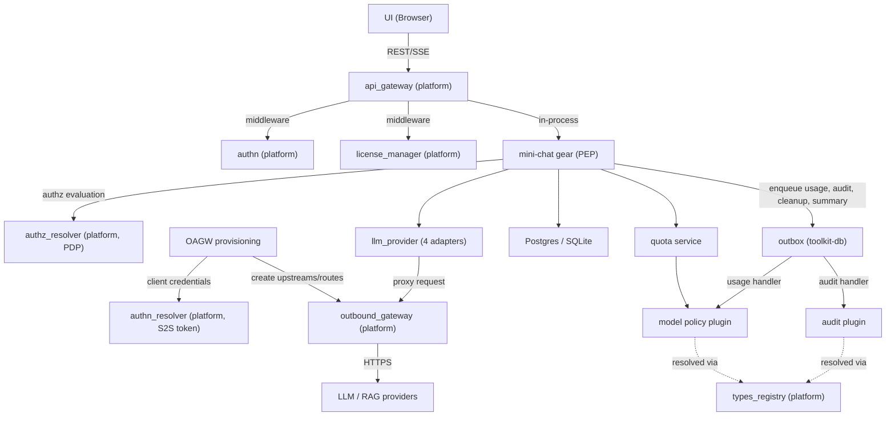
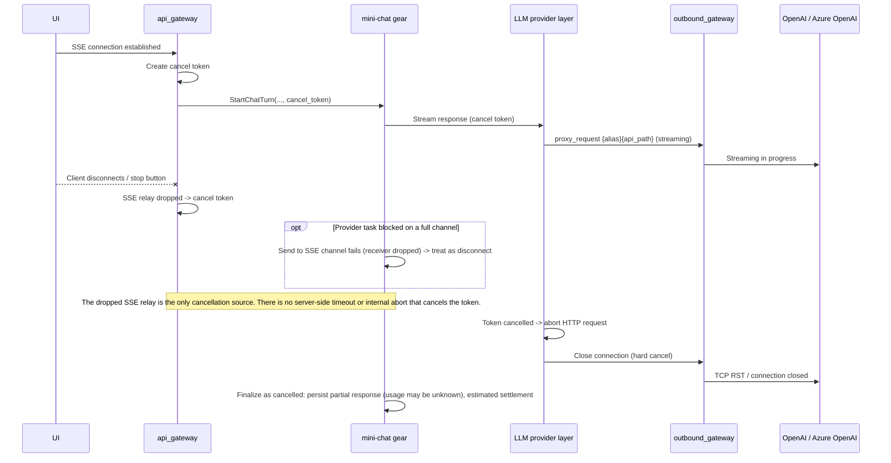
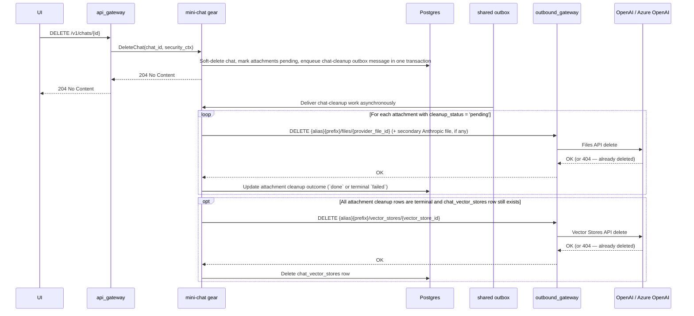
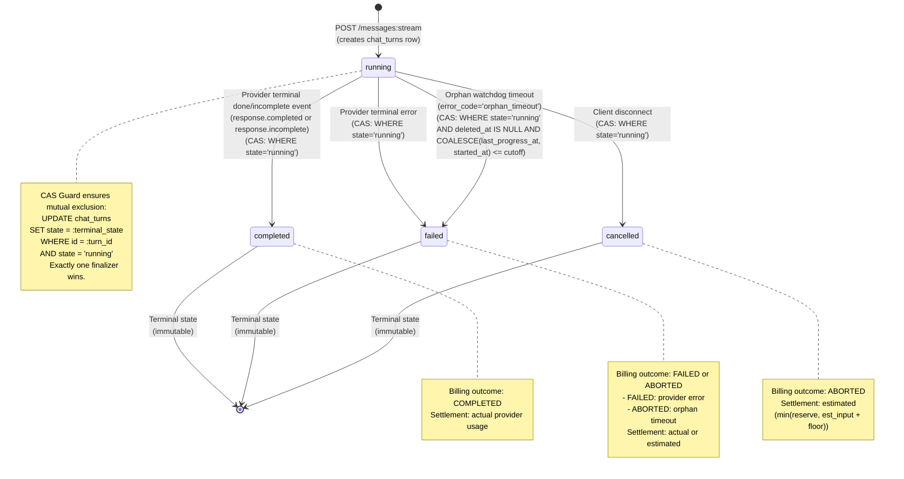
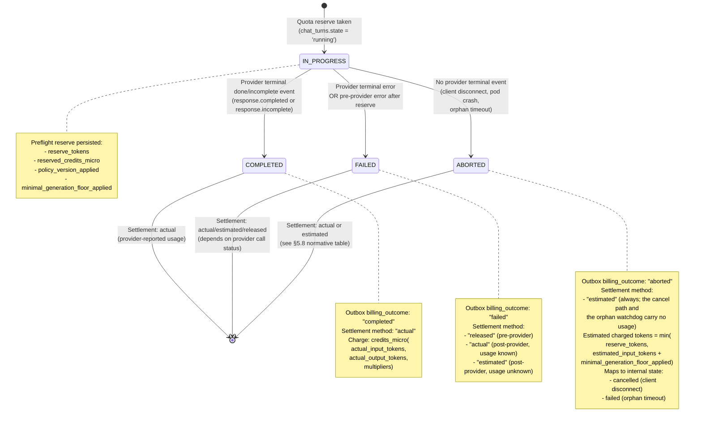

# Technical Design: Mini Chat

## 1. Architecture Overview

### 1.1 Architectural Vision

Mini Chat provides a multi-tenant AI chat experience with SSE streaming, conversation history, document-aware question answering, and web search. Users interact through a REST/SSE API. Models are served through in-process provider adapters (OpenAI / Azure OpenAI Responses API, Chat Completions API, vLLM Responses API, Anthropic Messages API; see [ADR-0005](./ADR/0005-cpt-cf-mini-chat-adr-multi-provider-adapters.md)); document retrieval uses the File Search tool of the OpenAI-compatible providers. The system maintains strict tenant isolation via per-chat vector stores and enforces cost control through token budgets, usage quotas, and file search limits. Authorization decisions are delegated to the platform's AuthZ Resolver (PDP), which returns query-level constraints compiled to `AccessScope` objects by the mini-chat gear acting as the Policy Enforcement Point (PEP).

Mini Chat is implemented as a ToolKit gear (`mini-chat`) following the DDD-light pattern. The gear's domain service layer orchestrates all request processing - context assembly, LLM invocation, streaming relay, and persistence. It owns the full request lifecycle from receiving a user message to persisting the assistant response and usage metrics. External LLM calls route exclusively through the platform's Outbound API Gateway (OAGW), which handles credential injection and egress control. Mini Chat calls the LLM provider directly via OAGW rather than through `cf-llm-gateway`, because it relies on provider-specific features (Responses API, Files API, File Search with vector stores) that the generic gateway does not abstract. The gear registers its own OAGW upstreams and routes for every configured provider entry at startup; OAGW injects the credentials configured for each upstream (API key header for OpenAI, `api-key` header or Entra ID bearer token for Azure OpenAI, and so on).

Mini Chat supports multimodal Responses API input (text + image) using the provider Files API for image storage. Images are uploaded as attachments, referenced by file ID in the Responses API content array, and are not indexed in vector stores.

Long conversations are managed via thread summaries - a Level 1 compression strategy where older messages are periodically summarized by the LLM, and the summary replaces them in the context window. This keeps token costs bounded while preserving key facts, decisions, and document references.

### 1.2 Architecture Drivers

#### Functional Drivers

| Requirement | Phase | Design Response |
|-------------|-------|-----------------|
| `cpt-cf-mini-chat-fr-chat-streaming` | `p1` | SSE streaming via the mini-chat gear's domain service -> OAGW -> Responses API (OpenAI: `POST /v1/responses`; Azure OpenAI: `POST /openai/v1/responses`) |
| `cpt-cf-mini-chat-fr-conversation-history` | `p1` | Postgres persists all messages; `GET /v1/chats/{id}/messages` with cursor pagination + OData query for history retrieval |
| `cpt-cf-mini-chat-fr-file-upload` | `p1` | Upload via OAGW -> Files API (OpenAI: `POST /v1/files`; Azure OpenAI: `POST /openai/files`); metadata persisted in the gear's database; file added to the chat's vector store. P1 uses `purpose="assistants"` for both providers and for both documents and images (OpenAI also supports `purpose="user_data"`, but we use `assistants` to keep parity and because the files are used with Vector Stores / File Search). |
| `cpt-cf-mini-chat-fr-image-upload` | `p1` | Image upload via OAGW -> Files API; metadata persisted in the gear's database; NOT added to vector store. Images referenced as multimodal input (file ID) in Responses API calls. Model capability checked before outbound call; 400 `VISION_NOT_SUPPORTED` if the model lacks `VISION_INPUT`. Rejected with 400 `FEATURE_DISABLED` while `disable_images` is on. Upload is synchronous ([ADR-0007](./ADR/0007-cpt-cf-mini-chat-adr-document-retrieval-scope.md)). |
| `cpt-cf-mini-chat-fr-file-search` | `p1` | File Search tool call scoped to the chat's dedicated vector store (identical `file_search` tool on both OpenAI and Azure OpenAI Responses API) |
| `cpt-cf-mini-chat-fr-web-search` | `p1` | Web Search tool included in Responses API request when explicitly enabled via `web_search.enabled` parameter; provider decides invocation; per-turn and per-day call limits enforced; global `disable_web_search` kill switch |
| `cpt-cf-mini-chat-fr-doc-summary` | `p1` | **Not implemented** — `attachments.doc_summary` and `summary_updated_at` are always `null`; no background task exists. See [ADR-0007](./ADR/0007-cpt-cf-mini-chat-adr-document-retrieval-scope.md). |
| `cpt-cf-mini-chat-fr-thread-summary` | `p1` | Periodic LLM-driven summarization of old messages; summary replaces history in context |
| `cpt-cf-mini-chat-fr-chat-crud` | `p1` | REST endpoints for create/list/get/update title/delete chats. Get returns metadata + message_count (no embedded messages). |
| `cpt-cf-mini-chat-fr-temporary-chat` | `p2` | Toggle temporary flag; scheduled cleanup after 24h |
| `cpt-cf-mini-chat-fr-chat-deletion-cleanup` | `p1` | See **Cleanup on Chat Deletion** |
| `cpt-cf-mini-chat-fr-streaming-cancellation` | `p1` | See **Streaming Cancellation** sequence and quota bounded best-effort debit rules of the quota service |
| `cpt-cf-mini-chat-fr-quota-enforcement` | `p1` | See the quota service component and the `quota_usage` table |
| `cpt-cf-mini-chat-fr-token-budget` | `p1` | See constraint **Context Window Budget** and ContextPlan truncation rules |
| `cpt-cf-mini-chat-fr-license-gate` | `p1` | See constraint **License Gate** and dependency `license_manager (platform)` |
| `cpt-cf-mini-chat-fr-audit` | `p1` | Audit events for turn finalization and turn mutations are enqueued to the outbox queue `mini-chat.audit` in the same transaction and delivered to the audit plugin resolved via types-registry (`MiniChatAuditPluginClientV1`). Event content is partial; see [ADR-0009](./ADR/0009-cpt-cf-mini-chat-adr-data-lifecycle-audit-scope.md) |
| `cpt-cf-mini-chat-fr-ux-recovery` | `p1` | See **Streaming Contract** (Idempotency + reconnect rule) and **Turn Status API** |
| `cpt-cf-mini-chat-fr-turn-mutations` | `p1` | Retry / edit / delete last turn via Turn Mutation API; see **Turn Mutation Rules (P1)** and turn mutation endpoints |
| `cpt-cf-mini-chat-fr-model-selection` | `p1` | User selects model per chat at creation; model locked for conversation lifetime; see constraint `cpt-cf-mini-chat-constraint-model-locked-per-chat` and Model Catalog Configuration |
| `cpt-cf-mini-chat-fr-models-api` | `p1` | Public read-only Models API (`GET /v1/models`, `GET /v1/models/{id}`). Returns only models visible to the authenticated user (globally enabled). Catalog sourced from `mini-chat-model-policy-plugin`. See Models API (section 3.3). |
| `cpt-cf-mini-chat-fr-message-reactions` | `p1` | Binary like/dislike on assistant messages; see `message_reactions` table |
| `cpt-cf-mini-chat-fr-mcp-tool-discovery` | `p1` | **Not implemented (Future)** — see [ADR-0006](./ADR/0006-cpt-cf-mini-chat-adr-mcp-deferred.md) and [features/mcp-servers-support.md](./features/mcp-servers-support.md). |
| `cpt-cf-mini-chat-fr-mcp-tool-execution` | `p1` | **Not implemented (Future)** — see [ADR-0006](./ADR/0006-cpt-cf-mini-chat-adr-mcp-deferred.md) and [features/mcp-servers-support.md](./features/mcp-servers-support.md). |
| `cpt-cf-mini-chat-fr-mcp-server-registry` | `p1` | **Not implemented (Future)** — see [ADR-0006](./ADR/0006-cpt-cf-mini-chat-adr-mcp-deferred.md) and [features/mcp-servers-support.md](./features/mcp-servers-support.md). |
| `cpt-cf-mini-chat-fr-mcp-hub-discovery` | `p2` | **Not implemented (Future)** — see [ADR-0006](./ADR/0006-cpt-cf-mini-chat-adr-mcp-deferred.md) and [features/mcp-servers-support.md](./features/mcp-servers-support.md). |
| `cpt-cf-mini-chat-fr-mcp-role-access` | `p1` | **Not implemented (Future)** — see [ADR-0006](./ADR/0006-cpt-cf-mini-chat-adr-mcp-deferred.md) and [features/mcp-servers-support.md](./features/mcp-servers-support.md). |
| `cpt-cf-mini-chat-fr-group-chats` | `p2+` | Deferred — see `cpt-cf-mini-chat-adr-group-chat-usage-attribution` |

#### NFR Allocation

| NFR ID | NFR Summary | Allocated To | Design Response | Verification Approach |
|--------|-------------|--------------|-----------------|----------------------|
| `cpt-cf-mini-chat-nfr-tenant-isolation` | Tenant data must never leak across tenants | mini-chat gear (domain + infra layers) | Per-chat vector store; all queries scoped via `AccessScope` (owner_col + tenant_col); no provider identifiers (`provider_file_id`, `vector_store_id`) exposed or accepted in API | Integration tests with multi-tenant scenarios |
| `cpt-cf-mini-chat-nfr-authz-alignment` | Authorization must follow platform PDP/PEP model | mini-chat gear (PEP via PolicyEnforcer) | AuthZ Resolver evaluates every data-access operation; constraints compiled to `AccessScope` objects applied via secure ORM; fail-closed on PDP errors | Integration tests with mock PDP; fail-closed verification tests |
| `cpt-cf-mini-chat-nfr-cost-control` | Predictable and bounded LLM costs | mini-chat gear (domain service + quota service) | Credit-based rate limits per tier across multiple periods (daily, monthly) tracked in real-time; credits are computed from provider-reported tokens using model credit multipliers; premium models have stricter limits, standard-tier models have separate, higher limits; two-tier downgrade cascade (premium → standard); file search and web search call limits; token budget per request | Usage metrics dashboard; budget alert tests |
| `cpt-cf-mini-chat-nfr-streaming-latency` | Low time-to-first-token for chat responses | mini-chat gear (domain service), OAGW | Direct SSE relay without buffering; cancellation propagation on disconnect | TTFT benchmarks under load; **Disconnect test**: open SSE -> receive 1-2 tokens -> disconnect -> assert provider request closed within 200 ms and active-generation counter decrements; **TTFT delta test**: measure `t_first_token_ui - t_first_byte_from_provider` -> assert platform overhead < 50 ms p99 |
| `cpt-cf-mini-chat-nfr-data-retention` | Deleted chats purged from provider; temporary chat cleanup (P2) | mini-chat gear (domain + infra layers) | Outbox cleanup handlers delete provider files and chat vector stores. Hard-purge of soft-deleted rows is not implemented ([ADR-0009](./ADR/0009-cpt-cf-mini-chat-adr-data-lifecycle-audit-scope.md)) | Retention policy compliance tests |
| `cpt-cf-mini-chat-nfr-observability-supportability` | Operational visibility for on-call, SRE, and cost governance | mini-chat gear (domain service + quota service) | `mini_chat_*` OpenTelemetry metrics (exported over OTLP) on all critical paths; stable `request_id` tracing per turn; structured audit events; turn state API (`GET /v1/chats/{id}/turns/{request_id}`) | Metric series presence tests; request_id propagation tests; alert rule validation |
| `cpt-cf-mini-chat-nfr-rag-scalability` | Bounded RAG costs and stable retrieval quality | mini-chat gear (domain service + persistence layer) | Per-chat document count, file size, and chunk limits; configurable retrieval-k and max retrieved tokens per turn; per-chat dedicated vector stores | Per-chat limit enforcement tests; retrieval latency p95 benchmarks; `mini_chat_retrieval_latency_ms` within threshold |

#### Key Decisions (ADRs)

| ADR | Decision | Rationale |
|-----|----------|-----------|
| `cpt-cf-mini-chat-adr-llm-provider-as-library` — [ADR-0001](./ADR/0001-cpt-cf-mini-chat-adr-llm-provider-as-library.md) | `llm_provider` as an in-process library, not a standalone service | Eliminates network hop in streaming path; simplifies deployment |
| `cpt-cf-mini-chat-adr-internal-transport` — [ADR-0002](./ADR/0002-cpt-cf-mini-chat-adr-internal-transport.md) | HTTP/SSE for internal transport between `llm_provider` and OAGW | SSE passthrough minimizes protocol translation overhead |
| `cpt-cf-mini-chat-adr-group-chat-usage-attribution` — [ADR-0003](./ADR/0003-cpt-cf-mini-chat-adr-group-chat-usage-attribution.md) | Group chat usage attribution model | Ensures quota enforcement is predictable for shared contexts (P2+) |
| `cpt-cf-mini-chat-adr-canonical-error-contract` — [ADR-0004](./ADR/0004-cpt-cf-mini-chat-adr-canonical-error-contract.md) | REST errors are canonical `Problem` objects; the SSE `error` event keeps `{code, message}` | One error shape across platform gears; status follows the category |
| `cpt-cf-mini-chat-adr-multi-provider-adapters` — [ADR-0005](./ADR/0005-cpt-cf-mini-chat-adr-multi-provider-adapters.md) | In-process adapter per provider kind; the gear provisions its own OAGW upstreams and routes | Multi-vendor catalog; OAGW routes cannot drift from gear config |
| `cpt-cf-mini-chat-adr-mcp-deferred` — [ADR-0006](./ADR/0006-cpt-cf-mini-chat-adr-mcp-deferred.md) | MCP server support is deferred out of P1 | Not implemented; design kept in [features/mcp-servers-support.md](./features/mcp-servers-support.md) |
| `cpt-cf-mini-chat-adr-document-retrieval-scope` — [ADR-0007](./ADR/0007-cpt-cf-mini-chat-adr-document-retrieval-scope.md) | P1 scope of document processing and retrieval | Synchronous upload; document summary, chunk cap and deletion-time retrieval exclusion not implemented |
| `cpt-cf-mini-chat-adr-quota-policy-scope` — [ADR-0008](./ADR/0008-cpt-cf-mini-chat-adr-quota-policy-scope.md) | P1 scope of quota, policy and licensing controls | Image quota, PolicySnapshot cache, knowledge-search iteration billing not implemented; interim license gate |
| `cpt-cf-mini-chat-adr-data-lifecycle-audit-scope` — [ADR-0009](./ADR/0009-cpt-cf-mini-chat-adr-data-lifecycle-audit-scope.md) | P1 scope of data retention, chat deletion and audit content | Hard-purge, full audit content and chat-deletion audit not implemented |
| `cpt-cf-mini-chat-adr-runtime-consistency-limitations` — [ADR-0010](./ADR/0010-cpt-cf-mini-chat-adr-runtime-consistency-limitations.md) | Accepted runtime and consistency limitations in P1 | Watchdog clock, DB CHECK constraints, replay payload, SSE ping, deprecated config fields |

### 1.3 Architecture Layers

```text
┌───────────────────────────────────────────────────────┐
│  Presentation (api_gateway - platform)                │
│  REST + SSE endpoints, AuthN middleware               │
├───────────────────────────────────────────────────────┤
│  mini-chat gear (ToolKit gear)                        │
│  ┌─────────────────────────────────────────────────┐  │
│  │ API Layer                                       │  │
│  │ Handlers, routes, DTOs, error→Problem mapping   │  │
│  ├─────────────────────────────────────────────────┤  │
│  │ Domain Layer                                    │  │
│  │ Service (orchestration, PEP, context planning,  │  │
│  │   streaming), repository ports                  │  │
│  │ ┌───────────────┐  ┌──────────────────────────┐ │  │
│  │ │ quota service │  │ authz (PolicyEnforcer)   │ │  │
│  │ └───────────────┘  └──────────────────────────┘ │  │
│  ├─────────────────────────────────────────────────┤  │
│  │ Infrastructure Layer                            │  │
│  │ ┌──────────────────┐  ┌──────────────────────┐  │  │
│  │ │ persistence      │  │ llm_provider         │  │  │
│  │ │ scoped entities, │  │ 4 adapter kinds,     │  │  │
│  │ │ repositories,    │  │ file/vector store    │  │  │
│  │ │ migrations       │  │ dispatch, knowledge  │  │  │
│  │ │                  │  │ retriever            │  │  │
│  │ └──────────────────┘  └──────────────────────┘  │  │
│  │ ┌──────────────────┐  ┌──────────────────────┐  │  │
│  │ │ OAGW provisioning│  │ outbox, audit gateway│  │  │
│  │ │ (upstreams/routes│  │ model policy gateway,│  │  │
│  │ │  at gear start)  │  │ bundled plugins      │  │  │
│  │ │                  │  │ (static policy/audit)│  │  │
│  │ └──────────────────┘  └──────────────────────┘  │  │
│  │ ┌──────────────────┐  ┌──────────────────────┐  │  │
│  │ │ background       │  │ leader election (K8s │  │  │
│  │ │ workers (outbox  │  │ Lease or no-op),     │  │  │
│  │ │ handlers, orphan │  │ metrics              │  │  │
│  │ │ watchdog, upload │  │                      │  │  │
│  │ │ reaper)          │  │                      │  │  │
│  │ └──────────────────┘  └──────────────────────┘  │  │
│  └─────────────────────────────────────────────────┘  │
└───────────────────────────────────────────────────────┘
```

**Naming note**: "the domain service" in this document refers to the gear's domain service layer (business logic and PEP orchestration). "the persistence layer" refers to the gear's database layer: SeaORM entities scoped by Secure ORM, and the repository implementations over them.

**Terminology (normative)**:

- **Message** — a persisted chat record in the `messages` table with a `role` (`user`, `assistant`, or `system`). A message is a content artifact; it carries no lifecycle, billing, or finalization semantics of its own.
- **Execution turn** (aka "chat turn") — a lifecycle unit tracked in the `chat_turns` table that represents a single user-initiated provider invocation. An execution turn owns the full request lifecycle: quota reserve, provider call, SSE streaming, finalization (CAS guard), quota settlement, and outbox emission. Exactly one execution turn maps to one `(chat_id, request_id)` pair.
- **Turn** — unless otherwise qualified, "turn" in this document means "execution turn" (the `chat_turns` lifecycle unit), not a message pair.
- **Background/system task** — an internal server-initiated operation (thread summary update; document summary generation is not implemented, see [ADR-0007](./ADR/0007-cpt-cf-mini-chat-adr-document-retrieval-scope.md)) that invokes the LLM provider but MUST NOT create a `chat_turns` record. System tasks are not execution turns and do not participate in `chat_turns` idempotency, finalization CAS, or per-user quota settlement (see System Task Isolation Invariant in section 3.2).

| Layer | Responsibility | Technology |
|-------|---------------|------------|
| Presentation | Public REST/SSE API, authentication, routing | Axum (platform api_gateway) |
| API | REST handlers, SSE adapters, routes, DTOs, error→Problem mapping (RFC 9457) | Axum handlers, utoipa |
| Domain | Business rules, orchestration, PEP (PolicyEnforcer), context assembly, streaming relay, quota checks; repository ports | Rust, AuthZ Resolver SDK |
| Infrastructure | Persistence (Secure ORM scoped entities, repositories, migrations); LLM communication (`llm_provider`: provider resolution and the four adapter kinds `openai_responses`, `openai_chat_completions`, `vllm_responses`, `anthropic_messages`, plus file storage and vector store dispatch by storage kind, the Anthropic Files client and the Azure knowledge retriever); OAGW upstream and route provisioning; outbox enqueuer and handlers; audit gateway; model policy gateway; leader election; OpenTelemetry metrics exported over OTLP | SeaORM (Postgres or SQLite), OAGW in-process proxy client, ToolKit outbox |

**MCP**: there is no MCP layer. MCP server support is not implemented; see [ADR-0006](./ADR/0006-cpt-cf-mini-chat-adr-mcp-deferred.md).

## 2. Principles & Constraints

### 2.1 Design Principles

#### Tenant-Scoped Everything

- [ ] `p1` - **ID**: `cpt-cf-mini-chat-principle-tenant-scoped`

Every data access is scoped by constraints issued by the AuthZ Resolver (PDP). At P1, chat content is owner-only: the PDP returns `eq` predicates on `owner_tenant_id` and `user_id` that the domain service (PEP, via PolicyEnforcer) compiles to `AccessScope` and applies as SQL WHERE clauses through Secure ORM (`#[derive(Scopable)]`). This replaces application-level tenant/user scoping with a formalized constraint model aligned with the platform's [Authorization Design](../../../docs/arch/authorization/DESIGN.md). Vector stores, file uploads, and quota checks all require tenant context. No API accepts or returns provider identifiers (`provider_file_id`, `vector_store_id`). Client-visible identifiers are internal UUIDs only (`attachment_id`, `chat_id`, etc.).

#### Owner-Only Chat Content

- [ ] `p1` - **ID**: `cpt-cf-mini-chat-principle-owner-only-content`

Chat content (messages, attachments, summaries, citations) is accessible only to the owning user within their tenant. Parent tenants / MSP administrators MUST NOT have access to chat content. Admin visibility is limited to aggregated usage and operational metrics.

#### Summary Over History

- [ ] `p1` - **ID**: `cpt-cf-mini-chat-principle-summary-over-history`

The system favors compressed summaries over unbounded message history. Old messages are summarized rather than paginated into the LLM context. This bounds token costs and keeps response quality stable for long conversations.

#### Streaming-First

- [ ] `p1` - **ID**: `cpt-cf-mini-chat-principle-streaming-first`

All LLM responses are streamed. The primary delivery path is SSE from LLM provider (OpenAI / Azure OpenAI) → OAGW → mini-chat gear → api_gateway → UI. Non-streaming responses are not supported for chat completion. Both providers use an identical SSE event format for the Responses API.

#### Linear Conversation Model

- [ ] `p1` - **ID**: `cpt-cf-mini-chat-principle-linear-conversation`

Conversations are strictly linear sequences of turns. P1 does not support branching, history forks, or rewriting arbitrary historical messages. Only the most recent turn may be mutated (retry, edit, or delete). This constraint keeps the data model simple, avoids version-graph complexity, and ensures deterministic context assembly for the LLM.

### 2.2 Constraints

#### OpenAI-Compatible Provider (P1)

- [ ] `p1` - **ID**: `cpt-cf-mini-chat-constraint-openai-compatible`

The original P1 constraint (OpenAI or Azure OpenAI only) is relaxed by [ADR-0005](./ADR/0005-cpt-cf-mini-chat-adr-multi-provider-adapters.md). Providers are configured as `providers.<id>` entries; each entry selects one of four in-process adapters (`openai_responses`, `openai_chat_completions`, `vllm_responses`, `anthropic_messages`), and each catalog model names its `provider_id`. The gear registers the OAGW upstream and route for every entry at startup. File and vector-store operations go to a storage-capable provider (`storage_kind` = `openai` or `azure`); an entry without its own file API (Anthropic) names one via `rag_provider`. Anthropic-specific behaviour: [features/anthropic-provider-support.md](./features/anthropic-provider-support.md).

**Provider parity notes** (Azure OpenAI known limitations at time of writing):
- Azure supports only **one vector store** per `file_search` tool call (sufficient for P1: one vector store per chat).
- `purpose="user_data"` for file uploads is not supported on Azure; use `purpose="assistants"`.
- `vector_stores.search` (client-side manual search) is not exposed on Azure - not used in this design.
- New OpenAI features may appear on Azure with a lag of weeks to months.

**Files API upload field mapping (P1)**: Mini Chat uploads documents and images via the provider Files API through OAGW. Mini-Chat sets `purpose="assistants"` on every OpenAI / Azure OpenAI Files API upload (documents and images). Whether `assistants` is accepted for images sent as `input_image.file_id` is not verified against the providers ([#5022](https://github.com/constructorfabric/gears-rust/issues/5022)). The secondary copy uploaded to the Anthropic Files API carries only the `file` part and no `purpose`. There is no per-provider upload field mapping, and OAGW does not change the multipart body.

**Multimodal input (P1)**: image-aware chat uses the Responses API with multimodal input content arrays, not a separate Vision API. Image bytes are stored via the provider Files API and referenced by file ID in the Responses API request. P1 does not use URL-based image inputs because internal S3 storage is not externally reachable by the provider.

**File storage (P1)**: All user files (documents and images) are stored in the RAG provider's storage (OpenAI / Azure OpenAI via Files API). For Anthropic chats, uploaded images also get a secondary copy in the Anthropic Files API (`attachments.secondary_*` columns); documents, and images larger than `thumbnail.max_decode_bytes` (bytes not buffered), get no secondary copy. Mini Chat does not operate first-party object storage (no S3 or equivalent). "No persistent file storage" in this context means Mini Chat does not run its own object store — files persist in provider storage until explicitly deleted via the cleanup flow.

#### Model Capability Constraint (Images)

- [ ] `p1` - **ID**: `cpt-cf-mini-chat-constraint-model-image-capability`

Image capability validation is performed during preflight in a strict two-step order:

1. **Resolve effective_model** via the quota downgrade cascade (premium → standard), applying kill switches (`disable_premium_tier`, `force_standard_tier`).
2. **Validate capabilities** of the resolved effective_model against the request content.

```text
effective_model = resolve_effective_model(selected_model, quotas, kill_switches)
if request.has_images && "VISION_INPUT" not in catalog[effective_model].multimodal_capabilities:
    return HTTP 400 invalid_argument (VISION_NOT_SUPPORTED)   # no outbound call
proceed with provider call
```

If the effective_model does not support image input, the domain service MUST reject with HTTP 400 `invalid_argument`, `field_violations[content_type].reason = VISION_NOT_SUPPORTED` ([ADR-0004](./ADR/0004-cpt-cf-mini-chat-adr-canonical-error-contract.md); formerly 415 `unsupported_media`) before any provider call. This applies even when the selected_model supports images but the effective_model does not (e.g. user selected a premium model with `VISION_INPUT` capability, but quota exhaustion downgraded to a standard model without it).

The system MUST NOT silently drop image attachments, strip images from the request, or auto-upgrade to a different model to satisfy the request. Image capability is determined by the presence of `VISION_INPUT` in the model's `multimodal_capabilities` array (see Model Catalog Configuration).

#### Downgrade Decision Matrix

| selected_model has VISION_INPUT | effective_model has VISION_INPUT | Request has images | Result |
|------------------------------|-------------------------------|--------------------|--------|
| yes | yes | yes | Proceed |
| yes | yes | no  | Proceed |
| yes | no  | yes | Reject 400 `VISION_NOT_SUPPORTED` |
| yes | no  | no  | Proceed (no images, no conflict) |
| no  | no  | yes | Reject 400 `VISION_NOT_SUPPORTED` |
| no  | no  | no  | Proceed |

The matrix is evaluated after effective model resolution and before any provider call.

**Enforcement**: the quota service's preflight decision carries the vision capability of the effective model's catalog entry, and the stream service rejects on it after the cascade (for `messages:stream` and for retry/edit, which re-send the original message's images). Checking the selected model is not sufficient. The gear does not validate that every enabled model has `VISION_INPUT`, so the rejection is reachable with any catalog that contains a model without it.

#### No Credential Storage

- [ ] `p1` - **ID**: `cpt-cf-mini-chat-constraint-no-credentials`

Mini Chat never stores or handles API keys. All external calls go through OAGW, which injects credentials from CredStore.

#### Context Window Budget

- [ ] `p1` - **ID**: `cpt-cf-mini-chat-constraint-context-budget`

Every request must fit within the **effective_model's** context window. The input token budget is:

```text
token_budget = min(max_input_tokens, context_window − max_output_tokens_applied)
               − tool / web_search / code_interpreter surcharges
               − fixed_overhead_tokens
```

Where:
- `max_input_tokens` — from the catalog entry of the effective model; `0` means no separate input limit
- `context_window` — from the catalog entry of the effective model
- `max_output_tokens_applied` — `min(catalog max_output_tokens, streaming.max_output_tokens)`, persisted on `chat_turns`
- surcharges and `fixed_overhead_tokens` — from the effective model's `estimation_budgets`; each surcharge applies only when its tool is in the request

When context exceeds the budget, the system drops recent messages, oldest whole turns first; the thread summary is dropped only if it alone does not fit after the mandatory items. Retrieval excerpts are not part of the assembled context (provider-side `file_search`). There is no document-summary tier ([ADR-0007](./ADR/0007-cpt-cf-mini-chat-adr-document-retrieval-scope.md)). System prompt and current user message are never truncated (see "Context Plan Truncation Algorithm").

The budget MUST be computed after effective model resolution (i.e., after quota downgrade), because a downgraded model may have a smaller context window than the selected_model.

#### License Gate

- [ ] `p1` - **ID**: `cpt-cf-mini-chat-constraint-license-gate`

Access requires a license feature on the tenant license, enforced by the platform's `license_manager` middleware on every route. Requests from unlicensed tenants receive HTTP 403.

**Interim implementation**: the routes require the platform base license feature (`gts.cf.core.lic.feat.v1~cf.core.global.base.v1`) until the license plugin exposes `ai_chat`. See [ADR-0008](./ADR/0008-cpt-cf-mini-chat-adr-quota-policy-scope.md).

#### No Buffering

- [ ] `p1` - **ID**: `cpt-cf-mini-chat-constraint-no-buffering`

No layer in the streaming pipeline may collect the full LLM response before relaying it. Every component — `llm_provider`, the domain service, `api_gateway` — must read one SSE event and immediately forward it to the next layer. Middleware must not buffer response bodies. Collecting the token stream into a full response is prohibited in the hot path.

#### Bounded Channels

- [ ] `p1` - **ID**: `cpt-cf-mini-chat-constraint-bounded-channels`

Internal mpsc channels between `llm_provider` → domain service → SSE writer must use bounded buffers (16–64 messages). This provides backpressure: if the consumer is slow, the producer blocks rather than accumulating unbounded memory. Channel capacity is configurable per deployment (`streaming.sse_channel_capacity`, default 32, range 16–64).

#### Model Locked Per Chat

- [ ] `p1` - **ID**: `cpt-cf-mini-chat-constraint-model-locked-per-chat`

Once a chat is created with a model (user-selected, or the default model: the first enabled catalog entry with `preference.is_default = true`, else the first enabled entry; tier is not considered), that model becomes the **selected_model** (`chats.model`) and is locked for the lifetime of the conversation. The user MUST NOT be able to change the selected_model within an existing chat.

The **effective_model** is the model actually used for a specific turn. Invariants:

- `selected_model` never changes during chat lifetime.
- `effective_model` may differ from `selected_model` due to automatic downgrade (quota exhaustion), kill switches (`disable_premium_tier`, `force_standard_tier`), or per-model catalog disablement (`enabled=false` on the specific model).
- `effective_model` MUST be recorded in:
  - `messages.model` column (per assistant message)
  - SSE `event: done` payload (`effective_model` field; `usage` carries token counts only)
  - audit event payload (`selected_model` + `effective_model`). On the orphan watchdog path the turn audit event and usage event set `selected_model` to the persisted `effective_model` (the selected model is not stored on `chat_turns`), and the audit `policy_decisions.quota.decision` is `"unknown"`.

**Exception**: quota-driven automatic downgrade within the two-tier cascade IS permitted mid-conversation. This is a system-level decision enforced by the quota service, not a user-initiated model switch. The effective_model is recorded on the assistant message (`messages.model`), not on the chat itself.

If a user wants a different model, they create a new chat.

#### Quota Before Outbound

- [ ] `p1` - **ID**: `cpt-cf-mini-chat-constraint-quota-before-outbound`

All product-level quota decisions (block, downgrade, limit) MUST be made in the domain service before any request reaches OAGW. OAGW never makes user-level or tenant-level quota decisions — it is transport + credential broker only. Only the domain service has the business context needed for quota decisions: tenant, user, license tier, model tier, two-tier downgrade cascade, file_search call limits. OAGW sees an opaque HTTP request with no business semantics.

Model selection and lifecycle rules (P1) are defined in the model catalog (deployment configuration) and applied at the gear boundary:

- The model catalog, downgrade cascade, and per-tier thresholds MUST be defined in deployment configuration (P1) and are expected to be owned by a platform Settings Service / License Manager layer as the long-term system of record.
- The domain service / quota service is the enforcement point: it MUST deterministically choose the effective model before the outbound call using the two-tier downgrade cascade (premium → standard). All tiers have token-based rate limits across daily and monthly periods; premium models have stricter limits, standard-tier models have separate, higher limits. When any tier's period quota is exhausted, the system downgrades to the next available tier. When all tiers are exhausted, the system MUST reject with HTTP 429 `resource_exhausted` (quota scope in `context.violations[].subject`). The chosen model MUST be surfaced via metrics (`{model}` and `{tier}` labels) and audit.

Global emergency flags / kill switches (P1): operators MUST have a way to immediately reduce cost and risk at runtime via configuration-owned flags.

- `disable_premium_tier` — if enabled, premium-tier models MUST NOT be used; requests that would have used premium MUST begin the downgrade cascade from the standard tier.
- `force_standard_tier` — if enabled, all requests MUST use the standard-tier model regardless of quota state or user selection.
- `disable_file_search` — if enabled, `file_search` tool calls MUST be skipped; responses proceed without retrieval.
- `disable_web_search` — if enabled, requests with `web_search.enabled=true` MUST be rejected with HTTP 400 `failed_precondition` (`violations[{subject: web_search, type: FEATURE_DISABLED}]`) before opening an SSE stream. The system MUST NOT silently ignore the parameter.
- `disable_code_interpreter` — if enabled, two-phase enforcement applies: (1) **Upload phase**: attachments where `code_interpreter` would be the sole purpose (e.g. XLSX) are rejected with HTTP 400 `invalid_argument` (a failed kill-switch lookup counts as disabled); attachments with additional purposes (e.g. file_search) have `for_code_interpreter` filtered out and proceed. (2) **Stream phase**: the `code_interpreter` tool is silently omitted from the Responses API request — the turn proceeds without code_interpreter capability. Unlike `disable_web_search`, the stream is NOT rejected with HTTP 400; the tool is simply excluded.
- `disable_images` — if enabled, image uploads (`POST /attachments` with an image) and requests with image inputs (new message, retry, edit) are rejected with HTTP 400 `failed_precondition` (`violations[{subject: images, type: FEATURE_DISABLED}]`); the stream path rejects before opening an SSE stream.

Ownership: these flags are owned and operated by platform configuration (P1: deployment config). Long-term, they are expected to be owned by Settings Service / License Manager with privileged operator access.

Hard caps: token budgets (`max_input_tokens`, `max_output_tokens`) MUST remain configurable and can serve as an emergency hard cap lever.

## 3. Technical Architecture

### 3.1 Domain Model

**Technology**: Rust structs

**Core Entities**:

| Entity | Description                                                                                                                                                                                                                                                                                                                                                                                                                                                                                                                                                                         |
|--------|-------------------------------------------------------------------------------------------------------------------------------------------------------------------------------------------------------------------------------------------------------------------------------------------------------------------------------------------------------------------------------------------------------------------------------------------------------------------------------------------------------------------------------------------------------------------------------------|
| Chat | A conversation belonging to a user within a tenant. Has title, **selected_model** (locked at creation from catalog; immutable), `message_count`, creation/update timestamps. Detail response returns metadata + message_count only; messages are loaded separately via `GET /v1/chats/{id}/messages`. Temporary flag reserved for P2.                                                                                                                                                                                                                                               |
| Message | A single turn in a chat (role: user/assistant/system). Stores content and compression status (the `token_estimate` column is reserved and always 0). Always includes a required `attachments` field — an always-present array of `AttachmentSummary` objects (empty array when none), derived from the `message_attachments` join table (not stored on the `messages` row). Each `AttachmentSummary` contains `attachment_id`, `kind`, `filename`, `status`, and `img_thumbnail` (for images). Always includes a required `request_id` (UUID) — within a normal turn, user and assistant messages share the same value (turn correlation key); system/background messages use an independently server-generated UUID v4. Assistant messages record the **effective_model** (the model actually used after quota/policy evaluation). Includes a nullable `my_reaction` field (`"like"`, `"dislike"`, or `null`) representing the requesting user's reaction on the message. |
| Attachment | File uploaded to a chat (document or image). Identified by internal `attachment_id` (UUID). Stores `provider_file_id` internally (never exposed via API). Documents are linked to the chat's vector store; images are not. Has processing status and `attachment_kind (document|image)`. For image attachments, an optional `img_thumbnail` (server-generated preview, `image/webp`, fit inside configured WxH preserving aspect ratio; max decoded size 128 KiB by default, configurable via `thumbnail.max_bytes`) is produced on upload and stored in Mini Chat database only (never uploaded to provider); null for documents and when thumbnail generation is unavailable or failed. `doc_summary` is always null (document summaries are not implemented, [ADR-0007](./ADR/0007-cpt-cf-mini-chat-adr-document-retrieval-scope.md)). |
| ThreadSummary | Compressed representation of older messages in a chat. Replaces old history in the context window.                                                                                                                                                                                                                                                                                                                                                                                                                                                                                  |
| ChatVectorStore | Mapping from `(tenant_id, chat_id)` to provider `vector_store_id` (OpenAI or Azure OpenAI Vector Stores API). One vector store per chat (created on first document upload). Physical and logical isolation are both per chat (see File Search Retrieval Scope).                                                                                                                                                                                                                                                                                                                 |
| AuditEvent | Structured event enqueued to the outbox queue `mini-chat.audit` and delivered to the audit plugin (`MiniChatAuditPluginClientV1`): identities, model, token usage, latency, tool-call counts, quota decision. Prompt, response and attachment fields are empty in P1 ([ADR-0009](./ADR/0009-cpt-cf-mini-chat-adr-data-lifecycle-audit-scope.md)). Not stored locally beyond the outbox row.                                                                                                                                                                                                                                                                                                                                                                                                                                       |
| QuotaUsage | Per-user usage counters for rate limiting and budget enforcement. Tracks daily and monthly periods per tier in credits. Credits are computed from provider-reported token usage using the model credit multipliers in the policy snapshot. Premium models have stricter limits; standard-tier models have separate, higher limits.                                                                                                                                                                                                                                                  |
| MessageReaction | A binary like or dislike reaction on an assistant message. One reaction per user per message. Stored for analytics and feedback collection.                                                                                                                                                                                                                                                                                                                                                                                                                                         |
| ContextPlan | Transient object assembled per request: system prompt, summary, recent messages, user message, retrieval excerpts (no document-summary tier, [ADR-0007](./ADR/0007-cpt-cf-mini-chat-adr-document-retrieval-scope.md)). Retrieval always operates over the entire chat vector store (see File Search Retrieval Scope). |

**Relationships**:
- Chat -> Message: 1..\*
- Chat -> Attachment: 0..\*
- Chat -> ThreadSummary: 0..1
- Message -> Attachment: 0..\* (M:N via `message_attachments` join table; user messages reference attachments from `attachment_ids`)
- Attachment -> ChatVectorStore: belongs to (via chat_id; documents only — images are not indexed)
- Message -> AuditEvent: 1..1 (each finalized turn emits an audit event through the audit outbox queue)
- Message -> MessageReaction: 0..1 (per user)

### 3.2 Component Model



**Components**:

- [ ] `p1` - **ID**: `cpt-cf-mini-chat-component-chat-service`

- **mini-chat gear** — A ToolKit gear named `mini-chat`. It depends on types-registry, authn_resolver, authz_resolver and OAGW, and uses the database, REST and stateful (background task) capabilities. The domain service layer is the core orchestrator and Policy Enforcement Point (PEP): receives user messages, evaluates authorization via AuthZ Resolver (PolicyEnforcer → AccessScope), builds context plan, invokes LLM via `llm_provider`, relays streaming tokens, persists messages and usage through the persistence layer, and evaluates the thread summary trigger during request processing using the assembled context/token estimate. When the trigger fires, thread-summary outbox work is transactionally enqueued in the transaction that durably persists or finalizes the causing turn; chat-deletion cleanup outbox work is transactionally enqueued in the transaction that durably applies chat soft-delete.

- [ ] `p1` - **ID**: `cpt-cf-mini-chat-component-chat-store`

- **Persistence layer** — SeaORM persistence layer with Secure ORM scoped entities, repositories, and migrations. All queries are scoped via `AccessScope` (compiled from PolicyEnforcer decisions). Supports Postgres and SQLite. Source of truth for chats, messages, attachments, thread summaries, chat vector store mappings, cleanup outcome state, and quota usage. The shared outbox table is infrastructure-owned and is used as the durable execution substrate for Mini-Chat asynchronous work.

- [ ] `p1` - **ID**: `cpt-cf-mini-chat-component-llm-provider`

- **llm_provider** — Library inside the gear (not a standalone service; [ADR-0001](./ADR/0001-cpt-cf-mini-chat-adr-llm-provider-as-library.md)). The provider resolver maps a catalog model's `provider_id` (and the tenant, via `tenant_overrides`) to a `providers.<id>` entry and its OAGW upstream alias. The adapter is selected by the entry's provider kind ([ADR-0005](./ADR/0005-cpt-cf-mini-chat-adr-multi-provider-adapters.md)):
  - `openai_responses` — OpenAI and Azure OpenAI Responses API;
  - `openai_chat_completions` — Chat Completions API;
  - `vllm_responses` — vLLM Responses API;
  - `anthropic_messages` — Anthropic Messages API.

  Tool support differs by adapter. The Chat Completions adapter drops `file_search`, `web_search` and `code_interpreter` and keeps function tools (`search_knowledge`). The vLLM Responses adapter drops all tools, including function tools. The Anthropic adapter drops `file_search` and maps `web_search` and `code_interpreter` to its server tools. The domain service does not know the adapter kind: the tool list, the tool guards in the system prompt, the reserve surcharges and the daily web search and code interpreter quota checks are decided before the adapter runs, from the request, the chat's attachments, the kill switches and the catalog `tool_support`. The `web_search` and `file_search` tools are gated by the effective model's catalog `tool_support.web_search` / `tool_support.file_search`; `code_interpreter` by `tool_support.code_interpreter`. The reserve estimate of each cascade candidate counts the file_search, web_search and code_interpreter surcharges only when that model's `tool_support` allows the tool and, for file_search and code_interpreter, the kill switch is off. `search_knowledge` has no reserve surcharge. The gate is `tool_support`, not the adapter: on an adapter that drops a tool its `tool_support` still allows, the surcharge is still reserved, the guard is still sent and the daily quota is still checked. Operators should set `tool_support` in the catalog to match the adapter.

  Each adapter builds the request, parses the provider SSE stream into internal events and maps errors. Requests go through the in-process OAGW proxy client (`ServiceGatewayClientV1`) to `{alias}{api_path}`. Tenant/user identity and metadata are attached to every chat and thread-summary request; each adapter sends what its protocol supports (see section 4: Provider Request Metadata). The library handles streaming chat and the non-streaming thread-summary call. File and vector-store operations are dispatched to the OpenAI or Azure implementation by the provider's `storage_kind` (or the `rag_provider` entry). When at least one entry uses `anthropic_messages`, an Anthropic Files client is created. For a chat whose model is served by an `anthropic_messages` provider, it uploads a secondary copy of each uploaded image to the Anthropic Files API and deletes it on cleanup. Documents and images larger than `thumbnail.max_decode_bytes` get no copy.

- **OAGW provisioning** — At gear start the gear obtains an S2S security context from `authn_resolver` using `client_credentials` and registers an OAGW upstream and route for every provider entry and tenant override. During gear initialization `upstream_alias` is filled with the host when it is not configured (for a tenant override, with the override's host), so an alias is always passed to OAGW; the upstream is created, or reused when OAGW reports it already exists, under that alias. The provider resolver is built during initialization from these entries and routes by that alias. Registration at start runs on a copy of the entries, so the alias OAGW returns does not reach the resolver. A deterministically misconfigured entry fails startup; an entry whose credstore secret is not yet readable is retried by a background reconcile task: the first retry runs 2 s after start, the interval then doubles up to 60 s and stays at 60 s; after 2 minutes without success one warning names the providers still pending. Retries continue until the gear stops.

- **Knowledge retriever** — Port for knowledge search with an Azure OpenAI implementation. Wired only when `knowledge_search.enabled = true`. See section 4 "Knowledge Search".

- **Audit plugin and audit outbox** — Audit events are enqueued in the finalization or mutation transaction to the outbox queue `outbox.audit_queue_name` (default `mini-chat.audit`). The audit outbox handler deserializes the payload first: a corrupt payload is rejected (dead-lettered) whether or not a plugin is available. It then delivers the event through the audit gateway to the audit plugin resolved via types-registry (`MiniChatAuditPluginClientV1`); the bundled `static_audit` plugin logs them. When no plugin is registered, events are acknowledged and dropped, and counted in `mini_chat_audit_emit_total{result="dropped"}`. The "no plugin registered" result is not cached: every delivery looks the plugin up again, so a plugin registered later is used, and the warning is logged once per period without a plugin. A found instance id is cached. If the instance resolves in types-registry but its client is not in ClientHub, the delivery returns `Retry` (not acknowledged) and the cached instance id is reset. A `Retry` (this case, a resolution error, or a transient plugin error) is bounded: on the 120th attempt (about an hour with the outbox backoff capped at 30 s) the event is dead-lettered and counted as `result="reject"`, so a misconfigured plugin does not block the partition. See [ADR-0009](./ADR/0009-cpt-cf-mini-chat-adr-data-lifecycle-audit-scope.md).

- **Model policy gateway** — Resolves the `mini-chat-model-policy-plugin` instance via types-registry; provides the policy snapshot (model catalog, kill switches) and user limits, and receives usage events from the usage outbox handler. The bundled plugin is `static_model_policy`.

- [ ] `p1` - **ID**: `cpt-cf-mini-chat-component-quota-service`

- **quota service** — Enforces per-user credit-based rate limits per tier across multiple periods (daily, monthly), tracked in real-time via bucket rows in `quota_usage` (section 3.7). Credits are computed from provider-reported token usage using the model credit multipliers in the policy snapshot. Premium models have stricter limits (bucket `tier:premium`); standard-tier limits serve as the overall cap (bucket `total`). Tracks web search and code interpreter call counts on bucket rows. The `file_search_calls`, `image_inputs` and `image_upload_bytes` columns exist but are not populated ([ADR-0007](./ADR/0007-cpt-cf-mini-chat-adr-document-retrieval-scope.md), [ADR-0008](./ADR/0008-cpt-cf-mini-chat-adr-quota-policy-scope.md)). Uses **two-phase quota counting**:

  **Tier availability rule**: a tier is considered **available** only if it has remaining quota in **ALL** configured periods for that tier. If **ANY** period is exhausted, the tier is treated as exhausted and the downgrade cascade continues to the next tier. When all tiers are exhausted, the system rejects with HTTP 429 `resource_exhausted`.

  - **Phase 1 - Preflight (reserve) estimate** (on request start, before any streaming begins and before outbound call): estimate token usage from current message size + `prior_context_tokens` (`input_tokens + output_tokens` of the most recent non-deleted assistant message in the chat whose `input_tokens` or `output_tokens` is non-zero, as a proxy for the conversation history that will be re-sent) + surcharges + `max_output_tokens` (persisted as `max_output_tokens_applied`), convert to reserved credits using model multipliers (section 5.4.1), and reserve credits for quota enforcement. Decision: allow at requested tier / downgrade to next tier / reject if all tiers exhausted.
    - Reserve MUST prevent parallel requests from overspending remaining tier quota.
    - Reserve MUST be keyed by `(tenant_id, user_id, period_type, period_start, bucket)` and reconciled on terminal outcome. Reserves MUST be checked across all configured period types (`daily`, `monthly`) and all required buckets for the current tier; if any period or bucket is exhausted, the tier is considered exhausted and the cascade proceeds to the next tier.
  - **Phase 2 - Commit actual** (on `event: done`): reconcile the reserve to actual provider usage (`response.usage.input_tokens` + `response.usage.output_tokens`), compute actual credits via model multipliers, and commit actual credits to `quota_usage`. If actual exceeds estimate (overshoot), the completed response is never retroactively cancelled, but guardrails apply:
    - Commit MUST be atomic per `(tenant_id, user_id, period_type, period_start, bucket)` row (avoid race conditions under parallel streams)
    - Not implemented: a configurable negative threshold below which preflight downgrades new requests to the next tier (no config key exists, section B.5.4). Preflight availability uses only `spent + reserved + this_request_reserve <= limit` (section 5.4.2).
    - `max_output_tokens` and an explicit input budget MUST bound the maximum cost per request
  - **Streaming constraint**: quota check is preflight-only. Mid-stream abort due to quota is NOT supported (would produce broken UX and partial content). Mid-stream abort is only triggered by: user cancel, provider error, or infrastructure limits.

Preflight failures MUST be returned as normal JSON HTTP errors and MUST NOT open an SSE stream.

Cancel/disconnect rule: if a stream ends without a terminal `done`/`error` event, the quota service MUST commit a bounded best-effort debit (the estimated formula `min(reserve_tokens, estimated_input_tokens + minimal_generation_floor_applied)`, section 5.8) so cancellations cannot evade quotas. The quota settlement and the corresponding Mini-Chat outbox message enqueue MUST happen in the same DB transaction (see section 5.7 turn finalization contract).

Reserve is an internal accounting concept (it may be implemented as held/pending fields or a row-level marker), but the observable external semantics MUST match the rules above.

#### Quota Period Reset Semantics

| Period | Reset Rule | Example |
|--------|-----------|---------|
| `daily` | Calendar-based: resets at midnight UTC. | Resets at 00:00 UTC |
| `monthly` | Calendar-based: resets 1st of each month at midnight UTC. | Resets on the 1st at 00:00 UTC |

All period boundaries use UTC. Per-tenant timezone configuration (`quota_timezone`) is deferred to P2+. Additional periods (4-hourly rolling windows, weekly) are deferred to P2+.

**Quota period boundary invariant (normative)**: All settlement operations (reserve release and commit) MUST target the same `(period_type, period_start)` bucket rows as the original reserve. The `period_start` values are computed at preflight time and MUST NOT be recomputed at settlement time using the current clock. Implementations MUST persist the preflight `period_start` values alongside the reserve (e.g., in the `chat_turns` row or in context passed to the settlement path) and use those persisted values for all subsequent settlement operations. The streaming path carries the preflight `period_start` values in its in-memory finalization context; the orphan watchdog, which has no such context, derives them from `chat_turns.started_at` (daily = UTC date of `started_at`, monthly = the 1st of that month). This ensures that in-flight reserves straddling period boundaries (e.g., a turn started at 23:59:59 UTC and completed at 00:00:01 UTC) are settled against the correct day-1 bucket rows rather than incorrectly targeting day-2 — which would cause `reserved_credits_micro` in day-1 to remain permanently inflated while day-2 is double-reserved.

#### Quota Warning Thresholds (P1)

The SSE `done` event carries a `quota_warnings` array with per-tier, per-period remaining percentage, warning flag, and exhausted flag. A REST endpoint `GET /v1/quota/status` provides the same data plus credit breakdowns and next-reset timestamps for at-rest queries.

**Configuration:** `warning_threshold_pct` (integer, default 80, range 1-99). Warning fires when `remaining_percentage <= (100 - warning_threshold_pct)`. Exhausted fires when `remaining_percentage == 0`; the percentage is floored integer division, so `exhausted` is already `true` when less than 1% of the limit remains. Periods whose limit is `<= 0` are skipped and appear neither in the status response nor in `quota_warnings`. In `quota_warnings`, `next_reset` is set only when `warning` or `exhausted` is `true`.

#### Quota Status Endpoint (P1)

`GET /v1/quota/status` returns per-tier, per-period quota breakdown for the authenticated user. No query parameters — returns all tiers and periods.

Response shape: `{ "tiers": [ { "tier": "premium" | "total", "periods": [ ... ] } ], "warning_threshold_pct": <config value> }`. Each `periods[]` entry has `period` (daily/monthly), `limit_credits_micro`, `used_credits_micro` (spent + reserved, conservative), `remaining_credits_micro`, `remaining_percentage` (0-100), `next_reset` (RFC 3339 — midnight UTC tomorrow for daily, midnight UTC 1st of next month for monthly), `warning` (boolean) and `exhausted` (boolean).

Authorization: authenticated + licensed; PEP resource `USER_QUOTA`, action `read` (section 3.8). Scoped to tenant + user. Billing outcomes and settlement details are NOT exposed — only remaining quota data.

Background tasks (thread summary update) run with `requester_type=system` and are not charged to an end user. Charging to a tenant operational bucket, audit events for system tasks and kill-switch checks are not implemented (Future, P2+; [ADR-0008](./ADR/0008-cpt-cf-mini-chat-adr-quota-policy-scope.md)). Document summary generation does not exist ([ADR-0007](./ADR/0007-cpt-cf-mini-chat-adr-document-retrieval-scope.md)).

Background/system tasks MUST NOT create `chat_turns` records. `chat_turns` idempotency and replay semantics apply only to user-initiated streaming turns.

#### System Task Isolation Invariant (P1)

System tasks (thread summary update) MUST be isolated from user-turn billing and idempotency paths:

1. System tasks MUST NOT participate in `chat_turns` idempotency and finalization CAS. They MUST NOT write to the `chat_turns` table and MUST NOT use `chat_turns.state` transitions.
2. System tasks MUST NOT debit user quota tables (`quota_usage` rows keyed by `(user_id)`). They are not subject to per-user quota enforcement.
3. System tasks MUST enqueue Mini-Chat usage messages through the shared platform outbox. The serialized usage payload MUST carry `requester_type=system` (or equivalent field in the payload) so MiniChatManager can attribute cost to the tenant operational bucket, not to an individual user.
4. System tasks MUST follow the same provider-id sanitization rules as user turns (no provider identifiers in outbox payloads or audit events).
5. System tasks MUST still obey global cost controls (tenant-level token budgets, kill switches) as defined in PRD section 5.6. **Not implemented**: the thread-summary handler does not check kill switches ([ADR-0008](./ADR/0008-cpt-cf-mini-chat-adr-quota-policy-scope.md)).

**Implementation guard**: any code path that produces an outbox usage event for a user turn MUST require an existing `chat_turns` row and its CAS finalization winner token (`rows_affected = 1` from the `WHERE state = 'running'` guard, section 5.7). System tasks MUST have a separate code path that does not pass through this guard. A system task that attempts to use the user-turn finalization path MUST be rejected by the CAS precondition (no matching `chat_turns` row with `state = 'running'`).

#### System Task Attribution Rules (Normative)

**Scope:** Background/system tasks (thread summary update; document summary generation is not implemented) that invoke LLM providers but do not participate in user-initiated turn lifecycle.

**Identity fields for system tasks:**

1. **`requester_type`**: Always `"system"` (vs `"user"` for normal turns)

2. **`tenant_id`**:
   - MUST be the UUID of the chat's owning tenant (from `chats.tenant_id`)
   - NEVER null (system tasks are always scoped to a tenant)
   - Rationale: Tenant is the billing entity; system work is attributed to the tenant that owns the resource

3. **`user_id`** / `requester_user_id`:
   - MUST be null for system tasks
   - Rationale: No specific user requested the work; attributing to an arbitrary user would skew per-user quotas

4. **`chat_id`**:
   - Present when the system task operates on a specific chat (e.g., thread summary update)
   - May be null for tenant-wide system operations (P2+)

5. **`request_id`**:
   - MUST be a server-generated UUID v4 (unique per system task invocation)
   - NOT derived from any user request_id
   - Rationale: System tasks are idempotent on their own identity, not correlated with user turns
   - For durable outbox-driven system work, this stable `system_request_id` MUST be persisted in the serialized outbox payload at enqueue time and reused unchanged across every later retry, replay, dead-letter handoff, and terminal emission for that same durable outbox message.

6. **Serialized usage-event `dedupe_key` format for system tasks:**

   Since system tasks do NOT create `chat_turns` rows, the dedupe_key format is:

   ```
   "{tenant_id}/{system_task_type}/{system_request_id}"
   ```

   Where:
   - `tenant_id` — normalized to 32-char hex (same as user turns)
   - `system_task_type` — enum string identifying the task type:
     - `"thread_summary_update"` (the only type emitted)
     - `"doc_summary_generation"` (reserved; not emitted, [ADR-0007](./ADR/0007-cpt-cf-mini-chat-adr-document-retrieval-scope.md))
     - (P2+: additional system task types)
   - `system_request_id` — server-generated UUID v4 for this system task invocation, normalized to 32-char hex

   **Example:**
   ```
   f47ac10b58cc4372a5670e02b2c3d479/thread_summary_update/c3d4e5f67890abcdef1234567890abc
   ```

   **Idempotency:** If a system task is retried (e.g., after failure), it MUST use the same `system_request_id` to prevent duplicate outbox events.
   The same stable `system_request_id` MUST also be propagated as the system task `request_id` in audit events so that outbox and audit records share one durable idempotency/correlation key for that task invocation. (System tasks emit no audit events in P1.)

**Quota enforcement:**

- System tasks MUST NOT debit `quota_usage` rows keyed by `(user_id)`
- System tasks MAY debit a tenant-level operational quota bucket (implementation-defined, P2+)
- P1: System tasks do not participate in per-user quota enforcement. They emit a usage event with `billing_outcome = "system_task"`, `settlement_method = "none"` and `actual_credits_micro = 0` (token counts only)

**Outbox payload schema for system tasks:**

System-task usage messages are enqueued to the Mini-Chat usage outbox queue (`outbox.queue_name`, default `mini-chat.usage_snapshot`) through the platform outbox, in the same transaction that upserts the thread summary. The payload is the SDK `UsageEvent` serialized as JSON:

```json
{
  "tenant_id": "<tenant_uuid>",
  "chat_id": "<chat_uuid>",
  "request_id": "<system_request_uuid>",
  "effective_model": "<summary_model_id>",
  "selected_model": "<summary_model_id>",
  "terminal_state": "completed",
  "billing_outcome": "system_task",
  "usage": { "input_tokens": 5000, "output_tokens": 200, "cache_read_input_tokens": 4000, "cache_write_input_tokens": 0, "reasoning_tokens": 0 },
  "actual_credits_micro": 0,
  "settlement_method": "none",
  "policy_version_applied": 0,
  "web_search_calls": 0,
  "code_interpreter_calls": 0,
  "file_search_calls": 0,
  "timestamp": "2026-09-26T12:00:00Z",
  "requester_type": "system",
  "dedupe_key": "{tenant_id.simple}/thread_summary_update/{system_request_id.simple}",
  "system_task_type": "thread_summary_update"
}
```

`user_id` and `turn_id` are omitted from the payload (absent, not `null`). `tenant_id` and `system_request_id` in `dedupe_key` use the simple (32-char hex) UUID form.

**Database schema:**

System tasks do NOT create:
- `chat_turns` rows (they are not execution turns)
- `messages` rows (unless the summary is persisted separately, P2+)

System tasks DO create:
- serialized outbox messages enqueued through the platform outbox (for billing attribution)
- Metrics (for observability); no audit events in P1

For automatic thread summary work, the serialized thread-summary outbox payload is the authoritative persisted carrier of that stable system-task identity. `system_request_id` is generated exactly once when the durable outbox message is inserted and MUST be reused unchanged by every later retry or replay of that same message rather than regenerated per handler attempt.

**Implementation guard:** Any code that assumes all LLM invocations have a corresponding `chat_turns` row is incorrect and will fail for system tasks.

- [ ] `p1` - **ID**: `cpt-cf-mini-chat-component-authz-integration`

- **authz_resolver (PDP)** — Platform AuthZ Resolver gear. The mini-chat domain service calls it (via PolicyEnforcer) before every data-access operation to obtain authorization decisions and SQL-compilable constraints. See section 3.8.

- [ ] `p1` - **ID**: `cpt-cf-mini-chat-component-mcp-pool`

- **McpPool** — Not implemented — see [ADR-0006](./ADR/0006-cpt-cf-mini-chat-adr-mcp-deferred.md). The planned design is in [features/mcp-servers-support.md](./features/mcp-servers-support.md).

- [ ] `p1` - **ID**: `cpt-cf-mini-chat-component-mcp-service`

- **McpService** — Not implemented — see [ADR-0006](./ADR/0006-cpt-cf-mini-chat-adr-mcp-deferred.md). The planned design is in [features/mcp-servers-support.md](./features/mcp-servers-support.md).

- [ ] `p1` - **ID**: `cpt-cf-mini-chat-component-orphan-watchdog`

- **orphan watchdog** — P1 mandatory. Periodic background job that detects and cleans up turns abandoned by crashed pods. Transitions stale `running` turns to `failed` after a configurable timeout (default: 5 min) measured from durable `last_progress_at`, commits bounded quota debit, and enqueues the corresponding Mini-Chat usage message through the outbox. Runs under leader election: a gear-local Kubernetes Lease when built with the `k8s` feature, a no-op elector otherwise; double finalization is prevented by the CAS guard in either case ([ADR-0010](./ADR/0010-cpt-cf-mini-chat-adr-runtime-consistency-limitations.md)). See section "Turn Lifecycle, Crash Recovery and Orphan Handling" for full specification.

- **upload reaper** — Periodic background job that fails attachments left in `pending` or `uploaded` by an upload whose request was dropped (client disconnect, api-gateway timeout) or whose process died before the service recorded the outcome; rows with a `cleanup_status` already set (owned by chat cleanup) are skipped. Such a row gets `status = failed`, `error_code = upload_abandoned`; when it has a `provider_file_id`, the same transaction enqueues an attachment cleanup event that deletes the provider file. Runs under the same leader elector as the orphan watchdog, with its own Lease (`mini-chat-upload-reaper`); the CAS on status, `cleanup_status IS NULL` and `updated_at` prevents double processing. See B.9.5.

#### Gear lifecycle

The gear has three lifecycle phases (`init`, `start`, `stop`) and a separate REST registration step:

1. **`init`** — Loads the gear configuration (unknown fields are rejected) and validates every section (streaming, estimation budgets, quota, outbox, context, client credentials, providers and `rag_provider` references, orphan watchdog, upload reaper, thread-summary worker, cleanup worker, thumbnail, rag, knowledge search). Creates the model-policy and audit gateways (plugins are resolved lazily through types-registry), resolves the `authz_resolver`, `oagw` and `authn_resolver` clients from the ClientHub, and builds the per-provider file and vector-store implementations, metrics, the outbox enqueuer (the pipeline is not started yet), the knowledge retriever (only when enabled), the Anthropic Files client (only when an `anthropic_messages` entry exists) and the domain services. The REST routes are registered in the separate REST registration step, from the services built in `init`. Gear migrations include the outbox migrations.
2. **`start`** — Prepares the leader elector when a leader-only worker (orphan watchdog, upload reaper) is enabled. Exchanges `client_credentials` for an S2S security context and registers OAGW upstreams and routes (see "OAGW provisioning"); misconfigured providers fail startup, deferred ones are retried in the background. Then starts the outbox pipeline with five queues: usage, attachment cleanup, chat cleanup, thread summary (lease = `thread_summary_worker.claim_timeout_secs`) and audit (lease 60 s); the other queues use the outbox default lease (30 s). Finally spawns the orphan watchdog and the upload reaper (the reaper enqueues attachment cleanup events, so it starts after the outbox pipeline).
3. **`stop`** — Cancels the background workers and joins them with a bounded timeout, then stops the outbox pipeline (or gives up when the framework deadline fires).

### 3.3 API Contracts

- [ ] `p1` - **ID**: `cpt-cf-mini-chat-interface-public-api`
Covers public API from PRD: `cpt-cf-mini-chat-interface-public-api`

**Technology**: REST/OpenAPI, SSE

**Endpoints Overview**:

| Method | Path | Description | Stability |
|--------|------|-------------|-----------|
| `POST` | `/v1/chats` | Create a new chat | stable |
| `GET` | `/v1/chats` | List chats for current user | stable |
| `GET` | `/v1/chats/{id}` | Get chat metadata + message_count (no embedded messages) | stable |
| `DELETE` | `/v1/chats/{id}` | Soft-delete chat; provider resources cleaned up asynchronously | stable |
| `PATCH` | `/v1/chats/{id}` | Update chat title | stable |
| `POST` | `/v1/chats/{id}:temporary` | Toggle temporary flag (24h TTL) — not implemented | P2 |
| `GET` | `/v1/chats/{id}/messages` | List messages with cursor pagination + OData query | stable |
| `POST` | `/v1/chats/{id}/messages:stream` | Send message, receive SSE stream | stable |
| `POST` | `/v1/chats/{id}/attachments` | Upload file attachment | stable |
| `GET` | `/v1/chats/{id}/attachments/{attachment_id}` | Get attachment status and metadata | stable |
| `DELETE` | `/v1/chats/{id}/attachments/{attachment_id}` | Delete attachment from chat and retrieval corpus | stable |
| `GET` | `/v1/chats/{id}/turns/{request_id}` | Get authoritative turn status (read-only) | stable |
| `POST` | `/v1/chats/{id}/turns/{request_id}/retry` | Retry last turn (new generation) | stable |
| `PATCH` | `/v1/chats/{id}/turns/{request_id}` | Edit last turn (replace content + regenerate) | stable |
| `DELETE` | `/v1/chats/{id}/turns/{request_id}` | Delete last turn (soft-delete) | stable |
| `GET` | `/v1/models` | List models visible to the current user | stable |
| `GET` | `/v1/models/{id}` | Get a single model by ID (if visible) | stable |
| `PUT` | `/v1/chats/{id}/messages/{msg_id}/reaction` | Set like/dislike reaction on an assistant message | stable |
| `DELETE` | `/v1/chats/{id}/messages/{msg_id}/reaction` | Remove reaction from an assistant message | stable |
| `GET` | `/v1/quota/status` | Per-tier, per-period quota status for the current user | stable |

MCP endpoints (`/v1/mcp-servers*`, `/v1/admin/roles/*/mcp-servers*`, `/v1/chats/{id}/mcp-tools/effective`, `/v1/mcp-connections:complete`) are not implemented; see [ADR-0006](./ADR/0006-cpt-cf-mini-chat-adr-mcp-deferred.md). All paths are served under the gear URL prefix (`url_prefix`, default `/mini-chat`). The generated OpenAPI (`docs/api/api.json` at the repository root) is the reference for request and response schemas.

**Create Chat** (`POST /v1/chats`):

Request body:
```json
{
  "title": "string (optional, 1–255 chars after trim)",
  "model": "string (optional, defaults to the first enabled is_default model, else the first enabled model)"
}
```

- `title`: optional (absent or `null` creates an untitled chat). When present it is trimmed and the trimmed value MUST be 1–255 characters; an empty, whitespace-only or longer title returns HTTP 400 `invalid_argument`. The title is validated before the authorization check and the model lookup.

- `model`: If provided, MUST reference a valid `model_id` in the model catalog with `status: enabled`. If absent, the system uses the first enabled model with `is_default`, or else the first enabled model (see Model Catalog Configuration). The model is stored on the chat and locked for all subsequent messages (see `cpt-cf-mini-chat-constraint-model-locked-per-chat`). Returns HTTP 400 `invalid_argument` (`field_violations[model].reason = INVALID_MODEL`) if the model_id is not in the catalog or is disabled. Only `POST /v1/chats` rejects disabled models; for an existing chat whose model was later disabled, the model is resolved without the enabled filter and the quota cascade downgrades it (`model_disabled`). If the chat's model has been removed from the catalog, `messages:stream`, retry, edit and attachment upload return HTTP 400 `invalid_argument` (`field_violations[model].reason = INVALID_MODEL`). An upload checks this before it reads the request body.

On success the server returns HTTP 201 with the `ChatDetail` and a `Location` header pointing to the new chat: `/mini-chat/v1/chats/{id}`. The value is the request path as the gear sees it plus the id, so it does not include the api-gateway `prefix_path`; the OpenAPI declares the header on the 201 response. The response includes the resolved `model` in chat metadata. `user_id` is NOT included in API response bodies — identity is derived from the authentication context. These fields exist in the database schema for internal use only.

**List Chats** (`GET /v1/chats`):

Returns paginated chats using cursor-based pagination. Default ordering is `updated_at desc` (most recently active first) with `id` as tiebreaker. `chats.updated_at` is bumped on create, rename and delete, and in the same transaction as every sent message, retry and edit, so the order reflects the latest activity.

Query parameters:
- `limit` (integer, optional, default 20, max 100) — page size; a larger value is clamped to 100 (not an error), `0` returns 400 `INVALID_LIMIT`
- `cursor` (string, optional) — opaque cursor for next/previous page
- `$filter` (string, optional) — OData v4 filter over `updated_at`, `id`, `title`
- `$orderby` (string, optional) — OData v4 ordering over `updated_at`, `id`, `title`

An unknown field, a malformed filter or a malformed cursor returns HTTP 400 `invalid_argument`.

Response:
```json
{
  "items": [
    {
      "id": "uuid",
      "model": "gpt-5.2",
      "title": "Q3 Financial Analysis",
      "is_temporary": false,
      "message_count": 12,
      "created_at": "2025-06-15T10:30:00Z",
      "updated_at": "2025-06-15T10:36:30Z"
    }
  ],
  "page_info": {
    "limit": 20,
    "next_cursor": "opaque-cursor-string",
    "prev_cursor": null
  }
}
```

Each item has the same shape as `GET /v1/chats/{id}` (`ChatDetail`). Only non-deleted chats are returned. `$select` is accepted (the platform OData extractor validates its syntax, `INVALID_SELECT`) and ignored: the full item is always returned. `$select` is not declared in the OpenAPI document.

**Get Chat** (`GET /v1/chats/{id}`):

Returns chat metadata and `message_count`. Does NOT embed messages. The UI MUST call `GET /v1/chats/{id}/messages` to load conversation history with cursor pagination. `title` is omitted from the JSON when the chat has no title (it is not sent as `null`); this applies to every `ChatDetail` (list items, create, get, update).

Response:
```json
{
  "id": "uuid",
  "model": "gpt-5.2",
  "title": "Q3 Financial Analysis",
  "is_temporary": false,
  "message_count": 12,
  "created_at": "2025-06-15T10:30:00Z",
  "updated_at": "2025-06-15T10:36:30Z"
}
```

**Update Chat Title** (`PATCH /v1/chats/{id}`):

Partial update — P1 allows updating only the `title` field. The endpoint MUST NOT modify `model`, `is_temporary`, or any other field.

Request body:
```json
{
  "title": "string (required, 1–255 chars after trim)"
}
```

Validation rules ([ADR-0004](./ADR/0004-cpt-cf-mini-chat-adr-canonical-error-contract.md)):
- `title` MUST be present and MUST be a non-null string. A body that does not match the schema (missing `title`, `null`, wrong type) is rejected by the platform JSON extractor with HTTP 422 `invalid_argument`; malformed JSON returns 400.
- `title` is trimmed (leading/trailing whitespace removed); the trimmed value MUST have length ≥ 1 and ≤ 255.
- A string consisting entirely of whitespace is rejected (trimmed length = 0).
- An empty/whitespace-only or too long title returns HTTP 400 `invalid_argument`.
- Unknown fields in the body are ignored. A body such as `{"title": "Renamed", "model": "..."}` returns 200, renames the chat and leaves `model` unchanged.

On success the server sets `updated_at = now()` and returns HTTP 200 with the updated `ChatDetail` (same shape as `GET /v1/chats/{id}`):

Response:
```json
{
  "id": "uuid",
  "model": "gpt-5.2",
  "title": "Renamed Chat",
  "is_temporary": false,
  "message_count": 12,
  "created_at": "2025-06-15T10:30:00Z",
  "updated_at": "2025-06-15T11:00:00Z"
}
```

404 masking applies: if the chat does not exist or belongs to another user/tenant, the server returns 404 (same as `GET` and `DELETE`).

**Delete Chat** (`DELETE /v1/chats/{id}`):

Soft-deletes the chat row and returns HTTP 204. Child rows (messages, turns, attachments, reactions) are not modified; they become unreachable because every read goes through the chat. Provider files and the chat vector store are removed asynchronously by the chat-cleanup outbox handler (see "Cleanup on Chat Deletion"). A second `DELETE` of the same chat returns 404. A running turn in the chat is not cancelled: it continues, is finalized normally and its usage is billed. Hard-purge of soft-deleted rows and an audit event for chat deletion are not implemented. See [ADR-0009](./ADR/0009-cpt-cf-mini-chat-adr-data-lifecycle-audit-scope.md).

**List Messages** (`GET /v1/chats/{id}/messages`):

Returns paginated messages using cursor-based pagination with OData v4 query support. Default ordering is `created_at asc` (chronological).

Query parameters:
- `limit` (integer, optional, default 20, max 100; a larger value is clamped to 100, `0` returns 400 `INVALID_LIMIT`)
- `cursor` (string, optional) — opaque cursor for next/previous page
- `$orderby` (string, optional) — OData v4 ordering over `created_at`, `id`, `role`
- `$filter` (string, optional) — OData v4 filter over `created_at`, `id`, `role`

`$select` is accepted (syntax validated by the platform OData extractor, `INVALID_SELECT`) and ignored; it is not declared in the OpenAPI document. An unknown field, a malformed filter or a malformed cursor returns HTTP 400 `invalid_argument`.

Response follows the platform Page + PageInfo convention:
```json
{
  "items": [Message],
  "page_info": {
    "limit": 20,
    "next_cursor": "opaque-string-or-null",
    "prev_cursor": "opaque-string-or-null"
  }
}
```

Each `Message` includes: a required `request_id` (UUID, always present and non-null — within a normal turn, user and assistant messages share the same value; system/background messages use a server-generated UUID v4) and a required `attachments` field (always-present array of `AttachmentSummary` objects, empty array when none). Each `AttachmentSummary` contains `attachment_id`, `kind`, `filename`, `status`, and `img_thumbnail` (present only for images with `status=ready`). The `attachments` array is derived from the `message_attachments` join table via a lateral join in the message list query, joined with attachment metadata from the `attachments` table. Only non-deleted attachments are listed. Full attachment details (size_bytes, content_type, error_code) are available via `GET /v1/chats/{id}/attachments/{attachment_id}`.

Each `Message` also includes the `my_reaction` field, always present in the JSON (listed as required in the OpenAPI schema) and possibly `null` (`"like"`, `"dislike"`, or `null`), representing the requesting user's reaction on the message. For user and system messages, `my_reaction` is always `null` (only assistant messages support reactions). For assistant messages, `my_reaction` is `null` when no reaction exists. The field is populated via a batch lookup against `message_reactions` for the current `user_id` and the returned message IDs, following the same batch-enrichment pattern as `attachments`.

Optional `Message` fields, omitted from the JSON when absent: `model` (the model that produced an assistant message, from `messages.model`; absent for user messages), `input_tokens` and `output_tokens` (provider-reported counts on assistant messages; omitted when the stored value is 0).

**Get Attachment** (`GET /v1/chats/{id}/attachments/{attachment_id}`):

Returns the current status and metadata of an attachment. A client polls it after an upload that returned `status: uploaded` (document indexing still running at the request deadline) until the status is `ready` or `failed`; it also reports the state of a row that failed during upload.

Response (`AttachmentDetail`): `id`, `filename`, `content_type`, `size_bytes`, `status` (`pending` | `uploaded` | `ready` | `failed`), `kind` (`document` | `image`), `error_code`, `doc_summary`, `img_thumbnail`, `summary_updated_at`, `created_at`. Optional fields are omitted when null. `doc_summary` and `summary_updated_at` are always null (document summaries are not implemented, [ADR-0007](./ADR/0007-cpt-cf-mini-chat-adr-document-retrieval-scope.md)). `uploaded` means the provider upload is done and indexing has not finished; the upload returns it when indexing is still running at the request deadline. `img_thumbnail` is a server-generated preview thumbnail for image attachments (object with `content_type`, `width`, `height`, `data_base64`; max decoded size 128 KiB by default, configurable via `thumbnail.max_bytes`; stored in Mini Chat database only, never uploaded to provider; no provider identifiers); null for documents and when thumbnail is not available. `img_thumbnail` is present only when `status=ready` and `kind=image`. `error_code` is a stable internal code present only when `status=failed`; it never contains provider identifiers.

Standard errors: 403 (license/permissions), 404 `not_found` with the attachment `resource_type` (attachment not found, soft-deleted, in another chat, or uploaded by another user in the caller's chat; the last case is indistinguishable from an unknown id).

**Upload Attachment** (`POST /v1/chats/{id}/attachments`, `multipart/form-data`):

Upload is synchronous: within the request the file is uploaded to the RAG provider (and, for images in Anthropic chats, to the Anthropic Files API as a secondary copy), a document is added to the chat vector store, and an image thumbnail is generated. On success the response is HTTP 201 with the `AttachmentDetail` in `status: ready`. When the vector store still reports the document `in_progress` 25 s after the upload started, the response is HTTP 201 with `status: uploaded` and indexing finishes in the background (see [File Upload](#file-upload)). Mini-chat sets no route-level body limit; the request body is capped by the api-gateway `defaults.body_limit_bytes` (default 16 MiB). To accept 25 MiB documents it must be at least 25 MiB + 64 KiB (26,279,936 bytes), otherwise the gateway answers 413 before the request reaches mini-chat. Before the body is read the handler resolves the chat's model; if the model is no longer in the catalog the upload fails with 400 `invalid_argument` (`field_violations[model].reason = INVALID_MODEL`), and any other resolver error is returned as is (500 `internal` for a model-policy plugin failure). There is no fallback provider or fallback limit: without the model there is no provider to store the file with. The `file` part's filename defaults to `"upload"` when missing and is truncated to 255 characters, keeping the extension. When the part's content type is `application/octet-stream`, the MIME type is inferred from the filename extension (for example `.pdf`, `.docx`, `.xlsx`, `.png`); an unknown extension keeps `application/octet-stream`, which is rejected as unsupported. Errors ([ADR-0004](./ADR/0004-cpt-cf-mini-chat-adr-canonical-error-contract.md), [ADR-0007](./ADR/0007-cpt-cf-mini-chat-adr-document-retrieval-scope.md)):

| Condition | HTTP | Category / reason |
|---|---|---|
| Unknown chat, another user's chat or a soft-deleted chat (checked before the body is read) | 404 | `not_found`, `context.resource_type = gts.cf.core.mini_chat.chat.v1~` |
| The chat's model is no longer in the catalog (checked before the body is read) | 400 | `invalid_argument`, `field_violations[model].reason = INVALID_MODEL` |
| No boundary in `Content-Type`, unreadable multipart body, no `file` field, `file` part without a content type | 400 | `invalid_argument`, `field_violations[].reason`: `BOUNDARY_REQUIRED` (`content_type`), `MULTIPART_ERROR` (`multipart`), `MISSING_FILE` (`file`), `MISSING_CONTENT_TYPE` (`content_type`) |
| File larger than `min(rag.uploaded_file_max_size_kb, model max_file_size_mb)` / `min(rag.uploaded_image_max_size_kb, model max_file_size_mb)` | 400 | `out_of_range`, `field_violations[content_length].reason = FILE_TOO_LARGE` |
| Unsupported MIME type | 400 | `invalid_argument`, `UNSUPPORTED_CONTENT_TYPE` |
| Code-interpreter-only file (XLSX) while code interpreter is unavailable | 400 | `invalid_argument` |
| Image upload while `disable_images` is on | 400 | `failed_precondition`, `violations[{subject: images, type: FEATURE_DISABLED}]` |
| The chat's vector store was created for another provider backend | 409 | `already_exists`, `resource_name = provider_mismatch` |
| Per-chat document count or total size limit | 429 | `resource_exhausted`, `document_limit` / `storage_limit` |
| Provider or storage failure (including a failed add to the vector store or vector store indexing that fails within 25 s after the upload started; the row gets `error_code = indexing_failed`), upload concurrency limit | 503 + `Retry-After` (10 s; 5 s for the concurrency limit) | `service_unavailable` |
| Model-policy plugin failure while resolving the chat's model | 500 | `internal` |
| Body larger than api-gateway `defaults.body_limit_bytes` | 413 | returned by api-gateway, not by mini-chat |

Errors shared with other endpoints (for example a non-UUID path parameter) are listed in the REST error table under **Error Codes** in [Provider Event Translation](#provider-event-translation).

When the failure happens after the row was inserted, the row stays visible via `GET` with `status: failed` and `error_code`.

When the request is dropped (client disconnect, api-gateway timeout) or the process dies mid-upload or during the background indexing wait, the service records no outcome and the row stays `pending` or `uploaded`. A document upload stops waiting for indexing 25 s after the request started, before the api-gateway 30 s timeout, so in practice this covers client disconnects and process crashes. The upload reaper sets such a row to `status: failed`, `error_code = upload_abandoned` once its `updated_at` is older than `upload_reaper.stale_after_secs` (default 300 s), and schedules the delete of the provider file recorded on the row, if any (B.9.5). Rows whose `cleanup_status` is already set (the chat was deleted and chat cleanup owns the provider file) are skipped. The row is not soft-deleted and stays visible via `GET`.

**Streaming Contract** (`POST /v1/chats/{id}/messages:stream`) — **ID**: `cpt-cf-mini-chat-contract-sse-streaming`:

The SSE protocol below is the **stable public contract** between the mini-chat gear and UI clients. Provider-specific streaming events (OpenAI/Azure OpenAI Responses API) are translated internally by `llm_provider` / the domain service and are never exposed to clients. See [Provider Event Translation](#provider-event-translation).

**Error model (Option A)**: If request validation, authorization, or quota preflight fails before any streaming begins, the system MUST return a normal JSON error response with the appropriate HTTP status and MUST NOT open an SSE stream. If a failure occurs after streaming has started, the system MUST terminate the stream with a terminal `event: error`.

Request body:
```json
{
  "content": "string",
  "request_id": "uuid (optional, any UUID version — client MAY provide for idempotency; server generates UUID v4 if omitted)",
  "attachment_ids": ["uuid (optional)"],
  "web_search": { "enabled": false }
}
```

**`request_id` semantics (normative):**

1. **In client requests (POST /v1/chats/{id}/messages:stream):**
   - Optional field
   - If provided: MUST be a valid UUID (any version is accepted; the server does not check the version); used for idempotency (replay detection)
   - If omitted: Server generates UUID v4 and uses it as the turn correlation key
   - Idempotency guarantee: duplicate requests with the same `(chat_id, request_id)` in COMPLETED state trigger SSE replay (side-effect-free, no quota reserve, no billing)

2. **In API responses (Message objects):**
   - Always present and non-null
   - Within a normal user-initiated turn: user message and assistant message share the same `request_id`
   - System/background messages: carry an independently server-generated UUID v4 (no user turn correlation)

3. **In database schema (internal only):**
   - `messages.request_id` column is NULLABLE in the database schema
   - Nullability exists for internal flexibility (e.g., legacy data migration, system messages not yet assigned a correlation key)
   - **API Contract Invariant:** All messages exposed through public APIs MUST have a non-null `request_id`
   - Any message with `request_id IS NULL` in the database MUST be filtered out or backfilled before API serialization

**Implementation guard:** a stored message with a null `request_id` MUST fail the request with an internal error; a message is never serialized with a null `request_id`.

`web_search` is an optional object controlling web search for this turn. Defaults to `{ "enabled": false }` when omitted (backward compatible). When `web_search.enabled=true`, the backend includes the `web_search` tool in the provider Responses API request. The provider decides whether to invoke the tool. If the global `disable_web_search` kill switch is active, the request is rejected with HTTP 400 `failed_precondition` (`violations[{subject: web_search, type: FEATURE_DISABLED}]`) before opening an SSE stream.

`attachment_ids` is an optional list of **attachment IDs** (documents or images) explicitly attached/referenced on the current user message. When the user message is persisted, the association between the message and each referenced attachment is recorded in the `message_attachments` join table (see section 3.7). This is the **single source of truth** for the `attachments` array returned in `GET /v1/chats/{id}/messages` (each entry is an `AttachmentSummary` with `attachment_id`, `kind`, `filename`, `status`, `img_thumbnail`). Images from `attachment_ids` are included in multimodal model input for the current turn only. Previously uploaded image attachments MAY be re-attached on later turns via `attachment_ids`; only explicit re-attachment includes them in multimodal input — images from previous turns are never implicitly reused. `attachment_ids` records the association between messages and attachments for UI/audit/history purposes. In P1, `attachment_ids` does **not** scope or filter retrieval — retrieval always operates over the entire chat vector store when document attachments exist in the chat (see Retrieval Model below).

**Retrieval Model (normative)**:

Retrieval behavior depends on the attachment state of the chat and the current message:

1. **No attachments in the chat** — The backend does NOT include `file_search` in Responses API calls. No vector store exists for the chat, so retrieval is unavailable.

2. **Chat has ready document attachments** — The backend includes `file_search` referencing the chat vector store without metadata filtering. Retrieval always operates over all documents currently present in the chat vector store. The LLM decides whether to invoke `file_search`. The `attachment_ids` field on the message does not affect retrieval scope in P1.

> **P2 (deferred)**: Attachment-scoped retrieval — when `attachment_ids` includes document attachments, retrieval is restricted to those documents via metadata filtering on `attachment_id`.

**Image input scope invariant (P1)**: Image attachments affect model input only on the turn where they are explicitly included in `attachment_ids`. Uploading an image to the chat does not make it part of future model context by default. Previously uploaded images MAY be reused on later turns only via explicit re-attachment in `attachment_ids`. Images are never indexed into the vector store.

**P1 attachment scenarios**:

- **Scenario A — upload + attach on this turn**: User uploads a file via `POST /v1/chats/{id}/attachments`, then sends the attachment ID in `attachment_ids`. Result: `message_attachments` row created; file appears in the message `attachments` array; if image, included in multimodal input; if document, already indexed in the chat vector store and retrieval operates over the entire chat vector store (no per-document filtering in P1).
- **Scenario B — retrieval over the chat**: User sends a message (with or without document attachments in `attachment_ids`). If the chat has ready document attachments, the backend includes the `file_search` tool with the chat vector store. Retrieval covers all documents in the chat. If the chat has no document attachments at all, `file_search` is not included.

**P1 intentionally NOT supported** (out of scope):
- Resolving filename references from free-form user text (e.g., "that contract PDF")
- Fuzzy matching user text to a specific stored file
- Multilingual filename or entity resolution
- Hidden helper LLM call to infer intended file(s) from message text

Validation MUST ensure all of the following for each `attachment_id` in `attachment_ids`:

- `attachments.tenant_id` matches the request security context tenant
- `attachments.uploaded_by_user_id` matches the user who uploads attachment
- The owning chat's `user_id` matches the request security context user
- `attachments.chat_id` matches the requested `chat_id`
- `attachments.status == ready`

Additionally:
- Each array MUST contain unique attachment IDs. Duplicate IDs within `attachment_ids` MUST be rejected with HTTP 400 `invalid_argument` (`field_violations[attachment]`) before any provider call.

##### Attachment Preflight Validation Invariant (P1)

Attachment validation MUST occur before any provider request is issued. It runs inside the reserve transaction, after the quota reserve increment and the user message insert; a failed check returns an error from the transaction, which rolls back the reserve and the message, so no reserve survives a rejected request. For each `attachment_id` in `attachment_ids`:

- It MUST belong to the same `tenant_id` as the request security context.
- It MUST belong to the same `user_id` as the request security context.
- It MUST belong to the same `chat_id` as the requested chat.
- `status` MUST equal `ready`.
- Each array MUST contain unique attachment IDs (no duplicates within a single array).

If any of the above validations fail, the request MUST be rejected with an appropriate error before any provider call; the reserve written in the same transaction is rolled back. No `attachment_id` validation may rely on provider-side failure.

**Idempotency**: The idempotency key is `(chat_id, request_id)`. Behavior when `request_id` is provided:

| State | Server behavior |
|-------|----------------|
| `completed` and not soft-deleted | Return a fast replay SSE stream without triggering a new provider request: `stream_started` (with `is_new_turn: false`), one `delta` event containing the full persisted assistant text, then `done`. Citations are not persisted and are not replayed. `done.quota_decision` and `downgrade_from` are rebuilt from the stored models; `downgrade_reason` is omitted ([ADR-0010](./ADR/0010-cpt-cf-mini-chat-adr-runtime-consistency-limitations.md)). |
| Any other state (`running`, `failed`, `cancelled`), or a soft-deleted turn (replaced by retry/edit or deleted) | HTTP 409 `aborted`, `context.reason = request_id_conflict` (JSON error response; no SSE stream is opened). `UNIQUE(chat_id, request_id)` keeps the key taken. When two requests with the same `request_id` race and the lookup finds no row, the losing insert conflicts; the stream service re-reads the key and reports the conflict as `request_id_conflict` (not `turn_already_running`) when a turn with that `request_id` exists. (P2+: attach to a running stream.) |
| No record for key | Start a new generation normally (subject to the Parallel Turn Policy below). |

If `request_id` is omitted in the request body, the server MUST generate a UUID v4 and assign it as the turn's `request_id`. The generated key participates in normal idempotency semantics: if the client persists the server-assigned value (e.g. from the SSE `stream_started` event or Turn Status response; `done` carries no `request_id`), it can resubmit it for replay or recovery. In the public DTO, `request_id` is always present and non-null on every Message. Within a normal turn, the user message and assistant response always share the same `request_id` (turn correlation key). System/background messages carry an independently server-generated UUID v4 and do not correspond to `chat_turns` rows. In P1 no such messages are written: the thread summary is stored in `thread_summaries`, not as a message, and document summaries are not implemented ([ADR-0007](./ADR/0007-cpt-cf-mini-chat-adr-document-retrieval-scope.md)).

**Parallel turn guard**: independently of idempotency, the server MUST reject with HTTP 409 `aborted`, `context.reason = turn_already_running`, any request to a chat that already has a `running` turn — even if the new request carries a different (or no) `request_id`. The same reason is returned when the request loses the insert race on the one-running-turn-per-chat unique index. P1 enforces at most one running turn per chat. See **Parallel Turn Policy (P1)** (section 3.7).

**Replay is side-effect-free invariant**: when a completed turn is replayed for the same `(chat_id, request_id)`, the server:
1. Fetches the stored assistant message content from the database.
2. Streams it back to the client as SSE without issuing a new provider request.
3. MUST NOT take a new quota reserve.
4. MUST NOT update `quota_usage` or debit tokens.
5. MUST NOT enqueue a new outbox message.
6. MUST NOT emit audit or billing events.
Replay is a pure read-and-relay operation — idempotent and side-effect-free with respect to settlement. Only the CAS-winning finalizer (during the original execution) writes settlement and outbox; replays and CAS-losers never do.

The UI MUST generate a new `request_id` per user send action. The UI MUST NOT auto-retry with the same `request_id` unless it intends to resume/retrieve the same generation.

Active generation detection and completed replay are based on a durable `chat_turns` record (see section 3.7). `messages.request_id` uniqueness alone is not sufficient to represent `running` state.

Reconnect rule (P1): if the SSE stream disconnects before a terminal `done`/`error`, the UI MUST NOT automatically retry `POST /messages:stream` with the same `request_id` (it will most likely hit `409 Conflict`). The UI should treat the send as indeterminate and require explicit user action (resend with a new `request_id`).

The service MUST expose a read API for turn state backed by `chat_turns` (`GET /v1/chats/{id}/turns/{request_id}`) so support and UI recovery flows can query authoritative turn state rather than inferring it from client retry outcomes. Required for P1 crash-recovery UX (see `cpt-cf-mini-chat-fr-ux-recovery`).

#### Turn Status API — **ID**: `cpt-cf-mini-chat-interface-turn-status`

To support reconnect UX and reduce support reliance on direct DB inspection, the service MUST expose a read-only turn status endpoint backed by `chat_turns`.

**Endpoint**: `GET /v1/chats/{id}/turns/{request_id}`

**Response** (`chat_id` is not included — it is already present in the URL path):

- `request_id`
- `state`: `running|done|error|cancelled`
- `error_code` (string, omitted when null) — terminal error code when `state` is `error` (e.g. `provider_error`, `orphan_timeout`). Absent for non-error states and while running. Mapped from `chat_turns.error_code`. Provider identifiers and billing outcome are not exposed.
- `assistant_message_id` (UUID, omitted when null) — persisted assistant message ID. Present when `state` is `done`. Present when `state` is `cancelled` if partial content was persisted (non-empty accumulated text at cancellation point). Absent while `running` or on `error`. Allows clients to fetch the assistant message directly without listing all messages.
- `updated_at`

A soft-deleted turn (replaced by retry/edit, or deleted) returns 404, as does a turn in another user's chat.

Turn Status is authoritative for lifecycle state resolution after disconnect. `error_code` provides actionable terminal error categorization so clients can display an appropriate error message without further queries. `assistant_message_id` lets clients fetch the completed assistant message directly by ID without scanning full message history; retrieving the message content itself requires one follow-up request (`GET /v1/chats/{id}/messages?$filter=id eq '{assistant_message_id}'`). Billing outcome, internal settlement details, and provider internals are not exposed via this endpoint in P1.

**Internal-to-API state mapping**:

| Internal State (`chat_turns.state`) | Turn Status API | SSE Terminal Event |
|-------------------------------------|-----------------|-------------------|
| `running` | `running` | _(not terminal)_ |
| `completed` | `done` | `done` |
| `failed` | `error` | `error` |
| `cancelled` | `cancelled` | _(none; stream already disconnected)_ |

- API `done` corresponds to internal `chat_turns.state = completed` and terminal `event: done`
- API `error` corresponds to internal `chat_turns.state = failed` and terminal `event: error`
- API `cancelled` corresponds to internal `chat_turns.state = cancelled` and indicates cancellation was processed; the UI should treat it as terminal and allow resend with a new `request_id`

**CRITICAL: `error` state semantics for UX and support analytics (P1 normative)**

The Turn Status API `state: "error"` maps to internal `chat_turns.state = 'failed'`, but this does NOT always mean "provider failed". The `error_code` field disambiguates the failure cause:

- `error_code: "provider_error"` → LLM provider returned a terminal error (billing outcome: FAILED)
- `error_code: "provider_timeout"` → LLM provider request timed out (billing outcome: FAILED)
- `error_code: "orphan_timeout"` → Turn stuck in `running` state beyond watchdog timeout; **stream ended without provider terminal event** (billing outcome: **ABORTED**, not FAILED)
- `error_code: "context_length_exceeded"` → Context budget exceeded after a retry/edit mutation committed (billing outcome: FAILED, pre-provider)
- `error_code: "turn_setup_failed"` → Another setup step failed after a retry/edit mutation committed, before the provider call (billing outcome: FAILED, pre-provider)
- `error_code: "quota_exceeded"` → The reserve re-check rejected a retry/edit turn after the mutation committed; no reserve was taken and no settlement runs
- Streaming error codes (`rate_limited`, `web_search_calls_exceeded`, ...) — see "Streaming error codes" below

**Support and analytics guidance:**
- **Do NOT assume `state: "error"` means "provider failure"**. Check `error_code`.
- `orphan_timeout` indicates a **system timeout** (pod crash, network partition, orphan watchdog cleanup), not a provider-side error. The billing outcome for orphan timeout is `ABORTED` (estimated settlement), not `FAILED` (actual or released).
- For UX error messages: `orphan_timeout` should display "Request timed out. Please try again." NOT "Provider error."
- For operational dashboards: orphan-watchdog metrics (`mini_chat_orphan_detected_total{reason="stale_progress"}`, `mini_chat_orphan_finalized_total{reason="stale_progress"}`, `mini_chat_orphan_scan_duration_seconds`) should be tracked separately from `provider_error` to distinguish infrastructure issues from LLM provider issues.

**Similarly, `state: "cancelled"` can map to billing outcome ABORTED:**
- Client disconnect → internal `cancelled` → billing outcome `ABORTED` (estimated settlement)

**IMPORTANT: Overshoot tolerance violations do NOT change turn state to error:**
- When actual usage exceeds overshoot tolerance (actual/reserve > `quota.overshoot_tolerance_factor`), the turn remains in `state: "done"` (internal `chat_turns.state = completed`)
- Billing is capped at reserved credits, but the completed response is delivered to the user
- The "completed remains completed" rule (see Reserve Overshoot Reconciliation Rule, section 5.8.1) is absolute: a COMPLETED turn MUST remain COMPLETED regardless of overshoot magnitude
- It does NOT result in `state: "error"` or any error_code visible to the client. P1 has no dedicated metric or log for the capped case: `mini_chat_quota_overshoot_total{period}` counts every actual settlement (completed, or failed with provider usage) whose actual tokens exceed the reserve, whether or not the tolerance was exceeded (`mini_chat_quota_overshoot_exceeded_total` is not defined)

The Turn Status API deliberately hides billing outcomes to keep the client contract simple. Billing settlement details (outcome, settlement method, charged credits) are internal to the system and NOT exposed via this endpoint.

UI guidance: if the SSE stream disconnects before a terminal event, the UI SHOULD show a user-visible banner: "Message delivery uncertain due to connection loss. You can resend." Resend MUST use a new `request_id`.

#### SSE Event Definitions

Seven event types. The stream always begins with `stream_started` (carrying the resolved `request_id`, pre-generated `message_id`, and `is_new_turn` flag) and ends with exactly one terminal event: `done` or `error`. Image-bearing turns use the same event types; no new SSE events are required for image support. The `citations` event MAY include items from both `file_search` (`source="file"`) and `web_search` (`source="web"`). Image inputs do not produce citations by themselves.

##### `event: stream_started`

Emitted once at stream start, before any content events. Present on all SSE streams: new generations (`POST /messages:stream`, `POST /turns/{id}/retry`, `PATCH /turns/{id}`) and idempotent replays.

Carries the resolved `request_id` (client-provided when supplied, otherwise server-generated) and the assistant `message_id`. For new generations, `message_id` is a **pre-allocated UUID** — the assistant `messages` row does not yet exist in the database at this point; it will be persisted during finalization (see Content durability invariant, §5.8). For replays, `message_id` is the persisted assistant message ID. The `is_new_turn` flag distinguishes the two cases.

This allows clients to reference the assistant message before the stream completes (e.g., for optimistic rendering, scroll-to-message, or cancellation) in all scenarios, including recovery after network interruption.

```
event: stream_started
data: {"request_id": "550e8400-e29b-41d4-a716-446655440000", "message_id": "a1b2c3d4-e5f6-7890-abcd-ef1234567890", "is_new_turn": true}
```

| Field | Type | Description |
|-------|------|-------------|
| `request_id` | UUID | Resolved turn correlation key. For retry/edit this is the new turn's `request_id`. |
| `message_id` | UUID | Pre-allocated (new turn) or persisted (replay) assistant message ID. The message ID is delivered here, not in `done`. |
| `is_new_turn` | boolean | `true` for a new generation, `false` for an idempotent replay. |
| `thread_summary_applied` | object (optional) | Present when a thread summary was included in the context; carries the summary's `token_estimate`. Omitted otherwise. |

##### `event: delta`

Streams incremental assistant output.

```
event: delta
data: {"type": "text", "content": "partial text"}

event: delta
data: {"type": "text", "content": " more text"}
```

| Field | Type | Description |
|-------|------|-------------|
| `type` | string | Output type: `"text"`, or `"reasoning"` for model reasoning emitted by the vLLM adapter (text inside `<think>` blocks). Other adapters emit only `"text"`. |
| `content` | string | Incremental text fragment. |

##### `event: tool`

Reports tool activity (`file_search`, `web_search`, `code_interpreter`, and client-side function tools such as knowledge search). Events for the knowledge-search function tool depend on the adapter: the OpenAI Responses adapter emits none; the Chat Completions adapter emits `name: "function_call"` (`start` with `index`, `call_id`, `name` in `details`; `done` with `call_id`, `name`, `arguments`); the Anthropic adapter emits a `start` event named `search_knowledge`, `load_files` or `unknown_tool` (by tool name) and no `done` event.

```
event: tool
data: {"phase": "start", "name": "file_search", "details": {}}

event: tool
data: {"phase": "done", "name": "file_search", "details": {"files_searched": 0}}
```

`files_searched` is the length of the `results` array of `response.file_search_call.completed`. The OpenAI Responses API sends no results in that event, so the value is always 0 with the real API.

| Field | Type | Description |
|-------|------|-------------|
| `phase` | `"start"` \| `"done"` | Lifecycle phase of the tool call (there is no `progress` phase). |
| `name` | string | Tool identifier: `"file_search"`, `"web_search"`, `"code_interpreter"`, and for function tools `"function_call"` (Chat Completions) or `"search_knowledge"` / `"load_files"` / `"unknown_tool"` (Anthropic). |
| `details` | object | Tool-specific metadata. MUST be non-sensitive and tenant-safe. Content is minimal and stable at P1. |

##### `event: citations`

Delivers source references used in the answer.

```
event: citations
data: {"items": [{"source": "file", "title": "Q3 Report.pdf", "attachment_id": "b2f7c1a0-1234-4abc-9def-567890abcdef", "snippet": ""}, {"source": "web", "title": "Market Analysis 2025", "url": "https://example.com/market-2025", "snippet": "Industry growth rate...", "span": {"start": 120, "end": 180}}]}
```

| Field | Type | Description |
|-------|------|-------------|
| `items[].source` | `"file"` \| `"web"` | Citation source type. |
| `items[].title` | string | Citation title. For file citations (`source="file"`), contains the original uploaded filename (e.g. `"Q3_Report.pdf"`). For web citations (`source="web"`), contains the page title. |
| `items[].url` | string (optional) | URL for web sources. |
| `items[].attachment_id` | UUID (optional) | Internal attachment identifier for file sources. This is the only file identifier exposed to clients. |
| `items[].span` | object (optional) | `{ "start": number, "end": number }`: the provider annotation's `start_index` / `end_index`, present only when the annotation has both. Web citations carry it; OpenAI file citations (`{file_id, filename, index}`) have no range and no `span`. |
| `items[].snippet` | string | Excerpt. Web citations: the annotation text, or the answer text in the annotation range. The range is applied as character offsets into the `output_text` part that carries the annotation; a range outside that text gives an empty snippet. OpenAI file citations: always `""`. |
| `items[].score` | number (optional) | Relevance score (0-1). Not populated in P1 (never serialized). |

**Provider identifier non-exposure invariant**: no provider-issued identifier — including `provider_file_id`, `provider_response_id`, `vector_store_id`, provider correlation IDs, or any other provider-scoped ID — MUST appear in any API response body, SSE event payload, or error message. This includes error message text: provider error messages that contain provider-scoped IDs MUST be sanitized or replaced with a generic message before being returned to clients. Sanitization replaces each recognized provider ID with `[provider_id]`, each URL with `[url]`, and each `sk-…` key or `Bearer` token with `[credential]`; everything else in the message is left as is. Recognized provider IDs are response and completion IDs (`resp_`, `chatcmpl-`, `cmpl-`, `msg_` followed by letters and digits) and file and vector store IDs (`file-`, `file_`, `assistant-`, `vs_` followed by at least 12 letters and digits; the length floor keeps ordinary words such as `file-based` or `file_search` intact). An `sk-` key is recognized from 10 letters or digits after the prefix. Internal systems (DB columns, structured logs, audit events, operator tooling) may store and reference these identifiers, but they MUST NOT be returned to public clients. All client-visible identifiers are internal UUIDs only (`chat_id`, `turn_id`, `request_id`, `attachment_id`, `message_id`).

P1: `citations` is sent once near stream completion, before `done`, only on a normally completed stream with at least one mapped citation. A provider `incomplete` response sends no `citations` event. Citations are not persisted, so an idempotent replay does not send them ([ADR-0010](./ADR/0010-cpt-cf-mini-chat-adr-runtime-consistency-limitations.md)). The contract supports multiple `citations` events per stream for future use. When web search contributes to the response, citations with `source: "web"` include `url`, `title`, and `snippet`. File citations carry `attachment_id`, the attachment filename as `title`, an empty `snippet` and no `span`.

##### `event: done`

Finalizes the stream. Provides usage and model selection metadata.

```json
{
  "usage": {
    "input_tokens": 500,
    "output_tokens": 120
  },
  "effective_model": "gpt-5.2",
  "selected_model": "gpt-5.2-premium",
  "quota_decision": "downgrade",
  "downgrade_from": "gpt-5.2-premium",
  "downgrade_reason": "premium_quota_exhausted"
}
```

| Field | Type | Description |
|-------|------|-------------|
| `usage` | object (required) | Always present. On replay the counts come from the persisted assistant message. |
| `usage.input_tokens` | number | Actual input tokens consumed. |
| `usage.output_tokens` | number | Actual output tokens consumed. `usage` carries token counts only; there is no `usage.model` (the model is in `effective_model`, [ADR-0010](./ADR/0010-cpt-cf-mini-chat-adr-runtime-consistency-limitations.md)). Cache and reasoning token counts are internal and not serialized. |
| `effective_model` | string | Model actually used for this turn after quota and policy evaluation. Always present. |
| `selected_model` | string | Model chosen at chat creation (`chats.model`). Always present. Equals `effective_model` when no downgrade occurred. |
| `quota_decision` | `"allow"` \| `"downgrade"` (required) | Always present. `"allow"` when the turn used the selected model without override; `"downgrade"` when a quota-driven downgrade occurred. |
| `downgrade_from` | string (optional) | Always equals `selected_model` when present — the model from which the quota-driven downgrade occurred. Present only when `quota_decision="downgrade"`. |
| `downgrade_reason` | string (optional) | Why downgrade occurred. Present only when `quota_decision="downgrade"`. Values: `"premium_quota_exhausted"` (user's premium quota exhausted — quota-driven downgrade); `"force_standard_tier"` (operator kill switch: premium tier forcibly disabled for this tenant via `force_standard_tier=true`); `"disable_premium_tier"` (operator kill switch: premium tier globally disabled via `disable_premium_tier=true`); `"model_disabled"` (the selected model has `enabled=false` or is missing from the catalog). |
| `quota_warnings` | array of objects (optional) | Per-tier quota status. Each entry: `{ tier, period, remaining_percentage, warning, exhausted, next_reset? }`. Present on CAS-winning completed/incomplete turns. Absent on error, cancelled, replay, and CAS-loser paths. |

`done` is sent only after the finalization transaction committed the turn as `completed` (a provider `incomplete` response is also finalized as `completed`). If finalization fails, or the assistant message could not be persisted and the turn was finalized as `failed`, the terminal event is `error` with `finalization_failed` or `message_persistence_failed` instead (section 5.7 "Terminal SSE Event Emission Guard"). On replay, `downgrade_reason` is omitted ([ADR-0010](./ADR/0010-cpt-cf-mini-chat-adr-runtime-consistency-limitations.md)).

##### `event: error`

Terminates the stream with an application error. No further events follow. The payload is `{code, message}`; this envelope is independent of the REST `Problem` format ([ADR-0004](./ADR/0004-cpt-cf-mini-chat-adr-canonical-error-contract.md)). Quota exhaustion is always rejected before the stream opens, so the SSE `error` event never carries a quota scope.

Example (the `message` text is illustrative):

```
event: error
data: {"code": "provider_error", "message": "Provider is currently unavailable"}
```

| Field | Type | Description |
|-------|------|-------------|
| `code` | string | Stable streaming error code (see "Streaming error codes" below). |
| `message` | string | Human-readable, sanitized description (no provider identifiers). |

##### `event: ping`

Keepalive to prevent idle-timeout disconnects by proxies and browsers (especially when the model is "thinking" before producing tokens). Clients MUST ignore `ping` events.

**P1 Emission Rule (as implemented, [ADR-0010](./ADR/0010-cpt-cf-mini-chat-adr-runtime-consistency-limitations.md))**:

- `event: ping` is sent only between `stream_started` and the first `delta` or `tool` event, every `sse_ping_interval_seconds` of idle time. The timer is reset by every event.
- After content starts, no `ping` events are sent. Axum sends an SSE comment keep-alive (`:` line) every 30 s, which keeps proxies from closing the connection. Clients receive no event for it.
- **After terminal event**: no `ping` events are permitted after the terminal `done` or `error` event. The server closes the connection immediately after the terminal event (section "SSE stream close rules").

**Configuration (P1)**:

- `sse_ping_interval_seconds`: configurable via MiniChat ConfigMap. Default: `15` seconds.
- Valid range: `5` (aggressive keepalive for strict proxies) to `60` (relaxed for stable networks). Values outside this range MUST be rejected at startup.

**Rationale**: A 15-second interval is aggressive enough to keep most HTTP/2 proxies and browsers from timing out idle streams (typical proxy idle timeouts: 30-60 seconds), while not overwhelming the network with unnecessary keepalive traffic.

```
event: ping
data: {}
```

#### SSE Event Ordering

A well-formed stream follows this ordering:

**P1 normative ordering**:

```text
stream_started  ping*  (delta | tool)*  citations?  (done | error)
```

- Zero or more `ping` events may appear after `stream_started` and before the first `delta`/`tool` event.
- `delta` and `tool` events may interleave in any order.
- At most one `citations` event, emitted after all `delta` events and before the terminal event.
- Exactly one terminal event (`done` or `error`) ends the stream.

**SSE stream close rules (normative)**:

1. **After terminal event**: the server MUST close the SSE connection (send EOF / drop the TCP stream) immediately after emitting the terminal `done` or `error` event. No further events (including `ping`) are permitted after the terminal event.
2. **Client disconnect before terminal**: if the client drops the connection before the server emits a terminal event, the server MUST NOT attempt to emit an SSE `event: error` on the broken stream. The turn transitions to `cancelled` internally via the CAS finalizer (section 5.7). This applies both to the cancel-token path and to a disconnect observed as a failed channel send under backpressure. Billing settlement follows ABORTED rules (section 5.7, usage accounting rule 3).
   A disconnect before the stream opens does not interrupt the setup: the send, retry and edit handlers run it in a separate spawned task and await its result. A turn committed before the disconnect therefore gets its provider task, and dropping the unsent response cancels the stream; the turn ends `cancelled` as above instead of staying `running` until the orphan watchdog.
3. **Client disconnect after terminal**: if the client disconnects after the server has emitted the terminal event, the disconnect is a no-op — the terminal outcome from the provider stands and the disconnect does not alter the billing state or produce a second terminal event.
4. **Indeterminate delivery**: SSE does not guarantee the client received the terminal event. The terminal state is authoritative in the database (`chat_turns.state`), not in the SSE stream. After any disconnect, clients MUST use the Turn Status API (`GET /v1/chats/{id}/turns/{request_id}`) to resolve uncertainty.

P2+ forward-compatible: broader interleaving (multiple `citations` events interleaved with `delta`/`tool`) may be supported in future versions. P1 clients MUST NOT depend on this.

<a id="provider-event-translation"></a>
#### Provider Event Translation

Provider-specific streaming events are internal to `llm_provider` and the domain service. They are never forwarded to clients. The translation layer maps provider events to the stable SSE protocol defined above. The Responses adapters (`openai_responses`, `vllm_responses`) take the event name from the SSE `event:` line; when the line is missing or is `message`, they use the `type` field of the `data` JSON (every Responses event carries it).

| Provider Event | Stable SSE Event | Notes |
|----------------|-----------------|-------|
| `response.output_text.delta` | `event: delta` (`type: "text"`) | Text content mapped 1:1. |
| `response.file_search_call.searching` | `event: tool` (`phase: "start"`, `name: "file_search"`) | Emitted when file_search tool is invoked. |
| `response.file_search_call.completed` | `event: tool` (`phase: "done"`, `name: "file_search"`) | `details: {files_searched}` = length of the event's `results`; the real API sends none, so it is 0. Counted in `chat_turns.file_search_completed_count`. |
| `response.web_search_call.searching` | `event: tool` (`phase: "start"`, `name: "web_search"`) | Emitted when web_search tool is invoked by the provider. |
| `response.web_search_call.completed` | `event: tool` (`phase: "done"`, `name: "web_search"`) | `details: {}`. |
| `response.code_interpreter_call.in_progress` | `event: tool` (`phase: "start"`, `name: "code_interpreter"`) | `details: {}`. `response.code_interpreter_call.interpreting` and `response.code_interpreter_call.completed` are ignored (no client event; `.completed` carries no outputs). |
| `response.output_item.done` with an item of type `code_interpreter_call` | `event: tool` (`phase: "done"`, `name: "code_interpreter"`) | `details: {output}` — the item's `logs` outputs joined with `"\n"`, capped at 8192 characters with a `...[truncated]` suffix. The outputs are present only because the request sets `include: ["code_interpreter_call.outputs"]`, which the adapter adds whenever the `code_interpreter` tool is in the request. Other `output_item.done` items are ignored. |
| Anthropic `code_execution` server tool (`content_block_start` / `content_block_stop`) | `event: tool` (`phase: "start"` / `"done"`, `name: "code_interpreter"`) | Mapped to the shared name so call limits and counters apply; `details: {}` (no `output`). |
| Web search annotations in response | `event: citations` | Extracted from provider annotations, mapped to `items[]` with `source: "web"`, `url`, `title`, `snippet`. |
| File search annotations in response | `event: citations` | Extracted from provider annotations, mapped to `items[]` schema. When provider annotations include ranges, `items[].span` SHOULD be populated as character offsets into the final assistant text. |
| `response.completed` | `event: done` | `usage` from `response.usage`. Provider `response.id` is persisted internally (`chat_turns.provider_response_id`) but MUST NOT be included in the SSE payload. |
| `response.incomplete` | `event: done` | A truncated but valid completion. `usage` is still taken from `response.usage`. The incomplete reason is logged and used as the `reason` label of `mini_chat_stream_incomplete`; it is not carried in audit or outbox payloads (`completion_signal` is not implemented) and MUST NOT be written to `chat_turns.error_code`. Provider response ID may be absent depending on provider behavior. |
| Chat Completions, vLLM Responses and Anthropic Messages wire events | same SSE events | Each adapter maps its own wire events to the same internal events; this table shows the OpenAI Responses API names. |
| `response.failed` | `event: error` (`code: "provider_error"`) | The error is read from `response.error`, with a top-level `error` as fallback. `message` is the sanitized provider message. `response.usage`, when present, is kept on the failed terminal outcome, and the turn settles on it when the usage is known, i.e. input or output tokens are non-zero (section 5.7). |
| `error` (SSE event) | `event: error` (`code: "provider_error"`) | Parsed like `response.failed`, then as flat `{code, message}`; unparseable data becomes the message. The provider code and message are kept internally; the client `message` is the sanitized provider message. |
| Provider HTTP error / disconnect | `event: error` (`code: "provider_error"` or `"provider_timeout"`) | Error details sanitized (see the Provider identifier non-exposure invariant above); provider internals not exposed. |
| Provider 429 | `event: error` (`code: "rate_limited"`) | OAGW does not retry; the provider's 429 is passed through and mapped directly. |

This mapping is intentionally provider-agnostic in the stable contract. If the provider changes its event format or a new provider is added, only the translation layer in `llm_provider` is updated. The client contract remains unchanged.

**Error Codes**:

For streaming endpoints, failures before any streaming begins are returned as normal JSON HTTP error responses and no SSE stream is opened. Once the stream has started, failures are reported via a terminal `event: error`.

**REST error envelope** ([ADR-0004](./ADR/0004-cpt-cf-mini-chat-adr-canonical-error-contract.md)): every JSON error is a canonical RFC 9457 `Problem` with the fields `type`, `title`, `status`, `detail`, `instance`, `trace_id` and `context`. There is no top-level `code` field. The HTTP status follows from the category. The machine-readable reason is in:

- `context.reason` (`aborted`, `permission_denied`);
- `context.field_violations[].reason` (`invalid_argument`, `out_of_range`);
- `context.violations[]` (`failed_precondition`: `{subject, description, type}`; `resource_exhausted`: `{subject, description}`).

`detail` (and the message in `context.format`, where present) is human-readable text for people. It is not part of the contract and may change; clients MUST NOT parse it and MUST branch on the category, the HTTP status and the machine-readable fields above. The same holds for the `message` of SSE `event: error`: the contract is its `code`.

The REST error mapping:

| Condition | Category | HTTP | Reason / violation |
|---|---|---|---|
| Chat, message, turn, attachment or model not found (including another user's resource, an attachment uploaded by another user in the caller's chat on `GET` or `DELETE`, or a soft-deleted one) | `not_found` | 404 | `context.resource_type` names the missing resource: `gts.cf.core.mini_chat.{chat,message,turn,attachment,model}.v1~`. A missing attachment reports the attachment type; an upload into an unknown chat reports the chat type. Exception: a repeated `DELETE` of an attachment returns 204 (idempotent) |
| Unknown or disabled model on `POST /chats` | `invalid_argument` | 400 | `field_violations[model].reason = INVALID_MODEL` |
| The chat's model is no longer in the catalog (`messages:stream`, retry, edit, attachment upload) | `invalid_argument` | 400 | `field_violations[model].reason = INVALID_MODEL`. The upload checks it before reading the body |
| Empty or whitespace-only `content` on `messages:stream` or turn edit | `invalid_argument` | 400 | `field_violations[content].reason = EMPTY_CONTENT` |
| Invalid chat title on `POST /chats` or `PATCH /chats/{id}` (empty or whitespace-only after trim, or longer than 255 characters) | `invalid_argument` | 400 | `field_violations[title].reason = INVALID_TITLE` |
| Invalid reaction value (not `like` or `dislike`); checked before authorization. A body that does not match the schema (e.g. no `reaction` field) is 422, see below | `invalid_argument` | 400 | `field_violations[reaction].reason = INVALID_REACTION` |
| Bad OData query on a list endpoint (`GET /chats`, `GET /chats/{id}/messages`: `$filter`, `$orderby`, `$select`, page size, cursor, unsupported query option) | `invalid_argument` | 400 | `context.resource_type = gts.cf.core.odata.query.v1~` (not the chat type, not a `format` violation), for errors raised by the query extractor and by the repository while paginating. `field_violations[].reason` from the platform OData library: `INVALID_FILTER` (`$filter`), `INVALID_ORDERBY_FIELD` (`$orderby`), `INVALID_LIMIT` (field `$top`, `limit=0`), `INVALID_CURSOR` (malformed cursor), `ORDER_MISMATCH` / `FILTER_MISMATCH` (cursor does not match the query), `ORDER_WITH_CURSOR` (`cursor` combined with `$orderby`); from the platform OData extractor: `FILTER_TOO_LONG`, `FILTER_TOO_COMPLEX` (`$filter`), `INVALID_SELECT` (`$select`), `UNSUPPORTED_QUERY_PARAM` (a `$` option the extractor does not bind, e.g. `$skip`, `$count`), `INVALID_QUERY_PARAMS` (unparsable query string). A `limit` above 100 is clamped to 100, not rejected |
| Request body does not match the schema (missing required field, wrong type, e.g. a non-UUID `attachment_ids` entry); malformed JSON is 400 | `invalid_argument` | 422 | `field_violations[body].reason = invalid_json_body` (platform JSON extractor) |
| Malformed JSON body | `invalid_argument` | 400 | `field_violations[body].reason = json_syntax_error` (platform JSON extractor) |
| JSON body without a JSON `Content-Type` (`POST /chats`, `PATCH /chats/{id}`, `messages:stream`, turn edit, reaction `PUT`) | `invalid_argument` | 415 | `field_violations[body].reason = missing_json_content_type` (platform JSON extractor). Not declared in the OpenAPI document |
| Path parameter that is not a UUID (chat, message, turn `request_id`, attachment id) | `invalid_argument` | 400 | `field_violations[].reason = invalid_path_params` (platform path extractor) |
| Unsupported upload MIME type | `invalid_argument` | 400 | `UNSUPPORTED_CONTENT_TYPE` (was 415) |
| Code-interpreter-only upload (XLSX) while code interpreter is unavailable (kill switch, or the chat's model lacks `tool_support.code_interpreter`) | `invalid_argument` | 400 | `field_violations[file].reason = CODE_INTERPRETER_UNAVAILABLE`; `context.resource_type` is the attachment type |
| Upload request is not valid multipart: no boundary in `Content-Type`, unreadable multipart body, no `file` field, `file` part without a content type | `invalid_argument` | 400 | `field_violations[].reason`: `BOUNDARY_REQUIRED` (`content_type`), `MULTIPART_ERROR` (`multipart`), `MISSING_FILE` (`file`), `MISSING_CONTENT_TYPE` (`content_type`) |
| `DELETE /chats/{id}`: the chat-cleanup outbox payload exceeds the outbox size limit | `invalid_argument` | 400 | `detail`; the same message is also in `context.format`. The same failure on attachment `DELETE` and on turn retry, edit and delete is returned as 500 `internal` |
| Image on a model without vision | `invalid_argument` | 400 | `VISION_NOT_SUPPORTED` (was 415) |
| Invalid, duplicate, foreign or not-ready `attachment_ids`, or more than `rag.max_documents_per_chat + rag.max_images_per_message` of them | `invalid_argument` | 400 | `field_violations[attachment].reason = invalid_attachment` |
| Upload larger than the limit | `out_of_range` | 400 | `field_violations[content_length].reason = FILE_TOO_LARGE` (was 413). A body above api-gateway `defaults.body_limit_bytes` (default 16 MiB) gets 413 from the gateway before it reaches mini-chat |
| Too many images in one message | `out_of_range` | 400 | `field_violations[image_count].reason = TOO_MANY_IMAGES` |
| Message exceeds `max_input_tokens` | `out_of_range` | 400 | `INPUT_TOO_LONG` |
| Mandatory context does not fit the budget | `out_of_range` | 400 | `CONTEXT_BUDGET_EXCEEDED` |
| Kill switch (web search, images) | `failed_precondition` | 400 | `violations[{subject: web_search\|images, type: FEATURE_DISABLED}]` |
| Retry/edit/delete of a non-terminal turn | `failed_precondition` | 400 | `violations[{subject: turn_state, type: STATE}]` |
| Reaction (`PUT` or `DELETE`) on a non-assistant message | `failed_precondition` | 400 | `violations[{subject: reaction_target, type: STATE}]` |
| Missing, invalid or expired bearer token | `unauthenticated` | 401 | `context.reason`: `MISSING_BEARER` / `AUTHN_FAILED` (api-gateway) |
| AuthZ denied (fail-closed) | `permission_denied` | 403 | `AUTHZ_DENIED` |
| The PDP could not evaluate the request (unreachable, timeout, evaluation error); access is still refused (fail-closed) | `service_unavailable` | 503 + `Retry-After` | `Retry-After: 5` (`context.retry_after_seconds = 5`); generic detail, the cause is only logged |
| Retry, edit or delete of a turn whose `requester_user_id` is not the caller | `permission_denied` | 403 | `AUTHZ_DENIED` |
| Tenant lacks the required license feature (platform base license feature `gts.cf.core.lic.feat.v1~cf.core.global.base.v1`; `ai_chat` is the target, ADR-0008) | `permission_denied` | 403 | `LICENSE_FEATURE_REQUIRED` (api-gateway license middleware) |
| Another turn is running in the chat (stream, including the insert race) | `aborted` | 409 | `context.reason = turn_already_running` |
| `request_id` reused for a non-completed or deleted turn | `aborted` | 409 | `context.reason = request_id_conflict`. `detail` is a generic text; the internal message (turn ids, driver text) is only logged |
| Mutation of a turn that is not the latest (including an already deleted turn) | `aborted` | 409 | `NOT_LATEST_TURN` |
| Concurrent mutation lost the running-turn race | `aborted` | 409 | `GENERATION_IN_PROGRESS` |
| Deleting an attachment referenced by a message | `already_exists` | 409 | `resource_name = attachment_locked` |
| Upload into a chat whose vector store was created for another provider backend | `already_exists` | 409 | `resource_name = provider_mismatch` |
| Any other unique-constraint violation that the caller does not handle (reported by the persistence layer) | `already_exists` | 409 | `resource_name` is the conflict code (`unique_violation` here; every conflict reports its own code in `resource_name`). `detail` is a generic text per code; the driver or backend message is only logged |
| Quota exhausted (tokens, daily web search, daily code interpreter) | `resource_exhausted` | 429 | `violations[{subject: <quota_scope>, description: "quota_exceeded"}]`; `quota_scope` is `tokens`, `web_search` or `code_interpreter` |
| Per-chat document count or storage limit | `resource_exhausted` | 429 | `document_limit` / `storage_limit` (was 400) |
| Storage backend (provider Files / vector store API) failure on attachment upload | `service_unavailable` | 503 + `Retry-After` | `Retry-After: 10` (`context.retry_after_seconds = 10`) (was 502/504) |
| Provider or policy resolution failure before streaming (`messages:stream`, retry, edit) or before an upload reads the body | `internal` | 500 | provider failures after the stream opens are SSE `error` events |
| Upload concurrency limit | `service_unavailable` | 503 + `Retry-After` | `Retry-After: 5` (`context.retry_after_seconds = 5`) |
| Internal / database error | `internal` | 500 | |

A replay outcome of stream setup maps to 409 `aborted` with reason `REPLAY` only as a defensive fallback: the `messages:stream` handler intercepts it and serves the buffered SSE replay of the completed turn, so clients do not receive this error.

The quota scope is machine-readable in `context.violations[0].subject`; clients MUST NOT parse `detail`. Where this document says "reject with `quota_exceeded`", it means this 429 response. Not implemented and therefore never returned: the per-user daily image quota and the per-message image byte cap (`image_bytes_exceeded`), see [ADR-0008](./ADR/0008-cpt-cf-mini-chat-adr-quota-policy-scope.md).

#### Streaming error codes

Codes sent in the SSE `event: error` payload (`{code, message}`) after the stream has opened. The list covers every code emitted by the stream service (provider task and error normalization) and by the stream handler:

| Code | Emitted when | Turn state |
|---|---|---|
| `provider_error` | Provider returned a non-429 error, an invalid response, is unavailable, or the provider stream failed. For a provider error (`response.failed`, SSE `error` event, error body) `message` is the sanitized provider message | `failed` |
| `provider_timeout` | Provider request timed out: a gateway timeout, or the gateway's own HTTP 504 `deadline_exceeded` Problem. A provider's own HTTP 504 with its JSON error body is `provider_error` | `failed` |
| `rate_limited` | Provider returned 429. When the provider sent a numeric `Retry-After`, `message` includes the delay in seconds; SSE `error` has no separate retry field | `failed` |
| `web_search_calls_exceeded` | The model started more `web_search` calls than `quota.web_search_max_calls_per_message` in one turn | `failed` |
| `code_interpreter_calls_exceeded` | The model started more `code_interpreter` calls than `quota.code_interpreter_max_calls_per_message` in one turn | `failed` |
| `agentic_iterations_exceeded` | The knowledge-search agentic loop exceeded `knowledge_search.max_calls_per_message + 2` iterations | `failed` |
| `unexpected_tool_use` | The model requested a function tool the gear does not handle (any tool use when knowledge search is off) | `failed` |
| `message_persistence_failed` | The assistant message could not be persisted; finalization downgraded the turn to `failed` | `failed` |
| `finalization_failed` | The finalization transaction failed on a completed or incomplete stream; the turn stays `running` until the orphan watchdog finalizes it. When finalization of a failed stream fails, the client gets the original error code instead | `running` → `failed` (`orphan_timeout`) |
| `stream_interrupted` | The provider task ended without a terminal event (CAS lost to the orphan watchdog, or a panic); synthesized by the SSE relay | as committed by the CAS winner |

After a client disconnect nothing is sent. Codes that are stored in `chat_turns.error_code` but never sent over SSE: `orphan_timeout` (watchdog), `turn_setup_failed`, `context_length_exceeded` and `quota_exceeded` (retry/edit setup failure or reserve re-check rejection after the mutation committed; the client receives a JSON error instead).

#### Models API — **ID**: `cpt-cf-mini-chat-interface-models-api`

- [ ] `p1` - **ID**: `cpt-cf-mini-chat-interface-models-api`

Read-only endpoints for the model catalog visible to the authenticated user. The canonical model catalog is provided by `mini-chat-model-policy-plugin` (section 5.2). Mini Chat reads the snapshot from the plugin on each request (no local snapshot cache, [ADR-0008](./ADR/0008-cpt-cf-mini-chat-adr-quota-policy-scope.md)) and filters by `enabled` to compute visibility.

##### List Models

**Endpoint**: `GET /v1/models`

Returns all models that are globally enabled in the policy catalog (see Visibility Algorithm below).

**Response** (success): `200 OK`
```json
{
  "items": [
    {
      "model_id": "gpt-5.2",
      "display_name": "GPT-5.2",
      "tier": "premium",
      "multiplier_display": "1x",
      "description": "Best for complex reasoning tasks",
      "multimodal_capabilities": ["VISION_INPUT", "RAG"],
      "context_window": 128000
    }
  ]
}
```

Response fields per item:

| Field | Type | Description |
|-------|------|-------------|
| `model_id` | string | Stable internal model identifier (e.g., a UUID or any opaque string). Same value used in `POST /v1/chats` and `chats.model`. Format is not prescribed — may be a UUID, slug, or any unique string. |
| `display_name` | string | User-facing name for the model selector UI. |
| `tier` | `"standard"` \| `"premium"` | Rate-limit tier. |
| `multiplier_display` | string | Human-readable credit multiplier (e.g., `"1x"`, `"2x"`). Informational only — MUST NOT expose `credits_micro` or numeric multiplier internals. |
| `description` | string (optional) | User-facing help text. May be absent if no description is configured for the model. |
| `multimodal_capabilities` | array of strings | Capability flags. P1 known values: `VISION_INPUT`, `RAG`. Future values may be added without a version bump; clients MUST ignore unknown values. |
| `context_window` | integer | Maximum context window in tokens. |

Standard errors: `401` (unauthenticated), `403` (license / permissions).

##### Get Model

**Endpoint**: `GET /v1/models/{id}`

Returns the same model projection as the list endpoint, but for a single model. The model MUST pass the same visibility rule (globally enabled). If the model is globally disabled or does not exist, the server MUST return `404` (`not_found`, resource type `model`) to avoid leaking catalog details.

**Response** (success): `200 OK` — single model object (same shape as an item in the list response).

Standard errors: `401` (unauthenticated), `403` (license / permissions), `404` (model not found).

##### Visibility Algorithm (Normative)

The domain service computes model visibility as follows:

1. Read the policy catalog from `mini-chat-model-policy-plugin`.
2. Filter to models where `enabled = true`.
3. `GET /v1/models` returns all globally enabled models.
4. `GET /v1/models/{id}` applies the same rule; returns `404` if disabled or not in the catalog.

**Invariant**: globally disabled models MUST NOT appear in `GET /v1/models` and MUST NOT be retrievable via `GET /v1/models/{id}`.

##### Non-Exposure Rules (Models API)

- Response MUST NOT include: `provider`, `provider_model_id`, provider deployment IDs, routing metadata, credit multipliers (`input_tokens_credit_multiplier`, `output_tokens_credit_multiplier`, `credits_micro`), `policy_version`, `max_output`, or `is_default`.
- `model_id` is the stable internal identifier used by the API (e.g., a UUID or opaque slug), never a provider model name or deployment handle.

#### Message Reaction API

- [ ] `p1` - **ID**: `cpt-cf-mini-chat-interface-message-reaction`

##### Set Reaction

**Endpoint**: `PUT /v1/chats/{id}/messages/{msg_id}/reaction`

**Request body**:
```json
{
  "reaction": "like|dislike"
}
```

**Response** (success): `200 OK` with:
```json
{
  "message_id": "uuid",
  "reaction": "like|dislike",
  "created_at": "timestamptz"
}
```

**Rules**:
- Only assistant messages may receive reactions. If `msg_id` refers to a user or system message, reject with HTTP 400 `failed_precondition` (`violations[{subject: reaction_target, type: STATE}]`).
- The message MUST belong to a chat owned by the requesting user (standard chat-level PEP scoping).
- PUT is idempotent: if a reaction already exists for this `(message_id, user_id)`, it is replaced (upsert semantics).

**Errors**:

| Condition | HTTP | Category |
|-----------|------|----------|
| Chat does not exist or not accessible | 404 | `not_found` (chat) |
| Message does not exist in the chat | 404 | `not_found` (message) |
| Target message is not an assistant message | 400 | `failed_precondition`, `reaction_target` / `STATE` |

##### Remove Reaction

**Endpoint**: `DELETE /v1/chats/{id}/messages/{msg_id}/reaction`

**Request body**: none

**Response** (success): `204 No Content` (no body).

Idempotent for assistant messages: returns `204` whether or not a reaction existed.

**Errors**: same as Set Reaction, including the `reaction_target` precondition: `DELETE` on a user or system message returns HTTP 400 `failed_precondition` (`violations[{subject: reaction_target, type: STATE}]`), as `PUT` does.

### 3.4 Internal Dependencies

| Dependency Gear    | Interface Used | Purpose |
|-------------------|----------------|---------|
| api_gateway (platform) | Axum router / middleware | HTTP request handling, SSE transport |
| authn (platform) | Middleware (JWT/opaque token) | Extract `user_id` + `tenant_id` from request |
| license_manager (platform) | Middleware | Check the tenant license feature (interim: platform base license feature, [ADR-0008](./ADR/0008-cpt-cf-mini-chat-adr-quota-policy-scope.md)); reject with 403 if absent |
| authz_resolver (platform) | `AuthZResolverApi` via ClientHub (PolicyEnforcer) | Obtain authorization decisions + SQL-compilable constraints for chat operations |
| authn_resolver (platform) | `AuthNResolverClient` via ClientHub | Exchange `client_credentials` for an S2S security context used for OAGW upstream/route provisioning at gear start |
| types_registry (platform) | GTS plugin discovery | Resolve the model-policy plugin (`MiniChatModelPolicyPluginSpecV1`) and the audit plugin (`MiniChatAuditPluginSpecV1`) instances |
| mini-chat-model-policy-plugin | `MiniChatModelPolicyPluginClientV1` | Policy snapshot (model catalog, kill switches), user limits, usage events (via the usage outbox handler) |
| audit plugin | `MiniChatAuditPluginClientV1` | Receive audit events delivered by the `mini-chat.audit` outbox handler; bundled `static_audit` logs them ([ADR-0009](./ADR/0009-cpt-cf-mini-chat-adr-data-lifecycle-audit-scope.md)) |
| outbound_gateway (OAGW, platform) | `ServiceGatewayClientV1` via ClientHub (in-process proxy requests, upstream/route CRUD) | Egress to LLM and RAG providers with credential injection; upstreams and routes are created by the gear |

**Dependency Rules**:
- The mini-chat gear never calls an LLM or RAG provider directly; all external calls go through OAGW
- `SecurityContext` (user_id, tenant_id) propagated through all in-process calls
- `license_manager` runs as middleware before the gear is invoked
- The domain service calls `authz_resolver` (via PolicyEnforcer) before every database query; on PDP denial or compile failure, fail-closed (403); on PDP evaluation failure, fail-closed as a retryable 503 with `Retry-After`
- Audit events are enqueued to the `mini-chat.audit` outbox queue in the finalization or mutation transaction and delivered to the audit plugin by the audit outbox handler; mini-chat stores audit data only as outbox rows until delivery

### 3.5 External Dependencies

#### LLM Provider (OpenAI / Azure OpenAI)

Providers are configured as `providers.<id>` entries and served by the adapter named in `kind` (see `cpt-cf-mini-chat-component-llm-provider`, [ADR-0005](./ADR/0005-cpt-cf-mini-chat-adr-multi-provider-adapters.md)). There is no fixed `/outbound/llm/*` route table. At gear start the gear provisions, per provider entry (and per tenant override with its own host or alias):

| OAGW object | Match | Purpose |
|-------------|-------|---------|
| Upstream | `host`, `port`, `use_http`, auth plugin (`auth_plugin_type`, `auth_config`) | Credential injection and egress for this provider |
| Route | `POST` on the prefix derived from `api_path` (`{model}` placeholder handled as a path suffix; query allowlist from `api_path`) | Chat requests (streaming and the non-streaming thread-summary call) |
| RAG routes (entries with `storage_kind`) | `POST {prefix}/files`, `DELETE {prefix}/files/*`, `POST {prefix}/vector_stores*`, `DELETE {prefix}/vector_stores/*`, `GET {prefix}/vector_stores/*` (indexing status poll on upload); prefix `/v1` (`openai`) or `/openai` with the `api-version` query parameter (`azure`) | File upload/delete and vector-store operations. Best-effort: a missing RAG route only degrades RAG |

Requests are sent through the OAGW in-process proxy (`ServiceGatewayClientV1`) to `{alias}{api_path}` (chat) or `{alias}{prefix}/...` (RAG), where `alias` is the entry's `upstream_alias` (the configured value, or the host when none is configured), under which the upstream was registered. `file_search` is a tool within the Responses API call (identical contract on OpenAI and Azure OpenAI); the Anthropic adapter does not send it ([ADR-0007](./ADR/0007-cpt-cf-mini-chat-adr-document-retrieval-scope.md)).

<a id="provider-api-mapping"></a>
**Provider API Mapping** - authentication and endpoint differences:

| Aspect | OpenAI | Azure OpenAI |
|--------|--------|--------------|
| **Base URL** | `https://api.openai.com/v1` | `https://{resource}.openai.azure.com/openai/v1` |
| **Authentication** | `Authorization: Bearer {api_key}` | `api-key: {key}` header or Entra ID bearer token |
| **API version** | Not required | Mini Chat sends it: for chat in the configured `api_path`, for files and vector stores from `api_version`, which `storage_kind: azure` requires (validated at startup) |
| **File upload `purpose` (documents)** | `assistants` (P1) | `assistants` only (`user_data` not supported) |
| **File upload `purpose` (images)** | `assistants` (P1; not verified for `input_image.file_id`, [#5022](https://github.com/constructorfabric/gears-rust/issues/5022)) | `assistants` (same) |
| **Vector stores per `file_search`** | Multiple | **One** (sufficient for P1: one store per chat) |
| **SSE format** | `event:` + `data:` lines, structured events | Identical format |
| **`user` field** | Supported | Supported (feeds into Azure abuse monitoring) |
| **`metadata` object** | Supported | Supported |

For Azure, the `api-version` query parameter comes from `api_path` (chat) or `api_version` (RAG) in the provider entry; the provisioned routes allow it.

**OAGW throttling scope**: OAGW does not retry upstream requests, including provider 429 responses (OAGW principle `cpt-cf-oagw-principle-no-retry`); a provider 429 reaches Mini-Chat as a provider error. OAGW-side protections such as rate limits and circuit breaking are OAGW configuration. Product-level quota enforcement (per-user, per-tenant, model downgrade) is NOT an OAGW concern — it is handled entirely by the domain service / quota service before any outbound call (see constraint `cpt-cf-mini-chat-constraint-quota-before-outbound`).

#### External MCP Servers

Not implemented — see [ADR-0006](./ADR/0006-cpt-cf-mini-chat-adr-mcp-deferred.md). The planned MCP transport design is in [features/mcp-servers-support.md](./features/mcp-servers-support.md).

#### PostgreSQL / SQLite

| Usage | Purpose |
|-------|---------|
| Primary datastore | Chats, turns, messages, attachments, reactions, thread summaries, quota counters, chat vector store mappings, and the shared platform outbox tables. Postgres and SQLite are both supported by the migrations. |

### 3.6 Interactions & Sequences

#### Send Message with Streaming Response

- [ ] `p1` - **ID**: `cpt-cf-mini-chat-seq-send-message`

```mermaid
sequenceDiagram
    participant UI
    participant AG as api_gateway
    participant AuthZ as authz_resolver (PDP)
    participant CS as mini-chat gear (PEP)
    participant DB as Postgres / SQLite
    participant OG as outbound_gateway
    participant OAI as LLM provider

    UI->>AG: POST /v1/chats/{id}/messages:stream
    AG->>AG: AuthN + license_manager
    AG->>CS: StartChatTurn(chat_id, user_msg, security_ctx)
    CS->>AuthZ: Evaluate(subject, action: "send_message", resource: {type: chat, id: chat_id})
    AuthZ-->>CS: decision + constraints

    alt PDP denied / compile failure
        CS-->>AG: 403 permission_denied (JSON; no SSE stream is opened)
        AG-->>UI: 403
    else PDP evaluation failure (unreachable, timeout, error)
        CS-->>AG: 503 service_unavailable + Retry-After (JSON; no SSE stream is opened)
        AG-->>UI: 503
    end

    CS->>DB: Load chat (with constraints in WHERE + owner check)

    alt 0 rows returned (missing, deleted or foreign chat)
        CS-->>AG: 404 Not Found (JSON; no SSE stream is opened)
        AG-->>UI: 404
    end

    CS->>DB: Idempotency check on (chat_id, request_id); parallel turn guard
    alt completed, not deleted
        CS-->>UI: Replay SSE (stream_started is_new_turn=false, delta, done)
    else other state / deleted, or another turn running
        CS-->>AG: 409 aborted (request_id_conflict / turn_already_running)
    end

    CS->>CS: Snapshot boundary, prior context tokens, attachment counts, image count limit
    CS->>CS: Preflight evaluate (policy snapshot, kill switches, quota cascade premium -> standard; daily web_search / code_interpreter quotas only when the tool is sent)

    alt web_search.enabled=true AND disable_web_search (checked before the quota cascade)
        CS-->>AG: 400 failed_precondition FEATURE_DISABLED (JSON; no SSE stream is opened)
        AG-->>UI: 400
    end

    alt all tiers exhausted / tool quota exhausted
        CS-->>AG: 429 resource_exhausted (JSON; no SSE stream is opened)
        AG-->>UI: 429
    end

    CS->>CS: Input token limit, image guards (disable_images -> 400 FEATURE_DISABLED, vision capability)
    CS->>CS: Context assembly (system prompt + thread summary + recent msgs + user msg; tools)
    CS->>CS: Resolve provider (effective model's provider_id + tenant -> adapter + OAGW alias)

    Note over CS, DB: Single reserve transaction, only after every fallible pre-provider step: quota reserve and limit re-check (over the limit -> rollback, 429 quota_exceeded), user `messages` row (+ touch chats.updated_at), validate attachment_ids and insert `message_attachments`, insert `chat_turns` (state='running'). A failure before it leaves nothing behind.

    CS->>DB: Commit reserve transaction
    CS-->>UI: event: stream_started (is_new_turn=true)

    CS->>OG: proxy_request {alias}{api_path} (tools: file_search if chat has ready docs; web_search if enabled and the model supports it; code_interpreter if ready XLSX; search_knowledge if its parameters can be built and file_search is not included)
    OG->>OAI: Provider API (streaming)
    OAI-->>OG: SSE events
    OG-->>CS: Token stream
    CS-->>AG: delta / tool / citations
    AG-->>UI: SSE events

    Note over CS, DB: Finalization after provider terminal, one transaction: persist assistant `messages` row + usage, CAS-finalize `chat_turns`, settle quota, enqueue usage event and audit event (and thread-summary task if triggered) to the outbox.
    CS->>DB: Commit finalization
    CS-->>UI: done (only after committed completed) or error
```

**Description**: Full lifecycle of a user message - from authorization through streaming LLM response to persistence and optional thread compression. Authorization is evaluated before any database access. The PEP sends an evaluation request to the AuthZ Resolver with the chat's resource type and ID; the returned constraints are applied to the DB query's WHERE clause. A PDP denial or a constraint compile failure returns 403; a PDP evaluation failure returns 503 with `Retry-After` (both fail closed). A missing or foreign chat returns 404 because the scoped query returns 0 rows. Context assembly and provider resolution run before the reserve transaction, so a failure in either step returns a JSON error and leaves no running turn or reserve. Audit events are delivered asynchronously from the `mini-chat.audit` outbox queue to the audit plugin.

**Retry / edit variant** (`POST /turns/{request_id}/retry`, `PATCH /turns/{request_id}`): the order differs so that a rejection never destroys the previous answer:

1. Mutation preview by the turn service — read-only validation of the mutation (latest turn, terminal state, ownership).
2. Resolve the chat model (without the enabled filter) and run the stream service's mutation preflight — quota cascade, kill switches, image guards for the original message's images. A rejection returns a JSON error and changes nothing.
3. Mutation commit — soft-delete the previous turn, insert the new user message (retry copies the original; edit uses the new content and re-links the original attachments), insert the new `running` turn, delete the thread summary if it covers the mutated turn, bump `chats.updated_at`, enqueue the mutation audit event.
4. Context assembly, provider resolution (effective model's provider) and the quota reserve with the limit re-check (the reserve is the last step).
5. Stream as in the send path.

A failure in step 4 returns a JSON error and marks the new turn `failed` with `error_code = context_length_exceeded` (context budget), `quota_exceeded` (the reserve re-check, which returns 429 `quota_exceeded`) or `turn_setup_failed` (any other error); no reserve exists at that point. Such a failure happens after the mutation commit, so the previous turn is already replaced: only rejections in steps 1–2 leave the previous answer in place. See section 3.9.

#### File Upload

- [ ] `p1` - **ID**: `cpt-cf-mini-chat-seq-file-upload`

```mermaid
sequenceDiagram
    participant UI
    participant AG as api_gateway
    participant CS as mini-chat gear
    participant DB as Postgres / SQLite
    participant OG as outbound_gateway
    participant OAI as RAG provider (OpenAI / Azure OpenAI)

    UI->>AG: POST /v1/chats/{id}/attachments (multipart, streaming)
    AG->>CS: UploadAttachment(chat_id, multipart_stream, security_ctx)

    Note over CS: Handler: resolve MIME from field headers (before body read)
    Note over CS: Handler: authz + model resolve -> upload limits, code-interpreter status<br/>(model gone from catalog -> 400 INVALID_MODEL, before body read)
    Note over CS: Service: reject images when disable_images; resolve purposes from MIME, apply kill switch / capability filtering
    Note over CS: Handler: stream chunks with byte counter; abort with 400 FILE_TOO_LARGE if limit exceeded

    CS->>DB: Insert attachment metadata (status: pending, for_file_search, for_code_interpreter); enforce per-chat document/storage limits (429)
    CS->>OG: POST {alias}/v1/files or /openai/files (streaming multipart via OAGW SDK)
    OG->>OAI: Files API upload
    OAI-->>OG: provider_file_id
    OG-->>CS: provider_file_id
    CS->>DB: status: uploaded, provider_file_id

    opt Chat served by Anthropic and attachment is an image
        CS->>OG: Secondary upload to the Anthropic Files API
        CS->>DB: secondary_file_id, secondary_status
    end

    alt purposes contain file_search AND attachment_kind = document
        CS->>OG: Get or create chat vector store; POST vector_stores/{id}/files
        OG->>OAI: Vector Stores API
        OAI-->>OG: vector_store.file (status)
        OG-->>CS: status
        loop while status = in_progress (250 ms doubling to 2 s, until 25 s after the upload started)
            CS->>OG: GET vector_stores/{id}/files/{file_id}
            OG-->>CS: status
        end
        alt completed
            CS->>DB: Update attachment (status: ready)
        else failed / cancelled / status read error
            CS->>DB: status: failed, error_code = indexing_failed
            CS->>OG: Delete provider file (best effort, not retried)
        else still in_progress at 25 s
            Note over CS: Spawn background task; the row stays uploaded
            CS-->>AG: AttachmentDetail (status: uploaded)
            AG-->>UI: 201 Created
            loop rounds of 20 s, up to 10 min, while the row is still uploaded and not marked for cleanup, until gear stop
                CS->>DB: Refresh updated_at
                CS->>OG: GET vector_stores/{id}/files/{file_id} (250 ms doubling to 5 s)
                OG-->>CS: status
            end
            alt completed
                CS->>DB: status: ready
            else failed / cancelled / status read error / 10 min timeout
                CS->>DB: One transaction: status: failed, error_code = indexing_failed, cleanup_status = pending + outbox event attachment_indexing_failed
                Note over CS: The outbox attachment cleanup deletes the provider file (with retries)
            else row deleted, chat deleted (cleanup_status set) or gear stop
                Note over CS: Stop without changes; a row left uploaded is finished by the upload reaper
            end
        end
    else purposes contain code_interpreter only
        Note over CS: NOT added to vector store; available via<br/>code_interpreter container file_ids at stream time
        CS->>DB: Update attachment (status: ready)
    else attachment_kind = image
        Note over CS: NOT added to vector store
        CS->>CS: Generate thumbnail (sync, best-effort)
        CS->>DB: Update attachment (status: ready, img_thumbnail)
    end

    alt any step fails after insert
        CS->>DB: status: failed, error_code
        CS-->>AG: 400 / 429 / 503 (canonical Problem)
    else success
        CS-->>AG: AttachmentDetail (status: ready)
        AG-->>UI: 201 Created
    end
```

**Description**: File upload flow - synchronous within the request, except document indexing that is still running at the request deadline ([ADR-0007](./ADR/0007-cpt-cf-mini-chat-adr-document-retrieval-scope.md)). The file is uploaded to the RAG provider (OpenAI or Azure OpenAI, selected by `storage_kind` / `rag_provider`) via OAGW. There is no document-summary step. The subsequent steps depend on the attachment's resolved purposes (derived from MIME type, filtered by kill switches and model capabilities):

- **Document with `file_search` purpose** (most document types): file is added to the chat's vector store (created on first upload) and metadata is persisted locally. `POST vector_stores/{id}/files` returns the file's indexing status. While it is `in_progress`, the upload polls `GET vector_stores/{id}/files/{file_id}`: the first wait is 250 ms, each next one doubles up to 2 s, and polling stops 25 s after the upload started (fixed, not configurable). The upload runs inside the request and api-gateway ends every request after 30 s; the deadline leaves time to answer. Each status read is bounded by the same deadline. A response without `status` counts as `in_progress` (polling goes on until the deadline); any status other than `in_progress` or `completed` (`failed`, `cancelled` or an unknown value) counts as failed. `completed` makes the attachment `ready`, so `file_search` can find the document as soon as the upload returns. A transient read error (provider 5xx, gateway failure) keeps polling. A failed status or any other status read error before the deadline marks the attachment `failed` with `error_code = indexing_failed` (a failed `POST vector_stores/{id}/files` sets the same code) and deletes the provider file (best effort, fire-and-forget, not retried), and the upload returns HTTP 503 `service_unavailable` with `Retry-After: 10` and the generic `detail` "Service temporarily unavailable"; `indexing_failed` is not in the response body. The provider writes (`POST files`, `POST vector_stores/{id}/files`) are not retried and carry no idempotency key: a client retry after the 503 is a new upload with a new attachment and a new provider file id. When the file is still `in_progress` at the deadline, the upload returns HTTP 201 with `status: uploaded` and spawns a background indexing task that keeps polling for up to 10 minutes. It polls in rounds of 20 s, waiting 250 ms doubling up to 5 s between reads; each round first refreshes the row's `updated_at`, so the upload reaper does not take a row that is still being indexed (B.9.5). A response without `status` keeps polling here too; the 10-minute limit ends it. `completed` makes the attachment `ready`. `failed`, `cancelled`, a non-transient status read error or the 10-minute timeout mark it `failed` with `error_code = indexing_failed` and `cleanup_status = pending`, in the same transaction as an attachment cleanup outbox event (`event_type = attachment_indexing_failed`); the outbox attachment cleanup deletes the provider file with retries (there is no inline delete). When the row is deleted, is no longer `uploaded`, or belongs to a deleted chat (`cleanup_status` set by chat deletion), the task stops without changes; such a row never becomes `ready`. A message that references the attachment before it is `ready` is rejected with 400 `invalid_argument` (`invalid_attachment`). The task is not persisted: on gear stop the wait is cancelled, and if the process stops during the wait, the row stays `uploaded` and the upload reaper marks it `failed` with `error_code = upload_abandoned`. Status transitions: `pending` -> `uploaded` -> `ready`, or -> `failed`.
- **Document with `code_interpreter` purpose only** (XLSX): file is uploaded to the provider via Files API but is NOT added to the vector store. It is available to the `code_interpreter` tool at stream time via `tools[].container.file_ids` in the provider request. Status transitions: `pending` -> `uploaded` -> `ready`, or -> `failed`.
- **Document with multiple purposes** (future): both the vector store indexing path and other purpose-specific paths execute independently. All matching purpose paths must succeed for the attachment to reach `ready`.
- **Image** (`attachment_kind=image`): rejected with 400 `FEATURE_DISABLED` while `disable_images` is on. Otherwise the file is uploaded to the provider via Files API but is NOT added to the vector store. After a successful provider upload, the server generates a preview thumbnail. Thumbnail generation is a synchronous step during image attachment processing (before transitioning to `ready`). The resulting thumbnail raw bytes are stored in the Mini Chat database (`attachments.img_thumbnail` BYTEA column). Status transitions: `pending` -> `uploaded` -> `ready`, or -> `failed`. The image is available for multimodal input in subsequent Responses API calls via the internally stored `provider_file_id` (never exposed to clients). **Invariant**: `status=ready` implies `provider_file_id` is present AND the provider upload succeeded. If the provider file is deleted or becomes inaccessible (e.g., via cleanup), the attachment status MUST transition away from `ready` (to `failed` or be removed).

  **Thumbnail storage invariant**: thumbnails are stored only in Mini Chat database (`img_thumbnail` BYTEA). Thumbnails are never uploaded to or stored in provider Files API or external object storage in P1. Only the original image is uploaded to the provider.

  **Thumbnail generation details**:
  - **Resize policy**: fit inside configured `thumbnail.width` x `thumbnail.height` (deployment config), preserve aspect ratio, no cropping. Default target: 128x128 pixels.
  - **Output format**: `image/webp` (fixed).
  - **Size bound**: the encoded WebP thumbnail (raw binary bytes, not the base64 string) MUST NOT exceed `thumbnail.max_bytes` (default: 131072 bytes / 128 KiB). If it does, thumbnail generation is skipped; there is no retry with lower quality (attachment still transitions to `ready` with `img_thumbnail = null`).
  - **Security safeguards**: thumbnail generation is skipped when the uploaded image is larger than `thumbnail.max_decode_bytes` (default: 33,554,432 bytes / 32 MiB; such bytes are not kept in memory during the upload), when the header dimensions give `width * height` above `thumbnail.max_pixels` (default: 100,000,000), or when the estimated decoded size `width * height * 4` is above `thumbnail.max_decode_bytes`. The header checks are a pre-screening heuristic, not a security boundary — malformed images may advertise small header dimensions while expanding on decode. The decoder therefore runs with its memory allocation capped at `thumbnail.max_decode_bytes`; if decoding needs more, it fails and the attachment still becomes `ready` with `img_thumbnail = null`.
  - **Failure tolerance**: if thumbnail generation fails for any reason (decode error, unsupported sub-format, memory pressure), the attachment processing MAY still succeed — the attachment transitions to `ready` with `img_thumbnail = null`. Thumbnail failure does not set `error_code` on the attachment; `error_code` is only set when the attachment itself fails (e.g., provider upload failure).

  **Thumbnail configuration knobs** (deployment config):

  | Key | Type | Default | Description |
  |-----|------|---------|-------------|
  | `thumbnail.width` | integer | 128 | Target thumbnail width in pixels |
  | `thumbnail.height` | integer | 128 | Target thumbnail height in pixels |
  | `thumbnail.max_bytes` | integer | 131072 | Maximum encoded (WebP) thumbnail size in bytes (128 KiB) |
  | `thumbnail.max_pixels` | integer | 100000000 | Maximum source image pixel count (`width * height`) before skipping thumbnail generation (pre-screening heuristic) |
  | `thumbnail.max_decode_bytes` | integer | 33554432 | Maximum uploaded image size for thumbnailing and maximum decoder allocation (32 MiB). Security boundary against pixel-bomb attacks where malformed images advertise small header dimensions but expand on decode. |

Attachment kind is derived from `content_type`: MIME types matching `image/png`, `image/jpeg`, `image/webp`, or `image/gif` are classified as `image`; all other supported types are classified as `document`. Attachment purpose is derived from the validated MIME type: XLSX → `for_code_interpreter=true`; other document types → `for_file_search=true`; images have both flags `false` (handled as multimodal input). A single attachment may serve multiple purposes (both boolean columns can be `true`).

**Attachment status**: Upload returns 201 with `status: ready`, or with `status: uploaded` when document indexing is still running at the request deadline. In the second case the client polls `GET /v1/chats/{id}/attachments/{attachment_id}` until the status is `ready` or `failed`. The same endpoint reports rows that failed during upload. `doc_summary` is never populated ([ADR-0007](./ADR/0007-cpt-cf-mini-chat-adr-document-retrieval-scope.md)). `img_thumbnail` is server-generated during image upload processing; it appears only when `status=ready` and `kind=image` (null otherwise). If status is `failed`, the response includes an `error_code` field with a stable internal error code (no provider identifiers). A row left in `pending` or `uploaded` by a dropped request or by a gear or process stop during the background indexing wait moves to `failed` (`error_code = upload_abandoned`) through the upload reaper (B.9.5). A background indexing failure or timeout sets `failed` (`error_code = indexing_failed`) and hands the provider file to the outbox attachment cleanup, which deletes it with retries. A row of a deleted chat stays `uploaded` and never becomes `ready`.

**UI rendering flow for chat history**:
1. `GET /v1/chats/{id}` returns chat metadata + `message_count` (no embedded messages).
2. `GET /v1/chats/{id}/messages?limit=...&cursor=...` loads paginated message history. Each message includes `attachments` — an array of `AttachmentSummary` objects (`attachment_id`, `kind`, `filename`, `status`, `img_thumbnail`) derived from the `message_attachments` join table. This provides all metadata needed for inline rendering (file icon, name, image preview) without additional API calls. Only non-deleted attachments are listed. Full attachment details (size_bytes, content_type, error_code) are available via `GET /v1/chats/{id}/attachments/{attachment_id}` if needed.

#### Streaming Cancellation

- [ ] `p1` - **ID**: `cpt-cf-mini-chat-seq-cancellation`



**Description**: Cancellation propagates end-to-end via a shared cancellation token. When triggered, the LLM provider layer performs a hard cancel - aborting the outbound HTTP connection so the LLM provider (OpenAI / Azure OpenAI) stops generating immediately. The partial response is persisted. Because provider usage is typically only delivered on a completed response, `input_tokens`/`output_tokens` may be NULL or approximate for cancelled turns; quota enforcement uses the bounded best-effort debit described for the quota service.

#### Thread Summary Update

- [ ] `p1` - **ID**: `cpt-cf-mini-chat-seq-thread-summary`

```mermaid
sequenceDiagram
    participant CS as mini-chat gear
    participant DB as Postgres
    participant OB as shared outbox
    participant OG as outbound_gateway
    participant OAI as OpenAI / Azure OpenAI

    CS->>CS: Check summary trigger (assembled request token estimate exceeds compression threshold)
    CS->>DB: Load current summary frontier (base_frontier)
    CS->>DB: Determine frozen_target_frontier: latest non-deleted message that does not belong to the causing turn (the causing turn is never summarized)
    CS->>DB: Commit causing turn and enqueue durable thread-summary outbox message in the same transaction
    OB->>CS: Deliver thread-summary work asynchronously
    CS->>DB: Load current frontier and fetch non-deleted, non-compressed messages in (base_frontier, frozen_target_frontier] ordered by created_at ASC, id ASC
    CS->>OG: proxy_request {alias}{api_path} (non-streaming summary call)
    OG->>OAI: Provider API
    alt Provider error / timeout
        OAI-->>OG: Error / timeout
        OG-->>CS: Error / timeout
        CS->>CS: Keep previous summary unchanged; Retry (Reject after thread_summary_worker.max_attempts)
    else Updated summary returned
        OAI-->>OG: Updated summary
        OG-->>CS: Updated summary
        CS->>DB: Atomic commit (CAS on base_frontier): save new thread_summary, advance frontier, mark exact range compressed, enqueue system usage event
        alt CAS succeeds
            DB-->>CS: Commit OK
        else Frontier already advanced
            DB-->>CS: 0 rows updated
            CS->>CS: Finish without another commit
        end
    end
```

**Description**: Thread summary is updated asynchronously after a chat turn when trigger conditions are met. Summary generation is a background/system task and MUST run as `requester_type=system`. It MUST NOT create a `chat_turns` record, MUST NOT debit per-user quota, and emits a usage event with `billing_outcome = system_task` and zero credits (see System Task Attribution Rules). Mini Chat MUST use the shared transactional outbox as the durable execution substrate for this work and MUST NOT define a second Mini-Chat-specific leader-elected or polling worker framework for automatic summary execution.

##### Trigger timing

- The system MUST evaluate the thread summary trigger using the assembled request/context token estimate already computed for the current turn.
- The trigger decision MAY be computed before terminal turn commit, but durable scheduling MUST occur only in the transaction that makes the causing turn durable.
- If the trigger condition is met, the CAS-winning turn persistence/finalization path MUST enqueue a durable thread-summary outbox message in the same DB transaction as the domain state change that caused the work.
- Thread summary generation is asynchronous and MUST NOT block or modify the user-visible response path of the current turn.
- Any summary produced by that outbox-driven work is eligible only for subsequent turns and MUST NOT alter the `ContextPlan` of the in-flight turn that caused the trigger.

**P1 — Simple summarization (no quality gate):**

**Summary trigger based on token budget**

Thread summary generation MUST be driven by the estimated token size of the assembled request context rather than by message count.

Before each LLM call, the system already constructs a `ContextPlan` and computes an estimated input token size for the final request payload (system prompt, current thread summary, recent messages, retrieval/document context, tools, and the new user message).

The thread summary trigger MUST evaluate the `assembled_context_tokens` value computed during context assembly (which reflects the real conversation size: system prompt + thread summary + history messages + current user message).

A summary SHOULD be triggered under either of these conditions (OR):

1. **Proactive (first summary):** `assembled_context_tokens >= compression_threshold_pct% of effective_budget` AND no existing summary. Default threshold: **80%**.
2. **Urgent (re-summarize):** Context assembly had to truncate (drop) older messages (`messages_truncated = true`). This means the existing summary is stale and the conversation is losing context.

When a summary already exists and context assembly is not truncating messages, the trigger MUST NOT fire — the existing summary is still effective.

The default compression threshold SHOULD be **80% of the effective input token budget**.

The effective input token budget is defined as:

`effective_budget = min(max_input_tokens, context_window - max_output_tokens_applied)` (effective model's catalog entry; `max_input_tokens = 0` means no separate limit), and the proactive threshold is `effective_budget * compression_threshold_pct / 100`. Tool surcharges and `fixed_overhead_tokens` are not subtracted here.

If the trigger conditions above are met (proactive or urgent), the system MUST enqueue durable thread-summary work in the transaction that durably persists or finalizes the causing turn.

**Heuristic triggers**

Implementations MAY use message-count or turn-count heuristics only as cheap signals indicating when token estimation should be recalculated.

Such heuristics MUST NOT be used as the sole correctness criterion for summary generation.

##### Execution stages and invariants

1. **Trigger decision in the request path**

- The request path MUST evaluate the trigger from the assembled request/context estimate for the current turn.
- The request path MUST NOT block the user-visible turn on summary generation.

2. **Durable scheduling**

- If the trigger fires, the system MUST serialize a durable outbox message for thread-summary execution in the same DB transaction that durably persists the causing turn.
- The serialized message MUST contain, at minimum, `tenant_id`, `chat_id`, stable `system_request_id`, `base_frontier_created_at`, `base_frontier_message_id`, `frozen_target_created_at`, `frozen_target_message_id`, and `system_task_type = "thread_summary_update"`.
- The outbox queue (`outbox.thread_summary_queue_name`, default `mini-chat.thread_summary`) partitions by `chat_id` so that all thread-summary messages for the same chat are assigned to the same partition and processed sequentially. Different chats MAY be processed in parallel across partitions. The partition count is `outbox.num_partitions` (default 4, shared by all Mini Chat queues).
- Partition-level ordering reduces unnecessary concurrent summary execution for the same chat, but correctness MUST NOT depend on partition ordering alone — it relies on the frozen range identity and CAS-protected frontier advancement described below.

3. **Asynchronous execution**

- The shared outbox framework is responsible for delivery, partitioned ordering, lease/reclaim, retries with backoff, dead-letter handling, and reconciliation.
- The thread-summary queue lease is `thread_summary_worker.claim_timeout_secs` (default 300 s, range 30–3600 s), so the non-streaming LLM call is not cancelled and redelivered mid-flight. A handler attempt that would return `Retry` on its `thread_summary_worker.max_attempts`-th delivery (default 3) returns `Reject` instead and the message is dead-lettered, so a persistent failure does not block other chats in the partition.
- The trigger is evaluated only when `thread_summary_worker.enabled = true` (default). The summary model is `thread_summary_worker.summary_model_id` (empty = `gpt-4.1-mini`); message content in the prompt is truncated to `thread_summary_worker.message_content_limit` characters. The summary request sets `max_output_tokens` to the summary model's catalog `max_output_tokens`; it is not capped by `streaming.max_output_tokens`.
- Request format: the system prompt is the summary model's catalog `thread_summary_prompt` when it is not empty, otherwise `thread_summary_worker.summary_system_prompt`, otherwise the built-in default (B.5.5). The user prompt starts with an instruction to summarize the conversation; when a summary already exists, it is included in an `<existing_summary>` block with an instruction to merge it with the new messages into one updated, concise summary. Then each non-system message of the summarized range follows in chronological order, one entry per message: `User: <content>` or `Assistant: <content>`, entries separated by a blank line; content longer than `message_content_limit` characters is cut to that length and ends with `...`. The prompt ends with the analysis instruction, which asks for an `<analysis>` block and then a `<summary>` block with fixed sections. The prompt texts are in B.5.5.
- The summary model is resolved with the enabled filter. If it is disabled or missing from the catalog (`invalid_model`), the handler logs an error, records `result = model_unavailable` and returns `Reject` (dead letter, no retry); other resolution errors record `retry` and return `Retry`. At gear start, once the policy catalog is available, the gear resolves the summary model when summaries are enabled and logs an error if it is missing or disabled; startup continues, because a dynamic policy plugin can add the model later. The trigger does not check the summary model, so turns keep enqueuing work.
- Response parsing: the `<analysis>...</analysis>` block is removed and the text inside `<summary>...</summary>` is stored, with runs of blank lines collapsed. Without a `<summary>` block the whole remaining text is stored, unless it still contains `<analysis` or `<summary` markup, in which case the result is empty. An empty result records `result = empty_summary` and returns `Retry`.
- The stored `token_estimate` is the provider's `output_tokens` minus `reasoning_tokens` for the summary call (the result still includes the removed `<analysis>` block), or `ceil(summary bytes / 4)` when that difference is not positive (for example the provider reports 0, or only reasoning tokens).
- The thread-summary handler MAY run under either the transactional or decoupled outbox execution mode allowed by the shared infrastructure contract. Mini Chat MUST rely only on the shared outbox guarantees and MUST NOT define a second dedicated summary worker state machine.
- The frozen target frontier is the latest non-deleted message of the chat that does not belong to the turn being finalized. The finalized turn is the latest turn, which retry, edit and delete may still replace, so it is never summarized; it stays in the recent messages of the next turn. If no earlier message exists, no work item is enqueued. After a DELETE the previous turn becomes the latest and may already be covered; a mutation of such a turn deletes the summary (see "Summary Interaction on Turn Mutation").
- A handler attempt MUST bind itself to the frozen target frontier carried by the durable outbox message.
- The handler MUST load exactly the non-deleted, non-compressed messages whose order key is in `(base_frontier, frozen_target_frontier]`.
- Messages appended after `frozen_target_frontier` MUST be excluded from the current run. They MUST NOT cancel, widen, or invalidate the in-flight run and are eligible only for a future summary cycle.
- Before the first call the prompt is fitted to the summary model's input budget: `context_window - max_output_tokens`, capped by `max_input_tokens` when it is > 0 (no fitting when the catalog `context_window` is 0). The prompt size (system prompt plus user prompt, which includes the existing summary) is estimated at `bytes_per_token_conservative` bytes per token; while it is over the budget, the oldest `ceil(n/5)` messages are dropped per step, keeping at least two messages.
- If the LLM call still fails with a context-length-exceeded error (prompt too large for the summary model), the handler SHOULD retry by dropping the oldest messages from the prompt (up to 2 retries, dropping ~20% of messages each time). This PTL retry mechanism ensures summaries can be generated even for very long conversations.

**Context assembly filtering**: when building the `ContextPlan` for a user turn, the queries that load recent messages MUST filter `is_compressed = false` to exclude messages already covered by the thread summary. The `is_compressed` rows remain in the database for UI rendering (chat history display) but MUST NOT be sent to the LLM.

4. **CAS-protected commit**

- If the LLM call succeeds, the handler MUST attempt one atomic commit that:
- saves the new `thread_summary`,
- advances the stored summary frontier to `frozen_target_frontier`, and
- marks exactly that summarized range as `is_compressed = true`.
- The commit MUST succeed only if the stored summary frontier still equals the handler's `base_frontier` (compare-and-set).
- Before the upsert, the commit transaction checks that the target frontier message is not soft-deleted and locks its row. If a retry, edit or delete removed it, the handler skips the commit and returns `Ok` (no summary, no `is_compressed` change, no usage event); the skip is counted as `mini_chat_thread_summary_execution_total{result="frontier_deleted"}`.
- If the CAS precondition fails because another successful commit already advanced the frontier, the current attempt MUST finish without another summary commit for that frozen range.
- At most one successful CAS commit MAY advance the summary frontier for a given frozen summarized range.
- Duplicate provider/LLM calls for the same frozen range are an accepted P1 operational side effect of outbox retry or replay. They are not a correctness violation by themselves.
- If the LLM call fails before a successful CAS commit, the system MUST keep the previous summary unchanged, MUST NOT advance the frontier, and MUST NOT mark messages as compressed.
- No length or entropy validation is performed in P1.

Observability (P1):

- `mini_chat_thread_summary_trigger_total{result}` is recorded after the finalization commit, once per turn for which the trigger is evaluated: completed turns with `thread_summary_worker.enabled = true` whose context was truncated or reached the threshold (other turns record nothing). `result = scheduled` when a thread-summary message was enqueued, `not_needed` otherwise (an existing summary without truncation, no earlier message to summarize, or the frontier already at the target).
- Increment `mini_chat_thread_summary_execution_total{result}` (counter) with a bounded `result` allowlist. P1 emits `success`, `provider_error` (any LLM call failure, including timeouts), `empty_summary`, `retry`, `model_unavailable` (summary model missing or disabled, task rejected), `frontier_deleted` (target frontier message deleted before the commit) and `base_missing` (the stored summary the task was based on no longer exists); there is no separate `timeout` value.
- `mini_chat_thread_summary_execution_total{result}` MAY exceed the number of successful frontier advances because outbox retry or replay can trigger duplicate provider calls for the same frozen range; this is expected in P1 and MUST NOT by itself be interpreted as a correctness failure.
- Increment `mini_chat_thread_summary_cas_conflicts_total` when a handler loses the CAS precondition because another commit already advanced the frontier (at the pre-check or at the commit).
- Increment `mini_chat_summary_fallback_total` when the summary LLM call fails (the same cases as `result = provider_error`); the previous summary is kept. It is not incremented for `empty_summary`, for a missing or disabled summary model (records `model_unavailable`, task rejected), for other model or provider resolution failures, or for a failed commit (the last two record `retry`).
- Queue lag, retry backlog, lease churn, and dead-letter depth for summary execution SHOULD be consumed from the shared outbox metrics surface rather than re-specified as Mini-Chat task-table metrics.

##### Thread Summary - Stable Range and Commit Invariant

**Definitions**:

- **Summary frontier** — the inclusive per-chat frontier stored in `thread_summaries` as `(summarized_up_to_created_at, summarized_up_to_message_id)`. It identifies the last message already represented in `summary_text`. If no `thread_summaries` row exists for the chat, the frontier is empty.
- **Durable summary work item** — one serialized thread-summary message in the shared outbox. `thread_summaries` stores committed summary state only; the shared outbox stores durable delivery state for asynchronous execution.
- **Frozen target frontier** — the inclusive upper bound `(target_created_at, target_message_id)` captured at enqueue time and persisted in the outbox payload. Recomputing the target frontier at handler execution time is not sufficient.
- **Message order** — thread summary selection MUST use the strict total order `(created_at ASC, id ASC)`. `created_at` alone is insufficient because multiple messages may share the same timestamp. `id` is the UUID message identifier and is used only as a deterministic tie-breaker when `created_at` values are equal.

**Range selection**:

For a work item with `base_frontier` and `frozen_target_frontier`, the handler MUST summarize exactly the set of messages in the same chat that satisfy all of the following:

1. `deleted_at IS NULL`
2. `is_compressed = false`
3. `(created_at, id) > base_frontier`
4. `(created_at, id) <= frozen_target_frontier`

The handler MUST load these messages ordered by `(created_at ASC, id ASC)`.

**Durable work identity and enqueue discipline**

The intended summarized range is identified by the tuple:

`(chat_id, base_frontier_created_at, base_frontier_message_id, frozen_target_created_at, frozen_target_message_id)`.

The request path SHOULD avoid enqueueing a second thread-summary outbox message for the same frozen range when it can observe that the stored frontier and computed target range are unchanged, but correctness MUST NOT depend on perfect enqueue-time deduplication.

**Range stability and concurrency**:

- Messages created after `frozen_target_frontier` remain outside the current run and are eligible only for a future run after the frontier advances.
- The commit MUST be atomic and MUST advance the summary frontier only if the stored frontier still equals `base_frontier`.
- Only one handler attempt can win that compare-and-set. Any losing or stale attempt MUST NOT write a new committed summary for that frozen range.
- If the compare-and-set commit fails, the attempt MUST terminate without issuing any additional commit attempt for that frozen range.

**Frozen-range commit invariant**:

For P1 automatic background processing, a frozen summary range identified by
`(chat_id, base_frontier, frozen_target_frontier)`
MUST have at most one successful summary commit.

The durable `system_request_id` attached to one serialized work item MUST remain unchanged across every retry or replay of that same outbox message.

Concurrent handlers, append-triggered rescheduling, outbox retry, or replay MUST NOT produce more than one committed summary result for the same frozen range.

Duplicate external provider calls for that frozen range MAY still occur. P1 explicitly accepts that operational side effect. The persisted correctness guarantee is narrower: no more than one successful CAS commit may advance the summary frontier for that frozen range.

A failed execution attempt does not advance the frontier. To prevent a permanently stuck frontier the following recovery paths apply:

1. **Wider-range supersession**: if later messages advance the chat frontier, the system MAY enqueue a new automatic work item with the same `chat_id`, the same `base_frontier`, and a larger `frozen_target_frontier`. Such a wider-range work item MAY re-summarize content that was included in the previously failed narrower range. This is intentional and valid in P1.
2. **Operator intervention**: an operator MAY re-drive summary generation by enqueueing a replacement outbox message for the same or a wider frozen range when no new messages arrive to trigger supersession.
3. **Observability**: summary execution failure counters and shared outbox dead-letter visibility MUST be monitored so that stuck frontiers are detected before they impact user experience.

**P2+ — Summary quality gate (deferred):**

The following quality gate is deferred to P2+. It is preserved here for forward design continuity.

- After generating a summary, the domain service MUST validate the candidate summary text.
- If summary length < `X` OR entropy < `Y`, the domain service MUST attempt regeneration.
- If regeneration fails quality checks or the provider call fails, the domain service MUST fall back by keeping the previous summary unchanged and MUST NOT advance the frontier or mark the frozen message range as compressed.

`X` and `Y` are configurable thresholds. Entropy is a deterministic proxy computed as normalized token entropy over whitespace-delimited tokens:

`H_norm = (-sum(p_i * log2(p_i))) / log2(N)` where `p_i` is the empirical frequency of token `i` and `N` is the number of distinct tokens.

Observability (P2+):

- Increment `mini_chat_summary_regen_total{reason}` for each regeneration attempt (`reason` from a bounded allowlist such as `too_short|low_entropy|provider_error|invalid_format`).
- `mini_chat_summary_regen_total{reason}` is P2+ only and MUST NOT be required or alerted on in P1 deployments.
- Increment `mini_chat_summary_fallback_total` when the fallback behavior above is used. This extends the existing P1 metric rather than replacing it with a different series name.

#### Cleanup on Chat Deletion

- [ ] `p1` - **ID**: `cpt-cf-mini-chat-seq-chat-deletion-cleanup`



**Description**: Chat deletion is a two-phase operation: synchronous soft-delete (immediate 204 response) followed by asynchronous cleanup of external provider resources. Only provider resources are cleaned up; soft-deleted database rows are never hard-purged, and a running turn is not cancelled ([ADR-0009](./ADR/0009-cpt-cf-mini-chat-adr-data-lifecycle-audit-scope.md)). There are two outbox cleanup handlers: the attachment cleanup handler (queue `outbox.cleanup_queue_name`, default `mini-chat.attachment_cleanup`) and the chat cleanup handler (queue `outbox.chat_cleanup_queue_name`, default `mini-chat.chat_cleanup`). Cleanup of provider files and provider vector stores for soft-deleted chats MUST be driven by the shared transactional outbox. Mini Chat MUST rely on the shared outbox for durable enqueue, partitioned ordering, retries with backoff, lease/reclaim, dead-letter handling, and reconciliation. Mini Chat MUST NOT define a second gear-local polling or claim/reclaim worker for this cleanup path.

##### Cleanup responsibility boundaries

There are two distinct cleanup paths in the system:

1. Attachment deletion via API uses the transactional outbox mechanism.
2. Chat deletion cleanup uses a chat-scoped outbox message emitted when the chat is soft-deleted.

Normative rules:

- Attachment deletion (`DELETE /v1/chats/{id}/attachments/{attachment_id}`) MUST use the transactional outbox mechanism to trigger provider deletion.
- Chat deletion cleanup MUST be performed only by the outbox-driven soft-delete cleanup path.
- A failed outbox-driven delete for an attachment whose parent chat is still active MUST remain owned by the attachment-delete path; it MUST NOT be silently picked up by the chat-deletion cleanup path.
- The two paths are not locked against each other. The attachment cleanup handler checks that the parent chat is not soft-deleted and then deletes the provider file; if the chat is soft-deleted after that check, the chat cleanup handler can delete the same file too. A provider `404 Not Found` counts as success on both paths, so the duplicate delete is harmless.
- Ownership transfer from the attachment-delete path to the chat-deletion cleanup path occurs only when the chat itself becomes soft-deleted, after which the soft-delete cleanup path exclusively owns provider cleanup for that attachment.

##### Attachment cleanup state machine

`attachments.cleanup_status` uses the following domain-outcome state machine:

- `pending` — provider cleanup is still outstanding: the attachment was deleted, its chat was soft-deleted, or the upload reaper failed an abandoned upload that has a `provider_file_id` (that row is not soft-deleted)
- `done` — provider cleanup finished successfully
- `failed` — cleanup reached terminal failure after exhausting the configured per-attachment retry budget

Allowed transitions:

- `pending` -> `done`
- `pending` -> `failed`

Normative rules:

- The valid values are `pending`, `done`, `failed` (nullable column). The database does not enforce them with a CHECK constraint; the repositories keep the invariant ([ADR-0010](./ADR/0010-cpt-cf-mini-chat-adr-runtime-consistency-limitations.md)).
- `done` and `failed` are terminal states.
- A provider file `DELETE` that returns 2xx or `404 Not Found` is success. Any other status is a failed attempt; a 5xx and any other 4xx count the same.
- On a failed provider delete, the handler MUST increment `attachments.cleanup_attempts`, record `last_cleanup_error`, set `cleanup_updated_at = now()`, leave `cleanup_status = 'pending'`, and return control to the shared outbox retry mechanism. An infrastructure failure (DB error) returns `Retry` without incrementing `cleanup_attempts`.
- On success, the handler MUST set `cleanup_status = 'done'` and `cleanup_updated_at = now()`.
- If `attachments.cleanup_attempts` reaches `cleanup_worker.max_attempts` (default 5), the handler MUST set `cleanup_status = 'failed'`, update `last_cleanup_error`, set `cleanup_updated_at = now()`, and treat the attachment as terminal unresolved provider-file debt. The attachment cleanup handler then returns `Reject` and the attachment cleanup message is dead-lettered; the chat cleanup handler continues with the other attachments of the chat.
- `failed` is terminal for the row lifecycle, but it MUST NOT be treated as equivalent to cleanup completion for chat-level provider purge semantics.

##### Outbox payload and execution semantics

- The soft-delete transaction MUST serialize, at minimum, `tenant_id`, `chat_id`, stable `system_request_id`, `reason = "chat_soft_delete"`, and `chat_deleted_at` in the chat-cleanup outbox payload. (`system_request_id` follows the same stable-identity convention as thread summary payloads — a server-generated UUID v4 persisted at enqueue time and reused unchanged across retries.)
- The handler MUST use `tenant_id` and `chat_id` from that payload to load the current attachment rows and `chat_vector_stores` row for the soft-deleted chat.
- Active chats (`chats.deleted_at IS NULL`) MUST NOT be processed by the chat-deletion cleanup handler. A chat cleanup message for a chat that is not soft-deleted returns `Reject` (reason `chat is not soft-deleted`) and is dead-lettered; a DB error during that check returns `Retry`.
- The queue SHOULD partition by `chat_id` so that all cleanup messages for the same chat are assigned to the same partition and processed sequentially. This ensures that attachment cleanup and vector-store cleanup for a given chat stay ordered through chat-scoped partitioning plus the persisted `attachments.cleanup_status` and `chat_vector_stores` row state. Different chats MAY be cleaned in parallel across partitions. The partition count is `outbox.num_partitions` (default 4); it controls concurrency across chats, not within a single chat.
- Correctness of cleanup does not depend on partition ordering alone — it relies on idempotent provider deletion, per-attachment terminal state tracking, and the vector-store ordering invariant (all attachments terminal before vector-store delete).
- Mini Chat MUST rely on the shared outbox for retry, backoff, lease/reclaim, dead-letter handling, and reconciliation rather than re-implementing those mechanics in attachment row state.

##### Vector store cleanup ordering

Each chat has at most one vector store (created on first document upload). The `vector_store_id` is an opaque provider-assigned identifier stored in the `chat_vector_stores` table. In P1, the persisted `chat_vector_stores` row is also the durable marker that vector-store cleanup is still outstanding.

Normative rules:

- The chat-deletion cleanup handler exclusively owns vector-store deletion for soft-deleted chats.
- A vector store is delete-eligible only if every attachment cleanup row for that soft-deleted chat is in a terminal state (`done` or `failed`) and none remain `pending`.
- Equivalently, the handler MUST NOT delete the vector store while any attachment cleanup row for that chat is `pending`.
- If the vector store becomes delete-eligible and any attachment row is `failed`, the handler MUST emit `mini_chat_cleanup_vector_store_with_failed_attachments_total` before proceeding with vector-store deletion. The metric signals that provider-side file cleanup debt remains, but the vector store itself is no longer retained as a blocking resource.
- If a vector store is delete-eligible, the handler MUST attempt provider deletion through OAGW.
- Provider `404 Not Found` for vector-store deletion MUST be treated as success.
- On successful delete or `404 Not Found`, the handler MUST delete the corresponding `chat_vector_stores` row. Deleting that row is the durable completion marker for vector-store cleanup.
- On a failed vector-store delete (any status other than 2xx or `404`), the handler leaves the `chat_vector_stores` row unchanged and returns `Retry`, until the delivery that reaches `cleanup_worker.max_attempts`. That delivery returns `Reject` (reason `vector store delete: max attempts (N) reached`) and the chat cleanup message is dead-lettered. All deliveries of the chat cleanup message count toward the limit, including those that returned `Retry` while attachments were still `pending`. Because the row is kept, a dead-letter replay retries the delete.
- On infrastructure failure (DB errors), the handler returns `Retry` without a limit.
- P1 does not require a separate vector-store-specific persisted state machine. Recovery is driven by re-running the same durable cleanup message against the current attachment cleanup state and the persisted `chat_vector_stores` row.

##### Additional invariants

1. **Idempotency**: every cleanup step MUST be idempotent. Provider `DELETE` calls that return `404 Not Found` (resource already deleted) MUST be treated as success, not failure. The cleanup handler MUST NOT fail or retry on `404` responses from the provider. Any other non-2xx status is a failure.

2. **No identifier reuse**: `vector_store_id` and `provider_file_id` are provider-assigned opaque identifiers. Mini Chat MUST NOT assume or rely on any reuse semantics — each provider resource has a unique lifecycle. Since chat IDs are UUIDs, the scenario of "chat recreated with the same ID" does not occur in practice; soft-deleted chat rows are retained for audit and are excluded from active queries by `deleted_at IS NOT NULL`.

3. **Failure tolerance**: if a process crashes or restarts after some attachment rows reach terminal state but before vector-store deletion completes, the remaining `chat_vector_stores` row preserves the outstanding cleanup work and the same durable outbox message remains retryable within the shared outbox framework. A chat is not fully purged from provider storage until both conditions hold: (a) every relevant attachment cleanup row is in a terminal state (`done` or `failed`), and (b) the corresponding `chat_vector_stores` row has been removed after provider delete success or `404 Not Found`. If any attachment row is `failed`, individual provider-file cleanup debt remains unresolved, but vector-store deletion is not blocked — the handler proceeds with vector-store deletion and emits `mini_chat_cleanup_vector_store_with_failed_attachments_total`. Because `failed` rows are terminal in P1 and excluded from automatic re-enqueue, clearing per-file debt requires operator intervention or a future recovery policy outside P1 scope.

4. **Provider-side orphan files (P2)**: if a process crashes after a successful provider Files API upload but before the `provider_file_id` is persisted in the local database, the uploaded file becomes an orphan on the provider side. Mini Chat has no record of its `provider_file_id` and therefore the P1 cleanup handler cannot delete it. This orphan window is narrow (microseconds between provider HTTP response and local DB commit) and the cost is limited to provider storage. A dropped upload request opens the same gap for the whole provider upload call: the provider can finish storing the file after the request future is gone. The upload reaper later fails the `pending` row, but it has no `provider_file_id` and cannot delete that file. P2 SHOULD implement a **provider file reconciliation job** that periodically lists files via the provider Files API (`GET /files?purpose=assistants`), compares with locally-known `provider_file_id` values, and deletes unmatched orphans. Provider-side filenames follow the structured convention `{chat_id}_{attachment_id}.{ext}`, so the reconciliation job can parse the filename to extract `chat_id` and `attachment_id`, then verify against the local database whether the file is tracked. The reconciliation job MUST be leader-elected (single instance) and MUST NOT delete files younger than a configurable grace period (e.g. 1 hour) to avoid racing with in-progress uploads. Deleting a provider vector store does NOT delete its referenced files — it only removes the index references — so orphan file cleanup cannot rely on vector store deletion alone.

**Cleanup configuration knobs** (deployment config):

| Key | Type | Default | Description |
|-----|------|---------|-------------|
| `outbox.chat_cleanup_queue_name` | string | `mini-chat.chat_cleanup` | Shared outbox queue for soft-deleted chat cleanup |
| `outbox.cleanup_queue_name` | string | `mini-chat.attachment_cleanup` | Shared outbox queue for single-attachment deletion |
| `outbox.num_partitions` | integer | 4 | Partitions of every Mini Chat queue (power of 2, 1–64); chat cleanup partitions by `chat_id` |
| `cleanup_worker.max_attempts` | integer | 5 | Max provider delete attempts recorded per attachment before terminal `failed`; also the delivery limit of a chat cleanup message whose vector-store delete fails |

The other `cleanup_worker.*` fields (`enabled`, `poll_interval_secs`, `reconcile_interval_secs`, `stale_in_progress_timeout_secs`, `batch_size`) are parsed but have no effect ([ADR-0010](./ADR/0010-cpt-cf-mini-chat-adr-runtime-consistency-limitations.md)).

**Observability (P1)**:

- `mini_chat_cleanup_completed_total{resource_type="file|vector_store"}` (counter) — successful cleanup operations
- `mini_chat_cleanup_failed_total{resource_type="file|vector_store"}` (counter) — attachment cleanup rows that transition to terminal `failed` (`file`), or a chat cleanup message dead-lettered because the provider vector store delete failed on the last attempt (`vector_store`)
- `mini_chat_cleanup_retry_total{resource_type="file|vector_store",reason="provider_error|vector_store_delete_failed"}` (counter) — handler retries delegated to the shared outbox after retryable cleanup attempts. `reason` is bounded: `provider_error` when a provider file delete failed (`resource_type=file`), `vector_store_delete_failed` when a provider vector store delete failed (`resource_type=vector_store`; also recorded on the failure that dead-letters the message)
- `mini_chat_cleanup_backlog{state,resource_type="file"}` (gauge) — declared but not recorded (deferred)
- `mini_chat_secondary_cleanup_skipped{provider_kind}` (counter) — secondary (Anthropic) file deletions skipped
- `mini_chat_cleanup_vector_store_with_failed_attachments_total` (counter) — vector-store deletions executed after attachment cleanup reached terminal outcomes that included at least one `failed` attachment row

Vector-store cleanup does not have an independent persisted state machine in P1. Any vector-store visibility MUST therefore be expressed as counters or shared-outbox/dead-letter visibility plus derived queries over `chat_vector_stores`, not as file-style state backlog metrics.

### 3.7 Database Schemas & Tables

**Database engines**: PostgreSQL and SQLite. Every schema migration runs on both engines: where the dialects differ, the migration has a PostgreSQL and a SQLite variant; otherwise one statement serves both. The schema definitions below use PostgreSQL types (`UUID`, `TIMESTAMPTZ`, `JSONB`, `TEXT`); SQLite uses `TEXT`/`INTEGER`/`BLOB` equivalents; UUID columns are declared `TEXT` in SQLite, but their values are written as 16-byte `BLOB`s (the UUID bytes, not the text form), so a query that binds a UUID directly must bind its bytes. The shared outbox tables are created by the platform outbox migrations.

**Tenant scoping**: every table has a `tenant_id` column declared as the Secure ORM tenant column, so every query is tenant-scoped by Secure ORM. Owner scoping (owner column `user_id`) is declared on `chats`, `message_reactions` and `quota_usage`; child tables of a chat are additionally filtered by a `chat_id` obtained from an owner-scoped chat query (owner check on the compiled scope).

**CHECK constraints**: simple value CHECKs (`state`, `requester_type`, `attachment_kind`, `status`, non-negative counters) exist in the migrations. The cross-column CHECKs described below for `chat_turns` (`completed_at` / `last_progress_at` vs `state`) and the `attachments.cleanup_status` value CHECK are **not enforced by the database**; the repositories keep these invariants ([ADR-0010](./ADR/0010-cpt-cf-mini-chat-adr-runtime-consistency-limitations.md)).

#### Table: chats

- [ ] `p1` - **ID**: `cpt-cf-mini-chat-dbtable-chats`

| Column | Type | Description |
|--------|------|-------------|
| id | UUID | Chat identifier |
| tenant_id | UUID | Owning tenant |
| user_id | UUID | Owning user |
| model | VARCHAR(1024) | **selected_model**: model chosen at chat creation, immutable for the chat lifetime. Must reference a valid entry in the model catalog. Resolved via the `is_default` algorithm if not specified at creation (see Model Catalog Configuration). |
| title | VARCHAR(255) | Chat title (user-set or auto-generated) |
| is_temporary | BOOLEAN | If true, auto-deleted after 24h (P2; default false at P1) |
| created_at | TIMESTAMPTZ | Creation time |
| updated_at | TIMESTAMPTZ | Last activity time (NOT NULL; updated on create, rename, delete, and in the transaction of every sent message, retry and edit) |
| deleted_at | TIMESTAMPTZ | Soft delete timestamp (nullable) |

**PK**: `id`

**Constraints**: NOT NULL on `tenant_id`, `user_id`, `created_at`, `updated_at`

**Indexes**: `(tenant_id, user_id, updated_at DESC) WHERE deleted_at IS NULL` for listing chats (partial index excluding soft-deleted rows)

**Secure ORM**: tenant column `tenant_id`, owner column `user_id`, resource column `id`, no type column.

#### Table: messages

- [ ] `p1` - **ID**: `cpt-cf-mini-chat-dbtable-messages`

| Column | Type | Description |
|--------|------|-------------|
| id | UUID | Message identifier |
| tenant_id | UUID | Owning tenant (NOT NULL) |
| chat_id | UUID | Parent chat (FK -> chats.id) |
| request_id | UUID | Client-generated idempotency key (nullable). Used for completed replay and traceability. Running state is tracked in `chat_turns`. |
| role | VARCHAR(16) | `user`, `assistant`, or `system` |
| content | TEXT | Message content |
| content_type | VARCHAR(32) | Reserved for an internal content type (`text`, `system`, `tool_call`, `tool_result`). Every message is written with `text`. Does not change P1 API payload shape. |
| token_estimate | INTEGER | Reserved; always written as 0 |
| provider_response_id | VARCHAR(128) | Provider response ID for assistant messages (nullable) |
| request_kind | VARCHAR(16) | Reserved (`chat`, `summary`, `doc_summary`); every message is written with `chat` |
| features_used | JSONB | Reserved for feature flags and counters; always written as `[]` (NOT NULL, default `[]`) |
| input_tokens | BIGINT | Actual input tokens for assistant messages (NOT NULL, default 0) |
| output_tokens | BIGINT | Actual output tokens for assistant messages (NOT NULL, default 0) |
| cache_read_input_tokens | BIGINT | Input tokens served from provider cache (default 0). Subset of `input_tokens`, not additive. |
| cache_write_input_tokens | BIGINT | Input tokens written to provider cache (default 0). Reserved for Anthropic. Subset of `input_tokens`, not additive. |
| reasoning_tokens | BIGINT | Output tokens consumed by model reasoning/thinking (default 0). Subset of `output_tokens`, not additive. |
| model | VARCHAR(1024) | **effective_model**: actual model used for this turn after quota/policy evaluation (nullable; set for assistant messages). May differ from `chats.model` (selected_model) when a downgrade occurred. Derived from `chat_turns.effective_model`. |
| is_compressed | BOOLEAN | True if included in a thread summary |
| created_at | TIMESTAMPTZ | Creation time |
| deleted_at | TIMESTAMPTZ | Soft-delete timestamp (nullable). List queries exclude deleted rows. |

**PK**: `id`

**Constraints**: NOT NULL on `chat_id`, `role`, `content`, `content_type`, `created_at`. FK `chat_id` -> `chats.id` ON DELETE CASCADE. UNIQUE on `(chat_id, request_id, role)` WHERE `request_id IS NOT NULL AND deleted_at IS NULL` (allows one user message and one assistant message per request_id; maintains idempotency).

**Indexes**: `(chat_id, created_at) WHERE deleted_at IS NULL` for chronological scans, latest-N retrieval, and thread summary range selection (partial index excluding soft-deleted rows; `id` is the ordering tie-breaker but is not part of the index). UNIQUE `(id, chat_id)` backs the composite FKs of `message_attachments`.

**Ordering note (normative)**: Any server-side message selection that depends on a stable frontier, including thread summary compression, MUST use the strict total order `(created_at ASC, id ASC)` or its exact descending inverse. `created_at` alone is insufficient because multiple messages may share the same timestamp. `id` is used only as a deterministic UUID tie-breaker.

**Secure ORM**: tenant column `tenant_id`, resource column `id`, no owner column, no type column. Owner isolation comes from the parent chat: queries are filtered by `chat_id` obtained from an owner-scoped chat query.

#### Table: chat_turns

- [ ] `p1` - **ID**: `cpt-cf-mini-chat-dbtable-chat-turns`

Tracks idempotency and in-progress generation state for `request_id`. This avoids ambiguous interpretation of `messages.request_id` when a generation is still running.

| Column | Type | Description |
|--------|------|-------------|
| id | UUID | Turn identifier |
| tenant_id | UUID | Owning tenant (NOT NULL) |
| chat_id | UUID | Parent chat (FK -> chats.id) |
| request_id | UUID | Client-generated idempotency key |
| requester_type | VARCHAR(16) | `user` or `system` |
| requester_user_id | UUID | User ID when requester_type=`user` (nullable for system) |
| state | VARCHAR(16) | `running`, `completed`, `failed`, `cancelled` |
| provider_name | VARCHAR(128) | Reserved; never populated (always NULL). |
| provider_response_id | VARCHAR(128) | Provider response ID (nullable) |
| assistant_message_id | UUID | Persisted assistant message ID (nullable — set for `completed` and `cancelled`-with-content turns) |
| error_code | VARCHAR(64) | Terminal error code (nullable) |
| reserve_tokens | BIGINT | Preflight token reserve (`estimated_input_tokens + max_output_tokens_applied`). Persisted at preflight before any outbound provider call. Nullable - NULL for turns that fail before a reserve is taken (pre-reserve failures), and for a retry/edit turn until its preflight columns are filled (see below). Immutable once set. Used for deterministic reconciliation under ABORTED and post-provider-start FAILED outcomes (sections 5.7, 5.8, 5.9). |
| max_output_tokens_applied | INTEGER | The `max_output_tokens` value used at preflight for this turn. Persisted at preflight (same time as `reserve_tokens`). Nullable — NULL only for pre-reserve failures. Immutable after insert. Required for deterministic derivation of `estimated_input_tokens` at settlement time: `estimated_input_tokens = reserve_tokens - max_output_tokens_applied` (sections 5.8, 5.9). |
| reserved_credits_micro | BIGINT | Worst-case credit reserve computed at preflight: `credits_micro(estimated_input_tokens, max_output_tokens_applied, in_mult, out_mult)` where `estimated_input_tokens = reserve_tokens - max_output_tokens_applied` (section 5.4.1), using multipliers from the policy snapshot identified by `policy_version_applied`. Persisted at preflight. Nullable — NULL only for pre-reserve failures. Immutable after insert. Used for reserve release/reconciliation at settlement (section 5.4.4). |
| policy_version_applied | BIGINT | Monotonic version of the policy snapshot (section 5.2.1) used for this turn's preflight reserve, tier selection, and settlement. Persisted at preflight. Nullable — NULL only for pre-reserve failures. Immutable after insert. Required for deterministic credit computation at settlement and for CCM billing reconciliation. |
| effective_model | VARCHAR(1024) | Model resolved at preflight after quota downgrade cascade. Persisted at preflight. Nullable — NULL only for pre-reserve failures. Immutable after insert. **Single source of truth** for the model used in this turn. Also recorded on `messages.model` for the assistant message. |
| minimal_generation_floor_applied | INTEGER | The `minimal_generation_floor` value from MiniChat config (NOT from CCM policy snapshot) captured at preflight. Persisted at preflight (same time as `reserve_tokens` and `policy_version_applied`). Nullable — NULL only for pre-reserve failures. Immutable after insert. Required for deterministic estimated settlement (sections 5.8, 5.9) when provider-reported usage is unavailable (aborted/failed/orphan outcomes). This is the ONLY estimation budget parameter that influences settlement; all other estimation budgets (bytes_per_token_conservative, safety_margin_pct, etc.) are preflight-only and MUST NOT affect settlement. |
| error_detail | TEXT | Non-sensitive diagnostic information for failed turns (nullable). Not exposed in public API. |
| deleted_at | TIMESTAMPTZ | Soft-delete timestamp for turn mutations (nullable). Set when a turn is replaced by retry or edit, or explicitly deleted. |
| replaced_by_request_id | UUID | `request_id` of the new turn that replaced this one via retry or edit (nullable). Stored on the old (soft-deleted) turn to provide audit traceability. Not used by delete. |
| started_at | TIMESTAMPTZ | Turn creation timestamp, set by the application clock on INSERT (the column has no DB default). Used for ordering and latest-turn selection in P1, and as the orphan-scan fallback when `last_progress_at` is NULL. |
| last_progress_at | TIMESTAMPTZ | Durable liveness timestamp for running turns (nullable column, added after the initial schema). Set to `now()` when the turn is created and refreshed, at most every 30 s, on text deltas and tool events. Rows created before the column existed may be NULL; the orphan scan and CAS then fall back to `started_at`. |
| web_search_enabled | BOOLEAN | Whether the request enabled web search (NOT NULL, default false). Retry/edit reuse it. |
| web_search_completed_count | INTEGER | Completed `web_search` calls in the turn (NOT NULL, default 0) |
| code_interpreter_completed_count | INTEGER | Completed `code_interpreter` calls in the turn (NOT NULL, default 0) |
| file_search_completed_count | INTEGER | Completed file search calls in the turn: provider-native `file_search` calls (tool `done` events) and successful `search_knowledge` retrievals. The two tools are never enabled in the same request. Incremented during the stream so the orphan watchdog can recover it; the watchdog reports it as `file_search_calls`. A stream-finalized turn reports the in-memory `knowledge_call_count` instead, which also counts failed `search_knowledge` retrievals, so the two can differ (NOT NULL, default 0) |
| completed_at | TIMESTAMPTZ | Completion time (nullable) |
| updated_at | TIMESTAMPTZ | Last update time |

**Preflight columns on retry/edit**: `reserve_tokens`, `max_output_tokens_applied`, `reserved_credits_micro`, `policy_version_applied`, `effective_model` and `minimal_generation_floor_applied` are written once and never changed afterwards. On the send path they are set on INSERT. Retry and edit insert the new turn with these columns NULL in the mutation transaction and fill them later, in the same transaction as the quota reserve. Until then the turn is `running` with NULL reserve fields; if the pod crashes in that window, the orphan watchdog finalizes the turn but skips quota settlement (no reserve was booked) and still enqueues the usage and audit events.

**PK**: `id`

**Constraints** (the three cross-column CHECKs are design invariants kept by the repositories and are not enforced by the database, [ADR-0010](./ADR/0010-cpt-cf-mini-chat-adr-runtime-consistency-limitations.md)):
- UNIQUE on `(chat_id, request_id)`
- FK `chat_id` -> `chats.id` ON DELETE CASCADE
- CHECK `requester_type IN ('user', 'system')` (enforced)
- CHECK `state IN ('running', 'completed', 'failed', 'cancelled')` (enforced)
- CHECK `(state IN ('completed', 'failed', 'cancelled') AND completed_at IS NOT NULL) OR (state NOT IN ('completed', 'failed', 'cancelled'))` — **Prevents half-finalized turns after crashes or partial writes**. Terminal states (completed/failed/cancelled) MUST have `completed_at` timestamp. This guarantees that any terminal state implies finalization timestamp is present, supporting exactly-once settlement/outbox semantics and simplifying crash recovery reasoning.
- CHECK `(state = 'running' AND completed_at IS NULL) OR (state != 'running')` — **Running turns cannot have `completed_at` timestamp**. Prevents premature completion marking before finalization logic completes.
- CHECK `(state = 'running' AND last_progress_at IS NOT NULL) OR (state != 'running')` — **Running turns MUST have a durable progress timestamp** so orphan detection can distinguish stalled execution from long-running healthy execution.

**Indexes (P1)**:
- `(chat_id, started_at DESC) WHERE deleted_at IS NULL`
- `UNIQUE(chat_id) WHERE state = 'running' AND deleted_at IS NULL` (guarantees at most one concurrent running turn per chat)
- `(last_progress_at) WHERE state = 'running' AND deleted_at IS NULL` (orphan scan)

A `chat_turns` row MUST be created before starting the outbound provider request; initial state is `running`.

State machine:
- Allowed transitions: `running` -> `completed` \| `failed` \| `cancelled`
- Terminal states: `completed`, `failed`, `cancelled`
- Terminal states MUST be immutable
- At most one `running` turn per chat (any `request_id`). See **Parallel Turn Policy (P1)**.

Soft-delete rules:
- Turns with `deleted_at IS NOT NULL` are excluded from active conversation history and context assembly.
- Soft-deleted turns remain in storage for audit traceability.
- The "latest turn" for mutation eligibility is the turn with the greatest `(started_at, id)` where `deleted_at IS NULL`.

**Secure ORM**: tenant column `tenant_id`, resource column `id`, no owner column, no type column. Owner isolation comes from the parent chat (`chat_id` from an owner-scoped chat query).

#### Table: attachments

- [ ] `p1` - **ID**: `cpt-cf-mini-chat-dbtable-attachments`

| Column | Type | Description |
|--------|------|-------------|
| id | UUID | Attachment identifier |
| tenant_id | UUID | Owning tenant |
| chat_id | UUID | Parent chat (FK -> chats.id) |
| uploaded_by_user_id | UUID | User who uploaded the attachment. Required for audit and delete scenarios. |
| filename | VARCHAR(255) | Original filename |
| content_type | VARCHAR(128) | MIME type |
| size_bytes | BIGINT | File size |
| storage_backend | VARCHAR(32) | Internal storage routing label (`providers.<id>.storage_backend`, or the provider ID; column default `azure`). Used by cleanup to pick the provider API: the storage dispatchers map the label back to the provider ID. Not exposed in public API. Does NOT store URLs. |
| provider_file_id | VARCHAR(128) | LLM provider file ID - OpenAI `file-*` or Azure OpenAI `assistant-*` (nullable until upload completes). Internal-only; MUST NOT be exposed via any API response. |
| status | VARCHAR(16) | `pending`, `uploaded`, `ready`, `failed` (`uploaded` = provider upload done, indexing not finished) |
| error_code | VARCHAR(64) | Machine-readable failure reason set when `status` becomes `failed` (nullable); returned as `error_code` in `AttachmentDetail`. Values: `file_too_large`, `upload_failed`, `storage_limit_exceeded`, `vector_store_failed`, `indexing_failed` (set by the upload request or the background indexing task), `upload_abandoned` (set by the upload reaper) |
| attachment_kind | VARCHAR(16) | `document` or `image`. Derived from `content_type` on INSERT: MIME types `image/png`, `image/jpeg`, `image/webp`, `image/gif` -> `image`; all others -> `document`. Stored explicitly for efficient query filtering. |
| for_file_search | BOOLEAN | `true` when the attachment is routed for `file_search` processing. Derived from MIME type on INSERT. Actual indexing state is tracked by `status` and the vector-store linkage. Default `false`. |
| for_code_interpreter | BOOLEAN | `true` when the attachment is routed for `code_interpreter` usage. Derived from MIME type on INSERT. Default `false`. |
| doc_summary | TEXT | Reserved for the LLM-generated document summary; never populated ([ADR-0007](./ADR/0007-cpt-cf-mini-chat-adr-document-retrieval-scope.md)) |
| img_thumbnail | BYTEA | Server-generated preview thumbnail raw bytes (nullable; always NULL for `attachment_kind=document`). Stored as WebP. Maximum size: `thumbnail.max_bytes` (default 131072 / 128 KiB). Stored only in this database; never uploaded to provider. |
| img_thumbnail_width | INTEGER | Thumbnail width in pixels (nullable) |
| img_thumbnail_height | INTEGER | Thumbnail height in pixels (nullable) |
| summary_model | VARCHAR(1024) | Reserved; never populated |
| summary_updated_at | TIMESTAMPTZ | Reserved; never populated |
| cleanup_status | VARCHAR(16) | `pending`, `done`, `failed` (nullable). Set to `pending` when the attachment is deleted directly or its chat is deleted, or when the upload reaper fails an abandoned upload that has a `provider_file_id`; `pending` means provider cleanup is still outstanding. For chat-level provider purge semantics, only `done` counts as cleanup complete; `failed` remains unresolved cleanup debt. |
| cleanup_attempts | INTEGER | Cleanup retry attempts (default 0) |
| last_cleanup_error | TEXT | Last cleanup error (nullable) |
| cleanup_updated_at | TIMESTAMPTZ | When cleanup state was last updated (nullable) |
| created_at | TIMESTAMPTZ | Upload time |
| updated_at | TIMESTAMPTZ | Last update time (NOT NULL, default now()) |
| deleted_at | TIMESTAMPTZ | Soft-delete timestamp (nullable). Queries exclude deleted rows. |
| secondary_file_id | VARCHAR(128) | File ID of the secondary copy in the Anthropic Files API (nullable; internal only) |
| secondary_status | VARCHAR(16) | `not_attempted` (default), `pending`, `uploaded`, `failed` |
| secondary_provider_kind | VARCHAR(32) | `anthropic` or NULL |

**PK**: `id`

**Constraints**: NOT NULL on `tenant_id`, `chat_id`, `uploaded_by_user_id`, `filename`, `status`, `attachment_kind`, `storage_backend`, `created_at`. FK `chat_id` -> `chats.id` ON DELETE CASCADE. CHECK `attachment_kind IN ('document', 'image')`. CHECK `status IN ('pending', 'uploaded', 'ready', 'failed')`. CHECKs on `secondary_status` and `secondary_provider_kind`. The `cleanup_status` value set (`pending`, `done`, `failed`) is not enforced by a CHECK ([ADR-0010](./ADR/0010-cpt-cf-mini-chat-adr-runtime-consistency-limitations.md)).

**Indexes**: `(tenant_id, chat_id) WHERE deleted_at IS NULL`; `(cleanup_status) WHERE cleanup_status IS NOT NULL AND deleted_at IS NULL`; `idx_attachments_stale_upload` on `(status, cleanup_status, deleted_at, updated_at)` (upload reaper scan; rows of deleted chats or attachments that stay `pending`/`uploaded` are skipped in the index; a plain index, not a partial one, because the scan binds the status values as parameters and SQLite uses a partial index only when the query repeats its `WHERE` literally); UNIQUE `(id, chat_id)`.

**Secure ORM**: tenant column `tenant_id`, resource column `id`, no owner column, no type column. Owner isolation inherited from chat-level scoping (`chat_id` obtained from an owner-scoped chat query).

#### Table: message_attachments

- [ ] `p1` - **ID**: `cpt-cf-mini-chat-dbtable-message-attachments`

M:N join table linking messages to the attachments explicitly referenced on that message. Populated **only** from `attachment_ids` in the `SendMessage` request body (and when a turn is retried or edited, where attachment associations are copied to the new user message). This table is the **single source of truth** for the `attachments` array (`AttachmentSummary` objects) returned in `GET /v1/chats/{id}/messages` responses.

Writers MUST populate `chat_id` from the parent message's `messages.chat_id` (not from user input), and the composite foreign keys enforce that both referenced rows belong to the same chat.

| Column | Type | Description |
|--------|------|-------------|
| tenant_id | UUID | Owning tenant (NOT NULL) |
| chat_id | UUID | Owning chat (denormalized for integrity; MUST match both referenced rows) |
| message_id | UUID | Parent message (FK → messages.id) |
| attachment_id | UUID | Referenced attachment (FK → attachments.id) |
| created_at | TIMESTAMPTZ | Association creation time |

**PK**: `(chat_id, message_id, attachment_id)` (composite)

**Constraints**:
- NOT NULL on `chat_id`, `created_at`
- Composite FK `(message_id, chat_id)` → `messages(id, chat_id)` ON DELETE CASCADE (enforces the message belongs to the same chat)
- Composite FK `(attachment_id, chat_id)` → `attachments(id, chat_id)` ON DELETE CASCADE (enforces the attachment belongs to the same chat)
  - **Implementation note**: this requires `messages` and `attachments` to expose a UNIQUE key on `(id, chat_id)` (in addition to the primary key on `id`) so the composite FKs are valid in Postgres/SQLite.

**Indexes**:
- `(tenant_id, chat_id)` for chat-scoped cleanup and audits
- `(attachment_id, chat_id)` for reverse lookups (e.g. "which messages in this chat reference this attachment")

**Secure ORM**: tenant column `tenant_id`; no resource, owner or type column; accessed through parent message/chat. Queries are filtered by `message_id` obtained from a chat-scoped message query.

**Semantics**:
- One attachment may be referenced by multiple messages (M:N). This occurs when a turn is retried or edited — the new user message re-links the same attachment(s).
- Attachments remain owned by the **chat** (`attachments.chat_id`). This table adds per-message association for UI rendering without changing attachment lifecycle or vector store ownership.
- The `attachments` array in the API `Message` object is built by a separate batch query after the message page is loaded: an inner join of `message_attachments` to `attachments` for the page's message IDs that excludes soft-deleted attachments (`attachments.deleted_at IS NULL`), projecting only the `AttachmentSummary` fields (`attachment_id`, `kind`, `filename`, `status`, `img_thumbnail`).
- For assistant and system messages, the join table will have zero rows (empty `attachments` array in API response).

#### Table: thread_summaries

- [ ] `p1` - **ID**: `cpt-cf-mini-chat-dbtable-thread-summaries`

| Column | Type | Description |
|--------|------|-------------|
| id | UUID | Summary identifier |
| tenant_id | UUID | Owning tenant (NOT NULL) |
| chat_id | UUID | Parent chat (FK -> chats.id, UNIQUE) |
| summary_text | TEXT | Compressed conversation summary |
| summarized_up_to_created_at | TIMESTAMPTZ | Inclusive summary frontier `created_at` component |
| summarized_up_to_message_id | UUID | Inclusive summary frontier `id` component paired with `summarized_up_to_created_at`; together they identify the last message included in `summary_text` |
| token_estimate | INTEGER | Estimated token count of summary: the provider's `output_tokens` minus `reasoning_tokens` for the summary call (it includes the `<analysis>` block that is not stored), or `ceil(bytes / 4)` of `summary_text` when that difference is not positive |
| created_at | TIMESTAMPTZ | Creation time (NOT NULL) |
| updated_at | TIMESTAMPTZ | Last update time (NOT NULL) |

**PK**: `id`

**Constraints**: UNIQUE on `chat_id`. FK `chat_id` -> `chats.id` ON DELETE CASCADE. NOT NULL on `summarized_up_to_created_at`, `summarized_up_to_message_id`, `created_at`, `updated_at`. 1:1 relationship with chat enforced by UNIQUE(chat_id).

**Frontier semantics (normative)**: The pair `(summarized_up_to_created_at, summarized_up_to_message_id)` is the inclusive summary frontier in the per-chat message order `(created_at ASC, id ASC)`. A missing `thread_summaries` row means no summary exists: either nothing was summarized yet, or a retry, edit or delete dropped the summary ("Summary Interaction on Turn Mutation"), which also clears `is_compressed` on the chat's messages.

**Initial state**:

A `thread_summaries` row MUST be created only when the first successful thread summary is committed.

Before that point, the chat has no `thread_summaries` row and its summary frontier is considered empty.

**Committed state only (normative)**:

`thread_summaries` stores only committed summary state for the chat.

It MUST NOT be used as the sole storage for pending or in-flight summary work.

Pending and in-flight automatic summary work MUST be represented by the shared outbox message plus the durable frontier state in `thread_summaries` and `messages`. Mini Chat MUST NOT create a second gear-local claim/reclaim table solely to duplicate shared outbox execution semantics.

**Secure ORM**: tenant column `tenant_id`, resource column `id`, no owner column, no type column; accessed through parent chat.

#### Table: chat_vector_stores

- [ ] `p1` - **ID**: `cpt-cf-mini-chat-dbtable-chat-vector-stores`

| Column | Type | Description |
|--------|------|-------------|
| id | UUID | Record identifier |
| tenant_id | UUID | Owning tenant |
| chat_id | UUID | Owning chat (one store per chat) |
| vector_store_id | VARCHAR(128) | Provider vector store ID (OpenAI `vs_*` or Azure OpenAI equivalent) |
| provider | VARCHAR(128) | Storage backend label of the RAG provider (same value as `attachments.storage_backend`). An upload whose resolved backend differs from the stored one is rejected with 409 `provider_mismatch`. |
| file_count | INTEGER | Reserved; set to 0 on insert and never updated (NOT NULL, CHECK `file_count >= 0`) |
| created_at | TIMESTAMPTZ | Creation time |

**PK**: `id`

**Constraints**: UNIQUE on `(tenant_id, chat_id)`. NOT NULL on `provider`, `created_at`. `vector_store_id` is nullable (NULL while provider creation is in progress). One vector store per chat within a tenant.

**Cleanup invariant**: while a soft-deleted chat still has a `chat_vector_stores` row, provider-side vector-store cleanup is considered outstanding; the row MUST be removed only after successful provider deletion or `404 Not Found`.

**Secure ORM**: tenant column `tenant_id`; no resource, owner or type column. The table has no `user_id` column; owner isolation is inherited from chat-level scoping (`chat_id` obtained from a scoped chat query). All queries MUST include `tenant_id` in the WHERE clause (enforced by the chat-level `AccessScope`).

**Concurrency invariants**:

- UNIQUE(`tenant_id`, `chat_id`) is the sole arbiter: exactly one row per chat.
- `vector_store_id` is nullable; NULL means "creation in progress".
- The system MUST NOT create multiple provider vector stores for the same chat under any race condition.
- The winner is the request that successfully INSERTs the row with `vector_store_id = NULL`.
- The winner MUST set `vector_store_id` using a conditional UPDATE that succeeds only if `vector_store_id IS NULL` (compare-and-set). This prevents overwriting an already-set `vector_store_id` under races where a rollback-and-retry cycle allows a second winner to complete before the first winner's UPDATE.

**Tenant isolation invariants**:

- The system MUST NOT reuse a vector store across tenants or across chats. Each row binds exactly one provider vector store to one `(tenant_id, chat_id)` pair.
- All queries against `chat_vector_stores` MUST include `tenant_id` in the WHERE clause (enforced by `AccessScope` scoping).
- The system MUST NOT allow any code path to look up, query, or reference a vector store row belonging to a different tenant.

**Implementation note (normative)**: direct access to `chat_vector_stores` by primary key (`id`) or by `vector_store_id` alone is **forbidden** in request-handling code. All access MUST go through chat-scoped repository methods that enforce `(tenant_id, user_id, chat_id)` via `AccessScope` — typically by first loading the parent chat through a scoped query and then joining or filtering `chat_vector_stores` on `(tenant_id, chat_id)`. Any query against this table that does not include `tenant_id` and a chat-scoped join (or equivalent proven chat-scope guarantee) is a tenant-isolation violation. Background processes that operate outside a user `AccessScope` MUST still include `tenant_id` in every query.

**Creation protocol (P1, attachment service):**

The domain service creates the vector store lazily on the first document upload to a chat. No DB transaction or connection is held across the provider call.

1. Fast path: if the chat's row exists with a non-NULL `vector_store_id` (and the same `provider`), reuse it.
2. INSERT a placeholder row with `vector_store_id = NULL`; the insert is auto-committed.
3. If the INSERT fails with a unique violation (loser path): poll the row with exponential backoff until `vector_store_id` is populated; after 5 polls return 503. The loser never calls provider create.
4. If the INSERT succeeds (winner path):
   a. Create the provider vector store via OAGW.
   b. On failure, best-effort delete the placeholder row and return the error (503).
   c. On success, CAS update `SET vector_store_id = :id WHERE id = :row_id AND vector_store_id IS NULL`. `rows_affected = 0` means the placeholder was reclaimed as stale (below) while the store was being created: the new store is deleted (best effort) and the upload uses the store the chat has now, polling as on the loser path (503 if none appears).

**Stale placeholder reclaim**: a placeholder still NULL more than 120 s after `created_at` means its creator died between the insert and the CAS. The next upload deletes it and restarts the protocol, so later uploads do not poll and fail with 503.

**Deletion race**:

The upload handler loads the chat via a scoped query before entering the creation protocol. If the chat is soft-deleted, the scoped query returns not-found and the upload is rejected with 404 before reaching step 1. If deletion occurs after the chat-load check, the outbox-driven chat-deletion cleanup path deletes the provider store and the row and treats provider "not found" / "already deleted" as success.

#### Table: quota_usage

- [ ] `p1` - **ID**: `cpt-cf-mini-chat-dbtable-quota-usage`

- [ ] `p1` - **ID**: `cpt-cf-mini-chat-design-quota-usage-accounting`

| Column | Type | Description |
|--------|------|-------------|
| id | UUID | Record identifier |
| tenant_id | UUID | Tenant |
| user_id | UUID | User |
| period_type | VARCHAR(16) | `daily` or `monthly` (P2+: `4h`, `weekly`) |
| period_start | DATE | Start of the period |
| bucket | VARCHAR(32) | Quota enforcement scope. NOT NULL. Canonical values: `total` (overall cap across ALL tiers — this is the global ceiling), `tier:premium` (premium-only subcap). A `tier:standard` bucket MAY exist for analytics but MUST NOT be required for enforcement correctness. |
| spent_credits_micro | BIGINT | Total committed (settled) credits in micro-credits for this bucket (default 0). Incremented atomically at settlement by `actual_credits_micro` (section 5.4.4). This is the credit-denominated enforcement counter. |
| reserved_credits_micro | BIGINT | Sum of in-flight (unsettled) credit reserves for this bucket (default 0). Incremented at preflight by the turn's `reserved_credits_micro`; decremented at settlement by the same amount (section 5.4.3–5.4.4). Used to prevent parallel requests from overspending. |
| calls | INTEGER | Number of settlements against this bucket (default 0). Incremented by 1 on every settlement, whatever the method (`actual`, `estimated` or `released`) and terminal state, so failed, cancelled and orphan turns are counted too. In bucket `total` this counts all turns; in bucket `tier:premium` only premium-tier turns. Telemetry only — NOT used for enforcement. |
| input_tokens | BIGINT | Total input tokens consumed (default 0). Updated only in bucket `total`. Telemetry only — NOT used for enforcement. |
| output_tokens | BIGINT | Total output tokens consumed (default 0). Updated only in bucket `total`. Telemetry only — NOT used for enforcement. |
| file_search_calls | INTEGER | Reserved; not populated ([ADR-0007](./ADR/0007-cpt-cf-mini-chat-adr-document-retrieval-scope.md)). |
| web_search_calls | INTEGER | Number of web search tool calls (P1) (default 0). Updated only in bucket `total`. |
| code_interpreter_calls | INTEGER | Number of code interpreter tool calls (default 0). Updated only in bucket `total`. |
| rag_retrieval_calls | INTEGER | Number of internal RAG retrieval calls (P2+) (default 0). Updated only in bucket `total`. |
| image_inputs | INTEGER | Reserved; not populated, stays 0 ([ADR-0008](./ADR/0008-cpt-cf-mini-chat-adr-quota-policy-scope.md)). |
| image_upload_bytes | BIGINT | Reserved; not populated, stays 0 ([ADR-0008](./ADR/0008-cpt-cf-mini-chat-adr-quota-policy-scope.md)). |
| updated_at | TIMESTAMPTZ | Last update time |

**Bucket model**: each `(tenant_id, user_id, period_type, period_start)` combination has **one row per bucket**. The `total` bucket is the overall cap (all tiers). The `tier:premium` bucket tracks premium-only spend. Enforcement reads at most two rows per period; see section 5.4.2 for the availability algorithm.

**Credit vs. token/call columns**: `spent_credits_micro` and `reserved_credits_micro` are the enforcement counters used by the quota service for tier availability checks and period limit enforcement (section 5.4.2). `web_search_calls` and `code_interpreter_calls` of the daily `total` row are read at preflight by the daily web-search and code-interpreter quota checks (`quota.web_search_daily_quota`, `quota.code_interpreter_daily_quota`). All other counters (`input_tokens`, `output_tokens`, `calls`, `file_search_calls`, `image_inputs`, `image_upload_bytes`) are aggregate telemetry; they are NOT used for quota enforcement decisions.

**Commit semantics**: quota updates MUST be atomic per bucket row. Implementations SHOULD use a transaction with row locking or a single UPDATE statement to avoid race conditions under parallel streams.

- **At preflight (reserve)**:
  - Always: `quota_usage[bucket='total'].reserved_credits_micro += turn_reserved_credits_micro` for each applicable period row.
  - If effective tier is premium: also `quota_usage[bucket='tier:premium'].reserved_credits_micro += turn_reserved_credits_micro` for each applicable period row.
  - Standard-tier turns do NOT require a `tier:premium` row update.

- **At settlement (commit)**:
  - Always (bucket `total`): `reserved_credits_micro -= turn_reserved_credits_micro; spent_credits_micro += turn_actual_credits_micro; calls += 1; input_tokens += actual_input_tokens; output_tokens += actual_output_tokens; web_search_calls += turn_web_search_calls; code_interpreter_calls += turn_code_interpreter_calls`.
  - If the turn ran on premium tier (bucket `tier:premium`): `reserved_credits_micro -= turn_reserved_credits_micro; spent_credits_micro += turn_actual_credits_micro; calls += 1`.
  - Token telemetry counters (`input_tokens`, `output_tokens`) are updated only in bucket `total`, and only on actual settlements (estimated and released settlements add 0). `web_search_calls` and `code_interpreter_calls` are added on actual and estimated settlements and not on released ones. `calls += 1` applies to every settlement method.

Both operations MUST target the correct `(tenant_id, user_id, period_type, period_start, bucket)` row(s) within the finalization transaction. Image accounting (`image_inputs`, `image_upload_bytes` counters and the per-user daily image quota) is not implemented; only `rag.max_images_per_message` is enforced ([ADR-0008](./ADR/0008-cpt-cf-mini-chat-adr-quota-policy-scope.md)).

**PK**: `id`

**Constraints**: UNIQUE on `(tenant_id, user_id, period_type, period_start, bucket)`.

**Indexes**: `(tenant_id, user_id, period_type, period_start, bucket)` for quota lookups

**Secure ORM**: tenant column `tenant_id`, owner column `user_id`, resource column `id`, no type column.

#### Bucket Semantics and Naming Clarification (Normative)

**The `total` bucket is the GLOBAL CEILING:**

The bucket named `total` represents the overall quota limit across ALL model tiers. This is confusingly mapped to `user_limits.standard.limit_{period}` in configuration, but the semantics are:

- **`total` bucket = global ceiling** (sum of all tiers' spend)
- **`tier:premium` bucket = premium subcap** (premium-only spend, must be ≤ total)

**Concrete example:**

Policy configuration:
```yaml
user_limits:
  standard:
    limit_daily_credits_micro: 1_000_000_000    # 1000 credits, GLOBAL daily cap, NOT standard-tier-only
    limit_monthly_credits_micro: 30_000_000_000 # 30000 credits
  premium:
    limit_daily_credits_micro: 300_000_000      # 300 credits, premium subcap (<= standard daily)
    limit_monthly_credits_micro: 8_000_000_000  # 8000 credits
```

Interpretation:
- User has 1000 credits/day total (bucket `total`)
- User can spend at most 300 credits/day on premium models (bucket `tier:premium`)
- When premium quota is exhausted, user can still use standard models until the total (1000) is exhausted

**Why is it named this way?**

The "standard tier" limit serves double duty:
1. It's the global ceiling (all tiers combined)
2. It's also the effective limit for standard-tier-only usage (when premium is not used)

Alternative naming (NOT in P1):
- `global.limit_daily` instead of `standard.limit_daily` would be clearer
- Deferred to P2+ configuration refactor

**Enforcement algorithm:** See the bucket availability check in section 5.4.2 for how these buckets are checked during the downgrade cascade.

#### Table: message_reactions

- [ ] `p1` - **ID**: `cpt-cf-mini-chat-dbtable-message-reactions`

| Column | Type | Description |
|--------|------|-------------|
| id | UUID | Reaction identifier |
| message_id | UUID | Parent message (FK → messages.id ON DELETE CASCADE) |
| user_id | UUID | Reacting user |
| tenant_id | UUID | Owning tenant (denormalized for tenant isolation; MUST match the parent chat's `chats.tenant_id`) |
| reaction | VARCHAR(16) | `like` or `dislike` |
| created_at | TIMESTAMPTZ | Reaction creation time |

**PK**: `id`

**Constraints**:
- UNIQUE on `(message_id, user_id)`
- NOT NULL on `message_id`, `user_id`, `tenant_id`, `reaction`, `created_at`
- FK `message_id` → `messages(id)` ON DELETE CASCADE (there is no `chat_id` column and no composite FK)
- CHECK `reaction IN ('like', 'dislike')`

**Indexes**: UNIQUE `(message_id, user_id)` (also serves lookups by message)

**Secure ORM**: tenant column `tenant_id`, owner column `user_id`, resource column `id`, no type column. The reaction endpoints load the message's parent chat via a scoped query first (same pattern as messages, attachments, and chat_turns). Writers populate `tenant_id` and `user_id` from the security context and the resolved chat (not from user input).

#### Table: mcp_servers

- [ ] `p1` - **ID**: `cpt-cf-mini-chat-dbtable-mcp-servers`

Not implemented — see [ADR-0006](./ADR/0006-cpt-cf-mini-chat-adr-mcp-deferred.md). No migration creates `mcp_servers`. The planned schema is in [features/mcp-servers-support.md](./features/mcp-servers-support.md#mcp-tables).

#### Table: mcp_server_tools

- [ ] `p1` - **ID**: `cpt-cf-mini-chat-dbtable-mcp-server-tools`

Not implemented — see [ADR-0006](./ADR/0006-cpt-cf-mini-chat-adr-mcp-deferred.md). No migration creates `mcp_server_tools`. The planned schema is in [features/mcp-servers-support.md](./features/mcp-servers-support.md#mcp-tables).

#### Table: role_mcp_servers

- [ ] `p1` - **ID**: `cpt-cf-mini-chat-dbtable-role-mcp-servers`

Not implemented — see [ADR-0006](./ADR/0006-cpt-cf-mini-chat-adr-mcp-deferred.md). No migration creates `role_mcp_servers`. The planned schema is in [features/mcp-servers-support.md](./features/mcp-servers-support.md#mcp-tables).

#### Projection Table: tenant_closure

- [ ] `p1` - **ID**: `cpt-cf-mini-chat-dbtable-tenant-closure-ref`

Mini Chat does NOT require the `tenant_closure` local projection table for chat content access in P1. Chat content is owner-only and requires exact `owner_tenant_id` + `user_id` predicates.

The `tenant_closure` projection table exists in the platform authorization model for gears that use hierarchical tenant scoping, but it is unused for Mini Chat content operations.

Schema is defined in the [Authorization Design](../../../docs/arch/authorization/DESIGN.md#table-schemas-local-projections).

**P2+ note**: When chat sharing (projects) is introduced, `resource_group_membership` and optionally `resource_group_closure` tables will also be required.

### 3.8 Authorization (PEP)

- [ ] `p1` - **ID**: `cpt-cf-mini-chat-design-authz-pep`

Mini Chat acts as a Policy Enforcement Point (PEP) per the platform's PDP/PEP authorization model defined in [Authorization Design](../../../docs/arch/authorization/DESIGN.md). The domain service (via PolicyEnforcer) builds evaluation requests, sends them to the AuthZ Resolver (PDP), and compiles returned constraints into `AccessScope` which Secure ORM applies as SQL WHERE clauses.

Policy (P1): chat content is owner-only. For all content operations, authorization MUST enforce:

- `owner_tenant_id == subject.tenant_id`
- `owner_id == subject.id` (column `chats.user_id`)

Mini Chat does not use tenant hierarchy or subtree-based authorization for content operations.

#### Resource Type

The authorized resource is **Chat**. Sub-resources (Message, Attachment, ThreadSummary) do not have independent authorization - they are accessed through their parent chat, and the chat's authorization decision covers all child operations.

| Attribute | Value                              |
|-----------|------------------------------------|
| GTS Type ID | `gts.cf.core.ai_chat.chat.v1~cf.core.mini_chat.chat.v1~`      |
| Primary table | `chats`                            |
| Authorization granularity | Chat-level (sub-resources inherit) |

##### Model Resource Type

The authorized resource for the Models API is **Model**. This is a read-only, catalog-sourced resource — it has no database table and no tenant/user scoping columns. Authorization is a pure permission check (`require_constraints=false`).

| Attribute | Value |
|-----------|-------|
| GTS Type ID | `gts.cf.core.ai_chat.model.v1~cf.core.mini_chat.model.v1~` |
| Primary table | — (sourced from policy catalog) |
| Authorization granularity | Permission-only (no constraint scoping) |

##### User Quota Resource Type

`GET /v1/quota/status` is authorized against the **UserQuota** resource (action `read`). Supported properties: `owner_tenant_id`, `owner_id`.

| Attribute | Value |
|-----------|-------|
| GTS Type ID | `gts.cf.core.ai_chat.user_quota.v1~cf.core.mini_chat.user_quota.v1~` |
| Primary table | `quota_usage` |
| Authorization granularity | Tenant + owner constraints |

#### PEP Configuration

**Capabilities** (declared in `context.capabilities`):

| Capability | P1 | P2+ | Rationale |
|------------|-----|------|-----------|
| `tenant_hierarchy` | No | No | Chat content is owner-only; `tenant_closure` is unused for Mini Chat content operations |
| `group_membership` | No | Yes | Needed when chat sharing via projects is introduced |
| `group_hierarchy` | No | Maybe | Needed if projects have nested hierarchy |

**Supported properties** (declared in `context.supported_properties`):

| Resource Property | SQL Column | Description |
|-------------------|------------|-------------|
| `owner_tenant_id` | `chats.tenant_id` | Owning tenant |
| `owner_id` | `chats.user_id` | Owning user |
| `id` | `chats.id` | Chat identifier |

#### Per-Operation Authorization Matrix

| Endpoint | Action | `resource.id` | `require_constraints` | Expected P1 Predicates |
|----------|--------|---------------|----------------------|----------------------|
| `POST /v1/chats` | `create` | absent | `true` (default) | `eq(owner_tenant_id)` + `eq(owner_id)`; the insert is scoped by the returned `AccessScope` |
| `GET /v1/chats` | `list` | absent | `true` | `eq(owner_tenant_id)` + `eq(owner_id)` |
| `GET /v1/chats/{id}` | `read` | present | `true` | `eq(owner_tenant_id)` + `eq(owner_id)` |
| `DELETE /v1/chats/{id}` | `delete` | present | `true` | `eq(owner_tenant_id)` + `eq(owner_id)` |
| `PATCH /v1/chats/{id}` | `update` | present | `true` | `eq(owner_tenant_id)` + `eq(owner_id)` |
| `POST /v1/chats/{id}:temporary` (P2) | `update` | present | `true` | `eq(owner_tenant_id)` + `eq(owner_id)` |
| `GET /v1/chats/{id}/messages` | `list_messages` | present (chat_id) | `true` | `eq(owner_tenant_id)` + `eq(owner_id)` |
| `POST /v1/chats/{id}/messages:stream` | `send_message` (no `read`) | present (chat_id) | `true` | `eq(owner_tenant_id)` + `eq(owner_id)` |
| `POST /v1/chats/{id}/attachments` | `upload_attachment` | present (chat_id) | `true` | `eq(owner_tenant_id)` + `eq(owner_id)` |
| `GET /v1/chats/{id}/attachments/{attachment_id}` | `read_attachment` | present (chat_id) | `true` | `eq(owner_tenant_id)` + `eq(owner_id)` |
| `DELETE /v1/chats/{id}/attachments/{attachment_id}` | `delete_attachment` | present (chat_id) | `true` | `eq(owner_tenant_id)` + `eq(owner_id)` |
| `GET /v1/chats/{id}/turns/{request_id}` | `read_turn` | present (chat_id) | `true` | `eq(owner_tenant_id)` + `eq(owner_id)` |
| `POST /v1/chats/{id}/turns/{request_id}/retry` | `retry_turn` (evaluated once) | present (chat_id) | `true` | `eq(owner_tenant_id)` + `eq(owner_id)` |
| `PATCH /v1/chats/{id}/turns/{request_id}` | `edit_turn` (evaluated once) | present (chat_id) | `true` | `eq(owner_tenant_id)` + `eq(owner_id)` |
| `DELETE /v1/chats/{id}/turns/{request_id}` | `delete_turn` | present (chat_id) | `true` | `eq(owner_tenant_id)` + `eq(owner_id)` |
| `PUT /v1/chats/{id}/messages/{msg_id}/reaction` | `set_reaction` | present (chat_id) | `true` | `eq(owner_tenant_id)` + `eq(owner_id)` |
| `DELETE /v1/chats/{id}/messages/{msg_id}/reaction` | `delete_reaction` | present (chat_id) | `true` | `eq(owner_tenant_id)` + `eq(owner_id)` |
| `GET /v1/models` | `list` | absent | `false` | decision only (no constraints) |
| `GET /v1/models/{id}` | `read` | absent | `false` | decision only (no constraints) |
| `GET /v1/quota/status` | `read` (resource UserQuota) | absent | `true` | `eq(owner_tenant_id)` + `eq(owner_id)` |

**Notes**:
- `list_messages`, `send_message`, `upload_attachment`, `read_attachment`, `delete_attachment`, `retry_turn`, `edit_turn`, `delete_turn`, `set_reaction`, and `delete_reaction` are actions on the Chat resource, not on Message or Turn sub-resources. The `resource.id` is always the chat's ID (`chat_id`). Sub-resource identifiers (`request_id`, `attachment_id`, `msg_id`) are child identifiers used for lookups within the chat but are **not independently protected** — authorization is anchored to the parent chat resource.
- For streaming (`send_message`, `retry_turn`, `edit_turn`), authorization is evaluated before the SSE stream is opened. The entire streaming session operates under that decision. No per-message re-authorization.
- `messages:stream` is authorized with `send_message` only; `read` is not required. The handler loads the chat model under the `send_message` scope, and the stream service evaluates `send_message` again for the chat queries of the turn.
- Retry and edit evaluate the PDP once: the turn service's mutation preview evaluates `retry_turn` or `edit_turn`, and the mutation reuses that scope. The quota preflight and the stream after the commit make no further PDP call (they use tenant-scoped queries on the already authorized chat).
- For `create`, the PEP passes `resource.properties.owner_tenant_id` and `resource.properties.owner_id` from the SecurityContext and requests constraints (`require_constraints = true`, the default).
- Turn mutation endpoints (`retry_turn`, `edit_turn`, `delete_turn`) additionally enforce latest-turn and terminal-state checks in the domain service after authorization succeeds (see section 3.9).
- Model endpoints (`GET /v1/models`, `GET /v1/models/{id}`) use the `gts.cf.core.ai_chat.model.v1~cf.core.mini_chat.model.v1~` resource type. `GET /v1/quota/status` uses the `gts.cf.core.ai_chat.user_quota.v1~cf.core.mini_chat.user_quota.v1~` resource type. All other endpoints above use the Chat resource type.
- Every chat-scoped operation also adds an owner predicate for the subject to the compiled scope (defence in depth), so a foreign chat is invisible even if the PDP returned only a tenant predicate.

#### Evaluation Request/Response Examples

**Example 1: List Chats** (`GET /v1/chats`)

PEP -> PDP Request:
```jsonc
{
  "subject": {
    "type": "gts.cf.core.security.subject_user.v1~",
    "id": "user-abc-123",
    "properties": { "tenant_id": "tenant-xyz-789" }
  },
  "action": { "name": "list" },
  "resource": { "type": "gts.cf.core.ai_chat.chat.v1~cf.core.mini_chat.chat.v1~" },
  "context": {
    "tenant_context": {
      "mode": "root_only",
      "root_id": "tenant-xyz-789"
    },
    "token_scopes": ["*"],
    "require_constraints": true,
    "capabilities": [],
    "supported_properties": ["owner_tenant_id", "owner_id", "id"]
  }
}
```

PDP -> PEP Response (P1 - user-owned chats only):
```jsonc
{
  "decision": true,
  "context": {
    "constraints": [
      {
        "predicates": [
          {
            "type": "eq",
            "resource_property": "owner_tenant_id",
            "value": "tenant-xyz-789"
          },
          {
            "type": "eq",
            "resource_property": "owner_id",
            "value": "user-abc-123"
          }
        ]
      }
    ]
  }
}
```

Compiled SQL:
```sql
SELECT * FROM chats
WHERE tenant_id = 'tenant-xyz-789'
  AND user_id = 'user-abc-123'
  AND deleted_at IS NULL
ORDER BY updated_at DESC
```

**Example 2: Get Chat** (`GET /v1/chats/{id}`)

PEP -> PDP Request:
```jsonc
{
  "subject": {
    "type": "gts.cf.core.security.subject_user.v1~",
    "id": "user-abc-123",
    "properties": { "tenant_id": "tenant-xyz-789" }
  },
  "action": { "name": "read" },
  "resource": {
    "type": "gts.cf.core.ai_chat.chat.v1~cf.core.mini_chat.chat.v1~",
    "id": "chat-456"
  },
  "context": {
    "tenant_context": {
      "mode": "root_only",
      "root_id": "tenant-xyz-789"
    },
    "token_scopes": ["*"],
    "require_constraints": true,
    "capabilities": [],
    "supported_properties": ["owner_tenant_id", "owner_id", "id"]
  }
}
```

PDP -> PEP Response:
```jsonc
{
  "decision": true,
  "context": {
    "constraints": [
      {
        "predicates": [
          {
            "type": "eq",
            "resource_property": "owner_tenant_id",
            "value": "tenant-xyz-789"
          },
          {
            "type": "eq",
            "resource_property": "owner_id",
            "value": "user-abc-123"
          }
        ]
      }
    ]
  }
}
```

Compiled SQL:
```sql
SELECT * FROM chats
WHERE id = 'chat-456'
  AND tenant_id = 'tenant-xyz-789'
  AND user_id = 'user-abc-123'
  AND deleted_at IS NULL
```

Result: 1 row -> return chat; 0 rows -> 404 Not Found (hides existence of other users' chats). A PDP denial is 403, not 404.

**Example 3: Create Chat** (`POST /v1/chats`)

PEP -> PDP Request:
```jsonc
{
  "subject": {
    "type": "gts.cf.core.security.subject_user.v1~",
    "id": "user-abc-123",
    "properties": { "tenant_id": "tenant-xyz-789" }
  },
  "action": { "name": "create" },
  "resource": {
    "type": "gts.cf.core.ai_chat.chat.v1~cf.core.mini_chat.chat.v1~",
    "properties": {
      "owner_tenant_id": "tenant-xyz-789",
      "owner_id": "user-abc-123"
    }
  },
  "context": {
    "tenant_context": {
      "mode": "root_only",
      "root_id": "tenant-xyz-789"
    },
    "token_scopes": ["*"],
    "require_constraints": true,
    "capabilities": [],
    "supported_properties": ["owner_tenant_id", "owner_id", "id"]
  }
}
```

PDP -> PEP Response: `decision: true` with `eq(owner_tenant_id)` + `eq(owner_id)` constraints (same shape as Example 2).

PEP proceeds with an INSERT scoped by the compiled `AccessScope`. The `model` field from the request body (if provided) is validated against the model catalog and stored on the chat record.

**Example 4: Send Message** (`POST /v1/chats/{id}/messages:stream`)

Same authorization flow as Example 2 (Get Chat), but with `"action": { "name": "send_message" }` and `"resource.id"` set to the chat ID. Authorization is evaluated before the SSE stream is established, with `send_message` only (no `read`; the handler's chat-model lookup and the stream setup each evaluate `send_message`). The constraints are applied to the query that loads the chat and its messages from storage.

#### Fail-Closed Behavior

Mini Chat follows the platform's fail-closed rules (see [Authorization Design - Fail-Closed Rules](../../../docs/arch/authorization/DESIGN.md#fail-closed-rules)):

| Condition | PEP Action |
|-----------|------------|
| `decision: false`, with or without `resource.id` | 403 `permission_denied`, `AUTHZ_DENIED` (do not expose `deny_reason.details`) |
| Constraint compile failure | 403 `permission_denied` |
| PDP unreachable / timeout / evaluation failure | 503 `service_unavailable` with `Retry-After: 5` (still fail-closed: no access). Kept apart from 403 so clients and monitoring can tell a PDP outage from a denial; the cause is logged at `error` |
| Scoped query returns 0 rows (missing, soft-deleted or foreign resource) | 404 Not Found |
| `decision: true` + no constraints + `require_constraints: true` | 403 Forbidden |
| Unknown predicate type in constraints | Treat constraint as false; if all constraints false -> 403 |
| Unknown `resource_property` in predicate | Treat constraint as false; log error (PDP contract violation) |
| Empty `constraints: []` | 403 Forbidden |

#### Token Scopes

Mini Chat recognizes the following token scopes for third-party application narrowing:

| Scope | Permits |
|-------|---------|
| `ai:mini_chat` | All mini-chat operations (umbrella scope) |
| `ai:mini_chat:read` | `list`, `read`, `list_messages`, `read_attachment`, `read_turn` actions only |
| `ai:mini_chat:write` | `create`, `update`, `delete`, `send_message`, `upload_attachment`, `delete_attachment`, `retry_turn`, `edit_turn`, `delete_turn`, `set_reaction`, `delete_reaction` actions |

First-party applications (UI) use `token_scopes: ["*"]`. Third-party integrations receive narrowed scopes. Scope enforcement is handled by the PDP - the PEP includes `token_scopes` in the evaluation request context.

#### P2+ Extensibility: Chat Sharing

When Projects / chat sharing is introduced (P2+), the authorization model extends naturally:

1. Add `group_membership` capability (and optionally `group_hierarchy`).
2. Maintain `resource_group_membership` projection table mapping chat IDs to project group IDs.
3. The PDP returns additional access paths via OR'd constraints - e.g., one constraint for owned chats (`user_id` predicate), another for shared-via-project chats (`in_group` predicate).
4. `supported_properties` remains unchanged (the `id` property is used for group membership joins).

No changes to the PEP flow or constraint compilation logic are needed. The PDP's response structure naturally handles multiple access paths through OR'd constraints.

### 3.9 Turn Mutation Rules (P1)

- [ ] `p1` - **ID**: `cpt-cf-mini-chat-design-turn-mutations`

P1 supports retry, edit, and delete for the last turn only. These are tail-only mutations that preserve the linear conversation model (see `cpt-cf-mini-chat-principle-linear-conversation`).

#### Definition

A turn is a user-message + assistant-response pair identified by `request_id` in `chat_turns`. The "last turn" is defined deterministically as the non-deleted turn with the greatest `(started_at, id)` for the given `chat_id` where `deleted_at IS NULL`. Index: `(chat_id, started_at DESC) WHERE deleted_at IS NULL`.

#### Allowed Operations

| Operation | Effect |
|-----------|--------|
| **Retry** | Soft-deletes the last turn (sets `deleted_at`, sets `replaced_by_request_id` to the new turn's `request_id`). Creates a new turn. The original user message content and attachment associations are re-submitted to the LLM for a new assistant response. Attachment associations are **copied** from the old user message to the new user message via new `message_attachments` rows (the old rows remain on the soft-deleted message for audit). **Deleted attachment handling**: attachments that have been deleted since the original turn are silently excluded from the copy — only non-deleted (`deleted_at IS NULL`) attachments are copied to the new message. Image attachments of the original user message are re-sent to the model, with the same image guards as a new message (image count, `disable_images` kill switch, vision capability). Retrieval operates over the entire chat vector store (P1). |
| **Edit** | Soft-deletes the last turn (sets `deleted_at`, sets `replaced_by_request_id` to the new turn's `request_id`). Creates a new turn with the updated user message content and generates a new assistant response. Attachment associations are **copied** from the old user message to the new user message via new `message_attachments` rows (preserving the same attachments). **Deleted attachment handling**: same as retry — deleted attachments are silently excluded from the copy. Image attachments are re-sent with the same image guards as retry. |
| **Delete** | Soft-deletes the last turn (sets `deleted_at`). No new turn is created. |

#### Rules

1. Only the most recent non-deleted turn for a `chat_id` may be mutated. If the target `request_id` does not match the latest turn — including a turn that is already soft-deleted — the request is rejected with HTTP 409 `aborted`, `context.reason = NOT_LATEST_TURN`. A newer turn that is still `running` also makes the target non-latest, so that case returns `NOT_LATEST_TURN` as well; `GENERATION_IN_PROGRESS` is returned only when the new turn's insert loses the race on the running-turn unique index (rule 7).
2. The target turn MUST belong to the requesting user (`requester_user_id` matches `subject.id`). If not, reject with HTTP 403 `permission_denied`.
3. Retry, edit, and delete are allowed only if the target turn is in a terminal state (`completed`, `failed`, or `cancelled`). If the turn is `running`, reject with HTTP 400 `failed_precondition` (`violations[{subject: turn_state, type: STATE}]`) — the client must wait for completion or cancel by disconnecting the SSE stream (see `cpt-cf-mini-chat-seq-cancellation`).
4. Retry and edit soft-delete the previous turn (set `deleted_at`) and set `replaced_by_request_id` on the old turn pointing to the new turn's `request_id`. Delete sets `deleted_at` only (no replacement turn). Mutation eligibility considers only non-deleted turns, so delete cannot target an already replaced (soft-deleted) turn.
5. Soft-deleted turns (`deleted_at IS NOT NULL`) are excluded from active conversation history and context assembly but retained in storage for audit traceability.
6. **New request_id invariant (normative)**: Both retry and edit create a new turn with a **new `request_id`** generated by the **server** (UUID v4). The client does not provide the new `request_id` — the retry endpoint has no request body, and the edit endpoint body contains only `content`. The server-generated `request_id` is returned to the client via the SSE `event: stream_started` event (same contract as `sendMessage`). The old turn's `replaced_by_request_id` is set to the new `request_id` for audit traceability. The old `request_id` is no longer valid for idempotent replay — the soft-deleted turn is excluded from the replay path (replay requires `deleted_at IS NULL`). Audit events include both `original_request_id` and `new_request_id` (see audit event payloads for `turn_retry` and `turn_edit`).
7. **Atomicity invariant (normative)**: The "latest turn" identity check (rule 1), the terminal state check (rule 3), the soft-delete of the old turn, and the INSERT of the new `running` turn MUST all execute within a single DB transaction using `SELECT FOR UPDATE` or equivalent serializable isolation. Without this, two concurrent retry/edit requests for the same turn can both pass the validation checks simultaneously, both soft-delete the old turn (the second soft-delete is a no-op since `deleted_at` is already set), and both attempt to INSERT a new running turn — which violates the `UNIQUE(chat_id) WHERE state = 'running' AND deleted_at IS NULL` index. If the new running turn INSERT fails due to this unique constraint (concurrent race condition), the mutation returns HTTP 409 `aborted` with `context.reason = GENERATION_IN_PROGRESS` (not HTTP 500).

8. **Preflight-before-mutation order (normative)**: retry and edit validate the mutation read-only and run the quota preflight **before** the mutation commits. A preflight rejection (quota 429, kill switch 400, image guard 400, ...) returns a JSON error and leaves the previous turn and the chat unchanged. After the mutation commits, context assembly, provider resolution and the quota reserve run; any failure there marks the new turn `failed` (`error_code = context_length_exceeded` or `turn_setup_failed`) and returns a JSON error, so the chat does not stay blocked by a `running` turn.
9. **Deleted turns**: `GET /v1/chats/{id}/turns/{request_id}` returns 404 for a soft-deleted turn; retry, edit or delete of a soft-deleted turn returns 409 `NOT_LATEST_TURN`. Resending a soft-deleted turn's `request_id` to `messages:stream` returns 409 `request_id_conflict`.

#### Turn Mutation API Contracts

##### Retry Last Turn

**Endpoint**: `POST /v1/chats/{id}/turns/{request_id}/retry`

**Request body**: none

**Response** (success): SSE stream (same contract as `POST /v1/chats/{id}/messages:stream`). The server soft-deletes the previous turn, creates a new turn, and streams the new assistant response.

**Errors** (canonical `Problem`, [ADR-0004](./ADR/0004-cpt-cf-mini-chat-adr-canonical-error-contract.md)):

| Condition | HTTP | Category / reason |
|-----------|------|-------------------|
| Target `request_id` is not the most recent non-deleted turn (including an already deleted turn) | 409 | `aborted`, `NOT_LATEST_TURN` |
| Concurrent retry/edit lost the insert race on the one-running-turn-per-chat index (rule 7) | 409 | `aborted`, `GENERATION_IN_PROGRESS` |
| Target turn is still `running` (checked before the latest-turn check) | 400 | `failed_precondition`, `turn_state` / `STATE` |
| PDP denied (fail closed) | 403 | `permission_denied`, `AUTHZ_DENIED`. A turn in another user's chat is not visible: 404 |
| PDP failure (fail closed) | 503 | `service_unavailable`, `Retry-After: 5` |
| Chat or turn does not exist or not accessible | 404 | `not_found` |
| Preflight rejection (quota, kill switch, image guards) | 429 / 400 | as for `messages:stream` |

##### Edit Last Turn

**Endpoint**: `PATCH /v1/chats/{id}/turns/{request_id}`

**Request body**:
```json
{
  "content": "new text"
}
```

**Response** (success): SSE stream (same contract as `POST /v1/chats/{id}/messages:stream`). The server soft-deletes the previous turn, creates a new turn with the updated content, and streams the new assistant response.

**Errors**: same as retry, plus 400 `invalid_argument` (`field_violations[content].reason = EMPTY_CONTENT`) when `content` is empty after trim.

PATCH turn mutation MUST reuse the exact same streaming pipeline and SSE contract as `POST /messages:stream`. The ordering rules, terminal semantics, error mapping, downgrade metadata, and billing finalization invariants MUST be identical.

PATCH MUST NOT introduce a separate execution path for settlement or outbox emission.

##### Delete Last Turn

**Endpoint**: `DELETE /v1/chats/{id}/turns/{request_id}`

**Request body**: none

**Response** (success): `204 No Content` (no body).

**Errors**: same as retry (except no streaming and no preflight).

#### Summary Interaction on Turn Mutation

Only the latest turn can be retried, edited or deleted. A summary never covers the turn that triggered it: its frozen target frontier is the last message before that turn (see "Thread Summary"). It can still cover the latest turn: after a DELETE of the latest turn, the previous turn becomes the latest, and a summary triggered by the deleted turn may already cover it.

Rule:

- In the retry, edit and delete transaction, after the old turn and its messages are soft-deleted, the turn service reads the chat's `thread_summaries` row. If the summary frontier `(summarized_up_to_created_at, summarized_up_to_message_id)` is at or after the turn's user message `(created_at, id)`, the row is deleted in the same transaction and `is_compressed` is cleared on all messages of the chat. Otherwise the summary is kept.
- Until the next summary, context assembly reads the uncompressed history, bounded by the token budget. The next summary trigger builds a new summary with no base frontier over all live messages up to its target.
- A summary worker that generated a summary while the mutation ran checks, in its commit transaction, that the target frontier message is not soft-deleted (`SELECT ... FOR UPDATE` on PostgreSQL). If the message was deleted, the worker skips the commit and returns `Ok`. On PostgreSQL the row lock orders the worker commit and the mutation: whichever commits second sees the other's result.

After a retry or edit of a turn that no summary covers, the next context is the existing summary followed by the replacement turn.

#### Audit Events for Turn Mutations

Turn finalization emits a `TurnAuditEvent` whose `event_type` is `turn_completed` (turn state `completed`, including a provider `incomplete` response) or `turn_failed` (every other terminal state). A cancelled turn and a turn finalized by the orphan watchdog (`error_code = orphan_timeout`) both emit `turn_failed`; there is no `turn_cancelled` value. A retry/edit turn that fails setup after the mutation commit emits no audit event.

Three additional audit event types MUST be emitted for turn mutations:

| Event Type | Trigger | Required Fields |
|------------|---------|----------------|
| `turn_retry` | Retry last turn | `actor_user_id`, `chat_id`, `original_request_id`, `new_request_id`, `timestamp` |
| `turn_edit` | Edit last turn | `actor_user_id`, `chat_id`, `original_request_id`, `new_request_id`, `timestamp` |
| `turn_delete` | Delete last turn | `actor_user_id`, `chat_id`, `request_id`, `timestamp` |

These events are enqueued in the mutation transaction to the `mini-chat.audit` outbox queue and delivered to the audit plugin, like the turn-finalization audit events ([ADR-0009](./ADR/0009-cpt-cf-mini-chat-adr-data-lifecycle-audit-scope.md)).

## 4. Additional Context

### P1 Scope Boundaries

**Included in P1**:
- Dedicated vector store per chat (created on first document upload); physical and logical isolation both per chat
- Thread summary as only compression mechanism
- Synchronous attachment upload (201 with `status: ready`; `status: uploaded` with background indexing when a document is still being indexed at the request deadline), [ADR-0007](./ADR/0007-cpt-cf-mini-chat-adr-document-retrieval-scope.md)
- Image upload and image-aware chat via multimodal input (PNG/JPEG/WebP/GIF); images stored via Files API, not indexed in vector stores; at most `rag.max_images_per_message` (default 4) images per message
- Retry, edit, and delete for the last turn only (tail-only mutation; see section 3.9)
- Quota enforcement: daily + monthly per user; credit-based rate limits per tier tracked in real-time; credits are computed from provider-reported token usage using model credit multipliers; premium models have stricter limits, standard models have separate, higher limits; when all tiers are exhausted, reject with HTTP 429 `resource_exhausted`
- Built-in tool calls per provider request bounded by the catalog model's `max_tool_calls` (default 2, all built-in tools together) on the OpenAI Responses adapter only; the other adapters do not send it
- Web search via provider tooling, explicitly enabled per request via `web_search.enabled`; per-message call limit `quota.web_search_max_calls_per_message` (default 2, enforced mid-turn) and per-user daily quota `quota.web_search_daily_quota` (default 75, checked at preflight only for requests that enable web search); global `disable_web_search` kill switch
- Code interpreter via provider tooling, included when the chat has ready XLSX attachments and the model supports it; per-message call limit `quota.code_interpreter_max_calls_per_message` (default 10) and per-user daily quota `quota.code_interpreter_daily_quota` (default 50, checked only when the tool is used); global `disable_code_interpreter` kill switch (rejects XLSX-only uploads at upload time; silently omits tool at stream time)
- Knowledge search (`search_knowledge` function tool), off by default (`knowledge_search.enabled = false`); see "Knowledge Search"
- Multiple provider adapters and gear-provisioned OAGW upstreams ([ADR-0005](./ADR/0005-cpt-cf-mini-chat-adr-multi-provider-adapters.md))
- Public Models API (`GET /v1/models`, `GET /v1/models/{id}`): read-only; returns only globally enabled models from the policy catalog. Catalog sourced from `mini-chat-model-policy-plugin`.
- Quota status API (`GET /v1/quota/status`) and `done.quota_warnings`

**Not implemented in P1** (recorded in ADRs):
- MCP server support — [ADR-0006](./ADR/0006-cpt-cf-mini-chat-adr-mcp-deferred.md)
- Document summary on upload, max indexed chunks per chat, per-user daily `file_search` limit, immediate exclusion of a deleted document from `file_search`, document search for Anthropic chats — [ADR-0007](./ADR/0007-cpt-cf-mini-chat-adr-document-retrieval-scope.md)
- Per-user daily image quota and per-message image byte cap, PolicySnapshot cache / persistence / notify, billing of knowledge-search iterations, `ai_chat` license feature (interim base-license gate), tenant operational bucket for system tasks — [ADR-0008](./ADR/0008-cpt-cf-mini-chat-adr-quota-policy-scope.md)
- Hard-purge of soft-deleted rows, full audit content and redaction, chat-deletion audit event, cancelling a running turn on chat deletion — [ADR-0009](./ADR/0009-cpt-cf-mini-chat-adr-data-lifecycle-audit-scope.md)
- DB-server clock for the watchdog, cross-column CHECK constraints, immutable replay `done` payload — [ADR-0010](./ADR/0010-cpt-cf-mini-chat-adr-runtime-consistency-limitations.md)

**Deferred to P2+**:
- Temporary chats with 24h scheduled cleanup
- Projects / chat sharing
- Full-text search across chats
- Complex retrieval policies (beyond simple limits)
- Per-workspace vector store aggregation
- Full conversation history editing (editing/deleting arbitrary historical messages)
- Thread branching or multi-version conversations
- Automatic filename/document-reference resolution from free-form user text (P1 requires explicit `attachment_ids` resolved by the UI)

### Data Classification and Retention (P1)

Chat content may contain PII or sensitive data. Mini Chat treats messages and summaries as customer content and applies data minimization and retention controls.

**Data classes**:
- Chat content: `messages.content`, `thread_summaries.summary_text` (`attachments.doc_summary` is never populated)
- Operational metadata: IDs, timestamps, provider correlation IDs, quotas
- Audit events: structured records delivered to the audit plugin through the `mini-chat.audit` outbox queue

**Retention**:
- Chats are retained until explicit deletion by default, subject to operator-configured retention policies.
- Soft-deleted chats (`deleted_at` set) and their child rows stay in the database indefinitely: hard purge after a grace period is not implemented ([ADR-0009](./ADR/0009-cpt-cf-mini-chat-adr-data-lifecycle-audit-scope.md)). Provider files and vector stores are deleted by the outbox cleanup handlers; a chat is not provider-purged while any attachment cleanup row remains not `done`.
- Temporary chat auto-deletion (24h TTL) is deferred to P2.

**Audit content handling (P1)**:

**Implemented** ([ADR-0009](./ADR/0009-cpt-cf-mini-chat-adr-data-lifecycle-audit-scope.md)): turn audit events carry identities, model, token usage, latency, tool-call counts (web search and file search; the audit `ToolCalls` type has no code interpreter count) and the quota decision. `prompt`, `response`, `attachments`, `license` and `quota_scope` are empty, so no content reaches the audit plugin and no redaction runs. Turn mutations (retry, edit, delete) and turn finalization are audited; chat deletion is not. The rules below are the target for when content is added; adding prompt or response requires implementing redaction at the same time.

- Audit events include the minimal content required for security and incident response.
- The mini-chat gear MUST redact secret patterns (tokens, keys, credentials) before sending content to the audit plugin.
- Redaction is **best-effort and pattern-based**: it catches known patterns (see rule table below) but does NOT guarantee detection of all sensitive data. Novel or obfuscated secrets may pass through.
- Redaction MUST be testable and based on a bounded allowlist of rule classes.
- Audit payloads that contain customer content MUST be treated as sensitive data for storage and access-control purposes by the audit backend.

| Rule class | Example (non-exhaustive) | Action |
|-----------|---------------------------|--------|
| `bearer_token` | `Authorization: Bearer eyJ...` | Replace token with `Bearer [REDACTED]` |
| `jwt` | `eyJhbGciOi... . eyJzdWIiOi... . SflKxwRJS...` | Replace with `[REDACTED_JWT]` |
| `openai_api_key` | `sk-...` | Replace with `[REDACTED_OPENAI_KEY]` |
| `aws_access_key_id` | `AKIA...` | Replace with `[REDACTED_AWS_ACCESS_KEY_ID]` |
| `azure_api_key` | `api-key: ...`, `Ocp-Apim-Subscription-Key: ...` | Replace with `[REDACTED_AZURE_KEY]` |
| `api_key_fields` | `api_key=...`, `x-api-key=...`, `client_secret=...` | Replace value with `[REDACTED]` |
| `password_fields` | `password=...` | Replace value with `[REDACTED]` |
| `pem_private_key` | `-----BEGIN ... PRIVATE KEY-----` | Replace block with `[REDACTED_PRIVATE_KEY]` |
| `long_base64_like` | any base64-like token > 200 chars | Replace token with `…[TRUNCATED_LONG_TOKEN]` |

- Audit events MUST NOT include raw attachment file bytes (document or image). They MAY include attachment metadata (`attachment_id`, `content_type`, `size_bytes`, `filename`, `attachment_kind`) and document summaries. For image attachments, audit events MAY include `image_used_in_turn=true|false` but MUST NOT include any image content, OCR output, or image-derived text.
- Any included string content MUST be truncated after redaction to a maximum of 8 KiB per field (append `…[TRUNCATED]`).
- Full DLP-based content redaction is deferred to P2.

### Context Plan Assembly and Truncation

On each user message, the domain service assembles a `ContextPlan` in this normative order:

1. **System prompt** — fixed instructions for the assistant. The system prompt is configuration and is not persisted as a `messages` row. For debugging, the prompt version SHOULD be recorded on the assistant message.
2. **Tool guard instructions** — when `file_search`, `web_search` or `search_knowledge` tools are included, append tool-specific usage instructions (`context.file_search_guard`, `context.web_search_guard`, `knowledge_search.guard`) to the system prompt (e.g., "Use web_search only if the answer cannot be obtained from context…"). These are static strings concatenated after the main system prompt.
3. **Thread summary** — if exists, replaces older history.
4. **Document summaries** — not implemented; there is no document-summary tier ([ADR-0007](./ADR/0007-cpt-cf-mini-chat-adr-document-retrieval-scope.md)).
5. **Recent messages** — last N messages not covered by summary (`context.recent_messages_limit`, default 10, range 0–100).
6. **Retrieval excerpts** — not assembled by Mini Chat. Mini Chat sends the `file_search` tool with the chat's vector store id; the provider runs the search and adds the top-k chunks inside the tool call. Retrieval always covers all documents in the chat vector store (no per-document filtering in P1). `file_search` is only included when the chat has at least one ready document attachment.
7. **User message** — current turn.
8. **Image attachments** — if the current request includes `attachment_ids` with image entries, include up to N images (configurable, default: 4) in the Responses API input content array. Images are appended to the user message content as `input_image` items with internal `provider_file_id` references (resolved from the `attachments` table; never exposed to clients). Images from previous turns are never implicitly reused; previously uploaded image attachments MAY be re-attached on later turns via `attachment_ids`, and only explicit re-attachment includes them in multimodal input. Images are never indexed into the vector store.

**Truncation priority** (when total exceeds `token_budget` — see Context Window Budget constraint): items are dropped in reverse order of priority. Lowest priority is truncated first:

| Priority (highest first) | Item |
|--------------------------|------|
| 1 (never truncated) | System prompt + tool guard instructions |
| 2 (never truncated) | User message + image attachments (current turn) |
| 3 (droppable) | Thread summary — dropped if it doesn't fit after mandatory items |
| 4 (truncated first) | Recent messages (oldest whole turns dropped first) |
| — | Retrieval excerpts — provider-side `file_search`, not part of the assembled context |

Image attachments on the current turn are not truncated (they are subject to per-turn count limits enforced at upload/preflight, not at context assembly).

**Image context rules** (unchanged): images are referenced by provider file ID, not summarized at P1, not indexed in vector stores. If the effective model does not support image input, the domain service rejects before context assembly (see `cpt-cf-mini-chat-constraint-model-image-capability`).

**Web search tool inclusion**: When `web_search.enabled=true` on the request, the domain service includes the `web_search` tool in the Responses API request alongside `file_search`. The provider decides whether to invoke the tool based on the query. Web search tool inclusion does not affect context assembly order or truncation priority. The per-user daily web search quota is checked by the quota service at preflight, only when `web_search.enabled=true`; the per-message call limit is enforced mid-turn by the provider task; call counts are committed on turn completion. When the daily quota (`quota.web_search_daily_quota`) is exhausted, the request is rejected at preflight (before any provider call) with HTTP 429 `resource_exhausted` and quota scope `web_search` (not `tokens`).

#### Context Plan Truncation Algorithm

When the assembled `ContextPlan` exceeds the token budget, the domain service applies a deterministic truncation algorithm. The budget is computed as:

```text
input_limit  = min(max_input_tokens, context_window - max_output_tokens_applied)   # max_input_tokens = 0: no separate limit
token_budget = input_limit - tool/web_search/code_interpreter surcharges - fixed_overhead_tokens
```

All values are those of the effective model's catalog entry (`context_window`, `max_input_tokens`, `estimation_budgets`); surcharges apply only for tools included in the request. If `max_output_tokens_applied >= context_window`, or the deductions reach `input_limit`, the turn fails with `CONTEXT_BUDGET_EXCEEDED`.

**Truncation classification**:

| Category | Items | Rule |
|----------|-------|------|
| Never truncated | System prompt + tool guard instructions, user message + image attachments | Always included. If these alone exceed the budget, the turn is rejected with HTTP 400 `out_of_range` (`CONTEXT_BUDGET_EXCEEDED`) before the provider call. |
| Droppable | Thread summary | Dropped if it doesn't fit after mandatory items. |
| Truncatable | Recent messages (whole turns), then the thread summary | Oldest whole turns are dropped first; the thread summary is dropped if it does not fit after the mandatory items. Retrieval excerpts are not part of the assembled context. There is no document-summary tier. |

**Thread summary delivery format**: when kept, the thread summary is sent to the LLM as a single `user`-role message (not `system`), with a preamble prepended to the summary text; the preamble tells the model that earlier messages were replaced by the summary and that recent messages follow (text in B.5.5). The preamble's size counts toward the thread summary's estimated token size for budget purposes.

**Algorithm** (step by step):

Each item is estimated with the effective model's `estimation_budgets` (bytes / `bytes_per_token_conservative` + `fixed_overhead_tokens`, plus `safety_margin_pct`; `image_token_budget` per current image). No provider tokenizer is used.

1. **Mandatory items**: system instructions, the current user message and its images. If they exceed `token_budget`, reject with `CONTEXT_BUDGET_EXCEEDED`.
2. **Thread summary**: kept if it fits in the remaining budget, otherwise dropped entirely.
3. **Recent messages**: walked newest to oldest and kept while they fit; the first message that does not fit and all older ones are dropped, so the oldest messages go first. If the kept range would then start with an assistant message, that message is dropped too (repeated), so an answer is never sent without its question: truncation removes whole turns.
4. **Retrieval excerpts**: not truncated by Mini Chat in P1. `file_search` runs on the provider side with the catalog `max_num_results`, and its excerpts are not part of the assembled context; `retrieval_k` is not implemented (ADR-0007).

`messages_truncated` is set when at least one non-system recent message was dropped; it drives the urgent thread-summary trigger.

**Determinism note**: given identical inputs (same message history, same retrieval results, same model context window), the truncation algorithm MUST produce the same `ContextPlan`. This property is important for debugging and idempotent retry scenarios. Determinism applies to truncation and ordering logic given identical retrieval inputs. Retrieval results themselves may vary depending on provider behavior.

**Link to quota preflight**: the quota preflight runs before context assembly. `estimated_input_tokens` is computed from the current message size, `prior_context_tokens` (token counts of the most recent non-deleted assistant message with non-zero usage) and surcharges (section 5.4.1), combined with `max_output_tokens_applied` to form `reserve_tokens`. The assembled `ContextPlan` size is used for the thread-summary trigger and the context budget check.

#### ContextPlan Determinism and Snapshot Boundary (P1)

The following invariants ensure that ContextPlan assembly is deterministic under concurrent writes and consistent with quota preflight.

**Stable ordering**:

The server MUST order messages deterministically using a composite ordering key: `(created_at ASC, id ASC)` for chronological assembly, and `(created_at DESC, id DESC)` when selecting the latest N messages. The `(chat_id, created_at)` index on the `messages` table supports this ordering. The server MUST NOT rely on `request_id` or insertion order for sorting unless guaranteed monotonic by the database.

**Snapshot boundary**:

At preflight time, the domain service MUST compute a snapshot boundary before assembling the ContextPlan. The boundary is defined as a tuple `(max_included_created_at, max_included_id)` derived from the latest message visible at the time of the preflight query. The ContextPlan MUST include only messages where `(created_at, id) <= boundary` using the same composite ordering key. This ensures that two requests processed close in time against the same chat state produce the same message set for the same boundary, regardless of concurrent inserts.

**Concurrent write isolation**:

If another message is persisted to the chat while the current request is processing, it MUST NOT be included in the current ContextPlan once the snapshot boundary is fixed. The boundary is computed once at preflight and is immutable for the lifetime of the request. This prevents non-deterministic token estimation and makes quota reservation explainable: the reserved amount corresponds exactly to the snapshotted ContextPlan.

**Deterministic truncation**:

Given the same snapshot boundary and the same retrieval results, the truncation algorithm (see above) MUST produce the same ContextPlan. The truncation order (mandatory items, then thread summary, then recent messages newest first, dropped by whole turns) is stable and deterministic.

**Recent messages query**:

The domain service selects recent messages using the following logic:

```text
SELECT * FROM messages
 WHERE chat_id = :chat_id
   AND request_id IS NOT NULL
   AND deleted_at IS NULL
   AND is_compressed = false
   AND (created_at, id) <= (:boundary_created_at, :boundary_id)
   -- only when a thread summary exists:
   AND (created_at, id) > (:frontier_created_at, :frontier_message_id)
 ORDER BY created_at DESC, id DESC
 LIMIT :K
```

The result is reversed to chronological order for ContextPlan assembly. K is `context.recent_messages_limit` (default 10, range 0–100) and is not exposed to clients. Without a thread summary the frontier predicate is omitted.

### File Search Tool Availability

The `file_search` tool is only provided to the LLM after at least one document attachment has been uploaded and reached `ready` status in the chat. Before any attachments exist, the backend MUST NOT include `file_search` in Responses API calls because no vector store exists for the chat.

Once document attachments exist, the backend includes the `file_search` tool on every model request with the chat vector store ID in the tool's flat `vector_store_ids` field (`{"type": "file_search", "vector_store_ids": [...], "max_num_results": N}`, Responses API format). The provider/model decides whether to actually invoke the tool.

**P1 constraint**: the backend MUST NOT infer document references from free-form user text. All attachment association is via `attachment_ids`, resolved to `attachment_id` values by the UI before the request is sent.

Limits: `file_search` calls per provider request are bounded by the catalog model's `max_tool_calls` (default 2, shared by all built-in tools), which only the OpenAI Responses adapter sends. There is no separate per-turn `file_search` limit and no per-user daily `file_search` limit; `quota_usage.file_search_calls` is not counted ([ADR-0007](./ADR/0007-cpt-cf-mini-chat-adr-document-retrieval-scope.md)). The Anthropic, Chat Completions and vLLM Responses adapters do not send `file_search`; the surcharge, the `context.file_search_guard` and the mutual exclusion with knowledge search still apply on these adapters (section 3.2 `llm_provider`). `file_search` and `search_knowledge` are mutually exclusive: when `file_search` is included, knowledge search is off for the turn.

### Code Interpreter Tool Availability

- [ ] `p1` - **ID**: `cpt-cf-mini-chat-design-code-interpreter`

The `code_interpreter` tool is included in the Responses API request when the chat contains at least one ready attachment with `for_code_interpreter = true`. The backend queries for code interpreter file IDs via `attachments WHERE chat_id = :chat_id AND for_code_interpreter = true AND status = 'ready' AND deleted_at IS NULL` (under normal tenant access scope) and passes them as `tools[].container.file_ids` in the provider request. The tool entry is `{"type": "code_interpreter", "container": {"type": "auto", "file_ids": [...]}}` (the provider manages the container), and the request sets `include: ["code_interpreter_call.outputs"]` so that the provider returns the code output that the `tool` event carries.

**Purpose routing and multi-purpose model**: Each attachment's purpose is derived from its MIME type at upload and persisted as two boolean columns (`for_file_search`, `for_code_interpreter`) on the `attachments` row. Current assignments:

| MIME type | `for_file_search` | `for_code_interpreter` | Vector store | Code interpreter |
|-----------|-------------------|------------------------|--------------|------------------|
| `application/vnd.openxmlformats-officedocument.spreadsheetml.sheet` (XLSX) | `false` | `true` | No | Yes |
| Other document types | `true` | `false` | Yes | No |
| Image types | `false` | `false` | No | No |

A single attachment may serve multiple purposes (both flags `true`). The upload flow executes all purpose-specific paths independently: vector store indexing for `for_file_search`, no additional upload step for `for_code_interpreter` (the file is already available to the tool via its `provider_file_id`).

**Kill switch**: `disable_code_interpreter` (see B.2.3 Kill switches). When active:

- Attachments where `for_code_interpreter` would be the only purpose are rejected at upload with HTTP 400 `invalid_argument`.
- Attachments with additional purposes have `for_code_interpreter` set to `false`; the upload proceeds with remaining purposes.
- The `code_interpreter` tool is excluded from Responses API requests regardless of existing ready attachments.

**Model capability gating**: at upload time the check uses the chat's model (`chats.model`, resolved without the enabled filter; there is no quota cascade on upload): if its `tool_support.code_interpreter` is `false`, the same filtering applies. At stream time the check uses the effective model (after any downgrade): if its `tool_support.code_interpreter` is `false`, the tool is not included in the request.

### Web Search Configuration

- [ ] `p1` - **ID**: `cpt-cf-mini-chat-design-web-search`

Web search is an explicitly-enabled tool available when `web_search.enabled=true` on the send-message request. The backend includes the `web_search` tool in the provider request only when the effective model (after any quota downgrade) has `tool_support.web_search = true`; for a model without web search support the tool, its guard and the daily web search quota check are skipped and the turn proceeds without web search. The requested flag is still stored on the turn (`chat_turns.web_search_enabled`) and reused by retry/edit. The provider decides whether to invoke the tool.

**Web search configuration** (gear config, `quota` section):

| Key | Type | Default | Description |
|-------|------|---------|-------------|
| `quota.web_search_max_calls_per_message` | integer | `2` | Hard limit on `web_search` calls started by the provider in one turn. Enforced mid-turn by the provider task (not at preflight). Must be > 0. |
| `quota.web_search_daily_quota` | integer | `75` | Per-user daily web search call limit. Tracked in `quota_usage.web_search_calls`; checked at preflight only when `web_search.enabled=true` and the effective model supports web search. Must be > 0. |

**Deferred to P2+**: `web_search.provider_parameters` (search_depth, max_results, include_answer, include_raw_content, include_images, auto_parameters). P1 uses provider defaults. When implemented, provider_parameters are passed through opaquely to the web search provider on every search tool call.

**Kill switch**: `disable_web_search` (see emergency flags in section 2.2). When active, requests with `web_search.enabled=true` are rejected with HTTP 400 `failed_precondition` (`subject: web_search`, `type: FEATURE_DISABLED`) before opening an SSE stream.

**Provider invocation**: When enabled and supported by the effective model, the `web_search` tool definition is included in the request `tools` array, with the catalog entry's `web_search_context_size` as the search context size. The domain service does not force the provider to call the tool — explicit enablement means "tool is available and allowed".

**System prompt constraint (soft guideline)**: When `web_search` is included in the tool set, the system prompt MUST contain the following instruction to reduce unnecessary web calls:

> Use web_search only if the answer cannot be obtained from the provided context or your training data. Never use it for general knowledge questions. At most one web_search call per request.

This instruction (`context.web_search_guard`) is a **soft guideline** appended to the system prompt only when the `web_search` tool is sent. It is not included when web search is disabled or the effective model does not support it. The model MAY exceed the "at most one" suggestion; the system does not enforce it. The **hard limit** is `quota.web_search_max_calls_per_message` (default: 2), enforced mid-turn — this is the enforceable backstop that prevents runaway tool calls regardless of model behavior.

**Citations**: Web search results are mapped to `event: citations` items with `source: "web"`, `url`, `title`, and `snippet` fields via the same provider event translation layer used for file_search.

#### Web Search Quota Enforcement (P1 Determinism Rules)

Web search quota enforcement follows deterministic preflight checks with no retroactive refunds:

**Preflight Checks** (executed BEFORE opening SSE stream):

1. **Kill Switch Check**: If `disable_web_search=true` AND `request.web_search.enabled=true`:
   - Reject with HTTP 400 `failed_precondition`, `violations[{subject: web_search, type: FEATURE_DISABLED}]`

2. **Daily Quota Check**: only if `request.web_search.enabled=true` and the effective model supports web search (a request that does not use the tool is never rejected by this quota):
   - Load user's daily web_search_calls usage from `quota_usage`
   - If `daily_usage >= quota.web_search_daily_quota`:
     - Reject with HTTP 429 `resource_exhausted`, quota scope `web_search` in `context.violations[0].subject` (distinguishes from token quota)

**Mid-Turn Hard Limit Enforcement**:

3. **Per-Turn Tool Call Limit**: During turn execution, track web_search tool calls made by the provider.
   - Hard limit: `quota.web_search_max_calls_per_message` (default: 2), counted on each `tool` start event for `web_search`
   - If exceeded mid-turn:
     - Cancel the provider stream, finalize turn as `failed` with `error_code = "web_search_calls_exceeded"`, then send SSE `error{code: "web_search_calls_exceeded"}`
     - Settle with the estimated formula (section 5.8): the provider stream is cancelled before usage arrives and the finalization input carries no usage, so the settlement is always `estimated`
     - **NO REFUNDS**: Do NOT attempt to refund surcharge tokens
     - Emit outbox event with `billing_outcome="failed"`, `settlement_method="estimated"`

**No Refund Logic**: If tool call limit is breached mid-turn, the system finalizes the turn as failed and settles with the estimated formula (no usage is available on this path). The web_search_surcharge_tokens applied at preflight are NOT refunded. Mid-turn failures are treated as normal terminal errors with deterministic settlement (section 5.7).

**Error Codes Summary**:
- Kill switch active → HTTP 400 `failed_precondition` (`FEATURE_DISABLED`)
- Daily quota exhausted → HTTP 429 `resource_exhausted` (quota scope `web_search`)
- `web_search_calls_exceeded` → HTTP 200 + SSE `event: error` (per-turn tool call limit breached mid-turn; not HTTP 429; turn finalized as `failed`)

### Code Interpreter Configuration

- [ ] `p1` - **ID**: `cpt-cf-mini-chat-design-code-interpreter-config`

There is no request flag for code interpreter. The backend includes the `code_interpreter` tool when the effective model supports it (`tool_support.code_interpreter`), the `disable_code_interpreter` kill switch is off, and the chat has at least one ready attachment with `for_code_interpreter = true` (XLSX). The provider decides whether to invoke it.

**Code interpreter configuration** (gear config, `quota` section):

| Key | Type | Default | Description |
|-------|------|---------|-------------|
| `quota.code_interpreter_max_calls_per_message` | integer | `10` | Hard limit on `code_interpreter` calls started by the provider in one turn. Enforced mid-turn by the provider task. Must be > 0. |
| `quota.code_interpreter_daily_quota` | integer | `50` | Per-user daily code interpreter call limit. Tracked in `quota_usage.code_interpreter_calls`; checked at preflight only when the tool is included (ready XLSX attachments). Must be > 0. |

#### Code Interpreter Quota Enforcement (P1 Determinism Rules)

Code interpreter quota enforcement follows deterministic preflight checks with no retroactive refunds:

**Preflight Checks** (executed BEFORE opening SSE stream):

1. **Kill Switch Check**: If `disable_code_interpreter=true`:
   - **Upload phase** (attachment service): XLSX-only uploads are rejected with HTTP 400 `invalid_argument`; multi-purpose attachments have `for_code_interpreter` filtered out
   - **Stream phase** (stream service): silently omit the `code_interpreter` tool from the Responses API request; proceed without code_interpreter capability
   - Skip the daily quota check below (tool is not included)

2. **Daily Quota Check**: only if the tool is included (ready XLSX attachments, model support, kill switch off):
   - Load user's daily code_interpreter_calls usage from `quota_usage`
   - If `daily_usage >= quota.code_interpreter_daily_quota`:
     - Reject with HTTP 429 `resource_exhausted`, quota scope `code_interpreter` (distinguishes from token quota)

**Mid-Turn Hard Limit Enforcement**:

3. **Per-Turn Tool Call Limit**: During turn execution, track code_interpreter tool calls made by the provider.
   - Hard limit: `quota.code_interpreter_max_calls_per_message` (default: 10)
   - If exceeded mid-turn:
     - Finalize turn as `failed` with `error_code = "code_interpreter_calls_exceeded"` (not `quota_exceeded`)
     - Settle with the estimated formula (section 5.8): the provider stream is cancelled before usage arrives and the finalization input carries no usage, so the settlement is always `estimated`
     - **NO REFUNDS**: Do NOT attempt to refund surcharge tokens
     - Emit outbox event with `billing_outcome="failed"`, `settlement_method="estimated"`

**Error Codes Summary**:
- Daily quota exhausted → HTTP 429 `resource_exhausted` (quota scope `code_interpreter`)
- `code_interpreter_calls_exceeded` → HTTP 200 + SSE `event: error` (per-turn tool call limit breached mid-turn; not HTTP 429; turn finalized as `failed`)

### File Search Retrieval Scope

**Physical store**: one dedicated vector store per chat (see `chat_vector_stores` table). Created on first document upload to the chat. All document attachments in a chat are indexed in the same physical vector store. The backend MUST resolve the provider vector store from `(tenant_id, chat_id)` internally. The client MUST NOT send provider `vector_store_id` values; the public API accepts only internal `attachment_id` UUIDs.

**Retrieval scope**: file search is inherently scoped to the current chat because each chat has its own vector store. No cross-chat document leakage by design. Within a chat, retrieval always covers all documents currently present in the chat vector store (no per-document metadata filtering in P1). Attachment-scoped retrieval via metadata filtering on `attachment_id` is deferred to P2.

### Retrieval Invariants

1. `file_search` MUST NOT be included in Responses API calls before the first document attachment reaches `ready` status in the chat (no vector store exists).
2. All document attachments are indexed into the chat vector store after upload processing completes.
3. In P1, `file_search` is always provided without metadata filtering when the chat has ready document attachments. The decision to invoke `file_search` is delegated to the LLM; retrieval searches across all documents in the chat vector store.
4. Deleting an attachment removes it from chat metadata at once and from the retrieval corpus asynchronously: `file_search` is called without attribute filters, so its chunks may still be returned until the provider file is deleted. Citations never reference a deleted attachment ([ADR-0007](./ADR/0007-cpt-cf-mini-chat-adr-document-retrieval-scope.md)).
5. Image attachments are never indexed into the vector store.
6. The `attachments` array of a submitted message MUST NOT be modified. An attachment referenced by any submitted message MUST NOT be deleted (see Attachment Mutability and Deletion).

> **P2 (deferred)**: When `attachment_ids` in a user message includes document attachments, retrieval MAY be restricted to those documents via metadata filter on `attachment_id`.

This means:
- Chat with no attachments → `file_search` is NOT included in the Responses API call
- Chat A with documents D1, D2; any message → `file_search` queries D1, D2 (full chat vector store)
- Chat B with documents D3 → `file_search` queries only D3 (Chat B's vector store)
- Cross-chat isolation: each chat has its own dedicated vector store; no metadata filtering needed for tenant/chat isolation

#### Vector Store Scope (P1)

- [ ] `p1` - **ID**: `cpt-cf-mini-chat-design-vector-store-scope`

One provider-hosted vector store per chat (see `chat_vector_stores` table). Created lazily on first document upload. Each vector store file is added with a single attribute:

| Metadata field | Source | Purpose |
|---------------|--------|---------|
| `attachment_id` | `attachments.id` | Cleanup and deduplication |

No other attributes (for example an upload timestamp) are set.

Physical and logical isolation are both per chat. No metadata filtering is needed — each chat has its own dedicated vector store.

**Tenant isolation invariants (normative)**:

- The system MUST NOT reuse a provider vector store across tenants. Each vector store is bound to exactly one `(tenant_id, chat_id)` pair via `chat_vector_stores`.
- The system MUST NOT allow a chat in tenant A to reference or query a vector store owned by tenant B. All vector store lookups MUST be scoped by `tenant_id`.
- The UNIQUE(`tenant_id`, `chat_id`) constraint on `chat_vector_stores` is the sole structural guarantee: exactly one vector store per chat, no cross-tenant sharing by construction.

#### RAG Context Assembly Rules

Retrieved file search excerpts are integrated into the prompt as follows:

1. The domain service uses the chat vector store for retrieval without metadata filtering (P1). All documents in the chat vector store are searchable on every turn.
2. The domain service invokes the provider `file_search` tool on the chat's vector store (top-k similarity search).
3. Only the returned chunks are included in the prompt — full file contents are **never** injected by default.
4. If retrieval returns no relevant chunks, the system proceeds without file context.
5. Retrieved chunks are added by the provider inside the `file_search` tool call; they are not part of the context Mini Chat assembles and are not truncated by it (see "Context Plan Truncation Algorithm").
6. The number of chunks per `file_search` call is the catalog model's `max_num_results` (sent as the tool's `max_num_results`). There is no Mini Chat limit on chunks per turn or on retrieved tokens per turn.

#### Citation File ID and Title Resolution

File citations returned by the provider include a provider-specific file identifier (`provider_file_id`) in the annotation payload. Before constructing the client-visible citation object, the backend MUST resolve this provider identifier to the internal `attachment_id` and populate the `title` field with the original uploaded `filename` from the `attachments` table.

Resolution is performed by a lookup in the `attachments` table:

```
(chat_id, provider_file_id) → (attachment_id, filename)
```

The lookup MUST be restricted to the current `chat_id` to preserve tenant and chat isolation. Raw `provider_file_id` values MUST NOT be exposed in API responses. The citation payload returned to the client MUST contain the internal `attachment_id` and the human-readable `filename` as the citation `title`.

**Citation resolution rules**:

1. If a matching attachment row is found and the attachment is not soft-deleted (`deleted_at IS NULL`), the citation MUST include the corresponding `attachment_id` and set `title` to the attachment's `filename`.
2. If no matching attachment is found (e.g., provider returns an unknown file ID), the citation MUST be omitted from the `citations` event. The backend MUST NOT expose the raw `provider_file_id` to the client.
3. If the attachment exists but is soft-deleted (`deleted_at IS NOT NULL`), the citation MUST be omitted. The raw provider identifier MUST NOT be returned.
4. There is no `(chat_id, provider_file_id)` index. Before the provider call, the stream service reads the chat's `ready`, non-deleted attachments with a non-null `provider_file_id` through the `(tenant_id, chat_id)` index and builds an in-memory `provider_file_id → (attachment_id, filename)` map; citations are resolved against that map. It is built only when `file_search` is enabled for the turn.

**Provider identifier non-exposure invariant**: provider-specific identifiers (such as `provider_file_id`, `vector_store_id`) are internal integration details and MUST NOT appear in any public API payloads, SSE event payloads, or error messages. See also the normative non-exposure invariant in section 3.3 (SSE Events).

#### Attachment Mutability and Deletion

Attachments may be removed while the message they belong to has not yet been submitted.

Once a message is submitted, its `attachments` array and corresponding `message_attachments` associations become immutable and MUST NOT be modified.

An attachment referenced by any submitted message MUST NOT be deleted.

An attachment that is not referenced by any submitted message MAY be deleted via `DELETE /v1/chats/{id}/attachments/{attachment_id}`.

The deletion guard is based on whether the attachment is referenced by any submitted `message_attachments` association, not merely on whether the attachment exists in the chat.

**Attachment Deletion Invariants**:

1. The `attachments` array of a submitted message MUST NOT be modified.
2. An attachment referenced by any submitted message MUST NOT be deleted.
3. An attachment not referenced by any submitted message MAY be deleted.
4. `DELETE /v1/chats/{id}/attachments/{attachment_id}` MUST return HTTP 409 `already_exists` with `resource_name = attachment_locked` if the attachment is referenced by any submitted message.

**P1 Limitation**: Attachments referenced by submitted messages are immutable and cannot be deleted. This avoids breaking historical message rendering, attachment references, citations, and replay semantics. Corpus-level deletion of attachments referenced by submitted messages is out of scope for P1.

#### Attachment Deletion

`DELETE /v1/chats/{id}/attachments/{attachment_id}`

This operation deletes the attachment only if it is not referenced by any submitted message.

An attachment of another chat, or one uploaded by another user in the caller's chat, returns 404 `not_found` (attachment `resource_type`), the same as an unknown id; `GET` of the attachment applies the same checks. The uploader check runs before the idempotency check, so a repeated `DELETE` by another user is also 404.

If the attachment is referenced by one or more submitted messages, the operation MUST be rejected with HTTP 409 `already_exists` (`resource_name = attachment_locked`).

If the attachment is not referenced by any submitted message, the attachment is soft-deleted locally and immediately excluded from chat metadata, from `file_search` tool inclusion checks and from citations. It is **not** excluded from `file_search` results ([ADR-0007](./ADR/0007-cpt-cf-mini-chat-adr-document-retrieval-scope.md)). Provider-side cleanup (file deletion via the Files API) is performed asynchronously via the transactional outbox mechanism. The API response MUST NOT wait for external cleanup to complete.

Deletion follows a two-phase approach using the transactional outbox pattern (see section 5.7):

**Phase 1 — Transactional commit (synchronous, within the HTTP request)**:

1. Soft-delete the `attachments` row (`deleted_at = now()`).
2. Enqueue a message to the `mini-chat.attachment_cleanup` queue (partitioned by tenant). The payload is a JSON object:

   | Field | Type | Value |
   |-------|------|-------|
   | `event_type` | string | `"attachment_deleted"` |
   | `tenant_id` | UUID | Attachment tenant |
   | `chat_id` | UUID | Parent chat |
   | `attachment_id` | UUID | Deleted attachment |
   | `provider_file_id` | string or null | Primary provider file id; `null` if the upload never reached the provider |
   | `vector_store_id` | string or null | Always `null` in P1; the handler does not read it |
   | `storage_backend` | string | Upstream used to delete the primary file |
   | `attachment_kind` | string | `document` or `image` |
   | `deleted_at` | timestamp | Enqueue time |
   | `secondary_ref` | object or null | `{file_id, provider_kind, upstream_alias}` when a secondary upload (Anthropic) succeeded; otherwise `null` |

3. The soft-delete and the outbox enqueue execute in the same DB transaction. The endpoint returns `204 No Content` once the transaction commits.

After Phase 1 commits, the `file_search` tool inclusion check counts only `status = 'ready' AND deleted_at IS NULL` attachments and citations of the deleted attachment are omitted. The document itself stays searchable in the chat vector store until the provider file is deleted in Phase 2, because `file_search` is called without attribute filters (**not implemented**: immediate retrieval exclusion, [ADR-0007](./ADR/0007-cpt-cf-mini-chat-adr-document-retrieval-scope.md)).

**Phase 2 — Asynchronous cleanup (decoupled outbox handler)**:

The shared outbox pipeline delivers the `attachment_cleanup` message to the attachment cleanup handler, which:

1. Acks the message without action if the parent chat is soft-deleted (chat-deletion cleanup owns the files).
2. Marks cleanup done if `provider_file_id` is `null`.
3. Deletes the primary file from the provider Files API through `storage_backend` (2xx and 404 count as success; any other status is a failed attempt).
4. Deletes the secondary file when `secondary_ref` is set (best effort; a failure is logged and does not block step 5).
5. Marks the attachment cleanup done.

The handler makes no Vector Stores API call; there is no per-document removal from the vector store. The vector store itself is deleted by the chat-deletion cleanup.

The upload reaper enqueues the same message (`event_type = attachment_upload_abandoned`) for an abandoned upload that has a `provider_file_id`. That attachment is `failed`, not soft-deleted. A reaped `uploaded` row can already be in the chat vector store, so `file_search` can return its chunks until the provider file is deleted. The message carries no `secondary_ref`, so an Anthropic secondary copy is not deleted; the reaper logs a warning with its `secondary_file_id`. The background indexing task enqueues the same message (`event_type = attachment_indexing_failed`) when indexing fails or times out; that attachment is also `failed`, not soft-deleted.

If the primary delete fails, the handler records the attempt and asks the shared outbox to retry, so it applies lease-aware retry/backoff; after `cleanup_worker.max_attempts` it marks the attachment cleanup `failed` and rejects the message. A malformed payload is rejected immediately. A rejected message moves to the shared outbox dead-letter store for operator recovery. Partial failure is safe: for a user deletion the attachment is already soft-deleted and excluded from chat metadata and citations; for an abandoned upload (reaper) or a failed background indexing it is already `failed`, not soft-deleted. Provider-side orphans are eventually cleaned up by retries, dead-letter replay, or by the outbox-driven chat-deletion cleanup path.

**Invariants**:

- After Phase 1, the attachment MUST NOT appear in chat metadata or citations. (Its chunks can still be returned by `file_search` until the provider file is deleted in Phase 2; [ADR-0007](./ADR/0007-cpt-cf-mini-chat-adr-document-retrieval-scope.md).)
- Deleting an already-deleted attachment is idempotent: returns `204 No Content` without inserting a duplicate outbox event.

#### RAG Quality & Scale Controls (P1)

- [ ] `p1` - **ID**: `cpt-cf-mini-chat-design-rag-quality-controls`

To prevent retrieval quality degradation on large document sets:

| Control | Default | Description                                                                                                 |
|---------|---------|-------------------------------------------------------------------------------------------------------------|
| `rag.max_documents_per_chat` | 50 | Maximum document attachments per chat (non-deleted, non-failed). Uploads beyond this limit are rejected with 429 `document_limit`. |
| `rag.max_total_upload_mb_per_chat` | 100 | Maximum total uploaded size (MB) per chat of non-deleted, non-failed attachments, images included. Rejected with 429 `storage_limit`. |
| `max_chunks_per_chat` | 10,000 | **Not implemented** ([ADR-0007](./ADR/0007-cpt-cf-mini-chat-adr-document-retrieval-scope.md)); no config key. |
| catalog `max_num_results` | per model | Top-k chunks returned by similarity search per `file_search` call. |
| `max_retrieved_tokens_per_turn` | — | Not implemented; retrieved chunks are bounded by `max_num_results` and the context budget. |
| `retrieval_k` | — | Not implemented; see `max_num_results`. |

The domain service enforces `rag.max_documents_per_chat` and `rag.max_total_upload_mb_per_chat` at upload time (HTTP 429 `resource_exhausted`). `max_num_results` is passed to the provider on each `file_search` tool definition.

Since each chat has a dedicated vector store, these limits directly bound the size of each vector store. No per-user aggregate limit is enforced at P1. The `mini_chat_vector_stores_per_user` histogram is declared but not recorded.

#### File Search Per-Turn Call Limit Enforcement (P1)

There is no dedicated file search per-turn call limit. The number of built-in tool calls per provider request is bounded by the catalog model's `max_tool_calls` (default 2, all built-in tools together), passed to the provider ([ADR-0007](./ADR/0007-cpt-cf-mini-chat-adr-document-retrieval-scope.md)). Only the OpenAI Responses adapter (`openai_responses`) sends `max_tool_calls`; the Anthropic, Chat Completions and vLLM Responses adapters do not, so on them the limit does not apply.

**Preflight enforcement**: The `tool_surcharge_tokens` budget included in the reserve estimate covers the file_search invocations. No mid-stream monitoring or hard stop is implemented for file_search calls in P1. There is no `file_search_calls_exceeded` error code or mid-turn finalization path for file_search at P1 scope.

**Post-hoc accounting**: After the provider reports actual token usage, the system applies standard commit-vs-reserve settlement regardless of how many file_search calls the provider actually made. If the provider makes fewer calls than budgeted, actual token usage is lower and any underspend is released. If the provider makes more calls than budgeted, the additional token cost is subject to the standard `overshoot_tolerance_factor` cap — overruns beyond tolerance are capped at `reserve_tokens` per §5.4.5. No separate mid-stream enforcement, error_code, or settlement exception applies.

**Rationale**: Unlike web search (which incurs discrete per-call surcharges tracked in a daily quota bucket requiring mid-turn enforcement), file_search surcharge tokens are a fixed per-turn budget estimate baked into the reserve. Enforcement at preflight by sizing the reserve provides sufficient cost bounding without requiring SSE event monitoring. Mid-stream abort on file_search call count exceed (analogous to web search's Mid-Turn Hard Limit Enforcement) is deferred to P2+.

**Scope note**: Operators can detect excessive file_search call usage via audit logs and usage events (`file_search_calls`, counted from the provider's `file_search` tool `done` events). Per-turn mid-stream file_search call count enforcement is explicitly out of P1 scope.

### Knowledge Search

Knowledge search lets the model query an organization-level knowledge base (one Azure OpenAI vector store configured for the deployment) through a function tool. It is separate from the per-chat `file_search` tool.

- **Enablement**: `knowledge_search.enabled` (default `false`). When enabled, `knowledge_search.vector_store_id` and `knowledge_search.provider_id` are required (startup validation). Per request, the provider entry named by `knowledge_search.provider_id` must be of kind `openai_responses` or `anthropic_messages` (the kind selects the tool-result format), must have an upstream alias for the tenant and a non-empty `api_version`, and the knowledge retriever must be configured. When any of these is missing, the parameters are not built and knowledge search is off for the request (with a warning): neither the `search_knowledge` tool nor `knowledge_search.guard` is sent. The config documents that this entry is an Azure (`storage_kind = "azure"`) provider; this is not validated.
- **Components**: a knowledge retriever with an Azure OpenAI implementation, which calls `POST /{alias}/openai/vector_stores/{vector_store_id}/search?api-version={ver}` through OAGW. The retriever is created at gear initialization only when the feature is enabled.
- **Tool**: `search_knowledge` is added as a function tool, and `knowledge_search.guard` is appended to the system prompt. The model supplies `query` and optionally `top_k`, which is capped at `knowledge_search.top_k` (default 5). Each chunk is trimmed to `knowledge_search.max_chunk_chars` (default 2000) and returned to the model as a `function_call_output`.
- **Agentic loop**: each `search_knowledge` call ends the current provider request with a tool-use outcome; the gear runs the retrieval, appends the call and its output to the input and issues the next provider request. At most `knowledge_search.max_calls_per_message` (default 3) retrievals run per message; further calls get a "search limit reached" output so the model answers from what it has. The loop is hard-capped at `max_calls_per_message + 2` iterations; exceeding it finalizes the turn as `failed` with SSE `error{code: "agentic_iterations_exceeded"}`. A tool use for any other function name ends the turn with `unexpected_tool_use`.
- **Mutual exclusion with `file_search`**: when the chat has ready documents and `file_search` is included, the knowledge-search parameters are not built and `search_knowledge` is not offered for that turn (file_search wins, to avoid double retrieval and double billing). The two tools are never sent in the same request.
- **Accounting**: successful retrievals are counted in `chat_turns.file_search_completed_count`. The `file_search_calls` field of the usage and audit events comes from an in-memory per-turn count of `search_knowledge` calls, which is incremented before the retrieval runs, so failed `search_knowledge` retrievals are counted there but not in `file_search_completed_count`; the orphan watchdog reports `file_search_completed_count`. Provider-native `file_search` calls (tool `done` events) update both counters; the two tools are never enabled in the same request, so the counts do not mix. Only the final provider iteration's usage is settled; billing of the earlier agentic iterations is **not implemented** ([ADR-0008](./ADR/0008-cpt-cf-mini-chat-adr-quota-policy-scope.md)).
- **Metrics**: `mini_chat_knowledge_search{result}`, `mini_chat_knowledge_search_latency_ms`, `mini_chat_knowledge_search_chunks`.

### MCP Servers Support

- [ ] `p1` - **ID**: `cpt-cf-mini-chat-design-mcp-servers`

**Not implemented (Future)** — see [ADR-0006](./ADR/0006-cpt-cf-mini-chat-adr-mcp-deferred.md). There is no MCP client, tool injection, registry, admin API, table or configuration in the gear; the only trace is the unused catalog flag `ModelToolSupport.mcp`. The planned design (client layer, tool discovery, agentic-loop extension, provisioning, security, configuration, phases) is kept in [features/mcp-servers-support.md](./features/mcp-servers-support.md).

### Model Catalog Configuration

- [ ] `p1` - **ID**: `cpt-cf-mini-chat-design-model-catalog`

The canonical model catalog is provided by `mini-chat-model-policy-plugin` (section 5.2) as part of the policy snapshot (`PolicySnapshot.model_catalog`, entries of type `ModelCatalogEntry`). Mini Chat does not cache it: every request that needs the catalog asks the plugin for the current policy version and snapshot ([ADR-0008](./ADR/0008-cpt-cf-mini-chat-adr-quota-policy-scope.md)). The bundled static model policy plugin serves a catalog from its own configuration.

Each entry specifies the model identifier, provider, tier, capability flags, limits and UI metadata. The domain service uses the catalog to resolve model selection, validate user requests, execute the downgrade cascade, size the request and serve the Models API (section 3.3).

**Fields per entry**:

| Field | Type | Description |
|-------|------|-------------|
| `id` | string | Stable internal model identifier used in the REST API (`model_id`), stored in `chats.model` / `messages.model`, and referenced in billing/quota. |
| `provider_model_id` | string | Model name on the provider side (e.g., `"gpt-5.2"`, `"claude-opus-4-6"`). Sent in LLM API requests (`{model}` in `api_path`). |
| `display_name`, `description`, `icon`, `multiplier_display` | string | UI metadata. |
| `provider_id` | string | Key of the `providers.<id>` entry that serves the model ([ADR-0005](./ADR/0005-cpt-cf-mini-chat-adr-multi-provider-adapters.md)). |
| `provider_display_name` | string | Provider name for UI. Not returned by the Models API and not read by the gear. |
| `tier` | `premium` \| `standard` | Rate-limit tier and downgrade cascade order. |
| `enabled` | boolean | Disabled models are not visible in the Models API and are rejected by `POST /v1/chats`; an existing chat on a disabled model is downgraded (`model_disabled`). |
| `multimodal_capabilities` | array of strings | e.g. `VISION_INPUT`. Image input requires `VISION_INPUT`. |
| `context_window` | integer | Maximum context tokens. The input budget is `min(max_input_tokens, context_window - max_output_tokens_applied)` (context assembly and the thread-summary threshold). |
| `max_output_tokens` | integer | Model output cap; the applied value is `min(max_output_tokens, streaming.max_output_tokens)`. |
| `max_input_tokens` | integer | Maximum input tokens per request: the current message estimate above it is `INPUT_TOO_LONG`, and it caps the input budget. `0` means no separate limit for both. |
| `input_tokens_credit_multiplier_micro`, `output_tokens_credit_multiplier_micro` | integer | Credit multipliers (section 5.3). Not exposed via the Models API. |
| `estimation_budgets` | object | Per-model token estimation budgets (same fields as the `estimation_budgets` config section). Used for all token estimation of turns on this model (section 5.2.1); `minimal_generation_floor` is ignored here and taken from the gear configuration. |
| `max_num_results` | integer | Top-k chunks per `file_search` call. |
| `web_search_context_size` | `low` \| `medium` \| `high` | Search context size hint for web search. |
| `max_tool_calls` | integer | Maximum built-in tool calls the provider may make per request (default 2). Sent only by the OpenAI Responses adapter. |
| `general_config` | object | `api_params` (optional `temperature`, `top_p`, `frequency_penalty`, `presence_penalty` — each sent only when set; leave them unset for reasoning models such as gpt-5-mini, which reject them with 400 "Unsupported parameter" — plus `stop`, `extra_body`, `reasoning_effort`; `extra_body` keys are merged into the top level of the request body by the OpenAI Responses, OpenAI Chat and vLLM adapters (the Anthropic adapter does not send it), except keys the request controls, which are ignored with a warning: `model`, `input`, `messages`, `instructions`, `system`, `stream`, `stream_options`, `max_output_tokens`, `max_completion_tokens`, `max_tokens`, `max_tool_calls`, `tools`, `tool_choice`, `include`, `store`, `previous_response_id`, `user`, `metadata`), `features`, `tool_support` (`web_search`, `file_search`, `image_generation`, `code_interpreter`, `mcp` — the `mcp` flag is unused, [ADR-0006](./ADR/0006-cpt-cf-mini-chat-adr-mcp-deferred.md)), `supported_endpoints`, `max_file_size_mb` (per-model upload cap). |
| `preference` | object (optional) | `is_default`, `sort_order`. |
| `system_prompt` | string | Sent as system instructions on every request for this model. |
| `thread_summary_prompt` | string | System prompt of the thread-summary call; read from the entry of the summary model (`thread_summary_worker.summary_model_id`). Empty falls back to `thread_summary_worker.summary_system_prompt`. |

**Rules**:

- Tier ordering for the downgrade cascade is fixed: `premium` → `standard`. If a tier has no enabled entry, it is skipped in the cascade. When all tiers are exhausted, the system rejects with HTTP 429 `resource_exhausted`.
- The default model for new chats (when the user does not specify one) is the first enabled entry with `preference.is_default = true`; if there is none, the first enabled entry. Tier is not considered.
- When a user selects a model at chat creation, the domain service validates that the `id` exists in the catalog and is `enabled`; otherwise HTTP 400 `INVALID_MODEL`.
- Image capability is resolved from `multimodal_capabilities`. If the model lacks `VISION_INPUT`, image-bearing requests are rejected with 400 `VISION_NOT_SUPPORTED`. The gear does not validate at startup that every enabled model has `VISION_INPUT`.
- Catalog ordering is not part of the public contract beyond the default-model fallback above.

Operational configuration of rate limits, quota allocations, and model catalog is managed by Product Operations. Configuration management processes are external to this design document; the configuration owner and change management workflow are defined by the platform operations team.

#### Configuration Validation Rules

Catalog content is validated by the policy plugin that serves it. The gear validates its own configuration at startup (Appendix B); invalid gear configuration fails startup with a descriptive error.

### Two-Tier Rate Limiting & Throttling

- [ ] `p1` - **ID**: `cpt-cf-mini-chat-design-throttling-tiers`

Rate limiting and quota enforcement are split into three ownership tiers with strict boundaries. These tiers MUST NOT be mixed — each has a single owner and distinct responsibility.

| Tier | Owner | What It Controls | Examples |
|------|-------|-----------------|----------|
| **Product quota** | Quota service (in the domain service) | Per-user credit-based rate limits per model tier (daily, monthly) tracked in real-time; credits are computed from provider tokens via model multipliers; premium models have stricter limits, standard-tier models have separate, higher limits; daily web_search and code_interpreter call quotas (no file_search call limit); downgrade cascade | "Premium-tier daily/monthly quota exhausted → downgrade to standard tier"; "All tiers exhausted → reject with quota_exceeded" |
| **Platform rate limit** | `api_gateway` middleware | Per-user/per-IP request rate, concurrent stream caps, abuse protection | "20 rps per user"; "Max 5 concurrent SSE streams" |
| **Provider rate limit** | OAGW | Passes the provider's 429 (with `Retry-After`) through without retrying; circuit breaker and global concurrency cap | "OpenAI 429 -> propagated to Mini Chat -> SSE `rate_limited`" |

**Key rules**:
- Product quota decisions happen BEFORE the request reaches OAGW. If quota is exhausted, the request never leaves the gear.
- OAGW does NOT know about tenants, users, licenses, or premium status. It handles only provider-level concerns configured in OAGW (rate limits, circuit breaking, concurrency). It does not retry upstream requests (`cpt-cf-oagw-principle-no-retry`).
- Provider 429 from OAGW is propagated to the domain service, which maps it to `rate_limited` (429) for the client with a meaningful error message.
- Mid-stream quota abort is NOT supported — quota is checked at preflight only. Mid-stream abort is only triggered by: user cancel, provider error, or infrastructure limits (see `cpt-cf-mini-chat-constraint-quota-before-outbound`).

**Quota counting flow** (bucket model — see `quota_usage` table, section 3.7):

```text
fn remaining_credits(bucket, period) -> i64:
    # remaining_credits accounts for BOTH committed spend AND in-flight reserves
    # from other concurrent requests, read from quota_usage row for
    # (tenant_id, user_id, period.type, period.start, bucket):
    row = quota_usage[tenant_id, user_id, period.type, period.start, bucket]
    return limit_credits_micro(bucket, period) - row.spent_credits_micro - row.reserved_credits_micro

# limit_credits_micro mapping:
#   bucket 'total'        -> user_limits.standard.limit_{period}  (overall cap)
#   bucket 'tier:premium' -> user_limits.premium.limit_{period}   (premium subcap)

**Variable naming convention in settlement pseudocode:**
- `reserved_credits_micro`, `spent_credits_micro` — bucket row fields (accumulator state)
- `turn_reserved_credits_micro` — the reserved value for THIS turn (from `chat_turns.reserved_credits_micro`)
- `turn_actual_credits_micro` — the computed actual credits for THIS turn (from settlement formula)

All pseudocode in this section follows this naming convention to distinguish row fields from turn-specific values.

fn tier_available(tier, periods) -> bool:
    if tier == standard:
        # standard availability: overall cap only
        return periods.iter().all(|p| remaining_credits('total', p) > 0)
    if tier == premium:
        # premium availability: BOTH overall cap AND premium subcap
        return periods.iter().all(|p|
            remaining_credits('total', p) > 0
            AND remaining_credits('tier:premium', p) > 0)
# NOTE: tier_available() above is an illustrative helper used in the
# preflight pseudocode. It checks whether ANY credits remain but does NOT
# account for the current request's reserve size. The normative availability
# check that MUST be used in implementation is bucket_available() defined in
# §5.4.2, which takes this_request_reserved_credits_micro as a parameter and
# verifies that the current request's reserve fits within the remaining budget:
#   spent + reserved_by_others + this_request_reserve <= limit
# Using tier_available() alone without bucket_available() would allow a request
# to proceed even when its reserve would exceed the remaining quota.

Preflight (reserve) (before LLM call):
  # runs before context assembly; the ContextPlan is not known yet
  # reserve of a candidate model m (the same formula for the check and for the booked reserve)
  candidate_reserve(m):
    estimated_input_tokens = tokens(current message bytes) + prior_context_tokens + surcharges   # m's estimation_budgets, section 5.4.1
    max_output_tokens_applied = min(m.max_output_tokens, config max_output_tokens)
    return credits_micro(estimated_input_tokens, max_output_tokens_applied, m.in_mult, m.out_mult)
  cascade = [premium, standard] if selected tier is premium (or the selected model is not in the catalog)
            [standard]          if selected tier is standard   # never upgrades to premium
  for tier in cascade: pick the candidate model of the tier, then
      tier_available(tier, [daily, monthly]) with candidate_reserve(candidate)
  effective model = first candidate that passes
  if none -> reject with quota_exceeded (429)
  max_output_tokens_applied, reserve_tokens, turn_reserved_credits_micro = values of the effective model   # persisted on chat_turns
  # separate transaction from the check (section 5.4.2 "TOCTOU", ADR-0008)
  reserve(effective_tier, turn_reserved_credits_micro)
  # reserve atomically increments quota_usage.reserved_credits_micro:
  #   - always: bucket 'total' for all applicable period rows
  #   - if effective_tier == premium: also bucket 'tier:premium' for all applicable period rows
  # then re-reads the bucket rows in the same transaction; any bucket over its limit
  # -> roll back, 429 quota_exceeded (quota_scope = tokens)

Commit (after done event):
  # in_mult, out_mult MUST be read from the PolicySnapshot identified by
  # chat_turns.policy_version_applied (the version bound at preflight), NOT
  # from the current live snapshot. See §5.2.9 settlement determinism rule.
  turn_actual_credits_micro = credits_micro(usage.input_tokens, usage.output_tokens, in_mult, out_mult)
  # atomically for each applicable period row:
  #   bucket 'total':
  #     reserved_credits_micro -= turn_reserved_credits_micro
  #     spent_credits_micro += turn_actual_credits_micro
  #     calls += 1; input_tokens += usage.input_tokens; output_tokens += usage.output_tokens
  #   if effective_tier == premium, also bucket 'tier:premium':
  #     reserved_credits_micro -= turn_reserved_credits_micro
  #     spent_credits_micro += turn_actual_credits_micro
  #     calls += 1
  # NOTE: when overshoot exceeds overshoot_tolerance_factor (§5.4.5), replace
  # turn_actual_credits_micro with committed_credits_micro (= reserved_credits_micro)
  # for the spent_credits_micro increment. See §5.3.1 glossary and §5.4.5.
  (if turn_actual_credits_micro > turn_reserved_credits_micro -> debit overshoot, never cancel completed response)
```

**Cascade evaluation example** (truth table):

| Tier | Daily | Monthly | tier_available? | Result |
|------|-------|---------|-----------------|--------|
| premium | **exhausted** | ok | **no** (daily exhausted) | skip → try standard |
| standard | ok | ok | **yes** | **use standard** |

If standard were also partially exhausted:

| Tier | Daily | Monthly | tier_available? | Result |
|------|-------|---------|-----------------|--------|
| premium | **exhausted** | ok | no | skip |
| standard | ok | **exhausted** | no | reject |

If all tiers have at least one exhausted period → reject with `quota_exceeded` (429).

#### Downgrade Decision Flow

The domain service resolves the effective model for each turn before any outbound call to OAGW. The algorithm is deterministic and runs at preflight only; no mid-stream quota abort is performed (see `cpt-cf-mini-chat-constraint-quota-before-outbound`).

**Inputs**: `selected_model` (from request), model catalog, `quota_usage` bucket rows (daily + monthly; buckets `total` and `tier:premium`), kill switches.

**Algorithm** (step by step):

1. Look up `selected_model` in the catalog and determine the starting tier:
   - found and `enabled=true`: its own tier, no downgrade reason yet;
   - found but `enabled=false`: its own tier, downgrade reason `model_disabled`;
   - not found: `premium`, downgrade reason `model_disabled`.
2. Build the cascade from the starting tier downward: `[premium, standard]` for premium, `[standard]` for standard. A standard model never cascades up to premium.
3. For each tier in the cascade:
   a. If the tier is premium and `force_standard_tier` or `disable_premium_tier` is set, skip it (downgrade reason `force_standard_tier` / `disable_premium_tier` unless a reason is already set).
   b. Select the candidate model for that tier, considering only `enabled=true` models of the tier:
      - the selected model itself, if it belongs to this tier;
      - otherwise the model whose tenant preference has `is_default: true`;
      - otherwise the first enabled model of the tier (catalog order).
      - If the tier has no enabled model, continue the cascade. A tier with quota remaining but no enabled models is treated as unavailable.
   c. Evaluate availability: for ALL required buckets and ALL periods (daily AND monthly), `spent + reserved + this_request_reserve <= limit`, where `this_request_reserve` is the reserve the candidate would book: its `estimation_budgets`, its multipliers and `min(max_output_tokens, streaming.max_output_tokens)` (section 5.4.1). For standard: bucket `total`. For premium: buckets `total` AND `tier:premium`. If premium is unavailable, the downgrade reason becomes `premium_quota_exhausted` unless one is already set. Only the one candidate per tier is checked; an unavailable tier is skipped.
   d. Set `effective_model` to the candidate and stop. The decision is `allow` when it equals `selected_model` and no downgrade reason is set; otherwise `downgrade`.
4. If no tier is available after the cascade, reject with HTTP 429 `quota_exceeded`. This covers quota exhaustion and the case where no enabled model exists in any tier of the cascade.

```text
fn resolve_effective_model(selected_model, catalog, usage, kill_switches) -> Result<Model, QuotaExceeded>:
    start_tier = catalog.tier_of_enabled_or_disabled(selected_model).unwrap_or(premium)
    cascade = if start_tier == premium { [premium, standard] } else { [standard] }
    for tier in cascade:
        if kill_switches.is_disabled(tier): continue
        # Only consider models with enabled=true
        model = catalog.enabled(tier, selected_model)
                .or_else(|| catalog.default_for_enabled(tier))
                .or_else(|| catalog.first_enabled(tier))
        if model.is_none(): continue  # all models in tier are individually disabled; try next tier
        if tier_available(tier, usage, candidate_reserve(model.unwrap())):
            return Ok(model.unwrap())
    return Err(quota_exceeded)
```

**Decision outcomes**:

- **allow**: `effective_model == selected_model`. The request proceeds at the originally requested tier.
- **downgrade**: `effective_model` differs from `selected_model` (premium exhausted or disabled by kill switch, selected model disabled or missing). The SSE `done` event carries `effective_model`, `downgrade_from` and `downgrade_reason`; the assistant message stores `messages.model`. `original_tier` / `effective_tier` are not persisted on the turn.
- **reject**: no tier available. Return HTTP 429 with error code `quota_exceeded`. The request never reaches OAGW.

**Images after a downgrade**: the `VISION_INPUT` check runs on the effective model. A turn with images that is downgraded to a model without `VISION_INPUT` is rejected with HTTP 400 `invalid_argument` (`VISION_NOT_SUPPORTED`) before any provider call (see Model Capability Constraint (Images)).

**Provider after a downgrade**: the turn is sent to the provider of the effective model. The preflight decision carries the effective provider (the effective model's `provider_id`), and `messages:stream` and retry/edit use it for the adapter, the OAGW alias, the Anthropic file-id map and the provider metric labels. The model name sent is the effective model's `provider_model_id`.

**Known limitation — attachments after a cross-provider downgrade**: attachments are stored with the provider resolved at upload time from the chat's model: the `rag_provider` of the model's provider entry, or that provider itself when `rag_provider` is not set. The chat vector store and the provider file ids of images live there; the Anthropic Files copy exists only when the chat model's provider is `anthropic_messages`. The turn still sends these ids after a downgrade. If the effective model's provider reaches another storage account (a different `providers.<id>` entry that does not resolve to the same storage), that provider does not have the files: `file_search` and image inputs do not see the attachments, and the provider may reject the request. After a downgrade from a non-Anthropic model to an Anthropic one, the images have no Anthropic file id and the Anthropic adapter drops the image blocks. Catalogs in which both tiers use the same provider, or providers with the same storage, are not affected.

#### Effective Model Computed Once (P1 Determinism Rule)

**The `effective_model` is resolved ONCE at preflight and persisted in `chat_turns.effective_model`. Settlement MUST NEVER recompute the effective_model or re-run the downgrade cascade.**

**Rationale**: Recomputing the effective_model at settlement time creates non-determinism and divergence risks:
- Policy snapshots may have changed between preflight and settlement
- Quota state may have changed (different downgrade decision)
- Kill switches may have changed
- This can result in billing/audit events with inconsistent model metadata

**Preflight phase** (BEFORE any provider call):
1. Call `resolve_effective_model(selected_model, catalog, usage, kill_switches)`
2. Persist result in `chat_turns.effective_model`
3. Persist `policy_version_applied` from the policy snapshot used for resolution
4. Compute reserve and proceed with turn

**Settlement phase** (after terminal event):
1. Read `effective_model` from `chat_turns` row (IMMUTABLE)
2. Read `policy_version_applied` from `chat_turns` row (IMMUTABLE)
3. Load policy snapshot by version (NOT current policy)
4. Get model multipliers from `catalog[effective_model]` within that snapshot
5. Compute credits using stored effective_model multipliers
6. NEVER call `resolve_effective_model()` again

**Outbox emission**: The outbox payload MUST include both `effective_model` (from `chat_turns.effective_model`) and `selected_model` (from `chats.model`) so downstream systems can see both the user's choice and the actual model used. The `effective_model` in the outbox payload is the authoritative value for billing reconciliation.

### Provider Request Metadata

Every request sent to the LLM provider via `llm_provider` carries the caller identity and observability metadata. Adapters send what their protocol supports.

**`user` field** - composite tenant+user identifier for provider usage monitoring and abuse detection:

```json
"user": "{tenant_id_hex}{user_id_hex}"
```

- The two UUIDs in simple (hyphen-less, 32 hex) form, tenant first: exactly 64 characters. OpenAI and Azure OpenAI reject a `user` longer than 64 characters, so the earlier `{tenant_id}:{user_id}` form (73 characters) failed every request. When either id is not a UUID, the value falls back to `{tenant_id}:{user_id}`.

- Chat requests (`messages:stream`, retry, edit) use the tenant and user of the request's security context.
- The thread summary request uses the system identity: the chat's tenant and the platform default subject id (`11111111-6a88-4768-9dfc-6bcd5187d9ed`).
- Sent as `user` by the OpenAI Responses, OpenAI Chat Completions and vLLM Responses adapters. The Anthropic Messages adapter sends the same value as `metadata.user_id`.

| Provider | Behavior |
|----------|----------|
| OpenAI | Used for usage monitoring and abuse detection per API key |
| Azure OpenAI | Feeds into Azure's Potentially Abusive User Detection (abuse monitoring pipeline). MUST NOT contain PII - use opaque IDs only |

**`metadata` object** - structured context for debugging and provider dashboard filtering. Sent only by the OpenAI Responses adapter (vLLM omits it; Chat Completions and Anthropic do not send it):

```json
{
  "metadata": {
    "tenant_id": "{tenant_id}",
    "user_id": "{user_id}",
    "chat_id": "{chat_id}",
    "request_type": "chat|summary",
    "feature": "none|file_search|web_search|code_interpreter|file_search+web_search|file_search+code_interpreter|…"
  }
}
```

Chat requests set `request_type = chat` and `feature` from the tools in the request. The thread summary request sets `request_type = summary`, the chat id, the tenant, the system `user_id` and `feature = none`. The `doc_summary` request type is defined but no request uses it.

These fields are for observability only — they do not provide tenant isolation (that is enforced via per-chat vector stores and scoped queries). The provider aggregates usage per API key/project (OpenAI) or per deployment/resource (Azure OpenAI), so `user` and `metadata` are the only way to attribute requests within a shared credential.

Primary cost analytics (per-tenant, per-user) MUST be computed internally from response usage data (see `cpt-cf-mini-chat-fr-cost-metrics`). The provider's dashboard is not a billing backend.

#### Internal: Multimodal Input Format (Responses API)

When image attachments are included in a chat turn, `llm_provider` constructs the user input as a content array with both text and image items:

```json
{
  "role": "user",
  "content": [
    { "type": "input_text", "text": "What is in this image?" },
    { "type": "input_image", "file_id": "file-abc123" }
  ]
}
```

Multiple images are appended as additional `input_image` items (up to the per-turn limit). The `file_id` in this payload is the provider-issued `provider_file_id` resolved internally from the `attachments` table. This identifier is used only in internal provider API calls and MUST NOT be exposed to clients.

This is the normalized internal representation; provider-specific request shaping (if any) is handled by `llm_provider` / OAGW.

### Cancellation Observability

Cancellation path metrics. All carry a `trigger` label; P1 records only `trigger="disconnect"` (the only cancellation source is a client disconnect). The `user_stop` and `timeout` values are defined but never emitted.

| Metric | Type | P1 status | Description |
|--------|------|-----------|-------------|
| `mini_chat_cancel_requested_total` | Counter | Recorded | Disconnects observed through the cancellation token (a disconnect detected by a failed channel send does not increment it) |
| `mini_chat_cancel_effective_total` | Counter | Recorded | Cancelled turns whose provider stream was cancelled and finalized |
| `mini_chat_time_to_abort_ms` | Histogram | Recorded | From the observed disconnect until the provider stream is cancelled and the read loop exits; excludes finalization |
| `mini_chat_tokens_after_cancel` | Histogram | Declared, not recorded (deferred) | Tokens received between cancel signal and stream close |
| `mini_chat_time_from_ui_disconnect_to_cancel_ms` | Histogram | Declared, not recorded (deferred) | End-to-end cancel propagation latency (UI -> provider close) |

**Quality thresholds (acceptance criteria)**:
- `mini_chat_time_to_abort_ms` p99 < 200 ms
- `mini_chat_tokens_after_cancel` p99 < 50 tokens (not measurable in P1; the histogram is not recorded)

### Metrics (OTLP) and Alerts (P1)

Mini Chat MUST instrument OpenTelemetry metrics (exported over OTLP; alert rules below use their Prometheus names after conversion) on all critical paths so that support, SRE, and cost governance can answer operational questions without relying on ad-hoc log spelunking.

#### Naming and cardinality rules

- Metrics use the `mini_chat_` prefix (configurable via `metrics.prefix`).
- Metric labels MUST NOT include high-cardinality identifiers such as `tenant_id`, `user_id`, `chat_id`, `request_id`, `provider_response_id`, filenames, or free-form error strings.
- Allowed label sets MUST be limited to low-cardinality dimensions. The label keys are:
  - `provider`: provider ID (one value per configured `providers.<id>` entry)
  - `model`: limited set of pre-defined model identifiers from the model catalog (no auto-discovery)
  - `provider_kind`, `resource_type`, `kind`, `tier`, `state`
  - `stage`, `op`, `reason`, `error_code` (streaming error codes), `decision`, `period` (`daily|monthly`), `trigger`, `result`
  - `from_status` (`pending|uploaded`, upload reaper only)

#### Metric series

The gear records metrics with an OpenTelemetry meter. ToolKit exports metrics over OTLP; there is no Prometheus exporter in the process. The prefix is `metrics.prefix` (default: the gear name in snake case, `mini_chat`). The names below are the instrument names; counters are listed without the `_total` suffix. Whether `_total` is appended depends on the OTLP-to-Prometheus conversion downstream (the OpenTelemetry Collector and Prometheus OTLP ingestion usually append it) and is not controlled by this gear. Gauges carry no `{instance}` label.

##### Emitted

| Area | Metric | Type | Labels / notes |
|------|--------|------|----------------|
| Streaming | `mini_chat_stream_started`, `mini_chat_stream_completed` | counter | `provider`, `model` |
| Streaming | `mini_chat_stream_failed` | counter | `provider`, `model`, `error_code` (streaming error codes) |
| Streaming | `mini_chat_stream_incomplete` | counter | `provider`, `model`, `reason`. An incomplete stream increments both `mini_chat_stream_incomplete` and `mini_chat_stream_completed` |
| Streaming | `mini_chat_stream_disconnected` | counter | `stage`: `before_first_token` \| `mid_stream` |
| Streaming | `mini_chat_active_streams` | up-down counter | — |
| Streaming | `mini_chat_ttft_provider_ms`, `mini_chat_ttft_overhead_ms`, `mini_chat_stream_total_latency_ms` | histogram | `provider`, `model` |
| Cancellation | `mini_chat_cancel_requested`, `mini_chat_cancel_effective` | counter | `trigger` |
| Cancellation | `mini_chat_time_to_abort_ms` | histogram | `trigger`; measured from the moment the disconnect was observed |
| Cancellation | `mini_chat_streams_aborted` | counter | `trigger`: `client_disconnect` \| `orphan_timeout` (`internal_abort` is defined but never emitted: no turn is aborted internally) |
| Orphan watchdog | `mini_chat_orphan_detected`, `mini_chat_orphan_finalized` | counter | `reason`: `stale_progress` |
| Orphan watchdog | `mini_chat_orphan_scan_duration_seconds` | histogram | — |
| Upload reaper | `mini_chat_attachment_upload_abandoned` | counter | `from_status`: `pending` \| `uploaded`. Recorded after the transaction that marks the row `failed` commits |
| Upload reaper | `mini_chat_upload_reaper_scan_duration_seconds` | histogram | — |
| Attachments | `mini_chat_attachment_background_indexing` | counter | `result`: `ready` \| `failed` \| `timeout` \| `set_ready_failed`. Outcome of the background indexing task for a document returned as `uploaded`; the upload itself was already counted in `mini_chat_attachment_upload{result="ok"}` |
| Quota | `mini_chat_quota_preflight` | counter | `decision`, `model`, `tier` |
| Quota | `mini_chat_quota_reserve`, `mini_chat_quota_commit`, `mini_chat_quota_overshoot` | counter | `period`. `quota_commit` is recorded only for actual settlements; `quota_overshoot` for actual settlements whose actual tokens exceed the reserve |
| Quota | `mini_chat_quota_estimated_tokens`, `mini_chat_quota_actual_tokens` | histogram | — (`quota_estimated_tokens` records the turn's `reserve_tokens` = estimated input + `max_output_tokens_applied` after an allow/downgrade preflight, before the reserve is written, so a request rejected later still records it; `quota_actual_tokens` only for actual settlements) |
| Tools | `mini_chat_code_interpreter_calls` | counter | `model` (incremented by the number of calls; recorded only for actual settlements, so estimated and orphan settlements are not counted) |
| Knowledge search | `mini_chat_knowledge_search` | counter | `result`: `ok` \| `error` |
| Knowledge search | `mini_chat_knowledge_search_latency_ms`, `mini_chat_knowledge_search_chunks` | histogram | — |
| Thread summary | `mini_chat_thread_summary_trigger` | counter | `result`: `scheduled` \| `not_needed`. Recorded after the finalization commit for each turn whose trigger is evaluated; `not_needed` when nothing is scheduled |
| Thread summary | `mini_chat_thread_summary_execution` | counter | `result`: `success` \| `provider_error` \| `empty_summary` \| `retry` \| `model_unavailable` \| `frontier_deleted` \| `base_missing` |
| Thread summary | `mini_chat_thread_summary_cas_conflicts`, `mini_chat_summary_fallback` | counter | — |
| Turn mutations | `mini_chat_turn_mutation` | counter | `op`: `retry` \| `edit` \| `delete`; `result` |
| Turn mutations | `mini_chat_turn_mutation_latency_ms` | histogram | `op` |
| Uploads | `mini_chat_attachment_upload` | counter | `kind`, `result` |
| Uploads | `mini_chat_attachment_upload_bytes` | histogram | `kind` |
| Uploads | `mini_chat_attachments_pending` | up-down counter | — |
| Images | `mini_chat_image_inputs_per_turn` | histogram | — |
| Cleanup | `mini_chat_cleanup_completed`, `mini_chat_cleanup_failed` | counter | `resource_type` |
| Cleanup | `mini_chat_cleanup_retry` | counter | `resource_type`; `reason`: `provider_error` (file delete failed) \| `vector_store_delete_failed` |
| Cleanup | `mini_chat_cleanup_vector_store_with_failed_attachments` | counter | — |
| Cleanup | `mini_chat_secondary_cleanup_skipped` | counter | `provider_kind` |
| Audit | `mini_chat_audit_emit` | counter | `result`: `ok` \| `retry` \| `reject` \| `dropped`. Delivery outcomes of the outbox audit handler only; nothing is recorded at enqueue. `ok`: the plugin accepted the event. `retry`: transient plugin error or timeout, plugin resolution failure, resolved instance without a ClientHub client. `reject`: corrupt payload, permanent plugin error, or a retry on the last of 120 attempts. `dropped`: no plugin registered; the handler acknowledges the message without delivery |
| Finalization | `mini_chat_finalization_latency_ms` | histogram | — |

##### Declared but not recorded (deferred)

These instruments are registered but never recorded: `stream_replay`, `quota_preflight_v2`, `quota_tier_downgrade`, `quota_negative`, `quota_overshoot_tokens`, `quota_image_commit`, `tokens_after_cancel`, `time_from_ui_disconnect_to_cancel_ms`, `cancel_orphan`, `tool_calls`, `tool_call_limited`, `file_search_latency_ms`, `web_search_latency_ms`, `web_search_disabled`, `citations_count`, `citations_by_source`, `retrieval_latency_ms`, `retrieval_chunks_returned`, `retrieval_zero_hit`, `indexed_chunks_per_chat`, `upload_rejected`, `vector_stores_per_user`, `context_truncation`, `provider_requests`, `provider_errors`, `provider_latency_ms`, `oagw_retries`, `oagw_upstream_latency_ms`, `oagw_circuit_open`, `attachment_index`, `attachment_summary`, `attachments_failed`, `attachment_index_latency_ms`, `image_turns`, `media_rejected`, `cleanup_backlog`, `audit_redaction_hits`, `summary_regen`, `outbox_enqueue`, `outbox_dispatch`, `outbox_dead`, `outbox_dead_rows`, `outbox_pending_age_seconds`, `outbox_oldest_pending_age_seconds`, `db_query_latency_ms`, `db_errors`, `unknown_error_code`, `credits_overflow` (all with the `mini_chat_` prefix).

##### Not defined

Series named in earlier revisions of this document that have no instrument: `mini_chat_quota_reserved_tokens`, `mini_chat_quota_overshoot_exceeded_total`, `mini_chat_code_interpreter_disabled_total`, `mini_chat_cleanup_latency_ms`, `mini_chat_outbox_handler_total`, `mini_chat_outbox_dead_letter_backlog`, `mini_chat_outbox_dead_letter_oldest_age_seconds`, and all `mini_chat_mcp_*` series ([ADR-0006](./ADR/0006-cpt-cf-mini-chat-adr-mcp-deferred.md)).

**Health degradation rules** (target; depend on the outbox dead-letter metrics, which are not implemented): if Mini-Chat usage dead letters are pending, or the oldest one is older than 1 hour, health status SHOULD be `degraded`.

**Ownership note**: queue depth, claim/reclaim, lease, sequencer, and vacuum internals are owned by the shared ToolKit DB outbox subsystem and SHOULD be consumed from its infrastructure metrics surface rather than re-specified as Mini-Chat row-state metrics.

#### Minimal alerts (P1)

Alerts on series listed under "Declared but not recorded" or "Not defined" above (provider errors, cleanup backlog, outbox dead letters, quota negative) cannot fire until those series are recorded.

- `mini_chat_ttft_overhead_ms` p99 > 50 ms
- `mini_chat_time_to_abort_ms` p99 > 200 ms
- `mini_chat_active_streams` approaching configured concurrency cap
- Provider error spikes: elevated `mini_chat_provider_errors_total{status=~"429|5.."}`
- Summary execution failures: sustained increase in `mini_chat_thread_summary_execution_total{result="provider_error"}` or `mini_chat_summary_fallback_total`
- Summary CAS churn: sustained increase in `mini_chat_thread_summary_cas_conflicts_total`
- Orphan watchdog activity: sustained increase in `mini_chat_orphan_detected_total{reason="stale_progress"}` without a corresponding increase in `mini_chat_orphan_finalized_total{reason="stale_progress"}`
- Cleanup backlog growth: rising `mini_chat_cleanup_backlog{state="pending",resource_type="file"}` or sustained `mini_chat_cleanup_backlog{state="failed",resource_type="file"}`
- Summary or cleanup dead letters: `mini_chat_outbox_dead_letter_backlog{kind=~"thread_summary|chat_cleanup"}` > 0 (series not defined)
- Mini-Chat usage dead letters: `mini_chat_outbox_dead_letter_backlog{kind="usage"}` > 0 (series not defined)
- Audit emission failures: `mini_chat_audit_emit_total{result="reject"}` > 0 (permanent failure, dead-lettered) or sustained `mini_chat_audit_emit_total{result="retry"}`
- Quota anomalies: sustained increase in `mini_chat_quota_negative_total`

#### Alerting and SLO contract (P1)

- SLO thresholds in this document are evaluated as **SLO violations** when breached for a sustained window (recommended: 15 minutes), not as single-point spikes.
- Paging alerts SHOULD notify the service on-call/SRE rotation.
- Non-paging alerts (warning) SHOULD notify the team channel and create a ticket if sustained.

Alerts (P1) are defined as explicit condition -> window -> severity mappings:

| Condition | Window | Severity |
|----------|--------|----------|
| `mini_chat_ttft_overhead_ms` p99 > 50 ms | 5m | warning |
| `mini_chat_time_to_abort_ms` p99 > 200 ms | 5m | critical |
| `mini_chat_audit_emit_total{result="reject"}` > 0 | 5m | critical |
| Provider failure rate `rate(mini_chat_provider_errors_total[5m]) / rate(mini_chat_provider_requests_total[5m])` exceeds configured threshold (series declared but not recorded; cannot fire) | 5m | critical |
| `rate(mini_chat_thread_summary_execution_total{result="provider_error"}[15m])` sustained above configured threshold | 15m | warning |
| `mini_chat_outbox_dead_letter_backlog{kind="thread_summary"}` > 0 (series not defined; cannot fire) | 15m | critical |
| `mini_chat_thread_summary_cas_conflicts_total` increases above configured background threshold | 15m | warning |
| `rate(mini_chat_orphan_detected_total{reason="stale_progress"}[15m]) > 0` AND `rate(mini_chat_orphan_finalized_total{reason="stale_progress"}[15m]) = 0` | 15m | critical |
| `mini_chat_cleanup_backlog{state="pending",resource_type="file"}` grows monotonically (series declared but not recorded; cannot fire) | 60m | warning |
| `mini_chat_cleanup_backlog{state="failed",resource_type="file"}` > 0 (series declared but not recorded; cannot fire) | 15m | critical |
| `mini_chat_outbox_dead_letter_backlog{kind="chat_cleanup"}` > 0 (series not defined; cannot fire) | 15m | critical |
| `mini_chat_outbox_dead_letter_backlog{kind="usage"}` > 0 (series not defined; cannot fire) | 15m | critical |
| `mini_chat_outbox_dead_letter_oldest_age_seconds{kind="usage"}` > 3600 (series not defined; cannot fire) | 15m | warning |

### Operational Traceability and Debugging (P1)

**Status: not implemented** ([#5023](https://github.com/constructorfabric/gears-rust/issues/5023)). The requirements below are the target. The system does not carry the identifier set of "Request Correlation" through logs, traces and audit events (for example, `provider_request_id` is not captured), does not emit the structured log fields listed under "Structured Logging" (for example `processing_stage`), and does not guarantee the child spans of "Distributed Tracing". What exists today: `chat_turns.provider_response_id`, the assistant message's `provider_response_id`, and the turn audit event, which carries the OpenTelemetry trace id of the finalizing request (`trace_id`, absent when no span is active). The support workflow below uses only what exists.

Mini Chat MUST provide deterministic traceability for every chat turn to enable rapid incident investigation without manual database inspection.

#### Request Correlation (P1)

For every chat turn, the system MUST persist and propagate the following identifiers:

| Field | Description |
|------|-------------|
| `trace_id` | Distributed trace identifier |
| `request_id` | Client-provided idempotency key |
| `chat_id` | Chat identifier |
| `turn_id` | Internal turn identifier (`chat_turns.id`) |
| `provider_request_id` | Outbound provider request identifier (if available via the provider/OAGW surface) |
| `provider_response_id` | Provider correlation identifier |

These identifiers MUST be included in:

- Structured application logs
- Distributed traces
- Audit events (where applicable)

#### Structured Logging (P1)

All request-scoped logs MUST be emitted in structured (JSON) format and MUST include:

- `trace_id`
- `request_id`
- `chat_id`
- `turn_id`
- `tenant_id` (internal)
- `user_id` (internal)
- `requester_type` (`user|system`)
- `processing_stage`
- `status` (`ok|error|cancelled|replayed`)
- `error_code` (if applicable)

#### Distributed Tracing (P1)

All inbound requests MUST start a distributed trace. Trace context MUST be propagated to:

- quota service
- OAGW
- provider client

External provider calls MUST be wrapped in child spans.

#### Incident Correlation Guarantee (P1)

Given any of the following identifiers:

- `request_id`
- `provider_response_id`
- `trace_id`

Operators MUST be able to reconstruct the full request lifecycle using logs, traces, and audit events without inspecting internal databases.

#### Support workflow (P1)

1. Identify `chat_id` and `request_id` from the UI/client logs.
2. Query authoritative turn state via `GET /v1/chats/{id}/turns/{request_id}`.
3. If `done`/`error`, correlate with `provider_response_id` and inspect provider dashboards only as a secondary signal. `provider_response_id` is stored on `chat_turns` and on the assistant message; the Turn Status API does not return it (provider ids are internal).
4. Query the audit backend (via the audit plugin) for the corresponding audit event(s) and confirm that the event exists and carries the expected identities, model, token usage and quota decision. In P1 `prompt`, `response`, `attachments`, `license` and `quota_scope` are empty and no redaction runs ([ADR-0009](./ADR/0009-cpt-cf-mini-chat-adr-data-lifecycle-audit-scope.md)), so there is no prompt/response content or redaction to check.
5. Verify usage was recorded for the turn:
  - `input_tokens` and `output_tokens` are non-zero on the assistant message (`messages`; the columns are NOT NULL with default 0). `chat_turns` has no token columns
  - `selected_model` (from `chats.model`) and `effective_model` (from `chat_turns.effective_model`) are both present and consistent with expected downgrade behavior
  - if a downgrade occurred, confirm `effective_model` differs from `selected_model`. The downgrade reason is not persisted on the turn; it is in the SSE `done` event and the turn audit event
6. Consult operational dashboards/alerts:
  - streaming health (`mini_chat_stream_failed_total`; `mini_chat_provider_errors_total` is declared but not recorded)
  - cancellation health (`mini_chat_time_to_abort_ms`, `mini_chat_cancel_effective_total`; `mini_chat_cancel_orphan_total` is declared but not recorded)
  - orphan watchdog health (`mini_chat_orphan_detected_total{reason="stale_progress"}`, `mini_chat_orphan_finalized_total{reason="stale_progress"}`, `mini_chat_orphan_scan_duration_seconds`)
  - summary health (`mini_chat_summary_fallback_total`, `mini_chat_thread_summary_trigger_total`, `mini_chat_thread_summary_execution_total`, `mini_chat_thread_summary_cas_conflicts_total`)
  - cleanup/audit health (`mini_chat_cleanup_failed_total`, `mini_chat_cleanup_retry_total`, `mini_chat_audit_emit_total`; `mini_chat_cleanup_backlog` is declared but not recorded)

### SSE Infrastructure Requirements

SSE streaming endpoints require specific infrastructure configuration to prevent proxy/browser interference and accidental buffering:

- **Response headers**: `Content-Type: text/event-stream`, `Cache-Control: no-cache`. `Connection: keep-alive` is not set.
- **No response compression**: compression middleware MUST be disabled for SSE routes
- **No body buffering middleware**: tracing or logging middleware MUST NOT read or buffer the streaming body
- **Flush behavior**: SSE events MUST be flushed promptly (no batching in the hot path)
- **Reverse proxy**: Any reverse proxy (Nginx, Envoy, etc.) in front of `api_gateway` MUST have response buffering disabled for SSE routes (`proxy_buffering off` in Nginx, equivalent in other proxies)
- **Load balancer**: Must support long-lived HTTP connections and not timeout SSE streams prematurely

These are deployment constraints that must be validated during infrastructure setup.

### Turn Lifecycle, Crash Recovery and Orphan Handling

**ID**: `cpt-cf-mini-chat-design-turn-lifecycle`

#### Turn State Model

Every user-initiated streaming turn that reaches preflight reserve creation inserts a `chat_turns` row with four possible states. Pre-reserve failures (validation errors, authorization denials, quota rejections, context assembly or provider resolution errors) do not create a `chat_turns` row on the send path. On the retry/edit path the new turn row is created by the mutation commit, before context assembly and the reserve; a failure after that commit marks the new turn `failed` (`turn_setup_failed`, `context_length_exceeded` or, after the reserve re-check, `quota_exceeded`), see section 3.9.

| State | Meaning | Terminal? |
|-------|---------|-----------|
| `running` | Generation in progress; SSE stream active | No |
| `completed` | Provider returned terminal `response.completed` **or** `response.incomplete`; assistant message persisted | Yes |
| `failed` | Provider error, mid-turn tool limit, finalization downgrade (`message_persistence_failed`), retry/edit setup failure after commit, or orphan watchdog timeout | Yes |
| `cancelled` | Client disconnected (cancel token or failed channel send under backpressure) and cancellation propagated | Yes |

Allowed transitions: `running` → `completed` | `failed` | `cancelled`. No transitions out of terminal states.

**Turn Lifecycle State Machine:**



**Key invariants**:
- `(chat_id, request_id)` is unique (enforced by DB constraint on `chat_turns`).
- There is no separate `current_turn` pointer. The current execution is determined by querying `chat_turns` for `state='running'` within the chat.
- At most one turn per chat may be in `running` state at any time (see Parallel Turn Policy below).

#### Crash Scenario Handling

When a chat service pod crashes or restarts during an active SSE stream:

1. The SSE connection to the client drops (no terminal `done`/`error` event delivered).
2. No terminal provider event is received by the domain service (or it is received but not committed).
3. The `chat_turns` row remains in `running` state with no process to complete it.
4. The quota reserve for this turn remains uncommitted.

The system does NOT attempt to resume, reconnect, or hand off the stream to another pod. Recovery is handled by the orphan turn watchdog (below) and client-side turn status polling (see `cpt-cf-mini-chat-interface-turn-status`).

#### Orphan Turn Watchdog

(`cpt-cf-mini-chat-component-orphan-watchdog` — defined in section 3.2 Component Model)

A periodic background job detects and cleans up turns abandoned by crashed pods.

**Condition**: `chat_turns.state = 'running' AND chat_turns.deleted_at IS NULL AND (last_progress_at <= :cutoff OR (last_progress_at IS NULL AND started_at <= :cutoff))`, where `:cutoff = app_now_utc - orphan_timeout`

**Timeout**: configurable per deployment; default: 5 minutes.

> Where:
>
> * `:orphan_timeout` — interval duration in seconds. **Configuration source (P1)**: gear config key `orphan_watchdog.timeout_secs` (integer). Default value: `300` (5 minutes). Validated at startup: `90 <= timeout_secs <= 3600` (the minimum is 3 × the 30 s progress update interval). Values outside this range fail startup.
> * `last_progress_at` — persisted timestamp from `chat_turns.last_progress_at`. Set to the creation time when the turn is inserted and refreshed (at most every 30 s) on text deltas and on tool events, so a long tool phase is not finalized as an orphan. A NULL value (rows created before the column existed) falls back to `started_at` in both the scan and the CAS.
> * `app_now_utc` — application clock (UTC), not the DB server clock. This relies on NTP-synchronized pods; the 90 s minimum timeout absorbs normal skew ([ADR-0010](./ADR/0010-cpt-cf-mini-chat-adr-runtime-consistency-limitations.md)).
> * **Configuration change semantics**: the `orphan_watchdog` and `upload_reaper` sections are read once at gear initialization; a changed value (for example `orphan_watchdog.timeout_secs`) takes effect only after the pod restarts. After the restart, the new timeout applies to every running turn at the next scan, including turns started before the change.

A running turn is an orphan candidate only if its state is still `running`, `deleted_at IS NULL`, and its `last_progress_at` (or `started_at` when NULL) is older than the configured orphan timeout.

Long-running turns with recent `last_progress_at` updates MUST NOT be classified as orphaned solely because `started_at` is old.

**Action** (all steps in a single DB transaction, using the orphan-specific finalization CAS guard):
1. The watchdog MAY discover orphan candidates using any equivalent stale-progress scan. Candidate discovery is advisory only and MUST NOT by itself authorize finalization. Each scan fetches at most 100 candidates (fixed, not configurable); the rest are picked up by later scans.
2. When the watchdog identifies a row as an orphan candidate by the stale-progress rule, emit `mini_chat_orphan_detected_total{reason="stale_progress"}`.
3. Execute:
   ```sql
   UPDATE chat_turns
      SET state = 'failed',
          error_code = 'orphan_timeout',
          completed_at = :app_now,
          updated_at = :app_now
    WHERE id = :turn_id
      AND state = 'running'
      AND deleted_at IS NULL
      AND (last_progress_at <= :cutoff
           OR (last_progress_at IS NULL AND started_at <= :cutoff))
   ```
4. If `rows_affected = 0`, the row is no longer orphan-finalizable (already finalized, soft-deleted, or progress was refreshed). The watchdog MUST skip quota settlement, outbox emission, and orphan-finalized metrics for that row.
5. Only if `rows_affected = 1`, commit the bounded best-effort quota debit for the turn (same rule as cancel/disconnect: the estimated formula `charged_tokens = min(reserve_tokens, estimated_input_tokens + minimal_generation_floor_applied)`, credits `credits_micro(estimated_input_tokens, minimal_generation_floor_applied, in_mult, out_mult)`, section 5.8).
6. Only if `rows_affected = 1`, enqueue the corresponding Mini-Chat usage message with `billing_outcome = "aborted"` and `settlement_method = "estimated"` (see section 5.7 turn finalization contract). The orphan watchdog uses billing outcome `"aborted"` (not `"failed"`) because the stream ended without a provider-issued terminal event — consistent with the ABORTED billing state (section 5.8).
7. `mini_chat_orphan_finalized_total{reason="stale_progress"}` MUST be emitted only after this conditional update succeeds.

**Scheduling**: the watchdog runs as a periodic task within the gear every `orphan_watchdog.scan_interval_secs` (default 60 s), when `orphan_watchdog.enabled = true` (default). It runs under the gear's leader elector (see below).

Each watchdog scan SHOULD record `mini_chat_orphan_scan_duration_seconds`.

##### Watchdog Single-Actor Guarantee (P1 Mandatory)

**Mechanism: gear-local leader election** ([ADR-0010](./ADR/0010-cpt-cf-mini-chat-adr-runtime-consistency-limitations.md))

When built with the cargo feature `k8s` (the Docker image and Helm chart use it), the watchdog runs under a gear-local Kubernetes Lease elector (requires the `POD_NAMESPACE` and `POD_NAME` environment variables), and only the leader pod executes scans. The Lease is `mini-chat-orphan-watchdog` in the pod's namespace (the upload reaper uses its own Lease, `mini-chat-upload-reaper`; the elector creates a missing Lease at runtime, see B.9.1), with a 15 s lease duration and a 2 s renew period (hardcoded). Without the feature a no-op elector is used (single-process mode) and every instance scans. In both cases double finalization is prevented by the CAS guard below.

**Configuration Example**:

```yaml
orphan_watchdog:
  enabled: true
  scan_interval_secs: 60
  timeout_secs: 300
```

**Watchdog Invariants (P1 Mandatory MUST statements)**:

1. **Orphan Finalization Guard**: The watchdog MUST NOT finalize a turn solely because it matched an earlier scan. The terminal update itself MUST re-check all orphan-finalization predicates:
   ```sql
   UPDATE chat_turns SET state = 'failed', error_code = 'orphan_timeout', completed_at = :app_now, updated_at = :app_now
   WHERE id = :turn_id
     AND state = 'running'
     AND deleted_at IS NULL
     AND (last_progress_at <= :cutoff OR (last_progress_at IS NULL AND started_at <= :cutoff))
   ```
   If `rows_affected = 0`, the turn was already finalized, soft-deleted, or made progress after candidate discovery; the watchdog MUST skip it (no quota settlement, no outbox emission, no orphan-finalized metric).

2. **Idempotency**: The watchdog MUST be safe under retries and duplicate scans. The CAS guard ensures at-most-once finalization per turn. The serialized usage payload carries `dedupe_key = {tenant_id}/{turn_id}/{request_id}` (section 5.7) so downstream consumers can absorb duplicate deliveries produced by at-least-once outbox processing.

3. **No Duplicate Logical Billing Outcomes**: The watchdog MUST rely on the full orphan finalization guard — not just `state = 'running'` — to ensure that only one still-stale running turn can enqueue the logical billing event for that row. The watchdog has its own finalization path with its own CAS (the orphan finalization guard above), but shares with normal turn finalization the billing outcome derivation (section 5.8), the quota settlement (estimated path) and the outbox enqueue ([ADR-0010](./ADR/0010-cpt-cf-mini-chat-adr-runtime-consistency-limitations.md)).

4. **No False Orphan Finalization After Renewed Progress**: A turn whose `last_progress_at` was refreshed after candidate discovery MUST NOT be finalized by the watchdog. Any implementation that evaluates stale-progress only during scan, but not in the terminal conditional update, is a correctness violation.

5. **Billing Outcome Consistency**: The watchdog MUST derive the outbox payload `billing_outcome` field using the normative mapping in section 5.8 (Normative Billing Outcome Derivation). For orphan timeout, the mapping is: `state = 'failed'` + `error_code = 'orphan_timeout'` → billing outcome `ABORTED` → outbox payload `billing_outcome = "aborted"`, `settlement_method = "estimated"`.

6. **Progress-Based Detection**: The watchdog MUST use durable stale-progress detection (`last_progress_at`) rather than raw age-from-start. That stale-progress predicate MUST participate both in candidate discovery and in the final conditional update. This timeout represents an infrastructure/liveness failure mode, not a provider-issued terminal failure.

**Failure Mode**:
- **Leader election failure**: Lease re-acquisition ensures continuity. Temporary scan delays (bounded by re-election time + orphan timeout) are acceptable; the system remains correct.

#### Idempotency Rules

When a `POST /v1/chats/{id}/messages:stream` request arrives with a `(chat_id, request_id)` that already exists in `chat_turns`:

| Existing state | Behavior |
|---------------|----------|
| `completed`, not soft-deleted | Replay the completed assistant response (idempotent; no new provider call) |
| `completed`, soft-deleted (replaced by retry/edit or deleted) | Reject with 409 `request_id_conflict` |
| `running` | Reject with 409 `request_id_conflict` (active generation in progress) |
| `failed` | Reject with 409 `request_id_conflict` — client MUST use a new `request_id` to retry |
| `cancelled` | Reject with 409 `request_id_conflict` — client MUST use a new `request_id` to retry |

A new `request_id` is required for every retry or edit attempt. The client MUST NOT reuse the `request_id` of an existing completed turn — a completed `(chat_id, request_id)` pair is replay-only and will return the previously generated result instead of starting a new generation. The system never overwrites or reuses a turn record.

**Replay Side-Effect-Free Invariant (P1)**:

When replaying a `completed` turn for an existing `(chat_id, request_id)`, the system MUST:
- Fetch stored assistant message content from the database
- Stream it back to the client as SSE events (`stream_started` with `is_new_turn: false`, one `delta`, `done`)
- **MUST NOT** take a new quota reserve
- **MUST NOT** update `quota_usage` or debit tokens/credits
- **MUST NOT** enqueue a new outbox message
- **MUST NOT** emit audit or billing events
- **MUST NOT** call the LLM provider

Replay is a pure read-and-relay operation. Only the original CAS-winning finalizer writes settlement and outbox (section 5.7). Replays and CAS-losers MUST never perform quota settlement or outbox emission.

**Replay `done` payload immutability invariant** — **not implemented as written** ([ADR-0010](./ADR/0010-cpt-cf-mini-chat-adr-runtime-consistency-limitations.md)): replay rebuilds `quota_decision` and `downgrade_from` from the stored models, omits `downgrade_reason` (not persisted) and sends no `citations` (not persisted). The target invariant: the replay SSE `done` event MUST contain the original `effective_model`, `selected_model`, `quota_decision` (and `downgrade_from`, `downgrade_reason` if present), and `usage` (`input_tokens`, `output_tokens`) values read from the stored `chat_turns` row and assistant `messages` row. These values MUST NOT be recomputed from the current policy snapshot, model catalog, or quota state. Even if the catalog or policy has changed since the original turn, replay returns the outcome exactly as it was originally finalized. This guarantees that replay is observationally identical to the original `done` event (modulo network-level differences).

**Implementation requirement**: Replay MUST use a separate code path from normal turn execution. The replay handler MUST NOT have access to functions that perform quota reservation, settlement, or outbox enqueue. This separation prevents accidental side effects during replay.

#### Parallel Turn Policy (P1)

P1 enforces **at most one running turn per chat**. When a new `POST /messages:stream` request arrives for a chat that already has a `chat_turns` row with `state='running'`:

- The request is rejected with HTTP 409 `aborted`, `context.reason = turn_already_running`. The same reason is returned when the insert loses the race on the `UNIQUE(chat_id) WHERE state='running'` index.
- The client must wait for the existing turn to reach a terminal state (or disconnect to trigger cancellation) before sending a new message.

**Check Priority Order (Normative)**:

The domain service MUST perform checks in the following order to correctly handle idempotency vs parallel turn conflicts:

1. **Idempotency check (highest priority)**: Query for existing `(chat_id, request_id)` in `chat_turns`:
   - If found with `state = 'completed'` and not soft-deleted → **replay immediately** (side-effect-free, no further checks)
   - If found soft-deleted → **reject with `409 request_id_conflict`**
   - If found with `state = 'running'` → **reject with `409 request_id_conflict`** ("active generation in progress for this request_id")
   - If found with `state = 'failed'` or `'cancelled'` → **reject with `409 request_id_conflict`** ("client MUST use a new request_id to retry")
   - If not found → proceed to step 2

2. **Parallel turn check (second priority)**: Query for ANY `running` turn in this chat (any `request_id`):
   - If found → **reject with `409 turn_already_running`** ("a generation is already running for this chat")
   - If not found → proceed to step 3

3. **Preflight and insert**: preflight validations, context assembly and provider resolution, then one transaction with the quota reserve, the user message and the new `chat_turns` row

**Rationale for ordering**: Idempotency MUST be checked first to enable client reconnect with the same `request_id` during a later concurrent turn. If parallel turn check ran first, clients could not replay completed turns when a different request is running, breaking crash recovery.

**Implementation trap**: Reversing this order (checking "any running turn" before "same request_id completed") will cause incorrect 409 responses when clients attempt idempotent replay during concurrent activity, amplifying retry storms and breaking the side-effect-free replay guarantee.

Enforcement: The `(chat_id, request_id)` unique constraint prevents duplicate inserts; the single-running-turn check prevents concurrent generations within the same chat.

##### 409 Recovery and UX Invariant (P1)

If a new stream request is received while another turn is in `state='running'`, the server MUST return HTTP 409. The client recovery path MUST be:

1. Call the Turn Status endpoint (`GET /v1/chats/{id}/turns/{request_id}`).
2. If `state == done` → replay the completed response.
3. If `state == error` or `cancelled` → allow a new request with a new `request_id`.
4. If `state == running` → UI SHOULD display "still generating" and MUST NOT auto-retry.

Orphan watchdog timeout MUST be bounded to prevent indefinite user-visible lock states. Turns stuck in `running` beyond the configured orphan timeout are transitioned to `failed` by the background watchdog (see orphan turn handling), ensuring the user is never permanently blocked.

#### Non-Goals (P1)

The following are explicitly out of scope for P1 crash recovery:

- **No partial delta persistence**: streamed deltas are not persisted incrementally during normal streaming operation. If the pod crashes mid-stream, partial text is lost. On user-initiated cancellation, the accumulated in-memory content up to the cancel point is persisted as a single final partial message when non-empty (see cancellation sequence above); this is a one-time snapshot, not incremental delta persistence. The persisted partial message participates in conversation history and context assembly for subsequent turns. No replay or resume from partial content is supported.
- **No resume-from-delta**: the system does not resume generation from the last streamed token after a crash.
- **No event sourcing**: turn state is a simple row update, not an append-only event log.
- **No cross-pod streaming recovery**: a stream cannot be handed off from a crashed pod to a surviving pod. Recovery is client-driven via the turn status API.

### Cleanup on Chat Deletion

When a chat is deleted:
1. Soft-delete the chat record (`deleted_at` set)
2. Mark all attachments for cleanup (`cleanup_status=pending`), persist the soft-delete transition, and enqueue a durable chat-cleanup outbox message in the same transaction
3. The shared outbox invokes the chat-cleanup handler asynchronously:
  - For each attachment (documents and images) still owned by the soft-deleted chat and still in `cleanup_status=pending`, delete the provider file via OAGW using the internal `provider_file_id`
  - Treat provider `404` / `not found` for file deletion as successful idempotent cleanup
  - Record per-attachment terminal outcome in Mini Chat (`done` or `failed`) using `cleanup_attempts`, `last_cleanup_error`, and `cleanup_updated_at`
  - Only after all attachments for the chat have reached terminal cleanup outcomes (`done` or `failed`), delete the chat's vector store via OAGW
  - Treat provider `404` / `not found` for vector-store deletion as success and then delete the `chat_vector_stores` row
  - On a failed vector-store delete, the handler asks the outbox to retry until the delivery that reaches `cleanup_worker.max_attempts`, then rejects the message (dead letter); the `chat_vector_stores` row is kept so a dead-letter replay retries the delete
  - If some attachments are terminal `failed`, vector-store deletion is NOT blocked; the chat MUST NOT be treated as fully purged from provider file storage until that per-file cleanup debt is resolved, but the vector store resource is released
4. Retry, backoff, lease/reclaim, dead-letter handling, and reconciliation for this asynchronous flow are owned by the shared outbox infrastructure, not by a Mini-Chat-specific polling worker
5. (P2) Temporary chats will follow the same flow, triggered by a scheduled job after 24h

**P1 behavior** ([ADR-0009](./ADR/0009-cpt-cf-mini-chat-adr-data-lifecycle-audit-scope.md)): `DELETE /v1/chats/{id}` returns 204 and a second `DELETE` returns 404. Only the chat row is soft-deleted; messages, turns, reactions and attachment rows keep `deleted_at IS NULL` and become unreachable through the deleted chat. A running turn is not cancelled; it is finalized normally and billed. Soft-deleted rows are never hard-purged (purge after a grace period is not implemented). No audit event is emitted for chat deletion. For Anthropic chats the handler also deletes the secondary Anthropic file when the upstream alias could be resolved at delete time.

**Vector store cleanup**: when a chat is deleted, the outbox-driven cleanup path deletes the chat's entire vector store via OAGW (single API call). This is simpler than per-file removal since the store is dedicated to the chat. If the vector store has already been deleted, treat as success.

## 5. Quota Enforcement and Billing Integration

- [ ] `p1` - **ID**: `cpt-cf-mini-chat-featstatus-quota-and-billing-implemented`

### 5.1 Overview and P1 Scope

Mini Chat enforces credit-based quotas (daily, monthly) and performs tier downgrade: premium → standard → reject (`quota_exceeded`). Credits are computed from provider-reported tokens using model credit multipliers from the applied policy snapshot. See the quota service (section 3.2) for enforcement details.

No synchronous billing RPC is required during message execution.

The overall scheme:

- CCM publishes versioned policy snapshots: models (credit multipliers), per-user limits in credits for day/month (P1).
- Mini-chat applies the snapshot at the turn boundary and stores `policy_version` in `chat_turn`.
- Mini-chat reserves worst-case credits and checks day/month limits locally, without CCM RPC.
- After the response, mini-chat commits actual credits and enqueues a usage message through the transactional outbox.
- A decoupled outbox handler publishes usage messages via the selected `mini-chat-model-policy-plugin` plugin (`publish_usage(payload)`).
- CCM consumes usage events and updates the balance.

The user has **a single wallet of credits specifically for chat**. Per-tier limits are nested caps, enforced via bucket rows in `quota_usage` (section 3.7):

- standard tier limits map to bucket `total` — the overall cap (total spend across all tiers)
- premium tier limits map to bucket `tier:premium` — a premium-only sub-cap (premium-tier spend only)

"One wallet for chat" is implemented because snapshot limits are derived from balance, while enforcement is in mini-chat. CCM balance may be eventually consistent, but there is no overspend if limits are computed correctly and there is a hard cap on output.

Usage events MUST be idempotent (keyed by `turn_id` / `request_id`) and MUST include the debited credits (plus provider token usage as telemetry).

### 5.2 Policy Plugin (`mini-chat-model-policy-plugin`)

The `mini-chat-model-policy-plugin` plugin capability provides:

- versioned policy snapshots (model catalog + multipliers + per-user limits)
- usage publication via `publish_usage(payload)`

The plugin is expected to be "dumb": it returns configuration and receives usage events.

#### 5.2.1 Policy Snapshot Concept

A snapshot is an immutable, versioned config. Mini-chat always knows "which version was applied".

Important: the **policy snapshot itself is shared** (typically tenant-wide rules). The **per-user limits** (`UserLimits.standard` / `UserLimits.premium`, each a `TierLimits` with `limit_daily_credits_micro` and `limit_monthly_credits_micro`) are user-specific numbers (an allocation) that CCM derives (e.g. from plan/balance) and delivers alongside / keyed by the `policy_version`.

Why the version matters:

- it makes quota enforcement and settlement deterministic for a given turn, even if CCM publishes a new snapshot mid-stream
- it makes async billing/auditing reproducible: CCM can compute credits using the same policy that was applied when the turn was created

Minimum places to persist the applied version (P1):

- `chat_turn.policy_version_applied`
- serialized Mini-Chat outbox usage payload `policy_version_applied`

Contents (logically):

- `policy_version` (monotonic version)
- `model_catalog`:

  - `model_id`
  - `provider_model_id` (the name that identifies the model on the provider side, e.g. `"gpt-5.2"`, `"claude-opus-4-6"`; sent in LLM API requests)
  - `display_name` (user-facing name; used by Models API)
  - `provider_display_name` (user-facing display name, e.g. `"OpenAI"`, `"Azure OpenAI"`; not returned by the Models API and not read by the gear — MUST NOT be a deployment handle, routing identifier, or internal provider key)
  - `tier` (premium/standard)
  - `enabled` (boolean, `ModelCatalogEntry.enabled` in the SDK; defaults to `false` when omitted; `false` → model excluded from runtime catalog and Models API)
  - `description` (user-facing help text; used by Models API)
  - `multimodal_capabilities` (array of capability flags, e.g. `["VISION_INPUT", "RAG"]`; used by Models API)
  - `context_window` (integer; max context tokens; used by Models API and token budget computation)
  - `input_tokens_credit_multiplier_micro` (micro-credits per 1M tokens; > 0 always)
  - `output_tokens_credit_multiplier_micro` (micro-credits per 1M tokens; > 0 always)
  - `multiplier_display` (human-readable, e.g. `"1x"`, `"2x"`; used by Models API)

- `estimation_budgets` (per-model token estimation budgets, on each model catalog entry):

  - `image_token_budget` (integer; tokens per image for vision surcharge; see section 5.5.5)
  - `tool_surcharge_tokens` (integer; fixed token overhead added when the chat has at least one ready document and the model gets `file_search` (its `tool_support.file_search`, kill switch off); see section 5.5.6)
  - `web_search_surcharge_tokens` (integer; fixed token overhead added when the request sets `web_search.enabled = true` and the model supports `web_search`; see section 5.5.6)
  - `code_interpreter_surcharge_tokens` (integer; fixed token overhead added when the chat has at least one ready code-interpreter (XLSX) attachment and the model gets `code_interpreter` (its `tool_support.code_interpreter`, kill switch off); see section 5.5.6)
  - `bytes_per_token_conservative` (integer; conservative bytes-per-token ratio for text estimation; see section 5.5.4; e.g. 3)
  - `fixed_overhead_tokens` (integer; constant overhead for protocol/framing tokens; see section 5.5.4)
  - `safety_margin_pct` (integer; percentage safety margin applied to text estimation; see section 5.5.4; e.g. 20 for 20%)
  - `minimal_generation_floor` (present on the catalog entry but not read; the floor comes from the gear configuration, see below)

**Estimation Budgets Source (P1)**:

Every token estimate uses the `estimation_budgets` of a model catalog entry (`ModelCatalogEntry.estimation_budgets`; defaults apply when the entry omits the object):

- The quota availability check in preflight uses the entry of each cascade candidate model, the model that tier would use.
- The booked reserve and everything after preflight — the `INPUT_TOO_LONG` check and the context-assembly token budget — use the entry of the **effective** model (after the downgrade cascade).

`minimal_generation_floor` is the exception: it comes from the gear configuration `estimation_budgets.minimal_generation_floor` (default 50), is validated at startup to be `> 0` and `<= streaming.max_output_tokens`, and the floor applied to a turn is `min(minimal_generation_floor, max_output_tokens_applied)`, persisted as `chat_turns.minimal_generation_floor_applied`.

The other fields of the gear configuration section `estimation_budgets` are **deprecated**: they are parsed but not validated and not used; gear startup logs a warning for each one set to a non-default value (Appendix B, [ADR-0008](./ADR/0008-cpt-cf-mini-chat-adr-quota-policy-scope.md)).

These budgets are used ONLY for preflight reserve estimation, admission control and context assembly. They change with the model catalog of the policy snapshot. A change does not affect settlement of started turns, which uses persisted per-turn fields.

- `user_limits` (per user allocation; delivered/derived per-user, but tied to `policy_version`):

  - `UserLimits { user_id, policy_version, standard, premium }`; `standard` and `premium` are `TierLimits`:

    - `limit_daily_credits_micro`
    - `limit_monthly_credits_micro`

    Both are micro-credits. There is no 4-hour limit field (4h periods are P2+).

NOTE: the user still has a single wallet of credits. Per-tier limits are nested caps, stored via the bucket model in `quota_usage` (section 3.7):

- standard tier limits map to bucket `total` — the overall cap (total spend across all tiers)
- premium tier limits map to bucket `tier:premium` — a premium-only sub-cap (premium-tier spend only)

There may also be kill switches, but that's not critical here.

#### 5.2.2 Plugin Contract

**Policy snapshot retrieval**: Mini-chat uses the selected plugin implementation to resolve the current policy snapshot (and any user-specific allocation) used for a given turn. The applied policy version MUST be persisted per-turn and included in the usage event payload.

**Usage publication (`publish_usage(payload)`)**: Mini-chat publishes usage events asynchronously via the transactional outbox. Delivery is at-least-once; the downstream consumer MUST be idempotent.

Minimum idempotency key:

- `(tenant_id, turn_id, request_id)`

The usage payload MUST include the debited credits (`actual_credits_micro`) and the applied policy version (`policy_version_applied`).

**User license check (`check_user_license`)**: the method exists on `MiniChatModelPolicyPluginClientV1` (default body returns `active: false`), but the gear never calls it. The license gate is enforced on the routes with the platform base license feature ([ADR-0008](./ADR/0008-cpt-cf-mini-chat-adr-quota-policy-scope.md)).

#### 5.2.3 Snapshot Delivery

**Not implemented (Future)** — see [ADR-0008](./ADR/0008-cpt-cf-mini-chat-adr-quota-policy-scope.md). There is no `POST /internal/policy:notify` endpoint, no in-memory snapshot cache and no snapshot table. Every preflight asks the policy plugin for the current version, the snapshot and the user limits; every settlement asks only for the snapshot of the turn's `policy_version_applied`, inside the finalization transaction. With the bundled in-process static plugin (fixed version 1) this is cheap and cannot fail; a remote CCM plugin needs the cache and a pre-fetched snapshot first. The text below is the target design.

Push scheme:

1. CCM publishes a new snapshot (version = V+1) in its storage.
2. CCM calls mini-chat: `POST /internal/policy:notify { tenant_id, policy_version: V+1 }`
3. mini-chat schedules a refresh for that tenant. It SHOULD fetch that snapshot version (pull) and apply it atomically as soon as feasible. Because policy snapshots are tenant-wide, any `user_id` belonging to that tenant is acceptable for the user-keyed CCM pull APIs.
4. mini-chat keeps `current_policy_version` per tenant in memory.

A fallback reconcile job every N minutes is still useful, but it is not in the hot path.

#### 5.2.4 Usage Publication and Consumption

The CCM consumer reads outbox events (at-least-once), deduplicates by `(tenant_id, turn_id, request_id)`.

For each event it applies the same `policy_version_applied` and treats `actual_credits_micro` as the authoritative amount to debit from the user's chat wallet.

#### 5.2.5 Implementation Notes

- static model policy plugin (bundled, gear `static-mini-chat-model-policy-plugin`): returns a fixed snapshot (version 1) from its own configuration; `publish_usage(payload)` only logs.
- A CCM-backed plugin (resolves snapshots from CCM and forwards usage to CCM) is not part of this repository.

Specific plugin implementations are defined in separate documents.

#### 5.2.6 Policy Snapshot vs User Allocation (Normative Clarification)

The policy snapshot and per-user limits are distinct artifacts with different ownership, mutability, and caching semantics. This section makes the separation normative.

**PolicySnapshot** (shared, immutable configuration):

A PolicySnapshot is a versioned, immutable configuration object published by CCM. It contains:

- `policy_version` (monotonic identifier)
- `model_catalog` (model entries with credit multipliers, capabilities, tier, display metadata)
- `estimation_budgets` on each model catalog entry, used for all token estimation (see "Estimation Budgets Source (P1)" above). `minimal_generation_floor` is not read from the snapshot: it comes from the gear configuration and is captured per turn into `chat_turns.minimal_generation_floor_applied` at preflight.
- global kill switches (`disable_premium_tier`, `force_standard_tier`, `disable_web_search`, `disable_code_interpreter`, `disable_file_search`, `disable_images`)

PolicySnapshot rules:

- A PolicySnapshot MUST be identical for all users within the same tenant for a given `policy_version`.
- A PolicySnapshot MUST be immutable once published. CCM MUST NOT mutate a snapshot after it has been delivered to any consumer.
- A PolicySnapshot MUST be cached locally and persisted by `policy_version` (see section 5.2.8).

**UserLimits** (per-user allocation):

UserLimits are per-user credit allocation values that CCM derives from plan, balance, or other tenant-specific inputs. They are the SDK type `UserLimits`: per tier (`standard`, `premium`) a `TierLimits` with `limit_daily_credits_micro` and `limit_monthly_credits_micro`.

UserLimits rules:

- UserLimits MUST be keyed by `(tenant_id, user_id, policy_version)`. The plugin call `get_user_limits(user_id, policy_version)` does not pass a tenant id.
- UserLimits are NOT part of the immutable shared PolicySnapshot.
- UserLimits MAY vary per user within the same tenant and `policy_version`.
- UserLimits MUST be derived by CCM under a specific `policy_version`.
- If allocation rules change such that UserLimits would differ for the same `policy_version`, CCM MUST bump `policy_version`.

**Composite effective policy**:

The "effective policy for a user" is defined as:

```text
effective_policy(tenant_id, user_id) =
    PolicySnapshot(policy_version)           -- shared, immutable
  + UserLimits(tenant_id, user_id, policy_version)  -- per-user allocation
```

Code MUST NOT conflate PolicySnapshot with UserLimits. References to "snapshot" in this document mean the shared PolicySnapshot unless explicitly qualified as "user limits" or "user allocation".

#### 5.2.7 Policy Version Resolution and Bootstrap

**Not implemented (Future)** — see [ADR-0008](./ADR/0008-cpt-cf-mini-chat-adr-quota-policy-scope.md). There is no `POST /internal/policy:notify` endpoint, no in-memory snapshot cache and no snapshot table. Every preflight asks the policy plugin for the current version, the snapshot and the user limits; every settlement asks only for the snapshot of the turn's `policy_version_applied`, inside the finalization transaction. With the bundled in-process static plugin (fixed version 1) this is cheap and cannot fail; a remote CCM plugin needs the cache and a pre-fetched snapshot first. The text below is the target design.

`policy_version` is generated and owned exclusively by CCM. Mini Chat MUST NOT generate, increment, or mutate `policy_version`.

**Startup bootstrap**:

1. On first request per user after cold start (or during background reconciliation), Mini Chat MUST call `GetCurrentPolicyVersion(user_id)` via the `mini-chat-model-policy-plugin`.
2. If a local PolicySnapshot for that version does not exist (neither in-memory nor in DB), Mini Chat MUST call `GetPolicySnapshot(user_id, policy_version)` and persist the result.
3. Mini Chat MUST set `current_policy_version` in memory for that tenant to the fetched version.

`user_id` and `tenant_id` are obtained from the request security context. CCM API requests are keyed by `user_id`, while MiniChat persistence and caches remain tenant-scoped (`tenant_id`).

**Push-based notification**:

Mini Chat MUST support push-based policy notification via `POST /internal/policy:notify { tenant_id, policy_version }` (see section 5.2.3).

On receiving a notify for a `tenant_id` with a `policy_version` newer than `current_policy_version` for that tenant:

1. Mini Chat MUST mark the tenant policy state as stale and schedule a refresh.
2. Mini Chat SHOULD fetch the PolicySnapshot for that version via `GetPolicySnapshot(user_id, policy_version)` when a suitable `user_id` for that tenant is available (for example, on the next user request handled for that tenant).
3. Mini Chat MUST persist the fetched snapshot in DB keyed by `(tenant_id, policy_version)`.
4. Mini Chat MUST atomically switch `current_policy_version` in memory to the new version.

**Hot-path invariant**:

Mini Chat MUST NOT require synchronous CCM calls on the hot path (turn preflight → provider call → settlement). All policy data needed for a turn MUST be resolvable from local cache or local DB. CCM calls are restricted to bootstrap, notification handling, and background reconciliation.

#### 5.2.8 Local Policy and Limits Caching (Normative)

**Not implemented (Future)** — see [ADR-0008](./ADR/0008-cpt-cf-mini-chat-adr-quota-policy-scope.md). There is no `POST /internal/policy:notify` endpoint, no in-memory snapshot cache and no snapshot table. Every preflight asks the policy plugin for the current version, the snapshot and the user limits; every settlement asks only for the snapshot of the turn's `policy_version_applied`, inside the finalization transaction. With the bundled in-process static plugin (fixed version 1) this is cheap and cannot fail; a remote CCM plugin needs the cache and a pre-fetched snapshot first. The text below is the target design.

**Shared PolicySnapshot caching**:

- PolicySnapshot MUST be cached in memory.
- PolicySnapshot MUST be persisted in DB keyed by `policy_version`.
- The in-memory cache MUST be bounded (LRU or equivalent eviction strategy).
- Cache capacity MUST be configurable via gear configuration.
- Persisted snapshots MUST survive process restart (DB is the durable store).
- On cache miss, Mini Chat MUST load the snapshot from DB before falling back to a CCM fetch.

**UserLimits caching**:

- UserLimits MAY be cached in memory for hot-path performance.
- Cache key: `(tenant_id, user_id, policy_version)`.
- The cache MUST be bounded (LRU or equivalent eviction strategy).
- Cache capacity MUST be configurable via gear configuration.
- Cache entries SHOULD have a configurable TTL.
- All cache entries for a previous `policy_version` MUST be invalidated when `current_policy_version` changes.
- UserLimits MUST NOT be required to be persisted in DB for P1.

**Quota enforcement data path (P1)**:

Quota enforcement relies on:

- persisted `quota_usage` rows (section 3.7) — source of truth for spend and reserves
- `policy_version_applied` stored on `chat_turns` — deterministic settlement reference
- shared PolicySnapshot credit multipliers — loaded from local cache or DB

UserLimits are needed only at preflight (to resolve `limit_credits_micro` for budget checks). They are not needed at settlement time because settlement debits actual credits against `quota_usage` rows that were written during preflight.

#### 5.2.9 Deterministic Quota and Settlement Invariant

Quota settlement MUST be deterministic and reproducible from persisted data alone, without live CCM interaction.

**Per-turn policy binding**:

- Every `chat_turns` row MUST store `policy_version_applied` at insert time (preflight).
- `policy_version_applied` is immutable after insert.

**Settlement determinism**:

- Settlement MUST use the PolicySnapshot corresponding to `policy_version_applied` on the turn being settled.
- Settlement MUST NOT use `current_policy_version` or any other live/latest policy state.
- Settlement MUST NOT depend on live CCM state or require CCM calls.
- Credit multipliers used at settlement MUST be read from the PolicySnapshot identified by `policy_version_applied`.

**Allocation change isolation**:

- Changes to UserLimits MUST NOT affect settlement of already-completed or in-flight turns.
- If CCM changes allocation rules, it MUST bump `policy_version`. New turns will bind to the new version; existing turns remain settled under their bound version.
- The outbox usage event MUST include `policy_version_applied` so that downstream consumers (CCM) can reconstruct the exact multipliers and verify the debited credits.

**Config change isolation (P1)**:

- Changes to the catalog `estimation_budgets` (bytes_per_token_conservative, safety_margin_pct, image_token_budget, tool_surcharge_tokens, web_search_surcharge_tokens, code_interpreter_surcharge_tokens) or to the gear configuration `estimation_budgets.minimal_generation_floor` MUST NOT affect settlement of already-started turns.
- Estimated settlement (sections 5.8, 5.9) reads ONLY persisted per-turn fields (`reserve_tokens`, `max_output_tokens_applied`, `minimal_generation_floor_applied`) and policy snapshot multipliers (via `policy_version_applied`).
- `minimal_generation_floor_applied` is captured at preflight and persisted on `chat_turns` to ensure deterministic settlement independent of future configuration changes.
- All other estimation budget parameters (bytes_per_token_conservative, safety_margin_pct, image_token_budget, tool_surcharge_tokens, web_search_surcharge_tokens, code_interpreter_surcharge_tokens) are estimation-only (preflight and context assembly) and MUST NOT be persisted or used by settlement logic.

### 5.3 Credit Arithmetic

From here on we distinguish:

- provider-reported **tokens** (source of truth telemetry)
- debited **credits** (quota enforcement unit)

Credits MUST be represented as integers. In P1 we use `credits_micro` (micro-credits).

`credits_micro` is the smallest accounting unit for credits:

- `1 credit = 1_000_000 credits_micro`

Think of it as "cents", but for credits.
For display/reporting purposes:

```python
credits = credits_micro / 1_000_000
```

Rationale: this avoids float rounding and lets us support fractional multipliers (e.g. `0.33x`) with deterministic integer math.

Each model multiplier is the number of micro-credits charged per 1,000,000 tokens (micro-credits per token, scaled by 10^6). For example, a multiplier of `1_000_000_000` charges 1 credit per 1K tokens; `1_000_000` charges 1 credit per 1M tokens:

- `input_tokens_credit_multiplier_micro`
- `output_tokens_credit_multiplier_micro`

Conversion (canonical formula — all call sites MUST use this exact per-component rounding):

```
fn credits_micro(input_tokens: i64, output_tokens: i64, in_mult: i64, out_mult: i64) -> i64:
    return ceil_div(input_tokens * in_mult, 1_000_000) + ceil_div(output_tokens * out_mult, 1_000_000)

fn ceil_div(n: i64, d: i64) -> i64:
    return (n + d - 1) / d
```

Where:
- `input_tokens` — provider-reported or estimated input token count (non-negative integer)
- `output_tokens` — provider-reported or estimated output token count (non-negative integer)
- `in_mult` — `input_tokens_credit_multiplier_micro` from the policy snapshot model catalog entry (positive integer, micro-credits per 1M tokens)
- `out_mult` — `output_tokens_credit_multiplier_micro` from the policy snapshot model catalog entry (positive integer, micro-credits per 1M tokens)

**Rounding rule (normative)**: `ceil_div` is applied **per-component** (input and output separately), NOT to the sum. This ensures deterministic results regardless of the ratio between input and output tokens. `ceil_div(a, 1_000_000) + ceil_div(b, 1_000_000)` may differ from `ceil_div(a + b, 1_000_000)` by up to 1 micro-credit — this is intentional and consistent.

**Note on zero multipliers**: if a model had `input_tokens_credit_multiplier_micro = 0` and `output_tokens_credit_multiplier_micro = 0`, then the system would not debit credits and a credit-based quota would not be consumed, which effectively creates unlimited usage. Therefore, in a credit-based enforcement model:

- `input_tokens_credit_multiplier_micro > 0` always
- `output_tokens_credit_multiplier_micro > 0` always

Both rules are enforced: the checked credit computation fails with a zero-multiplier error when either multiplier is 0, and the static model policy plugin rejects such a catalog entry at init (see "Overflow Protection" below).

#### Overflow Protection (Normative)

**Problem:** The formula `input_tokens * in_mult` and `output_tokens * out_mult` can overflow i64 if token counts or multipliers are unbounded.

**Mitigation strategy (defense in depth):**

1. **Input validation bounds (enforced at multiple layers):**
   - `input_tokens`, `output_tokens` ≤ 10,000,000 (ten million tokens, well above any P1 model context window)
   - `in_mult`, `out_mult` in `1..=10,000,000,000` (ten billion micro-credits per 1M tokens = 10,000 credits per 1M tokens, or 0.01 credit per token). A zero multiplier is rejected: it would make that usage free.
   - Where the bounds are validated:
     - At plugin init: the bundled static model policy plugin validates its catalog; an entry with a multiplier outside `1..=10,000,000,000`, or with `estimation_budgets.bytes_per_token_conservative = 0`, fails plugin init. A snapshot from another policy plugin is not validated on load: a zero `bytes_per_token_conservative` there is clamped to 1 by the estimator, and a cascade candidate whose reserve cannot be computed (for example a zero multiplier) is logged at `warn` and treated as unavailable.
     - On every credit computation: the checked credit computation checks both token counts against the 10,000,000 limit and both multipliers against `1..=10,000,000,000` (a zero multiplier and a multiplier above the limit are separate errors) before multiplying. This covers the reserve at preflight and every settlement.
     - Provider-reported usage is not validated when the provider response is parsed; out-of-range token counts are caught by the credit computation at settlement.
   - A validation failure stops the computation before the multiplication; what happens next depends on where it was computed (see "Error handling" below)

2. **Overflow detection (mandatory for production code):**

   Implementations MUST use checked arithmetic or explicit overflow detection:

   **Rust example (normative pattern):**
   ```rust
   fn credits_micro_checked(
       input_tokens: i64,
       output_tokens: i64,
       in_mult: i64,
       out_mult: i64,
   ) -> Result<i64, OverflowError> {
       // Validate inputs
       const MAX_TOKENS: i64 = 10_000_000;
       const MAX_MULT: i64 = 10_000_000_000;

       if input_tokens < 0 || input_tokens > MAX_TOKENS {
           return Err(OverflowError::InvalidTokenCount);
       }
       if output_tokens < 0 || output_tokens > MAX_TOKENS {
           return Err(OverflowError::InvalidTokenCount);
       }
       if in_mult <= 0 || in_mult > MAX_MULT {
           return Err(OverflowError::InvalidMultiplier);
       }
       if out_mult <= 0 || out_mult > MAX_MULT {
           return Err(OverflowError::InvalidMultiplier);
       }

       // Checked multiplication
       let input_product = input_tokens
           .checked_mul(in_mult)
           .ok_or(OverflowError::MultiplicationOverflow)?;
       let output_product = output_tokens
           .checked_mul(out_mult)
           .ok_or(OverflowError::MultiplicationOverflow)?;

       // Compute ceil_div components
       let input_credits = ceil_div_checked(input_product, 1_000_000)?;
       let output_credits = ceil_div_checked(output_product, 1_000_000)?;

       // Checked addition
       input_credits
           .checked_add(output_credits)
           .ok_or(OverflowError::AdditionOverflow)
   }

   fn ceil_div_checked(n: i64, d: i64) -> Result<i64, OverflowError> {
       let result = (n / d) + if n % d != 0 { 1 } else { 0 };
       Ok(result)  // Division by 1_000_000 cannot overflow when n < i64::MAX
   }
   ```

   **Other languages:** Use equivalent checked arithmetic primitives or explicit pre-check formulas.

3. **Unreachability in P1:**

   Given P1 constraints:
   - Max context window: ~200K tokens (largest model)
   - Max multiplier: 10,000,000,000
   - Product: 200,000 * 10,000,000,000 = 2,000,000,000,000,000 (2e15, well below i64::MAX ≈ 9.2e18)

   Overflow SHOULD be unreachable in P1 under normal operation. The checks exist as:
   - Defense against malicious provider responses
   - Defense against configuration errors (e.g., multiplier typo: 10000000 instead of 10)
   - Forward compatibility for future model scaling

**Error handling:** the outcome depends on where the computation fails:
- At preflight the quota service computes the reserve of each cascade candidate with the checked computation and substitutes `i64::MAX` on any error. An overflow or a zero multiplier gives a reserve of `i64::MAX`, which does not fit the candidate's buckets, so the candidate counts as unavailable: the cascade downgrades to the next candidate or rejects with 429 `quota_exceeded`. It does not return 500.
- At settlement the error is mapped to an internal domain error and the finalization transaction fails; the turn is not finalized on that path, a warning is logged with the error (which names the offending token count or multiplier), and the stream ends with SSE `error` code `finalization_failed` instead of `done` (on a failed stream the client gets the original error code).
- The `mini_chat_credits_overflow` counter is registered, but nothing records it (see the list of unrecorded instruments in the observability section).

#### 5.3.1 Reserve vs Settlement Variables (Canonical Glossary)

All variable names below are normative. All sections in this document MUST use these names when referring to these quantities.

**Preflight (reserve-time) variables** — computed at preflight, persisted on `chat_turns`, immutable after insert:

| Variable | Persisted on | Definition |
|----------|-------------|------------|
| `estimated_input_tokens` | derived: `reserve_tokens - max_output_tokens_applied` | Total estimated input tokens (text + image/tool/web_search/code_interpreter surcharges). At settlement, re-derived from persisted columns. |
| `max_output_tokens_applied` | `chat_turns.max_output_tokens_applied` | The `max_output_tokens` value used for this turn. Hard cap sent to the provider. |
| `reserve_tokens` | `chat_turns.reserve_tokens` | `estimated_input_tokens + max_output_tokens_applied` (token-denominated total). |
| `reserved_credits_micro` | `chat_turns.reserved_credits_micro` | `credits_micro(estimated_input_tokens, max_output_tokens_applied, in_mult, out_mult)` (section 5.3). |
| `policy_version_applied` | `chat_turns.policy_version_applied` | Monotonic version of the policy snapshot used for this turn. Multipliers and limits are read from this version at settlement. |

**Settlement (commit-time) variables** — computed at finalization:

| Variable | Definition |
|----------|------------|
| `actual_input_tokens` | Provider-reported input tokens (`response.usage.input_tokens`). Available only for COMPLETED and some FAILED/ABORTED outcomes. |
| `actual_output_tokens` | Provider-reported output tokens (`response.usage.output_tokens`). |
| `actual_credits_micro` | `credits_micro(actual_input_tokens, actual_output_tokens, in_mult, out_mult)`. Represents credits derived from provider-reported actual usage. **This field name is reused in three contexts** — see "Name reuse note" below. `in_mult` and `out_mult` MUST be read from the PolicySnapshot identified by `chat_turns.policy_version_applied`, not from the current live snapshot. |

**Estimated settlement variables** — used when provider did not report actual usage (ABORTED / FAILED post-provider-start):

| Variable | Definition |
|----------|------------|
| `charged_output_tokens` | The output token count charged in estimated settlement. Equals `minimal_generation_floor_applied` (read from persisted `chat_turns.minimal_generation_floor_applied` column; captured at preflight from MiniChat ConfigMap; NOT from CCM policy snapshot). |
| `charged_tokens` | `min(reserve_tokens, estimated_input_tokens + charged_output_tokens)` — total token charge (section 5.8). This is the canonical unified term for "tokens billed to quota on the estimated path." For the completed-with-overshoot path, the equivalent variable is `committed_tokens` (section 5.4.5); they represent the same concept under different settlement paths. |
| `actual_credits_micro` (estimated path) | `credits_micro(estimated_input_tokens, charged_output_tokens, in_mult, out_mult)`. Same outbox field name as the actual path; the `settlement_method` outbox field (`"estimated"` vs `"actual"`) distinguishes the two. `in_mult` and `out_mult` MUST be read from the PolicySnapshot identified by `chat_turns.policy_version_applied`. |

**Overshoot-cap variables** — used when COMPLETED and `actual_tokens > reserve_tokens` (section 5.4.5):

| Variable | Definition |
|----------|------------|
| `committed_tokens` | The token count charged to quota for a COMPLETED turn after applying the overshoot cap. Equals `actual_tokens` when overshoot is within `overshoot_tolerance_factor`; equals `reserve_tokens` when overshoot exceeds the factor. This is the COMPLETED-path equivalent of `charged_tokens` (estimated path). |
| `committed_credits_micro` | `credits_micro(committed_input_tokens, committed_output_tokens, in_mult, out_mult)` — credit amount charged to quota and emitted in the outbox `actual_credits_micro` field for COMPLETED turns. Equals the uncapped `actual_credits_micro` when within tolerance; equals `reserved_credits_micro` when capped. The quota counter (`quota_usage.spent_credits_micro`) MUST be incremented by `committed_credits_micro`, not by `actual_credits_micro`, to enforce the cap. |

**Name reuse note — `actual_credits_micro` outbox field**: the outbox field `actual_credits_micro` carries the authoritative billing debit for CCM across all settlement paths, but its computation differs by path:
- **COMPLETED, within overshoot tolerance**: `credits_micro(actual_input_tokens, actual_output_tokens, in_mult, out_mult)` (= uncapped `actual_credits_micro`)
- **COMPLETED, overshoot exceeds tolerance**: `reserved_credits_micro` (= `committed_credits_micro`, capped at reserve)
- **FAILED / ABORTED, usage known**: `credits_micro(actual_input_tokens, actual_output_tokens, in_mult, out_mult)`
- **FAILED / ABORTED, usage unknown (estimated)**: `credits_micro(estimated_input_tokens, charged_output_tokens, in_mult, out_mult)`

In all cases `settlement_method` provides context for the value (an `overshoot_capped` payload flag is not implemented). CCM MUST use the emitted `actual_credits_micro` value directly and MUST NOT recompute it.

### 5.4 Quota Enforcement Flow: Reserve → Execute → Settle

- [ ] `p1` - **ID**: `cpt-cf-mini-chat-flow-quota-enforced-chat-turn`

For each turn, the quota enforcement flow proceeds in five steps:

1. Resolve current policy snapshot via `mini-chat-model-policy-plugin` (section 5.2)
2. Assemble request context and estimate worst-case usage
3. Reserve credits and persist `policy_version_applied`
4. Call provider with `max_output_tokens_applied` as hard cap
5. Settle by actual usage and emit outbox usage event

**Success**: Turn is allowed (possibly downgraded tier), executed, and settled by actual usage.
**Error**: Turn is rejected at preflight due to quota exhaustion (`quota_exceeded`).

#### Settlement Definitions

The following terms are used throughout sections 5.4–5.9:

- **Provider request started**: the domain service has initiated the outbound HTTP request to the provider via OAGW. Once the request is sent, provider resources may be consumed regardless of whether a response is received.

> **Implementation (P1)**: there is no "provider request started" flag, in memory or in the database. The boundary is implied by the order of the steps and the error code: every step that can fail before the provider call (context assembly, provider resolution, the reserve) runs before the reserve transaction on the send path, or before the reserve on the retry/edit path, so a turn that holds a reserve has reached the provider task. Settlement picks `actual` or `estimated` from the terminal state, the error code and whether usage was reported (section 5.8); it never reads a "started" marker. The orphan watchdog, which has no in-memory context, always settles `estimated`.
>
> **Crash window**: if a pod crashes after the reserve commit and before the provider request is sent, the orphan watchdog settles the turn as `estimated`, the same as a crash after the provider call. The system errs on the side of charging.
>
> **P2 Enhancement Option**: Add `chat_turns.provider_request_started_at TIMESTAMPTZ` column for exact crash recovery if operational metrics show meaningful impact.

- **Usage known**: the provider returned actual token counts (`usage.input_tokens`, `usage.output_tokens`) — either via a terminal `response.completed` / `response.incomplete` event or via error metadata. Settlement uses `settlement_method = "actual"`. A `completed` turn (including a provider `incomplete` response) always settles on the actual path with the usage it received: when the provider reported zero or no usage, the turn is charged 0 credits. The "at least one non-zero field" rule below applies only to failed turns; cancelled turns carry no usage and always settle estimated.

> **Canonical provider usage fields (normative)**: the authoritative usage metadata is read from the provider's terminal response event. The canonical field names are `usage.input_tokens` (integer, non-negative) and `usage.output_tokens` (integer, non-negative). OAGW passes provider responses through unchanged. If a provider uses different field names (e.g., `prompt_tokens`, `completion_tokens`), the Mini-Chat provider adapter normalizes them to the internal usage type (`input_tokens`, `output_tokens`, cache and reasoning counts) ([ADR-0005](./ADR/0005-cpt-cf-mini-chat-adr-multi-provider-adapters.md)). If `usage` object is present but either field is missing, treat the missing field as `0`. If the `usage` object is absent entirely, usage is "unknown" (estimated settlement path).

- **Usage unknown**: the provider did not return actual token counts (stream interrupted, pod crash, client disconnect before provider terminal event, orphan timeout). Settlement uses the deterministic estimated formula and `settlement_method = "estimated"`.
- **No-free-cancel rule**: if the provider request has started, settlement MUST NOT be `"released"` even if the client disconnects immediately. The provider consumed compute resources and a non-zero debit MUST be applied (actual or estimated). `settlement_method = "released"` is permitted only when the provider request was never started (pre-provider failures).

#### 5.4.1 Preflight Reserve Calculation

The estimate is computed at preflight, before context assembly, so the assembled context (history, summary, retrieved chunks) is not measured. mini-chat computes:

- `estimated_text_tokens` — from the current user message only: `ceil((ceil(utf8_bytes / bytes_per_token_conservative) + fixed_overhead_tokens) * (100 + safety_margin_pct) / 100)` (`estimation_budgets` of the model catalog entry, section 5.2.1)
- `prior_context_tokens` — `input_tokens + output_tokens` of the most recent non-deleted assistant message in the chat with non-zero token counts; a proxy for the history that will be re-sent
- `image_surcharge_tokens` — if images present, apply `estimation_budgets.image_token_budget` of the catalog entry per image (section 5.2.1)
- `tool_surcharge_tokens` — apply `estimation_budgets.tool_surcharge_tokens` if the chat has at least one ready document, the model's `tool_support.file_search` is set and `disable_file_search` is off (section 5.5.6)
- `web_search_surcharge_tokens` — apply `estimation_budgets.web_search_surcharge_tokens` if web search is enabled and the model's `tool_support.web_search` is set (section 5.5.6)
- `code_interpreter_surcharge_tokens` — apply `estimation_budgets.code_interpreter_surcharge_tokens` if the chat has at least one ready code-interpreter (XLSX) attachment, the model's `tool_support.code_interpreter` is set and `disable_code_interpreter` is off (section 5.5.6)
- `max_output_tokens_applied` — the `max_output_tokens` value used for this turn; persisted on `chat_turns.max_output_tokens_applied` (immutable after insert)
- model credit multipliers (`in_mult`, `out_mult`) for the chosen model from the policy snapshot. The cascade checks each candidate model with the reserve that model would book: its catalog `estimation_budgets`, its multipliers and `max_output_tokens_applied = min(model.max_output_tokens, streaming.max_output_tokens)`. The booked reserve is the one of the effective model, so it equals the reserve that passed the check ([ADR-0008](./ADR/0008-cpt-cf-mini-chat-adr-quota-policy-scope.md)).

Reserve (canonical formula):

```
estimated_input_tokens =
  estimated_text_tokens
  + prior_context_tokens
  + image_surcharge_tokens
  + tool_surcharge_tokens
  + web_search_surcharge_tokens
  + code_interpreter_surcharge_tokens

reserve_tokens = estimated_input_tokens + max_output_tokens_applied

reserved_credits_micro =
  credits_micro(estimated_input_tokens, max_output_tokens_applied, in_mult, out_mult)
```

Where `credits_micro()` is the canonical function defined in section 5.3 with per-component `ceil_div` rounding.

These are the "quota credits" (credit units used for enforcement). `max_output_tokens_applied`, `reserve_tokens` and `reserved_credits_micro` are persisted on `chat_turns` at preflight and are immutable after insert; there is no `estimated_input_tokens` column. At settlement time, `estimated_input_tokens` is re-derived from persisted columns: `chat_turns.reserve_tokens - chat_turns.max_output_tokens_applied`.

#### 5.4.2 Period Enforcement and Tier Downgrade

For the chosen tier (premium or standard), mini-chat checks that the tier is available across **all** periods using the bucket model (see `quota_usage` table, section 3.7).

**Bucket check per period**:

```
fn bucket_available(bucket, period, this_request_reserved_credits_micro) -> bool:
    row = quota_usage[tenant_id, user_id, period.type, period.start, bucket]
    return row.spent_credits_micro + row.reserved_credits_micro + this_request_reserved_credits_micro
           <= limit_credits_micro(bucket, period)
```

> Where:
>
> * `period.type` — one of the enabled period types: `"daily"` or `"monthly"` (maps to `quota_usage.period_type` column, VARCHAR)
> * `period.start` — UTC-truncated period boundary timestamp (for daily: UTC day start 00:00:00; for monthly: UTC month start, day 1, 00:00:00). Maps to `quota_usage.period_start` column (DATE). Note: DATE type stores calendar dates without time-of-day; period boundaries are conceptually midnight UTC but stored as DATE for efficient period-key indexing and to avoid timezone-related bugs. Immutable for a given period row.
>
> **Normative Conversion Algorithm (P1)**:
>
> To compute the `period_start` DATE value for a given UTC timestamp:
>
> ```sql
> -- For daily period:
> period_start_date = DATE(date_trunc('day', current_timestamp AT TIME ZONE 'UTC'))
>
> -- For monthly period:
> period_start_date = DATE(date_trunc('month', current_timestamp AT TIME ZONE 'UTC'))
> ```
>
> **Examples**:
> - UTC `2026-02-28T15:30:00Z` (daily) → period_start = `2026-02-28`
> - UTC `2026-02-28T15:30:00Z` (monthly) → period_start = `2026-02-01`
> - UTC `2026-02-28T23:59:59Z` (daily) → period_start = `2026-02-28`
> - UTC `2026-03-01T00:00:00Z` (daily) → period_start = `2026-03-01`
>
> **Determinism Property**: Two concurrent requests at the same UTC second MUST compute identical `period_start` values and contend on the same `quota_usage` row.
>
> * `row = quota_usage[...]` — denotes a SELECT query: `SELECT * FROM quota_usage WHERE tenant_id = :tenant_id AND user_id = :user_id AND period_type = :period_type AND period_start = :period_start AND bucket = :bucket`. If no row exists, treat as `spent_credits_micro = 0`, `reserved_credits_micro = 0`.

**Tier availability** (calls `bucket_available` for the required buckets):

- **Standard tier**: available if `bucket_available('total', period, ...)` for ALL enabled periods.
- **Premium tier**: available if `bucket_available('total', period, ...)` AND `bucket_available('tier:premium', period, ...)` for ALL enabled periods.

**Tier Availability Evaluation Atomicity (Normative):**

When evaluating tier availability, the system MUST read all required `quota_usage` rows (all periods × all buckets for the tier) within a SINGLE database transaction.

**Required snapshot consistency:**

- All `quota_usage` row reads for a single tier availability check MUST observe a consistent snapshot.
- Minimum isolation level: READ COMMITTED (prevents dirty reads).
- Recommended isolation level: REPEATABLE READ (prevents non-repeatable reads between period checks).

**Example:** For premium tier availability check with daily + monthly periods, the following rows MUST be read atomically:
```
SELECT * FROM quota_usage WHERE tenant_id = :tid AND user_id = :uid AND bucket = 'total' AND period_type = 'daily' AND period_start = :daily_start
SELECT * FROM quota_usage WHERE tenant_id = :tid AND user_id = :uid AND bucket = 'total' AND period_type = 'monthly' AND period_start = :monthly_start
SELECT * FROM quota_usage WHERE tenant_id = :tid AND user_id = :uid AND bucket = 'tier:premium' AND period_type = 'daily' AND period_start = :daily_start
SELECT * FROM quota_usage WHERE tenant_id = :tid AND user_id = :uid AND bucket = 'tier:premium' AND period_type = 'monthly' AND period_start = :monthly_start
```

All four SELECTs MUST execute in the same transaction to ensure consistent snapshot.

**TOCTOU (Time-of-Check-Time-of-Use) — P1 behaviour:**

The availability check and the reserve write are separate transactions. The reserve transaction checks the limits again ([ADR-0008](./ADR/0008-cpt-cf-mini-chat-adr-quota-policy-scope.md)):

1. The quota service's preflight opens a transaction, reads the `quota_usage` rows with `SELECT ... FOR UPDATE` (PostgreSQL), runs the cascade and the daily tool-quota checks, and commits without writing a reserve.
2. The reserve is written later: for `messages:stream` in the transaction that creates the user message and the turn, or in the reserve transaction of retry/edit (together with the write of the turn's preflight fields).
3. In the same transaction, after the increments, the quota service re-reads the user's bucket rows of the checked periods (plain `SELECT` without locking, no `FOR UPDATE`) and checks `spent + reserved <= limit` for every bucket and period of the decision. The increments hold the row locks (PostgreSQL) or the write lock (SQLite), so the re-check sees every reserve committed before it.
4. If a bucket is over its limit, the transaction rolls back and the request gets HTTP 429 `quota_exceeded` (`quota_scope = tokens`), the same response as a preflight reject. On `messages:stream` no turn or user message is left behind. On retry/edit the new turn was already committed by the mutation transaction; it is marked `failed` with `error_code = quota_exceeded`.

Two concurrent requests that both pass preflight therefore cannot both book a reserve over the limit; the later one is rejected. The re-check does not run the cascade again: a request rejected at this point is not downgraded.

Where:
- `row.spent_credits_micro` — the `quota_usage.spent_credits_micro` value from the bucket row matching `(tenant_id, user_id, period_type, period_start, bucket)`. In bucket `total` this includes credits spent across **all** tiers (overall cap). In bucket `tier:premium` this includes only credits spent on premium-tier turns (subcap).
- `row.reserved_credits_micro` — the `quota_usage.reserved_credits_micro` value from the same bucket row. Represents the sum of in-flight reserves from other concurrent requests against this bucket.
- `this_request_reserved_credits_micro` — the `reserved_credits_micro` computed in section 5.4.1 for the current request.
- `limit_credits_micro(bucket, period)` — the per-user limit from the policy snapshot `user_limits` for the given bucket and period. Mapping (normative):
  - bucket `total` → `user_limits.standard.limit_{period}`. **Rationale**: "standard" tier limits serve as the GLOBAL CEILING for all usage. This is confusingly named: "standard.limit" is NOT a "standard-tier-only cap" — it is the TOTAL quota available across all tiers. Premium tier has a SUBCAP (bucket `tier:premium`) that is ≤ the total. Example: `standard.limit_daily = 1000` credits, `premium.limit_daily = 300` credits means user has 1000 credits total per day, of which at most 300 can be spent on premium models. Remaining 700 can be spent on standard models. When premium subcap is exhausted, standard models are still available until the total cap is exhausted.
  - bucket `tier:premium` → `user_limits.premium.limit_{period}`. This is a subcap (NOT independent budget). Premium usage counts against BOTH the `tier:premium` bucket AND the `total` bucket.
  - Read-only at enforcement time; derived by CCM.

The rule "a tier is available only if all buckets pass in all enabled periods" means:

- if daily is ok but monthly is not for any required bucket, the tier is unavailable

In P1, the enabled periods are:

- daily
- monthly

4h and weekly are deferred to P2+.

If premium tier is unavailable, mini-chat attempts to downgrade to standard and checks the standard tier's buckets and limits with the reserve of the standard candidate model (its budgets, multipliers and `max_output_tokens`). The reserve booked on the turn is the one that passed the check ([ADR-0008](./ADR/0008-cpt-cf-mini-chat-adr-quota-policy-scope.md)).

If no tier is available — return 429 `quota_exceeded`.

#### 5.4.3 Writing the Reserve

If allowed, mini-chat performs a local transaction (separate from the availability-check transaction; it re-checks the limits after the increments, see "TOCTOU" in section 5.4.2):

- creates a `chat_turn` in `running` state
- persists on the `chat_turns` row (all written once, never changed afterwards; on retry/edit the turn is inserted with these fields NULL and they are filled in the reserve transaction, see section 3.7 `chat_turns`):

  - `request_id`
  - `policy_version_applied` (from the current policy snapshot)
  - `effective_model` (resolved via downgrade cascade)
  - `reserve_tokens` (`estimated_input_tokens + max_output_tokens_applied`, token-denominated)
  - `max_output_tokens_applied` (the `max_output_tokens` value used for this turn; immutable after insert)
  - `reserved_credits_micro` = `credits_micro(estimated_input_tokens, max_output_tokens_applied, in_mult, out_mult)` (credit-denominated reserve; section 5.3)

- atomically increments `quota_usage.reserved_credits_micro` for the correct bucket rows:
  - Always: bucket `total` for all applicable period rows `(tenant_id, user_id, period_type, period_start, 'total')`
  - If effective tier is premium: also bucket `tier:premium` for all applicable period rows `(tenant_id, user_id, period_type, period_start, 'tier:premium')`
  - Standard-tier turns update bucket `total` only

  (see section 3.7 `quota_usage` commit semantics)

Only after that it calls the LLM.

#### 5.4.4 Finalization Settlement

When the LLM responded, actual tokens are known (the provider returns `usage`):

- `actual_input_tokens`
- `actual_output_tokens`

Compute:

```
actual_credits_micro =
  credits_micro(actual_input_tokens, actual_output_tokens, multipliers)
```

**Reconciliation**: `reserved_credits_micro` → `actual_credits_micro`

At preflight you already persisted the worst-case reserve in `chat_turn.reserved_credits_micro`.
After a successful LLM call (terminal `done`), the provider returns actual usage and mini-chat performs reconciliation:

1. Take the source of truth from the provider:

```
actual_tokens = usage.input_tokens + usage.output_tokens
```

2. Convert to credits:

```
actual_credits_micro =
  credits_micro(usage.input_tokens, usage.output_tokens, multipliers)
```

3. Compute the delta (for transparency and debugging):

```
delta_credits_micro = reserved_credits_micro - actual_credits_micro
```

Interpretation:

- if `delta_credits_micro > 0` — the reserve was more conservative than the actual; the difference is **unfrozen** (returned to the available limit)
- if `delta_credits_micro = 0` — worst-case equals actual; nothing is unfrozen
- if `delta_credits_micro < 0` — **overshoot / underestimation**: actual spend exceeded the reserve. In this case you debit the actual, and the overshoot is reflected as quota overrun from the perspective of `spent` counters.

If usage is unavailable (e.g., orphan/disconnect and no terminal usage), the policy must be deterministic:

- if the provider was not called — `charged_tokens = 0`, `settlement_method = "released"` (pre-provider failure path; see §5.9 case B)
- if the provider was called but usage is unknown — use the deterministic estimated formula (normative, §5.8): `charged_tokens = min(reserve_tokens, estimated_input_tokens + minimal_generation_floor_applied)`, `settlement_method = "estimated"`. **Do NOT use `reserved_credits_micro` as the charge** — that formula overcharges by including the full `max_output_tokens_applied`, whereas the §5.8 formula charges estimated input plus the minimal floor only. `minimal_generation_floor_applied` is read from `chat_turns.minimal_generation_floor_applied` (persisted at preflight, immutable).

Then mini-chat performs atomically, in a single transaction (CAS on `chat_turn.state` — see section 5.7 for the normative finalization contract):

1. CAS on `chat_turn.state` (first terminal wins)
2. update bucket rows for each applicable period:

   - **Always (bucket `total`)**: `spent_credits_micro += committed_credits_micro; reserved_credits_micro -= turn_reserved_credits_micro; calls += 1; input_tokens += actual_input_tokens; output_tokens += actual_output_tokens`
   - **If turn ran on premium tier (bucket `tier:premium`)**: `spent_credits_micro += committed_credits_micro; reserved_credits_micro -= turn_reserved_credits_micro; calls += 1`

   > Where (per §5.3.1 canonical glossary):
   >
   > - `turn_reserved_credits_micro` — the per-turn preflight reserve from `chat_turns.reserved_credits_micro` (persisted, immutable after insert). MUST NOT be confused with `quota_usage.reserved_credits_micro`, which is the bucket-level accumulator across all in-flight turns. The decrement releases only this turn's share of the in-flight reserve.
   > - `committed_credits_micro` — the credit amount actually charged for this turn (section 5.4.5). Equals `credits_micro(actual_input_tokens, actual_output_tokens, in_mult, out_mult)` for normal COMPLETED turns; equals `reserved_credits_micro` (capped) when overshoot exceeds `overshoot_tolerance_factor`. See §5.4.5 "Actual vs Committed Usage" for the normative definition. Using `actual_credits_micro` here is incorrect when overshoot capping applies.
   > - "premium tier" — determined by `chat_turns.effective_model`'s tier at preflight, not by the current catalog state. Read from `chat_turns.effective_model` and look up tier from the PolicySnapshot identified by `chat_turns.policy_version_applied`.

3. write a usage event (`UsageEvent`, section 5.6) into the outbox with fields:

  - `tenant_id`, `user_id`, `chat_id`
  - `turn_id`, `request_id`, `dedupe_key`
  - `selected_model`, `effective_model`
  - `terminal_state`, `billing_outcome`, `settlement_method`
  - `policy_version_applied`
  - `usage` (`input_tokens`, `output_tokens`, `cache_read_input_tokens`, `cache_write_input_tokens`, `reasoning_tokens`; `null` when the provider reported no usage)
  - `actual_credits_micro` (the committed credits, see "Actual vs Committed Usage" below)
  - `file_search_calls`, `web_search_calls`, `code_interpreter_calls`
  - `timestamp`, `requester_type` (the turn's `requester_type`: `user` or `system`)

  The payload has no `reserved_credits_micro` field; the reserve stays on `chat_turns.reserved_credits_micro`.

If the LLM crashed or was cancelled:

- The settlement policy MUST be deterministic:

  - if the provider was not called — debit 0, `settlement_method = "released"`
  - if the provider was called and usage was returned — debit actual, `settlement_method = "actual"`
  - if unknown (orphan, disconnect, crash) — debit bounded estimate using `min(reserve_tokens, estimated_input_tokens + minimal_generation_floor_applied)`, `settlement_method = "estimated"`

- The orphan watchdog (P1 mandatory) MUST detect turns stuck in `running` state beyond a configurable timeout (default: 5 min) and finalize them with the deterministic formula above, through its own CAS (`WHERE id = :turn_id AND state = 'running' AND deleted_at IS NULL AND COALESCE(last_progress_at, started_at) <= :cutoff`). The watchdog MUST write the quota settlement and enqueue the corresponding Mini-Chat usage message in the same DB transaction.

Important: this MUST be deterministic and recorded. Every terminal path is CAS-guarded on `state = 'running'`; the watchdog's CAS adds the `deleted_at` and stale-progress conditions.

For the normative turn finalization contract (terminal outcome taxonomy, CAS invariant, forbidden patterns, content durability invariant, and per-outcome billing rules), see section 5.7. For stream reconciliation details, see sections 5.8 and 5.9.

#### 5.4.5 Exceedance Handling

In the normal scheme you should not exceed limits, because:

- reserve checks limits before calling the LLM
- reserve uses worst-case (estimate + max_output)
- therefore you "occupy" space in the limit upfront

**What can realistically go wrong**:

1. **Estimate below actual (overshoot)**: actual tokens exceeded max_output or input estimate.

   **Reserve Overshoot Reconciliation Rule (normative for every actual settlement)**:

   When a turn settled on the actual path reports usage that exceeds the reserve, the system MUST apply the following bounded overshoot reconciliation. The quota service applies it to every actual settlement: completed turns, and failed turns for which the provider reported usage (cancelled turns always settle estimated). Estimated and released settlements never exceed the reserve.

   ```pseudocode
   // CRITICAL: all values here are token counts (integers from provider or persisted state)
   // Division MUST be floating-point to compare against the threshold accurately

   IF actual_tokens > reserve_tokens AND settlement_method = actual:
       // Compute overshoot factor as float
       // Cast integers to f64 (Rust) / double (other languages) before division
       overshoot_factor: f64 = (actual_tokens as f64) / (reserve_tokens as f64)

       // overshoot_tolerance_factor is a deployment config value (e.g., 1.10)
       // Type: f64, constraint: >= 1.0
       IF overshoot_factor <= overshoot_tolerance_factor:
           // Allow bounded overshoot: commit actual usage
           committed_tokens = actual_tokens
           committed_credits_micro = credits_micro(actual_input_tokens, actual_output_tokens, in_mult, out_mult)

           // P1: mini_chat_quota_overshoot_tokens is declared but not recorded.
           // mini_chat_quota_overshoot_total{period} is incremented in both
           // branches (daily and monthly) whenever actual_tokens > reserve_tokens
           // on an actual settlement.
       ELSE:
           // Overshoot exceeds tolerance: cap billing at reserve
           // CRITICAL: Keep turn as COMPLETED (never retroactively cancel completed response)
           // Billing is capped; response remains delivered to user
           committed_tokens = reserve_tokens
           committed_credits_micro = reserved_credits_micro

           // Target (not implemented in P1): a dedicated metric and error log for
           // the capped case. P1 records only mini_chat_quota_overshoot_total{period}
           // and sets an internal overshoot_capped flag on the settlement result (not exported).
   ```

   **Type specifications (normative):**
   - `actual_tokens`, `reserve_tokens` — BIGINT / i64 (token counts from provider or persisted state)
   - `overshoot_factor` — f64 / double (MUST use floating-point division)
   - `overshoot_tolerance_factor` — f64 / double (deployment config, e.g., 1.10, constraint: >= 1.0)
   - Division operator: MUST perform floating-point division (NOT integer division)
   - Comparison: floating-point comparison with epsilon tolerance if needed for the target language

   The ratio MUST be computed in floating point (`actual_tokens / reserve_tokens` as a real number), not with integer division, which would truncate it.

   **Configuration (P1)**:
   - `overshoot_tolerance_factor`: configurable via MiniChat ConfigMap key `quota.overshoot_tolerance_factor` (float). Default: `1.10` (allow 10% overshoot).
   - Valid range: `1.00` (no overshoot allowed) to `1.50` (allow 50% overshoot). Values outside this range MUST be rejected at startup.
   - Rationale: Provider token counting is exact, but preflight estimates may underestimate due to tokenizer differences, model updates, or conservative surcharge budgets. A bounded tolerance prevents quota drift while accommodating reasonable estimation variance.

   **P1 constraint**: `max_output_tokens` is a hard cap sent to the provider, so output token overshoot should not occur under normal operation. Overshoot typically occurs on the input side due to underestimation of multimodal surcharges (images, tools, web_search) or retrieved context. Operators SHOULD tune estimation budgets (section 5.5) to minimize overshoot occurrences.

   **Monitoring**:
   - If `mini_chat_quota_overshoot_total` (incremented once per period, `daily` and `monthly`, for each actual settlement with actual tokens > reserve) exceeds 5% of completed turns, operators SHOULD review estimation budgets (image_token_budget, tool_surcharge_tokens, web_search_surcharge_tokens, safety_margin_pct) and consider increasing conservative margins.
   - Overshoot beyond tolerance (billing capped at reserve) indicates a severe estimation failure. P1 has no series that isolates it; `mini_chat_quota_overshoot_exceeded_total` is not defined.

   **Invariant (P1 normative)**: A COMPLETED turn MUST remain COMPLETED regardless of overshoot magnitude. The "never retroactively cancel a completed response" principle is absolute. Overshoot beyond tolerance caps billing at reserve_tokens but does NOT change turn state to FAILED or prevent response delivery. In P1 the cap is silent: no log line or dedicated metric is emitted (the `overshoot_capped` flag on the settlement result is not used).

   #### Actual vs Committed Usage (Normative)

   **Definitions:**

   - **Actual usage** — provider-reported token counts (source of truth for what happened)
   - **Committed usage** — tokens charged to quota and billing (may be capped at reserve when overshoot exceeds tolerance)
   - **Committed credits** — credits debited to quota and billing (derived from committed usage)

   **Storage and emission rules:**

   1. **Database columns:**
      - ACTUAL token counts are stored on the assistant message (`messages.input_tokens`, `output_tokens`, `cache_read_input_tokens`, `cache_write_input_tokens`, `reasoning_tokens`). `chat_turns` has no `actual_input_tokens`, `actual_output_tokens` or `committed_credits_micro` columns.
      - COMMITTED credits are not stored per turn. They are applied to `quota_usage.spent_credits_micro` and emitted in the outbox `actual_credits_micro` field.
      - When overshoot is capped, the message token counts exceed `chat_turns.reserve_tokens`, and the committed credits equal `chat_turns.reserved_credits_micro`.

   2. **Quota counters (`quota_usage`):**
      - Increment by COMMITTED credits: `spent_credits_micro += committed_credits_micro`
      - Increment telemetry by ACTUAL tokens: `input_tokens += actual_input_tokens; output_tokens += actual_output_tokens`

   3. **Outbox events (usage snapshots):**
      - `actual_credits_micro` carries the COMMITTED credits (the name is kept for compatibility). It is the authoritative billing amount; CCM MUST use it as the charge and MUST NOT recompute it.
      - ACTUAL tokens are emitted for telemetry: `usage.input_tokens`, `usage.output_tokens` (plus cache and reasoning counts).
      - Not implemented: a separate `committed_credits_micro` field and an `overshoot_capped` flag. The quota service computes the flag for each settlement but does not export it.

   4. **Audit events:**
      - The turn audit event carries actual token usage only (`usage`). Committed credits, `overshoot_factor` and `overshoot_capped` are not included (not implemented).

   **Example (overshoot exceeds tolerance):**

   ```
   Provider reports: input_tokens=11000, output_tokens=500
   Reserve: reserve_tokens=10000, reserved_credits_micro=2500000
   Overshoot: 11500 / 10000 = 1.15 (exceeds tolerance 1.10)

   Stored on the assistant message:
     input_tokens = 11000  (source of truth)
     output_tokens = 500

   Stored in quota_usage:
     spent_credits_micro += 2500000  (committed, not actual)
     input_tokens += 11000  (actual, for telemetry)
     output_tokens += 500

   Emitted in outbox:
     usage: { input_tokens: 11000, output_tokens: 500 }  (actual)
     actual_credits_micro: 2500000  (committed, despite the name; authoritative billing amount)
   ```

   **Rationale:** Storing actual usage preserves source of truth for auditing and debugging. Charging committed usage prevents unbounded quota overspend. Downstream billing systems use committed credits as authoritative charge.

2. **Policy changes mid-turn**: not a problem because the turn records `policy_version_applied`. It is computed under that version.

3. **Orphan turn**: usage is unknown, so the orphan watchdog settles with the estimated formula (`min(reserve_tokens, estimated_input_tokens + minimal_generation_floor_applied)`, section 5.8), not with the full `reserved_credits_micro`.

**Important rule about periods and buckets**:

- day and month are counted on the same credits scale
- a tier is available only if all required buckets pass in all periods (section 5.4.2)
- on reserve you apply `reserved_credits_micro` to bucket `total` (always) and bucket `tier:premium` (if premium) across all periods at once
- on commit you convert reserved → spent based on actual for the same bucket rows

#### 5.4.6 No-Overspend Rationale

Since the wallet is "chat-only", you can map:

- CCM has a user credit balance: `credits_balance`
- CCM derives per-user limits (daily/monthly, per tier) in the snapshot from that balance:

  - e.g., if the monthly budget is 1000 credits, then `monthly_limit_credits` is computed so that worst-case does not exceed 1000 credits

So snapshot limits are a "hard cap".

mini-chat physically will not allow reserve to pass if the user has exhausted the credit limit for the period. The CCM balance will lag by seconds, but there will be no overspend if limits are computed correctly.

### 5.5 Token Estimation Strategy (P1)

- [ ] `p1` - **ID**: `cpt-cf-mini-chat-algo-quota-billing-token-estimation`

#### 5.5.1 Problem

Azure OpenAI (Responses API) **does not provide a pre-execution token estimation mechanism** for multimodal requests (images, tools, web search, file search).
Actual consumption (`usage.input_tokens`, `usage.output_tokens`) is available only after the request completes.

Therefore:

- you cannot get an exact cost before calling the LLM
- a strict-budget system cannot rely on post-factum calculation
- you need your own preflight estimator

#### 5.5.2 P1 Goals

1. Guarantee no overspend against limits (daily / monthly).
2. Avoid real-time CCM calls in the hot path.
3. Be deterministic with versioned policy snapshots.
4. Allow multimodal requests without losing budget control.
5. Minimize underestimation even at the cost of some conservativeness.

#### 5.5.3 Two-Phase Approach

In P1 we use a two-phase scheme:

**Phase A — Preflight Reserve (upper bound)**

Before calling the LLM, mini-chat:

1. Estimates input tokens before context assembly (the full request context is assembled after preflight):

  - `estimated_text_tokens` from the current user message bytes
  - `prior_context_tokens` (token counts of the last assistant message with usage) as a proxy for history

2. Adds budget for:

  - `max_output_tokens_applied`
  - images (surcharge)
  - tools / web_search / code_interpreter (surcharges)


3. Computes `reserved_credits_micro`.
4. Checks limits across all periods.
5. If allowed — persists reserve and calls the LLM.

**Phase B — Settlement (by actual)**

After receiving a response:

1. Take actual usage from the provider.
2. Recompute actual credits.
3. Perform CAS-settlement:

  - reserved → released
  - actual → charged

4. Write a usage event to the outbox.

#### 5.5.4 Input Token Estimation

**Estimation runs before context assembly**: RAG retrieval, history trimming, and system prompt assembly happen AFTER preflight. The estimate is based on the current user message bytes plus `prior_context_tokens` and the fixed surcharges, not on the final payload. The assembled context is checked separately against the model's input budget.

**Estimating the text portion**: In P1, conservative estimation without a tokenizer is acceptable.

Example:

```
base_estimate =
  ceil(utf8_bytes / bytes_per_token_conservative)
  + fixed_overhead_tokens
estimated_text_tokens = ceil(base_estimate * (100 + safety_margin_pct) / 100)
```

Where (all values from the `estimation_budgets` of the model catalog entry, section 5.2.1):

- `bytes_per_token_conservative` — `estimation_budgets.bytes_per_token_conservative` (integer; e.g. 3).
- `fixed_overhead_tokens` — `estimation_budgets.fixed_overhead_tokens` (integer).
- `safety_margin_pct` — `estimation_budgets.safety_margin_pct` (integer percentage; e.g. `20` means 20%). Applied with integer arithmetic, multiplying first: `estimated_text_tokens = ceil(base_estimate * (100 + safety_margin_pct) / 100)`. An empty message yields `fixed_overhead_tokens` before the margin.

Underestimation is unacceptable.
Overestimation is acceptable.

**RAG**: retrieved chunks are not estimated; the fixed `tool_surcharge_tokens` covers file search when the chat has a ready document (section 5.5.6).

**History**: history is not measured at preflight; `prior_context_tokens` stands in for it.

#### 5.5.5 Images (Vision)

Azure does not provide a pre-execution estimate for vision tokens.

In P1 we use a fixed surcharge:

```
image_surcharge_tokens = num_images * image_token_budget
```

`image_token_budget` — `estimation_budgets.image_token_budget` of the model catalog entry (section 5.2.1). Must be conservative (e.g., p95/p99 of historical usage).

Important:

- `image_token_budget` SHOULD be > 0 (not validated).
- Even if the model is "free" in credits, the quota budget for images cannot be 0.

#### 5.5.6 Web Search / Tools

Because the provider may add hidden prompt content for tool wiring and web search results:

In P1 we use a fixed per-turn surcharge (applied once per request, not per invocation):

```
tool_surcharge_tokens = estimation_budgets.tool_surcharge_tokens   # if the chat has >= 1 ready document
web_search_surcharge_tokens = estimation_budgets.web_search_surcharge_tokens  # if web_search enabled for this turn
code_interpreter_surcharge_tokens = estimation_budgets.code_interpreter_surcharge_tokens  # if the chat has >= 1 ready code-interpreter (XLSX) attachment
```

> Where:
>
> - `tool_surcharge_tokens` — value of `estimation_budgets.tool_surcharge_tokens` of the model catalog entry. Non-negative integer. Applied once per turn when the chat has at least one ready document, regardless of the number of internal tool invocations the provider performs.
> - `web_search_surcharge_tokens` — value of `estimation_budgets.web_search_surcharge_tokens` of the model catalog entry. Non-negative integer. Applied once per turn when `web_search.enabled = true`.
> - `code_interpreter_surcharge_tokens` — value of `estimation_budgets.code_interpreter_surcharge_tokens` of the model catalog entry. Non-negative integer (default 1000). Applied once per turn when the chat has at least one ready code-interpreter (XLSX) attachment.
> - If a feature is not enabled for this turn, or the tool is not sent with the candidate model (its `tool_support` or a kill switch), its surcharge contribution is `0`.
> - All three values are preflight-only: they contribute to `estimated_input_tokens` and `reserve_tokens` but are NOT persisted per-turn and are NOT used at settlement time.

##### Tool and Web Search Cost Model (P1 Scope Clarification)

In P1, `tool_surcharge_tokens`, `web_search_surcharge_tokens` and `code_interpreter_surcharge_tokens` are **fixed per-turn budget additions**. They are applied once per request when the corresponding feature is enabled for the turn. They DO NOT scale with the number of internal tool invocations, search calls, retrieval passes, reranks, or provider sub-requests. The number of backend search calls or tool iterations the provider performs internally is considered an implementation detail and MUST NOT influence credit computation in P1.

**Surcharge inputs (current behaviour)**: the surcharges are decided per cascade candidate during preflight by the quota service, with the same gates that later build the tool list for the provider request. `tool_surcharge_tokens` is added when the chat has at least one ready document, the candidate model has `tool_support.file_search` and `disable_file_search` is off; `code_interpreter_surcharge_tokens` when the chat has at least one ready code-interpreter (XLSX) attachment, the candidate model has `tool_support.code_interpreter` and `disable_code_interpreter` is off; `web_search_surcharge_tokens` when the request has `web_search.enabled = true` and the candidate model has `tool_support.web_search`. A downgraded candidate is therefore estimated with its own tool support, and the reserve does not include a surcharge for a tool that is left out of the provider request. The daily web search quota is checked only for a candidate with `tool_support.web_search`, so a request with web search enabled on a model without web search support sends no tool and is not checked against it. A request with `web_search.enabled = true` under `disable_web_search` is rejected before estimation.

The surcharge model is **deterministic and independent of provider runtime behavior**: given the same policy snapshot and the same set of enabled features, the surcharge contribution to reserve is identical regardless of what the provider does internally during execution.

**P1 reserve model characterization (normative)**:

- P1 uses a **worst-case deterministic reserve model**. Surcharges represent a conservative fixed budget for the _possibility_ of tool or search usage, not a metered cost of actual backend operations.
- P1 does **NOT** implement proportional infrastructure cost modelling. There is no per-invocation, per-query, or per-retrieval-pass cost tracking.
- Accurate backend cost accounting for tools, web search, and RAG operations is explicitly **out of scope** for P1. Future phases MAY introduce metered surcharges; any such change MUST be reflected via a new `policy_version`.

#### 5.5.7 Reserved Credits Calculation

After estimation (canonical form — identical to section 5.4.1):

```
estimated_input_tokens =
  estimated_text_tokens + prior_context_tokens + image_surcharge_tokens + tool_surcharge_tokens
  + web_search_surcharge_tokens + code_interpreter_surcharge_tokens

reserve_tokens = estimated_input_tokens + max_output_tokens_applied

reserved_credits_micro =
  credits_micro(estimated_input_tokens, max_output_tokens_applied, in_mult, out_mult)
```

Where:

- `in_mult` = `input_tokens_credit_multiplier_micro` > 0 (always)
- `out_mult` = `output_tokens_credit_multiplier_micro` > 0 (always)
- `max_output_tokens_applied` = the `max_output_tokens` value persisted on `chat_turns` for this turn

#### 5.5.8 Limit Checks and max_output_tokens

A tier is considered available only if, for each required bucket, the following holds:

```text
quota_usage[bucket].spent_credits_micro + quota_usage[bucket].reserved_credits_micro + this_request_reserved_credits_micro
    <= limit_credits_micro(bucket, period)
```

for all enabled periods (P1: daily, monthly) and all required buckets:

- **Standard tier**: bucket `total`
- **Premium tier**: buckets `total` AND `tier:premium`

Reserve is applied to the correct bucket rows across all periods (section 5.4.3).

`max_output_tokens` must be set as a hard cap in the provider request. This guarantees:

- you cannot exceed the reserved budget
- deterministic worst-case

#### 5.5.9 Settlement

After the response:

```
actual_credits_micro =
  credits_micro(actual_input_tokens, actual_output_tokens, multipliers)
```

In P1, image/tool actual is typically not recomputed separately: the source of truth for `actual_input_tokens` / `actual_output_tokens` is provider usage (as the provider counts it).

Settlement (per bucket row — see section 5.4.4):

- reserved is released from the correct bucket rows (bucket `total` always; bucket `tier:premium` if premium turn)
- actual is charged to the same bucket rows
- the difference is returned to available limits

##### Source of Actual Usage (Normative Clarification)

The authoritative source of actual token usage in P1 is the **provider-reported usage metadata** (`usage.input_tokens`, `usage.output_tokens`) returned by the provider in the terminal response event. If provider usage is present, MiniChat MUST use those values for credit computation. MiniChat MUST NOT attempt to recompute actual token usage independently (e.g., by re-tokenizing the response body or summing estimated component costs).

**Scope of provider-reported usage**: the provider's `input_tokens` and `output_tokens` values reflect the provider's own accounting. Tools, web_search, or RAG internal operations (retrieval passes, reranks, sub-queries) are NOT included in provider token usage unless explicitly reported by the provider in those fields.

**Detailed token breakdown**: In addition to total `input_tokens` and `output_tokens`, providers may report detailed breakdowns:
- `cache_read_input_tokens` — input tokens served from the provider's prompt cache (OpenAI: `prompt_tokens_details.cached_tokens` / `input_tokens_details.cached_tokens`; Anthropic: `cache_read_input_tokens`). These are a subset of `input_tokens`, not additive.
- `cache_write_input_tokens` — input tokens written to the provider's prompt cache (reserved for Anthropic: `cache_creation_input_tokens`). These are a subset of `input_tokens`, not additive.
- `reasoning_tokens` — output tokens consumed by model reasoning/thinking (OpenAI: `completion_tokens_details.reasoning_tokens` / `output_tokens_details.reasoning_tokens`). These are a subset of `output_tokens`, not additive.

These breakdown fields are captured and propagated through audit events and usage events for observability. **Credit computation in P1 uses only total `input_tokens` and `output_tokens`** — cached/reasoning token discounts are not applied. Future phases may introduce differentiated multipliers for cached tokens.

**"Actual spend" in P1** refers strictly to **token-usage-based credits** computed via the canonical `credits_micro()` formula (section 5.3) applied to provider-reported token counts. No separate runtime billing signal is expected for tool execution, web search invocations, or RAG operations in P1.
Settlement in P1 is strictly based on provider-reported `input_tokens` and `output_tokens`.
Any internal provider overhead related to tool execution, web search, or retrieval that is not reflected
in those token counts is not accounted for separately.
This limitation is intentional and addressed by the deterministic fixed surcharges applied during reserve.
This is an accepted P1 trade-off addressed by the conservative fixed surcharges applied at reserve time (section 5.5.6).

#### 5.5.10 Policy Versioning

Each turn stores:

```
policy_version_applied
```

Settlement and billing in CCM are performed using that policy version.

Changing policy does not affect already started turns.

#### 5.5.11 Why This Works Despite No Estimate API

Azure provides exact usage only after execution.
This does not prevent a strict budget system because:

- reserve is worst-case based
- output is limited by a hard cap
- settlement corrects to actual
- underestimation is not allowed
- overestimation is allowed

Thus we achieve:

- no overspend
- no real-time CCM calls
- per-turn determinism
- multimodal compatibility

#### 5.5.12 Key P1 Invariants

1. Context assembly happens before reserve.
2. max_output_tokens is always limited.
3. input/output credit multipliers are > 0.
4. Reserve is computed in credits.
5. Reserve > Settlement never produces negative limits.
6. policy_version is fixed on the turn.
7. **Replay is side-effect-free**: when a completed turn is replayed for the same `(chat_id, request_id)`, the system MUST NOT take a new quota reserve, MUST NOT update `quota_usage` or debit credits, MUST NOT enqueue a new outbox message, and MUST NOT emit audit or billing events. Replay is a pure read-and-relay operation.
8. **Outbox emission is atomic with settlement**: the CAS-guarded finalization transaction MUST include the Mini-Chat outbox enqueue in the same DB transaction as quota settlement. It MUST be impossible for quota to be debited without a corresponding outbox message being durably enqueued.
9. **Orphan watchdog is P1 mandatory**: a periodic background job MUST detect turns stuck in `running` state beyond a configurable timeout (default: 5 min) and finalize them with a bounded best-effort debit using the same CAS guard, quota settlement, and outbox emission as all other finalization paths. The watchdog ensures no turn can permanently evade billing. See `cpt-cf-mini-chat-component-orphan-watchdog`.

#### 5.5.13 Deterministic Reserve and Settlement Model

Reserve and settlement MUST be **deterministic** given:

- `policy_version_applied` (immutable on the turn)
- `effective_model` (resolved at preflight)
- persisted `reserve_tokens` and `max_output_tokens_applied` on `chat_turns`
- provider-reported `actual_input_tokens` and `actual_output_tokens` (if available)

Credit computation MUST NOT depend on:

- the number of internal search calls the provider performed
- the number of tool iterations or function-call rounds
- provider internal query refinement, reranking, or retrieval behavior
- any runtime telemetry not captured in the four inputs above

This constraint ensures:

- **Reproducibility** — any observer can re-derive the exact credit amounts from persisted turn data and the referenced policy snapshot, without access to provider logs or runtime state.
- **Auditability** — credit debits are fully explainable from DB-persisted columns.
- **Crash-safe settlement** — the orphan watchdog and any recovery path can finalize a turn using only persisted data; no ephemeral runtime context is required.
- **Consistent replay behavior** — re-running the settlement formula on the same inputs always produces the same `actual_credits_micro` value, satisfying the replay invariant (5.5.12 item 7).

#### 5.5.14 Deterministic Estimated Settlement (P1)

Settlement for turns without provider-reported usage (aborted, failed post-provider-start, or orphan outcomes; see sections 5.7, 5.8, 5.9) MUST be reproducible using only persisted per-turn fields and policy snapshot multipliers. This ensures that changes to `estimation_budgets` (catalog or gear configuration) do not retroactively alter settlement of already-started turns.

**Settlement inputs for estimated path** (normative, complete list):

- Persisted per-turn fields from `chat_turns`:
  - `reserve_tokens` (immutable after insert)
  - `max_output_tokens_applied` (immutable after insert)
  - `minimal_generation_floor_applied` (immutable after insert; captured from MiniChat ConfigMap at preflight; NOT from CCM policy snapshot)
  - `policy_version_applied` (immutable after insert)
  - Derived: `estimated_input_tokens = reserve_tokens - max_output_tokens_applied`
- Policy snapshot (loaded via `policy_version_applied`):
  - Model entry for `effective_model` (from `chat_turns.effective_model`)
  - `input_tokens_credit_multiplier_micro`
  - `output_tokens_credit_multiplier_micro`

**Preflight-only estimation budgets** (MUST NOT influence settlement):

The following `estimation_budgets` parameters (from the model catalog entry) are used ONLY for preflight reserve estimation, admission control and context-assembly estimation. They MUST NOT be persisted per-turn and MUST NOT be used by settlement logic for any outcome (completed, failed, aborted, orphan):

- `bytes_per_token_conservative` — preflight text estimation only
- `fixed_overhead_tokens` — preflight text estimation only
- `safety_margin_pct` — preflight text estimation only
- `image_token_budget` — preflight vision surcharge only
- `tool_surcharge_tokens` — preflight tool surcharge only
- `web_search_surcharge_tokens` — preflight web search surcharge only
- `code_interpreter_surcharge_tokens` — preflight code interpreter surcharge only

**Exception**: `minimal_generation_floor` is the ONLY estimation budget parameter that influences estimated settlement. It is captured at preflight as `min(gear configuration estimation_budgets.minimal_generation_floor, max_output_tokens_applied)` and persisted as `chat_turns.minimal_generation_floor_applied` to ensure deterministic settlement independent of future configuration changes.

**Estimated settlement formula** (sections 5.8, 5.9):

```
charged_output_tokens = minimal_generation_floor_applied
charged_tokens = min(reserve_tokens, estimated_input_tokens + charged_output_tokens)
actual_credits_micro = credits_micro(estimated_input_tokens, charged_output_tokens, in_mult, out_mult)
```

Where `in_mult` and `out_mult` are read from the policy snapshot identified by `policy_version_applied`.

**Determinism invariant**: re-running estimated settlement on the same `chat_turns` row MUST always produce the same `actual_credits_micro` value, regardless of current ConfigMap state or current policy version.

### 5.6 Reliable Usage Event Publication (Outbox Pattern)

**Problem**: after a turn completes, the domain service commits quota usage and must publish a usage event to the billing system. If the process crashes after the DB commit but before the event is durably persisted for delivery, the usage event is lost. MiniChatManager never learns about the consumed usage, causing credit balance drift.

**Solution**: use a transactional outbox to guarantee at-least-once event delivery without introducing synchronous billing calls in the hot path.

**Shared outbox implementation**: Mini-Chat uses the shared ToolKit DB outbox. The integration surface is:

- single and batch enqueue for producers
- queue registration at gear startup: queue name, partition count, a leased handler and its lease configuration; the outbox runs the workers
- a leased message handler that receives one message and returns its processing outcome
- processing outcomes `Ok`, `Retry` and `Reject(reason)`
- `dead_letter_*` operations for operator recovery of rejected messages

Mini-Chat registers five leased queues, each with its own handler: usage (`outbox.queue_name`, default `mini-chat.usage_snapshot`), attachment cleanup (`mini-chat.attachment_cleanup`), chat cleanup (`mini-chat.chat_cleanup`), thread summary (`mini-chat.thread_summary`, lease `thread_summary_worker.claim_timeout_secs`) and audit (`mini-chat.audit`, lease 60 s). All queues use `outbox.num_partitions` partitions; usage and audit messages are partitioned by `tenant_id`, chat cleanup and thread summary by `chat_id`.

Mini-Chat usage publication uses:
- the Mini-Chat usage queue `outbox.queue_name` (default `mini-chat.usage_snapshot`)
- a JSON payload (`UsageEvent`); there is no `event_type` field in the payload
- `dedupe_key` — **canonical format (normative)**: `"{tenant_id}/{turn_id}/{request_id}"` where all three components are UUID hex strings (32 lowercase hexadecimal characters, no hyphens or braces). This is the sole stable idempotency key for Mini-Chat usage payloads. No other format is permitted.

> Where:
>
> * `tenant_id` — resolved UUID from parent chat's tenant_id (chats.tenant_id via chat_turns.chat_id FK relationship), normalized to 32-char lowercase hex (strip hyphens)
> * `turn_id` — persisted UUID from `chat_turns.id`, normalized to 32-char lowercase hex (strip hyphens)
> * `request_id` — persisted UUID from `chat_turns.request_id` (client-provided UUID of any version, or server-generated UUID v4), normalized to 32-char lowercase hex (strip hyphens)

#### UUID Normalization (Normative)

**Problem:** UUIDs appear in three formats across the system:
1. **Database storage** — PostgreSQL UUID type (hyphenated canonical form)
2. **API serialization** — JSON strings with hyphens (RFC 4122 format)
3. **Outbox dedupe_key** — 32-char lowercase hex (no hyphens)

**Canonical normalization function (Rust):**

```rust
/// Normalizes a UUID to 32-character lowercase hexadecimal format (no hyphens).
/// Used for constructing outbox dedupe_key components.
fn normalize_uuid_for_dedupe_key(uuid: Uuid) -> String {
    uuid.as_simple().to_string()  // Returns: "f47ac10b58cc4372a5670e02b2c3d479"
}

/// Example dedupe_key construction:
fn construct_dedupe_key(tenant_id: Uuid, turn_id: Uuid, request_id: Uuid) -> String {
    format!(
        "{}/{}/{}",
        normalize_uuid_for_dedupe_key(tenant_id),
        normalize_uuid_for_dedupe_key(turn_id),
        normalize_uuid_for_dedupe_key(request_id)
    )
}
```

**Application points:**
- MUST be applied when constructing `dedupe_key` for Mini-Chat usage payloads
- MUST be applied when extracting tenant_id from `dedupe_key` for downstream idempotency checks
- MUST NOT be applied to API request/response serialization (use hyphenated RFC 4122 format)
- MUST NOT be applied to database queries (Postgres uses native UUID type)

**Rationale:** The 32-char hex format eliminates parsing ambiguity and reduces dedupe_key length (96 chars vs 114 chars for three hyphenated UUIDs + two slashes).

- the serialized JSON payload (`UsageEvent`): `tenant_id`, `user_id`, `chat_id`, `turn_id`, `request_id`, `effective_model`, `selected_model`, `terminal_state`, `billing_outcome`, `usage`, `actual_credits_micro`, `settlement_method`, `policy_version_applied`, `web_search_calls`, `code_interpreter_calls`, `file_search_calls`, `timestamp`, `requester_type`, `dedupe_key`, `system_task_type`

Turn usage events (normal finalization and orphan finalization) are enqueued with `dedupe_key = {tenant_id}/{turn_id}/{request_id}` in the simple UUID form.

**Producer-side uniqueness (normative)**: the shared outbox library treats payloads as opaque bytes and does not enforce a Mini-Chat-specific `(namespace, topic, dedupe_key)` uniqueness rule. Exactly one logical enqueue per turn MUST therefore be achieved by the domain-side CAS winner in `chat_turns` finalization (section 5.7) or by the authoritative system-task terminal transition for background work. The serialized payload MUST still carry stable dedupe identifiers so downstream consumers can absorb duplicate deliveries caused by at-least-once processing.

**Transactional rule**: the quota usage commit (updating `quota_usage` bucket rows) and the outbox enqueue MUST happen in the same database transaction. If either fails, the entire transaction rolls back. The outbox transaction helper MAY be used, but it is not semantically required. This guarantees that every committed quota change has a corresponding durably enqueued message.

#### Shared Outbox Processing Model (P1)

Mini-Chat MUST use the shared outbox pipeline rather than implementing its own SQL dispatcher over the shared outbox storage.

**Usage publication handler**:

1. Mini-Chat registers a leased usage handler for usage-publication messages. The external side effect (`publish_usage` on the model policy plugin) happens outside the database.
2. The handler receives a message (payload, attempt count) from the shared outbox queue.
3. On success, the handler returns `Ok`.
4. On transient failure (plugin resolution failure, a transient `PublishError`), the handler returns `Retry`. Retry backoff, lease handling, reclaim, partition concurrency, sequencer wake-up, and vacuum are then handled by the shared outbox using the queue registration settings.
5. On a payload that cannot be deserialized or a permanent `PublishError`, the handler returns `Reject(reason)`. The shared outbox moves the message to its dead-letter store. Operators recover via `dead_letter_*` APIs; Mini-Chat does not define a separate `dead` row state.

The other handlers follow the same contract: the cleanup handlers return `Reject` after `cleanup_worker.max_attempts` (per attachment in the attachment cleanup handler; per chat cleanup message for a failing vector-store delete in the chat cleanup handler), the thread-summary handler after `thread_summary_worker.max_attempts`, and the audit handler calls the plugin with a 30 s timeout (a timeout is the audit plugin error `PluginTimeout`, which is transient), deserializes the payload before it resolves the plugin, and returns `Reject` on a malformed payload (whether or not a plugin is registered or can be resolved, since the payload is checked first), `Ok` on success or when no audit plugin is registered and the payload is valid (the event is dropped; the lookup is repeated on the next delivery), `Retry` on a transient plugin error (`Transient`, `PluginTimeout`), a plugin resolution failure or a resolved instance whose client is missing from ClientHub, and `Reject` on a permanent plugin error (`Permanent`). Every outcome is counted in `mini_chat_audit_emit_total{result}`; "no plugin registered" is counted as `result="dropped"`.

**Queue configuration ownership**:

- Retry/lease semantics are controlled by the shared outbox queue configuration at queue-registration time. Mini-Chat overrides only the lease duration of the thread-summary and audit queues; everything else uses the shared outbox defaults.
- Global sequencer/vacuum cadence is controlled by the shared outbox builder configuration (`sequencer_batch_size`, `poll_interval`, `vacuum_cooldown`).
- Mini-Chat MUST NOT re-specify those mechanics as per-row status transitions in this document.

**Idempotency rule**: consumers (MiniChatManager) MUST deduplicate usage events by the stable logical identity carried in the serialized payload:

- user turns: `(tenant_id, turn_id, request_id)` or the equivalent `dedupe_key`
- system tasks: `(tenant_id, system_task_type, system_request_id)` or the equivalent `dedupe_key`

At-least-once delivery means duplicates are possible; the consumer is responsible for ignoring replayed deliveries of the same logical event.

**Failure modes**:

- **Plugin unavailable**: the decoupled handler returns `Retry`; the shared outbox re-delivers according to queue backoff/lease semantics. No committed quota data is lost.
- **Duplicate publish**: the handler may publish twice if the worker crashes after the external side effect but before the shared outbox records success. Downstream deduplication by the serialized idempotency key absorbs the duplicate.
- **Permanent failures**: rejected messages accumulate in the shared outbox dead-letter store and MUST trigger Mini-Chat operational alerts.

**Scope**: the outbox mechanism is P1 mandatory — it is required for billing event completeness and MUST be implemented before any production deployment that processes quota-bearing turns. It is an internal reliability pattern that does not change any external API contract or introduce synchronous billing calls.

### 5.7 Turn Finalization Contract (P1): Quota Settlement and Outbox Emission

Every turn MUST eventually settle into exactly one persisted finalization outcome. The domain service MUST perform quota settlement and outbox emission atomically in a single DB transaction for every outcome that involves a quota debit. There MUST be no code path where quota is debited but an outbox event is not emitted.

#### Terminal outcome taxonomy

| Outcome | Internal state | SSE terminal event | Description |
|---------|---------------|-------------------|-------------|
| `completed` | `completed` | `done` | Provider returned terminal `response.completed` or `response.incomplete`; assistant message content is durably persisted (see content durability invariant below). |
| `failed` | `failed` | `error` | Terminal error (pre-provider or post-provider-start). |
| `cancelled` | `cancelled` | _(none; stream already disconnected)_ | Server-side cancellation triggered by client disconnect (the SSE relay was dropped). |

Note: "disconnected" is not a separate internal state. Client disconnects are detected by the server and processed as cancellations (dropping the SSE relay cancels the turn's cancellation token and the turn transitions to `cancelled`). The orphan turn watchdog handles the case where the cancellation signal is lost due to pod crash, finalizing the turn as `failed` with `error_code = 'orphan_timeout'`.

**P1 client disconnect rules**:

1. **Disconnect before terminal provider event**: the server does NOT emit an SSE `event: error` (the stream is already broken). The turn transitions to `cancelled` internally via the CAS finalizer. Billing settlement follows ABORTED rules. The Turn Status API (`GET /v1/chats/{id}/turns/{request_id}`) is the authoritative source of final state.
2. **Disconnect after provider terminal `done` or `error`**: the terminal outcome from the provider stands. The disconnect does not alter the billing state or produce a second terminal event.
3. **SSE does not guarantee delivery of the terminal event to the client**. The terminal state is authoritative in the database, not in the SSE stream. After any disconnect, clients MUST use the Turn Status API to resolve uncertainty about the turn outcome.

#### Settlement transaction invariant

For any outcome where the server applies a quota debit (actual or estimated), the system MUST enqueue the corresponding Mini-Chat outbox message in the same DB transaction as the quota settlement. This is the core invariant that prevents billing drift.

- Quota settlement (reserve release or commit of actual/estimated usage) and outbox enqueue MUST be atomic within one DB transaction.
- The serialized usage payload MUST carry `dedupe_key = "{tenant_id}/{turn_id}/{request_id}"`.
- Consumer deduplication remains by `(tenant_id, turn_id, request_id)`.

#### Reserve persistence prerequisite

Deterministic reconciliation for `ABORTED` and post-provider-start `FAILED` outcomes (sections 5.8, 5.9) depends on the originally reserved token estimate being durably available at settlement time. The `reserve_tokens` column on the `chat_turns` row (see `cpt-cf-mini-chat-dbtable-chat-turns`) satisfies this requirement: it MUST be persisted at preflight — before any outbound provider call — and MUST be immutable after insert. No settlement algorithm may rely on in-memory estimates; the watchdog reconciliation (section 3, `cpt-cf-mini-chat-component-orphan-watchdog`) and disconnect settlement (section 5.8) MUST read `reserve_tokens` from the persisted `chat_turns` row.

#### FinalizeTurn Invariant

**This is the finalization algorithm for every terminal path of a turn that took a quota reserve.**

**Implementation (P1)**: every such path performs, in one DB transaction:
1. The CAS guard (conditional DB update)
2. Quota settlement (actual or estimated)
3. Outbox enqueue (usage and audit events)

The stream terminal paths (completed, incomplete, failed, cancelled) go through one stream finalization step. Two paths finalize separately ([ADR-0010](./ADR/0010-cpt-cf-mini-chat-adr-runtime-consistency-limitations.md)):
- **Orphan watchdog** — orphan finalization: its own CAS (which re-checks the stale-progress predicate), then the same shared steps (billing outcome derivation, quota settlement on the estimated path, the outbox enqueue). It records `selected_model` = the effective model in the usage and audit events and quota decision `"unknown"` in the audit event, and skips settlement (with a warning) when the turn's reserve fields or `requester_user_id` are NULL. Reserve fields are NULL for a retry/edit turn left `running` before its preflight fields were written (for example, the pod stopped between the mutation commit and the reserve). The usage event is still enqueued, with `billing_outcome = "aborted"`, `settlement_method = "estimated"`, `actual_credits_micro = 0`, `usage = null`, `effective_model` and `selected_model` = `""` and `policy_version_applied = 0`; no `quota_usage` row changes.
- **Unstarted retry/edit turn** — when retry/edit setup fails after the mutation committed and before the reserve is taken, the stream service moves the turn to `failed` with a plain CAS (`turn_setup_failed`, `context_length_exceeded` or, after the reserve re-check, `quota_exceeded`). No reserve exists, so there is no settlement and no outbox event.

The shared parts are individual steps, not one routine: billing outcome derivation, quota settlement and the outbox enqueue.

**Clarification (normative):** the stream finalization does NOT use a single DB update shape. It branches internally by terminal outcome:
- For `completed` (including provider `response.incomplete`): finalize via the “completed” CAS path that sets `assistant_message_id` and MUST keep `chat_turns.error_code = NULL`. The incomplete/truncation reason is only logged (`stream incomplete` warning) and used as the `reason` label of `mini_chat_stream_incomplete_total`; it is not carried in audit or outbox payloads (a `completion_signal` payload field is not implemented).
- For `cancelled` with non-empty accumulated text: persist the partial assistant message and set `assistant_message_id` (same INSERT + SET sequence as completed), but do NOT retry-as-failed on persistence failure — best-effort only, log at `warn` and finalize as `cancelled` with `assistant_message_id = NULL`.
- For `failed` / `cancelled` with empty text: finalize via the “terminal state” CAS path that may set `error_code` / `error_detail` as specified elsewhere in this section.

#### Dedupe Key Requirement for Quota-Bearing Events (Normative)

**Problem:** The shared outbox library provides at-least-once delivery and treats Mini-Chat payloads as opaque bytes. Billing/quota-bearing events therefore MUST carry a stable, non-null domain-level `dedupe_key` inside the serialized payload so downstream consumers can suppress duplicate deliveries without duplicate charges.

**Rule:**

- **Quota-bearing events** (all `usage_snapshot` messages that result in quota debit or credit) MUST have non-null `dedupe_key`
- **Non-quota-bearing events** (e.g., informational telemetry, system notifications) MAY have NULL `dedupe_key` if idempotency is not required

**Mini-Chat application:**

ALL Mini-Chat turn finalization events (completed, failed, cancelled, orphan) that invoke the outbox enqueue function provide a non-null `dedupe_key` constructed from the canonical format (implemented):

```
"{tenant_id}/{turn_id}/{request_id}"
```

Where:
- `tenant_id` — the tenant UUID as 32-char lowercase hex without hyphens (UUID simple form)
- `turn_id` — the `chat_turns.id` UUID, same format
- `request_id` — the turn's correlation key UUID, same format

**Enforcement layers:**

1. **Shared outbox library (ToolKit DB outbox):**
   - Treats Mini-Chat payloads as opaque bytes
   - Delivers them at-least-once through the configured queue/handler pipeline
   - DOES NOT validate Mini-Chat-specific `dedupe_key` format

2. **Mini-Chat domain layer (quota settlement code):**
   - Builds `dedupe_key` from the persisted turn row (`tenant_id`, `turn_id`, `request_id`), so it is always non-null and well-formed. P1 has no separate validation step or missing-key error (unverified target below).

**Rationale:**

Billing correctness depends on idempotent event delivery. If `dedupe_key` is NULL:
- Downstream consumers cannot deduplicate based on turn identity
- Retry/replay scenarios could result in double-charging

By requiring non-null `dedupe_key` for quota-bearing events at the domain layer, we enforce billing idempotency while keeping the shared outbox library generic.

**Error handling:**

If `dedupe_key` is NULL in Mini-Chat quota settlement code:
```rust
return Err(Error::MissingDedupeKey {
    context: "quota-bearing outbox events MUST have non-null dedupe_key",
    tenant_id,
    turn_id,
    request_id,
});
```

This error MUST be logged as CRITICAL and MUST prevent the transaction from committing.

#### Outbox Enqueue Validation (Mini-Chat Domain Layer)

When Mini-Chat enqueues a message to the shared outbox, it MUST validate the consistency of `tenant_id` and `dedupe_key` BEFORE serializing and enqueuing the message:

```rust
fn validate_outbox_message(tenant_id: Uuid, dedupe_key: &str) -> Result<()> {
    let tenant_hex = tenant_id.as_simple().to_string(); // 32-char hex
    if !dedupe_key.starts_with(&format!("{}/", tenant_hex)) {
        return Err(Error::InvalidDedupeKey {
            expected_prefix: tenant_hex,
            actual_key: dedupe_key.to_string(),
        });
    }
    Ok(())
}
```

This validation is a Mini-Chat domain invariant, not a generic outbox library concern. **P1 note**: there is no separate validation step; the key is built from the same `tenant_id`, `turn_id` and `request_id` that populate the payload, which makes the prefix match by construction.

Terminal paths MUST NOT build their own billing outcome, settlement or outbox payload logic: billing outcome derivation, quota settlement and outbox enqueue go through the shared helpers listed above. The stream terminal triggers (provider done, provider error, client disconnect) go through the stream finalization; the orphan watchdog uses the orphan finalization, which reuses the same shared steps.

**Rationale**: Shared helpers keep exactly-once semantics, transaction boundaries and outbox emission consistent across terminal paths. A change to the settlement formula or the billing mapping is made in one place. A change to the usage or audit payload must be applied to both the stream finalization and the orphan finalization.

Exactly one finalizer may transition a turn from `IN_PROGRESS` (`running`) to a terminal billing state (`COMPLETED`/`FAILED`/`ABORTED`). This MUST be enforced at the database level using a single conditional update (CAS guard), not in-memory locks.

**Covered terminal triggers** (exhaustive list — every trigger below MUST use the identical CAS pattern):

1. **Provider done** — terminal `response.completed` or `response.incomplete` event
2. **Provider terminal error** — `provider_error`, `provider_timeout`, or any other terminal error from the provider
3. **Client disconnect** — SSE stream closes before provider completes → abort path
4. **Watchdog/orphan timeout** — turn remains `running` beyond the configured threshold (default: 5 minutes)

There is no internal-abort trigger: no server-initiated cancellation (pod shutdown, deployment drain, server timeout) cancels the turn's token. A turn left `running` by a pod shutdown is finalized by the orphan watchdog.

Every trigger above MUST execute the same guarded update:

```sql
UPDATE chat_turns
SET state = :terminal_state, completed_at = now(), ...
WHERE id = :turn_id AND state = 'running'
```

(`state = 'running'` is the DB-level equivalent of `billing_state = IN_PROGRESS`; see billing state mapping in section 5.8.)

**CAS winner responsibilities** — the finalizer MUST check `rows_affected`:

- **`rows_affected = 1`**: this finalizer won the CAS race. It is the ONLY actor allowed to:
  (a) settle quota (release unused reserve or commit actual/estimated usage),
  (b) enqueue the corresponding Mini-Chat outbox message, and
  (c) persist the final assistant message content (if the outcome is `completed`).
  All three operations — CAS state transition, quota settlement, and outbox enqueue — MUST be within one DB transaction.
- **`rows_affected = 0`**: another finalizer already transitioned the turn. This finalizer MUST treat the turn as already finalized, MUST NOT debit quota, MUST NOT emit an outbox event, and MUST stop processing. It is an idempotent no-op.

No finalization path is exempt from this guard. The orphan watchdog uses its own CAS (`WHERE id = :turn_id AND state = 'running' AND deleted_at IS NULL AND COALESCE(last_progress_at, started_at) <= :cutoff`), which contains the `state = 'running'` condition, so it cannot "finalize late" if the stream already completed or was already finalized by another path, and it also skips a turn that made progress since the scan.

#### Terminal SSE Event Emission Guard (P1)

**Rule: Terminal SSE events MUST be gated on successful CAS finalization.**

The streaming execution path (provider → HTTP handler → SSE client) and the finalization path (CAS → quota settlement → outbox) are architecturally separate but must be coordinated to ensure correctness. A terminal SSE event (`done` or `error`) MUST only be emitted to the client after the CAS finalization succeeds.

**Implementation Pattern:**

When the provider returns terminal data (`done` or `error` event):

1. **Do NOT immediately emit the terminal SSE event** to the client stream
2. **Attempt CAS finalization first**:
   ```sql
   UPDATE chat_turns
   SET state = :terminal_state, completed_at = now(), ...
   WHERE id = :turn_id AND state = 'running'
   ```
3. **Check `rows_affected` and gate SSE emission**:
   - **If `rows_affected = 1`** (CAS winner):
     - Proceed with quota settlement and outbox enqueue within the same transaction
     - Commit the transaction
     - **Only after successful commit**: emit the terminal SSE event (`done` or `error`) to the client
     - Flush and close the SSE stream
   - **If `rows_affected = 0`** (CAS loser):
     - Another finalization path won the race (e.g., concurrent client disconnect)
     - **Do NOT emit the provider's terminal SSE event**, even though provider terminal data is available
     - End the provider task without a terminal event. The SSE relay then sends `error{code: "stream_interrupted"}`, which matches the `failed` state committed by the winner (the orphan watchdog); if the client already disconnected nothing is sent ([ADR-0010](./ADR/0010-cpt-cf-mini-chat-adr-runtime-consistency-limitations.md))
     - The client can use the Turn Status API to resolve the authoritative outcome

**Finalization outcomes and the terminal event** (P1):

- `done` is sent only when the CAS won **and** the committed state is `completed`.
- If finalization downgraded the turn to `failed` because the assistant message could not be persisted, the client gets `error{code: "message_persistence_failed"}`.
- If the finalization transaction itself failed on a completed or incomplete stream, the turn stays `running` (the watchdog later finalizes it as `orphan_timeout`) and the client gets `error{code: "finalization_failed"}` instead of `done`.
- On error paths (provider error, tool-limit breach, unexpected tool use), a finalization failure still sends the original error code.
- A client disconnect observed as a failed channel send (backpressure) is finalized as `cancelled`, like the cancel-token path.

**Race Scenarios:**

- **Provider terminal event + concurrent client disconnect**:
  - Both paths attempt CAS finalization
  - Whichever wins determines the billing outcome and SSE event (if client is still connected)
  - The loser path becomes a no-op (no SSE emission, no quota/outbox changes)

- **Disconnect before provider terminal**:
  - Stream is already broken; no SSE emission possible
  - Disconnect path wins CAS and finalizes as `cancelled` / billing `ABORTED`
  - Provider terminal arrives later but CAS fails → provider data is discarded

- **Provider terminal before disconnect**:
  - Normal flow: CAS succeeds, terminal SSE emitted, transaction committed
  - Any subsequent disconnect is a no-op (turn already finalized)

**Correctness Property:**

This guard ensures that if a terminal SSE event is delivered to the client, it always matches the finalized billing outcome committed to the database. It prevents ambiguous cases where:
- Client receives SSE `error` but database shows `cancelled` (billing `ABORTED`)
- Client receives SSE `done` but database shows `failed`

Without this guard, the SSE stream and the database state can become inconsistent during race conditions, violating the "database is authoritative" principle (section 5.7, P1 client disconnect rule 3).

**Note:** This rule applies only to **terminal** SSE events (`done`, `error`). Non-terminal events (`delta`, `tool`, `citations`) are emitted as they arrive from the provider without gating, as these do not affect billing finalization semantics.

#### Forbidden Patterns

The following patterns are explicitly prohibited. Any implementation that matches these patterns is a correctness violation:

1. **"Update messages first, update turn state later"** — FORBIDDEN. The assistant message persistence and the turn state transition MUST be ordered such that a `completed` state is never observable without the corresponding durable message content.
2. **"Outbox enqueue outside the finalization transaction"** — FORBIDDEN. The outbox message MUST be enqueued within the same DB transaction as the CAS state transition and quota settlement. A separate transaction risks duplicate or orphaned billing events.
3. **"Watchdog finalizes without checking running state"** — FORBIDDEN. The watchdog CAS MUST include `state = 'running'` (it also re-checks `deleted_at IS NULL` and the stale-progress cutoff). A watchdog that unconditionally overwrites terminal states corrupts already-settled turns.

#### User message persistence invariant (preflight prerequisite)

**INVARIANT: user message MUST be durably persisted before the `chat_turns` row enters `running` state and before any outbound provider call.**

The user message (`messages` row with `role = 'user'`) and the `message_attachments` associations (from `attachment_ids`) MUST be committed to the database as part of the preflight transaction — the same transaction that inserts the `chat_turns` row with `state = 'running'` and records the quota reserve. This ordering guarantees:

- The user message is always available for context assembly and replay, even after crash recovery.
- If the preflight transaction fails (e.g. DB write error), neither the user message nor the turn record exists — the system is in a clean state and the client can retry with a new `request_id`.
- The orphan watchdog can always reconstruct the conversation state (including the user message) when finalizing stuck turns.

**Consequence**: it is impossible for a `chat_turns` row with `state = 'running'` to exist without the corresponding user message being durably persisted. Any code path that creates a `chat_turns` row before persisting the user message is a correctness violation.

#### Content durability invariant (completed ⇒ replayable)

**INVARIANT: `completed` ⟹ full assistant content is durably persisted in the same or preceding committed transaction.**

A turn MUST NOT transition to `completed` unless the full assistant message content has been durably persisted in the database (i.e. the `messages` row with `role = 'assistant'` and the complete response text exists and is committed). This is the invariant that guarantees idempotent replay: a `completed` turn always has stored content to serve.

- If the provider stream ends with a terminal `done` event but the assistant message persistence fails (e.g. DB write error), the turn MUST be finalized as `failed` — not `completed` — and settlement MUST follow the `failed_post_provider_start` rules (section 5.7, usage accounting rule 2).
- If the stream ends without a terminal `done`/`error` event and no durable assistant content exists, the turn follows the existing aborted-stream reconciliation path (section 5.8) and MUST NOT be marked `completed`.
- Idempotent replay for `(chat_id, request_id)` (section 3.7 / Idempotency Rules) returns stored assistant content only for `completed` turns. For `failed`, `cancelled`, or `running` turns, the existing behavior applies (409 Conflict or Turn Status API guidance).

**Consequence**: a turn with `state = completed` always has a committed assistant `messages` row. The row's text is not required to be non-empty: when the provider ends the stream with `done` (or `incomplete`) and no text deltas, the turn is finalized as `completed` with an empty assistant message (the accumulated text is passed to finalization as is, and finalization always inserts the message for `completed`). Nothing rejects or retries such a turn.

#### Usage accounting rules per outcome

**1) completed** (normal `done`):

- Settle using actual provider usage (`response.usage.input_tokens` + `response.usage.output_tokens`).
- Release unused reserve, commit actual usage to `quota_usage` bucket rows (bucket `total` always; bucket `tier:premium` if premium turn).
- If actual exceeds estimate (overshoot), commit the overshoot; never retroactively cancel a completed response.
- If the provider returns terminal `response.incomplete` (e.g. due to `max_tokens`), the turn is still treated as `completed` (assistant message persisted, settle on actual usage). The incomplete reason is a **non-fatal completion signal**: it is logged and used as the `reason` label of `mini_chat_stream_incomplete_total`, and it MUST NOT be written to `chat_turns.error_code`. It is not included in the audit or outbox payload.
- Emit the usage settlement outbox event (`UsageEvent`, section 5.6) with:
  - `terminal_state`: `"completed"`, `billing_outcome`: `"completed"`
  - `settlement_method`: `"actual"`
  - `effective_model`, `selected_model`
  - `policy_version_applied` (from `chat_turns.policy_version_applied`)
  - `usage`: `{ input_tokens, output_tokens, cache_read_input_tokens, cache_write_input_tokens, reasoning_tokens }` (token-denominated; provider-reported actuals; telemetry)
  - `actual_credits_micro` (credit-denominated; **authoritative for CCM billing debit**; the committed credits computed via the `credits_micro()` formula in section 5.3)
  - `web_search_calls`, `code_interpreter_calls`, `file_search_calls`
  - `turn_id`, `request_id`, `dedupe_key`, `chat_id`, `tenant_id`, `user_id`, `timestamp`, `requester_type`
  - Not in the payload: `quota_decision`, `downgrade_from`, `downgrade_reason` (these go to the SSE `done` event and the turn audit event), `reserved_credits_micro` (stays on `chat_turns`), and `completion_signal` (not implemented)

**Completion signal reason enum (normative)**:

Target allowlist for the `reason` label on `mini_chat_stream_incomplete_total{reason}` and for a future `completion_signal.reason` payload field (not implemented). P1 passes the reason string produced by the provider adapter to the metric label as is; the Chat Completions and Anthropic adapters emit `max_tokens`:

| Reason | Meaning | Provider mapping rule |
|--------------------------|---------|------------------------|
| `max_tokens` | Output truncated because the model hit the configured output token cap | Map provider finish reasons such as `max_tokens`, `length`, or equivalent “ran out of tokens” signals to `max_tokens` |
| `content_filter` | Output truncated or stopped due to safety/content filtering | Map provider reasons indicating safety/content filtering to `content_filter` |
| `other` | Any other incomplete reason not covered above | **Fallback**: any unknown/unmapped provider reason MUST be collapsed to `other` (no raw provider strings) |

**Drift prevention rule (target)**: implementations SHOULD NOT emit raw provider reason strings into payloads or metrics; the translation layer should normalize to the enum above.

**Implementation note (non-normative):** the incomplete reason is never persisted to `chat_turns.error_code` for `completed` turns.

**Outbox payload unit convention (normative for all outcomes)**: every usage outbox event MUST include both `usage` (token-denominated, for telemetry and cost reporting) and `actual_credits_micro` (credit-denominated, authoritative for CCM debit). CCM MUST use `actual_credits_micro` as the amount to debit from the user's chat wallet. CCM MUST NOT independently recompute credits from token counts — `actual_credits_micro` is the source of truth.

**2) failed** (terminal error):

Three subcases:

- **failed_pre_reserve**: error before a quota reserve is taken (validation error, authorization denial, quota preflight rejection — no `chat_turns` row with a reserve exists). No settlement occurs and no quota debit applies. Emitting an outbox message is OPTIONAL (the "exactly one event per reserve" invariant does not apply because no reserve was created). If the system does emit one for observability, the payload MUST use `billing_outcome = "failed"`, `settlement_method = "released"`, `usage = { input_tokens: 0, output_tokens: 0 }`.
- **failed_post_reserve_pre_provider**: a quota reserve was taken (the `chat_turns` row entered `IN_PROGRESS`) but the provider request was NOT issued (e.g., context assembly error, internal timeout, transient infrastructure failure between successful preflight and the outbound call). The reserve MUST be fully released (`charged_tokens = 0`). A Mini-Chat outbox message MUST be emitted with `billing_outcome = "failed"`, `settlement_method = "released"`, `usage = { input_tokens: 0, output_tokens: 0 }` to satisfy the exactly-once billing event invariant. The reserve release, `chat_turns` state transition to `failed`, and outbox enqueue MUST occur in a single atomic DB transaction. **P1**: no code path reaches this subcase, so no `released` event is emitted. Context assembly and provider resolution run before the reserve, and on retry/edit the reserve is the last setup step (see section 5.8, "Pre-Provider Failure Handling", implementation note). The rule applies if a failure point is added between reserve and provider call. A pod crash in that window is settled by the orphan watchdog as `estimated`.
- **failed_post_provider_start**: provider call started (stream may have begun), then a terminal error occurs (`provider_error`, `provider_timeout`, or internal error). If the provider reported usage, settle on actual usage. Otherwise settle using a bounded estimate: `charged_tokens = min(reserve_tokens, estimated_input_tokens + minimal_generation_floor_applied)` where `minimal_generation_floor_applied` is read from `chat_turns.minimal_generation_floor_applied`. Emit the outbox message with `billing_outcome = "failed"`, `settlement_method = "actual"` or `"estimated"`, and `usage` set to the provider-reported token counts when known, `null` otherwise (the estimated split is not emitted).

**3) aborted** (client disconnect / pod crash / orphan watchdog):

- An aborted turn always settles `estimated`: the cancel path finalizes without usage, and the orphan watchdog has no usage either. For failed turns, **"usage known" requires a `usage` object with at least one non-zero field** (`input_tokens > 0` OR `output_tokens > 0`); a `usage` object present with both fields equal to zero (or missing) is treated as "usage unknown" and MUST follow the estimated path — not the actual path. A completed turn is not subject to this rule (it always settles actual). This prevents zero-charge exploitation: the no-free-cancel rule (§5.4 Settlement Definitions) mandates a non-zero debit whenever the provider request started; the estimated path enforces this via `minimal_generation_floor_applied`.
- Settle using the deterministic charged token formula: `charged_tokens = min(reserve_tokens, estimated_input_tokens + minimal_generation_floor_applied)` where `minimal_generation_floor_applied` is read from `chat_turns.minimal_generation_floor_applied` (persisted at preflight from MiniChat ConfigMap, immutable after insert), consistent with the cancel/disconnect rule (see section 3.2) and the aborted-stream reconciliation (section 5.8).
- Emit the outbox message with `billing_outcome = "aborted"`, `settlement_method = "estimated"`.

#### Reconciliation backstop

The orphan turn watchdog (see `cpt-cf-mini-chat-component-orphan-watchdog`) serves as the reconciliation backstop. Turns that remain in `running` state beyond the configured timeout are finalized with internal state `failed` (`error_code = 'orphan_timeout'`) and billing outcome `"aborted"` (the stream ended without a provider-issued terminal event). The watchdog MUST emit the corresponding outbox event (`billing_outcome = "aborted"`, `settlement_method = "estimated"`) in the same transaction as the state transition and quota settlement. This ensures that no turn can permanently evade billing.

### 5.8 Non-Terminal Stream Reconciliation Invariant

- [ ] `p1` - **ID**: `cpt-cf-mini-chat-design-nonterminal-reconciliation`

Section 5.3 defines settlement rules for `completed`, `failed`, and `aborted` outcomes. This subsection formalizes the deterministic reconciliation rule for streams that end without a provider-issued terminal event (`done` or `error`) — covering client disconnects, pod crashes, cancellation without provider confirmation, and orphan watchdog timeout. These cases are collectively referred to as **aborted** streams at the billing layer.

#### TurnExecution Billing State

When a provider request is issued (after preflight passes and before the first outbound byte), the domain service MUST persist a billing execution record on the `chat_turns` row with:

| Field | Value |
|-------|-------|
| `turn_id` | Internal turn identifier (`chat_turns.id`) |
| `request_id` | Client-generated idempotency key |
| `reserve_tokens` | Preflight reserve amount (`estimated_input_tokens + max_output_tokens_applied`) |
| `state` | `IN_PROGRESS` (maps to `chat_turns.state = running`) |

`reserve_tokens` MUST be persisted on the `chat_turns` row (see `cpt-cf-mini-chat-dbtable-chat-turns`) at the time the reserve is taken. This value is required for deterministic reconciliation if the stream does not complete normally (see reserve persistence prerequisite, section 5.7).

#### State Transitions (Billing Layer)

| From | To | Trigger |
|------|-----|---------|
| `IN_PROGRESS` | `COMPLETED` | Provider returned terminal `response.completed` **or** `response.incomplete` (both map to SSE `event: done`) |
| `IN_PROGRESS` | `FAILED` | Provider returned a terminal error, or a pre-provider error occurred after reserve was taken |
| `IN_PROGRESS` | `ABORTED` | Stream ended without `done` or `error`: client disconnect, pod crash, cancellation without terminal provider event, or orphan watchdog timeout |

Each turn MUST reach exactly one terminal billing state. Terminal states are immutable.

**Billing State Machine:**



**Mapping to internal `chat_turns.state`**:

| Billing State | Internal State | Notes |
|---------------|---------------|-------|
| `COMPLETED` | `completed` | 1:1 mapping |
| `FAILED` | `failed` | 1:1 mapping (includes `failed_pre_provider` and `failed_post_provider_start`) |
| `ABORTED` | `cancelled` or `failed` (`error_code = 'orphan_timeout'`) | Unifies all non-terminal stream ends under one billing reconciliation rule |

**Critical Distinction: Internal State vs Billing Outcome (Normative)**

**Internal turn state** (`chat_turns.state`) is an implementation detail tracking the lifecycle transition. **Billing outcome** (outbox `billing_outcome` field) is the semantic classification that determines settlement rules.

The orphan watchdog demonstrates this separation:
- Sets internal state: `failed` with `error_code = 'orphan_timeout'` (because timeout is an error condition)
- Emits billing outcome: `"aborted"` with `settlement_method = "estimated"` (because stream ended without provider terminal event)

**Implementation guard**: Any code that keys billing logic, settlement rules, or outbox emission off internal `chat_turns.state` instead of explicitly-set billing outcome is incorrect and will cause billing drift. Billing outcome MUST be determined by the finalization path based on terminal trigger classification (provider done/error vs client disconnect vs orphan timeout), NOT by reading `chat_turns.state`.

#### Internal Error Code Taxonomy (Normative)

**Error codes stored in `chat_turns.error_code`** (P1; the codes are plain strings, classified by the shared billing outcome derivation):

| Code | Origin | Billing outcome | `settlement_method` |
|------|--------|-----------------|---------------------|
| `provider_error`, `provider_timeout`, `rate_limited` | Provider / stream failure after the provider call started | `FAILED` | `actual` if usage reported, else `estimated` |
| `web_search_calls_exceeded`, `code_interpreter_calls_exceeded` | Per-message tool limit breached mid-turn | `FAILED` | `actual` / `estimated` |
| `agentic_iterations_exceeded`, `unexpected_tool_use` | Knowledge-search agentic loop cap; unhandled function tool | `FAILED` | `actual` / `estimated` |
| `message_persistence_failed` | Assistant message could not be persisted at finalization | `FAILED` | `actual` / `estimated` |
| `context_length_exceeded`, `turn_setup_failed` | Retry/edit setup failure after the mutation committed, before the provider call | `FAILED` | `released` |
| `validation_error`, `input_too_long` | Pre-provider classification (reserved) | `FAILED` | `released` |
| `quota_exceeded` | Retry/edit reserve re-check fails after the mutation committed (unstarted retry/edit turn, section 5.7) | none: no reserve exists, no settlement and no outbox event; the billing outcome derivation does not list the code | — |
| `orphan_timeout` | Orphan watchdog | `ABORTED` | `estimated` |
| (none, `state = cancelled`) | Client disconnect / cancel | `ABORTED` | `estimated` |
| any other code | Unknown | `FAILED` | `estimated`, flagged `unknown_error_code` |

`finalization_failed` and `stream_interrupted` are SSE-only codes and are never stored (the turn is finalized later by the watchdog or already was by the CAS winner).

**Persistence:** Stored as VARCHAR in `chat_turns.error_code` as the code string from the table above.

**Extension rule:** Adding new error codes requires:
1. Update the billing outcome derivation and the table above
2. Update the billing outcome mapping table (below)
3. Update unit tests to verify new code's billing classification
4. Document in CHANGELOG as potentially breaking change for downstream consumers

**Unknown error code handling:** If settlement code encounters an error_code not in this enum (e.g., from a newer deployment or database corruption), it MUST:
- Log a critical error with the unknown code
- Classify as `FAILED` with `settlement_method="estimated"`
- Emit metric: `mini_chat_unknown_error_code_total{code}` (declared, not recorded)

#### Normative Billing Outcome Derivation (P1 Mandatory)

**CRITICAL RULE**: The usage event `billing_outcome` field MUST be derived from the billing outcome classification below, **NOT** from the `chat_turns.state` string directly. Any implementation that keys outbox `billing_outcome` off `chat_turns.state` without applying this mapping is incorrect and will cause billing drift.

**Authoritative Mapping Table** (exhaustive; covers ALL finalization paths):

| Internal Terminal Condition | Billing Outcome | Outbox `billing_outcome` | Outbox `settlement_method` | Notes |
|------------------------------|-----------------|------------------|---------------------------|-------|
| `state = 'completed'` | `COMPLETED` | `"completed"` | `"actual"` | Normal success. Always actual, even when the provider reported zero or no usage (then 0 credits are charged) |
| `state = 'failed'` AND `error_code IN ('provider_error', 'provider_timeout', 'rate_limited')` | `FAILED` | `"failed"` | `"actual"` (if provider reported partial usage) OR `"estimated"` (if no usage available) | Provider terminal error after streaming started |
| `state = 'failed'` AND `error_code IN ('web_search_calls_exceeded', 'code_interpreter_calls_exceeded', 'agentic_iterations_exceeded', 'unexpected_tool_use', 'message_persistence_failed')` | `FAILED` | `"failed"` | `"actual"` (if provider reported partial usage) OR `"estimated"` (if no usage available) | Per-turn tool call limit breached mid-turn; turn was post-provider-start; mirrors `provider_error` settlement. MUST NOT use `"released"` even if partial usage is unavailable — the provider was already called. |
| `state = 'failed'` AND `error_code IN ('context_length_exceeded', 'validation_error', 'input_too_long', 'turn_setup_failed')` | `FAILED` | `"failed"` | `"released"` | Pre-provider failure; zero charge. For retry/edit setup failures no reserve exists yet and no settlement runs (unstarted retry/edit turn, section 5.7). |
| `state = 'cancelled'` (client disconnect) | `ABORTED` | `"aborted"` | `"estimated"` (deterministic formula; the cancel path passes no usage) | Stream ended without provider terminal event |
| `state = 'failed'` AND `error_code = 'orphan_timeout'` (watchdog) | `ABORTED` | `"aborted"` | `"estimated"` (MUST use deterministic formula from section 5.8) | Watchdog cleanup; no provider terminal event received |

**Rationale for error code classification (addressing settlement_method="released" correctness)**:

The mapping table uses `error_code` values as predicates to classify pre-provider vs post-provider failures. This design is safe because:

1. **Error codes `context_length_exceeded` and `validation_error` are ONLY generated during preflight validation** — they occur when assembling the request payload, before the outbound HTTP request to the provider is issued. These codes can NEVER be generated after the provider request starts. Therefore, using these error codes to infer "pre-provider failure → settlement_method='released'" is semantically correct.

2. **Error codes `provider_error`, `provider_timeout`, and `rate_limited` are ONLY generated after the provider request has started** — they represent terminal errors from the provider or network layer. Therefore, these codes correctly map to post-provider failures that use "actual" or "estimated" settlement.

3. **Pod crash/timeout edge case**: If a pod crashes AFTER taking a reserve but BEFORE issuing the provider request, the orphan watchdog cannot distinguish this from a post-provider crash. The watchdog conservatively applies `settlement_method="estimated"` (NOT "released") to prevent free resource exploitation. There is no "started" flag to consult (see "Settlement Definitions" in section 5.4); the system errs on the side of charging to avoid abuse.

4. **No misclassification risk**: Because error code generation is coupled to the code path (preflight errors generate pre-provider codes, provider response handling generates post-provider codes), the error code taxonomy is a reliable proxy for the "provider request started" boundary without requiring an additional persisted flag.

**Alternative considered**: Persist `chat_turns.provider_request_started_at` timestamp for perfect crash recovery. Deferred to P2+ due to write latency on critical path (see section 5.4).

**Settlement Method Selection for ABORTED**: always `settlement_method = "estimated"` with the deterministic charged token formula (section 5.8). The cancel path finalizes without usage and the orphan watchdog has no usage, so usage the provider reported before the disconnect is not used.

**Enforcement**:
- This mapping MUST be implemented once, as the shared billing outcome derivation used by the stream finalization (completion, error and disconnect/cancellation) and by the orphan finalization.
- Every terminal path that emits an outbox event uses this derivation; no path constructs ad-hoc billing messages. The unstarted retry/edit turn (setup failure before the reserve) emits no outbox event and does not use it.
- Unit tests MUST verify that each internal condition row in the table above produces the exact `billing_outcome` and `settlement_method` specified.

**Watchdog determinism rule**: the orphan turn watchdog (section 3, `cpt-cf-mini-chat-component-orphan-watchdog`) MUST use the exact same deterministic charged token formula defined below for `ABORTED` streams — no separate estimation path. The watchdog MUST perform (1) quota settlement using the formula, (2) `chat_turns` state transition, and (3) outbox enqueue in a single atomic DB transaction. It MUST be impossible for a turn to remain in `IN_PROGRESS` indefinitely; the watchdog timeout (default: 5 minutes) is the hard upper bound on turn duration without a terminal provider event.

#### Deterministic Charged Token Formula (Aborted Streams)

When a stream reaches the `ABORTED` billing state and the provider did not report actual usage, the system MUST compute charged tokens deterministically:

```text
charged_tokens = min(reserve_tokens, estimated_input_tokens + minimal_generation_floor_applied)
```

Where:
- `reserve_tokens` — persisted value from `chat_turns.reserve_tokens` (BIGINT, immutable after insert). Set at preflight. Read from the DB row at settlement time (not from in-memory state).
- `estimated_input_tokens` — derived deterministically from persisted columns: `chat_turns.reserve_tokens - chat_turns.max_output_tokens_applied`. Both source values are immutable after insert and available on the `chat_turns` row. The derivation MUST NOT use deployment config values that may have changed since preflight.
- `minimal_generation_floor_applied` — persisted value from `chat_turns.minimal_generation_floor_applied` (INTEGER, immutable after insert). This represents the minimum output token charge for any stream that reached the provider. This prevents zero-charge exploitation via immediate disconnect after the provider begins processing. **Configuration source (P1)**: this value is captured at preflight as `min(estimation_budgets.minimal_generation_floor, max_output_tokens_applied)`, where the floor is the gear configuration value (NOT the catalog's), and persisted on the `chat_turns` row to ensure deterministic settlement independent of future configuration changes. Configuration constraints: the gear configuration value MUST satisfy `0 < minimal_generation_floor <= streaming.max_output_tokens` and is validated at startup; a value outside this range fails gear init. The persisted `chat_turns.minimal_generation_floor_applied` value is runtime-immutable; once written at preflight, it is never updated.

**Credit conversion** (estimated path): when no actual usage is available, define `charged_output_tokens = minimal_generation_floor_applied` (read from `chat_turns.minimal_generation_floor_applied`). The credit conversion is:

```text
actual_credits_micro = credits_micro(estimated_input_tokens, charged_output_tokens, in_mult, out_mult)
```

where `in_mult` and `out_mult` come from the model catalog entry for `chat_turns.effective_model` within the policy snapshot identified by `chat_turns.policy_version_applied`. The system MUST NOT use the current (latest) policy snapshot for settlement of older turns.

The formula is deliberately conservative (charges less than or equal to the reserve) to avoid overcharging users for incomplete work, while the persisted `minimal_generation_floor_applied` (from `chat_turns.minimal_generation_floor_applied`) ensures non-zero billing for provider resources consumed.

#### Outbox Emission Requirement (Aborted Streams)

When a turn transitions to `ABORTED`, the system MUST emit a Mini-Chat outbox message whose serialized payload (`UsageEvent`) contains:

| Field | Value |
|-------|-------|
| `terminal_state` | Internal turn state: `"cancelled"` (disconnect/cancel) or `"failed"` (orphan watchdog) |
| `billing_outcome` | `"aborted"` |
| `settlement_method` | `"estimated"` |
| `usage` | `null` (the cancel path and the orphan watchdog carry no usage). The estimated split is not emitted. |
| `actual_credits_micro` | Credit-denominated charge (authoritative for CCM billing debit; see section 5.7 outbox payload unit convention) |
| `policy_version_applied` | From `chat_turns.policy_version_applied` |
| `effective_model` | Model resolved at preflight (from `chat_turns.effective_model`) |
| `selected_model` | Model requested for the turn; on the orphan watchdog path it is set to `effective_model` |
| `web_search_calls`, `code_interpreter_calls`, `file_search_calls` | Completed tool call counts |
| `turn_id`, `request_id`, `dedupe_key`, `chat_id`, `tenant_id`, `user_id`, `timestamp`, `requester_type` | Standard identifiers |

Not in the payload: `reserved_credits_micro` and `reserve_tokens` (both stay on `chat_turns`), `error_code`, and `quota_decision` / `downgrade_from` / `downgrade_reason`.

This outbox message MUST be enqueued in the **same DB transaction** as the quota settlement and `chat_turns` state transition (consistent with the settlement transaction invariant in section 5.7).

#### Billing Event Completeness Invariant

MiniChatManager MUST receive exactly one usage event for every turn that took a quota reserve, regardless of outcome. Pre-reserve failures (validation, authorization, quota preflight rejection) are not part of reserve settlement and do not require an outbox event.

| Billing State | Outbox `billing_outcome` | `settlement_method` | Charged |
|---------------|-----------------|---------------------|---------|
| `COMPLETED` | `"completed"` | `"actual"` | Actual provider usage |
| `FAILED` (pre-reserve) | _(optional)_ | `"released"` | 0 (no reserve existed) |
| `FAILED` (post-reserve, pre-provider) | `"failed"` | `"released"` | 0 (reserve fully released) |
| `FAILED` (post-provider-start) | `"failed"` | `"actual"` or `"estimated"` | Actual or estimated |
| `ABORTED` | `"aborted"` | `"actual"` or `"estimated"` | Deterministic formula or actual partial |

**Allowed outbox enum values** (no other values are valid; the fields are strings in `UsageEvent`, not enums):
- `billing_outcome`: `"completed"`, `"failed"`, `"aborted"` for turns; `"system_task"` for the thread-summary usage event (thread summary worker)
- `settlement_method`: `"actual"`, `"estimated"`, `"released"` for turns; `"none"` for the thread-summary usage event

**Invariant**: it MUST be impossible for `quota_usage` to be debited without a corresponding Mini-Chat outbox message being durably enqueued. The transactional atomicity guarantee (sections 5.6 and 5.7) applies to all billing states that hold a reserve (COMPLETED, FAILED post-reserve, ABORTED). If the transaction fails, neither the quota debit nor the outbox message is committed.

#### Pre-Provider Failure Handling

If a failure occurs AFTER a quota reserve was taken but BEFORE the provider request is issued (e.g., context assembly error, internal timeout, or transient infrastructure failure between preflight and outbound call), the following rules apply. In P1 no code path fails in this window (see the implementation note below), so these rules are not exercised:

- The reserve MUST be fully released (`charged_tokens = 0`).
- `settlement_method` MUST be `"released"`.
- A Mini-Chat outbox message MUST still be emitted with `billing_outcome = "failed"` and `usage = { input_tokens: 0, output_tokens: 0 }` to preserve the exactly-once billing event invariant. MiniChatManager receives a zero-charge event rather than no event.
- The reserve release, `chat_turns` state transition to `failed`, and outbox enqueue MUST occur in a single atomic DB transaction.

**Implementation note**: in the implemented order this window is empty. On the send path, context assembly and provider resolution run before the reserve transaction, so a failure there leaves no turn and no reserve. On the retry/edit path the quota reserve is the last step after the mutation commit; an earlier failure marks the new turn `failed` (`turn_setup_failed` / `context_length_exceeded`) without any settlement or usage event, because no reserve exists.

This eliminates the ambiguity between "reserve taken, provider not called" and "reserve taken, provider called, stream aborted". The former always settles at zero with `settlement_method = "released"`; the latter uses the deterministic charged token formula with `settlement_method = "estimated"`.

#### Operational Metric

- `mini_chat_streams_aborted_total` (counter) — incremented each time a turn transitions to `ABORTED` billing state. Labels: `{trigger}` where `trigger` is `client_disconnect` or `orphan_timeout` (`internal_abort` is defined but no code path produces it). There is no `pod_crash` value: a turn left by a crashed pod is finalized by the orphan watchdog and counted as `orphan_timeout`.

### 5.9 Terminal Error Reconciliation Rule

- [ ] `p1` - **ID**: `cpt-cf-mini-chat-design-terminal-error-reconciliation`

Section 5.7 defines the `failed` outcome taxonomy (pre-provider vs. post-provider-start) and section 5.8 covers aborted streams. This subsection formalizes the deterministic quota reconciliation and billing semantics specifically for **terminal `error` events** received from the provider after streaming has started.

#### Terminal Error Categories

| Category | Trigger | Provider request issued? | Partial generation possible? |
|----------|---------|--------------------------|------------------------------|
| **Pre-stream error** | Validation, authorization, or quota preflight failure before the provider request is issued | No | No |
| **Post-stream terminal error** | Provider returns SSE `event: error` after the stream has started (e.g., `provider_error`, `provider_timeout`, internal failure during streaming) | Yes | Yes |

**Pre-stream error** handling has two distinct subcases depending on whether a quota reserve was taken before the failure occurred. Both return an HTTP error response to the client and result in `charged_tokens = 0`, but they differ in quota settlement and outbox requirements:

**A) Failure before reserve is taken** (validation error, authorization denial, quota preflight rejection — i.e., the failure occurs before or during preflight, so no `chat_turns` row with a reserve exists):

- No quota settlement occurs (there is no reserve to release).
- Emitting an outbox message is OPTIONAL. The "exactly one event per reserve" invariant does not apply because no reserve was created. If the system does emit one for observability, the payload MUST use `billing_outcome = "failed"`, `settlement_method = "released"`, `usage = { input_tokens: 0, output_tokens: 0 }`, and MUST use a stable `dedupe_key` derived from `(tenant_id, turn_id, request_id)` so that consumers can safely ignore duplicates.

> **turn_id generation for pre-reserve failures**: if no `chat_turns` row exists (failure during validation or authorization before INSERT), the implementation MUST either (1) not emit an outbox event (OPTIONAL branch) or (2) use the **all-zeros sentinel UUID** (`00000000-0000-0000-0000-000000000000`) as the `turn_id` component of the dedupe_key. Using a per-invocation random UUID v4 as `turn_id` is **PROHIBITED**: client retries generate new random UUIDs per attempt, producing a different `dedupe_key` for each retry of the same logical request — defeating idempotency and allowing duplicate pre-reserve events. The sentinel `turn_id` is stable across retries of the same `request_id`. Dedupe key format: `{tenant_id_hex}/00000000000000000000000000000000/{request_id_hex}` (all UUIDs normalized to lowercase 32-char hex). The `request_id` is always available (client-provided or server-generated per standard turn semantics). The `tenant_id` is available from the authenticated request context.

> **Consumer Warning for Optional Pre-Reserve Events**: If the system emits optional outbox events for pre-reserve failures, consumers MUST be aware that:
> 1. The `turn_id` in the event is the all-zeros sentinel UUID (`00000000-0000-0000-0000-000000000000`), not a real `chat_turns` row identifier
> 2. JOIN operations to `chat_turns` by this `turn_id` will fail or return no rows
> 3. Optional pre-reserve events represent zero billing impact and exist for observability/debugging only
> 4. Consumers MUST check `settlement_method = "released"` and `usage = { input_tokens: 0, output_tokens: 0 }` to identify these events
> 5. Consumers MUST NOT assume all `usage_finalized` events correspond to persisted `chat_turns` rows when optional pre-reserve events are enabled

- No billing state transition applies (no `chat_turns` row was created, or the row never entered `IN_PROGRESS`).
- Pre-reserve failures are NOT part of "reserve settlement". They exist outside the billing lifecycle that begins with reserve creation.

**B) Failure after reserve is taken but before provider invocation** (context assembly error, internal timeout, or transient infrastructure failure between successful preflight and the outbound provider call):

- The reserve MUST be fully released (`charged_tokens = 0`).
- A Mini-Chat outbox message MUST be emitted with `billing_outcome = "failed"`, `settlement_method = "released"`, `usage = { input_tokens: 0, output_tokens: 0 }` to satisfy the exactly-once billing event invariant (section 5.7). MiniChatManager receives a zero-charge event rather than no event.
- The reserve release, `chat_turns` state transition to `failed`, and outbox enqueue MUST occur in a single atomic DB transaction (consistent with section 5.8, "Pre-Provider Failure Handling").

This distinction eliminates ambiguity: case (A) never holds a reserve and has no settlement obligation; case (B) holds a reserve that MUST be released with a mandatory outbox event (`settlement_method = "released"`). Both cases result in zero charges. The provider is never called in either case.

**P1**: case (B) does not occur. Every pre-provider failure happens before the reserve (send path) or before the reserve step of retry/edit (unstarted retry/edit turn, section 5.7: no settlement, no outbox event); see section 5.8, "Pre-Provider Failure Handling", implementation note.

The remainder of this subsection addresses **post-stream terminal errors** exclusively.

#### Post-Stream Terminal Error Reconciliation Rule

When the provider issues a terminal `event: error` after streaming has started, the system MUST compute `charged_tokens` as follows:

1. **If the provider reported actual usage** (via `response.usage` or error metadata; for the OpenAI Responses adapter, the `response.usage` of a `response.failed` event, while a bare `error` event carries none) and at least one of the two token counts is non-zero (section 5.7):
   ```text
   charged_tokens = actual_usage.input_tokens + actual_usage.output_tokens
   ```

2. **If the provider did NOT report actual usage**:
   ```text
   charged_tokens = min(reserve_tokens, estimated_input_tokens + minimal_generation_floor_applied)
   ```
   Where:
   - `reserve_tokens` — the persisted preflight reserve from the `chat_turns` row.
   - `estimated_input_tokens` — token estimate of the request sent to the provider (derived deterministically from persisted columns: `chat_turns.reserve_tokens - chat_turns.max_output_tokens_applied`).
   - `minimal_generation_floor_applied` — read from the persisted per-turn column `chat_turns.minimal_generation_floor_applied`. This is the same value used in the ABORTED formula (section 5.8). Captured at preflight from MiniChat ConfigMap (NOT from CCM policy snapshot) to ensure deterministic settlement independent of future ConfigMap changes.

**Credit conversion**: identical to section 5.8. For case 1 (actual): `actual_credits_micro = credits_micro(actual_input_tokens, actual_output_tokens, in_mult, out_mult)`. For case 2 (estimated): `charged_output_tokens = minimal_generation_floor_applied` (read from `chat_turns.minimal_generation_floor_applied`) and `actual_credits_micro = credits_micro(estimated_input_tokens, charged_output_tokens, in_mult, out_mult)`. Multipliers come from the policy snapshot identified by `chat_turns.policy_version_applied`.

**Critical constraint**: the system MUST NEVER charge the full `reserve_tokens` unless the provider explicitly reports usage equal to or exceeding the reserve. When no provider usage is available, the charge is bounded by the estimated input cost plus `minimal_generation_floor_applied` (the persisted per-turn floor value from `chat_turns.minimal_generation_floor_applied`), reflecting that the provider received the prompt and may have consumed resources before the error.

**Consistency with ABORTED formula (section 5.8)**: The persisted `minimal_generation_floor_applied` (from `chat_turns.minimal_generation_floor_applied`) is applied identically in both the ABORTED and the post-stream terminal error reconciliation formulas. In both cases, the provider request was issued and the provider may have consumed compute resources even if it did not report usage. The floor ensures a non-zero minimum charge for any invocation that reached the provider, regardless of whether the stream ended with an explicit terminal error or an unacknowledged interruption. If the provider reports actual usage (case 1 above), those tokens are charged directly, making the floor unnecessary.

#### State Transition

The billing state transition for post-stream terminal errors is:

```text
IN_PROGRESS → FAILED
```

This maps to `chat_turns.state` transitioning from `running` to `failed`. The transition is consistent with the billing state table in section 5.8.

#### Outbox Emission Requirement

When a post-stream terminal error is finalized, the system MUST emit a Mini-Chat outbox message (`UsageEvent`) in the **same DB transaction** as the quota settlement and `chat_turns` state transition:

| Field | Value |
|-------|-------|
| `terminal_state` | `"failed"` |
| `billing_outcome` | `"failed"` |
| `settlement_method` | `"actual"` if provider reported usage; `"estimated"` otherwise |
| `usage` | Provider-reported token counts when known; `null` otherwise. The estimated split is not emitted. |
| `actual_credits_micro` | Credit-denominated charge (authoritative for CCM billing debit; see section 5.7 outbox payload unit convention) |
| `policy_version_applied` | From `chat_turns.policy_version_applied` |
| `effective_model` | Model resolved at preflight (from `chat_turns.effective_model`) |
| `selected_model` | Model requested for the turn |
| `web_search_calls`, `code_interpreter_calls`, `file_search_calls` | Completed tool call counts |
| `turn_id`, `request_id`, `dedupe_key`, `chat_id`, `tenant_id`, `user_id`, `timestamp`, `requester_type` | Standard identifiers |

Not in the payload: `reserved_credits_micro`, `reserve_tokens`, `error_code` (it stays on `chat_turns.error_code` and goes to the turn audit event) and `quota_decision` / `downgrade_from` / `downgrade_reason`.

#### Reserve Uncommitted Invariant

**Invariant**: a quota reserve MUST NEVER remain uncommitted after terminal error resolution. Upon receiving a post-stream terminal `error` event, the system MUST settle the reserve within the same finalization transaction — either committing `charged_tokens` of actual/estimated usage and releasing the remainder, or (for pre-stream errors) releasing the full reserve. It MUST be impossible for a `chat_turns` row to reach the `failed` state while its associated reserve remains in an unsettled state.

#### Billing Semantics for Failed Invocations

For billing purposes:
- Failed invocations that reached the provider **may consume input tokens** (the provider processed the prompt).
- Failed invocations that reached the provider **may consume output tokens** (partial generation before the error).
- Billing reflects **actual consumed tokens**, not the success or failure status of the invocation. A failed turn is billed identically to a completed turn with the same token consumption.

#### Terminal Signal Race Resolution (First Terminal Wins)

Multiple terminal signals may arrive concurrently or in rapid succession for the same turn — for example, a provider terminal `error` event, a client disconnect triggering cancellation, and the orphan watchdog timeout may all race to finalize the same `chat_turns` row. The following invariants govern which signal takes effect.

**First-terminal-wins rule**: the first terminal state transition that is successfully persisted to `chat_turns` is authoritative. Once a row transitions from `IN_PROGRESS` (`running`) to any terminal state (`COMPLETED`, `FAILED`, or `ABORTED`), the outcome is immutable. Any subsequent terminal signal for the same turn MUST be discarded without modifying quota, outbox, or turn state.

**State transition enforcement**: the domain service MUST enforce the first-terminal-wins rule via a compare-and-set (CAS) guard on the `chat_turns.state` column. The finalization transaction MUST include a precondition that `state = 'running'` (or equivalently, use an `UPDATE ... WHERE state = 'running'` that affects exactly one row). If the CAS check yields zero affected rows, the signal arrived after another terminal transition already committed, and the service MUST treat this as a no-op: no quota settlement, no outbox insertion, no state change.

**Outbox idempotency boundary**: the shared outbox pipeline does not provide a Mini-Chat-specific producer-side uniqueness backstop. Duplicate billing events MUST therefore be prevented before enqueue by the CAS guard at the state-transition level. The serialized usage payload still carries a stable `dedupe_key`, but that key exists for downstream idempotent consumption rather than as a storage-level control-flow mechanism inside Mini-Chat.

**Combined guarantee**: for any turn that took a quota reserve, exactly one finalization transaction succeeds — performing the state transition, quota settlement, and outbox enqueue atomically. All competing terminal signals lose the CAS race and become no-ops. Duplicate delivery after enqueue remains possible under at-least-once processing, but it MUST be impossible for a single turn to have its quota debited more than once or for more than one CAS-winning finalization path to emit distinct logical billing outcomes.

**Race resolution rule**: both the terminal-error path and the disconnect/abort path attempt finalization using the same DB CAS guard (`WHERE state = 'running'`). Whichever commits first wins and emits the single outbox event. The loser observes `rows_affected = 0` and MUST NOT emit anything and MUST NOT debit quota. No advisory locks or in-memory coordination are required — the DB CAS guard is the sole arbitration mechanism.

**Scenario 1 — Disconnect after terminal error**: the provider returns a terminal `event: error`, and the client subsequently disconnects (or the disconnect signal arrives after the error is processed):

1. The error-handling path begins a finalization transaction: `UPDATE chat_turns SET state = 'failed' WHERE id = :turn_id AND state = 'running'` — affects 1 row. The transaction proceeds to settle quota using the post-stream terminal error reconciliation rule (section 5.9), enqueues the corresponding Mini-Chat usage message with `billing_outcome = "failed"`, and commits atomically. The turn is now finalized as `FAILED`.
2. The disconnect/cancellation path attempts its own finalization: `UPDATE chat_turns SET state = 'cancelled' WHERE id = :turn_id AND state = 'running'` — affects 0 rows (state is already `failed`). The cancellation path MUST treat this as a no-op: no quota settlement, no outbox enqueue, no further action on this turn.
3. The orphan watchdog, if it later scans this turn, observes `state = 'failed'` (not `running`) and skips it.

The disconnect after a terminal error is **irrelevant** — the terminal error already finalized the turn. The recorded outcome is `FAILED` with the settlement computed by the error path. No double settlement occurs.

**Scenario 2 — Terminal error after disconnect** (disconnect arrives first, terminal error signal is delayed or arrives during abort processing):

1. The disconnect/abort path begins a finalization transaction: `UPDATE chat_turns SET state = 'cancelled' WHERE id = :turn_id AND state = 'running'` — affects 1 row. The transaction proceeds to settle quota using the ABORTED reconciliation formula (section 5.8), enqueues the corresponding Mini-Chat usage message with `billing_outcome = "aborted"`, and commits atomically. The turn is now finalized as `ABORTED`.
2. The terminal error signal arrives. The error-handling path attempts: `UPDATE chat_turns SET state = 'failed' WHERE id = :turn_id AND state = 'running'` — affects 0 rows (state is already `cancelled`). The error path MUST treat this as a no-op.
3. If the disconnect path did NOT succeed (e.g., the pod crashed before committing), the turn remains in `running` state. The orphan watchdog will eventually finalize it as `failed` with `error_code = 'orphan_timeout'` — but only if the turn is still `IN_PROGRESS` (`running`). If another finalizer committed in the interim, the watchdog's CAS also returns 0 rows and it skips the turn.

The terminal error after a disconnect is handled by the abort/watchdog finalizer, but **only if the turn is still `IN_PROGRESS`**. If the disconnect already finalized the turn, the late error signal is silently discarded.

### 5.10 Calculation Example

Below is a numeric example on two models, with two periods (day/month in P1), worst-case reserve and commit by actual. All numbers are made up, but the mechanics are exact.

#### 5.10.1 Input Data

**Models and multipliers**

For simplicity, assume input and output multipliers are equal and expressed as **micro-credits per 1M tokens** (the unit used by `credits_micro`, section 5.3):

- **Premium model P**: `input_tokens_credit_multiplier_micro = 2_500_000_000`, `output_tokens_credit_multiplier_micro = 2_500_000_000` (2.5 credits per 1K tokens)
- **Standard model S**: `input_tokens_credit_multiplier_micro = 1_000_000_000`, `output_tokens_credit_multiplier_micro = 1_000_000_000` (1.0 credits per 1K tokens)

**User limits (in `credits_micro`)** — mapped to buckets per section 5.4.2:

For simplicity, limits are given directly in `credits_micro` (micro-credits).

Bucket `tier:premium` limits (`user_limits.premium`):

- day: 22_000_000
- month: 300_000_000

Bucket `total` limits (`user_limits.standard` — overall cap):

- day: 60_000_000
- month: 600_000_000

**User consumption before the new request** (`quota_usage` bucket rows, `spent_credits_micro`)

Bucket `tier:premium`:

- day: 20_000_000
- month: 200_000_000

Bucket `total` (includes all tiers):

- day: 25_000_000 (= 20M premium + 5M standard)
- month: 240_000_000 (= 200M premium + 40M standard)

**User request (turn)**

- Estimated text input: `estimated_input_tokens = 1,000`
- Hard cap: `max_output_tokens = 500`
- No images, no tools

Worst-case tokens for reserve:

- `estimated_total_tokens = 1,000 + 500 = 1,500`

#### 5.10.2 Step 1 — Premium

**Reserve calculation**

**Note**: this example uses equal input/output multipliers (`in_mult == out_mult`) and products that divide evenly by 1_000_000, so the per-component `ceil_div` rounding (section 5.3) has no effect. In production, the canonical `credits_micro(input_tokens, output_tokens, in_mult, out_mult)` function MUST be used with per-component rounding. The simplified form `total_tokens * mult / 1_000_000` shown below is valid only when multipliers are equal and the products are exact multiples of 1_000_000.

```
reserved_credits_micro_premium =
  ceil_div(1_000 * 2_500_000_000, 1_000_000) + ceil_div(500 * 2_500_000_000, 1_000_000)
  = 2_500_000 + 1_250_000 = 3_750_000
```

**Tier availability check across all periods and buckets**

Premium tier requires BOTH bucket `total` AND bucket `tier:premium` to pass for ALL periods. The quota service checks bucket `total` first, then `tier:premium`, each for day and then month, and stops at the first failure:

Bucket `total`:
**day:** 25_000_000 + 3_750_000 = 28_750_000 <= 60_000_000 -> passes
**month:** 240_000_000 + 3_750_000 = 243_750_000 <= 600_000_000 -> passes

Bucket `tier:premium`:
**day:** 20_000_000 + 3_750_000 = 23_750_000 > 22_000_000  -> does NOT pass

(The `tier:premium` month period is not checked: the day period already failed.)

The rule "a tier is available only if ALL required buckets pass in ALL periods" means:

- Premium tier is unavailable (bucket `tier:premium` daily limit exceeded), so mini-chat downgrades.

#### 5.10.3 Step 2 — Downgrade to Standard

**Bucket check for standard tier** (requires only bucket `total`)

The cascade checks the standard tier with the reserve of the standard model S, the reserve it would book ([ADR-0008](./ADR/0008-cpt-cf-mini-chat-adr-quota-policy-scope.md)):

```
reserved_credits_micro_standard =
  ceil_div(1_000 * 1_000_000_000, 1_000_000) + ceil_div(500 * 1_000_000_000, 1_000_000)
  = 1_000_000 + 500_000 = 1_500_000
```

Bucket `total`:
**day:** 25_000_000 + 1_500_000 = 26_500_000 <= 60_000_000 -> passes
**month:** 240_000_000 + 1_500_000 = 241_500_000 <= 600_000_000 -> passes

All periods pass for bucket `total` -> Standard tier is available. The booked reserve is `1_500_000`.

**What we write to DB at preflight (reserve)**

- `effective_model = Standard`
- `reserved_credits_micro = 1_500_000`
- turn state = running
- `quota_usage` bucket `total`: `reserved_credits_micro += 1_500_000` for day and month rows
- (No `tier:premium` bucket update — this is a standard-tier turn)

After that we call the LLM.

#### 5.10.4 Step 3 — LLM Returned, Commit by Actual

Actual usage from provider:

- `actual_input_tokens = 900`
- `actual_output_tokens = 300`
  Total `actual_total_tokens = 1,200`

**Actual credits**

Standard multipliers => 1.0 credit per 1K tokens:

```
actual_credits_micro = 1,200 * 1_000_000_000 / 1_000_000 = 1_200_000
```

**Settlement: what happens to bucket rows**

Before commit (after reserve), bucket `total` rows:

- reserved_credits_micro(day/month) += 1_500_000
- spent_credits_micro not changed yet

On commit (bucket `total` only — standard-tier turn):

- `reserved_credits_micro -= 1_500_000`
- `spent_credits_micro += 1_200_000`
- `calls += 1; input_tokens += 900; output_tokens += 300`
- the difference (300_000) is "unfrozen" and returned to the available limit

No changes to bucket `tier:premium` — this turn was standard-tier.

#### 5.10.5 Final Numbers After Commit

Bucket `total` `spent_credits_micro` was:

- day: 25_000_000
- month: 240_000_000

After commit (+1_200_000):

- day: 26_200_000
- month: 241_200_000

Bucket `tier:premium` `spent_credits_micro` did not change because we did not use the premium tier.

**What if output were maximum**

If the model returned `max_output_tokens` and total was 1,500 tokens:

- actual_credits_micro = 1_500_000
- reserved_credits_micro = 1_500_000
- nothing is unfrozen; reserved fully becomes spent

**Why this scheme prevents overspend**

1. Preflight checks all required buckets and all periods before calling the LLM, with the reserve of the model each tier would use; the reserve transaction checks the limits again after the increments (section 5.4.2).
2. Reserve uses worst-case (input estimate + max_output cap).
3. Output is actually limited by the hard cap.
4. Commit corrects to actual and returns the extra to the correct bucket rows.

### 5.11 Definitions of Done

#### Persist policy version per turn and propagate to outbox

- [ ] `p1` - **ID**: `cpt-cf-mini-chat-dod-policy-version-per-turn`

The system **MUST** persist `policy_version_applied` on `chat_turn` and include the same value in the usage outbox payload for deterministic settlement and async CCM billing.

**Implements**:
- `cpt-cf-mini-chat-flow-quota-enforced-chat-turn`

#### Enforce preflight reserve and tier downgrade across all periods

- [ ] `p1` - **ID**: `cpt-cf-mini-chat-dod-preflight-reserve-and-downgrade`

The system **MUST** reserve worst-case credits (in the correct `quota_usage` bucket rows) before calling the provider, enforce daily/monthly limits per bucket locally, and downgrade from premium to standard when premium is unavailable.

**Implements**:
- `cpt-cf-mini-chat-flow-quota-enforced-chat-turn`

#### CAS-guard settlement and emit outbox usage exactly once

- [ ] `p1` - **ID**: `cpt-cf-mini-chat-dod-cas-guarded-settlement-and-outbox`

The system **MUST** finalize turns using CAS on `chat_turn.state` and MUST emit at most one outbox usage event per turn.

**Implements**:
- `cpt-cf-mini-chat-flow-quota-enforced-chat-turn`

### 5.12 Acceptance Criteria (Quota and Billing)

- [ ] If premium tier is exhausted in any period or bucket, the system downgrades to standard (if available) before calling the provider.
- [ ] If no tier is available, the system rejects at preflight with `quota_exceeded` and does not call the provider.
- [ ] The system persists `policy_version_applied` per turn and uses the same version for settlement and outbox emission.
- [ ] The system enforces a hard cap on `max_output_tokens` to prevent overshoot beyond reserved worst-case.
- [ ] Replaying a completed turn for the same `(chat_id, request_id)` MUST NOT take a new quota reserve, debit credits, or emit a new outbox message (replay is side-effect-free).
- [ ] The orphan watchdog MUST finalize turns stuck in `running` state beyond the configured timeout with a CAS guarded on `state = 'running'` (plus the stale-progress re-check) and the same quota settlement and outbox emission helpers as the other finalization paths (P1 mandatory).
- [ ] For any committed quota debit, there MUST exist exactly one corresponding Mini-Chat outbox message enqueue in the same DB transaction as the settlement.
- [ ] Quota enforcement uses `quota_usage` bucket rows: `total` for overall cap, `tier:premium` for premium subcap. Standard-tier availability checks only bucket `total`; premium-tier checks both.

### 5.13 Deferred to P2+

**Clarification**: the transactional outbox mechanism, the CAS-guarded finalization contract, and the orphan watchdog are all P1 mandatory (sections 5.6–5.9). The following billing integration details are deferred to P2+:

- Detailed usage event payload schemas and formal envelope definitions (P1 uses the payload structure defined inline in sections 5.7–5.9)
- `MiniChat.TurnCompleted` / `MiniChat.TurnCancelled` event envelope definitions
- `GetLlmQuotaPolicySnapshot` / `GetLlmQuotaPolicyVersion` gRPC interface for centralized policy management
- UI credit status proxy endpoint
- Cross-service transactional guarantees between quota enforcement and credit billing

Not implemented in P1 and recorded in ADRs:

- PolicySnapshot cache, persistence and `POST /internal/policy:notify`; per-user daily image quota and image byte cap; billing of knowledge-search agentic iterations; tenant operational bucket, audit and kill-switch checks for system tasks; `ai_chat` license feature — [ADR-0008](./ADR/0008-cpt-cf-mini-chat-adr-quota-policy-scope.md)
- Per-user daily `file_search` limit — [ADR-0007](./ADR/0007-cpt-cf-mini-chat-adr-document-retrieval-scope.md)
- Immutable replay `done` payload — [ADR-0010](./ADR/0010-cpt-cf-mini-chat-adr-runtime-consistency-limitations.md)
- Group chat usage attribution — [ADR-0003](./ADR/0003-cpt-cf-mini-chat-adr-group-chat-usage-attribution.md)

## 6. Traceability

- **PRD**: [PRD.md](./PRD.md)
- **ADRs**: [ADR/](./ADR/)
  - `cpt-cf-mini-chat-adr-llm-provider-as-library` — [ADR-0001](./ADR/0001-cpt-cf-mini-chat-adr-llm-provider-as-library.md) - `llm_provider` as a library crate, not a standalone service
  - `cpt-cf-mini-chat-adr-internal-transport` — [ADR-0002](./ADR/0002-cpt-cf-mini-chat-adr-internal-transport.md) - HTTP/SSE for internal transport between `llm_provider` and OAGW
  - `cpt-cf-mini-chat-adr-group-chat-usage-attribution` — [ADR-0003](./ADR/0003-cpt-cf-mini-chat-adr-group-chat-usage-attribution.md) - Group chat usage attribution model
  - `cpt-cf-mini-chat-adr-canonical-error-contract` — [ADR-0004](./ADR/0004-cpt-cf-mini-chat-adr-canonical-error-contract.md) - Canonical `Problem` for REST errors, `{code, message}` for SSE errors
  - `cpt-cf-mini-chat-adr-multi-provider-adapters` — [ADR-0005](./ADR/0005-cpt-cf-mini-chat-adr-multi-provider-adapters.md) - Provider adapters and gear-provisioned OAGW upstreams
  - `cpt-cf-mini-chat-adr-mcp-deferred` — [ADR-0006](./ADR/0006-cpt-cf-mini-chat-adr-mcp-deferred.md) - MCP server support deferred out of P1
  - `cpt-cf-mini-chat-adr-document-retrieval-scope` — [ADR-0007](./ADR/0007-cpt-cf-mini-chat-adr-document-retrieval-scope.md) - P1 scope of document processing and retrieval
  - `cpt-cf-mini-chat-adr-quota-policy-scope` — [ADR-0008](./ADR/0008-cpt-cf-mini-chat-adr-quota-policy-scope.md) - P1 scope of quota, policy and licensing controls
  - `cpt-cf-mini-chat-adr-data-lifecycle-audit-scope` — [ADR-0009](./ADR/0009-cpt-cf-mini-chat-adr-data-lifecycle-audit-scope.md) - P1 scope of data retention, chat deletion and audit content
  - `cpt-cf-mini-chat-adr-runtime-consistency-limitations` — [ADR-0010](./ADR/0010-cpt-cf-mini-chat-adr-runtime-consistency-limitations.md) - Accepted runtime and consistency limitations in P1
- **Platform dependencies**:
  - [Authorization Design](../../../docs/arch/authorization/DESIGN.md) - PDP/PEP model, predicate types, fail-closed rules, constraint compilation
- **Features**: [features/](./features/) — [Anthropic provider support](./features/anthropic-provider-support.md), [MCP servers support (not implemented)](./features/mcp-servers-support.md)
- **Internal**: [Outbox Pattern](features/outbox-pattern.md) — transactional outbox pattern specification (P1)

---

## References

### Internal
- [Outbox Pattern](features/outbox-pattern.md) — transactional outbox pattern specification (P1)

### External
- [Model Context Protocol specification](https://modelcontextprotocol.io/specification) — MCP protocol (JSON-RPC 2.0, HTTP Streamable transport); relevant to the deferred [MCP feature](./features/mcp-servers-support.md) only

---

# Appendix A — CCM Policy & Usage API Contract (P1)

This appendix reproduces the CCM Policy & Usage API contract as defined in the official CCM specification (see referenced document). It is consumed by `mini-chat-model-policy-plugin` and governs policy distribution and usage ingestion for P1. This appendix does not redefine MiniChat internal algorithms.

All CCM endpoints in this appendix are user-centric: request payloads are keyed by `user_id`.CCM derives `tenant_id` internally from the user's ownership/auth context. MiniChat retains `tenant_id` in its internal entities and persistence. The policy change notification endpoint is the only exception: it remains tenant-scoped.

## A.1 Policy Distribution API

### Policy Version Semantics

A monotonic, strictly increasing integer that identifies a specific immutable policy snapshot.

**Core Principle**: For a fixed `(user_id, policy_version)`, CCM must return exactly the same snapshot forever.

**Bump Triggers**:
- Changes to model catalog
- Changes to credit multipliers (`input_tokens_credit_multiplier_micro`, `output_tokens_credit_multiplier_micro`)
- Changes to kill switches (`disable_premium_tier`, `force_standard_tier`, `disable_web_search`, `disable_code_interpreter`, `disable_file_search`, `disable_images`)
- User allocation logic changes affecting `GetUserLimits` output
- User entitlements/plan changes

**Note (P1)**: Token estimation uses the `estimation_budgets` of each model catalog entry in the snapshot, except `minimal_generation_floor`, which comes from the gear configuration. See section 5.2.1 "Estimation Budgets Source (P1)".

**MiniChat Integration**:
- Future ([ADR-0008](./ADR/0008-cpt-cf-mini-chat-adr-quota-policy-scope.md)): MiniChat caches snapshots and user limits keyed by `(user_id, policy_version)`, so CCM is not on the per-turn hot path.
- Current behaviour (P1): there is no cache. Every model resolution and preflight calls the policy plugin for the current version and the snapshot (preflight also for the user limits); settlement calls it only for the snapshot of the turn's `policy_version_applied`, inside the finalization transaction. With the bundled in-process static plugin (fixed version 1) these calls are cheap and cannot fail. A remote CCM plugin would be on the per-turn hot path until the cache is implemented.

### GetCurrentPolicyVersion

**Purpose**: Bootstrap and recovery mechanism.

**Request**:
```json
{
  "user_id": "uuid"
}
```

**Response**:
```json
{
  "policy_version": 12345,
  "generated_at": "2026-02-27T13:00:00Z"
}
```

**Key requirement**: Must be monotonic (never decreases).

### GetPolicySnapshot

**Purpose**: Retrieve immutable shared policy configuration by version.

**Request**:
```json
{
  "user_id": "uuid",
  "policy_version": 12345
}
```

**Response**:
```json
{
  "policy_version": 12345,
  "snapshot": {
    "model_catalog": [
      {
        "id": "gpt-5.2",
        "provider_model_id": "gpt-5.2",
        "display_name": "GPT-5.2",
        "provider_display_name": "Azure OpenAI",
        "provider_id": "azure_openai",
        "tier": "premium",
        "enabled": true,
        "preference": { "is_default": false, "sort_order": 0 },
        "description": "Best for complex reasoning tasks",
        "multimodal_capabilities": [
          "VISION_INPUT",
          "IMAGE_GENERATION",
          "AUDIO_INPUT",
          "SPEECH_OUTPUT"
        ],
        "context_window": 128000,
        "max_output_tokens": 4096,
        "max_input_tokens": 120000,
        "input_tokens_credit_multiplier_micro": 2500000,
        "output_tokens_credit_multiplier_micro": 2500000,
        "multiplier_display": "2.5x",
        "max_num_results": 5,
        "max_tool_calls": 2,
        "web_search_context_size": "low",
        "general_config": {
          "type": "model.general.v1",
          "available_from": "2026-01-01T00:00:00Z",
          "max_file_size_mb": 25,
          "api_params": {
            "temperature": 0.7,
            "top_p": 1.0,
            "frequency_penalty": 0.0,
            "presence_penalty": 0.0,
            "stop": []
          },
          "features": { "streaming": true, "structured_output": false },
          "tool_support": {
            "web_search": true,
            "file_search": true,
            "image_generation": false,
            "code_interpreter": true,
            "mcp": false
          },
          "supported_endpoints": {
            "chat_completions": false,
            "responses": true,
            "embeddings": false,
            "image_generation": false,
            "audio_speech_generation": false,
            "audio_transcription": false,
            "audio_translation": false
          }
        }
      }
    ],
    "kill_switches": {
      "disable_premium_tier": false,
      "force_standard_tier": false,
      "disable_web_search": false,
      "disable_file_search": false,
      "disable_images": false,
      "disable_code_interpreter": false
    }
  }
}
```

Required fields of a catalog entry (`ModelCatalogEntry`, no default): `id`, `provider_model_id`, `display_name`, `provider_id`, `provider_display_name`, `tier`, `context_window`, `max_output_tokens`, `max_input_tokens`, both credit multipliers, `max_num_results` and `general_config` (all of its fields except `api_params.extra_body` and `api_params.reasoning_effort`). The other fields default when absent: `description`, `icon`, `multiplier_display`, `system_prompt`, `thread_summary_prompt` (empty), `enabled` (false), `multimodal_capabilities` (empty), `estimation_budgets` (defaults, section 5.2.1), `web_search_context_size` (`low`), `max_tool_calls` (2), `preference` (null).

**Critical constraints**:
- For a fixed `(user_id, policy_version)`, CCM must return exactly the same snapshot forever.
- Multipliers represent micro-credits per 1,000,000 tokens (credit arithmetic divides by 1,000,000) and must be positive integers.
- `provider_display_name` is UI-only and MUST NOT be a routing key, deployment handle, or internal provider identifier.

**P1 Note — Estimation Budgets**:
- `ModelCatalogEntry.estimation_budgets` is carried in the PolicySnapshot and used for all token estimation: each cascade candidate's entry for its availability check, the effective model's entry for the booked reserve, the `INPUT_TOO_LONG` check and context assembly. Its `minimal_generation_floor` is not read; the gear configuration value applies (section 5.2.1).
- This enables per-model tuning of estimation parameters (e.g. different `bytes_per_token_conservative` for different model families).
- MiniChat persists `minimal_generation_floor_applied` per turn (on `chat_turns` table) for deterministic estimated settlement independent of future policy changes.

**Multimodal Capability Flags**: Enumerated values include:
- `VISION_INPUT`
- `IMAGE_GENERATION`
- `IMAGE_EDITING`
- `AUDIO_INPUT`
- `SPEECH_OUTPUT`
- `VIDEO_INPUT`
- `VIDEO_GENERATION`
- `CROSS_MODAL_REASONING`
- `RAG`

### GetUserLimits

**Purpose**: Retrieve per-user credit allocations keyed by policy version.

**Request**:
```json
{
  "user_id": "uuid",
  "policy_version": 12345
}
```

**Response**:
```json
{
  "user_id": "uuid",
  "policy_version": 12345,
  "user_limits": {
    "standard": {
      "limit_daily_credits_micro": 120000000,
      "limit_monthly_credits_micro": 2500000000
    },
    "premium": {
      "limit_daily_credits_micro": 40000000,
      "limit_monthly_credits_micro": 800000000
    }
  },
  "computed_at": "2026-02-27T13:00:02Z"
}
```

**Critical design principle**: If the user's entitlements/plan changes such that limits change, CCM must bump `policy_version`.

### Policy Change Notification (Optional)

**Status**: Future — not implemented ([ADR-0008](./ADR/0008-cpt-cf-mini-chat-adr-quota-policy-scope.md)). Mini Chat exposes no `POST /internal/policy:notify` endpoint and keeps no snapshot cache to invalidate; every preflight asks the policy plugin for the current version; settlement uses the turn's `policy_version_applied`.

**Purpose**: Optional asynchronous notification of policy updates.

**Endpoint**: `POST /internal/policy:notify`

**Request**:
```json
{
  "tenant_id": "uuid",
  "policy_version": 12346
}
```

**Response**:
```json
{
  "accepted": true
}
```

## A.2 Credit Accounting Model

### Unit Definition

- 1 credit = 1,000,000 `credits_micro`
- All computations use integer arithmetic exclusively.

### Canonical Credit Formula

```
fn credits_micro(input_tokens, output_tokens, in_mult, out_mult) ->
    ceil_div(input_tokens * in_mult, 1_000_000)
  + ceil_div(output_tokens * out_mult, 1_000_000)

fn ceil_div(n, d) -> (n + d - 1) / d
```

**Critical rule**: Floating-point arithmetic MUST NOT be used in credit computation.

**MiniChat Authority**:
- MiniChat is settlement authority.
- CCM MUST NOT recompute credits.
- CCM MUST treat `actual_credits_micro` as authoritative.

## A.3 Usage Reporting API (PublishUsage)

**Endpoint**: `POST /v1/usage/publish` (CCM side, target design)

This endpoint accepts usage settlement events from MiniChat for finalized turn outcomes. Mini Chat does not call it directly: the usage outbox handler calls `publish_usage` on the model policy plugin, and a CCM-backed plugin forwards the event to this endpoint. The bundled static model policy plugin does not forward it.

**Payload** (the serialized `UsageEvent` that Mini-Chat hands to the model policy plugin's `publish_usage`):
```json
{
  "tenant_id": "uuid",
  "user_id": "uuid",
  "chat_id": "uuid",
  "turn_id": "uuid",
  "request_id": "uuid",
  "effective_model": "string",
  "selected_model": "string",
  "terminal_state": "completed | failed | cancelled",
  "billing_outcome": "completed | failed | aborted | system_task",
  "usage": {
    "input_tokens": 123,
    "output_tokens": 456,
    "cache_read_input_tokens": 80,
    "cache_write_input_tokens": 0,
    "reasoning_tokens": 20
  },
  "actual_credits_micro": 3750000,
  "settlement_method": "actual | estimated | released | none",
  "policy_version_applied": 12345,
  "web_search_calls": 0,
  "code_interpreter_calls": 0,
  "file_search_calls": 1,
  "timestamp": "2026-03-02T10:00:00Z",
  "requester_type": "user | system",
  "dedupe_key": "string",
  "system_task_type": null
}
```

`usage` is `null` when the provider reported no usage (for example, orphan watchdog finalization). `user_id` and `turn_id` are omitted for system tasks; `dedupe_key` is present for turn and system-task events; `system_task_type` is omitted for user turns.

Not implemented: `completion_signal` (the incomplete reason is logged and used only as a metric label, section 5.7), `reserved_credits_micro`, `committed_credits_micro`, `overshoot_capped` and `error_code`. `actual_credits_micro` already carries the committed (possibly capped) amount.

**Authority model**: MiniChat is the settlement authority: it computes `actual_credits_micro`. CCM is the ledger and balance authority.

**Idempotency requirement**: CCM MUST ensure idempotency using the composite key `(tenant_id, turn_id, request_id)` (the `dedupe_key`, section 5.7); system-task events use `(tenant_id, system_task_type, system_request_id)`.

**Success Response**:
```json
{
  "status": "accepted"
}
```

**MiniChat Delivery Guarantees**:
- Delivery is at-least-once (due to outbox pattern).
- CCM MUST implement idempotency on `(tenant_id, turn_id, request_id)` (or the equivalent `dedupe_key`).
- 200 OK MUST be returned for idempotent duplicate events.

## A.4 Policy Version Retention

CCM MUST retain immutable snapshots per `(user_id, policy_version)` for at least the billing/audit retention window. Snapshots must remain retrievable during that period. This preserves deterministic replay and auditability.

**MiniChat caching strategy** (Future — not implemented, [ADR-0008](./ADR/0008-cpt-cf-mini-chat-adr-quota-policy-scope.md); P1 has no snapshot or user-limits cache and calls the policy plugin on each preflight and settlement):
- Policy snapshots: Persist by `(user_id, policy_version)`; bounded LRU memory cache.
- User limits: Bounded LRU cache with 60–300 second TTL; key by `(user_id, policy_version)`.

## A.5 Separation of Concerns

**This appendix defines**:
- Policy distribution
- Usage ingestion

**It does NOT define**:
- Provider routing
- Token estimation internals
- Billing plan logic outside P1

**P1 Scope Exclusions**:
The specification explicitly excludes per-user model multipliers, pricing overrides, provider interaction details, token estimation algorithms, and billing/payment processing from P1 scope.

---

# Appendix B — Mini Chat Parameter Source Map

Legend:
- **CCM API** — parameter is available from a CCM REST endpoint
- **ConfigMap** — deployment-time configuration (Kubernetes ConfigMap / config file)
- **Request** — per-request parameter (query param or body field)
- **Hardcoded** — compile-time constant or framework default
- **n/a** — no known external source; must be defined at deployment time or is not yet materialised

## B.1 Gear config (ToolKit config)

The gear configuration rejects unknown keys at the top level and in these sections: `streaming`, `estimation_budgets`, `quota`, `outbox`, `context`, `rag`, `client_credentials`, `metrics`, `providers.<id>` and its `tenant_overrides`, `thumbnail`, `knowledge_search`; an unknown or misspelled key there fails startup. The worker sections (`orphan_watchdog`, `upload_reaper`, `thread_summary_worker`, `cleanup_worker`) do not reject unknown keys: they are accepted and ignored. Every section is validated at gear init. `${VAR}` expansion is supported in provider `host` and `auth_config`, the same two fields in `tenant_overrides.<tenant_id>`, and `client_credentials`.

| Parameter | Type | Default | Validation / notes |
|-----------|------|---------|--------------------|
| `url_prefix` | `string` | `/mini-chat` | Prefix of all REST routes |
| `vendor` | `string` | `constructorfabric` | Must be non-empty; selects the model-policy and audit plugin instances |
| `client_credentials.client_id`, `client_credentials.client_secret` | `string` | — (required) | Must be non-empty; S2S credentials exchanged via `authn_resolver` for OAGW provisioning. The secret is redacted in logs |
| `metrics.prefix` | `string` | `""` (= `mini_chat`) | Metric name prefix |
| `providers.<id>` | map of provider entries | one entry `openai` (`openai_responses`, `api.openai.com`, API-key auth from `cred://openai-key`, `storage_kind = openai`) | See the provider table below. Every `rag_provider` reference must name an existing entry |

**Provider entry** (`providers.<id>`, [ADR-0005](./ADR/0005-cpt-cf-mini-chat-adr-multi-provider-adapters.md)):

| Field | Type | Default | Notes |
|-------|------|---------|-------|
| `kind` | enum | — (required) | `openai_responses` \| `openai_chat_completions` \| `vllm_responses` \| `anthropic_messages` |
| `host` | `string` | — (required) | Must be non-empty; supports `${VAR}` expansion. After expansion only letters, digits, `.`, `-`, `_`, `:`, `[`, `]` are allowed (the host is the OAGW alias in `/{alias}/...`, so `/`, `?`, `#`, `@` would change the proxied path) |
| `port` | `u16` | `443` (`80` when `use_http = true`) | Must not be 0 |
| `use_http` | `bool` | `false` | Effective only when OAGW `allow_http_upstream` is on |
| `upstream_alias` | `string` | `host` | Filled with `host` at gear init when not set; always passed to OAGW, which creates or reuses the upstream under it. |
| `api_path` | `string` | `/v1/responses` | Chat endpoint path; `{model}` is replaced by `provider_model_id` |
| `auth_plugin_type`, `auth_config` | `string`, map | — | OAGW auth plugin and its config (`header`, `prefix`, `secret_ref`, ...) |
| `storage_kind` | `openai` \| `azure` | — (required) | Selects the file / vector-store implementation and RAG route prefix |
| `storage_backend` | `string` | provider ID | Label stored in `attachments.storage_backend` / `chat_vector_stores.provider` |
| `api_version` | `string` | — | Azure `api-version` for RAG requests. Required when `storage_kind = azure`: a missing or blank value fails startup validation. Only letters, digits, `.` and `-` are allowed: it is sent unencoded as `?api-version=…` |
| `rag_provider` | `string` | — | Provider used for file / vector-store operations (e.g. for Anthropic) |
| `tenant_overrides.<tenant_id>` | object | `{}` | `host`, `upstream_alias`, `auth_plugin_type`, `auth_config`; an override must set `host` or `upstream_alias`. Each field falls back to the provider entry on its own (an unset override `upstream_alias` is filled with the override `host` at gear init), so an override that sets only `host` sends the provider's `auth_plugin_type` and `auth_config` (its credentials) to the tenant host. `host` and `auth_config` support `${VAR}` expansion, as on the provider entry; the override `host` has the same character check |

`providers.<id>.supports_file_search_filters` and `streaming.web_search_context_size` were removed; a config that still sets either fails startup (unknown keys are rejected, [ADR-0010](./ADR/0010-cpt-cf-mini-chat-adr-runtime-consistency-limitations.md)). The `web_search` tool uses the catalog entry's `web_search_context_size`.

**Bundled plugins.** The bundled plugins are separate gears with their own config sections, keyed by the gear name. Both reject unknown top-level keys, and so does the static plugin's `kill_switches` object (an operator-facing mirror of the SDK type, so a misspelled switch fails plugin init; the SDK `KillSwitches` type requires every field, so a snapshot from another policy plugin with a missing or renamed switch fails to deserialize instead of reading it as `false`). The nested SDK types (`ModelCatalogEntry`, `EstimationBudgets`, `ModelGeneralConfig`, `TierLimits`) do not reject unknown keys: unknown keys inside a catalog entry or a limits object are ignored. An absent section uses the defaults.

`static-mini-chat-model-policy-plugin` (static model policy plugin):

| Parameter | Type | Default | Validation / notes |
|-----------|------|---------|--------------------|
| `vendor` | `string` | `constructorfabric` | Vendor of the registered GTS instance; must match the gear's `vendor` to be selected |
| `priority` | `i16` | `100` | Lower is higher priority |
| `model_catalog` | list of `ModelCatalogEntry` | `[]` when the section is absent | Required key when the section is present (an empty list is valid). Both credit multipliers of every entry must be in `1..=10,000,000,000`, checked at plugin init |
| `kill_switches` | `KillSwitches` | all `false` | Static kill switches: `disable_premium_tier`, `force_standard_tier`, `disable_web_search`, `disable_file_search`, `disable_images`, `disable_code_interpreter`. The object and each field may be omitted; a missing field is `false`; an unknown key is a config error |
| `default_standard_limits` | `TierLimits` | daily `100_000_000`, monthly `1_000_000_000` micro-credits | Per-user limits for the `total` bucket, same for every user |
| `default_premium_limits` | `TierLimits` | daily `50_000_000`, monthly `500_000_000` micro-credits | Per-user limits for the `tier:premium` bucket, same for every user |

`static-mini-chat-audit-plugin` (static audit plugin):

| Parameter | Type | Default | Validation / notes |
|-----------|------|---------|--------------------|
| `enabled` | `bool` | `true` | When `false`, the plugin registers but does not log audit events |
| `vendor` | `string` | `constructorfabric` | Vendor of the registered GTS instance |
| `priority` | `i16` | `100` | Lower is higher priority |

## B.2 Policy / Models / Limits (via `mini-chat-model-policy-plugin`)

### B.2.1 Policy version

| Parameter | Type | Default | Source | Notes |
|-----------|------|---------|--------|-------|
| `policy_version` | `integer` | — | **CCM API**: `GET /policies/latest` | `PolicyLatestResponse.policy_version`; monotonic, used for snapshot binding |

### B.2.2 `PolicySnapshot.model_catalog`

All fields below are per-model entries inside the catalog.

| Parameter | Type | Source | CCM API field |
|-----------|------|--------|---------------|
| `id` (API `model_id`) | `string` | **CCM API**: `GET /policies/{v}` | `snapshot.model_catalog[].id` |
| `provider_model_id` | `string` | **CCM API**: `GET /policies/{v}` | `snapshot.model_catalog[].provider_model_id` |
| `display_name` | `string` | **CCM API**: `GET /policies/{v}` | `snapshot.model_catalog[].display_name` |
| `provider` | `string` | **CCM API**: `GET /policies/{v}` | `snapshot.model_catalog[].provider_id` + `provider_display_name` |
| `tier` | `string` | **CCM API**: `GET /policies/{v}` | `snapshot.model_catalog[].tier` |
| `enabled` | `bool` | **CCM API**: `GET /policies/{v}` | `snapshot.model_catalog[].enabled` |
| `description` | `string` | **CCM API**: `GET /policies/{v}` | `snapshot.model_catalog[].description` |
| `multimodal_capabilities` | `string[]` | **CCM API**: `GET /policies/{v}` | `snapshot.model_catalog[].multimodal_capabilities` |
| `context_window` | `integer` | **CCM API**: `GET /policies/{v}` | `snapshot.model_catalog[].context_window` |
| `max_output_tokens` | `integer` | **CCM API**: `GET /policies/{v}` | `snapshot.model_catalog[].max_output_tokens` |
| `max_input_tokens` | `integer` | **CCM API**: `GET /policies/{v}` | `snapshot.model_catalog[].max_input_tokens` |
| `max_tool_calls` | `integer` | **CCM API**: `GET /policies/{v}` | `snapshot.model_catalog[].max_tool_calls` (default 2) |
| `max_num_results` | `integer` | **CCM API**: `GET /policies/{v}` | `snapshot.model_catalog[].max_num_results` (file_search top-k) |
| `estimation_budgets.*` | object | CCM `snapshot.model_catalog[].estimation_budgets` | Used for all token estimation; `minimal_generation_floor` is read from the gear configuration instead |
| `is_default` | `bool` | **CCM API**: `GET /policies/{v}` | `snapshot.model_catalog[].preference.is_default` |
| `input_tokens_credit_multiplier` | `number` | **CCM API**: `GET /policies/{v}` | `snapshot.model_catalog[].input_tokens_credit_multiplier_micro` |
| `output_tokens_credit_multiplier` | `number` | **CCM API**: `GET /policies/{v}` | `snapshot.model_catalog[].output_tokens_credit_multiplier_micro` |
| `api_params.*` | object | **CCM API**: `GET /policies/{v}` | `snapshot.model_catalog[].general_config.api_params` |
| `features.*` | object | **CCM API**: `GET /policies/{v}` | `snapshot.model_catalog[].general_config.features` |
| `tool_support.*` | object | **CCM API**: `GET /policies/{v}` | `snapshot.model_catalog[].general_config.tool_support` |
| `sort_order` | `integer` | **CCM API**: `GET /policies/{v}` | `snapshot.model_catalog[].preference.sort_order` |

### B.2.3 Kill switches / emergency flags

| Parameter | Type | Default | Source | CCM API field |
|-----------|------|---------|--------|---------------|
| `disable_web_search` | `bool` | — | **CCM API**: `GET /policies/{v}` | `snapshot.kill_switches.disable_web_search` |
| `disable_file_search` | `bool` | — | **CCM API**: `GET /policies/{v}` | `snapshot.kill_switches.disable_file_search` |
| `disable_images` | `bool` | — | **CCM API**: `GET /policies/{v}` | `snapshot.kill_switches.disable_images` |
| `disable_code_interpreter` | `bool` | — | **CCM API**: `GET /policies/{v}` | `snapshot.kill_switches.disable_code_interpreter` |
| `disable_premium_tier` | `bool` | `false` | **PolicySnapshot** | `snapshot.kill_switches.disable_premium_tier` (present in `KillSwitches`; CCM API field not verified) |
| `force_standard_tier` | `bool` | `false` | **PolicySnapshot** | `snapshot.kill_switches.force_standard_tier` (present in `KillSwitches`; CCM API field not verified) |

### B.2.4 `UserLimits` (per-tier credit allocations)

| Parameter | Type | Source | CCM API field |
|-----------|------|--------|---------------|
| `user_limits.standard.limit_daily_credits_micro` | `integer` | **CCM API**: `GET /users/{userId}/limits` or `GET /policies/{v}` | `user_limits[].limit_daily_credits_micro` (tier_id = `...standard...`) |
| `user_limits.standard.limit_monthly_credits_micro` | `integer` | **CCM API**: `GET /users/{userId}/limits` or `GET /policies/{v}` | `user_limits[].limit_monthly_credits_micro` (tier_id = `...standard...`) |
| `user_limits.premium.limit_daily_credits_micro` | `integer` | **CCM API**: `GET /users/{userId}/limits` or `GET /policies/{v}` | `user_limits[].limit_daily_credits_micro` (tier_id = `...premium...`) |
| `user_limits.premium.limit_monthly_credits_micro` | `integer` | **CCM API**: `GET /users/{userId}/limits` or `GET /policies/{v}` | `user_limits[].limit_monthly_credits_micro` (tier_id = `...premium...`) |

### B.2.5 Model tiers

| Parameter | Type | Source | CCM API field |
|-----------|------|--------|---------------|
| Tier definitions (`id`, `name`, `description`, `downgrade_to`) | object | **CCM API**: `GET /tiers` | `ModelTier[]` |

## B.3 Local caching (snapshots + limits)

**Not implemented** — see [ADR-0008](./ADR/0008-cpt-cf-mini-chat-adr-quota-policy-scope.md). There are no cache configuration keys; the policy plugin is queried on every preflight and settlement. The rows below are the target design.

| Parameter | Type | Default | Source | Notes |
|-----------|------|---------|--------|-------|
| PolicySnapshot memory cache capacity | — | — | **ConfigMap** | Not implemented |
| UserLimits memory cache capacity | — | — | **ConfigMap** | Not implemented |
| UserLimits cache TTL | — | `60–300s` | **ConfigMap** | Not implemented |
| Cache invalidation trigger | — | — | **CCM API**: `GET /policies/latest` | Not implemented |

## B.4 Streaming (SSE)

| Parameter | Type | Default | Valid range | Notes |
|-----------|------|---------|-------------|-------|
| `streaming.sse_ping_interval_seconds` | `u16` | `15` | `5..=60` | Ping only before the first `delta`/`tool` event ([ADR-0010](./ADR/0010-cpt-cf-mini-chat-adr-runtime-consistency-limitations.md)); SSE comment keep-alive every 30 s (hardcoded) |
| `streaming.sse_channel_capacity` | `u16` | `32` | `16..=64` | Bounded channel between the provider task and the SSE writer |
| `streaming.max_output_tokens` | `u32` | `32768` | — | Cap on `max_output_tokens_applied` (`min(catalog max_output_tokens, cap)`) |

## B.5 Token budgets / quota knobs

### B.5.1 Hard caps

| Parameter | Type | Default | Source | Notes |
|-----------|------|---------|--------|-------|
| `max_input_tokens` | `integer` | per model | **PolicySnapshot** (catalog) | No gear config key. Input budget `min(max_input_tokens, context_window - max_output_tokens_applied)` (0 = no separate limit); also the `INPUT_TOO_LONG` limit for the current message (not applied when 0) |
| `max_output_tokens` | `integer` | per model | **PolicySnapshot** + gear config | Applied value `min(catalog max_output_tokens, streaming.max_output_tokens)` |
| `max_tool_calls` | `integer` | `2` | **PolicySnapshot** (catalog) | Built-in tool calls per provider request; sent only by the OpenAI Responses adapter |
| `context.recent_messages_limit` | `u32` | `10` | gear config | Range `0..=100` |
| `context.web_search_guard`, `context.file_search_guard` | `string` | built-in text | gear config | Guard instructions appended to the system prompt |

### B.5.2 Estimation budgets (preflight reserve)

All token estimates (preflight reserve, `INPUT_TOO_LONG` check, context-assembly budget) use the `estimation_budgets` of the model catalog entry (section 5.2.1). Of the gear config section `estimation_budgets` only `minimal_generation_floor` is used; the other fields are deprecated: parsed, not validated, and gear init logs a warning for each one set to a non-default value.

| Parameter | Type | Default | Validation |
|-----------|------|---------|------------|
| `estimation_budgets.minimal_generation_floor` | `u32` | `50` | `> 0` and `<= streaming.max_output_tokens` (startup). Applied per turn as `min(floor, max_output_tokens_applied)` |
| `estimation_budgets.bytes_per_token_conservative` | `u32` | `4` | Deprecated, not used |
| `estimation_budgets.fixed_overhead_tokens` | `u32` | `100` | Deprecated, not used |
| `estimation_budgets.safety_margin_pct` | `u32` | `10` | Deprecated, not used |
| `estimation_budgets.image_token_budget` | `u32` | `1000` | Deprecated, not used |
| `estimation_budgets.tool_surcharge_tokens` | `u32` | `500` | Deprecated, not used |
| `estimation_budgets.web_search_surcharge_tokens` | `u32` | `500` | Deprecated, not used |
| `estimation_budgets.code_interpreter_surcharge_tokens` | `u32` | `1000` | Deprecated, not used |

### B.5.3 Overshoot tolerance

| Parameter | Type | Default | Valid range | Source |
|-----------|------|---------|-------------|--------|
| `quota.overshoot_tolerance_factor` | `f64` | `1.10` | `1.0..=1.5` | gear config |
| `quota.warning_threshold_pct` | `u8` | `80` | `1..=99` | gear config |

### B.5.4 Quota downgrade negative threshold

| Parameter | Type | Default | Source |
|-----------|------|---------|--------|
| Negative threshold for tier downgrade | — | — | No config key (not implemented as a separate knob) |

### B.5.5 Model-facing prompts

Texts the gear sends to the model. They are prompt design, not client contract. The tool guard texts are in section 4 (`context.web_search_guard`, `context.file_search_guard`).

Thread summary preamble, prepended to the summary in the next turn's context (followed by the summary text):

> This conversation has earlier messages that have been summarized. The summary below covers the earlier portion of the conversation. Recent messages follow after.

Built-in default system prompt of the summary request (used when neither the model's catalog `thread_summary_prompt` nor `thread_summary_worker.summary_system_prompt` is set; it is also the default value of `thread_summary_worker.summary_system_prompt`):

> You are a conversation summarizer. Given a conversation (and optionally an existing summary), produce a detailed structured summary. Respond with an <analysis> block (your reasoning) followed by a <summary> block (the final summary). Only the <summary> content will be stored. Do not invent information not present in the conversation.

Opening of the summary request: `Summarize the following conversation:` when there is no summary yet. Otherwise:

> The existing summary below covers the earlier conversation. Incorporate it with the new messages into a single updated summary.
>
> IMPORTANT: Keep the summary concise. If the combined information is too large, prioritize: current topic and recent decisions > user preferences and corrections > older facts. Compress or drop the least relevant older details rather than letting the summary grow unboundedly.

followed by the `<existing_summary>` block and `New messages to incorporate:`.

Analysis instruction, at the end of the summary request:

> Before providing your final summary, wrap your analysis in <analysis> tags. In your analysis:
> 1. Chronologically review each exchange, identifying:
>    - The user's requests and questions
>    - Key decisions, answers, and information shared
>    - Any follow-up actions or commitments
>    - Specific names, dates, numbers, URLs, or references mentioned
> 2. Verify accuracy and completeness.
>
> Your summary MUST include these sections:
>
> 1. Conversation Purpose: The user's primary goals and recurring themes
> 2. Key Information Exchanged: Important facts, decisions, recommendations, and answers
> 3. User Requests and Preferences: All explicit user requests, stated preferences, and corrections
> 4. Open Items: Any unresolved questions, wake actions, or things the user asked to revisit
> 5. Current Topic: What was being discussed most recently, with enough detail to continue naturally
>
> Respond with an <analysis> block followed by a <summary> block.

## B.6 Web search configuration

| Parameter | Type | Default | Source | Notes |
|-----------|------|---------|--------|-------|
| `web_search.enabled` | `bool` | `false` | **Request** | Per-request body field |
| `quota.web_search_max_calls_per_message` | `u32` | `2` | gear config | > 0; enforced mid-turn |
| `quota.web_search_daily_quota` | `u32` | `75` | gear config | > 0; checked at preflight only when the request enables web search |
| `disable_web_search` (kill switch) | `bool` | — | **CCM API**: `GET /policies/{v}` | `snapshot.kill_switches.disable_web_search` |

## B.6.1 Code interpreter configuration

| Parameter | Type | Default | Source | Notes |
|-----------|------|---------|--------|-------|
| — | — | — | — | No request flag: the tool is included when the chat has ready XLSX attachments and the model supports it |
| `quota.code_interpreter_max_calls_per_message` | `u32` | `10` | gear config | > 0; enforced mid-turn |
| `quota.code_interpreter_daily_quota` | `u32` | `50` | gear config | > 0; checked only when the tool is included |

## B.7 File search / RAG configuration

| Parameter | Type | Default | Source | Notes |
|-----------|------|---------|--------|-------|
| `rag.max_documents_per_chat` | `u32` | `50` | gear config | > 0; 429 `document_limit` |
| `rag.max_total_upload_mb_per_chat` | `u32` | `100` | gear config | > 0; includes images; 429 `storage_limit` |
| `rag.allow_csv_upload` | `bool` | `true` | gear config | `text/csv` accepted and remapped to `text/plain` |
| `rag.max_concurrent_uploads` | `u16` | `10` | gear config | `1..=256`, per process; excess uploads get 503 |
| catalog `max_num_results` | `u32` | per model | **PolicySnapshot** | Top-k chunks per `file_search` call |
| catalog `max_tool_calls` | `u32` | `2` | **PolicySnapshot** | Replaces the former `file_search.max_calls_per_turn` |
| `max_chunks_per_chat`, `retrieval_k`, `max_retrieved_tokens_per_turn` | — | — | — | Not implemented; no config keys ([ADR-0007](./ADR/0007-cpt-cf-mini-chat-adr-document-retrieval-scope.md)) |
| `disable_file_search` (kill switch) | `bool` | — | **CCM API**: `GET /policies/{v}` | |

**Knowledge search** (section 4 "Knowledge Search"):

| Parameter | Type | Default | Validation |
|-----------|------|---------|------------|
| `knowledge_search.enabled` | `bool` | `false` | — |
| `knowledge_search.vector_store_id` | `string` | — | Required when enabled |
| `knowledge_search.provider_id` | `string` | — | Required when enabled |
| `knowledge_search.max_calls_per_message` | `u32` | `3` | > 0 |
| `knowledge_search.top_k` | `usize` | `5` | > 0 |
| `knowledge_search.max_chunk_chars` | `usize` | `2000` | > 0 |
| `knowledge_search.guard` | `string` | built-in text | Appended to the system prompt |

## B.7.1 MCP servers configuration (P2)

**Not implemented** — see [ADR-0006](./ADR/0006-cpt-cf-mini-chat-adr-mcp-deferred.md). No `mcp.*` key exists; because the gear configuration rejects unknown keys, a config containing `mcp` fails startup. The planned keys are listed in [features/mcp-servers-support.md](./features/mcp-servers-support.md). The catalog flag `tool_support.mcp` is parsed and unused.

## B.8 Uploads / Attachments / Images

| Parameter | Type | Default | Source | Notes |
|-----------|------|---------|--------|-------|
| `rag.uploaded_file_max_size_kb` | `u32` | `25600` (25 MiB) | gear config | > 0; documents |
| `rag.uploaded_image_max_size_kb` | `u32` | `5120` (5 MiB) | gear config | > 0; images |
| `rag.max_images_per_message` | `u32` | `4` | gear config | > 0; 400 `TOO_MANY_IMAGES` |
| `max_image_inputs_per_user_per_day` | — | — | — | Not implemented ([ADR-0008](./ADR/0008-cpt-cf-mini-chat-adr-quota-policy-scope.md)) |
| `max_total_image_bytes_per_turn` | — | — | — | Not implemented ([ADR-0008](./ADR/0008-cpt-cf-mini-chat-adr-quota-policy-scope.md)) |
| `thumbnail.width` | `u32` | `128` | gear config | > 0 |
| `thumbnail.height` | `u32` | `128` | gear config | > 0 |
| `thumbnail.max_bytes` | `usize` | `131072` | gear config | > 0 |
| `thumbnail.max_pixels` | `u64` | `100000000` | gear config | > 0 |
| `thumbnail.max_decode_bytes` | `usize` | `33554432` | gear config | > 0 |
| Upload body limit | — | api-gateway `defaults.body_limit_bytes` (16 MiB) | **api-gateway config** | Mini-chat sets no route-level limit. Set it to at least 25 MiB + 64 KiB (26,279,936 bytes) to accept 25 MiB documents; a larger body gets 413 from the gateway |

**Two-layer per-file size limit resolution**: The effective per-file upload limit is `min(gear config, CCM per-model)`:

- **Gear config** (kind-specific): `rag.uploaded_file_max_size_kb` for documents, `rag.uploaded_image_max_size_kb` for images. Deployment-wide operational ceiling.
- **CCM** (kind-agnostic): `max_file_size_mb` from `snapshot.model_catalog[].general_config.max_file_size_mb`. Per-model provider constraint. Applies to both documents and images.

The handler resolves the effective limit before streaming body bytes. There is no fallback: if the chat's model is no longer in the catalog the upload fails with 400 `invalid_argument` (`INVALID_MODEL`), and any other resolver error (for example a model-policy plugin failure, 500 `internal`) is returned as is.

**Streaming upload**: The upload endpoint uses streaming multipart ingestion with incremental byte counting. Oversize files are rejected mid-stream with HTTP 400 `out_of_range` (`FILE_TOO_LARGE`) without buffering the full body. Mini-chat sets no body limit on the upload route (the handler reads the raw body, so a framework default body limit would not apply). The outer cap is the api-gateway request body limit from `defaults.body_limit_bytes` (default 16 MiB): with the default, a document between 16 MiB and 25 MiB gets 413 from the gateway, not 400 `FILE_TOO_LARGE`. Deployments that accept 25 MiB documents must set it to at least 25 MiB + 64 KiB (26,279,936 bytes).

The `disable_code_interpreter` kill switch is listed in B.2.3.

Note: per-model `max_file_size_mb` is available from **CCM API**: `GET /policies/{v}` → `snapshot.model_catalog[].general_config.max_file_size_mb`. Per-model `tool_support.code_interpreter` is available from `snapshot.model_catalog[].general_config.tool_support.code_interpreter`.

## B.9 Background workers

### B.9.1 Orphan watchdog

| Parameter | Type | Default | Valid range | Source |
|-----------|------|---------|-------------|--------|
| `orphan_watchdog.enabled` | `bool` | `true` | — | gear config |
| `orphan_watchdog.timeout_secs` | `u64` | `300` | `90..=3600` | gear config |
| `orphan_watchdog.scan_interval_secs` | `u64` | `60` | `1..=3600` | gear config |

##### Orphan watchdog semantics

**Definition**:

An orphan turn is a `chat_turns` row that remains in `state = 'running'` after the configured orphan timeout has elapsed since durable `last_progress_at` and has not reached any terminal state.

For P1, the watchdog MUST treat a turn as orphaned when all of the following are true:

1. `state = 'running'`
2. `last_progress_at <= app_now - orphan_watchdog.timeout_secs`, or `last_progress_at IS NULL AND started_at <= app_now - orphan_watchdog.timeout_secs` (application clock, [ADR-0010](./ADR/0010-cpt-cf-mini-chat-adr-runtime-consistency-limitations.md))
3. no terminal transition (`completed`, `failed`, `cancelled`) and deleted_at IS NULL has been persisted for that turn

**Execution model**:

Automatic orphan cleanup is executed by a single active background worker leader.

The worker MUST depend on a leader elector abstraction rather than directly on deployment-specific primitives.

**Leader elector responsibilities**:

- Determine whether the current process is the active orphan watchdog leader.
- Provide a mechanism to periodically re-check leadership.
- Allow the worker to stop claiming or processing new orphan candidates if leadership is lost.

**Implementations**:

- **Kubernetes Lease elector** (built with the `k8s` feature) — Used in Kubernetes deployments. Leadership is held per role through a Kubernetes Lease named `{prefix}-{role}` in the pod's namespace: `mini-chat-orphan-watchdog` for the orphan watchdog and `mini-chat-upload-reaper` for the upload reaper (lease duration 15 s, renew period 2 s); requires `POD_NAMESPACE` and `POD_NAME`. The elector creates a missing Lease at runtime. The prefix is hardcoded as `mini-chat` in the binary; the Helm value `leaderElection.prefix` only names the Leases the chart pre-creates, so changing it leaves those Leases unused while the pods keep using `mini-chat-*`. At most one pod holds leadership of a role at a time. Only the current orphan-watchdog leader claims and processes orphan turns.
- **No-op elector** (used when built without `k8s`) — Used in environments without Kubernetes (for example local development, single-instance deployments, or deployments without a cluster control plane). The no-op elector MUST always report that the current process is leader. This mode assumes that only one Mini Chat process runs or that duplicate watchdog execution is otherwise prevented by deployment policy.

Leader election determines **who runs the watchdog**, not **how orphan detection is evaluated**.

**Claiming and idempotency**:

The orphan watchdog MUST periodically scan for candidate orphan turns.

When transitioning a turn, the worker MUST perform an atomic conditional update guarded by the current turn state so that only rows still in `state = 'running'` are changed.
For example (illustrative SQL pattern):

```sql
UPDATE chat_turns
SET
    state = 'failed',
    error_code = 'orphan_timeout',
    completed_at = $app_now,
    updated_at = $app_now
WHERE
    id = $1
    AND state = 'running'
    AND deleted_at IS NULL
    AND (last_progress_at <= $cutoff
         OR (last_progress_at IS NULL AND started_at <= $cutoff));
```

A turn already moved to a terminal state by the normal request path or by a prior watchdog pass MUST NOT be processed again.

**Why the orphan watchdog finalizes usage**

Mini Chat billing guarantees that every turn that successfully reached the preflight reserve phase MUST produce exactly one usage settlement event.

A turn that reaches `state = 'running'` has already completed preflight and has taken a quota reserve (`reserve_tokens`, `reserved_credits_micro`, and related fields in `chat_turns`).
Normally the request processing path emits the usage settlement event when the provider finishes and the turn transitions to a terminal state.

However, failures such as:

- process crash
- network interruption
- lost provider callback
- unexpected worker restart

may leave a turn permanently stuck in `state = 'running'`.

Such turns are considered **orphans**.

Without corrective action these turns would:

- keep quota reserves indefinitely
- never produce a billing settlement event
- leave the external billing system (CCM) in an inconsistent state.

The orphan watchdog therefore acts as a **recovery mechanism for the turn lifecycle**.

When it detects an orphan turn, the watchdog transitions the turn to a terminal failure state and performs the same deterministic settlement logic used for other abnormal outcomes (for example ABORTED or FAILED without provider usage).

This settlement uses the preflight snapshot persisted in `chat_turns`:

- `reserve_tokens`
- `max_output_tokens_applied`
- `reserved_credits_micro`
- `policy_version_applied`
- `minimal_generation_floor_applied`

Because these values were persisted at preflight, the system can deterministically compute estimated settlement even when no provider usage information is available.

The watchdog therefore emits the required usage outbox message **not because the watchdog generated tokens**, but because it must finalize the lifecycle of the abandoned turn and ensure that exactly one billing event is produced for that turn.

This preserves the Mini Chat invariant:

> Every turn that took a quota reserve MUST produce exactly one usage settlement event.

**Required effects on orphan detection**:

When an orphan turn is detected, the watchdog MUST attempt a single conditional finalization update guarded by:

- `state = 'running'`
- `deleted_at IS NULL`
- `COALESCE(last_progress_at, started_at) <= app_now - orphan_watchdog.timeout_secs`

Only if that conditional update succeeds may the watchdog:

1. transition the turn to `state = 'failed'` and write terminal timestamps (`completed_at`, `updated_at`)
2. record a machine-readable failure reason equivalent to `orphan_timeout`
3. finalize bounded quota settlement according to the existing turn billing rules
4. emit the required outbox message for billing/usage attribution

If the conditional update affects 0 rows, the watchdog MUST treat the row as no longer orphan-finalizable and MUST NOT perform settlement, outbox emission, or orphan-finalized metrics for that row.

The watchdog MUST NOT create or modify `messages` rows.

**Late provider response rule**:

If a provider response, SSE event, or callback arrives after the turn has already been transitioned to terminal failure by the orphan watchdog, that late provider result MUST NOT reopen or overwrite the turn.

**Operational model**:

The watchdog runs periodically according to `orphan_watchdog.scan_interval_secs`.

Orphan cleanup is asynchronous and MUST NOT block any user-visible request path.

**Observability (P1)**:

- `mini_chat_orphan_detected_total{reason}` (counter) — increments when the watchdog identifies an orphan candidate by the stale-progress rule; `reason`: `stale_progress`
- `mini_chat_orphan_finalized_total{reason}` (counter) — increments only when the watchdog successfully wins the CAS finalization and transitions the turn to terminal orphan outcome; `reason`: `stale_progress`
- `mini_chat_orphan_scan_duration_seconds` (histogram) — watchdog scan duration

### B.9.2 Chat-deletion cleanup (outbox-driven)

| Parameter | Type | Default | Validation | Notes |
|-----------|------|---------|------------|-------|
| `cleanup_worker.max_attempts` | `u32` | `5` | > 0 | Provider delete attempts per attachment before its cleanup becomes terminal `failed`. In the chat cleanup handler reaching the limit marks that attachment `failed` and the handler continues with the rest of the chat; the attachment cleanup handler returns `Reject` at the limit (dead letter). Also bounds a failing vector-store delete: the chat cleanup handler returns `Reject` on the delivery that reaches the limit (all deliveries of the message count) and keeps the `chat_vector_stores` row for a dead-letter replay |
| `cleanup_worker.enabled` | `bool` | `true` | — | Deprecated, no effect; warning at startup if `false` ([ADR-0010](./ADR/0010-cpt-cf-mini-chat-adr-runtime-consistency-limitations.md)) |
| `cleanup_worker.poll_interval_secs` | `u64` | `60` | — | Deprecated, no effect; warning at startup if set to a non-default value |
| `cleanup_worker.reconcile_interval_secs` | `u64` | `300` | — | Deprecated, no effect; warning at startup if set to a non-default value |
| `cleanup_worker.stale_in_progress_timeout_secs` | `u64` | `900` | — | Deprecated, no effect; warning at startup if set to a non-default value |
| `cleanup_worker.batch_size` | `u32` | `32` | — | Deprecated, no effect; warning at startup if set to a non-default value |

Queues: `outbox.cleanup_queue_name` (attachment deletion) and `outbox.chat_cleanup_queue_name` (chat deletion); see B.9.3.

Chat-deletion cleanup is responsible for removing external provider resources associated with soft-deleted chats.

These resources include:

- provider files (and the secondary Anthropic file, if any)
- provider vector stores

Cleanup is performed asynchronously and is idempotent.

Attachment cleanup is driven by the durable chat-cleanup outbox message plus persisted `attachments.cleanup_status` rows. Vector-store cleanup is driven by re-processing that same durable cleanup message against the persisted `chat_vector_stores` row whose parent chat is soft-deleted. A vector store becomes delete-eligible only when all attachment cleanup rows for that chat have reached terminal outcomes (`done` or `failed`). If vector-store deletion fails retryably, the `chat_vector_stores` row remains in place and the shared outbox retries the same cleanup message later. Because P1 does not define a separate vector-store row-state machine, canonical backlog state metrics apply to attachment rows only.

### B.9.3 Shared outbox integration

| Parameter | Type | Default | Validation | Notes |
|-----------|------|---------|------------|-------|
| `outbox.queue_name` | `string` | `mini-chat.usage_snapshot` | non-empty | Usage events |
| `outbox.cleanup_queue_name` | `string` | `mini-chat.attachment_cleanup` | non-empty | Attachment deletion |
| `outbox.chat_cleanup_queue_name` | `string` | `mini-chat.chat_cleanup` | non-empty | Chat deletion |
| `outbox.thread_summary_queue_name` | `string` | `mini-chat.thread_summary` | non-empty | Thread summary |
| `outbox.audit_queue_name` | `string` | `mini-chat.audit` | non-empty | Audit events |
| `outbox.num_partitions` | `u32` | `4` | power of 2 in `1..=64` | Shared by all five queues |

Lease durations: thread summary = `thread_summary_worker.claim_timeout_secs` (default 300 s), audit = 60 s (hardcoded), all other queues = the shared outbox default (30 s). Other queue and builder parameters (backoff, batch sizes, sequencer and vacuum cadence) are shared outbox defaults and have no Mini Chat config key. Handlers return `Ok`, `Retry` or `Reject`. Audit plugin calls time out after 30 s (hardcoded); the timeout is transient and returns `Retry`. Audit outcomes: `Reject` (malformed payload, checked before the plugin is resolved; permanent plugin error), `Ok` (delivered, or no plugin registered; the latter is counted as `result="dropped"`), `Retry` (transient plugin error, timeout, plugin resolution failure, resolved instance without a ClientHub client).

### B.9.4 Thread summary (outbox-driven)

| Parameter | Type | Default | Validation | Notes |
|-----------|------|---------|------------|-------|
| `thread_summary_worker.enabled` | `bool` | `true` | — | Gates the trigger in finalization |
| `thread_summary_worker.claim_timeout_secs` | `u64` | `300` | 30–3600 | Outbox lease of the thread-summary queue |
| `thread_summary_worker.max_attempts` | `u32` | `3` | > 0 | Deliveries before the task is dead-lettered |
| `thread_summary_worker.compression_threshold_pct` | `u32` | `80` | `1..=99` | Proactive trigger threshold |
| `thread_summary_worker.summary_model_id` | `string` | `""` (= `gpt-4.1-mini`) | — | Catalog model used for summaries. Must be an enabled catalog entry. Checked at gear start: a missing or disabled model is logged as an error (startup continues), and each summary job that finds it missing is rejected with `result = model_unavailable` |
| `thread_summary_worker.summary_system_prompt` | `string` | built-in text | — | Fallback when the catalog `thread_summary_prompt` is empty |
| `thread_summary_worker.message_content_limit` | `usize` | `4000` | — | Max characters per message in the prompt; 0 = no truncation |
| `thread_summary_worker.reconcile_interval_secs` | `u64` | `60` | — | Deprecated, no effect; warning at startup if set to a non-default value ([ADR-0010](./ADR/0010-cpt-cf-mini-chat-adr-runtime-consistency-limitations.md)) |
| User turn interval trigger, `summary_quality.*` | — | — | — | Not implemented; no config keys |

### B.9.5 Upload reaper

| Parameter | Type | Default | Valid range | Source |
|-----------|------|---------|-------------|--------|
| `upload_reaper.enabled` | `bool` | `true` | — | gear config |
| `upload_reaper.scan_interval_secs` | `u64` | `60` | `1..=3600` | gear config |
| `upload_reaper.stale_after_secs` | `u64` | `300` | `60..=86400` | gear config |

The upload runs inside the HTTP request. When the request is dropped (client disconnect, api-gateway timeout) or the process dies mid-upload, the service never records the outcome, so the row stays `pending` or `uploaded` and its provider file is not deleted. A document upload stops polling indexing 25 s after the request started, before the api-gateway request timeout (30 s) fires, so in practice the reaper handles client disconnects and process crashes. The minimum `stale_after_secs` (60) is above the api-gateway timeout, so a live upload is not reaped. A document still `in_progress` at that deadline is returned as `uploaded` and a background task keeps polling for up to 10 minutes; it refreshes `updated_at` every 20 s, well below the minimum `stale_after_secs`, so the reaper does not take the row while the task runs. The task stops without changes when the row belongs to a deleted chat (`cleanup_status` set; both the `updated_at` refresh and the switch to `ready` require `cleanup_status IS NULL`), so such a row never becomes `ready` and chat cleanup owns its provider file. When indexing fails or times out, the task itself sets `status = 'failed'`, `error_code = 'indexing_failed'`, `cleanup_status = 'pending'` and enqueues an attachment cleanup message (`event_type = attachment_indexing_failed`) in one transaction; the reaper does not see that row. A timeout names the last transient status read error in the failure log (the first such error is logged at `warn`). If setting `ready` fails, the task makes 4 attempts in total, 1, 2 and 4 s apart (7 s); if it still fails the row stays `uploaded` and the reaper later marks it `upload_abandoned`, which deletes the provider file of an indexed document, so the outcome is counted as `mini_chat_attachment_background_indexing{result="set_ready_failed"}`. The heartbeat interval is compile-time checked to be at most half the minimum `stale_after_secs`. The task is not persisted: on gear stop the wait is cancelled, and if the process stops during the wait, the row stays `uploaded`, `updated_at` is no longer refreshed, and the reaper marks it `upload_abandoned`.

Each scan (leader only):

1. The reaper selects at most 100 rows (not configurable) with `status IN ('pending', 'uploaded') AND deleted_at IS NULL AND cleanup_status IS NULL AND updated_at < cutoff`, oldest `updated_at` first; `cutoff = now - stale_after_secs` (application clock). The rest are picked up by later scans.
2. Per row, one transaction: a conditional update sets `status = 'failed'`, `error_code = 'upload_abandoned'`, `updated_at = now`, guarded by the same status, `deleted_at IS NULL`, `cleanup_status IS NULL` and `updated_at < cutoff`. `rows_affected = 0` (the upload finished, or the row was deleted or claimed by chat cleanup meanwhile) skips the row. Rows with a `cleanup_status` are skipped because chat deletion already owns their provider cleanup.
3. When the row has a `provider_file_id`, the same transaction sets `cleanup_status = 'pending'` and enqueues an attachment cleanup message (`event_type = attachment_upload_abandoned`) to `outbox.cleanup_queue_name`; the attachment cleanup handler deletes the provider file and marks cleanup done.

The row is not soft-deleted: it stays visible via `GET` with `status: failed`. A `failed` row no longer counts toward the per-chat total size (`rag.max_total_upload_mb_per_chat`) or the per-chat document count (`rag.max_documents_per_chat`), like any other failed upload.

Limitations:

- A `pending` row has no `provider_file_id`. If the provider stored the file before the request was dropped, that file is not deleted (see "Provider-side orphan files (P2)").
- The cleanup event carries no `secondary_ref`, so an Anthropic secondary copy of an image is not deleted.

Observability: `mini_chat_attachment_upload_abandoned_total{from_status}` (`pending` \| `uploaded`, after commit) and `mini_chat_upload_reaper_scan_duration_seconds`.

## B.10 API & OpenAPI defaults

| Parameter | Type | Default | Source |
|-----------|------|---------|--------|
| Pagination `limit` | `integer` | `20` (max 100) | **Hardcoded** |
| `is_temporary` | `bool` | `false` | **Hardcoded** |

## B.11 Audit / retention / redaction

| Parameter | Type | Default | Source |
|-----------|------|---------|--------|
| Audit string truncation max | — | `8 KiB` | Not implemented; audit events carry no content ([ADR-0009](./ADR/0009-cpt-cf-mini-chat-adr-data-lifecycle-audit-scope.md)) |
| Audit retention period | — | `90 days` | Owned by the audit plugin / backend; no Mini Chat key |
| Soft-delete purge grace period | — | — | Not implemented ([ADR-0009](./ADR/0009-cpt-cf-mini-chat-adr-data-lifecycle-audit-scope.md)) |

## B.12 Summary: CCM API coverage

| CCM API Endpoint | Parameters sourced |
|------------------|--------------------|
| `GET /policies/latest` | `policy_version`, cache invalidation trigger |
| `GET /policies/{v}` | Full model catalog, kill switches (`disable_web_search`, `disable_code_interpreter`, `disable_file_search`, `disable_images`), user_limits, model `max_output_tokens`, `max_input_tokens`, `max_tool_calls`, `context_window`, `max_file_size_mb`, credit multipliers, model `tool_support.mcp` flag (unused) |
| `GET /users/{userId}/limits` | Per-user credit limits (alternative to reading from snapshot) |
| `GET /tiers` | Tier definitions (`id`, `name`, `downgrade_to`) |
| `GET /stats` | Tenant quota info (`soft_quota`, `hard_quota`) — not directly consumed by Mini Chat runtime |
| `POST /v1/usage/publish` | Not a source. Target of `publish_usage` in a CCM-backed policy plugin (Appendix A.3); Mini Chat calls the plugin, not the endpoint |

**Parameters with no CCM API source (gear config / deployment-only):** sections B.1, B.4, B.5 (partial), B.6 (partial), B.7 (partial), B.8, B.9, B.10.

**Kill switches not verified in the CCM API:** `disable_premium_tier`, `force_standard_tier` (both exist in `KillSwitches` and are applied by the quota cascade).