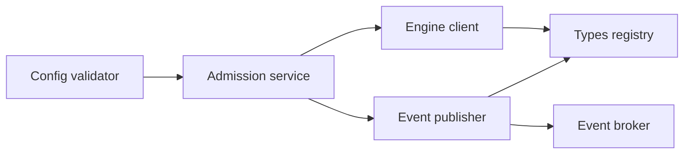
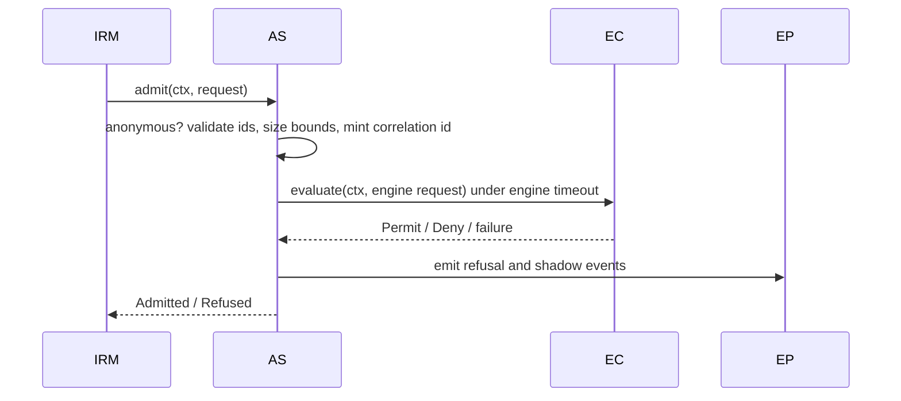

<!-- cpt:
version: 1.0.0
status: draft
module: admission-control
system: cf
-->

# Technical Design — Admission Control

<!-- toc -->

- [1. Architecture Overview](#1-architecture-overview)
  - [1.1 Architectural Vision](#11-architectural-vision)
  - [1.2 Architecture Drivers](#12-architecture-drivers)
  - [1.3 Architecture Layers](#13-architecture-layers)
- [2. Principles & Constraints](#2-principles--constraints)
  - [2.1 Design Principles](#21-design-principles)
  - [2.2 Constraints](#22-constraints)
- [3. Technical Architecture](#3-technical-architecture)
  - [3.1 Domain Model](#31-domain-model)
  - [3.2 Component Model](#32-component-model)
  - [3.3 API Contracts](#33-api-contracts)
  - [3.4 Internal Dependencies](#34-internal-dependencies)
  - [3.5 External Dependencies](#35-external-dependencies)
  - [3.6 Interactions & Sequences](#36-interactions--sequences)
  - [3.7 Database schemas & tables](#37-database-schemas--tables)
  - [3.8 Deployment Topology](#38-deployment-topology)
- [4. Additional context](#4-additional-context)
- [5. Traceability](#5-traceability)

<!-- /toc -->

- [ ] `p1` - **ID**: `cpt-cf-admission-control-design-admission-control`

## 1. Architecture Overview

### 1.1 Architectural Vision

Admission Control is a thin, stateless, in-process gate. Enforcing gears (the Infrastructure Resource Manager first)
call `AdmissionClientV1::admit`; the gate validates the call, then consults at most one engine plugin (the `policy-engine` gear by default) under a timeout, and returns admitted or refused.
Identity comes only from the `SecurityContext`. Anything that cannot be decided is refused. Refusals and shadow
denials are published as events through a bounded queue that can never block or alter a verdict. The gate has two
crates: `admission-control-sdk` (client, plugin contract, models, GTS types) and `admission-control` (the gate).

### 1.2 Architecture Drivers

#### Functional Drivers

| Requirement                                           | Design Response                                                                                        |
|-------------------------------------------------------|--------------------------------------------------------------------------------------------------------|
| `cpt-cf-admission-control-fr-admission-interface`     | Single `admit` on `AdmissionClientV1` (§3.3); `cpt-cf-admission-control-component-admission-service`.   |
| `cpt-cf-admission-control-fr-request-authenticity`    | `AdmissionRequest` has no subject fields; the service reads `SecurityContext` and rejects anonymous.    |
| `cpt-cf-admission-control-fr-identifier-validation`   | `validate_identifier` / `validate_resource_type` in the SDK, called first in `admit` (§3.6).            |
| `cpt-cf-admission-control-fr-request-bounds`          | Property-count check and a byte-budgeted serialization of `properties` (§3.2 Admission Service).        |
| `cpt-cf-admission-control-fr-decision-order`          | Fixed sequence in `cpt-cf-admission-control-seq-gate-operation`: request checks, then one engine call.  |
| `cpt-cf-admission-control-fr-refusal-cause`           | `RefusalCause` enum and `Verdict` (§3.1); engine denial and engine failure are separate variants.       |
| `cpt-cf-admission-control-fr-engine-selection`        | `cpt-cf-admission-control-component-engine-client` resolves one plugin by vendor / instance.            |
| `cpt-cf-admission-control-fr-fail-closed`             | `tokio::time::timeout` around the engine call; no engine or any failure maps to `CouldNotRun`.          |
| `cpt-cf-admission-control-fr-refusal-events`          | `cpt-cf-admission-control-component-event-publisher`: bounded queue, background broker publisher.       |
| `cpt-cf-admission-control-fr-configuration-validation`| `cpt-cf-admission-control-component-config-validator`: strict config and numeric checks at init.        |

#### NFR Allocation

| NFR ID                                   | NFR Summary                    | Allocated To                                        | Design Response                                                                                   |
|------------------------------------------|--------------------------------|-----------------------------------------------------|---------------------------------------------------------------------------------------------------|
| `cpt-cf-admission-control-nfr-fail-closed` | No admission on any failure  | Admission service, engine client                    | Every failure path yields a `CouldNotRun` refusal; the event path is off the decision path.        |
| `cpt-cf-admission-control-nfr-overhead`  | 5 ms p95 gate overhead         | Admission service                                   | Checks are in-memory and bounded by the size limits; no I/O before the engine call.               |

### 1.3 Architecture Layers

- [ ] `p1` - **ID**: `cpt-cf-admission-control-tech-stack`

| Layer          | Responsibility                                               | Technology                                   |
|----------------|--------------------------------------------------------------|----------------------------------------------|
| Contract (SDK) | Client and plugin traits, models, errors, GTS types          | Rust, ToolKit SDK, GTS                       |
| Domain         | `admit` sequence, local client                               | Rust, `#[domain_model]`                      |
| Infrastructure | Engine resolution, event publisher, metrics                  | ClientHub, types-registry, event-broker, OTel |

## 2. Principles & Constraints

### 2.1 Design Principles

#### Decide Nothing That Can Be Delegated

- [ ] `p1` - **ID**: `cpt-cf-admission-control-principle-thin`

The gate orders checks and maps results; every policy decision (platform rules and tenant policy), tenancy and storage
belong to the engine.

#### One Way to Refuse From a Failure

- [ ] `p1` - **ID**: `cpt-cf-admission-control-principle-single-refusal`

Every failure is a `CouldNotRun` refusal with a `FailureCondition`; there is no path from a failure to an admission.

#### The Request Belongs to the Caller

- [ ] `p1` - **ID**: `cpt-cf-admission-control-principle-no-modification`

The gate never changes the request. A valid call returns only a verdict and its correlation id; an anonymous context or an
invalid identifier returns `AdmissionError` instead.

### 2.2 Constraints

#### Exactly One Engine

- [ ] `p1` - **ID**: `cpt-cf-admission-control-constraint-single-engine`

At most one engine is resolved at startup; results of several engines are never combined.

#### In-Process

- [ ] `p2` - **ID**: `cpt-cf-admission-control-constraint-in-process`

The gate is reached only through ClientHub; it exposes no REST or remote surface.

## 3. Technical Architecture

### 3.1 Domain Model

**Technology**: Rust types in `admission-control-sdk/src/models.rs`; domain structs use `#[domain_model]`.

- [ ] `p1` - **ID**: `cpt-cf-admission-control-entity-admission-request`
- [ ] `p1` - **ID**: `cpt-cf-admission-control-entity-verdict`
- [ ] `p1` - **ID**: `cpt-cf-admission-control-entity-engine-result`
- [ ] `p1` - **ID**: `cpt-cf-admission-control-entity-refusal-event`

| Entity           | Description                                                                                                                          |
|------------------|--------------------------------------------------------------------------------------------------------------------------------------|
| AdmissionRequest | `enforcing_gear`, `action`, `resource_type`, `resource_id?`, `resource_tenant_id`, `properties` (JSON map). No subject fields.        |
| Verdict          | `Admitted { correlation_id }` or `Refused { cause, correlation_id }`.                                                                 |
| RefusalCause     | `Policy { reason_code, denials }`, `RequestTooLarge { bound }`, `InvalidRequest`, `CouldNotRun { condition }`. Only `CouldNotRun` is retryable, and not with `Internal`. |
| SizeBound        | `PropertyCount`, `ContextDepth` (fixed `PROPERTY_MAX_DEPTH` = 64), `ContextBytes`.                                                    |
| FailureCondition | `NoEngine`, `EngineUnavailable`, `EngineTimeout`, `EngineError`, `Internal` (a gate or gate–engine contract defect; not retryable). |
| EngineRequest    | Admission request fields plus the correlation id.                                                                                     |
| EngineResult     | `Permit { shadow_denials }` or `Deny { reason_code, denials, shadow_denials }` (a variant the gate does not know is could-not-run `internal`); failure is `EngineFailure { condition, detail }`. |
| PolicyReference  | `bundle_id`, `version_id`, `document_id`, `document_name`.                                                                            |
| RefusalEvent     | Event payload (§3.3): one per (operation, policy) pair, `enforced` false for shadow denials.                                          |

Each valid request yields exactly one verdict; an engine result is mapped, never passed through.

### 3.2 Component Model

#### Admission Service

- [ ] `p1` - **ID**: `cpt-cf-admission-control-component-admission-service`

Owns the `admit` sequence (§3.6): context check, identifier validation, size bounds, correlation id, engine
call under `engine_timeout_ms`, result mapping, event emission and verdict. An engine result past the gate's bounds
(more than 64 denials plus shadow denials, a reason code that is not 1–128 printable ASCII bytes, a document name that is
empty, over 256 bytes or holds a control character) breaks the gate–engine contract and is could-not-run `internal`.
Registered in ClientHub through the local client.

#### Engine Client

- [ ] `p1` - **ID**: `cpt-cf-admission-control-component-engine-client`

Resolves the configured engine on first use, like the platform's other plugin hosts: lists engine plugin instances in
types-registry, applies the pinned `instance_id` or picks the vendor's lowest-priority instance, and takes its scoped client from ClientHub. The
result is cached (one caller resolves at a time; a failure is not cached, so the next call retries). The runtime
starts serve phases without waiting for readiness and the API gateway may accept requests before the gate's serve runs,
so a call can arrive first; it resolves the engine itself, under the engine timeout, and an engine that cannot be
resolved yet refuses as `engine_unavailable` (retryable). The serve phase still resolves the engine once eagerly, so a
configured engine that cannot be resolved fails startup; with none configured every call refuses as `no_engine`.

#### Event Publisher

- [ ] `p1` - **ID**: `cpt-cf-admission-control-component-event-publisher`

A bounded in-memory queue (`event_queue_capacity`) and one background task publishing to `EventBrokerApi` under the gate
identity. A full queue drops the event and increments the dropped-events metric; an absent, failing or stalled broker
(each publication is bounded in time), and every event still queued at shutdown, is logged, counted and dropped the
same way. The event type is registered at init; if the registry is unreachable or does not answer (each call is bounded in time), registration retries
in the background, and stops (logged as an error) if the registry rejects the type.

#### Config Validator

- [ ] `p1` - **ID**: `cpt-cf-admission-control-component-config-validator`

Parses the strict configuration (unknown keys rejected) and rejects zero for every numeric key. Any failure aborts init.

### 3.3 API Contracts

**Admission client** (`cpt-cf-admission-control-interface-admission-client`): `AdmissionClientV1::admit(ctx, &AdmissionRequest) -> Result<Verdict, AdmissionError>`. `Err` is only for an anonymous
context (unauthenticated) or an invalid identifier (invalid argument, value never echoed). Everything decided or failed is
an `Ok(Verdict)`. The SDK also defines stable reason codes for the four causes (`POLICY_REFUSED`,
`REQUEST_TOO_LARGE`, `INVALID_REQUEST`, `COULD_NOT_RUN`). Projected onto canonical errors, policy refusals are
`failed_precondition`, too large is `out_of_range`, invalid request is `invalid_argument` naming
`properties` (all 400, not retryable), could-not-run `internal` is `internal` (500, not retryable), and every other
could-not-run is `service_unavailable` (503, retryable).

**Engine plugin** (`cpt-cf-admission-control-interface-engine-plugin`): `AdmissionEnginePluginClientV1::evaluate(ctx, &EngineRequest) -> Result<EngineResult, EngineFailure>`, scoped by the
engine's GTS instance of `gts.cf.toolkit.plugins.plugin.v1~cf.core.admission_control.engine.v1~`. `EngineFailure`
conditions and the refusal each maps to: unavailable, timeout and internal → could-not-run (`engine_unavailable`,
`engine_timeout`, `engine_error`; retryable); invalid-request, meaning the caller-supplied properties are invalid for the
operation → `InvalidRequest` (not retryable); contract-violation, meaning the engine cannot process what the gate sent →
could-not-run `internal` (not retryable). The engine's detail goes to operator logs only. The gate enforces its own
timeout and drops the call's future when it fires, so implementations must be cancel-safe.

**GTS types** (`cpt-cf-admission-control-contract-gts`): the engine plugin spec above, the error resource `gts.cf.core.admission_control.admission.v1~`, and the
refusal event type `gts.cf.core.events.event.v1~cf.core.admission_control.refusal.v1~` on topic
`gts.cf.core.events.topic.v1~cf.core.admission_control.audit.v1`.

**Refusal event** (`cpt-cf-admission-control-contract-refusal-event`): the broker envelope carries the correlation id as
`subject` (subject type `gts.cf.core.admission_control.admission.v1~`), the resource tenant as `tenant_id`, the decision
instant as `occurred_at`; `trace_parent` is not set yet. The payload (`data`) does not repeat them: `enforcing_gear`,
`action`, `resource_type`, `resource_id?`, `subject_id`, `subject_tenant_id`, `enforced`, `cause` (`policy`,
`request_too_large`, `invalid_request`, `could_not_run`), `condition?`, `policy?`,
`property_names` (names only). The `data` schema is generated from the payload type. Counts: policy denial with N
denials gives N events; too-large, invalid-request and could-not-run give 1; each shadow denial gives 1 with
`enforced: false`; admissions give none.

Configuration (`gears.admission-control.config`, unknown keys rejected): `engine { vendor, instance_id? }`,
`engine_timeout_ms` (100), `max_properties` (256), `max_context_bytes` (65536), `event_queue_capacity` (1024).

### 3.4 Internal Dependencies

| Dependency Module | Interface Used                                   | Purpose                                                   |
|-------------------|--------------------------------------------------|-----------------------------------------------------------|
| `types-registry`  | `TypesRegistryClient`                            | Engine discovery, event registration                      |
| `event-broker`    | `EventBrokerApi` (optional, via ClientHub)       | Publish refusal events                                    |
| Engine plugin     | `AdmissionEnginePluginClientV1` (scoped)         | Evaluate tenant policy (`policy-engine` by default)       |

### 3.5 External Dependencies

None.

### 3.6 Interactions & Sequences

#### Gate an Operation

**ID**: `cpt-cf-admission-control-seq-gate-operation`

#### Refuse Because the Engine Could Not Answer

**ID**: `cpt-cf-admission-control-seq-engine-failure`

No engine, engine unavailable, error or timeout yields `Refused(CouldNotRun { condition })`; one event is emitted and
the failure is logged with the engine id.

### 3.7 Database schemas & tables

- [ ] `p1` - **ID**: `cpt-cf-admission-control-db-none`

Not applicable: the gate is stateless and persists nothing.

### 3.8 Deployment Topology

- [ ] `p1` - **ID**: `cpt-cf-admission-control-topology-in-process`

The gate runs in-process with its enforcing gears; the engine plugin may be co-located or linked separately.

## 4. Additional context

**Telemetry**: `admission_control_verdicts_total{cause}` (admitted or refusal cause),
`admission_control_engine_call_seconds` and `admission_control_events_dropped_total`. Labels come from closed sets. Log
lines of a decision run in an `admission` span carrying `correlation_id`, `enforcing_gear`, `action` and
`resource_type` (all validated first), so each line is tied to the decision and, through the span, to the caller's
trace.

**Identity and readiness**: events are published under the gate's fixed `GATE_SUBJECT_ID`, presenting the first-party
wildcard token scope (`"*"`): the authorization resolver refuses an empty scope list before RBAC is consulted, so what the
gate may publish is decided by the RBAC grant of its subject. The gate is ready once
serving, with the engine resolved or explicitly absent.

**Security**: the request is untrusted input. Identifiers are validated before use, and a rejected value is never echoed in
the validation error. Validated identifiers appear in refusal events and the admission span; events carry property names,
never values.

## 5. Traceability

- **PRD**: [PRD.md](./PRD.md)
