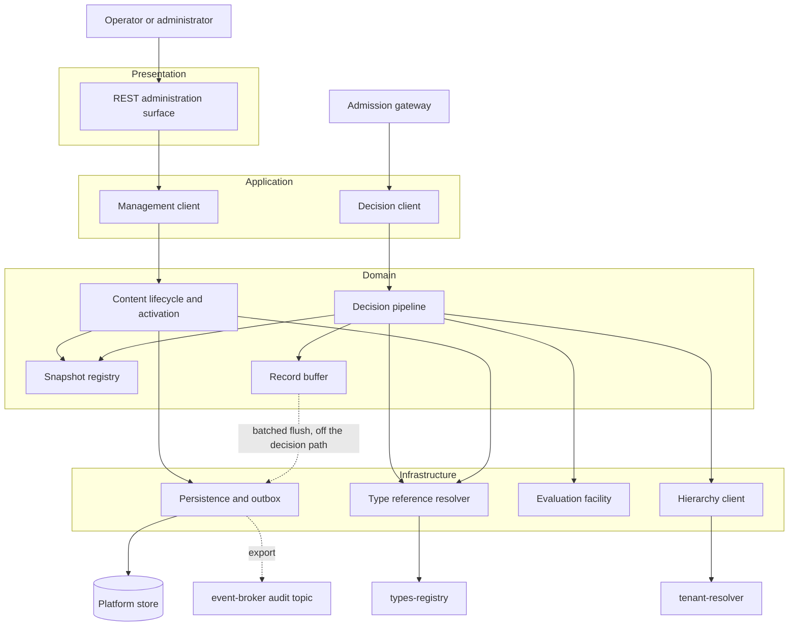
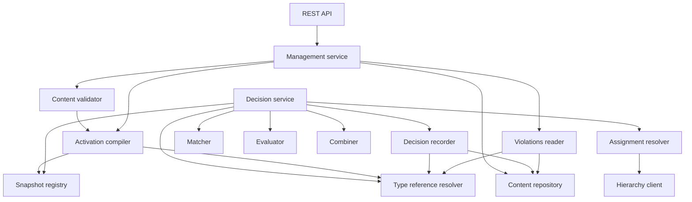
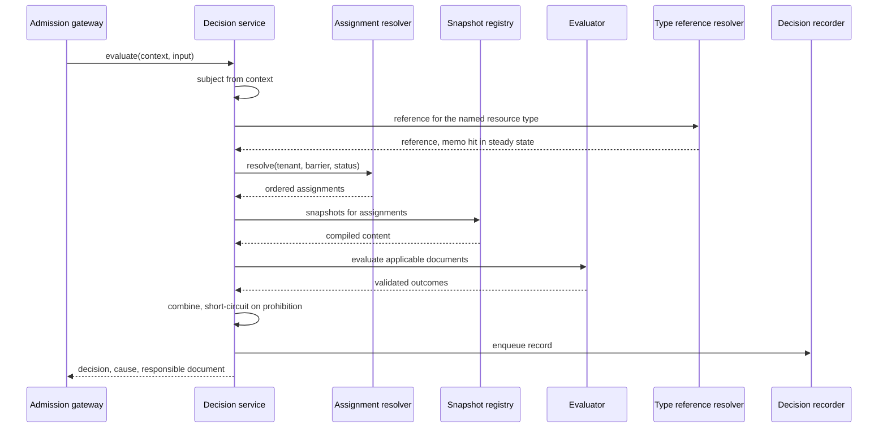
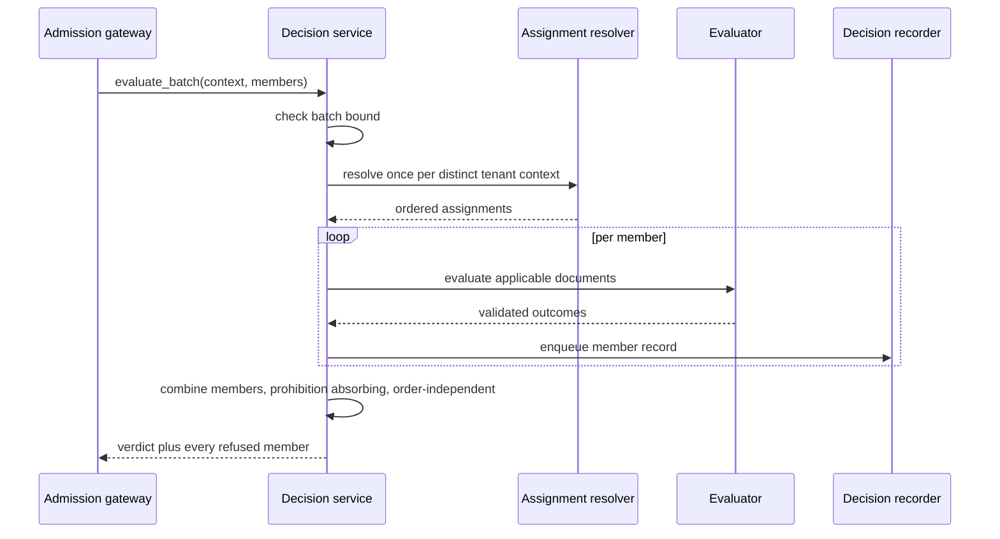
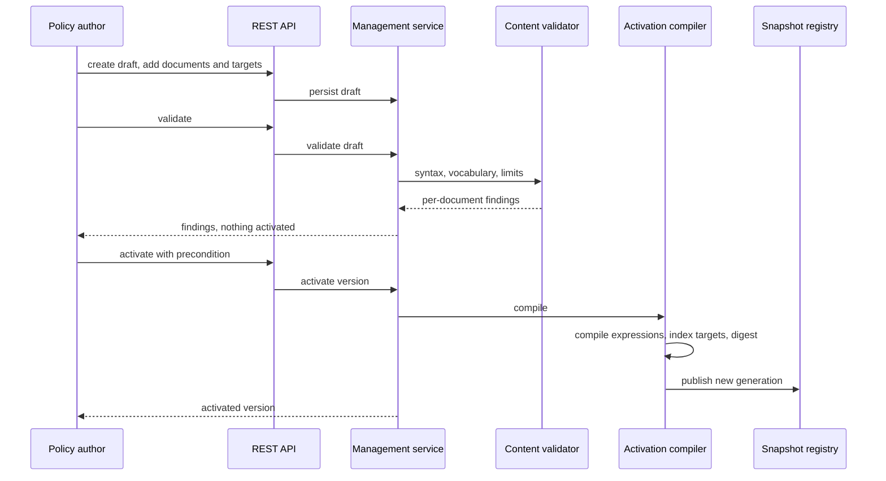
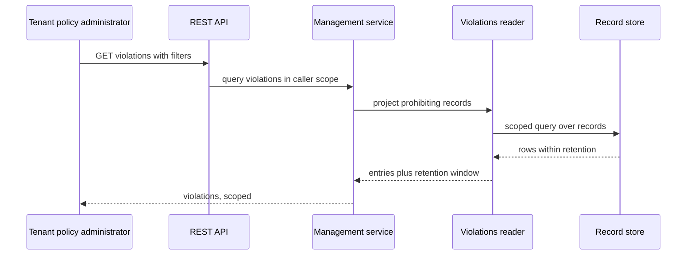
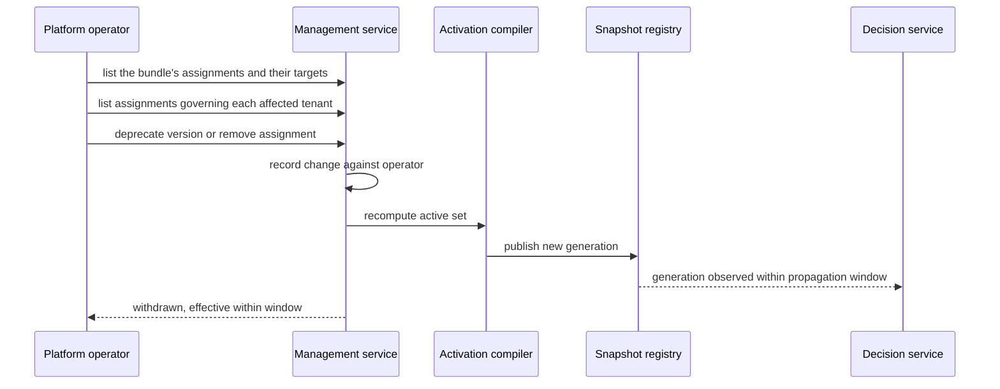
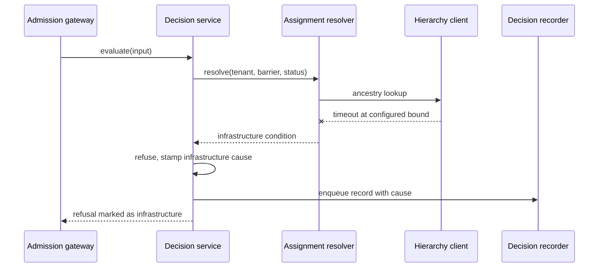

# Technical Design — Policy Engine

<!-- toc -->

- [1. Architecture Overview](#1-architecture-overview)
  - [1.1 Architectural Vision](#11-architectural-vision)
  - [1.2 Architecture Drivers](#12-architecture-drivers)
  - [1.3 Architecture Layers](#13-architecture-layers)
- [2. Principles & Constraints](#2-principles--constraints)
  - [2.1 Design Principles](#21-design-principles)
  - [2.2 Constraints](#22-constraints)
- [3. Technical Architecture](#3-technical-architecture)
  - [3.1 Domain Model](#31-domain-model)
  - [3.2 Component Model](#32-component-model)
  - [3.3 API Contracts](#33-api-contracts)
  - [3.4 Internal Dependencies](#34-internal-dependencies)
  - [3.5 External Dependencies](#35-external-dependencies)
  - [3.6 Interactions & Sequences](#36-interactions--sequences)
  - [3.7 Database schemas & tables](#37-database-schemas--tables)
  - [3.8 Deployment Topology](#38-deployment-topology)
- [4. Additional context](#4-additional-context)
  - [4.1 Telemetry surface](#41-telemetry-surface)
  - [4.2 Capacity envelope](#42-capacity-envelope)
  - [4.3 Deferred items](#43-deferred-items)
  - [4.4 Known design risks](#44-known-design-risks)
  - [4.5 Reliability, error handling, and consistency](#45-reliability-error-handling-and-consistency)
  - [4.6 Security boundaries and threat model](#46-security-boundaries-and-threat-model)
  - [4.7 Testability and test strategy](#47-testability-and-test-strategy)
  - [4.8 Compliance and privacy posture](#48-compliance-and-privacy-posture)
  - [4.9 Deviations from platform baselines](#49-deviations-from-platform-baselines)
  - [4.10 Migration, deprecation, and technical debt](#410-migration-deprecation-and-technical-debt)
  - [4.11 Areas recorded as not applicable](#411-areas-recorded-as-not-applicable)
- [5. Traceability](#5-traceability)

<!-- /toc -->

- [ ] `p1` - **ID**: `cpt-cf-policy-engine-design-policy-engine`
## 1. Architecture Overview

### 1.1 Architectural Vision

The gear is built around one asymmetry: policy content changes rarely and is read on every gated operation. The design exploits that by moving all interpretation of content to activation time. When a bundle is activated, an activation compiler validates it, resolves its targets, compiles each document through the backend its declared language names, computes a content digest, and publishes an immutable snapshot. Evaluation then reads only that snapshot. No decision path issues a content query, parses an expression, or observes a partially applied write, which is what makes the latency budget in `cpt-cf-policy-engine-nfr-decision-latency` an allocation the gear can hold rather than a hope about database behaviour.

The gear separates two surfaces that have nothing in common except the content they share. The management surface is a conventional CRUD-and-lifecycle service over a relational store, transactional, tenant-scoped, and reachable over REST. The decision surface is a synchronous in-process call that touches the snapshot, the tenant hierarchy cache, and nothing else. They are separate components with separate clients, so a consumer on the admission path never links the administration contract, and administration load cannot displace decision latency.

Fail-closed behaviour is structural rather than defensive. Every path that cannot produce a well-founded outcome — an absent snapshot, a digest mismatch, an expression that exceeds its cost bound, an unreachable hierarchy provider, a tenant context that will not resolve — converges on a single refusal constructor that stamps a distinct cause. That constructor is the only way to build a negative decision from an error condition, and it marks the result so that `cpt-cf-policy-engine-fr-denial-versus-failure` can report the refusal as infrastructure rather than policy. Refusing and reporting honestly are separate obligations, and the design keeps them separately testable.

### 1.2 Architecture Drivers

Requirements that significantly influence architecture decisions.

#### Functional Drivers

| Requirement | Design Response |
|-------------|------------------|
| `cpt-cf-policy-engine-fr-bundle-composition` | `cpt-cf-policy-engine-entity-bundle`, `-document`, and `-target` model the content tree; the bundle version is the unit of digest, snapshot, and assignment. |
| `cpt-cf-policy-engine-fr-target-binding` | `cpt-cf-policy-engine-component-matcher` indexes targets by trigger, phase, and resource type at compile time, so matching is a lookup rather than a scan. |
| `cpt-cf-policy-engine-fr-content-validation` | `cpt-cf-policy-engine-component-validator` runs the same checks the activation compiler runs, against a draft, without publishing a snapshot. |
| `cpt-cf-policy-engine-fr-lifecycle-states` | State lives on the version row, not the bundle; the four transitions are enforced in `cpt-cf-policy-engine-component-management` with conditional updates, and the at-most-one-active invariant is a partial unique index rather than an application check. |
| `cpt-cf-policy-engine-fr-administration-audit` | `cpt-cf-policy-engine-component-management` writes an administration event in the same transaction as the change it describes, into `policy_engine__admin_event`; retention is independent of the decision-record sweep. |
| `cpt-cf-policy-engine-fr-content-integrity` | Digest computed by the activation compiler, stored on the version row, verified at activation and whenever a generation is built or reloaded — never per evaluation, which the latency budget could not absorb. |
| `cpt-cf-policy-engine-fr-optimistic-concurrency` | `etag` column on every mutable row, surfaced as an HTTP precondition and as an explicit parameter on the management client. |
| `cpt-cf-policy-engine-fr-idempotent-management` | `cpt-cf-policy-engine-component-management` writes an idempotency record into `policy_engine__idempotency` in the same transaction as the entity and its administration event; a replay is served from that record and a fingerprint mismatch is refused as a conflict. The REST layer maps the `Idempotency-Key` header and the `Idempotency-Replayed` response header; the management client takes the key as a parameter. |
| `cpt-cf-policy-engine-fr-version-history` | Versions are immutable rows under a stable bundle identity; returning to earlier content seeds a new draft from a retained version and activates that draft, taking a new version identity and its own administration event, so a deprecated version is never reactivated in place. |
| `cpt-cf-policy-engine-fr-deprecation` | Deprecation is a version-state transition that triggers snapshot republication, bounded by `cpt-cf-policy-engine-nfr-activation-propagation`. |
| `cpt-cf-policy-engine-fr-version-comparison` | `cpt-cf-policy-engine-component-management` compares two retained versions structurally; the widening flag is computed from the compiled target index, the outcome directives, and a per-document digest of content bytes on each side, so it needs no evaluation and no sample traffic. Any prohibiting document whose content digest differs is flagged, because the gear cannot interpret content and so cannot rule a content change out as a relaxation; the flag therefore covers structural and content changes alike, at the cost of also flagging content edits that only tighten. |
| `cpt-cf-policy-engine-fr-non-enforcing-assignment` | An enforcing flag on the assignment row travels into the snapshot, and `cpt-cf-policy-engine-component-combiner` folds outcomes from non-enforcing assignments into the trace and the record but not into the result. |
| `cpt-cf-policy-engine-fr-effective-windows` | Window columns on the assignment row, evaluated by the assignment resolver against the evaluation timestamp. |
| `cpt-cf-policy-engine-fr-tenant-assignment` | `cpt-cf-policy-engine-entity-assignment` binds a bundle to a tenant with a priority; the snapshot is keyed by assignment and resolves the bundle's active version when a generation is built, so activation, withdrawal, and amendment all republish a generation by the same path and none of them rewrites an assignment row. |
| `cpt-cf-policy-engine-fr-assignment-visibility` | Two reads on `cpt-cf-policy-engine-component-management`: assignments by bundle is one query on the assignment table's `bundle_id` index joined to the active version's compiled target index for the summary; assignments governing a tenant reuses `cpt-cf-policy-engine-component-assignment-resolver` with barriers respected, so it costs one cached ancestry lookup plus one assignment query — the same work as a decision. Content is never projected, only identities, priorities, windows, and target summaries. |
| `cpt-cf-policy-engine-fr-nearest-tenant` | `cpt-cf-policy-engine-component-assignment-resolver` orders the ancestry chain nearest-first and applies priority within a tenant. |
| `cpt-cf-policy-engine-fr-inheritance-barriers` | Barrier handling is read from the request and passed through to the hierarchy client; the resolver holds no default of its own. |
| `cpt-cf-policy-engine-fr-assignment-authorization` | `cpt-cf-policy-engine-component-management` declares the barrier handling of its own surfaces rather than inheriting one: it resolves the target tenant through the hierarchy client with barriers respected and refuses an out-of-reach target with the boundary cause, so the management-plane rule is one check in one component instead of a convention repeated at each endpoint. The evaluation plane is untouched by it. |
| `cpt-cf-policy-engine-fr-applicable-set` | Matcher intersects the compiled target index with the resolved assignment set, bounded by the applicable-set limit. |
| `cpt-cf-policy-engine-fr-deterministic-ordering` | Ordering key is (proximity, priority descending, assignment identifier), applied as a total order before evaluation begins. |
| `cpt-cf-policy-engine-fr-evaluation-phases` | Phase is part of the target index; the after-phase path discards the outcome's effect on the verdict while still recording it. |
| `cpt-cf-policy-engine-fr-permit-provenance` | `cpt-cf-policy-engine-component-combiner` initialises the accumulator to an ungoverned permit, which a permitting outcome upgrades to governed and any prohibit overrides; no error path reaches the combiner at all, so no failure can produce a permission of any cause. The ungoverned share is exported as a metric. The emergency exception does not weaken this: it is constructed in `cpt-cf-policy-engine-component-decision` before the snapshot is consulted, so it never enters the combiner's fold and the combiner remains unable to produce it. |
| `cpt-cf-policy-engine-fr-denial-precedence` | Combiner treats a prohibition as absorbing; no later permit can clear it, and no earlier one pre-empts it, which is what makes the fold order-independent. |
| `cpt-cf-policy-engine-fr-outcome-combination` | Combination rules are a single pure function over the outcome sequence, unit-testable independently of evaluation. |
| `cpt-cf-policy-engine-fr-short-circuit` | Combiner reports saturation to the evaluation loop; matched and evaluated counts are carried into the record. |
| `cpt-cf-policy-engine-fr-denial-reason` | Refusal carries a canonical error identity plus the document identifier that produced it; detail is recorded and stripped from the response projection. |
| `cpt-cf-policy-engine-fr-denial-versus-failure` | Single refusal constructor stamps an infrastructure cause distinct from every policy cause; the decision client surfaces the distinction to the caller. |
| `cpt-cf-policy-engine-fr-deferral-outcome` | Deferral is a distinct variant in the outcome enum, in the decision projection, and in the decision client's result type, carried end to end even though no consumer routes it yet — reserved on the client specifically so the gateway can map it rather than funnel it as an unmappable result. |
| `cpt-cf-policy-engine-fr-emergency-access` | Emergency entitlement is resolved from the security context alone, before the snapshot is consulted, so it survives a broken snapshot. The permission is built in `cpt-cf-policy-engine-component-decision` carrying the emergency cause — a third member of the permit-cause enum, not a flag beside it — which is why the record table has no separate emergency column and no path can report a governed permission that was in fact an override. |
| `cpt-cf-policy-engine-fr-authorization-boundary` | Two halves, and only one is structural. Structurally: `cpt-cf-policy-engine-entity-evaluation-input` has no field able to hold an entitlement, no component resolves one during evaluation, the emergency entitlement is resolved by `cpt-cf-policy-engine-component-decision` from the security context before the snapshot is consulted rather than passed into the evaluation context, and `cpt-cf-policy-engine-component-combiner` yields a two-valued result carrying a cause and no grant — so no decision this gear returns is expressible as a grant. By caller conformance: the operation context is caller-supplied and uninterpreted here, so a caller can place an `is_admin` or `can_delete` property in it and an author can write a rule over that property. Nothing in this design prevents it, and the PRD's conformance expectations place the obligation where it can be met — authorization is decided before admission, and a property of that kind must come from authoritative state rather than from the request being gated. The absence of an entitlement field narrows what content can see; it does not make an entitlement surrogate impossible. |
| `cpt-cf-policy-engine-fr-evaluation-input` | Evaluation input is a value type carrying subject identity, action, resource, tenant context, and caller-supplied properties; no component fetches consumer state. |
| `cpt-cf-policy-engine-fr-subject-authenticity` | The security context is a required parameter of the decision trait rather than an ambient value, and `EvaluationInput` has no subject or subject-tenant field, so identity has one source by construction. `cpt-cf-policy-engine-component-decision` and the record builder both read the subject from the context, and no path exists that could attribute a decision to any other identity. |
| `cpt-cf-policy-engine-fr-batch-evaluation` | Batch is evaluated member-by-member over one snapshot generation and one hierarchy resolution per distinct tenant context in the batch, with reachability checked per member against the caller's context, then combined by the same absorbing rule. |
| `cpt-cf-policy-engine-fr-obligations` | Obligations ride on the permitting decision as typed identifiers; the client documents the unrecognised-identifier obligation on the caller. |
| `cpt-cf-policy-engine-fr-expression-evaluation` | `cpt-cf-policy-engine-component-evaluator` is the only component that links the evaluation facility, and routes each document to the backend its declared GTS identifier resolves to. |
| `cpt-cf-policy-engine-fr-evaluation-isolation` | Evaluation receives a constructed context value and a gear-supplied timestamp and nothing else; no ambient capability is reachable from the call. `cpt-cf-policy-engine-component-evaluator` refuses to select a backend build whose GTS registration carries no sandbox-and-determinism declaration, and `cpt-cf-policy-engine-component-activation-compiler` refuses content referencing a denylisted builtin — the only enforcement point available, since builtins can be neither removed nor shadowed at call time. |
| `cpt-cf-policy-engine-fr-evaluation-cost-bounds` | Per-document and per-evaluation bounds are enforced by the evaluator around each library call and across the loop, using the backend's own caller-set wall-clock limit where it offers one. That limit is cooperative — checked between work units rather than preemptively — so the configured figure is an upper bound plus one work unit, and the check interval is a tuning input the evaluator sets rather than a constant it inherits. The defaults sit inside the miss-path residue of `cpt-cf-policy-engine-nfr-decision-latency`, which is why the cooperative overrun has to be measured rather than assumed: a residue of roughly 5 ms leaves no slack for a work unit nobody sized. |
| `cpt-cf-policy-engine-fr-dependency-timeouts` | Hierarchy client calls are wrapped in a configured timeout that converts expiry into an infrastructure refusal. |
| `cpt-cf-policy-engine-fr-responsibility-boundary` | Evaluator validates every returned outcome against the closed outcome set before it reaches the combiner. |
| `cpt-cf-policy-engine-fr-content-isolation` | All management repository access goes through the secure data layer with the caller's scope; absent and forbidden collapse to the same result. |
| `cpt-cf-policy-engine-fr-cross-tenant` | Resolver checks resource tenant against the reachable subtree before matching, and stamps its own refusal cause. |
| `cpt-cf-policy-engine-fr-record-visibility` | `cpt-cf-policy-engine-component-violations` and the decision-record reads scope on `resource_tenant_id` over the subtree reachable from the caller's context with barriers respected, never on content ownership; the cross-barrier read is a separate capability and writes an administration event, so a crossing is attributable rather than implicit. |
| `cpt-cf-policy-engine-fr-admin-authorization` | Management operations are gated per capability through the platform enforcement helper; the six capabilities are distinct actions on the gear's own resource types, with the two record reads separate from content read and from each other. |
| `cpt-cf-policy-engine-fr-bootstrap` | `cpt-cf-policy-engine-component-management` reads the bootstrap principal from deployment configuration and, while the bootstrap condition holds, treats that principal as holding the authoring, activation, and assignment capabilities for the root tenant only; every other check is unchanged. The condition is evaluated per request from the store — no bundle exists — and ends permanently at the first activation, after which the same principal is an ordinary caller. Each bootstrap-authorised operation writes an administration event carrying a bootstrap marker, and a gauge reports the condition while it holds. |
| `cpt-cf-policy-engine-fr-decision-records` | `cpt-cf-policy-engine-component-recorder` owns the field set; every other component contributes fields through one builder. |
| `cpt-cf-policy-engine-fr-violations` | `cpt-cf-policy-engine-component-violations` reads the record table with a prohibiting-outcome predicate; no violation table exists. |
| `cpt-cf-policy-engine-fr-record-confidentiality` | The record row has no credential column and stores context property **names** only, never values, so exclusion is structural rather than a filtering step that can be misconfigured. |
| `cpt-cf-policy-engine-fr-subject-data-handling` | `subject_id` and `subject_tenant_id` hold the opaque identity-provider references the security context carries, and no column holds a profile attribute. The gear offers no erasure path over them, because erasure belongs to the identity provider — so no component here ever rewrites a written record, which is what keeps the requirement satisfiable against an append-only export topic. Retention is the only lifetime bound the gear applies. |
| `cpt-cf-policy-engine-fr-record-retention` | Retention sweep over the record table, with window and volume exported as metrics. |
| `cpt-cf-policy-engine-fr-metrics` | Telemetry surface in Section 4.1, emitted from the components that own each measurement. |
| `cpt-cf-policy-engine-fr-explanation` | Explanation is the evaluation trace the combiner already builds, returned instead of discarded. |
| `cpt-cf-policy-engine-fr-dry-run` | Dry-run compiles a draft into a throwaway snapshot and evaluates against it without publication. |
| `cpt-cf-policy-engine-fr-operational-limits` | Limits are validated at activation and re-checked at evaluation, so content that grew past a lowered bound fails closed. |
| `cpt-cf-policy-engine-fr-configuration-validation` | Configuration is a deny-unknown-fields structure with documented defaults, rejected at startup. Cross-field constraints are checked there too, by the component that owns the fields: the recorder's configuration path rejects a retention window that is not a whole multiple of the decision-record partition width, per Section 3.7. |

#### NFR Allocation

This table maps non-functional requirements from PRD to specific design/architecture responses, demonstrating how quality attributes are realized.

| NFR ID | NFR Summary | Allocated To | Design Response | Verification Approach |
|--------|-------------|--------------|-----------------|----------------------|
| `cpt-cf-policy-engine-nfr-decision-latency` | p95 25 ms, p99 50 ms per evaluation, miss path included | `cpt-cf-policy-engine-component-snapshot`, `-matcher`, `-evaluator`, `-type-reference` | Activation-time compilation removes parsing and content I/O from the hot path entirely — content is served from the published generation, never read from storage during a decision, which is what leaves the ~5 ms remaining beside a 20 ms hierarchy miss. Matching is an index lookup against references the reference memo already holds, so the only registry call a decision can make is a memo miss on a resource type no policy has ever targeted | Benchmark at the gear boundary measured over all evaluations including forced cache misses, the reference memo's among them; per-stage timing histograms |
| `cpt-cf-policy-engine-nfr-fail-closed` | No permit on any error path | `cpt-cf-policy-engine-component-decision`, `-combiner` | Single refusal constructor in the decision service, which every error path — absent snapshot, digest mismatch, hierarchy failure, cost bound, backend failure, unmappable outcome — is diverted to before the combiner is reached; no configuration path constructs a permit from an error. The combiner itself never sees an error: it starts from an ungoverned permit, as `cpt-cf-policy-engine-fr-permit-provenance` requires for an empty applicable set, and that start is safe precisely because a failed evaluation never enters the fold | Fault injection across the enumerated conditions |
| `cpt-cf-policy-engine-nfr-availability` | Host-impact in-process; 99.95 percent per surface out-of-process, decision-surface maintenance capped at 30 min/month | `cpt-cf-policy-engine-topology-in-process` | In-process, the target is that no gear failure mode is host-fatal: every error path converges on a refusal rather than a panic, snapshot memory is bounded by the content limits, and evaluation is bounded in time. Out-of-process, the gear becomes independently addressable and the per-surface figure applies; the stateless decision path over process-resident content is what makes it reachable, since a store outage degrades management first and reaches decisions only once the record backlog ages past its window | Fault injection asserting zero host-fatal outcomes; per-surface availability measurement and store-outage drill in the out-of-process shape |
| `cpt-cf-policy-engine-nfr-tenant-isolation` | Zero cross-tenant reads, writes, influences | `cpt-cf-policy-engine-component-repository`, `-violations` | Secure data layer scoping on every query. Content scopes on `owner_tenant_id`; records scope on `resource_tenant_id`, and the two differ whenever an ancestor's bundle refuses an operation in a descendant. The violations reader therefore scopes over the requesting context's reachable subtree of `resource_tenant_id`, not over content ownership, with barriers respected by declaration and a crossing available only under the separate platform capability | Isolation suite including barrier boundaries, plus an ancestor querying a descendant's refusals both with and without the cross-barrier capability |
| `cpt-cf-policy-engine-nfr-decision-record` | One record per evaluation, no sampling | `cpt-cf-policy-engine-component-recorder` | Records enqueued to a transactional outbox and drained asynchronously; queue depth and loss window exported | Throughput test asserting record count equals evaluation count |
| `cpt-cf-policy-engine-nfr-cache-safety` | Cached entries do not outlive their authority | `cpt-cf-policy-engine-component-snapshot` | Snapshot generation is part of every cache key; publication of a new generation invalidates the previous; error results are never cached | Cache-key property tests; revocation timing test |
| `cpt-cf-policy-engine-nfr-activation-propagation` | Effective within 60 seconds | `cpt-cf-policy-engine-component-activation-compiler` | Generation counter polled by every instance at a configured interval bounded well inside the window | Measured propagation across a multi-instance deployment |
| `cpt-cf-policy-engine-nfr-hierarchy-latency` | p95 2 ms on hit, 90 percent hit rate | `cpt-cf-policy-engine-component-assignment-resolver` | Ancestry cache keyed by tenant, barrier mode, and status filter — every dimension resolution runs under, so no entry is shared by two requests that would resolve differently — with a time to live that is configurable and capped at the activation propagation window, so hierarchy staleness carries the same 60-second bound as policy staleness | Hit-rate and latency metrics under steady load; a barrier-change test asserting the change is reflected within the window; a key-completeness test asserting that two requests differing only in status filter never share an entry |
| `cpt-cf-policy-engine-nfr-scalability` | Tenfold load, 1,000 concurrent | `cpt-cf-policy-engine-topology-in-process` | Read-only hot path over immutable state, with exactly one mutable structure on it and its contract stated rather than waived: the bounded record buffer of `cpt-cf-policy-engine-component-recorder`, which every evaluation appends to. It is a multi-producer, single-consumer queue whose append is a bounded, non-blocking enqueue taking no lock a decision can wait behind and performing no I/O; a full buffer is not contention but the serving condition of Section 4.5, which refuses rather than queues. Nothing else on the decision path is written | Load and concurrency test asserting no contention failures, and asserting specifically that append latency at 1,000 concurrent evaluations stays inside the decision budget and that buffer saturation presents as the serving condition rather than as blocking |
| `cpt-cf-policy-engine-nfr-instance-footprint` | Instance memory bounded by content limits, observable, not the binding scaling constraint | `cpt-cf-policy-engine-component-snapshot`, `-evaluator` | Snapshot memory is a function of the activated content one instance holds, so the content limits are the only lever; the registry holds one compiled artefact per active assignment and discards it when the version leaves the active set, and the evaluator allocates per call rather than retaining. Footprint is exported alongside generation age so growth is attributable to content rather than inferred from host metrics. The type-reference memo is the one other resident structure, and it is bounded by the registry's type inventory rather than by content, per `cpt-cf-policy-engine-component-type-reference`; its entry count is exported so that claim is checked | Footprint measured across tenant count and content volume inside the scalability exercise, not as a separate benchmark; memo entry count asserted flat across that exercise |
| `cpt-cf-policy-engine-nfr-durability` | Recovery point and time within 1 hour | `cpt-cf-policy-engine-db-policy-engine` | Content and versions in the platform store under its backup regime; records excluded and governed by retention | Restore exercise into a clean deployment |

#### Key ADRs

None. The architecture decisions this design takes are stated, with their rationale, as the principles and constraints of Section 2, and no separate decision records are planned for this gear. The table the template provides is therefore intentionally empty.

### 1.3 Architecture Layers

Nodes inside the layer boxes are this gear's own code and the libraries it links, the evaluation facility among them. Nodes outside are separate gears and external systems, reached rather than linked.

- [ ] `p1` - **ID**: `cpt-cf-policy-engine-tech-stack`

| Layer | Responsibility | Technology |
|-------|---------------|------------|
| Presentation | Versioned REST administration surface, problem-shaped errors, precondition headers, OData listing and cursor pagination | `toolkit-http`, `toolkit-odata`, `toolkit-canonical-errors` |
| Application | Decision and management clients registered in ClientHub, gear lifecycle, configuration | ToolKit gear capabilities, ClientHub |
| Domain | Content model, activation compilation, assignment resolution, matching, outcome combination, record construction | Rust, `#[domain_model]` types |
| Infrastructure | Content and record persistence, tenant hierarchy client, policy evaluation, GTS registration, registry-reference resolution in both directions | `toolkit-db` secure data layer, `tenant-resolver` SDK, evaluation facility, `toolkit-gts`, `types-registry` SDK |

## 2. Principles & Constraints

### 2.1 Design Principles

#### Interpretation Happens at Activation

- [ ] `p1` - **ID**: `cpt-cf-policy-engine-principle-compile-at-activation`

Everything that can be decided from content alone is decided when the content is activated, not when a decision is requested: syntax, target vocabularies, limits, digest, target indexing, and expression compilation. The decision path consumes only compiled artefacts. This is what makes evaluation cost a function of the applicable set rather than of stored policy volume, and it moves authoring mistakes to the author instead of to the operation that trips over them.

#### Content Is Immutable Once Active

- [ ] `p1` - **ID**: `cpt-cf-policy-engine-principle-immutable-content`

An activated bundle version is never modified. Changes create a new version, and withdrawal is a state transition that leaves the version intact. Immutability is what allows a decision record to name a version and mean something, allows a snapshot to be cached without invalidation logic beyond generation replacement, and allows returning to earlier content to be a fresh activation of a seeded draft rather than a reconstruction.

#### The Caller Supplies the Facts

- [ ] `p1` - **ID**: `cpt-cf-policy-engine-principle-caller-supplied-context`

The gear judges what it is told. It holds no copy of the resources policy governs and retrieves none during evaluation. Policy commonly judges a resource that does not exist yet, so there is nothing to retrieve; and a gear that fetched consumer state would need the resource synchronisation the platform rejected, plus a fetch inside the latency budget. The cost of this principle is stated as an assumption in the PRD: a property the caller omits evaluates as absent.

#### Semantics in the Gear, Language in the Library

- [ ] `p1` - **ID**: `cpt-cf-policy-engine-principle-semantics-in-gear`

The evaluation facility answers one question: what outcome does this document produce over this context. Everything else — which documents apply, in what order, how outcomes combine, what a refusal means, what gets recorded — belongs to the gear. The gear does not parse document content; it resolves the backend identifier the document declares, routes the content there, and reads only the outcome that comes back. Because a policy language can return an arbitrary shape rather than a boolean, the evaluator validates every result against the closed outcome set before it reaches the combiner, so a backend defect degrades to a refusal rather than becoming a policy bypass.

#### Records Are the Only Decision State

- [ ] `p1` - **ID**: `cpt-cf-policy-engine-principle-records-only`

The decision record is the single durable artefact an evaluation produces. Violations are a query over records, explanation is the trace the combiner already built, and metrics are aggregates. Nothing derived from a decision is separately stored, so nothing derived can disagree with the record it came from.

#### Management and Decision Do Not Share a Path

- [ ] `p2` - **ID**: `cpt-cf-policy-engine-principle-surface-separation`

The two surfaces share the content model and nothing else: separate clients, separate components, separate error surfaces, and no synchronous call from decision into management. A consumer on the admission path links only the decision contract. Administration traffic reaches the store; decision traffic reaches memory.

### 2.2 Constraints

#### The Expression Library Is a Hard Dependency

- [ ] `p1` - **ID**: `cpt-cf-policy-engine-constraint-expression-library`

There is no evaluation path without the shared evaluation facility, and no fallback interpreter in the gear. Three properties are required of every backend the facility carries, not of the facility in the abstract: syntax validation exposed separately from evaluation, acceptance of an externally imposed per-document cost bound, and a compile-time introspection that returns the set of builtins a compiled document references, so the denylist screen has a defined input rather than a substring search over source. Without both, `cpt-cf-policy-engine-fr-content-validation` and `cpt-cf-policy-engine-fr-evaluation-cost-bounds` have no implementation. Both are present in the first candidate audited, and the audit also settled what is **not** available and therefore has to be built here: a backend does not declare its own sandbox posture, its determinism depends on which builtins its build registers, and it offers no way to remove or shadow one. Isolation is consequently split — capabilities are withheld at the call, and determinism is enforced by refusing content at activation. The facility itself is still unwritten, which keeps its surface the gear's largest external risk.

#### Tenant Hierarchy Is Owned Elsewhere

- [ ] `p1` - **ID**: `cpt-cf-policy-engine-constraint-hierarchy-external`

Ancestry, descendants, barrier state, and tenant status come from `tenant-resolver`. The gear caches them and reinterprets none of them. Barrier handling arrives on the request and is passed through unchanged, because the platform's position is that the caller decides per resource type.

#### Evaluation Is In-Process and Capability-Free

- [ ] `p1` - **ID**: `cpt-cf-policy-engine-constraint-in-process-evaluation`

Expression evaluation runs in the gear's process, inside the caller's task, with no handle to the network, the filesystem, the clock, or the database. The only ambient value is a gear-supplied evaluation timestamp. Co-location bounds the failure modes but does not remove them, so the cost bound applies regardless.

#### Database Objects Carry the Gear Namespace

- [ ] `p2` - **ID**: `cpt-cf-policy-engine-constraint-db-namespace`

The gear declares `policy_engine` as its stable database namespace and names every object it creates accordingly. The platform's namespacing decision names `policies` specifically as the kind of generic table name that has already produced a collision, so this gear cannot use unprefixed names for its content tables.

#### Type References Are Stored, Identifiers Are Not

- [ ] `p2` - **ID**: `cpt-cf-policy-engine-constraint-type-references`

Every reference this gear persists to a registry entity — the backend a document declares, the concrete type a target names, the resource type a record carries — is stored as the opaque registry reference the types-registry SDK returns, never as the GTS identifier string, and the gear neither derives a reference itself nor depends on its shape. The platform's storage-identity decision makes this the rule for every domain gear with typed objects, and this gear is the first design to demonstrate it, which the decision's own confirmation criteria ask for.

Two consequences are load-bearing rather than incidental. Resolution becomes a dependency of the write path, so a draft naming a backend the registry does not know is refused at insert rather than at activation. And reverse resolution becomes a dependency of every path that speaks outward, which is why it sits in the export drain and the response projection and not in the flush transaction: the record table is where a decision becomes durable, and the serving condition of Section 4.5 must not be tripped by a registry outage.

#### The Latency Budget Is Borrowed

- [ ] `p2` - **ID**: `cpt-cf-policy-engine-constraint-latency-budget`

The decision latency target is a fraction of a consumer's own budget, not an independent figure. Any design change that adds a synchronous dependency to the decision path spends the consumer's budget, so the hot path admits exactly three: the snapshot registry, in memory; the hierarchy cache, which is required to hit; and the reference memo of `cpt-cf-policy-engine-component-type-reference`, which is also required to hit and whose miss is a registry call charged against the same budget. The memo is admitted rather than avoided because the alternative is storing identifier strings, which `cpt-cf-policy-engine-constraint-type-references` forecloses; what keeps it cheap is that the mapping is immutable and activation has already populated it for every type policy targets.

#### The Gateway Is the Only Path, and It Is Not Built Yet

- [ ] `p2` - **ID**: `cpt-cf-policy-engine-constraint-no-gateway`

Every evaluation reaches this gear through `admission-control`, which is specified but unbuilt: its engine plugin contract exists as `cpt-cf-admission-control-interface-engine-plugin` and is declared stable, so the shape is known and a breaking change to it is a major version of the gateway's SDK. Two things follow. The decision surface is specified independently of that contract, so conforming to it is an added implementation of a foreign trait over the same service rather than a change to how decisions are reached — and keeping that separation means a major version of the contract changes only that implementation, never how decisions are reached. And until the gateway is built the gear can only be exercised through a harness standing in for it, so every integration property — context completeness, batch shape, refusal propagation — is verified against a specification rather than against a running consumer.

## 3. Technical Architecture

### 3.1 Domain Model

**Technology**: Rust domain types under `#[domain_model]`, GTS identifiers for resource types and error families

**Location**: `gears/system/policy-engine/policy-engine/src/domain/`

**Core Entities**:

- [ ] `p1` - **ID**: `cpt-cf-policy-engine-entity-bundle`
- [ ] `p1` - **ID**: `cpt-cf-policy-engine-entity-bundle-version`
- [ ] `p1` - **ID**: `cpt-cf-policy-engine-entity-document`
- [ ] `p1` - **ID**: `cpt-cf-policy-engine-entity-target`
- [ ] `p1` - **ID**: `cpt-cf-policy-engine-entity-assignment`
- [ ] `p1` - **ID**: `cpt-cf-policy-engine-entity-evaluation-input`
- [ ] `p1` - **ID**: `cpt-cf-policy-engine-entity-decision`
- [ ] `p1` - **ID**: `cpt-cf-policy-engine-entity-decision-record`
- [ ] `p1` - **ID**: `cpt-cf-policy-engine-entity-snapshot`
- [ ] `p3` - **ID**: `cpt-cf-policy-engine-entity-obligation`

| Entity | Description | Schema |
|--------|-------------|--------|
| PolicyBundle | Stable identity and ownership of a named body of policy within a tenant. Carries no content. | `policy_engine__bundle` |
| PolicyBundleVersion | An immutable-once-activated revision of a bundle: lifecycle state, content digest, authorship, activation timestamp. The unit of versioning and integrity. | `policy_engine__bundle_version` |
| PolicyDocument | One admission guardrail within a version: the evaluation backend its content is written for — held as a registry reference in storage and as its GTS identifier everywhere the gear speaks to a person or another gear — the content itself as source that backend interprets, and the outcome directive the gear applies to what it returns. | `policy_engine__document` |
| PolicyTarget | The binding that decides when a document is evaluated: trigger, phase, resource type or pattern, and conjunctive attribute filters. | `policy_engine__target` |
| PolicyAssignment | Binds a bundle to a tenant with a policy priority, an optional effective window, and a barrier-reach declaration. Resolves to the bundle's active version at generation build, so it survives activation unchanged. | `policy_engine__assignment` |
| EvaluationInput | Caller-supplied request value: action, resource type and optional identifier, tenant context, operation properties, and the correlation identifier. Carries no subject and no subject tenant — per `cpt-cf-policy-engine-fr-subject-authenticity` those come from the caller's propagated security context alone, and the type has no field able to hold them. Carries no entitlement of the subject and has no field shaped to hold one, per `cpt-cf-policy-engine-fr-authorization-boundary`. Not persisted. | Value type |
| Decision | The combined result: outcome, cause, responsible document, obligations, matched and evaluated counts, elapsed time. Not persisted directly. | Value type |
| DecisionRecord | The durable projection of a Decision together with its request identity, written asynchronously and read by the violations projection. | `policy_engine__decision_record` |
| PolicySnapshot | The compiled, digest-verified, immutable evaluation artefact for one activated version: compiled expressions plus the target index. Process-resident. | In-memory |
| Obligation | A typed identifier attached to a permitting decision that the caller must honour or else refuse. | Embedded in Decision |

**Relationships**:
- PolicyBundle → PolicyBundleVersion: one bundle owns an ordered history of versions; exactly one is active at a time.
- PolicyBundleVersion → PolicyDocument: a version owns its documents; documents do not exist outside a version.
- PolicyDocument → PolicyTarget: a document declares one or more targets; a document with no target is never evaluated and fails validation.
- PolicyBundle → PolicyAssignment: a bundle is assigned to zero or more tenants, and each assignment governs through whichever of that bundle's versions is active.
- PolicyBundleVersion → PolicySnapshot: activation compiles exactly one snapshot per version, and that compiled artefact is **shared, not copied**, by every assignment of the bundle; the snapshot is discarded when the version leaves the active set, which is when its last assignment stops resolving to it. `cpt-cf-policy-engine-component-snapshot` is keyed by assignment because that is what a decision looks up, but an entry is a binding — the assignment's tenant, priority, window, and enforcing flag, plus a handle to the shared artefact — so a version assigned to a thousand tenants is compiled once and held once. Instance memory therefore grows with activated content plus one small binding per assignment, which is what `cpt-cf-policy-engine-nfr-instance-footprint` measures.
- EvaluationInput → Decision → DecisionRecord: each input yields one decision, which yields exactly one record.

### 3.2 Component Model

The gear is two crates: `policy-engine-sdk`, carrying the client traits, models, error types, and GTS schemas that consumers link; and `policy-engine`, carrying the gear itself in the platform's domain, API, and infrastructure layering. Components below are modules within those crates, not separate processes.

#### Decision Service

- [ ] `p1` - **ID**: `cpt-cf-policy-engine-component-decision`

##### Why this component exists

Consumers need one call that turns an intended operation into a verdict they can enforce. This component is that call, and it is the only component a consumer on the admission path depends on.

##### Responsibility scope

Owns the decision pipeline and its ordering: context presence check, emergency-entitlement check, tenant reachability check, resource-type reference resolution, assignment resolution, matching, evaluation, combination, record construction. The subject and its tenant are read from the propagated context and from nowhere else — the input has no field for them — so the only identity check is that a context was supplied, and a call without one is refused before any content is reached. Owns the fail-closed constructor that every error path converges on, and the timeout wrappers around external calls. Owns the deadline path too: when the evaluator reports the caller's deadline passed, the service builds a record with the superseded-by-deadline outcome through the ordinary record builder, returns an infrastructure refusal the caller will never read, and increments a counter distinct from the fail-closed ones — the evaluation did not fail, its caller left. Implements `cpt-cf-policy-engine-interface-decision-client` for both single and batch requests.

##### Responsibility boundaries

Does not read or write policy content, does not interpret expressions, and does not resolve tenant hierarchy itself. Does not enforce its own decisions, and has no way to observe whether a caller honoured one.

##### Related components (by ID)

- `cpt-cf-policy-engine-component-snapshot` — depends on, for the compiled content of each applicable assignment
- `cpt-cf-policy-engine-component-assignment-resolver` — calls
- `cpt-cf-policy-engine-component-matcher` — calls
- `cpt-cf-policy-engine-component-evaluator` — calls
- `cpt-cf-policy-engine-component-combiner` — calls
- `cpt-cf-policy-engine-component-type-reference` — calls
- `cpt-cf-policy-engine-component-recorder` — publishes to

#### Snapshot Registry

- [ ] `p1` - **ID**: `cpt-cf-policy-engine-component-snapshot`

##### Why this component exists

The decision path must not query the store or parse content. The registry is the process-resident, immutable, generation-stamped view of every currently active assignment and the compiled content behind it.

##### Responsibility scope

Holds compiled snapshots keyed by assignment, together with a monotonic generation counter. Resolves each assignment's bundle to that bundle's active version while building a generation — the join that makes an activation take effect everywhere without an assignment row being touched, and the reason a snapshot is keyed by assignment rather than by version. Verifies the content digest when a snapshot is built and whenever it is reloaded. A mismatch found at reload is contained per assignment, not per generation, and it is not silent: the generation still publishes, so every other tenant's propagation proceeds, but the affected assignment enters it as a poisoned entry rather than being dropped — any evaluation whose applicable set reaches that assignment refuses with the digest-mismatch infrastructure cause, which is the outcome the fail-closed threshold of `cpt-cf-policy-engine-nfr-fail-closed` already names for this condition. Dropping the entry instead would ungovern its tenant while the assignment row still looked in force, which is exactly the invisible coverage gap `cpt-cf-policy-engine-fr-permit-provenance` exists to prevent; failing the whole build would stall every tenant's propagation over one corrupted version. The poisoned-entry count is exported and is alertable, since a non-zero value means stored content no longer matches what was activated. This is distinct from the activation-time path, where a mismatch aborts the activation and leaves the version in draft, and from an assignment whose bundle simply has no active version, which contributes nothing and is not an error. Publishes a new generation atomically, so a reader observes either the whole previous generation or the whole next one. Polls for generation changes at a configured interval bounded inside the activation propagation window, which is how a change made on one instance reaches the others. Tracks the age of its published generation against the store's counter, and holds a serving condition symmetric to the recorder's: once that age exceeds a configured multiple of the propagation window — because the poll, the build, or the publication keeps failing — the registry reports itself stale, the decision service stops returning permits and refuses with a distinct infrastructure cause, and the instance reports degraded on the same terms as the record-path condition in Section 4.5. Without this rule an instance stuck on a generation from before an activation would keep serving ungoverned permits for a tenant its siblings had begun to refuse, indefinitely and silently; with it, staleness past the bound is a refusal rather than a disagreement. The default multiple is two, so a single missed poll never trips it. Generation age is exported per instance and the stale state is a gauge.

Owns the poll task's lifecycle, on the same terms the recorder owns its flusher's. The task is started in the gear's start phase after the initial load completes, and on the gear's stop signal the registry cancels it and joins it before the store handle is released, so no poll runs against a connection being torn down. A generation build interrupted by the stop is discarded whole: publication is atomic, so an unfinished build was never visible and needs no cleanup, and the generation last published keeps serving any decision still in flight until the decision service itself has stopped. Instance replacement is the same path — the departing instance's poller is cancelled and joined, and the arriving instance performs its own initial load, so no generation state is handed between them.

An assignment whose bundle has no active version — every version still a draft, or the last one deprecated without a successor — contributes nothing to the generation and is not an error. Its tenant is then governed by whatever other assignments reach it, and by nothing if there are none, which `cpt-cf-policy-engine-fr-permit-provenance` reports as an ungoverned permit rather than disguising as a refusal.

##### Responsibility boundaries

Does not compile content, does not decide what is active, and never serves a partially built generation. Holds nothing derived from a request, so it is not a decision cache and carries no request-scoped keys.

##### Related components (by ID)

- `cpt-cf-policy-engine-component-activation-compiler` — subscribes to
- `cpt-cf-policy-engine-component-decision` — owns data for

#### Activation Compiler

- [ ] `p1` - **ID**: `cpt-cf-policy-engine-component-activation-compiler`

##### Why this component exists

Activation is the moment when content stops being text and becomes an evaluation artefact. Concentrating that transformation in one place is what keeps the decision path free of parsing and the validator honest about what activation will do.

##### Responsibility scope

Resolves each document's declared backend identifier and each concrete target type through `cpt-cf-policy-engine-component-type-reference`, storing the references the schema holds and keeping the identifiers only in the compiled artefact, compiles the document through the backend instance that resolves, builds the target index used by matching, computes and records the content digest — SHA-256 over the canonical serialisation `cpt-cf-policy-engine-fr-content-integrity` defines, so the value depends on the content and not on how the store happens to lay it out — enforces the content limits, screens the compiled form for builtins denylisted for that backend build, and publishes the resulting snapshot as a new generation. A document whose backend identifier does not resolve, whose target names a resource type that does not, or which references a denylisted builtin, fails compilation here rather than at evaluation. The screen runs over the parsed form rather than over the source text, because a substring search for a builtin name is defeated by anything the language allows in its place. Runs the identical pipeline for dry-run against a draft, publishing nothing.

##### Responsibility boundaries

Does not decide lifecycle state transitions, does not write content, and does not evaluate. A compilation failure aborts activation and leaves the version in draft; it never produces a partial snapshot.

##### Related components (by ID)

- `cpt-cf-policy-engine-component-validator` — shares model with
- `cpt-cf-policy-engine-component-snapshot` — publishes to
- `cpt-cf-policy-engine-component-management` — subscribes to

#### Content Validator

- [ ] `p1` - **ID**: `cpt-cf-policy-engine-component-validator`

##### Why this component exists

An author needs the answer to "will this activate" before activating, and the answer has to be the same one activation would give.

##### Responsibility scope

Runs backend and resource-type identifier resolution through `cpt-cf-policy-engine-component-type-reference`, content syntax validation through the resolved backend, target vocabulary checks, the denylisted-builtin screen over the parsed form, and limit checks against a draft version, and reports every failure against the document that caused it rather than stopping at the first. The screen set is shared with `cpt-cf-policy-engine-component-activation-compiler` rather than reimplemented, because the promise that a draft which validates is a draft which activates is only true while the two run the same checks — and a denylist enforced at activation but not at validation would break it in the one direction that matters, by passing validation and then failing the activation an author has already been told will succeed.

##### Responsibility boundaries

Does not publish, does not mutate state, and does not answer whether a policy is correct — only whether it is well-formed and within bounds.

##### Related components (by ID)

- `cpt-cf-policy-engine-component-activation-compiler` — shares model with
- `cpt-cf-policy-engine-component-management` — called by

#### Assignment Resolver

- [ ] `p1` - **ID**: `cpt-cf-policy-engine-component-assignment-resolver`

##### Why this component exists

Which policy applies is a question about the tenant tree, and answering it on every evaluation without a cache would put a remote call inside the latency budget.

##### Responsibility scope

Resolves the resource tenant's ancestry under the requested barrier mode and status filter, checks that the resource tenant lies within the reachable subtree, collects the assignments visible along the chain, applies effective windows, and orders the result by proximity, then priority, then assignment identifier. Caches ancestry keyed by tenant, barrier mode, **and status filter** — all three, because resolution runs under all three and two requests differing only in whether suspended tenants are included resolve to different chains; a key omitting the filter would serve one caller's chain to the other, which is a cross-tenant influence of exactly the kind `cpt-cf-policy-engine-nfr-tenant-isolation` forbids. The entry carries a configurable time to live whose maximum is the activation propagation window of `cpt-cf-policy-engine-nfr-activation-propagation`; the default is half that window. A hierarchy change — a barrier raised, a tenant suspended, an ancestor moved — is therefore reflected in decisions within the same 60 seconds a policy withdrawal is, and `cpt-cf-policy-engine-nfr-cache-safety` states the bound. Invalidation on a hierarchy event rather than by expiry would tighten this, and is deliberately not assumed: it needs a change notification `tenant-resolver` does not offer today, and a time bound that holds is worth more than an event bound that depends on a contract that does not exist.

##### Responsibility boundaries

Does not own hierarchy, does not apply a barrier default of its own, and does not evaluate. Converts a hierarchy timeout or outage into an infrastructure refusal rather than a narrowed or widened set.

##### Related components (by ID)

- `cpt-cf-policy-engine-component-hierarchy-client` — depends on
- `cpt-cf-policy-engine-component-decision` — called by

#### Matcher

- [ ] `p1` - **ID**: `cpt-cf-policy-engine-component-matcher`

##### Why this component exists

Evaluating every document on every operation would make cost scale with stored policy rather than with relevant policy.

##### Responsibility scope

Intersects the compiled target index of each ordered assignment with the request's trigger, phase, resource type, and attribute filters, producing the applicable set in evaluation order and the matched count. The resource-type lookup has two lanes: an exact lane keyed by the registry reference the reference resolver returned for the request, and a pattern lane matched against the identifier and checked only when the exact lane misses — the same shape the gateway's built-in selection uses, and what keeps a wildcard target matching a type registered after the current generation was built. Enforces the applicable-set bound.

##### Responsibility boundaries

Performs no expression evaluation — attribute filters use the closed operator set and are structural, which is why they can run before the evaluator and cheaply exclude most content.

##### Related components (by ID)

- `cpt-cf-policy-engine-component-snapshot` — depends on
- `cpt-cf-policy-engine-component-evaluator` — calls

#### Evaluator

- [ ] `p1` - **ID**: `cpt-cf-policy-engine-component-evaluator`

##### Why this component exists

It is the boundary with the evaluation facility, and the place where an untrusted result becomes a trusted one.

##### Responsibility scope

Builds the evaluation context from the request and a gear-supplied timestamp, invokes the compiled expression under the per-document cost bound, enforces the per-evaluation bound across the loop, checks the caller's deadline before the first document and between documents — stopping the loop and reporting the deadline as passed rather than continuing into work nobody will read — and validates every returned outcome against the closed outcome set before passing it on. The deadline check is between documents, not inside one, so it inherits the same one-work-unit granularity as the cooperative cost bound. The per-document bound is set on the backend and is cooperative: it is checked between work units, so it overruns by at most one work unit, and the evaluator sets the check interval rather than accepting a default. The per-evaluation bound is the evaluator's own, measured across the loop, because no backend can see a budget that spans several of its invocations.

##### Responsibility boundaries

The only component that links the evaluation facility, and it evaluates through the backend instance the activation compiler already resolved rather than resolving one per request. It cannot enforce determinism at this point and does not try: builtins resolve inside the backend ahead of anything registered over the same name, so content that reached evaluation carrying a clock read or a random generator would be evaluated. That is why the denylist is the activation compiler's obligation and not this component's — by the time an expression is invoked here, the only remaining defence is the cost bound. Does not combine outcomes, does not record, and does not decide what to evaluate. Converts any backend failure, unavailable backend, or bound exceedance into an infrastructure refusal rather than a prohibition.

##### Related components (by ID)

- `cpt-cf-policy-engine-component-combiner` — calls
- `cpt-cf-policy-engine-component-matcher` — called by

#### Combiner

- [ ] `p1` - **ID**: `cpt-cf-policy-engine-component-combiner`

##### Why this component exists

Consumers need one answer. The rules that produce it are a product decision and belong in one auditable place.

##### Responsibility scope

Folds the document-outcome sequence into a single two-valued result — permit or prohibit — under the absorbing-prohibition rule, starting from an ungoverned permit. A permitting outcome moves the cause to governed; a prohibit overrides both. The cause travels with the result rather than as a third variant, so a caller branching only on permit or prohibit is correct without knowing the cause exists. The emergency cause is not reachable from this fold and is not meant to be: it is constructed upstream in `cpt-cf-policy-engine-component-decision`, on a path that has already given up on producing an outcome sequence, which is what keeps this component's output a pure function of the outcomes it was given. Reports saturation so the caller can stop early — but saturation is computed over enforcing outcomes only, and stopping applies to enforcing documents only. Documents from non-enforcing assignments are evaluated in a second pass after the enforcing fold has finished or saturated, in their own deterministic order, and their outcomes enter the trace and the record but never the accumulator, so `cpt-cf-policy-engine-fr-non-enforcing-assignment`'s promise that a shadow assignment is evaluated exactly as an enforcing one holds even when an enforcing prohibition ended the first pass early. Accumulates the evaluation trace used by explanation, and carries matched and evaluated counts, the latter counting both passes. Combines batch members under the same rule and collects every refused member.

##### Responsibility boundaries

A pure, order-independent fold over outcomes, with no I/O and no knowledge of where they came from. Order-independence is a property worth testing directly: the same applicable set in any permutation must produce the same result, which is what keeps the ordering in `cpt-cf-policy-engine-fr-deterministic-ordering` a reporting concern rather than a semantic one.

##### Related components (by ID)

- `cpt-cf-policy-engine-component-decision` — called by

#### Decision Recorder

- [ ] `p1` - **ID**: `cpt-cf-policy-engine-component-recorder`

##### Why this component exists

Every evaluation must leave evidence, and writing that evidence synchronously would consume the latency budget it is measured against.

##### Responsibility scope

Owns the record field set and its single builder, and stages records in two stages so that durability never touches the decision path. On the decision path it appends the built record to a bounded in-memory buffer, which performs no I/O, stamping it with the next value of this instance's append sequence so that durability can later be measured contiguously rather than by time. Off it, a flusher periodically takes a batch from the buffer and, in one transaction, inserts it into `policy_engine__decision_record` and enqueues the same records for export on the `toolkit-db` outbox. The batch is **reserved, not removed**, until that transaction commits: the flusher marks it as in flight so no second flush claims it, and only a commit releases it. A rollback or a failed transaction returns the batch to the buffer unchanged, at its original position, to be retried by the next flush — so a store failure delays durability and ages the buffer toward the serving condition, which is the accounted outcome, rather than dropping records into the gap between a removal and a commit that never happened. Fault injection covers a transaction that fails mid-flush, asserting that every record survives, that none is inserted twice once the retry commits, and that the buffer's age reflects the delay. Exports buffer age, buffer occupancy, and outbox depth, the first of which is the control input for the serving condition. Applies the retention sweep.

Owns the flusher's lifecycle. On the gear's stop signal it refuses new appends — the decision service is already refusing, since the gear is stopping — signals the flusher, joins it, and runs one final flush of the remaining buffer within a bounded deadline; a residue the deadline leaves behind is counted and reported on the gear's degraded surface, so a clean stop either persists every buffered record or states what it did not. The deadline defaults to 5 seconds — the record window of `cpt-cf-policy-engine-nfr-decision-record`, which is by definition the most the buffer should hold — and is operator-configurable between 1 and 30 seconds. The deployment's termination grace period must exceed it with margin, on the same terms as the gateway's; an orchestrator that kills the process first converts a clean stop into the crash case, and the loss then falls to the startup marker to bound rather than being avoided. A crash is different: it discards whatever the buffer holds, bounded by the record window, and nothing survives to count it. The recorder therefore writes a startup marker on every start — the instance identity and the time — into its own table, `policy_engine__instance_start`, and publishes it to the audit topic as its own event type, so an auditor can bound a possible loss to the evaluations this instance appended after its highest contiguous durable sequence, and can distinguish a restart from a quiet period. The bound is taken over the append sequence rather than over time because evaluations run concurrently: a later one can reach the store while an earlier one is still buffered, so a time-based mark would step over a record that was in fact lost. The marker is deliberately not a row in the decision-record table: that table's every column is about one evaluation of one resource in one tenant, and a marker has no tenant, no evaluation identity, and no outcome, so forcing it in would mean sentinel values in scoped columns and an exclusion predicate on every read and export. A separate table keeps the decision-record schema honest and its readers unchanged. This is the same accounting shape `admission-control` uses, so the two record families on the shared topic carry restarts the same way. Owns the export step too, and that is where a record's registry references become GTS identifiers again: the drain reverse-resolves each batch through `cpt-cf-policy-engine-component-type-reference` before publishing, so the topic carries identifiers while the table carries references, and a registry outage delays export without touching the durability the serving condition is defined against.

##### Responsibility boundaries

Does not decide, does not filter which evaluations are recorded, and does not project records into violations. Never writes a credential, and stores operation context only as a redacted projection.

##### Related components (by ID)

- `cpt-cf-policy-engine-component-repository` — depends on
- `cpt-cf-policy-engine-component-violations` — owns data for

#### Violations Reader

- [ ] `p1` - **ID**: `cpt-cf-policy-engine-component-violations`

##### Why this component exists

An administrator needs to see what policy has refused within the retention window without reading gear logs, and that view must not be a second source of truth.

##### Responsibility scope

Queries the decision record table under a prohibiting-outcome predicate, filtered by tenant, document, resource type, and time range. Reports the retention window in force alongside the result, since the window is the projection's horizon.

Scopes on `resource_tenant_id` over the subtree reachable from the caller's context with barriers respected, which is what `cpt-cf-policy-engine-fr-record-visibility` declares for this surface — never on the tenant that owns the content, because an ancestor's bundle refusing in a descendant is the ordinary case and the two answers differ there. Reading across a barrier requires the separate platform capability and leaves an administration event. Resolves a resource-type filter forward before the query and reverse-resolves the resource type of every row on the way out, so the caller sends and receives identifiers and never sees a reference.

##### Responsibility boundaries

Stores nothing, evaluates nothing, and never inspects resources. A refusal that has aged out of retention is simply absent. Nor does it reach beyond this gear's own records: a gateway's built-in refusal and a gateway's could-not-run refusal produced no evaluation here and therefore no row to project, and the surface states that boundary rather than letting an absence read as an all-clear.

##### Related components (by ID)

- `cpt-cf-policy-engine-component-repository` — depends on
- `cpt-cf-policy-engine-component-management` — called by

#### Management Service

- [ ] `p1` - **ID**: `cpt-cf-policy-engine-component-management`

##### Why this component exists

Policy content needs an owner with a lifecycle, and the gear's own administration surface is a security boundary in its own right.

##### Responsibility scope

Owns bundle, version, document, target, and assignment lifecycle; enforces state transitions and preconditions; authorises each of the six management capabilities separately against the caller's context — content read, authoring, activation, assignment, decision-record read, and violations read; and exposes validation, dry-run, decision queries, and violation queries.

Declares the barrier handling of its own surfaces rather than inheriting one, because the platform decides barrier enforcement per endpoint: assignment and record reads respect barriers, so an assignment at, or a record read of, a tenant behind a self-managed barrier is refused with the boundary cause rather than reported as absent, and the cross-barrier record read is a distinct platform-level capability whose every use is written as an administration event. Implements `cpt-cf-policy-engine-interface-management-client`.

##### Responsibility boundaries

Never evaluates policy for a consumer, and never grants an entitlement the caller does not itself hold. Bootstrap authorisation is confined here and is observable while it applies.

##### Related components (by ID)

- `cpt-cf-policy-engine-component-repository` — depends on
- `cpt-cf-policy-engine-component-validator` — calls
- `cpt-cf-policy-engine-component-activation-compiler` — calls
- `cpt-cf-policy-engine-component-violations` — calls

#### Content Repository

- [ ] `p1` - **ID**: `cpt-cf-policy-engine-component-repository`

##### Why this component exists

All persistence is confined to one layer so that tenant scoping is applied in one place rather than at every call site.

##### Responsibility scope

Owns the gear's schema and migrations, and executes every management query through the secure data layer with the caller's scope. One class of query has no caller: the loads `cpt-cf-policy-engine-component-snapshot` and `cpt-cf-policy-engine-component-activation-compiler` issue when building or reloading a generation are request-independent, and they run under the gear's own service scope — a scope the repository holds for exactly this purpose, which may read active assignments, the active version each resolves to, and that version's documents and targets, and nothing else: no drafts, no deprecated versions, no records, no administration events. That scope authorises loading content into the snapshot; it does not authorise any decision about it. Which of the loaded content a given evaluation may see is decided afterwards, per request, by `cpt-cf-policy-engine-component-assignment-resolver` from the caller's context, barrier handling, and reachability, so the trusted load and the per-request filter are two separate steps and the second never inherits the first's breadth. Provides the transactional boundary that makes activation and its outbox enqueue atomic.

##### Responsibility boundaries

Holds no domain rules. Returns absent for content the caller is not entitled to, so forbidden and non-existent are indistinguishable above this layer.

##### Related components (by ID)

- `cpt-cf-policy-engine-component-management` — owns data for
- `cpt-cf-policy-engine-component-recorder` — owns data for

#### Type Reference Resolver

- [ ] `p1` - **ID**: `cpt-cf-policy-engine-component-type-reference`

##### Why this component exists

The gear persists registry references rather than GTS identifier strings, so every write resolves forward and every read and export resolves back. Concentrating both directions here is what keeps a types-registry call out of each call site, and what keeps the decision path from paying for one per request.

##### Responsibility scope

Wraps the types-registry SDK's batch forward and reverse resolution under the configured timeout and memoises the mapping in both directions. The memo needs no invalidation: the registry guarantees that one identifier always resolves to one reference for the life of an installation, so the mapping is immutable, and the only volatile thing beside it — the per-tenant availability verdict — is not something a stored reference or a written record depends on. Activation and validation populate the memo for every backend and every concrete type the content mentions, so the steady-state miss on the decision path is a resource type no policy has ever targeted.

The memo has no eviction, and none is needed, for a reason distinct from the snapshot registry's: the registry's memory scales with tenant count times content volume, which is why it discards artefacts when a version leaves the active set, while the memo scales with the number of distinct resource types and backends an installation has ever registered. That is a platform inventory figure set by which gears are linked, not a per-tenant or per-request one, and it is bounded by the registry's own catalog rather than by anything this gear does. A deprecated version's types stay in the memo, and stay useful — reverse resolution of retained decision records and dead-lettered payloads needs them for as long as those exist. The memo's entry count is exported alongside its hit rate so the assumption is measured rather than trusted.

##### Responsibility boundaries

Derives no reference itself: the mapping is the registry's to compute and opaque here, which is what the platform's storage-identity decision requires of a domain gear. Holds no availability verdict and caches none, because availability is per-tenant and can change with nothing written in the registry. On a miss it cannot resolve — a timeout or an outage — it reports an infrastructure condition rather than a guess, and the decision path converts that into a refusal on the same terms as a hierarchy failure. Such a refusal is still recorded, because `cpt-cf-policy-engine-nfr-decision-record` admits no evaluation that leaves no row: the record carries the infrastructure-failure outcome with the resolution failure as its condition, a null `resource_type_ref`, and the resource-type identifier the caller supplied held as text in `unresolved_resource_type`, so the row names what could not be resolved without pretending a reference exists for it. The identifier is the caller's own input and is safe to hold: it is a GTS identifier, not a caller-supplied property value, so `cpt-cf-policy-engine-fr-record-confidentiality` does not reach it.

##### Related components (by ID)

- `cpt-cf-policy-engine-component-decision` — called by
- `cpt-cf-policy-engine-component-activation-compiler` — called by
- `cpt-cf-policy-engine-component-recorder` — called by
- `cpt-cf-policy-engine-component-violations` — called by

#### Hierarchy Client

- [ ] `p1` - **ID**: `cpt-cf-policy-engine-component-hierarchy-client`

##### Why this component exists

Tenant ancestry comes from another gear, and every remote call on the decision path needs a bound and a cache.

##### Responsibility scope

Wraps the `tenant-resolver` client with the configured timeout and the ancestry cache, and passes barrier mode and status filter through unchanged.

##### Responsibility boundaries

Interprets nothing. On timeout or failure it reports an infrastructure condition and never substitutes a default subtree.

##### Related components (by ID)

- `cpt-cf-policy-engine-component-assignment-resolver` — called by

#### REST API

- [ ] `p1` - **ID**: `cpt-cf-policy-engine-component-rest`

##### Why this component exists

The gear must be operable by people and by tooling outside the process, and administration is the surface that needs to be reachable without a consuming gear.

##### Responsibility scope

Registers versioned operations through the platform's operation builder, maps management results into canonical problem responses, binds preconditions to the entity tag, and applies the platform's OData filtering and cursor pagination on list surfaces.

##### Responsibility boundaries

Contains no domain logic and exposes no decision endpoint: the decision surface is never REST, because a hop through the platform ingress would spend a budget borrowed from the consumer. Where the gear runs out-of-process it is projected over the platform's internal transport instead, as a binding of the same trait rather than a second contract.

##### Related components (by ID)

- `cpt-cf-policy-engine-component-management` — calls

### 3.3 API Contracts

#### Policy Decision Client

- **Realizes PRD interface**: `cpt-cf-policy-engine-interface-decision-client`
- **Contracts**: none at first release. `cpt-cf-policy-engine-contract-admission-engine` is a future conformance of this surface, not a dependency of it, and is not applicable until the gateway exists
- **Technology**: Rust async trait registered in ClientHub without scope
- **Location**: `gears/system/policy-engine/policy-engine-sdk/src/api.rs`

Takes the caller's propagated security context and an evaluation input, or a batch of them, and returns a decision carrying outcome, cause, responsible document, obligations, and counts. The input carries the correlation identifier the gateway supplied; this gear records it and mints none of its own. The context is a required parameter, not an ambient value, because the subject and its tenant are derived from it and a request that asserts different ones is refused. The trait documents that any error result is a refusal for the caller. There is no REST projection of this surface; in the out-of-process shape it is bound to the platform's internal transport, carrying the same context, batch shape, causes, and deadline unchanged.

**Endpoints Overview**:

| Method | Path | Description | Stability |
|--------|------|-------------|-----------|
| `n/a` | `evaluate` | Single evaluation over one operation | stable |
| `n/a` | `evaluate_batch` | One verdict over several members, refusing whole | stable |

#### Policy Management Client

- **Realizes PRD interface**: `cpt-cf-policy-engine-interface-management-client`
- **Contracts**: `cpt-cf-policy-engine-contract-decision-record` — the management client is where record and violation consumers read that contract
- **Technology**: Rust async trait registered in ClientHub without scope
- **Location**: `gears/system/policy-engine/policy-engine-sdk/src/api.rs`

Content lifecycle, assignment, validation, dry-run, decision queries, and the violations projection. Each is authorised against one of the six capabilities of `cpt-cf-policy-engine-fr-admin-authorization`, so a consumer holding the record reads holds no content access by implication. Consumed in-process by tooling and by the REST layer.

**Endpoints Overview**:

| Method | Path | Description | Stability |
|--------|------|-------------|-----------|
| `n/a` | `bundle lifecycle` | Create, read, list, update draft, delete draft | stable |
| `n/a` | `version lifecycle` | Draft (empty or seeded from a retained version), validate, activate, deprecate | stable |
| `n/a` | `assignment lifecycle` | Assign, unassign, list by tenant | stable |
| `n/a` | `assignment reads` | Assignments of a bundle with target summaries; assignments governing a tenant in evaluation order, per `cpt-cf-policy-engine-fr-assignment-visibility` | stable |
| `n/a` | `queries` | Decisions and violations, filtered and paginated | stable |

#### Policy Administration REST API

- **Realizes PRD interface**: `cpt-cf-policy-engine-interface-rest-api`
- **Contracts**: none. `cpt-cf-policy-engine-contract-gts` is a link-time registration to the types registry, realized by the gear's GTS inventory rather than by this REST surface
- **Technology**: REST over the platform API prefix, OpenAPI-described, RFC 9457 problem responses
- **Location**: `gears/system/policy-engine/policy-engine/src/api/rest/`

Mutating operations require the entity tag as a precondition and reject a stale one as a conflict. Creating and state-changing operations additionally take the platform's `Idempotency-Key` header: a replay with the same key and request fingerprint returns the stored response with `Idempotency-Replayed: true`, and the same key with a different fingerprint is a conflict, per `cpt-cf-policy-engine-fr-idempotent-management`. List operations accept the platform's OData filter and order options with opaque cursor pagination. Error responses carry the gear's canonical error family; refusal detail from an evaluation is never exposed here.

The decision and violation listings have a cursor contract of their own, because theirs is the one table that grows under continuous write and loses whole partitions to retention. Ordering is fixed: these two listings accept the platform's OData filter options but not its order option, and a request carrying one is rejected as a bad request rather than honoured, because a cursor that encodes one keyset position cannot resume under another order. The order is a total order over the keyset `(created_at descending, id)`, so two rows never tie and a page boundary is a point, not a range. The cursor encodes that keyset position together with the filter hash `toolkit-odata` already uses for consistency, so a cursor presented with a different filter is rejected rather than reinterpreted. Traversal is forward-only keyset: a row inserted after the first page was read has a later `created_at` than the cursor position and is never encountered, so a walk sees neither duplicates nor gaps from concurrent writes, at the cost of not seeing rows that arrived after it began. A cursor whose position lies in a partition the retention sweep has since dropped is answered with a distinguishable `cursor-expired` problem, never with an empty page or a silent jump, since a truncated audit walk that looks complete is worse than one that says it was cut.

**Endpoints Overview**:

| Method | Path | Description | Stability |
|--------|------|-------------|-----------|
| `POST` | `/policy-engine/v1/bundles` | Create a bundle | stable |
| `GET` | `/policy-engine/v1/bundles` | List bundles for the scoped tenant | stable |
| `GET` | `/policy-engine/v1/bundles/{id}` | Read a bundle | stable |
| `POST` | `/policy-engine/v1/bundles/{id}/versions` | Create a draft version | stable |
| `PUT` | `/policy-engine/v1/bundles/{id}/versions/{version}` | Replace draft content | stable |
| `POST` | `/policy-engine/v1/bundles/{id}/versions/{version}/validate` | Validate without activating | stable |
| `POST` | `/policy-engine/v1/bundles/{id}/versions/{version}/activate` | Activate a validated draft | stable |
| `POST` | `/policy-engine/v1/bundles/{id}/versions/{version}/deprecate` | Withdraw an active version | stable |
| `DELETE` | `/policy-engine/v1/bundles/{id}/versions/{version}` | Delete a draft version — the only deletion `cpt-cf-policy-engine-fr-lifecycle-states` permits. Requires `If-Match` carrying the version's entity tag, like every other mutating operation here, and the authoring capability of `cpt-cf-policy-engine-fr-admin-authorization`. Returns `204 No Content` on success; a version that is no longer draft is `409 Conflict`, a stale entity tag is `412 Precondition Failed`, and a version the caller cannot see is `404 Not Found`. Deletion is one transaction that removes the version, its documents, and their targets together and writes the administration event | stable |
| `POST` | `/policy-engine/v1/assignments` | Assign a bundle to a tenant | stable |
| `DELETE` | `/policy-engine/v1/assignments/{id}` | Remove an assignment | stable |
| `GET` | `/policy-engine/v1/bundles/{id}/assignments` | List a bundle's assignments with what its active version targets, barrier-respecting | stable |
| `GET` | `/policy-engine/v1/tenants/{id}/effective-assignments` | List every assignment governing a tenant, own and inherited, in evaluation order with target summaries and no content; refused for a tenant behind a barrier | stable |
| `GET` | `/policy-engine/v1/decisions` | Query decision records | stable |
| `GET` | `/policy-engine/v1/violations` | Query the violations projection | stable |

#### Consumed contracts

The gear consumes one contract it does not define: `cpt-cf-policy-engine-contract-hierarchy-read`, the `tenant-resolver` read surface described in Section 3.4. It is consumed by `cpt-cf-policy-engine-component-hierarchy-client` and is the only external contract on the decision path.

### 3.4 Internal Dependencies

| Dependency Gear | Interface Used | Purpose |
|-------------------|----------------|----------|
| `tenant-resolver` | SDK client | Ancestry, descendants, barrier and status handling for assignment resolution |
| `types-registry` | SDK client and GTS inventory | Registering the gear's resource types and error family. Both directions of registry-reference resolution through `cpt-cf-policy-engine-component-type-reference`: forward for the backend identifier each document declares, the concrete resource types its targets name, the obligation identifiers its decisions carry, and the resource type on every evaluation; reverse for every read and export that has to speak identifiers again |
| `toolkit-db` | Library | Schema ownership, migrations, and tenant-scoped access through the secure data layer; also provides the transactional outbox used for record export, under this gear's own table prefix |
| `toolkit-http` | Library | REST operation registration, precondition headers, problem responses |
| `toolkit-odata` | Library | Filtering, ordering, and cursor pagination on list surfaces |
| `toolkit-canonical-errors` | Library | The gear's error family and its RFC 9457 projection |
| `authz-resolver` | SDK client, via the enforcement helper | Authorizing this gear's own management operations, one access request per management capability. Consumed by `cpt-cf-policy-engine-component-management` only; the decision path never calls it |
| `toolkit-security` | Library | Security context propagation and management capability enforcement |
| Evaluation facility | Library | Carries the evaluation backends; compilation, syntax validation, and bounded evaluation of document content in the language each document declares |

**Dependency Rules** (per project conventions):
- No circular dependencies
- Always use sdk modules for inter-gear communication
- No cross-category sideways deps except through contracts
- Only integration/adapter gears talk to external systems
- `SecurityContext` must be propagated across all in-process calls

#### Shared type ownership

Three schemas this gear reads are defined elsewhere, and naming the owner matters because more than one gear depends on each of them.

**The backend guarantees and the sandbox declaration** belong to the **evaluation facility's SDK**, as the GTS type schema of a backend *build* instance. That covers the two properties Section 2.2 requires of every backend — syntax validation exposed separately from evaluation, and acceptance of an externally imposed cost bound — together with the sandbox-and-determinism declaration `cpt-cf-policy-engine-fr-evaluation-isolation` refuses to select a build without. The facility is the only component positioned to make the claim: it is a statement about which compile-time features a build enables and which builtins it registers, which the backend library says nothing about and this gear cannot inspect. Both this gear and `admission-control` read the same declaration and both refuse an undeclared build, so a schema owned by either would make the other depend on it.

**The obligation base type** — the schema whose instances are the obligation identifiers of `cpt-cf-policy-engine-fr-obligations` — is owned by `admission-control` and defined in `admission-control-sdk`, beside the plugin contract whose result carries obligations. An obligation exists only on the admission path: this gear attaches it, the gateway relays it, the enforcing gear honours or refuses it, and every party on that path already links the gateway's SDK, so the ownership adds no dependency. It cannot live here, because a replaceable engine must not own a type the platform depends on. This gear imports the base type from that SDK and derives its own obligation instances from it, which is the same relationship it already has to the plugin contract.

The first two are positions this design takes as decided; the third is the evaluation facility's to own once it exists, and PRD Section 13 keeps one question about it — the field set its declaration must carry so a stale one can be detected. Where a schema sits changes only where this gear imports it from: the refusal to select an undeclared build, and the resolution of an obligation identifier through the registry, are unaffected.

### 3.5 External Dependencies

#### Platform relational store

- **Contract**: `cpt-cf-policy-engine-contract-decision-record`

The gear has two external systems, and only the first is on any critical path. The relational store reached through `toolkit-db` holds content, assignments, and decision records. It is not on the read path of a decision: a store outage stops activation, administration, and record durability, while evaluation itself continues from the published snapshot. The second is `event-broker`, which receives decision records from the outbox for retention and export; it is downstream of the evidence store, so a broker outage delays export without affecting durability, evaluation, or the violations projection, all three of which read the gear's own table.

That asymmetry is bounded, and the bound is the record window rather than the outage itself. Evaluation continues from the published snapshot while the outbox still absorbs records inside the 5-second window of `cpt-cf-policy-engine-nfr-decision-record`. Once the oldest unflushed record ages past that window, the decision service stops returning permits and refuses with a distinct infrastructure cause until the drain recovers. The trigger is the age of the unflushed backlog, not store reachability: a brief outage the outbox absorbs changes nothing, and a slow drain under load trips the same condition a total outage would, which is correct — both mean a new decision cannot be shown to have been recorded.

| Dependency Gear | Interface Used | Purpose |
|-------------------|---------------|---------|
| `toolkit-db` | Secure data layer | Content, assignment, and decision-record persistence with tenant scoping |
| `event-broker` | Publish to the audit topic | Retention and export of decision records beyond this gear's own window, on the topic shared with `admission-control` |

**Dependency Rules** (per project conventions):
- No circular dependencies
- Always use SDK modules for inter-gear communication
- No cross-category sideways deps except through contracts
- Only integration/adapter gears talk to external systems
- `SecurityContext` must be propagated across all in-process calls

### 3.6 Interactions & Sequences

#### Admit a single operation

**ID**: `cpt-cf-policy-engine-seq-admit-operation`

**Use cases**: `cpt-cf-policy-engine-usecase-admit-operation`

**Actors**: `cpt-cf-policy-engine-actor-admission-gateway`

**Description**: The hot path. The subject is taken from the propagated context, which is the only place it exists. Hierarchy resolution and reference resolution are both cache hits in the common case, snapshot access is in-memory, and evaluation stops as soon as no remaining outcome can change the verdict. The record is enqueued, not written, so its durability does not extend the measured latency.

#### Admit a multi-type change

**ID**: `cpt-cf-policy-engine-seq-admit-batch`

**Use cases**: `cpt-cf-policy-engine-usecase-admit-batch`

**Actors**: `cpt-cf-policy-engine-actor-admission-gateway`

**Description**: One hierarchy resolution per distinct tenant context and one snapshot generation serve every member, which is what keeps a plan-wide admission inside the consumer's preview and apply budgets: a batch confined to one tenant costs one resolution, and a batch spanning a subtree costs one per tenant it touches rather than one per member. Every member is reachability-checked against the caller's context individually, so a barrier a single evaluation would respect is respected inside the batch. Members are recorded individually so that a batch refusal remains attributable per resource type.

#### Author, validate, and activate

**ID**: `cpt-cf-policy-engine-seq-activate-bundle`

**Use cases**: `cpt-cf-policy-engine-usecase-activate-bundle`

**Actors**: `cpt-cf-policy-engine-actor-policy-author`

**Description**: Validation and activation run the same pipeline, so a draft that validates is a draft that activates. Publication of a generation is the only step that changes what decisions see, and it is atomic.

#### Review current violations

**ID**: `cpt-cf-policy-engine-seq-review-violations`

**Use cases**: `cpt-cf-policy-engine-usecase-review-violations`

**Actors**: `cpt-cf-policy-engine-actor-tenant-policy-admin`

**Description**: The projection reads the same records an auditor reads, under the caller's scope. Nothing is computed against live resources, and the retention window is returned so an empty result is distinguishable from an aged-out one.

#### Withdraw an active bundle

**ID**: `cpt-cf-policy-engine-seq-withdraw-bundle`

**Use cases**: `cpt-cf-policy-engine-usecase-withdraw-bundle`

**Actors**: `cpt-cf-policy-engine-actor-platform-operator`

**Description**: The two reads come first because policy silence permits: an operator removing what looks like a redundant guardrail needs to see which tenants the bundle reaches and what else still governs the same resource types there, and both are projections the gear already holds — the first an indexed query, the second the resolver's output. Coverage only accumulates down the tree, so checking the tenants the bundle is assigned to is enough to know whether their subtrees keep coverage. The gear exposes the two lists and leaves the judgement to the operator rather than computing a coverage diff, which over patterns and filters would be either conservative to the point of noise or an evaluation in disguise. Withdrawal itself is then a generation change like activation. Every instance observes it by polling the generation counter, which is what bounds the propagation window rather than relying on a broadcast that can be missed.

#### Fail closed on an unreachable dependency

**ID**: `cpt-cf-policy-engine-seq-fail-closed`

**Use cases**: `cpt-cf-policy-engine-usecase-admit-operation`

**Actors**: `cpt-cf-policy-engine-actor-admission-gateway`, `cpt-cf-policy-engine-actor-hierarchy-provider`

**Description**: The operation is refused, and the refusal is labelled so the consumer can retry it as transient rather than report a policy denial to its user. The same shape covers snapshot absence, digest mismatch, and cost-bound exceedance, each with its own cause.

### 3.7 Database schemas & tables

- [ ] `p1` - **ID**: `cpt-cf-policy-engine-db-policy-engine`

The gear declares `policy_engine` as its stable database namespace. Every object below carries that prefix per the platform's object-namespacing convention. All access is through the secure data layer; the scope column that carries tenant identity is named on each table.

#### Table: policy_engine__bundle

**ID**: `cpt-cf-policy-engine-dbtable-bundle`

**Schema**:

| Column | Type | Description |
|--------|------|-------------|
| id | uuid | Bundle identity, stable across versions |
| owner_tenant_id | uuid | Owning tenant; the scope column |
| name | text | Bundle name, unique within the owning tenant |
| description | text | What this bundle governs |
| etag | uuid | Precondition token for concurrency control |
| created_at | timestamptz | Creation time |
| created_by | uuid | Author identity |
| updated_at | timestamptz | Last modification time |

**PK**: id

**Constraints**: `owner_tenant_id` and `name` unique together; `name` not null

**Additional info**: Indexed on `owner_tenant_id` for scoped listing.

#### Table: policy_engine__bundle_version

**ID**: `cpt-cf-policy-engine-dbtable-bundle-version`

**Schema**:

| Column | Type | Description |
|--------|------|-------------|
| id | uuid | Version identity, referenced by decision records |
| bundle_id | uuid | Owning bundle |
| owner_tenant_id | uuid | Owning tenant; the scope column |
| ordinal | integer | Monotonic version number within the bundle |
| state | smallint | Draft, active, or deprecated |
| content_digest | bytea | SHA-256 over the canonical serialisation defined by `cpt-cf-policy-engine-fr-content-integrity`: documents ordered by name, each with its name, backend GTS identifier, exact content bytes, outcome directive, and its targets in canonical order. Computed by the activation compiler, verified at activation and at every generation build or reload. The backend build's version is not in the domain, by design — it is recorded per decision instead |
| etag | uuid | Precondition token |
| activated_at | timestamptz | Activation time, null while draft |
| activated_by | uuid | Activating identity, null while draft |

**PK**: id

**Constraints**: `bundle_id` and `ordinal` unique together; at most one active version per bundle; `content_digest` not null once active

**Additional info**: Rows are immutable once state leaves draft, except for the transition to deprecated.

#### Table: policy_engine__document

**ID**: `cpt-cf-policy-engine-dbtable-document`

**Schema**:

| Column | Type | Description |
|--------|------|-------------|
| id | uuid | Document identity, named in refusals and records |
| version_id | uuid | Owning version |
| owner_tenant_id | uuid | Owning tenant; the scope column |
| name | text | Author-facing name |
| backend_ref | uuid | Registry reference of the evaluation backend this document's content is written for, obtained from the types-registry SDK and opaque here. The GTS identifier the author supplied is never persisted as text, per the platform's storage-identity decision |
| content | text | Document source, opaque to the gear and interpreted by the declared backend |
| outcome | smallint | Outcome directive the gear applies to what the backend returns |

**PK**: id

**Constraints**: `version_id` and `name` unique together; `content` and `backend_ref` not null; the author-supplied backend identifier resolved to its reference on write, so a draft naming a backend the registry does not know is rejected at insert rather than at activation. Storing a reference is what moves that check earlier: a reference can only be obtained by resolving, so the tolerance a text column allowed is given up deliberately. What activation still re-checks is availability, which is per-tenant and can change with no write to this row

**Additional info**: Cascades with its version. Never updated after the version leaves draft.

#### Table: policy_engine__target

**ID**: `cpt-cf-policy-engine-dbtable-target`

**Schema**:

| Column | Type | Description |
|--------|------|-------------|
| id | uuid | Target identity |
| document_id | uuid | Owning document |
| owner_tenant_id | uuid | Owning tenant; the scope column |
| trigger_kind | smallint | Operation or event |
| phase | smallint | Before or after |
| resource_type_ref | uuid | Registry reference of the concrete resource type this target names; null where the target names a pattern |
| resource_type_pattern | text | Validated GTS namespace wildcard pattern; null where the target names a concrete type |
| filters | jsonb | Conjunctive attribute filters over the closed operator set, each carrying whether the attribute is required |

**PK**: id

**Constraints**: exactly one of `resource_type_ref` and `resource_type_pattern` present; a document must have at least one target before its version can activate

**Additional info**: Indexed on `document_id`; the evaluation-time index is built in memory by the activation compiler, not by the database. Cascades with its document, which cascades with its version, so deleting a draft version removes version, documents, and targets in one transaction and can leave no orphaned target row.

A concrete type is stored as a reference and a pattern is not, because a pattern is not a registry entity and has no reference to hold — the platform's storage-identity decision expands one into a concrete reference set at query time instead. This gear does not need that expansion: it never queries the store by resource type on any path, and matching runs off the in-memory index, so the pattern is kept as validated text and matched with the platform's own identifier implementation. The index therefore has two lanes, an exact lane keyed by reference and a pattern lane checked only when the exact lane misses, which is also what keeps wildcard semantics live — a type registered after the current generation was built is matched by an existing pattern on its first request, rather than waiting for the next generation to expand a set.

#### Table: policy_engine__assignment

**ID**: `cpt-cf-policy-engine-dbtable-assignment`

**Schema**:

| Column | Type | Description |
|--------|------|-------------|
| id | uuid | Assignment identity; the final ordering key |
| bundle_id | uuid | Assigned bundle; the active version is resolved when a generation is built, never stored here |
| tenant_id | uuid | Tenant the assignment attaches to |
| owner_tenant_id | uuid | Owning tenant of the assigning administrator; the scope column |
| priority | integer | Policy priority, higher wins within a tenant |
| reaches_barriers | boolean | Whether the assignment may reach through barriers when the caller permits |
| enforcing | boolean | Whether this assignment's outcomes contribute to the result, or are evaluated and recorded only |
| effective_from | timestamptz | Window start, null for unbounded |
| effective_to | timestamptz | Window end, null for unbounded |
| etag | uuid | Precondition token |

**PK**: id

**Constraints**: `bundle_id` and `tenant_id` unique together; `effective_from` before `effective_to` when both present

**Additional info**: Indexed on `tenant_id` for resolution and on `bundle_id` for withdrawal. There is no version column by design: `cpt-cf-policy-engine-fr-lifecycle-states` permits at most one active version per bundle, so an assigned version would be derived state that goes stale at the next activation, orphaning the assignment and silently ungoverning its tenant.

#### Table: policy_engine__decision_record

**ID**: `cpt-cf-policy-engine-dbtable-decision-record`

**Schema**:

| Column | Type | Description |
|--------|------|-------------|
| id | uuid | Record identity |
| evaluation_id | uuid | Identity of the evaluation this record describes; the idempotency key for outbox redelivery |
| correlation_id | uuid | Correlation identifier as supplied by the caller; never generated here, and the key that joins this row to the gateway's admission record on the shared audit topic |
| batch_id | uuid | Batch correlation as supplied by the caller, null for single evaluations |
| subject_id | uuid | Evaluated subject, as the opaque identity-provider reference of `cpt-cf-policy-engine-fr-subject-data-handling`. Never rewritten: erasure is the identity provider's, and after it this reference resolves to nobody |
| subject_tenant_id | uuid | Subject's tenant, and not the same as the resource's |
| resource_tenant_id | uuid | Resource's tenant; the scope column, and not always the subject's. The projection filters on it, the retention sweep indexes it, and the export publishes under it |
| action | text | Requested action |
| resource_type_ref | uuid | Registry reference of the resource type the evaluation named; null only where resolution itself failed, which the infrastructure-failure outcome and the column below record |
| unresolved_resource_type | text | The resource-type GTS identifier the caller supplied, held only where `resource_type_ref` is null because the registry could not be reached, so the row names what it could not resolve; null otherwise. A GTS identifier, not a caller-supplied property value, so record confidentiality does not reach it |
| resource_id | uuid | Resource identity where the evaluation named one |
| outcome | smallint | Evaluation result: permit, prohibit, infrastructure-failure where the evaluation could not be completed and was refused with an infrastructure cause rather than decided, superseded-by-deadline where the caller's deadline passed before a conclusion was reached, and deferral once that requirement ships. Infrastructure-failure is its own value because `cpt-cf-policy-engine-fr-denial-versus-failure` forbids recording a failure as a prohibition, and the record contract requires one record per evaluation whether or not it reached a decision |
| permit_cause | smallint | For a permission, whether it was governed, ungoverned, or — once `cpt-cf-policy-engine-fr-emergency-access` ships — emergency; null for a prohibition. Stored as an integer so that the third member is a versioned widening rather than a schema change, and it is also the emergency marker `cpt-cf-policy-engine-fr-decision-records` requires, which is why no separate boolean column exists to disagree with it |
| cause | text | Canonical cause identity, present on a negative outcome |
| responsible_document_id | uuid | Document that produced a prohibition |
| version_id | uuid | Version that determined the outcome |
| participating_versions | jsonb | Identity and version of every bundle that took part, including the determining one |
| backend_builds | jsonb | Identity and version of the evaluation backend build that interpreted each evaluated document, keyed by document identity. A map rather than a scalar because each document declares its own backend, so one evaluation may cross builds, and a decision is attributable only if every interpreter that took part is named |
| instance_id | uuid | The instance that produced the record. Present so that the startup watermark is computed over this instance's own records and no other's, and so a reader can attribute a record to the instance whose startup marker bounds it |
| instance_sequence | bigint | A per-instance counter assigned when the record is appended to the buffer, contiguous and gap-free in append order. It is what makes crash accounting sound: the startup marker records the highest contiguous durable value, so a later record becoming durable while an earlier one is still buffered cannot advance the watermark past the earlier one. Unique together with `instance_id` |
| matched_count | integer | Documents that matched |
| evaluated_count | integer | Documents actually evaluated |
| elapsed_micros | integer | Measured evaluation time |
| context_keys | jsonb | Names of the operation-context properties the evaluation read; never their values, which is also why a recorded decision cannot be replayed against a candidate version |
| evaluated_at | timestamptz | Timestamp supplied to the backend; an input to the decision, required to reproduce one that turned on time |
| created_at | timestamptz | Evaluation time; the retention key |

**PK**: id

**Constraints**: `uq_policy_engine__decision_record__evaluation` unique over `evaluation_id`, which is what makes at-least-once outbox delivery produce exactly one row and keeps `cpt-cf-policy-engine-nfr-decision-record`'s count-equality assertion true; `uq_policy_engine__decision_record__instance_seq` unique over `instance_id` and `instance_sequence`, which is what lets the startup watermark be read as the highest contiguous value rather than the highest present; `resource_type_ref` and `unresolved_resource_type` are mutually exclusive, and the second is present only with the infrastructure-failure outcome; no credential column exists by construction; `outcome` not null

**Additional info**: Indexed on `resource_tenant_id` with `created_at` for the refusals projection and the retention sweep, and on `responsible_document_id` for per-policy queries. This is the only table whose row count grows with request rate rather than with policy volume, so it is range-partitioned by `created_at`: retention drops whole partitions instead of issuing bulk deletes against a table under continuous write, and the projection's tenant-and-time predicate prunes to a partition subset. Partitions ahead of the write window are created by the retention sweep of `cpt-cf-policy-engine-component-recorder`, which owns both ends of the partition lifecycle: the same periodic pass that drops partitions aged past the window creates the ones the coming window will need, keeping at least two partition widths of headroom ahead of the current time. Pre-creation is deliberately the gear's own and not an operator or migration task, because the gear owns the width and the window and is the only component that knows when the next boundary falls; an external job would need both settings and would fail silently when they changed. If the sweep were to fall behind — it cannot run, or the store refuses the create — a record whose timestamp falls outside every existing partition fails to insert, which is a flush failure: the batch is retained and retried per the recorder's flush contract, the buffer ages, and the serving condition of Section 4.5 refuses new permits rather than letting decisions go unrecorded. Sweep failures and the headroom remaining are exported, so the condition is alertable before it becomes a refusal. Partition width is an operational setting; the retention window must be a whole multiple of it, and that pairing is validated at startup by the configuration path of the recorder, which owns both settings and fails startup on a window that does not divide evenly — the same posture `cpt-cf-policy-engine-fr-configuration-validation` takes for an unknown key, since a mismatched pair would either retain partial partitions past the window or drop records inside it.

Every surface that leaves the gear speaks GTS identifiers rather than references. The violations projection and the REST reads reverse-resolve `resource_type_ref` while the response is built, and the export path reverse-resolves it before publication, so no reader of a decision — an auditor, a downstream consumer, or an operator reading a dead-lettered payload — needs to know that a reference was ever stored. Reverse resolution is a batch call per response page and per export batch, not one call per row.

#### Table: policy_engine__instance_start

**ID**: `cpt-cf-policy-engine-dbtable-instance-start`

**Schema**:

| Column | Type | Description |
|--------|------|-------------|
| id | uuid | Marker identity; also the idempotency key for its export |
| instance_id | uuid | The instance that started, as the platform identifies it |
| started_at | timestamptz | Start time |
| last_durable_sequence | bigint | The highest **contiguous** `instance_sequence` this instance had durable at start, null when none: the sequence before the first gap, not the largest value present. Filtered by producer identity deliberately, since another instance's records say nothing about what this one lost — and taken contiguously rather than by time because evaluations run concurrently and a later one can become durable while an earlier one is still buffered, so a watermark taken as a maximum, or as the newest `created_at`, would step over a record that was in fact lost and exclude it from the interval the marker exists to bound |

**PK**: id

**Constraints**: all columns but `last_durable_sequence` not null; insert-only, on the same application-layer terms as `policy_engine__admin_event`

**Additional info**: Not tenant-scoped, because an instance is not a tenant's resource; read only by operators through the management surface and by the export drain, never by the violations projection or the decision listing, which is why it is not a row in `policy_engine__decision_record`. Exported to the audit topic as its own event type under the platform scope. Swept on the same retention as decision records, since its only purpose is to bound gaps in them.

#### Table: policy_engine__admin_event

**ID**: `cpt-cf-policy-engine-dbtable-admin-event`

**Schema**:

| Column | Type | Description |
|--------|------|-------------|
| id | uuid | Event identity |
| owner_tenant_id | uuid | Owning tenant of the content changed; the scope column |
| actor_id | uuid | Subject that made the change |
| actor_tenant_id | uuid | That subject's tenant |
| operation | smallint | Which transition or assignment change occurred |
| bundle_id | uuid | Bundle affected |
| version_id | uuid | Version affected, null for assignment-only changes |
| assignment_id | uuid | Assignment affected, null for content changes |
| etag_supplied | uuid | Precondition the caller presented, null where none was required |
| occurred_at | timestamptz | Change time |

**PK**: id

**Constraints**: `actor_id` and `operation` not null; rows are insert-only in the sense that the gear exposes no update or delete path to them

**Additional info**: Written in the same transaction as the change it describes, so an applied change without its event is not reachable. Retained at least as long as the versions it references, and deliberately **not** covered by the decision-record retention sweep — the question it answers outlives every decision the content produced. The retention period is deployment configuration only: no API or client method changes it at runtime, so shortening the audit trail is a deployment change that leaves its own trace in the deployment's history rather than an administrative act inside the gear, and configuration validation rejects a period shorter than the retention of the versions the events describe.

Immutability of this table is enforced by the application layer and by nothing below it. The gear writes through the platform's single privileged connection, as every gear does, so it cannot express an insert-only grant, a row-level policy, or a trigger of its own, and a privileged database principal, a migration defect, or direct SQL could alter or remove rows without this gear detecting it. That limitation is stated rather than papered over: detective or preventive integrity for audit tables — a hash chain with a verification sweep, or a restricted role for append-only tables — is a platform concern that applies to every gear keeping such a table, is out of this gear's scope, and will be adopted here when the platform provides it.

#### Table: policy_engine__idempotency

**ID**: `cpt-cf-policy-engine-dbtable-idempotency`

**Schema**:

| Column | Type | Description |
|--------|------|-------------|
| owner_tenant_id | uuid | Tenant of the calling context; the scope column, and part of the key so two tenants cannot collide |
| idempotency_key | text | The client-supplied key, as the platform's `Idempotency-Key` convention delivers it |
| operation | smallint | Which management operation the key was presented to; the same key on a different operation is a different record |
| request_fingerprint | bytea | Digest of the request content, used to distinguish a replay from a reuse of the key with different content |
| response | jsonb | The stored result to replay, including the entity identity and the entity tag the original call returned |
| admin_event_id | uuid | The administration event written by the original call, so a replay can be traced to the change it repeats |
| expires_at | timestamptz | Retention boundary; the platform convention is one hour |

**PK**: (owner_tenant_id, idempotency_key, operation)

**Constraints**: all columns not null; written in the same transaction as the protected entity and its administration event, never separately

**Additional info**: Indexed on `expires_at` for the sweep that removes expired records. This is the shape `guidelines/DNA/languages/RUST.md` prescribes — key, fingerprint, stored response, expiry — with the tenant and operation added to the key because this gear's surfaces are tenant-scoped and the same key may legitimately be presented to different operations. The record never holds request content, only its digest.

#### Record staging: `toolkit-db` outbox

The gear defines no staging or dead-letter tables of its own. Record export runs on the `toolkit-db` transactional outbox under the table prefix `policy_engine_outbox`, which creates its own independent family — body, partitions, incoming, outgoing, and dead letters — validated and migrated by the facility. Adopting it rather than hand-rolling a queue is what keeps retry, per-partition ordering, dead-lettering, batch enqueue, and vacuum out of this gear entirely.

Two consequences shape how the gear uses it. The facility enqueues **inside the caller's transaction**, which suits activation and does not suit evaluation: an evaluation is a pure read with a latency budget that has no room for a database write, so records reach the outbox through the batched flush described in `cpt-cf-policy-engine-component-recorder` rather than one enqueue per decision. And the facility's dead-letter rows are generic — payload plus delivery metadata, with no tenant column — so the obligation falls on the gear to enqueue a payload that is already the redacted projection of `cpt-cf-policy-engine-fr-record-confidentiality`. A dead-lettered entry must be safe to hold in an untenanted table, because that is where it will sit.

Export runs in leased mode, and its destination is the `event-broker` audit topic the gear shares with `admission-control`. At-least-once delivery there is acceptable because the topic is downstream of the evidence store: the record table, not the topic, is where a decision becomes durable, so a redelivery duplicates a published event rather than a decision. Exactly-once inside the gear comes from the record table's own unique constraint, not from the outbox, and the consumer is expected to be idempotent on the evaluation identifier — which is what `event-broker` asks of an audit-pipeline consumer in any case. Records are published under the resource tenant of `cpt-cf-policy-engine-fr-decision-records` rather than the subject's, so the topic partitions on the tenant the record is scoped and filtered by. The decision record and the startup marker are two GTS event types this gear owns and registers with the broker through its SDK during init — the broker accepts registration only in-process and rejects an event of an unregistered type — and both are distinct from the gateway's three types on the same topic, so a consumer routes and deserialises by type. A registration failure at init has two outcomes, on the same split the gateway applies to its own three types. A registration the broker **rejects** fails startup, because the deployment is wrong and waiting cannot fix it. A registration that cannot be attempted because the broker is unreachable does not: the gear starts, reports degraded, and retries in the background. That case is survivable here in a way it is not for the gateway, because the topic is not this gear's durability point — the record table is, per Section 4.5 — so evaluation and recording continue, and only export is delayed until registration succeeds. The startup marker is published under the platform scope rather than a tenant, since it describes an instance and not a tenant's resource. The drain honours the broker's hard batch limit of 100 events and 1 MiB, all sharing one topic and partition: it groups a lease's records by resource tenant and splits each group into compliant chunks, which under the reference load is a handful of small writes per flush and under a burst is many, never one oversize write the broker rejects. The published payload carries the resource type as a GTS identifier, which is the same representation `admission-control` publishes on the shared topic, so the two records of one gated operation are comparable field by field without either consumer resolving anything.

Resolution happens in the export step and not at enqueue, which is a deliberate ordering. Record durability is load-bearing — the serving condition in Section 4.5 is defined against it — and making the flush transaction wait on a types-registry call would put a second remote dependency in front of the write that clears the buffer, so a registry outage would trip a serving condition that has nothing to do with the registry. Staging references and resolving on the way out keeps that dependency off the durability path entirely. A dead-lettered payload therefore carries references rather than identifiers, which stays readable because the registry's mappings remain reverse-resolvable after deprecation and logical deletion for as long as domain references may exist.

### 3.8 Deployment Topology

- [ ] `p1` - **ID**: `cpt-cf-policy-engine-topology-in-process`

First release composes the gear in-process, the platform's default mode: it is linked into a host binary alongside its consumers and reached through ClientHub, with the evaluation facility in the same process. The platform also supports out-of-process execution over gRPC, and the gear's contracts are transport-agnostic, so that shape needs no contract change. It carries **both** surfaces, not only management: the gateway then reaches the decision client over the platform's internal transport, which is what makes the per-surface availability figures of `cpt-cf-policy-engine-nfr-availability` measurable at all, since a surface that did not exist could not be measured. Two numbers need revisiting there: the decision latency budget contains no allowance for a transport hop, and the availability target only becomes independently measurable once the gear can fail separately from its consumers. Every instance holds its own snapshot registry and hierarchy cache, and instances coordinate only through the store's generation counter, so the decision path scales horizontally with the host and adds no coordination traffic. The REST administration surface is exposed through the platform ingress like any other gear surface; the decision surface is never exposed through that ingress in any shape — in-process it is a typed client, and out-of-process it is reached by the gateway over the platform's internal transport, which is a different boundary with different controls.

## 4. Additional context

### 4.1 Telemetry surface

Metrics are emitted by the component that owns each measurement, per `cpt-cf-policy-engine-fr-metrics`.

| Signal | Type | Owner | Purpose |
|---|---|---|---|
| Decision latency by outcome | Histogram | Decision service | The measured surface of `cpt-cf-policy-engine-nfr-decision-latency` |
| Decisions by outcome and cause | Counter | Combiner | Separates policy refusal from infrastructure refusal, and governed permits from ungoverned ones — the latter is how an operator sees what share of the estate policy is silent about |
| Evaluations superseded by the caller's deadline | Counter | Decision service | Kept apart from the fail-closed counters because nothing failed: the gateway's engine bound expired first. A rising count means the gate's bound and this gear's latency have drifted apart, which is a tuning signal rather than an incident |
| Fail-closed refusals by cause | Counter | Decision service | Distinguishes an outage from a policy change, per the fail-closed requirement |
| Expression evaluation duration and bound exceedances | Histogram, counter | Evaluator | Detects the authored expression that is degrading admission |
| Applicable-set size, matched versus evaluated | Histogram | Matcher, combiner | Surfaces policy that never matches, and the effect of short-circuiting |
| Hierarchy cache hit rate and lookup latency | Gauge, histogram | Hierarchy client | The measured surface of `cpt-cf-policy-engine-nfr-hierarchy-latency` |
| Snapshot generation age and propagation delay | Gauge | Snapshot registry | The measured surface of `cpt-cf-policy-engine-nfr-activation-propagation` |
| Stale-generation serving condition | Gauge | Snapshot registry | Set when generation age exceeds the configured multiple of the propagation window and the instance is refusing rather than serving a generation its siblings have moved past; per instance, so a fleet-wide disagreement is attributable to the instance that fell behind |
| Poisoned assignments in the published generation | Gauge | Snapshot registry | Non-zero means an active version failed its digest check at reload and its tenant is being refused rather than governed; alertable, since stored content no longer matches what was activated |
| Record queue depth and unflushed window | Gauge | Decision recorder | Makes the bounded window observable, and is the control input for the serving condition in Section 4.5 rather than telemetry alone |
| Reference resolution: memo hit rate, entry count, batch size, and failures | Gauge, histogram, counter | Type reference resolver | The memo is required to hit on the decision path, so a falling hit rate is early warning that the latency budget is about to be spent on the registry instead; the entry count is what verifies that memo growth tracks the registry's type inventory and not request or tenant volume |
| Cross-barrier record reads | Counter | Management service | A barrier crossing is meant to be rare and attributable; a rising count is either an incident or a capability granted to the wrong principal |
| Bootstrap authorisation in effect | Gauge | Management service | Ensures the cold-start path is visible while it applies |

### 4.2 Capacity envelope

The limits in `cpt-cf-policy-engine-fr-operational-limits` are the inputs that keep the latency target reachable, and their numeric values are an open question in the PRD rather than a design decision. The design constrains them in shape: content size and document count per version bound snapshot memory and activation cost; applicable-set size bounds per-evaluation cost together with the per-document cost bound; batch size multiplies a request's cost by its member count and therefore needs its own bound rather than inheriting the single-evaluation one. Limits are checked both at activation and at evaluation, so lowering a limit takes effect against content that already exceeds it by refusing rather than by silently continuing.

### 4.3 Deferred items

Six of the PRD's seven p3 requirements are carried in the design as extension points rather than implemented shapes. The seventh, `cpt-cf-policy-engine-fr-effective-windows`, is not deferred at all: it has dedicated columns on the assignment table and is applied by the assignment resolver, because a window is a predicate on an existing lookup rather than a new mechanism. The deferred six are: the after-the-operation phase, which the target index already carries but the decision service discards; the deferral outcome, which is a variant in the outcome enum with no routing behind it; obligations, which the decision value carries with no consumer that honours them; emergency access, which needs a platform entitlement that does not yet exist; explanation and dry-run, which reuse the combiner trace and the activation compiler respectively and add no new mechanism. Keeping them as variants and unused paths rather than as absent concepts is deliberate: each one changes a shared value type, and adding a variant later is a breaking change to a stable contract.

### 4.4 Known design risks

| Risk | Consequence | Response |
|---|---|---|
| A backend build registers a non-deterministic builtin the denylist does not name | Two evaluations of one input disagree while policy, version and digest all match, which is the least attributable defect this gear can produce | Bind the denylist to the audited build, re-audit the builtin set on every upgrade, and refuse to select a build that carries no declaration. Assert the denylist in a test that enumerates the backend's registered builtins rather than one that checks a hand-written list. Detect the drift at startup rather than trusting the upgrade to have been audited: given a declaration carrying the backend version, the enabled feature set, and a digest over the builtin set it was audited against — the field set PRD Section 13 asks for — the gear digests the builtins the live build enumerates and refuses a mismatch on the same path as an absent declaration, which turns an un-re-audited bump into a failed startup instead of a silent divergence. The two digests have to be derived by different means, one from the audited claim and one from the running build, because a manifest compared against itself passes forever including after the bump it was meant to catch. Startup only: the set is fixed at link time and the decision budget could not absorb the check per evaluation. What this cannot reach is a builtin that keeps its name and changes behaviour, so the audit and not the check is what establishes the claim |
| Evaluation memory is unbounded except by content size | A large intermediate value inside a small document exhausts the host, which the in-process availability clause is written to prevent | Bound content size, document count and applicable-set size, and measure snapshot and evaluation footprint under `cpt-cf-policy-engine-nfr-instance-footprint`, which is what turns that measurement into a requirement rather than a habit; treat an allocator-level cap as unavailable until a facility build offers one that does not conflict with the host allocator. The containment boundary is stated rather than implied: in-process, tenant-authored evaluation is contained by the content limits and the cost bound and by nothing finer, so the in-process availability clause of `cpt-cf-policy-engine-nfr-availability` is narrowed to "no failure mode within those limits is host-fatal" and does not claim to survive an allocation the limits permit. A per-evaluation memory cap or a process boundary is a property only the evaluation facility's backend build can provide; it is required of the facility rather than promised here, and the gear adopts it through the build declaration when a build offers it |
| Snapshot memory grows with tenant count times content size | Instance memory becomes the scaling limit before latency does | Bound content per version and measure snapshot footprint against tenant count under `cpt-cf-policy-engine-nfr-instance-footprint`, not only against request rate |
| Generation polling interval competes with the propagation window | Either propagation exceeds 60 seconds or polling load grows with instance count | Derive the interval from the window with margin; export propagation delay so drift is observed rather than assumed |
| Outbox drain falls behind sustained evaluation rate | The bounded loss window is exceeded silently | Export queue depth and unflushed window as first-class signals; alert on the window rather than on the queue |

### 4.5 Reliability, error handling, and consistency

**Failure isolation.** The decision path has no shared single point of failure: every instance holds its own snapshot registry and hierarchy cache, and instances coordinate only through a generation counter. The store is a single point of failure for administration, activation, and record durability, but not for decisions already served by a published snapshot. Decision readiness is gated on the snapshot registry having completed its initial load, not on that load being non-empty: a deployment with no activated content is ready and refuses by default, which is correct behaviour rather than a fault. Management readiness is independent of it, because gating the management surface on compiled content would make the first bundle uncreatable and defeat `cpt-cf-policy-engine-fr-bootstrap`. An instance whose initial load has not completed reports unready rather than refusing every operation while appearing healthy.

**Timeouts and retries.** The hierarchy read and every registry-reference resolution carry configured timeouts; expression evaluation carries per-document and per-evaluation cost bounds. The decision path performs no retries of its own. A retry would be spent from a latency budget borrowed from the consumer, and the consumer is the party that knows whether the operation is still worth attempting — which is exactly what Infrastructure Resource Manager's transient-retry requirement expects of it. Circuit breakers and bulkheads are deliberately absent: the gear has one bounded in-process dependency and one bounded remote read, and a breaker would convert a bounded refusal into a sustained one while `cpt-cf-policy-engine-nfr-cache-safety` forbids caching the error that opened it.

**Error classification and propagation.** Errors fall into two disjoint classes carried by the gear's canonical error family: policy causes, which are correct outcomes, and infrastructure causes, which are incidents. Both converge on the single refusal constructor, and both reach the caller as a refusal — the class is what differs, and it is what the caller branches on. Graceful degradation is not available and not intended: a gear that degrades toward permitting is a gear that fails open.

**Serving condition.** The gear stops returning permits when it cannot show that a new decision will be recorded — specifically when the oldest record still in the in-memory buffer exceeds the record window, or the buffer is full. The trigger is buffer age rather than outbox depth, because the buffer is the only stage where a record is not yet durable: once the flush transaction commits, the record survives process loss and a backlog further downstream delays export without risking evidence. This is a refusal, not a shutdown: evaluations return an infrastructure cause the caller can distinguish, carrying a retry-after signal so the gateway backs off rather than retrying immediately — otherwise consumer retries amplify load on the storage already failing. The management surface is unaffected, because it writes synchronously and fails on its own terms. In-process the condition is reported as a gear-level degraded signal and **does not** fail the host readiness probe, since doing so would take co-located consumers out of rotation over a dependency only this gear needs. Out-of-process the same condition may fail the gear's own readiness, because there the blast radius is the gear alone.

**Queue handling.** Two queues exist and they answer different questions. The in-memory buffer is the gear's own and is what the loss window measures. Beyond it, delivery to the `event-broker` audit topic is the `toolkit-db` outbox's concern: retry budgets, dead-lettering, and per-partition ordering are the facility's, and a poison record lands in its dead-letter family rather than stalling the drain. Because a dead-lettered payload sits in a generic, untenanted table, the gear enqueues only the redacted projection — the confidentiality obligation is discharged before the record leaves the gear, not by the queue holding it.

**Consistency.** Content is strongly consistent within the store and eventually consistent at the point of evaluation, bounded by `cpt-cf-policy-engine-nfr-activation-propagation`. Activation and its outbox enqueue share one transaction, and so do every management mutation, its administration event, and its idempotency record — which is what lets a retried create after a lost response be answered from the stored result rather than committed twice. Evaluation records do not: an evaluation is a pure read and joins no transaction, so its record reaches durability in the flusher's batch transaction instead, which is what makes the loss window buffer residency rather than zero. There are no distributed transactions and no sagas, because the gear writes to exactly one store. Activation is idempotent on version identity, evaluation is a pure read over immutable state, and record insertion is keyed by evaluation identity so an outbox redelivery cannot duplicate a record.

**Recovery.** Content, versions, and assignments are restored under the platform backup regime to meet `cpt-cf-policy-engine-nfr-durability`; decision records are governed by retention and are not restore-critical. After a restore, each instance rebuilds its snapshot registry from restored content on the next generation poll, so recovery needs no separate cache-warming procedure. Process loss is a separate case from storage loss: it discards the records still in the in-memory buffer, bounded by the record window, and the startup marker `cpt-cf-policy-engine-component-recorder` writes on every start is what makes that loss bounded and visible rather than indistinguishable from a quiet interval.

### 4.6 Security boundaries and threat model

**Trust boundaries.** Three, in decreasing trust: the host process and its `SecurityContext`, which is trusted; policy content, which is tenant-authored and therefore semi-trusted — structurally valid but adversarially authored; and the caller-supplied operation context, which is untrusted input judged rather than believed. The evaluation backend that runs the content is the sandbox boundary between the second and the first.

| Threat | Vector | Mitigation |
|---|---|---|
| Policy content as an execution vector | A tenant administrator authors an expression that reaches the network or filesystem | `cpt-cf-policy-engine-fr-evaluation-isolation`: no capability is passed into the library; the only ambient value is a gear-supplied timestamp. Reaching outward also requires a builtin that performs I/O, so the backend build's registered builtin set is part of this boundary and is audited with it |
| Non-determinism as an audit-evasion vector | Content reads a clock or a random generator, so the same input yields different decisions and a recorded decision cannot be reproduced or disputed | The denylist of `cpt-cf-policy-engine-fr-evaluation-isolation`, enforced at activation over the parsed form. Determinism cannot be enforced at call time, because builtins resolve inside the backend ahead of any extension over the same name |
| Denial of service through authored content | An expression whose cost is unbounded, evaluated on every gated operation | Per-document and per-evaluation cost bounds, applicable-set and batch bounds, all operator-configurable |
| Cross-tenant policy influence | A decision for one tenant shaped by content the requester cannot reach | Reachability check before matching, scoped content reads, generation-and-tenant cache keys |
| Privilege escalation through authoring | An administrator grants, via policy, an entitlement they do not hold | `cpt-cf-policy-engine-fr-admin-authorization`: six separated capabilities and an explicit no-self-grant rule |
| Subject spoofing by a calling gear | A caller names a subject, or a subject tenant, that is not the one in its own context — obtaining a decision and leaving evidence for an identity that never asked, and choosing a subject tenant that widens the subtree the evaluation may reach | `cpt-cf-policy-engine-fr-subject-authenticity`: the input has no field for a subject or a subject tenant, so the assertion cannot be made; the security context is a required parameter and the only source of identity |
| Records as a cross-barrier read channel | An ancestor reads the decision history of a subtree that raised a barrier, obtaining the descendant's subjects, actions, and resource identities without reading any of its data directly | `cpt-cf-policy-engine-fr-record-visibility`: record surfaces respect barriers by declaration, the crossing needs a distinct platform-level capability, and every use of it is written as an administration event |
| Policy administered inside a barriered subtree | An ancestor assigns a bundle at a self-managed descendant, taking over policy administration inside a boundary that descendant raised | `cpt-cf-policy-engine-fr-assignment-authorization`: assignment surfaces respect barriers and refuse an out-of-reach target with the boundary cause. The ancestor's existing guardrails still reach in on the evaluation plane, which is the separation that makes both halves defensible |
| Admission policy used as an access-control path | An author writes rules over roles or permissions, putting a second answer to "who may do what" outside `authz-resolver`, with its own lifecycle and no obligation to agree | `cpt-cf-policy-engine-fr-authorization-boundary`: the evaluation input has no entitlement field, so content has nothing to decide access by, and a decision carries no grant and cannot widen access |
| Audit trail as a leak channel | Records read widely, carrying credentials or full resource payloads | No credential column exists by construction; context stored only as a redacted projection |
| Administration history altered out of band | A privileged database principal, a migration defect, or direct SQL rewrites or deletes `policy_engine__admin_event` rows, and an auditor reads a falsified history of who put a rule in force | Not mitigated by this gear, and stated as such in Section 3.7: the gear has no update or delete path, but writes through the platform's shared privileged connection and can express no grant, policy, or trigger of its own. Tamper evidence for audit tables is a platform-wide concern to be provided once for every gear; retention is configuration-only so it cannot be shortened through the gear's own surfaces |
| Stale policy after withdrawal | A withdrawn bundle keeps refusing or keeps permitting | Generation-keyed snapshot and cache entries; propagation window measured, not assumed |

**Data protection.** Confidentiality at rest and in transit is inherited, not implemented here, and the inheritance is worth stating because both data sets warrant it: policy content is a security control, and records carry subject identifiers. Content, records, outbox, and dead-letter rows sit in the platform relational store and take its at-rest encryption and its key management; the gear introduces no second store, no file spill, and no cache that outlives the process. In transit, the decision surface makes no network hop at all — it is an in-process call — and the management surface is exposed through the platform ingress, which terminates transport security. The gear holds no key material and performs no cryptography beyond the content digest of `cpt-cf-policy-engine-fr-content-integrity`, which is an integrity check and not a confidentiality one. Secure disposal follows the retention sweep and the partition drops described in Section 3.7.

**Assumptions.** Subjects arrive authenticated, `SecurityContext` is propagated on every in-process call, and the host process is not itself hostile. **Supply chain**: the evaluation facility, and specifically the backend that runs tenant-authored content, is the one substantial dependency this gear adds, so it carries more review weight than any other dependency here.

Network segmentation, DMZ placement, firewall rules, and CORS are not applicable: the gear opens no listener of its own, and its REST surface is exposed through the platform ingress, which owns those concerns.

### 4.7 Testability and test strategy

The component boundaries are drawn so that the decision pipeline is testable without a store, a tenant resolver, or an expression engine. The combiner is a pure function over an outcome sequence. The evaluator, hierarchy client, and repository are injected as traits, so each has a substitution point.

| Level | Coverage |
|---|---|
| Unit | Outcome combination and precedence, deterministic ordering, target matching and filters, limit enforcement, refusal-cause construction |
| Integration | Activation to snapshot to decision against a real store; inheritance and precedence across a constructed tenant hierarchy; optimistic-concurrency conflicts; the management-plane barrier rules, asserting that an assignment at and a record read of a barriered tenant are refused while an assignment above the barrier still governs inside it |
| Fault injection | The failure set enumerated by `cpt-cf-policy-engine-nfr-fail-closed`; this is that requirement's named verification method |
| Performance | Gear-boundary latency with warm caches, batch latency at the configured bound, snapshot memory against tenant and content count |
| Security | An identity test asserting that the decision record names the subject the propagated context carried and that an evaluation without a context is refused, run in both an authenticated deployment and an auth-disabled one where the subject is the platform default; a compile-fail case asserting `EvaluationInput` has no subject or subject-tenant field, so the assertion path cannot be reintroduced by a later edit; isolation tests asserting no capability is reachable from content; a determinism test evaluating identical input twice and asserting identical outcomes; a test that enumerates the backend build's registered builtins and fails when one is absent from the denylist, so an upgrade that adds a non-deterministic builtin breaks the build rather than the audit trail; the cross-tenant suite including barrier boundaries and the violations projection |
| Contract | Decision and management client traits exercised through the SDK surface a consumer actually links; pinned identifier-to-reference fixtures asserting that a types-registry or identifier-library upgrade cannot silently change a persisted reference, which is what the platform's storage-identity decision asks of every gear that stores one; and a round-trip asserting that references never leave the gear — every response and every published record carries identifiers |

Compile-fail coverage is narrow but not absent. The gear exposes no macro diagnostics and no generated-code contract, so those cases do not apply. One invariant does qualify: Section 1.1 states that the refusal constructor is the only way to build a negative decision from an error condition, and an exclusivity invariant enforced only by convention is one new code path away from a refusal that never receives its infrastructure cause. A compile-fail case asserting the constructor cannot be bypassed covers it, which is the class the repository's testing rule names when it asks for compile-fail suites over security invariants.

### 4.8 Compliance and privacy posture

The decision record is the audit-trail architecture: append-only by construction, with no update path at all — `cpt-cf-policy-engine-fr-subject-data-handling` needs none, because the subject is recorded as an opaque identity-provider reference and erasure happens at that provider rather than in this table. Evidence for any past decision is the record together with the retained version it names, which is why version history is durability-critical while records are not. Privacy is structural rather than procedural — the subject appears only as an opaque reference, the closed field set keeps every profile attribute out, and erasure at the identity provider leaves the audit chain whole while the reference it names resolves to nobody.

Consent management, data-subject access, portability, and erasure are not implemented here: subject identity is owned upstream, and this gear holds opaque references rather than profiles. Cross-border transfer controls are determined by where the deployment places its store, not by this gear.

### 4.9 Deviations from platform baselines

| Deviation | Rationale | Review owner |
|---|---|---|
| No gear-level engine registry, unlike the gear-plus-plugin idiom `credstore`, `quota-enforcement`, `event-broker`, and `usage-collector` each built | The evaluation facility already carries a backend contract, so a second registry here would duplicate it and bind a deployment's language choice to a gear rather than to the platform. Pluggability is delegated one layer down, not removed; the gear routes on a declared, registry-resolved backend identifier and a new backend reaches every consumer at once | Steering committee |
| Gear placed under `gears/system/` while being a management-layer component | The infrastructure-management grouping does not exist yet, and inventing a directory tier inside this design would pre-empt a cross-team decision | Platform architecture, through the placement question in PRD Section 13 |
| Decision surface is in-process only, with no REST projection, unlike gears that project their public client | The latency budget is borrowed from the consumer, and a network hop would spend it; the management surface carries the external contract instead | Gear owner |

### 4.10 Migration, deprecation, and technical debt

The gear is new: there is no data to migrate and no existing consumer to move. How the schema of Section 3.7 evolves after first release — the sequencing of schema changes against running instances, and recovery from a migration that fails part-way — is deliberately outside this design, as it is for every other gear in the repository: schema evolution is an implementation concern the platform's migration runner governs, and a discipline for it belongs at platform level rather than being invented once per gear. What this design does state is the two invariants any future migration of this schema must preserve without a window in which either is false, because both are load-bearing for correctness rather than for shape: at most one active version per bundle, which is a partial unique index and would have to be replaced by a concurrently built successor rather than altered in place; and the decision-record partition width, which is never changed on an existing table but only on a new partition set the retention sweep migrates into, since the retention window is validated as a whole multiple of it. The debt here is sequencing rather than code: the gear is specified ahead of both components above it, so its integration surface is settled against a gateway contract nobody has written. That is recorded as a risk rather than resolved, because the alternative — waiting for the gateway before specifying the engine — leaves the gateway with no engine to attach. The deferred items in Section 4.3 are the rest of the register, each held as an unused variant on a shared value type precisely so that adding it later is not a breaking change.

Documentation for the gear is this design, the PRD beside it, and the generated OpenAPI document for the administration surface. Operational runbooks belong to the deployment that composes the gear, not to the gear.

### 4.11 Areas recorded as not applicable

Stated explicitly so that absence is distinguishable from oversight.

Five areas are the responsibility of something other than this gear, and are recorded rather than inferred. **Vendor and licensing constraints**: none for this gear, but not none for the platform. Every dependency here is in-tree or a platform library, and the evaluation facility is first-party — yet the facility carries a third-party policy-language implementation, so the licence, provenance and upgrade cadence of that crate are the facility's to own rather than absent. This gear inherits them, and the sandbox declaration of `cpt-cf-policy-engine-fr-evaluation-isolation` is where that inheritance becomes visible: it is a claim about a specific third-party build. **Secret management**: not applicable — the gear holds no credential, no key, and no connection string of its own; the store handle arrives from the runtime, which is also what `cpt-cf-policy-engine-fr-record-confidentiality` relies on when it says no credential column exists by construction. **Feature-flag strategy**: not used — the five deferred variants in Section 4.3 are inert by construction rather than gated at runtime, and introducing a flag to enable one would put an untested path one configuration change away from the admission path. **Alerting thresholds and error budgets**: deliberately not fixed here — the signals in Section 4.1 are specified, but their thresholds depend on the reference load that PRD Section 13 has not yet ratified, and a threshold set against a provisional load figure would be re-tuned before it ever fired. **Data catalog and master-data management**: not applicable — the gear is not a system of record for any entity another system would catalog; content belongs to its tenant and records are evidence, not master data.

The remainder are host or repository concerns: infrastructure-as-code and deployment automation belong to the host binary and its chart, not to a linked gear; canary and blue-green deployment are host-level release strategies, and the gear's contribution is that a mixed-generation fleet remains correct because every instance fails closed on content it has not yet compiled; cost budgets are not modelled per gear in this repository; user-experience architecture is not applicable, as the gear exposes no end-user interface; and event architecture is narrow rather than absent: the gear publishes decision records to the `event-broker` audit topic described in Section 3.5, publishes no domain events announcing its own state changes, and subscribes to nothing.

## 5. Traceability

- **PRD**: [PRD.md](./PRD.md)
- **Features**: `features/` — not yet created
- **Consumer**: [admission-control](../../admission-control/docs/PRD.md) and its [DESIGN](../../admission-control/docs/DESIGN.md) — the gateway this gear's only evaluation path runs through, per `cpt-cf-policy-engine-constraint-no-gateway`
- **First enforcing gear, reached through that gateway**: [Infrastructure Resource Manager](../../../infrastructure-resource-manager/docs/PRD.md)
- **Platform architecture**: [ARCHITECTURE_MANIFEST.md](../../../../docs/ARCHITECTURE_MANIFEST.md)
- **Database object naming**: [ADR-0001 object namespacing](../../../../docs/arch/database/ADR/0001-cpt-cf-database-adr-object-namespacing.md)
- **Storage identity for GTS references**: [types-registry ADR-0001](../../types-registry/docs/ADR/0001-cpt-cf-types-registry-adr-storage-identity-query-model.md), whose reference-storage rule the tables in Section 3.7 apply, and whose confirmation criteria ask for exactly this — a domain gear design holding only references in its own schema
