<!-- Created: 2026-05-07 by Constructor Tech -->

# Technical Design — Quota Enforcement

<!-- toc -->

- [1. Architecture Overview](#1-architecture-overview)
  - [1.1 Architectural Vision](#11-architectural-vision)
  - [1.2 Architecture Drivers](#12-architecture-drivers)
  - [1.3 Architecture Layers](#13-architecture-layers)
- [2. Principles & Constraints](#2-principles--constraints)
  - [2.1 Design Principles](#21-design-principles)
  - [2.2 Constraints](#22-constraints)
- [3. Technical Architecture](#3-technical-architecture)
  - [3.1 Domain Model](#31-domain-model)
  - [3.2 Component Model](#32-component-model)
  - [3.3 API Contracts](#33-api-contracts)
  - [3.4 Internal Dependencies](#34-internal-dependencies)
  - [3.5 External Dependencies](#35-external-dependencies)
  - [3.6 Interactions & Sequences](#36-interactions--sequences)
  - [3.7 Database schemas & tables](#37-database-schemas--tables)
  - [3.8 Deployment Topology](#38-deployment-topology)
- [4. Additional context](#4-additional-context)
  - [4.1 Telemetry surface](#41-telemetry-surface)
  - [4.2 Capacity envelope](#42-capacity-envelope)
  - [4.3 Future considerations](#43-future-considerations)
  - [4.4 Risks and mitigations](#44-risks-and-mitigations)
- [5. Traceability](#5-traceability)

<!-- /toc -->

- [ ] `p1` - **ID**: `cpt-cf-quota-enforcement-design-main`

## 1. Architecture Overview

### 1.1 Architectural Vision

Quota Enforcement (QE) is the platform's authoritative budget-arbitration service: every consuming service evaluates its
operations against quota caps through QE rather than maintaining ad-hoc counters. The design realises that contract as a
stateless gateway over a pluggable storage backend, with multi-Quota arbitration logic delegated to pluggable evaluation
engines and event emission delegated to pluggable notification sinks. This factoring keeps the core minimal — identity
resolution, contract enforcement, trust boundary — while letting workload-specific arbitration (cascade, attribute-gated
selection, custom CEL policies) and deployment-specific event routing extend without core changes.

The stateless gateway plus pluggable storage shape gives QE identical operational characteristics across deployments:
horizontal scale, sweeper singletons elected through the platform `cluster` gear, fail-closed authorization,
two-phase PDP integration. The Storage plugin contract is the thin waist — a single Rust trait with a closed error enum
and thirteen invariants — under which each backend is free to choose its locking discipline, indexing strategy, and
partitioning approach. The P1 implementation is based on `toolkit-db` backend
(`cpt-cf-quota-enforcement-adr-storage-backend`).

The two-phase lease primitive — capacity hold with bounded TTL, finalised by `commit` / `release` / TTL auto-release —
is QE's load-bearing correctness obligation. Lease semantics (lazy expiry, atomic multi-Quota acquisition, period
attribution at acquisition time, sweeper-independent correctness) are spelled out as explicit invariants on the storage
contract; the gateway never has to reason about the absence of zombie holds because the contract guarantees their
absence regardless of sweeper liveness. Two-phase admission, period attribution, and idempotent replay together
constitute the design's three correctness pillars; everything else is supporting machinery.

### 1.2 Architecture Drivers

Requirements that significantly influence architecture decisions.

#### Functional Drivers

| Requirement                                                      | Design Response                                                                                                                                                                                                                                                                                                                                                                                                                                                                |
|------------------------------------------------------------------|--------------------------------------------------------------------------------------------------------------------------------------------------------------------------------------------------------------------------------------------------------------------------------------------------------------------------------------------------------------------------------------------------------------------------------------------------------------------------------|
| `cpt-cf-quota-enforcement-fr-debit`                              | Engine-mediated multi-Quota evaluation (§3.6); transactional `apply_debit_plan` storage primitive (§3.3); idempotency-key replay-safety (I2).                                                                                                                                                                                                                                                                                                                                  |
| `cpt-cf-quota-enforcement-fr-credit`                             | Single-Quota counter increment via `apply_credit`; emits `quota-counter-adjusted` via outbox same-tx (I11).                                                                                                                                                                                                                                                                                                                                                                    |
| `cpt-cf-quota-enforcement-fr-rollback`                           | Period-aware reversal keyed by original idempotency key; storage attributes mutation to original commit's period; emits `quota-rollback-applied` via outbox same-tx (I11).                                                                                                                                                                                                                                                                                                     |
| `cpt-cf-quota-enforcement-fr-lease-acquire`                      | `acquire_lease` storage primitive: atomically inserts lease + per-Quota holds, increments active-lease counter, captures `acquisition_period_id` (I7, I5).                                                                                                                                                                                                                                                                                                                     |
| `cpt-cf-quota-enforcement-fr-lease-commit`                       | `commit_lease` attributes to acquisition period regardless of wall-clock period (I5); rejects over-commit (StorageError::OverCommitNotAuthorized).                                                                                                                                                                                                                                                                                                                             |
| `cpt-cf-quota-enforcement-fr-lease-release`                      | Symmetric inverse of acquire, idempotent under replay; returns held capacity to acquisition period.                                                                                                                                                                                                                                                                                                                                                                            |
| `cpt-cf-quota-enforcement-fr-lease-timeout`                      | Two-tier model: lazy semantic release (gateway and storage treat expired-by-timestamp leases as released, I4) + physical reclamation by `LeaseSweeper` background task; sweeper singleton via the `lease-sweeper` cluster election.                                                                                                                                                                                                                                                          |
| `cpt-cf-quota-enforcement-fr-multi-quota-evaluation`             | `EvaluationOrchestrator` resolves applicable Quotas, calls Engine, validates Debit-Plan invariants, applies via `apply_debit_plan` atomically across N Quotas.                                                                                                                                                                                                                                                                                                                 |
| `cpt-cf-quota-enforcement-fr-batch-debit`                        | Dedicated `apply_batch_debit` primitive with envelope idempotency key; per-item evaluation, all-or-nothing on the envelope.                                                                                                                                                                                                                                                                                                                                                    |
| `cpt-cf-quota-enforcement-fr-evaluate-preview`                   | Reuses `read_quota_snapshot` + Engine call; no idempotency record, no row mutation (I3).                                                                                                                                                                                                                                                                                                                                                                                       |
| `cpt-cf-quota-enforcement-fr-quota-resolution-engine`            | `EngineRegistry` (in-process static registry with `most-restrictive-wins` and `cel` built-ins); `QuotaResolutionEngineV1` trait (§3.3); Debit-Plan invariants enforced at boundary by `EvaluationOrchestrator`.                                                                                                                                                                                                                                                                |
| `cpt-cf-quota-enforcement-fr-quota-resolution-policy`            | `PolicyService` with scope precedence (per-metric > global); seeded `global` Policy at bootstrap.                                                                                                                                                                                                                                                                                                                                                                              |
| `cpt-cf-quota-enforcement-fr-quota-resolution-policy-versioning` | Two-table layout (`quota_resolution_policy` + `quota_resolution_policy_version`); explicit `latest_version` pointer updated atomically with new version row insert (single tx).                                                                                                                                                                                                                                                                                                |
| `cpt-cf-quota-enforcement-fr-quota-lifecycle`                    | `QuotaManagementService` over `create_quota` / `update_quota` / `deactivate_quota` / `read_quotas`; deactivation cascades to active leases via `DeactivateOutcome { resolved_leases }`. Use cases: `cpt-cf-quota-enforcement-usecase-create-quota` (create / validate path), `cpt-cf-quota-enforcement-seq-quota-deactivate-cascade` (deactivate path).                                                                                                                        |
| `cpt-cf-quota-enforcement-fr-projection-contracts`               | Abstract QE subject/resource/request/constraint bases, owner-derived projections, and one request contract per metric live in `types-registry`; the owner projection is the subject-type half of the counter key; no QE table or registration endpoint.                                                                                                                                                                                                                 |
| `cpt-cf-quota-enforcement-fr-contract-validation`                | Gateway validates caller-supplied attribution and one operation-level metadata object for every subject-based evaluation request; `QuotaManagementService` validates arbitration constraints on create/update; `PolicyService` snapshots schemas and performs static pair checking; `EvaluationOrchestrator` has no registry dependency.                                                                                                                                       |
| `cpt-cf-quota-enforcement-fr-subject-resolution`                 | Gateway rejects malformed public request shape, sends the complete structurally valid untrusted `tenant_id`/subject/metric/resource tuple to PDP, then maps each authorized `(metric, kind)` through `ProjectionContractCatalog`; no subject resolver or `SecurityContext` identity derivation exists.                                                                                                                                                                                        |
| `cpt-cf-quota-enforcement-fr-subject-type-registry`              | Registry-resident concrete owner projections replace platform-wide seeded subject types; bootstrap verifies admitted metrics, `(metric, scope)` uniqueness, exactly one request contract per metric, and its attached constraint contract. No QE-internal registry table or operator-facing registration API.                                                                                                                                                             |
| `cpt-cf-quota-enforcement-fr-pluggable-storage`                  | `QuotaEnforcementStoragePluginV1` trait + closed `StorageError` enum + I1–I14 invariants block (§3.3).                                                                                                                                                                                                                                                                                                                                                                         |
| `cpt-cf-quota-enforcement-fr-notification-plugin`                | In-process plugin trait + outbox same-tx invariant (I11) for durable emit; notification dispatcher drains outbox at-least-once.                                                                                                                                                                                                                                                                                                                                                |
| `cpt-cf-quota-enforcement-fr-idempotency`                        | Single-tx upsert on `(tenant_id, idempotency_subject_key, operation_type, key)` inside every mutating storage primitive (I1, I2).                                                                                                                                                                                                                                                                                                                                             |
| `cpt-cf-quota-enforcement-fr-authorization`                      | Two-phase PDP integration: PDP call before transaction (admission); constraint filters applied inside transaction. Fail-closed on PDP unavailability.                                                                                                                                                                                                                                                                                                                          |
| `cpt-cf-quota-enforcement-fr-tenant-isolation`                   | Defense-in-depth: gateway-level filter (PDP scope) + storage-plugin-level filter (every query bound by tenant).                                                                                                                                                                                                                                                                                                                                                                |
| `cpt-cf-quota-enforcement-fr-period-rollover`                    | Lazy period-row creation on first evaluate in new period (I3 exception); `period-rollover` event emitted via outbox.                                                                                                                                                                                                                                                                                                                                                           |
| `cpt-cf-quota-enforcement-fr-quota-snapshot-read`                | Realised by the unified `POST /v1/quota-enforcement/snapshot` endpoint with `subjects.len() == 1` in the request body; cursor-paginated; read-only with the sole exception of lazy period-row materialization.                                                                                                                                                                                                                                                                 |
| `cpt-cf-quota-enforcement-fr-bulk-quota-snapshot-read`           | Same `POST /v1/quota-enforcement/snapshot` endpoint with `subjects.len() >= 1`; cursor-paginated (default 100 entries / page); single and bulk are degenerate cases of one request shape.                                                                                                                                                                                                                                                                                      |
| `cpt-cf-quota-enforcement-fr-end-user-quota-snapshot-read`       | A consuming product exposes any end-user view through its backend; the backend invokes the S2S snapshot endpoint with explicit attribution authorized for its service principal. End users never call QE directly.                                                                                                                                                                                                                                                            |
| `cpt-cf-quota-enforcement-fr-quota-type-allocation`              | Distinct counter shape `quota_allocation_counters(quota_id, in_flight_amount, version)`; debit/lease-acquire increment, credit/lease-commit/release decrement; no period field accepted on creation.                                                                                                                                                                                                                                                                           |
| `cpt-cf-quota-enforcement-fr-quota-type-consumption`             | Distinct counter shape `quota_consumption_counters(quota_id, period_id, …)`; debit/lease-commit increase consumed, credit/lease-release/rollback decrease — all attributed to acquisition period (I5).                                                                                                                                                                                                                                                                         |
| `cpt-cf-quota-enforcement-fr-period-semantics`                   | UTC calendar alignment realised at `quota_consumption_counters` row creation; `(period_start, period_end)` half-open interval persisted on the counter row; `period_id` is the rollover anchor.                                                                                                                                                                                                                                                                                |
| `cpt-cf-quota-enforcement-fr-enforcement-mode`                   | `enforcement_mode` reserves the `hard` GTS instance (`gts.cf.qe.enforcement.type.v1~cf.qe.enforcement.hard.v1`) — the only value accepted in P1. Future modes (`hard_with_clamp`) are added as new GTS instances per `cpt-cf-quota-enforcement-fr-enforcement-mode` + PRD §13 «Cap-clamp for batch-style admission (P3)» OQ.                                                                                                                                            |
| `cpt-cf-quota-enforcement-fr-hard-quota-reject`                  | `most-restrictive-wins` Engine returns `Decision::Denied { violated_quota_ids, reason }` when no applicable Quota is satisfiable (every bounded Quota in every tier has `remaining < amount` and no applicable unbounded Quota exists); `EvaluationOrchestrator` aborts mutation, no counter touched. See PRD §5.9 for binding-Quota selection and the cascade/Denial rules.                                                                                                   |
| `cpt-cf-quota-enforcement-fr-quota-type-rate-rejection`          | `quota_type` reserves the `rate` GTS instance (`gts.cf.qe.quota.type.v1~cf.qe.quota.rate.v1`) but rejects Quota create/update referencing it with the canonical `Unimplemented` error; `rate_spec` JSON field migration deferred to P3 (zero-cost reservation in P1 per PRD §5.3).                                                                                                                                                                                             |
| `cpt-cf-quota-enforcement-fr-metric-identity-validation`         | `QuotaManagementService` validates `metric_name` against `types-registry` at Quota create/update via `TypesRegistryClient` (ClientHub-mediated SDK trait); in-process LRU cache; fail-closed on registry unavailability; unknown metric → actionable creation-time error.                                                                                                                                                                                                      |
| `cpt-cf-quota-enforcement-fr-quota-metadata`                     | Separate owner-published constraint contract; ≤ 4 KB and schema conformance enforced at create/update, then stored and snapshotted at the locked read without hot-path revalidation (ADR-0003/0007).                                                                                                                                                                                                                                                                       |
| `cpt-cf-quota-enforcement-fr-attribute-based-quota-selection`    | Engine consumes validated request and arbitration constraints; `PolicyService` statically validates property references and pair compatibility while the Engine retains semantic interpretation.                                                                                                                                                                                                                                                                                  |
| `cpt-cf-quota-enforcement-fr-quota-cascade`                      | Two P1 cascade capabilities: (a) **default subject-scope cascade** in the built-in `most-restrictive-wins` Engine — single-entry Debit Plan via subject-scope tier walk (user-scope > tenant-scope in P1); (b) **customizable multi-entry cascade** via `cel` Policies that produce arbitrary sparse or split Debit Plans (cross-tier split, intra-tier cascade, proportional distributions). Worked example: PRD use case `cpt-cf-quota-enforcement-usecase-cascade-via-cel`. |
| `cpt-cf-quota-enforcement-fr-telemetry`                          | Components emit counters, histograms, gauges, and spans inline via the `tracing` crate (and OpenTelemetry export when `toolkit`'s `otel` feature is enabled); bounded label cardinality (`cpt-cf-quota-enforcement-constraint-bounded-cardinality`) is a coding-discipline invariant, not a wrapper. Gear-specific metrics enumerated per PRD §5.16.                                                                                                                          |

#### NFR Allocation

This table maps non-functional requirements from PRD §6 to specific design responses.

| NFR ID                                                    | NFR Summary                              | Allocated To                               | Design Response                                                                                                                                                                                                                                                     | Verification Approach                                                                                          |
| --------------------------------------------------------- | ---------------------------------------- | ------------------------------------------ | ------------------------------------------------------------------------------------------------------------------------------------------------------------------------------------------------------------------------------------------------------------------- | -------------------------------------------------------------------------------------------------------------- |
| `cpt-cf-quota-enforcement-nfr-evaluation-latency`         | p95 ≤ 100 ms admission                   | Gateway + Storage Plugin + Engine          | Storage-plugin hot-path indexing on `(projection_type, subject_id, metric)`; no registry access; single-tx counter mutation; per-Policy Engine timeout 5 ms; deterministic acquisition ordering (ADR-0002). | Load test with synthetic mixed debit/lease traffic; histogram `lease_acquisition_wait_seconds` ≤ p95 ≤ 100 ms. |
| `cpt-cf-quota-enforcement-nfr-throughput`                 | ≥ 10 K ops/s                             | Stateless gateway, storage plugin tuning   | Horizontal scale (multi-replica gateway behind LB); storage-plugin connection pooling; bulk-read applicable Quotas; sharded counters as a P2 hook. Plugin-side tuning is plugin-internal.                                                                           | Load test sustained 10K ops/s with no SLO breach.                                                              |
| `cpt-cf-quota-enforcement-nfr-subject-scale`              | ≥ 100 M subjects                         | Storage plugin schema + indexes            | Plugin-side hot-path indexing on `(projection_type, subject_id, metric)`; partitioning strategy plugin-internal; cap of 4 KB on `metadata` keeps row width bounded.                                                                                                 | Synthetic dataset benchmark; query-plan inspection at 100 M subjects.                                          |
| `cpt-cf-quota-enforcement-nfr-quota-density`              | ≥ 10 Quotas/subject; ≥ 1 B Quotas total  | Storage plugin schema                      | Single `Quota` entity; per-period counter rows; plugin-side hot-path indexing keyed on active Quotas.                                                                                                                                                               | Capacity model in §4 + bench.                                                                                  |
| `cpt-cf-quota-enforcement-nfr-availability`               | 99.95 %                                  | Stateless gateway, K8s                     | Multi-replica gateway with rolling updates; sweeper singletons hold cluster leader elections; the notification dispatcher rides the `toolkit-db` Outbox lease. | SRE error-budget burn-down and chaos-test gateway pod kills.                                                   |
| `cpt-cf-quota-enforcement-nfr-authentication`             | Authenticated requests only              | api-gateway / ToolKit pipeline              | Unauthenticated requests are rejected by the platform `api-gateway` before they reach a QE handler.                                                                                                                                                                 | Integration test: anonymous request → 401.                                                                     |
| `cpt-cf-quota-enforcement-nfr-authorization`              | PDP-gated, fail-closed                   | Gateway + EvaluationOrchestrator           | Two-phase PDP integration — admission decision before transaction (Gateway calls `PolicyEnforcer`, fail-closed, no QE-side decision cache), returned `AccessScope` consumed by `SecureConn` inside the transaction (EvaluationOrchestrator); PDP unavailability → fail-closed deny.                         | Chaos: PDP down → all writes denied.                                                                           |
| `cpt-cf-quota-enforcement-nfr-tenant-isolation-integrity` | No cross-tenant leakage                  | Gateway + Storage Plugin                   | Defense-in-depth: PDP authorizes the complete caller-supplied attribution tuple; storage plugin binds the authorized tenant id on every query.                                                                                                                        | Adversarial integration test: service supplies an unauthorized tenant id → PDP denies before storage.         |
| `cpt-cf-quota-enforcement-nfr-idempotency-guarantee`      | Replay-safe under at-least-once delivery | `IdempotencyCache` + transactional storage | Single-tx upsert on `(tenant_id, idempotency_subject_key, operation_type, key)` (I2); mismatched payload returns `IdempotencyPayloadMismatch`.                                                                                                                           | Replay test: duplicate request → identical Decision, no double mutation.                                       |
| `cpt-cf-quota-enforcement-nfr-fault-tolerance`            | RPO = 0                                  | Storage plugin                             | Storage plugin guarantees durable commit before acknowledgement (RPO = 0). Concrete realization (synchronous replication, consensus quorum apply, multi-AZ durability ack, …) is plugin-internal.                                                                   | DR drill: kill primary, verify zero data loss.                                                                 |
| `cpt-cf-quota-enforcement-nfr-recovery`                   | RTO ≤ 15 min                             | Gateway + sweeper                          | Auto-reconnect; lease re-claim is automatic (lazy expiry, I4); sweeper rejoins its cluster election after restart.                                                                                                                                   | DR drill: full restart, verify ops resume within 15 min.                                                       |

#### Key ADRs

| ADR ID                                                  | Decision Summary                                                                                                                                                                                                                                                                                                                                                                                                                                                                                                                                                                                                                                                                                           |
| ------------------------------------------------------- | ---------------------------------------------------------------------------------------------------------------------------------------------------------------------------------------------------------------------------------------------------------------------------------------------------------------------------------------------------------------------------------------------------------------------------------------------------------------------------------------------------------------------------------------------------------------------------------------------------------------------------------------------------------------------------------------------------------- |
| `cpt-cf-quota-enforcement-adr-storage-backend`          | Storage is the `QuotaEnforcementStoragePluginV1` plugin trait — capability-based contract (§3.5 + I1–I14), no specific backend mandated by QE-core. Required capabilities: multi-statement ACID transactions, deterministic serialization of concurrent counter mutations (per ADR-0002), filterable metadata, durable RPO = 0 commit, hot-path access patterns, schema-versioned migrations. Concrete realization (mechanism, isolation level, replication strategy, metadata storage shape, storage class) is plugin-internal; backend choice is operator territory. P1 reference impl is `toolkit-db`-based (PostgreSQL recommended default), shipped for default-deployment ergonomics — non-normative. |
| `cpt-cf-quota-enforcement-adr-coordination-plugin`      | Sweeper singletons run under the platform `cluster` gear's leader election (one election per `SingletonScope`) behind a thin QE port and adapter. QE requires a linearizable election at resolve time; the operator selects the backend in the cluster profile YAML, independently of the storage backend. No QE-owned coordination contract or plugin crate (revised 2026-09-03).                                                                                                                                                                                                                                                                                                       |
| `cpt-cf-quota-enforcement-adr-acquisition-ordering`     | Multi-Quota acquisition ordering = lexicographic by `quota_id` UUID. Deterministic, transaction-stable, deadlock-free; alternatives (compound key, queue-based serialisation) rejected.                                                                                                                                                                                                                                                                                                                                                                                                                                                                                                                    |
| `cpt-cf-quota-enforcement-adr-metadata-snapshot-timing` | EvaluationContext metadata snapshot taken at applicable-Quotas resolution. Resolves the Quota Metadata mutation-visibility decision — deterministic + replay-safe + simpler than evaluation-start snapshot.                                                                                                                                                                                                                                                                                                                                                                                                                                                                                                |
| `cpt-cf-quota-enforcement-adr-settlement-window-emit`   | Emit nothing during settlement window; closing-period state surfaced via `period-rollover` payload alone. Eliminates need for new event variants for cross-period commits/releases.                                                                                                                                                                                                                                                                                                                                                                                                                                                                                                                        |
| `cpt-cf-quota-enforcement-adr-evaluation-engine`        | Engines are pluggable via `QuotaResolutionEngineV1` — capability-based contract (DESIGN §3.3 + PRD §5.9), no specific engine technology mandated by QE-core. P1 reference impls (non-normative): `most-restrictive-wins` (hardcoded) and `cel` (sandboxed CEL via `cel-interpreter` crate). Operators may ship additional engines (Starlark / Lua / Wasm / custom DSL); trust boundary enforces Debit-Plan invariants regardless of engine choice.                                                                                                                                                                                                                                                         |
| `cpt-cf-quota-enforcement-adr-projection-contracts`     | Metric owners publish registered subject/resource projections, one request contract per metric, and its attached constraint contract; Gateway authorizes explicit S2S attribution and maps scope kinds to owner projections while registry resolution stays off the hot path.                                                                                                                                                                                                                                                                                                                                                                                           |

### 1.3 Architecture Layers

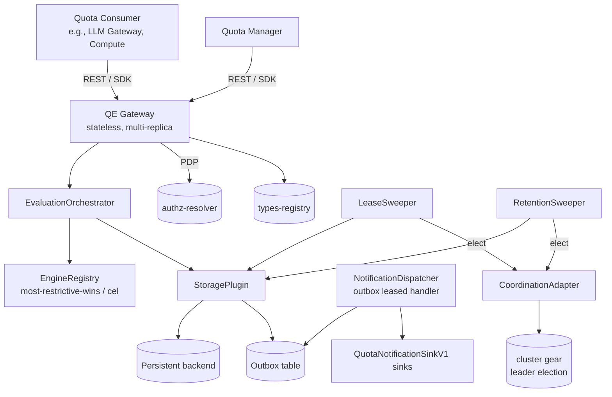

> The diagram preserves the I11 outbox-same-tx invariant: every component that emits a `NotificationOutboxEvent`
> (`EvaluationOrchestrator`, `LeaseSweeper`, `RetentionSweeper`, `QuotaManagementService`, `PolicyService`) writes it
> through `StoragePlugin` into the `notification_outbox` table in the same transaction as its state mutation.
> `NotificationDispatcher` is the **sole** caller of `QuotaNotificationSinkV1` sinks; no other component talks to the
> sinks directly. Refer to §3.2 component model for the full DAG including in-gateway services.

- [ ] `p1` - **ID**: `cpt-cf-quota-enforcement-tech-stack`

| Layer                               | Responsibility                                                                                                                                                                                                                                                                                                                                                                                                                                                                 | Technology                                                                                                                          |
| ----------------------------------- | ------------------------------------------------------------------------------------------------------------------------------------------------------------------------------------------------------------------------------------------------------------------------------------------------------------------------------------------------------------------------------------------------------------------------------------------------------------------------------ | ----------------------------------------------------------------------------------------------------------------------------------- |
| SDK (`quota-enforcement-sdk` crate) | Rust traits for Quota Consumer, Quota Manager, plugin contracts (`QuotaEnforcementStoragePluginV1`, `QuotaResolutionEngineV1`, `QuotaNotificationSinkV1`); domain types (`Quota`, `Lease`, `LeaseHold`, `DebitPlan`, `Decision`); closed error enums.                                                                                                                                                                                                                          | Rust structs + traits; `cargo` workspace member.                                                                                    |
| Gateway (`quota-enforcement` crate) | REST handler layer mounted into the platform `api-gateway` gear via ToolKit `RestApiCapability::register_rest`; QE does not run its own HTTP server. Owns DTO validation; phase-1 PDP integration (`PolicyEnforcer` admission, fail-closed, `AccessScope` pass-through); tenant-isolation filter; delegates to `QuotaManagementService` / `QuotaEnforcementService`.                                                                                                                                          | Axum handlers + ToolKit `OperationBuilder` (typed-operation registration auto-generates the OpenAPI fragment via `utoipa`); tracing. |
| Plugins (separate crates)           | `quota-enforcement-storage-plugin` (transactional persistence via `toolkit-db` per `cpt-cf-quota-enforcement-adr-storage-backend`); `quota-enforcement-engine-most-restrictive`, `quota-enforcement-engine-cel` (built-ins, in-process linkage); `quota-enforcement-notification-plugin` trait (sink implementations operator-supplied). | Rust crates; static linkage at build time per `cpt-cf-quota-enforcement-constraint-in-process-engine-registration`.                 |
| Background tasks                    | `LeaseSweeper` (physical reclamation tier of `cpt-cf-quota-enforcement-fr-lease-timeout`); `RetentionSweeper` (idempotency / operation log retention); `NotificationDispatcher` (drains outbox to registered sinks).                                                                                                                                                                                                                                                           | Same binary as gateway when bundled, or separate binary in split deployments; sweeper singletons via cluster leader election per `cpt-cf-quota-enforcement-adr-coordination-plugin`; the dispatcher is fenced by the `toolkit-db` Outbox lease.    |
| External                            | Persistent backend reached via the storage plugin (P1 backend choice in `cpt-cf-quota-enforcement-adr-storage-backend`); platform `cluster` gear (leader election for the sweeper singletons per `cpt-cf-quota-enforcement-adr-coordination-plugin`); `authz-resolver` (PDP); `types-registry` (metric registration plus owner projection/request/constraint contracts); platform observability stack — `tracing` plus OpenTelemetry export via `toolkit`'s `otel` feature.                                                                                                                                 | Existing platform components.                                                                                                       |

## 2. Principles & Constraints

### 2.1 Design Principles

#### Declarative owner projection contracts

- [ ] `p1` - **ID**: `cpt-cf-quota-enforcement-principle-declarative-projection-contracts`

Every evaluation supplies logical subject attribution. QE maps each `(metric, kind)` to the concrete registered GTS
projection owned by the Gear that owns the metric. That projection is the subject-type half of Quota identity and is
shared by all callers; request metadata and arbitration constraints are validated at their authoring boundaries before
Engine evaluation. Caller-specific projection taxonomies are forbidden because they fragment shared counters. Registry
resolution is confined to bootstrap and Quota/Policy writes.

**ADRs**: `cpt-cf-quota-enforcement-adr-projection-contracts`.

#### PDP-authorized attribution

- [ ] `p1` - **ID**: `cpt-cf-quota-enforcement-principle-pdp-authorized-attribution`

Consumer operations are S2S and supply their target `tenant_id`, subject refs, metric, and optional resource. QE sends
the complete structurally valid tuple to PDP, which authorizes it against the authenticated service principal before
catalogue mapping or evaluation. Public request-shape checks run before PDP; registered/admitted-kind and contract
checks run only after PDP. Management operations (Quota CRUD, Policy admin, manager/operator reads and previews) also accept an
explicit target under PDP scope. End users never call QE directly.

**ADRs**: implicit in PRD §3.4 trust-boundary model; no dedicated ADR.

#### Engine-pluggable arbitration

- [ ] `p1` - **ID**: `cpt-cf-quota-enforcement-principle-engine-pluggable`

Multi-Quota arbitration is not a property of QE-core — it is a `QuotaResolutionEngineV1` plugin. QE-core enforces only
the boundary contract (Debit-Plan invariants per `cpt-cf-quota-enforcement-fr-quota-resolution-engine`); how the Engine
produces the Decision is opaque. This lets workload-specific arbitration (cascade, attribute-gated selection, custom CEL
policies) plug in without core changes and lets future engines (Starlark, Lua, WASM-loaded) land additively.

**ADRs**: `cpt-cf-quota-enforcement-adr-evaluation-engine`.

#### Storage-pluggable backend

- [ ] `p1` - **ID**: `cpt-cf-quota-enforcement-principle-storage-pluggable`

Persistence is mediated by `QuotaEnforcementStoragePluginV1` — a single Rust trait with a closed `StorageError` enum and
fourteen invariants (I1–I14, §3.3). The trait surface is the contractual boundary of QE-core; how the backend achieves
the invariants (locking discipline, indexing strategy, partitioning, isolation level) is plugin-internal. P1 ships a
single storage-plugin implementation (backend choice per `cpt-cf-quota-enforcement-adr-storage-backend`); alternative
backends plug in unchanged.

**ADRs**: `cpt-cf-quota-enforcement-adr-storage-backend`.

#### Lazy expiry

- [ ] `p1` - **ID**: `cpt-cf-quota-enforcement-principle-lazy-expiry`

Lease correctness MUST NOT depend on background-process liveness. Every reader and every writer treats a lease with
`expiry_at <= now()` as released — regardless of physical row presence. Sweeper outage delays reclamation but never
produces zombie holds that block new operations or admit double-counted capacity. This is encoded as I4 on the storage
contract; the gateway never has to defensively check sweeper state.

**ADRs**: implicit in `cpt-cf-quota-enforcement-fr-lease-timeout`; no dedicated ADR.

#### Fail-closed

- [ ] `p1` - **ID**: `cpt-cf-quota-enforcement-principle-fail-closed`

Internal errors, unreachable PDP, unreachable storage, malformed Engine Decisions, and any other condition under which
QE cannot determine an authoritative admission outcome MUST result in operation denial, never silent allowance.
Consuming services choose their own behaviour when QE itself is unavailable (per the contract at PRD §3.4); QE itself
never emits a permissive bypass.

**ADRs**: implicit in PRD §3.4; no dedicated ADR.

#### Strict engine boundary

- [ ] `p1` - **ID**: `cpt-cf-quota-enforcement-principle-strict-engine-boundary`

Decisions returned by Engine plugins are not trusted blindly. The `EvaluationOrchestrator` validates every Decision
against the closed Debit-Plan invariant set
(`{quota_id_outside_applicable_set, negative_amount, amount_exceeds_request_amount, result_plan_inconsistency}`) before
applying any counter mutation; violations surface as the canonical `Internal` error with `reason = "INVARIANT_VIOLATION"`
(per §3.3 mapping table) and are counted in `debit_plan_invariant_violations_total`. This is the trust-boundary that
lets third-party Engines integrate without compromising counter integrity.

**ADRs**: implicit in `cpt-cf-quota-enforcement-fr-quota-resolution-engine`; no dedicated ADR.

### 2.2 Constraints

#### ToolKit framework

- [ ] `p1` - **ID**: `cpt-cf-quota-enforcement-constraint-toolkit`

QE is a ToolKit-conformant gear: it uses `SecureConn` for all DB access, `ClientHub` for cross-gear calls, and the
standard ToolKit lifecycle hooks (`init`, `bootstrap`, `shutdown`). It does not bypass `toolkit-db` for raw connections,
does not invent its own RPC framing, and does not perform cross-gear calls outside `ClientHub`.

**ADRs**: none.

#### SecurityContext propagation

- [ ] `p1` - **ID**: `cpt-cf-quota-enforcement-constraint-security-context`

`SecurityContext` is mandatory on every entry-point operation and propagates through every in-process call (Engine,
Storage, Notification, Sweeper). The sweeper uses a system-level SecurityContext for its background work. The constraint
prevents code paths that "forget" the context and run without identity scope — a precondition for tenant-isolation
integrity.

**ADRs**: none.

#### Type registry delegation

- [ ] `p1` - **ID**: `cpt-cf-quota-enforcement-constraint-types-registry-delegation`

`types-registry` is the authoritative metric and contract catalogue. QE persists no duplicate catalogue; it validates
registry data and builds local snapshots at bootstrap and Quota/Policy writes. The evaluation path does not call the
registry.
Illustrative metric identifiers remain under `gts.cf.qe.metric.type.v1~` pending the cross-gear naming decision; naming
under the metric-owning Gear is a candidate, not a decision in this design.

> **Notation.** Scope names (`tenant`, `user`) and metric names are shortened in prose. API requests and storage use full
> GTS type ids, including the trailing `~` for projections.

**ADRs**: none.

#### Single storage plugin per deployment

- [ ] `p1` - **ID**: `cpt-cf-quota-enforcement-constraint-single-storage-plugin`

Exactly one storage plugin is active at any time per deployment. Switching backends is an operator action that involves
data migration; the gateway does not federate over multiple backends, does not shard across plugins, and does not
present a multi-backend facade. P1 ships a single storage plugin (backend per
`cpt-cf-quota-enforcement-adr-storage-backend`); alternative backends are P2+ items that follow the same
one-active-at-a-time discipline.

**ADRs**: `cpt-cf-quota-enforcement-adr-storage-backend`.

#### Bounded label cardinality

- [ ] `p1` - **ID**: `cpt-cf-quota-enforcement-constraint-bounded-cardinality`

Telemetry labels are restricted to deployment-bounded values — canonical registered `metric` only on instruments that
declare it in PRD §5.16, `engine_id` from the registered Engine set, `operation` from
`{debit, credit, rollback, reserve, commit, release, batch_debit, preview}`, `transition_kind`, `surface`, `invariant`,
closed `reason` enums, `sink_id`, `event_kind`, and `queue`. High/unbounded-cardinality identifiers (`tenant_id`,
`subject_id`, `quota_id`, `policy_id`, `idempotency_key`, `lease_token`), projection type, caller attribution, and
raw/unregistered metric input MUST NOT appear as labels. A `metric` label is populated only after registry/catalogue
validation and uses the canonical registered identity. This prevents per-tenant time-series explosion at 100 M-subject
scale per `cpt-cf-quota-enforcement-nfr-subject-scale` while retaining bounded per-metric operational visibility.

**ADRs**: none.

#### In-process Engine registration

- [ ] `p1` - **ID**: `cpt-cf-quota-enforcement-constraint-in-process-engine-registration`

Engine plugins are registered statically in-process at gearootstrap. P1 ships `most-restrictive-wins` and `cel`;
additional engines link into the binary at build time. Runtime registration of new Engines (dynamic loading, RPC
engines) is out of P1 scope per PRD §5.9. Configuration of an Engine is done via the Quota Resolution Policy
(`engine_config` field) — the registration set is fixed at deploy time.

**ADRs**: none.

#### No business logic in gateway

- [ ] `p1` - **ID**: `cpt-cf-quota-enforcement-constraint-no-business-logic`

The gateway does no pricing, no billing, no plan-template materialisation, no SLA negotiation. Business logic that
translates licensing or commercial intent into Quota records lives in Quota Manager (a separate platform component). QE
itself only mutates counters according to declarative Quota records and pluggable arbitration policies.

**ADRs**: none.

## 3. Technical Architecture

### 3.1 Domain Model

**Technology**: Native Rust structs in `quota-enforcement-sdk` crate (per `cpt-cf-quota-enforcement-constraint-toolkit`).
Plugins are registered in-process at gear bootstrap via ClientHub. Domain data shape is Rust-native.

**Planned location**: `quota-enforcement-sdk/src/` (the crate has not been scaffolded yet).

**Core Entities**:

| Entity                         | Description                                                                                                                                                                                                                                                                                                                                                                                                                                                                                                                                                    | Persistence                                                          |
| ------------------------------ | -------------------------------------------------------------------------------------------------------------------------------------------------------------------------------------------------------------------------------------------------------------------------------------------------------------------------------------------------------------------------------------------------------------------------------------------------------------------------------------------------------------------------------------------------------------- | -------------------------------------------------------------------- |
| `Quota`                        | Declarative cap assigned to a single subject for a single metric. Carries `quota_id` (server-assigned **UUIDv7** per `cpt-cf-quota-enforcement-adr-acquisition-ordering`), `tenant_id`, subject reference, metric, type, period spec (consumption only), enforcement mode, cap (`0..=i64::MAX`, or `null` for unbounded), notification thresholds, validity window, source, status, metadata, accepted constraint contract type/version (snapshotted at creation and moved with every accepted metadata update), and record version. First-class stored entity — no separate template/binding concept.                                                                                              | `quotas` table                                                       |
| `Counter` (allocation)         | Per-Quota in-flight counter for allocation Quotas. Mutated on debit / lease acquire (increment) and credit / lease commit/release (decrement).                                                                                                                                                                                                                                                                                                                                                                                                                 | `quota_allocation_counters` table                                    |
| `Counter` (consumption)        | Per-(Quota, period) consumed counter. New row materialised lazily on first evaluate in a new period (single I3 exception). Carries `highest_crossed_threshold_pct`.                                                                                                                                                                                                                                                                                                                                                                                            | `quota_consumption_counters` table                                   |
| `Lease`                        | Two-phase capacity hold (PRD `cpt-cf-quota-enforcement-fr-lease-acquire`). Carries token (UUID), tenant, acquisition `IdempotencySubjectKey`, idempotency key, acquisition timestamp, expiry timestamp, state, and `acquisition_period_id`. State machine: `Active` → `Committed` / `Released` / `AutoReleased` / `ResolvedByDeactivation` (closed enum, terminal states). | `leases` table |
| `LeaseHold`                    | Per-Quota hold record attached to a lease. One row per Quota in the lease's Debit Plan. Carries `lease_id`, `quota_id`, `held_amount`, `period_id` (consumption Quotas). Separate rows enable atomic multi-Quota acquisition without nested-array semantics.                                                                                                                                                                                                                                                                                                   | `lease_holds` table                                                  |
| `LeaseCapacityCounter`         | Per-`(tenant, metric)` count of currently active leases. Mutated atomically with lease state transitions. Enforces the per-`(tenant, metric)` active-lease cap (PRD `cpt-cf-quota-enforcement-fr-lease-timeout`, default 1000).                                                                                                                                                                                                                                                                                                                                | `lease_capacity_counters` table                                      |
| `QuotaResolutionPolicy`        | Operator-managed binding of an Engine + config to a scope (P1: `global` or per-metric). Stable identifier; `latest_version` pointer updated atomically with new version row insert.                                                                                                                                                                                                                                                                                                                                                                            | `quota_resolution_policy` table                                      |
| `QuotaResolutionPolicyVersion` | Immutable per-version record. Carries `policy_id`, `policy_version`, `engine_id`, `engine_config` (JSON), `timeout_ms`, `version_state` (`active` / `superseded` / `rolled_back` (terminal) / `deleted` (terminal — set on the previously-active version when the entire `policy_id` is soft-deleted via `delete_policy` per PRD §5.9)), `comment` (optional operator note), audit fields.                                                                                                                                                                     | `quota_resolution_policy_version` table                              |
| `IdempotencyRecord`            | Replay-safety record keyed by typed `IdempotencyScope { tenant_id, subject_key, operation_type, idem_key }`. `subject_key: IdempotencySubjectKey` is the fixed-width fingerprint of the canonical complete applicable-subject set for evaluation operations, the persisted acquisition key for lease follow-ups, or the owning Quota's persisted subject pair for a credit. A rollback recomputes the reversed debit's key from the same authorized attribution, so its scope coincides with the original's however many Quotas that debit's plan spanned. Carries canonical `payload_hash`, schema-versioned `decision_blob`, and `expires_at`. | `idempotency_records` table |
| `OperationLog`                 | Operation ledger of every successful mutating operation (P1 scope; audit-grade attribution awaits platform audit infra per PRD §4.2 / §6.2, see §4.3). Carries operation kind, actor SecurityContext, target Quota IDs, request fingerprint, Decision outcome, timestamp. Partitioned by date for retention and cold-tier migration.                                                                                                                                                                                                                           | `operation_log` table                                                |
| `NotificationOutboxEvent`      | Same-tx event row enqueued by mutating storage primitives. Carries `event_id`, `event_kind`, `tenant_id`, target reference, payload, emission timestamp. Drained by `NotificationDispatcher` and dispatched at-least-once.                                                                                                                                                                                                                                                                                                                                     | `notification_outbox` table (toolkit-db Outbox queue)                 |
| `SubjectScope`                 | QE-owned GTS discriminator type `gts.cf.core.qe.scope.v1~`. P1 registers `gts.cf.core.qe.scope.v1~cf.core.qe.user.v1` and `gts.cf.core.qe.scope.v1~cf.core.qe.tenant.v1` as its well-known instances.                                                                                                                                                                                                                                                                                                                                        | `types-registry`; no QE-side DB table. |
| `SubjectProjectionContract`    | Registered concrete GTS type derived from abstract `gts.cf.core.qe.subj.v1~`; identity is a `GtsTypeId` with trailing `~`. Declares admitted metrics and its subject scope as a required `scope: GtsInstanceId` trait narrowed to `gts.cf.core.qe.scope.v1~*`, never a name segment. It is the type half of Quota subject identity. QE maps `(metric, scope)` through the validated catalogue; no resolver exists.                                                                                                             | `types-registry`; no QE-side DB table. |
| `ResourceProjectionContract`   | Registered concrete GTS type derived from abstract `gts.cf.core.qe.res.v1~`; carries optional resource identity plus schematized request properties. It does not enter the P1 counter key.                                                                                                                                                                                                                                                                                                                                                                                        | `types-registry`; no QE-side DB table. |
| `MetricRequestContract`        | Owner-published concrete GTS contract derived from `gts.cf.core.qe.request.v1~`; required traits identify one metric and attach one concrete constraint contract. Refines the operation-level metadata schema once for all callers and subject scopes.                                                                                                                                                                                                                                                                                                                         | `types-registry`; immutable catalogue snapshot, no QE-side DB table. |
| `ConstraintContract`           | Owner-published GTS contract derived from `gts.cf.core.qe.constraint.v1~`, attached to the metric request contract; validates operator-authored `Quota.metadata` on create/update and may intentionally differ from request shape.                                                                                                                                                                                                                                                                                                                                              | `types-registry`; schema/version snapshot referenced by Quota/Policy state, no QE catalogue table. |

**In-memory entities** (passed across in-process calls; never persisted as the source of truth):

| Entity              | Description                                                                                                                                                                                                                                                                  |
| ------------------- | ---------------------------------------------------------------------------------------------------------------------------------------------------------------------------------------------------------------------------------------------------------------------------- |
| `EvaluationContext` | Engine input: PDP-authorized subjects mapped to owner projections, optional resource projection, applicable Quota snapshots, current usage, validated operation metadata, metric/amount, snapshotted active Policy contracts, time, and the effective `EvaluationBudget`. CEL receives only `{request, resource, arbitration}`; attribution and principal data are excluded. Materialised at the locked-read step (`cpt-cf-quota-enforcement-adr-metadata-snapshot-timing`). |
| `EvaluationBudget` | Validated Engine budget carrying the per-Policy wall-time limit (default 5 ms) and any bounded engine-specific cost limit. Constructed at Policy selection; the Engine enforces it internally and reports `Timeout` or `CostExceeded`. |
| `IdempotencySubjectKey` | Validated fixed-width fingerprint over the canonical subject set: sort and deduplicate `(projection_type, subject_id)` pairs, encode them canonically, then hash them with SHA-256. Batch envelopes use the union of all item sets; lease commit/release reuse the acquisition key; rollback recomputes the reversed debit's key from its attribution. |
| `ProjectionContractCatalog` | Immutable process-local snapshot of every configured concrete subject/resource projection, admitted-metric relation, and per-metric request/constraint pair. Holds authoritative `(metric, scope) -> projection` and `metric -> request contract` indexes. Built once at bootstrap and immutable for the process lifetime; breaking-version activation is not supported in P1. Used by Gateway validation and projection selection without a registry call. |
| `Decision`          | Engine output: closed `result` enum (`Allowed` / `Denied { violated_quota_ids, reason }`), `debit_plan: HashMap<QuotaId, QuotaDebitPlan>`, `diagnostics: HashMap<String, JsonValue>`. Engine failures do not produce a Decision — they surface as `CanonicalError` per §3.3. |
| `QuotaDebitPlan`    | Per-Quota mutation directive in a `Decision`: `amount` (≥ 0). Extension-ready (P3 may add `clamped` marker). Validated against the closed Debit-Plan invariant set at the QE-core boundary.                                                                                  |
| `BatchItem`         | One element of an envelope batch (`apply_batch_debit`): `(SecurityContext, request_payload, optional_per_item_idem_key)`.                                                                                                                                                    |
| `MutationResult`    | Storage primitive return: post-mutation snapshot for caller telemetry, including new counter values, threshold crossings, and emitted event IDs.                                                                                                                             |

**Relationships**:

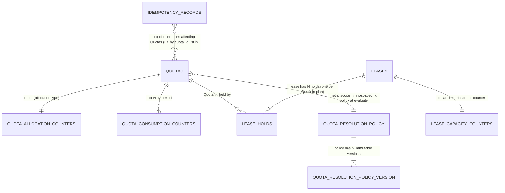

**Type-stability invariants** (`cpt-cf-quota-enforcement-constraint-toolkit`):

- All enums (`QuotaType`, `EnforcementMode`, `QuotaSource`, `LeaseState`, `DecisionResult`, `NotificationEventKind`,
`PolicyVersionState`) are closed at SDK boundary.
- Input deserialization uses `serde(deny_unknown_fields)`; output deserialization tolerates forward-compat additions for
  SDK consumers.
- `IdempotencyRecord.decision_blob` is JSON-typed and schema-versioned (top-level `__version`); additive shape changes
  do not require migration.
- `EvaluationContext` and `Decision` shapes are stable across Engines (the core boundary).

### 3.2 Component Model

QE is decomposed into a Gateway, an in-process Orchestrator and Manager set, three plugin families (Storage, Engine,
Notification), a coordination adapter over the platform `cluster` gear, background tasks (sweeper, dispatcher), and
adapters to platform infrastructure.
Every component carries a stable `cpt-cf-quota-enforcement-component-{slug}` ID for traceability.

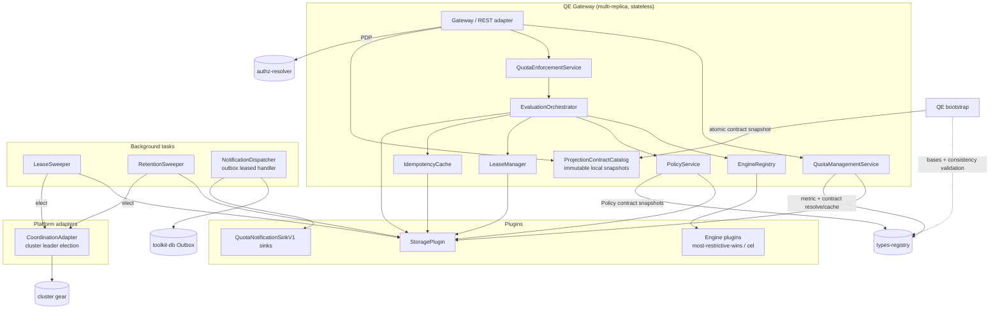

#### Gateway

- [ ] `p1` - **ID**: `cpt-cf-quota-enforcement-component-gateway`

##### Why this component exists

REST handler layer of the `quota-enforcement` crate; mounted into the platform `api-gateway` gear via ToolKit. QE does
not run its own HTTP server — the platform `api-gateway` gear owns the Axum router and the aggregated OpenAPI
document. This is the only QE-side entry point for every external caller (Quota Consumer, Quota Manager, Quota Reader,
Monitoring System); SDK clients flow through the same operation surface for end-to-end uniformity. Any authorized
caller uses the metric owner's projection and calls QE directly; the owner does not proxy those operations.

##### Responsibility scope

REST handlers (Axum), request DTO validation, and fail-closed attribution/resource validation at ingress of every
subject-based consumer evaluation operation (including batch items), before Engine dispatch. Gateway first deserializes
the DTO and rejects malformed public request shape: missing required fields, wrong public container types, empty ids,
duplicate kinds, or repeated tenant scope. It then
sends the complete structurally valid untrusted attribution tuple to PDP. After authorization, it validates the required
operation-level `metadata` object against the owner request contract, requires an admitted metric, maps each
`(metric, kind)` pair through `ProjectionContractCatalog`, and validates an optional resource against its contract. Callers never select
projection types. Contract checks use the process-local
catalogue; Gateway never
calls `types-registry` from a request path. P1 builds the catalogue at bootstrap and does not refresh it at runtime.
Also owns typed-operation registration into the platform `api-gateway`
(auto-generates the OpenAPI fragment via `utoipa`), tenant-isolation filter (defense-in-depth), correlation of trace
context. Phase-1 PDP integration (admission decision before transaction): calls
`authz-resolver-sdk::PolicyEnforcer` (obtained from ClientHub) per operation and fails closed on PDP unavailability.
QE keeps no PDP decision cache of its own — a safe decision cache needs tenant context and token scopes in its key and
token-expiry-bounded TTLs, which are the platform PEP's concern, not QE's. The returned `AccessScope` is carried
unmodified for `SecureConn` consumption inside the evaluation transaction. The in-process SDK client enters at the same
admission step, so REST and in-process transports share one authorization boundary. Stateless across replicas.

##### Responsibility boundaries

Does not interpret projection property meaning (`cpt-cf-quota-enforcement-constraint-no-business-logic`). Does not call Engine or
Storage directly — delegates to `QuotaManagementService` / `QuotaEnforcementService`, passing the `PolicyEnforcer`-
returned `AccessScope` for in-transaction consumption (phase-2 propagation is owned by `EvaluationOrchestrator`).
Does not own any persistent state. Does not implement the PDP itself — the actual policy decision lives in the external
`authz-resolver` gear.

##### Related components (by ID)

- `cpt-cf-quota-enforcement-component-quota-management-service` — delegates Quota CRUD.
- `cpt-cf-quota-enforcement-component-quota-enforcement-service` — delegates evaluations.
- `cpt-cf-quota-enforcement-component-evaluation-orchestrator` — receives the `AccessScope` for in-transaction
  `SecureConn` consumption (defense-in-depth, `cpt-cf-quota-enforcement-nfr-tenant-isolation-integrity`).

#### QuotaManagementService

- [ ] `p1` - **ID**: `cpt-cf-quota-enforcement-component-quota-management-service`

##### Why this component exists

Owns Quota CRUD lifecycle (`cpt-cf-quota-enforcement-fr-quota-lifecycle`): create, update, deactivate, read. Coordinates
the deactivation cascade (mark Quota deactivated AND resolve active leases atomically). Used by Quota Manager and
platform operators.

##### Responsibility scope

Validation (cap non-negative and within `0..=i64::MAX`, thresholds-require-bounded-cap, the period rule: consumption
Quotas require an explicit valid period, `one_time` included, `PERIOD_REQUIRED` otherwise; allocation Quotas reject
any period field, `null` included, `PERIOD_NOT_ALLOWED`); metric existence check via `TypesRegistryClient` (platform
`types-registry-sdk`, obtained from ClientHub) — runs **outside** the storage transaction; bounded, TTL-refreshed
in-process cache of metric classifications parsed into closed enums (kind `Counter`/`Gauge`, enforcement mode
`QuotaGated`/`Direct`); a registered metric without a usable classification is `METRIC_CLASSIFICATION_INVALID`, never
a default. Every classification carries an explicit freshness: `Fresh` within the TTL, `Stale` when the registry did
not answer and the entry is younger than TTL plus a bounded grace; a stale answer serves writes only and never renews a
gauge sample; beyond the grace the caller fails closed (`types-registry` unavailability) and «flag-but-don't-
auto-deactivate» applies on later metric removal — both per `cpt-cf-quota-enforcement-fr-metric-identity-validation`.
Transactional `create_quota` / `update_quota` / `deactivate_quota` / `read_quotas` calls on Storage plugin; event
emission for `quota-changed`. Updates preserve `metric`, `quota_type`, `period`, and `subject`: a patch that names any
of them, with an explicit `null` included, is rejected (`IMMUTABLE_FIELD`) after the `rate` check
(`Unimplemented`, checked first even alongside other immutable fields); an empty patch is `PATCH_EMPTY`.

**Provisional metric classification contract.** The metric base `gts.cf.qe.metric.type.v1~` is a platform namespace
(PRD §3.2, §13). Until the platform publishes its schema, QE reads two fields of the metric instance document:
`kind ∈ {counter, gauge}` and `enforcement ∈ {quota_gated, direct}`. This is QE's proposal, not the published
contract: schema publication, validation against the real registry, and the classification-dependent Definitions of
Done stay open until the platform contract exists, and a deployment whose metric instances lack the fields fails closed
on Quota creation with `METRIC_CLASSIFICATION_INVALID`.

The same `TypesRegistryClient` and bounded LRU resolve the metric owner's subject projection and separate Quota-
attribute contract. `quota.metadata` is validated at create/update before persistence, outside the storage transaction.
Validation wraps the object into the contract envelope `{type, metadata}` and checks the whole document. At evaluation
ingress, the Gateway applies the same complete-contract rule by wrapping operation metadata and validating the
already-complete `{type, id?, metadata}` resource projection directly.
The accepted contract id/version is snapshotted with the metadata it validated, at creation and again on every accepted metadata update (the patch carries the reference, storage writes both in one row update, so a catalogue that moved between processes moves the stored reference too); stored metadata is not revalidated during evaluation. Creation checks
both the registry contract and membership in the configured `ProjectionContractCatalog`; P1 rejects replacement
projections outside that catalogue.

##### Responsibility boundaries

Does not evaluate quota usage (that is `QuotaEnforcementService`'s role). Does not perform authorization — the PDP
admission call is owned by `Gateway` (phase-1, before tx) and the in-transaction constraint application is propagated
through `EvaluationOrchestrator` into the storage plugin (phase-2). Does not own metric definitions — the
`types-registry` is authoritative; QE only consumes identity and the registry-reported classifications.

##### Related components (by ID)

- `cpt-cf-quota-enforcement-component-storage-plugin` — calls CRUD primitives.
- `cpt-cf-quota-enforcement-actor-types-registry` (external) — consulted via `TypesRegistryClient` for metric-name
  validation.

#### QuotaEnforcementService

- [ ] `p1` - **ID**: `cpt-cf-quota-enforcement-component-quota-enforcement-service`

##### Why this component exists

Public S2S surface for nine consumer operations: `debit`, `credit`, `rollback`, `reserve`, `commit`, `release`,
`batch_debit`, `evaluate_preview`, and `snapshot`.

##### Responsibility scope

Per-operation entry point; accepts the explicit PDP-authorized target; delegates evaluations to
`EvaluationOrchestrator` and snapshots to the storage read path; returns the corresponding typed DTO.

##### Responsibility boundaries

Does not contain orchestration logic (delegated to `EvaluationOrchestrator`). Does not own storage or engine state.

##### Related components (by ID)

- `cpt-cf-quota-enforcement-component-evaluation-orchestrator` — delegates pipeline.
- `cpt-cf-quota-enforcement-component-lease-manager` — delegates lease 3-phase ops.

#### EvaluationOrchestrator

- [ ] `p1` - **ID**: `cpt-cf-quota-enforcement-component-evaluation-orchestrator`

##### Why this component exists

Implements the canonical evaluation pipeline: subject resolution → idempotency lookup → applicable-Quotas locked read →
Policy lookup → Engine evaluate → Debit-Plan invariant check → mutation → idempotency persist → outbox enqueue → COMMIT.
Encapsulates the strict-engine-boundary (`cpt-cf-quota-enforcement-principle-strict-engine-boundary`) — every Decision
is validated against the closed Debit-Plan invariant set before mutation.

##### Responsibility scope

Pipeline ordering, transaction lifecycle, EvaluationContext materialisation timing
(`cpt-cf-quota-enforcement-adr-metadata-snapshot-timing`), invariant enforcement, telemetry emission for invariant
violations. It receives the already-authorized and catalogue-mapped subject set from Gateway and uses the complete set
for applicable-Quota lookup; it performs no identity derivation or live registry lookup.
Phase-2 PDP integration: receives the `AccessScope` from `Gateway` (as returned by `PolicyEnforcer`) and forwards it
unmodified into Storage-plugin reads/writes, where `SecureConn` compiles it into query filters
(`cpt-cf-quota-enforcement-nfr-tenant-isolation-integrity` defense-in-depth). EO does not call the PDP itself and does
not interpret scope semantics — compilation is `SecureConn`'s responsibility.

##### Responsibility boundaries

Does not own arbitration logic (delegated to Engines). Does not own counter mutation mechanics (delegated to Storage
plugin). Does not pre-eval on idempotency replay — replay returns the stored `decision_blob` verbatim (satisfies the
idempotency-replay rule of `cpt-cf-quota-enforcement-fr-idempotency` by never re-invoking the Engine on replay).
It has no `TypesRegistryClient`, performs no schema resolution, and does not revalidate stored Quota metadata. Registry
latency or availability therefore cannot enter the evaluation transaction.

Synchronization between concurrent EO instances (every gateway replica runs an EO) is delegated entirely to the storage
plugin's serialization of concurrent row mutations — the deterministic acquisition ordering of
`cpt-cf-quota-enforcement-adr-acquisition-ordering` plus the storage-capability list in §3.5. EO instances are not
singletons and join no cluster election; only the sweeper singletons do (the notification dispatcher is fenced by the
`toolkit-db` Outbox lease).

##### Related components (by ID)

- `cpt-cf-quota-enforcement-component-engine-registry`, `-policy-service`, `-storage-plugin`, `-idempotency-cache`,
  `-notification-dispatcher`.

#### PolicyService

- [ ] `p1` - **ID**: `cpt-cf-quota-enforcement-component-policy-service`

##### Why this component exists

Owns the Quota Resolution Policy lifecycle (`cpt-cf-quota-enforcement-fr-quota-resolution-policy`,
`cpt-cf-quota-enforcement-fr-quota-resolution-policy-versioning`): create, update (creates new immutable version),
rollback to a prior version, soft-delete (narrow-scope only), read latest, list versions. Resolves the most-specific
Policy at evaluation time (`global` ← per-metric).

##### Responsibility scope

CRUD on `quota_resolution_policy` and `quota_resolution_policy_version` tables via Storage plugin; the latest-version
pointer is read authoritatively from storage on every evaluation (`read_policy` inside the evaluation transaction,
§3.6), so every replica always evaluates the active version; only immutable version-keyed `ValidatedConfig`
artifacts are cached; contract resolution/snapshotting via `TypesRegistryClient`; `engine_config` validation
delegated to the named Engine's `validate_config` with request/constraint schemas. The `cel` validator statically checks
property references plus pair compatibility for `{request, resource, arbitration}`, returning line/column diagnostics.
In P1 it also rejects a
Policy create/update that references a projection outside the active `ProjectionContractCatalog` with
`ProjectionNotResolvable`.

##### Responsibility boundaries

Does not execute Engine evaluation. Does not own `engine_config` interpretation — only forwards to Engine.

##### Related components (by ID)

- `cpt-cf-quota-enforcement-component-engine-registry` — calls `validate_config`.
- `cpt-cf-quota-enforcement-component-storage-plugin` — Policy persistence.

#### EngineRegistry

- [ ] `p1` - **ID**: `cpt-cf-quota-enforcement-component-engine-registry`

##### Why this component exists

Static, in-process registry of `QuotaResolutionEngineV1` plugin implementations. P1 ships two built-ins:
`most-restrictive-wins` (hardcoded; the fastest path) and `cel` (sandboxed CEL evaluator with sandbox + cost-cap
support). Realises `cpt-cf-quota-enforcement-constraint-in-process-engine-registration`.

##### Responsibility scope

Compile-time linkage of built-in Engines; bootstrap-time fail-fast registration (`engine_bootstrap_failures_total`
increments on failure); ID → Engine resolution at evaluation time.

##### Responsibility boundaries

No runtime registration of new Engines (PRD §5.9). No Engine deprecation lifecycle in P1 (deferred to P2; revisit when
additional Engine plugins — Wasm / Starlark / Lua — land in the deployment binary). Does not interpret Engine
configurations.

##### Related components (by ID)

- `cpt-cf-quota-enforcement-component-evaluation-orchestrator` — Engine consumer.
- `cpt-cf-quota-enforcement-component-policy-service` — `validate_config` consumer.

#### LeaseManager

- [ ] `p1` - **ID**: `cpt-cf-quota-enforcement-component-lease-manager`

##### Why this component exists

Implements the lease 3-phase protocol (`cpt-cf-quota-enforcement-fr-lease-acquire`,
`cpt-cf-quota-enforcement-fr-lease-commit`, `cpt-cf-quota-enforcement-fr-lease-release`) and enforces the lazy-expiry
semantic (`cpt-cf-quota-enforcement-principle-lazy-expiry`) on every read/write path. Encapsulates the
per-`(tenant, metric)` active-lease cap check (`lease_capacity_counters`) and the period-attribution invariant
(commit/release attribute to acquisition period, not wall- clock period).

##### Responsibility scope

Lease state machine (`Active` → terminal); cap enforcement; period attribution; storage- plugin invocation for
`acquire_lease` / `commit_lease` / `release_lease`.

##### Responsibility boundaries

Does not own physical reclamation of expired lease rows — that is the `LeaseSweeper`'s responsibility, and lease
correctness MUST NOT depend on sweeper liveness (I4 invariant). Does not enforce contention timeout itself — that is a
plugin-internal concern (I8 specifies the contract; the realisation is plugin-internal).

##### Related components (by ID)

- `cpt-cf-quota-enforcement-component-storage-plugin`, `cpt-cf-quota-enforcement-component-lease-sweeper`.

#### IdempotencyCache

- [ ] `p1` - **ID**: `cpt-cf-quota-enforcement-component-idempotency-cache`

##### Why this component exists

Pre-evaluation lookup point (`cpt-cf-quota-enforcement-fr-idempotency`). On replay, returns the stored `decision_blob`
verbatim — never re-invokes Engine. Persistence is implicit-in-storage-primitives (every mutating storage call upserts
the idempotency record same-tx with the mutation, I1+I2 invariants).

##### Responsibility scope

`lookup_idempotency` call lifecycle, payload-hash comparison (canonical SHA-256 of sorted JSON, canonical SHA-256 hash),
`IdempotencyPayloadMismatch` mapping for hash divergence, in-process LRU cache of recent records (TTL operator-tunable;
P1 reference default: 5 s) for the most contended idempotency keys.

##### Responsibility boundaries

Does not own retention policy execution (`RetentionSweeper` reclaims expired records). Does not persist new records
directly — that is owned by Storage plugin's mutating primitives.

##### Related components (by ID)

- `cpt-cf-quota-enforcement-component-storage-plugin`.

#### NotificationDispatcher

- [ ] `p1` - **ID**: `cpt-cf-quota-enforcement-component-notification-dispatcher`

##### Why this component exists

Drains the `notification_outbox` (toolkit-db Outbox queue) and fans events out to all registered
`QuotaNotificationSinkV1` plugins (`cpt-cf-quota-enforcement-fr-notification-plugin`). Realises the same-tx outbox
invariant (I11): events enqueued atomically with their producing mutation are guaranteed at-least-once delivery
regardless of dispatcher liveness.

##### Responsibility scope

Implemented as a `toolkit-db` Outbox **leased handler** registered on the QE notification queue: the outbox framework
owns claiming (DB lease per batch), redelivery after lease expiry (at-least-once), cancellation fencing (the handler
future is dropped at `lease_duration − ack_headroom`, so an expired holder cannot keep dispatching while a new one
runs), and the message dead-letter store (`dead_letter_*` APIs). The handler runs under the dispatcher's system-level
`SecurityContext` and fans each event out to all registered sinks via `tokio::join_all` with a per-sink per-call
timeout (2 s reference default) and per-sink failure isolation. On `Timeout`/`Transient` outcomes below the
operator-configured `OutboxMessage.attempts` maximum the handler returns `Retry` — the framework re-delivers the event
to **all** sinks later, so sinks MUST tolerate duplicate delivery. Any `Permanent` outcome, or reaching the attempts
maximum, returns `Reject(reason)`, which dead-letters the event (ToolKit retries indefinitely on its own; the attempts
guard is QE's explicit give-up per the `OutboxMessage.attempts` contract). Ack only when every sink succeeded; with
zero registered sinks the handler acks unprocessed per the PRD §11 drop assumption. Telemetry:
`notification_dispatch_failures_total`, `outbox_pending_rows` (requires a `toolkit-db` pending-count API — tracked
upstream prerequisite), `outbox_rejections_total` (handler-incremented on the `Reject` path; the
`dead_letter_count` API returns a current row count and cannot back a monotonic counter).

##### Responsibility boundaries

Does not enqueue events itself — events are enqueued by the Storage plugin's mutating primitives same-tx with the
mutation. Does not join a cluster election; outbox lease fencing replaces the singleton election for this
component. Does not implement EventBus routing (deferred to P2 per PRD §13 EventBus OQ).

##### Related components (by ID)

- `cpt-cf-quota-enforcement-component-storage-plugin`.

#### LeaseSweeper

- [ ] `p1` - **ID**: `cpt-cf-quota-enforcement-component-lease-sweeper`

##### Why this component exists

Physical reclamation tier of `cpt-cf-quota-enforcement-fr-lease-timeout`. Periodic background task
(operator-configurable interval, default 60 s) that picks up expired-by-TTL leases, transitions them to `AutoReleased`
state in the same tx, decrements the active-lease capacity counter, and enqueues the `lease-auto-released` event via
outbox. Optionally deletes lease rows after a grace period.

##### Responsibility scope

Single-leader execution under the `lease-sweeper` election (`SingletonScope::LeaseSweeper`) through the
`CoordinationAdapter`: the sweep loop starts when this replica is elected and receives a child cancellation token, the
resolved cluster backend renews the claim, and the loop stops when leadership is lost; re-election is automatic. Batch
size
operator-configurable (P1 reference default: 1000 expired leases per cycle). Surface `lease_unreclaimed_expired` gauge
by canonical registered `metric`.

##### Responsibility boundaries

Sweeper outage MUST NOT break correctness — lazy semantic release (I4) holds unconditionally. Does not own retention of
operation log or idempotency records (that is `RetentionSweeper`'s responsibility).

##### Related components (by ID)

- `cpt-cf-quota-enforcement-component-storage-plugin`.
- `cpt-cf-quota-enforcement-component-coordination-plugin`.

#### RetentionSweeper

- [ ] `p1` - **ID**: `cpt-cf-quota-enforcement-component-retention-sweeper`

##### Why this component exists

Reclaims expired `idempotency_records` (default 24 h, configurable per-`(tenant, metric)` in
`idempotency_retention_config` table) and `operation_log` rows (default 30 days, per PRD §6.2). Counter-partition
retention is handled by storage-plugin partition reclamation operations on consumption-counter tables — a separate
concern of the Storage plugin's reclamation primitives.

##### Responsibility scope

Single-leader execution under the `retention-sweeper` election (`SingletonScope::RetentionSweeper`) through the
`CoordinationAdapter`, with the same run-while-leader semantics as `LeaseSweeper`.
`reclaim_expired_idempotency` and `reclaim_operation_log` invocations on the Storage plugin; batch-size and frequency
configuration.

##### Responsibility boundaries

Does not reclaim leases (that is `LeaseSweeper`). Does not impose retention policy at the business level — only enforces
operator-configured expiry.

##### Related components (by ID)

- `cpt-cf-quota-enforcement-component-storage-plugin`.
- `cpt-cf-quota-enforcement-component-coordination-plugin`.

#### StoragePlugin

- [ ] `p1` - **ID**: `cpt-cf-quota-enforcement-component-storage-plugin`

##### Why this component exists

Pluggable persistence layer (`cpt-cf-quota-enforcement-fr-pluggable-storage`). Defines the
`QuotaEnforcementStoragePluginV1` Rust trait with closed `StorageError` enum and fourteen invariants (I1–I14). Realises
`cpt-cf-quota-enforcement-principle-storage-pluggable`.

##### Responsibility scope

Quota CRUD; multi-Quota counter mutation atomicity (apply_debit_plan, apply_batch_debit, apply_credit, apply_rollback);
lease 3-phase primitives; snapshot reads with lazy period-row materialisation (single I3 exception); Policy versioning;
idempotency lookup; sweeper hooks (lease, idempotency, op log); outbox dispatch (pull / mark delivered / mark failed);
bootstrap; health. Same-tx outbox (I11) lives **inside** this contract — events enqueued atomically with their producing
mutation.

##### Responsibility boundaries

Locking discipline, indexing strategy, isolation level, partitioning, lock-timeout mechanics, and concrete table layouts
are **plugin-internal**. The trait surface here is the contractual boundary of QE-core. Leader election for the
sweeper singletons is **out of scope**; it lives in `cpt-cf-quota-enforcement-component-coordination-plugin`, which
consumes the platform `cluster` gear.

##### Related components (by ID)

- Every Service / Manager / Sweeper component above is a consumer.
- Actor: `cpt-cf-quota-enforcement-actor-storage-backend` (the persistent backend the plugin mediates; the trait IS the
  QE-side façade for this actor).

#### CoordinationAdapter

- [ ] `p1` - **ID**: `cpt-cf-quota-enforcement-component-coordination-plugin`

##### Why this component exists

Singleton coordination for the sweepers comes from the platform `cluster` gear's leader election per
`cpt-cf-quota-enforcement-adr-coordination-plugin`. This component is the QE-side adapter: it resolves the cluster
leader-election facade for the `quota-enforcement` profile, requires a linearizable election, scopes every name under
the `qe` prefix, and implements the domain port `SingletonCoordinator` that the sweepers consume. The port exists for
the domain-layer dependency rule; it is not a plugin extension point, and QE ships no coordination plugin of its own.

##### Responsibility scope

Maps the closed `SingletonScope` enum (`LeaseSweeper`, `RetentionSweeper`, `LifecycleGauges`) to the election names
`lease-sweeper`, `retention-sweeper`, and `lifecycle-gauges`. Runs a unit of work while this replica leads a scope: the work starts on election with a child
cancellation token, the resolved cluster backend renews the claim on its own cadence, the token is cancelled on
leadership loss,
the work is aborted after the configured stop timeout, and the work restarts on re-election. The adapter drives the
election watch itself, with the same reactive pattern the SDK's `run_while_leader` implements, and keeps ownership of
the watch: the SDK combinator consumes the watch, and a dropped watch performs no resign I/O. A `Lagged` or `Reset`
watch event is a gap in the observed transitions: the adapter cancels the work, then restarts it only when the
backend's lossless status snapshot still reads leader, so a missed loss can never leave a second sweeper running. On
graceful shutdown the adapter cancels the work and then resigns every held election so a successor is elected without
waiting for the TTL.
Exposes the election TTL and the missed-renewal budget as operator configuration with the cluster defaults.

##### Responsibility boundaries

Does not own counter / lease / outbox state (storage plugin). Does not own evaluation pipeline serialization (storage
plugin row locking). Does not implement the election: transport, quorum, lease storage, and backend selection belong
to the cluster gear and the operator. Does not use the cluster distributed lock: a sweep cycle is storage I/O from
start to end, which the cluster lock's critical-section rule forbids (cluster PRD §5.3).

##### Related components (by ID)

- `cpt-cf-quota-enforcement-component-lease-sweeper`, `cpt-cf-quota-enforcement-component-retention-sweeper`, and
  the lifecycle gauge refresh of `cpt-cf-quota-enforcement-component-quota-management-service` — the three consumers
  of `SingletonScope::*`. The `NotificationDispatcher` is fenced by the `toolkit-db` Outbox lease and
  does not consume this component.

### 3.3 API Contracts

QE exposes three contractual surfaces:

1. **SDK Rust traits** — in `quota-enforcement-sdk` for in-process callers and SDK consumers
   (`cpt-cf-quota-enforcement-interface-sdk-client` per PRD §7.1).
1. **Plugin traits** — Storage, Engine, Notification — defined in the same SDK crate so plugin authors
   implement against a single dependency.
1. **Public REST API** — for cross-language callers and external consumers
   (`cpt-cf-quota-enforcement-interface-rest-api` per PRD §7.1).

**Versioning** (per PRD §7.1 / §7.2):

- The REST API is served under the `/v1/quota-enforcement/...` path prefix.
- The SDK trait ships in the `quota-enforcement-sdk` Cargo crate; semver applies.
- Plugin contracts (`cpt-cf-quota-enforcement-contract-storage-plugin`,
  `cpt-cf-quota-enforcement-contract-notification-plugin`,
  `cpt-cf-quota-enforcement-contract-quota-resolution-engine-plugin`) are versioned with the gear's major version;
  backwards-compatible additive changes are allowed within a major, field removals and semantic changes are
  major-version breaks. All three plugin traits carry a matching `V<major>` suffix — `QuotaEnforcementStoragePluginV1`,
  `QuotaResolutionEngineV1`, `QuotaNotificationSinkV1`.
- Cluster coordination (`cpt-cf-quota-enforcement-contract-cluster-coordination`) is consumed, not defined, by QE;
  the cluster gear versions the leader-election primitive, and QE tracks the `cluster-sdk` major version.

#### Public REST API

- [ ] `p1` - **ID**: `cpt-cf-quota-enforcement-interface-rest`

- **Technology**: REST / OpenAPI 3 (auto-generated via `utoipa` from Axum handlers).

**Endpoints Overview**:

| Method   | Path                                           | Description                                                                                                                                                                                                                                                                                                                                 |
| -------- | ---------------------------------------------- | ------------------------------------------------------------------------------------------------------------------------------------------------------------------------------------------------------------------------------------------------------------------------------------------------------------------------------------------- |
| `POST`   | `/v1/quota-enforcement/quotas`                 | Create Quota (`cpt-cf-quota-enforcement-fr-quota-lifecycle`)                                                                                                                                                                                                                                                                                |
| `GET`    | `/v1/quota-enforcement/quotas/{id}`            | Read single Quota                                                                                                                                                                                                                                                                                                                           |
| `PATCH`  | `/v1/quota-enforcement/quotas/{id}`            | Update Quota. The body may name the immutable fields `metric`, `quota_type`, `period`, `subject` only to be rejected: `quota_type = rate` → 501 `NOT_YET_IMPLEMENTED` first, any other present immutable field (explicit `null` included) → 400 `IMMUTABLE_FIELD`; an empty patch → 400 `PATCH_EMPTY`; unknown fields → 422.                    |
| `POST`   | `/v1/quota-enforcement/quotas/{id}/deactivate` | Deactivate Quota (cascades to active leases)                                                                                                                                                                                                                                                                                                |
| `GET`    | `/v1/quota-enforcement/quotas`                 | List/filter Quotas (paginated; PDP-scoped). Query: `tenant_id`, `projection_type` + `subject_id` (must appear together, `LIST_SUBJECT_INCOMPLETE`), `metric`, `status`, repeatable `id` (bounded, `LIST_TOO_MANY_IDS`), `limit` (bounded, `LIST_LIMIT_OUT_OF_RANGE`), `cursor` (opaque; one the plugin did not issue is 400 `CURSOR_INVALID`); invalid parameters are 400. Ordered by `quota_id` ascending (`UUIDv7`); the cursor carries position only and tenant and PDP scope are re-applied on every page. Response `{ items: [QuotaView], next_cursor }`. |
| `POST`   | `/v1/quota-enforcement/operations/debit`       | Debit (`cpt-cf-quota-enforcement-fr-debit`)                                                                                                                                                                                                                                                                                                 |
| `POST`   | `/v1/quota-enforcement/operations/credit`      | S2S Credit (`cpt-cf-quota-enforcement-fr-credit`)                                                                                                                                                                                                                                                                                            |
| `POST`   | `/v1/quota-enforcement/operations/rollback`    | Rollback (`cpt-cf-quota-enforcement-fr-rollback`)                                                                                                                                                                                                                                                                                           |
| `POST`   | `/v1/quota-enforcement/operations/preview`     | Evaluate Preview (read-only; `cpt-cf-quota-enforcement-fr-evaluate-preview`)                                                                                                                                                                                                                                                                |
| `POST`   | `/v1/quota-enforcement/operations/batch-debit` | Batch Debit (`cpt-cf-quota-enforcement-fr-batch-debit`)                                                                                                                                                                                                                                                                                     |
| `POST`   | `/v1/quota-enforcement/leases`                 | Acquire Lease (`cpt-cf-quota-enforcement-fr-lease-acquire`)                                                                                                                                                                                                                                                                                 |
| `POST`   | `/v1/quota-enforcement/leases/{token}/commit`  | Commit Lease (`cpt-cf-quota-enforcement-fr-lease-commit`)                                                                                                                                                                                                                                                                                   |
| `POST`   | `/v1/quota-enforcement/leases/{token}/release` | Release Lease (`cpt-cf-quota-enforcement-fr-lease-release`)                                                                                                                                                                                                                                                                                 |
| `POST`   | `/v1/quota-enforcement/snapshot`               | S2S Quota Snapshot read for explicit caller-supplied tenant/subject/metric filters authorized by PDP; cursor-paginated. Product backends use this same surface for end-user views; end users never call QE.                                                                                                                                                                                                      |
| `POST`   | `/v1/quota-enforcement/policies`               | Create Policy                                                                                                                                                                                                                                                                                                                               |
| `GET`    | `/v1/quota-enforcement/policies/{id}`          | Read latest active Policy                                                                                                                                                                                                                                                                                                                   |
| `GET`    | `/v1/quota-enforcement/policies/{id}/versions` | List Policy versions (paginated)                                                                                                                                                                                                                                                                                                            |
| `PATCH`  | `/v1/quota-enforcement/policies/{id}`          | Update Policy (creates new immutable version)                                                                                                                                                                                                                                                                                               |
| `POST`   | `/v1/quota-enforcement/policies/{id}/rollback` | Rollback to a prior version                                                                                                                                                                                                                                                                                                                 |
| `DELETE` | `/v1/quota-enforcement/policies/{id}`          | Soft-delete (narrow-scope only; cannot delete seeded global). Returns **204 No Content** on success. Idempotent on retry per PRD §5.9: repeated DELETE against an already-deleted `policy_id` returns 204 (no-op). 404 only when `policy_id` was never created.                                                                             |

P2 endpoints (`bulk_create_quotas`, `bulk_update_quotas`, `bulk_deactivate_quotas`) are deferred per
`cpt-cf-quota-enforcement-fr-bulk-quota-crud` (PRD §5.2, P2).

There is no projection-alias, Quota/counter-migration, or breaking-version activation endpoint in P1.

**Subject-based evaluation request fields.** Debit, reserve, preview, and each batch item carry:

| Field | Rust type | Rule |
|-------|-----------|------|
| `tenant_id` | `TenantId` | Required caller-supplied target tenant. Untrusted until PDP authorizes it for the authenticated service principal. |
| `subjects` | `Vec<SubjectClaim>` | Additional `{ kind, id }` subjects; `kind` is a QE scope instance id and `id` an opaque non-empty string, both as text so a malformed value is a canonical `InvalidArgument`. Tenant scope is materialized from `tenant_id` and must not be repeated. `SubjectRef` is the mapped `(projection_type, subject_id)` pair the catalogue produces from a claim. |
| `metadata` | `Map<String, JsonValue>` | One operation-level object, required on the wire including `{}` when empty; QE wraps it into the contract envelope `{type, metadata}` and validates the whole document against the metric request contract. |
| `resource` | `Option<ResourceProjection>` | Optional concrete resource projection with `type`, optional `id`, and required `metadata`; descriptive in P1 and PDP-authorized with the attribution tuple. |

No consumer DTO carries `caller_type` or a concrete subject projection type. `SecurityContext` supplies only the
authenticated service principal; PDP authorizes the explicit target. Management DTOs retain explicit target identity
under PDP scope. `metadata` is never silently defaulted.

**Error Model.**

QE conforms to the platform error contract: Canonical error model implemented by
[`cf-toolkit-canonical-errors`](../../../../libs/toolkit-canonical-errors/), surfaced at the REST boundary as RFC 9457
`Problem`. QE does **not** invent a private HTTP-status table — the status code is a property of the canonical category.
Fine-grained discriminators ride as `errors[].reason` tokens inside the envelope (field violations on `InvalidArgument`,
precondition violations on `FailedPrecondition`, quota violations on `ResourceExhausted`), not as private sub-enum
variants.

Layered chain: `StorageError → DomainError → CanonicalError`. The SDK error type is `CanonicalError` re-exported as
`QuotaEnforcementError` (same convention as `account_management_sdk` re-exports it as `AccountManagementError`).

- **`StorageError`** — closed enum returned by every method on `QuotaEnforcementStoragePluginV1`; storage-primitive
  outcomes (lease state, version conflicts, lookup misses, transport unavailability). Defined in `quota-enforcement-sdk`
  so plugin authors implement against it.
- **`DomainError`** — closed `#[domain_model]` enum in `quota-enforcement/src/domain/error.rs`; authoritative
  business-error surface for `QuotaManagementService` / `QuotaEnforcementService` / `PolicyService`. Pre-storage
  validation errors (`InvalidAmount`, `BulkTooLarge`, `CannotDeleteSeededGlobalPolicy`, …) have no `StorageError`
  counterpart by construction.
- **`From<StorageError> for DomainError`** — every `StorageError` variant has a 1:1 lift; defined alongside
  `DomainError` in `domain/error.rs` (no `sea_orm`/`toolkit_db` imports — same architecture lint discipline as AM).
- **`From<DomainError> for CanonicalError`** — boundary mapping in `quota-enforcement/src/infra/canonical_mapping.rs`
  (kept out of `domain/` because the lift may classify backend-specific failures via `cf-toolkit-db` helpers, which the
  `domain/` layer is not permitted to import). Handlers return `ApiResult<T> = Result<T, Problem>` and use `?` for
  propagation; `From<CanonicalError> for Problem` is provided by the crate.

Errors are surfaced per RFC 9457 via `toolkit-canonical-errors::Problem`. QE attaches resource URIs to its
resource-scoped errors via the `toolkit-canonical-errors::resource_error!` macro at the impl-crate boundary; the URI
propagates into `Problem.context.resource_type` on conversion. The QE resource URIs are 5-segment GTS Type
Identifiers under the `gts.cf.qe.resource.*` namespace:

| GTS URI                              | Resource                                                                  |
| ------------------------------------ | ------------------------------------------------------------------------- |
| `gts.cf.qe.resource.quota.v1~`       | Quota records (declarative caps)                                          |
| `gts.cf.qe.resource.policy.v1~`      | Quota Resolution Policy records and their versions                        |
| `gts.cf.qe.resource.lease.v1~`       | Two-phase capacity leases (acquire / commit / release / TTL auto-release) |
| `gts.cf.qe.resource.operation.v1~`   | Operation-log records (debit / credit / rollback / batch_debit entries)   |

**Mapping table** (`From<DomainError> for CanonicalError`):

| `DomainError` variant family                                                                                                                                                                                                                                                                            | `CanonicalError`     | HTTP | Reason / context                                                                                                                                   |
| ------------------------------------------------------------------------------------------------------------------------------------------------------------------------------------------------------------------------------------------------------------------------------------------------------- | -------------------- | ---- | -------------------------------------------------------------------------------------------------------------------------------------------------- |
| Field validation: `CapMustBeNonNegative`, `BulkTooLarge`, `InvalidAmount`, `TtlOutOfBounds`                                                                                                                                                                                                             | `InvalidArgument`    | 400  | matching `UPPER_SNAKE` token (field violation)                                                                                                     |
| Contract input validation: `ProjectionNotRegistered`, `ProjectionAbstract`, `ProjectionSchemaMismatch`, `ProjectionMetadataMissing`, `MetricNotAdmitted`, `CallerAttributionInvalid`, `AnonymousSubject`                                                                                              | `InvalidArgument`    | 400  | stable field-level reason; returned before Engine dispatch, never as `Decision::Denied`                                                            |
| Contract lifecycle preconditions: `ProjectionNotResolvable`, `ContractSnapshotUnavailable`, `ConstraintContractMismatch`, `PolicyContractPairIncompatible`                                                                                                                                       | `FailedPrecondition` | 400  | stable precondition reason; Quota/Policy write rejected before persistence                                                                         |
| Semantic precondition: `ThresholdsRequireBoundedCap`, `CapBelowConsumed`, `LeaseNotActive`, `OverCommitNotAuthorized`, `PeriodClosed`, `MetricNotQuotaGated`, `MetricNotRegistered`, `QuotaDeactivated`, `UnknownEngine`, `CannotDeleteSeededGlobalPolicy`, `UnknownPolicyVersion`, `VersionRolledBack` | `FailedPrecondition` | 400  | matching `UPPER_SNAKE` token (precondition violation)                                                                                              |
| `PdpDenied`                                                                                                                                                                                                                                                                                             | `PermissionDenied`   | 403  | —                                                                                                                                                  |
| `NotFound { kind, id }`                                                                                                                                                                                                                                                                                 | `NotFound`           | 404  | `kind` selects `type` and its `UNKNOWN_*` token (`UNKNOWN_QUOTA`, `UNKNOWN_OPERATION`); `id` populates `resource_name`                              |
| Concurrency conflict: `IdempotencyPayloadMismatch`, `VersionConflict`, `LeaseContentionTimeout`                                                                                                                                                                                                         | `Aborted`            | 409  | matching `UPPER_SNAKE` token; safe to retry                                                                                                        |
| `LeaseInflightLimitExceeded`, `EngineCostExceeded`                                                                                                                                                                                                                                                      | `ResourceExhausted`  | 429  | `LEASE_INFLIGHT_LIMIT_EXCEEDED` (`subject = "(tenant, metric)"`); `ENGINE_COST_EXCEEDED` (`subject = "engine"`)                                    |
| `NotYetImplemented`                                                                                                                                                                                                                                                                                     | `Unimplemented`      | 501  | —                                                                                                                                                  |
| `EngineTimeout`, `BatchTimeout` (per-Policy Engine timeout; envelope tokio timeout)                                                                                                                                                                                                                     | `DeadlineExceeded`   | 504  | `BATCH_TIMEOUT` for batch envelope; bare for per-Policy                                                                                            |
| `BackendUnavailable`, `PdpUnreachableMidEvaluate`, `StorageFailureMidEvaluate`                                                                                                                                                                                                                          | `ServiceUnavailable` | 503  | —                                                                                                                                                  |
| Engine contract violations: `MalformedDebitPlan`, `InvariantViolation` ({`quota_id_outside_applicable_set`, `negative_amount`, `amount_exceeds_request_amount`, `result_plan_inconsistency`}), `EngineInternal`, `Storage(_)`, `Internal(_)`                                                             | `Internal`           | 500  | `MALFORMED_DEBIT_PLAN`, `INVARIANT_VIOLATION` (sub-token in detail) for Engine-contract violations; bare `Internal` otherwise (last-resort opaque) |

**Decision body vs `Problem` envelope.** Per PRD §3.4 the `Decision.result` is two-arm (`Allowed` / `Denied`) and is
mutually exclusive with the failure surface: every evaluation operation (`debit` / `credit` / `rollback` / `reserve` /
`commit` / `release` / `batch_debit` / `evaluate_preview`) returns either a `Decision` (HTTP 200, body) or a `Problem`
(HTTP 4xx/5xx), never both. The reserve success case is the one shape exception: `acquire_lease` returns
`AcquireLeaseOutcome` (`Acquired { token }` at HTTP 200 on success or `Denied { decision }` carrying the Decision
verdict at HTTP 200), while failures still use `Problem`; replay returns the stored outcome. Engine-contract failures
(timeout, cost-cap exhausted, internal failure, malformed Debit Plan, Debit-Plan invariant violation, mid-flight PDP /
storage failure) surface as a `CanonicalError` per the table above with no counter mutation. `Denied` is a verdict, not
an error: counters are also unchanged, but the response is successful and the calling service may translate it into
429 at its own layer per PRD §3.4. Pure-CRUD endpoints (Quota CRUD, Policy CRUD, snapshot reads) never produce a
Decision shape — every error there is `Problem`.

**OpenAPI registration.** Each `OperationBuilder` chain registers expected `Problem` responses via
`.standard_errors(&registry)` (covers 400 / 401 / 403 / 404 / 409 / 422 / 429 / 500) or per-status
`.error_400 / 401 / 403 / 404 / 409 / 415 / 422 / 429 / 500`. ToolKit exposes only those status methods; 5xx outcomes
other than 500 (i.e. 501 / 503 / 504 in this gear) are registered under `error_500` for OpenAPI bookkeeping, and the
runtime HTTP status is the AIP-193 fixed status of the canonical category, surfaced via the `Problem` body's `status`
field.

#### SDK Rust Traits

- [ ] `p1` - **ID**: `cpt-cf-quota-enforcement-interface-sdk`

- **Technology**: Rust traits in `quota-enforcement-sdk` crate; async; tokio.

- **Planned location**: `quota-enforcement-sdk/src/client.rs` (the crate has not been scaffolded yet).

Three traits split by actor role; every method is async, takes a `SecurityContext` reference as the first argument after
`&self`, and returns `Result<_, QuotaEnforcementError>`. Every SDK-defined trait object (client, storage plugin,
engine, notification sink) is bound `Send + Sync + 'static` so it registers in ToolKit's
`ClientHub` (`ClientHub::register` requires those bounds), and async trait methods return `Send` futures.

**`QuotaEnforcementClientV1`** — Quota Consumer surface:

| Method                                    | Returns                     | Realises                                                                                                                                                                                                                                                      |
| ----------------------------------------- | --------------------------- | ------------------------------------------------------------------------------------------------------------------------------------------------------------------------------------------------------------------------------------------------------------- |
| `debit(req: DebitRequest)`                | `Decision`                  | `cpt-cf-quota-enforcement-fr-debit`                                                                                                                                                                                                                           |
| `credit(req: CreditRequest)`              | `Decision`                  | `cpt-cf-quota-enforcement-fr-credit`                                                                                                                                                                                                                          |
| `rollback(req: RollbackRequest)`          | `Decision`                  | `cpt-cf-quota-enforcement-fr-rollback`                                                                                                                                                                                                                        |
| `evaluate_preview(req: PreviewRequest)`   | `DecisionPreview`           | `cpt-cf-quota-enforcement-fr-evaluate-preview`                                                                                                                                                                                                                |
| `batch_debit(req: BatchDebitRequest)`     | `BatchDecision`             | `cpt-cf-quota-enforcement-fr-batch-debit`                                                                                                                                                                                                                     |
| `acquire_lease(req: AcquireLeaseRequest)` | `AcquireLeaseOutcome`       | `cpt-cf-quota-enforcement-fr-lease-acquire`                                                                                                                                                                                                                   |
| `commit_lease(req: CommitLeaseRequest)`   | `Decision`                  | `cpt-cf-quota-enforcement-fr-lease-commit`                                                                                                                                                                                                                    |
| `release_lease(req: ReleaseLeaseRequest)` | `Decision`                  | `cpt-cf-quota-enforcement-fr-lease-release`                                                                                                                                                                                                                   |
| `snapshot(req: SnapshotRequest)`          | `PageResult<QuotaSnapshot>` | `cpt-cf-quota-enforcement-fr-quota-snapshot-read`, `cpt-cf-quota-enforcement-fr-bulk-quota-snapshot-read`, `cpt-cf-quota-enforcement-fr-end-user-quota-snapshot-read`; explicit targets are PDP-authorized against the S2S principal |

`AcquireLeaseOutcome` is a two-variant `#[must_use]` enum: `Acquired { token: LeaseToken }` or
`Denied { decision: Decision }`. A bare `LeaseToken` return cannot represent a `Denied` reserve, which PRD §3.4
requires to surface as a Decision verdict at HTTP 200, never as an error.

**`QuotaManagerClientV1`** — Quota Manager surface:

| Method                                      | Returns                         | Realises                                                                                                                                          |
| ------------------------------------------- | ------------------------------- | ------------------------------------------------------------------------------------------------------------------------------------------------- |
| `create_quota(spec: QuotaSpec)`             | `QuotaId`                       | `cpt-cf-quota-enforcement-fr-quota-lifecycle`; the public create shape carries no `constraint_contract`, the gear fills it from the catalogue        |
| `update_quota(id, patch)`                   | `()`                            | `cpt-cf-quota-enforcement-fr-quota-lifecycle`                                                                                                     |
| `deactivate_quota(id)`                      | `DeactivateOutcome`             | `cpt-cf-quota-enforcement-fr-quota-lifecycle` (cascade resolved leases)                                                                           |
| `read_quotas(filter, page)`                 | `PageResult<QuotaView>`         | `cpt-cf-quota-enforcement-fr-quota-lifecycle`; the public read shape is the stored `Quota` plus the server-computed `currently_within_window` (one clock reading per response) and the current `metric_kind` (`null` when the registry no longer knows the metric); storage `read_quotas` keeps returning `PageResult<Quota>` |
| `evaluate_preview(req: ManagementPreviewRequest)` | `DecisionPreview`          | Explicit target under manager PDP scope; `cpt-cf-quota-enforcement-fr-evaluate-preview`                                                           |
| `snapshot(req: ManagementSnapshotRequest)`  | `PageResult<QuotaSnapshot>`      | Explicit target under manager PDP scope; snapshot read requirements                                                                                |

**`QuotaOperatorClientV1`** — Platform Operator surface. Quota Resolution Policy lifecycle methods are
operator-only per `cpt-cf-quota-enforcement-fr-authorization` and deliberately absent from
`QuotaManagerClientV1`; explicit-target reads and previews are available on both surfaces under different PDP grants:

| Method                                      | Returns                         | Realises                                                                                                                                          |
| ------------------------------------------- | ------------------------------- | ------------------------------------------------------------------------------------------------------------------------------------------------- |
| `create_policy(p: PolicyDraft)`             | `PolicyVersion`                 | `cpt-cf-quota-enforcement-fr-quota-resolution-policy-versioning`                                                                                  |
| `update_policy(scope, if_match_version, p)` | `PolicyVersion`                 | same — creates new immutable version; `if_match_version` enforces lost-update protection (PRD §5.9), rejected with `VERSION_CONFLICT` on mismatch |
| `rollback_policy(scope, target)`            | `PolicyVersion`                 | same — rollback to prior version                                                                                                                  |
| `delete_policy(scope)`                      | `()`                            | same — soft-delete, narrow-scope only                                                                                                             |
| `list_policy_versions(scope, page)`         | `PageResult<PolicyVersionMeta>` | same                                                                                                                                              |
| `evaluate_preview(req: ManagementPreviewRequest)` | `DecisionPreview`        | Explicit target under operator PDP scope                                                                                                          |
| `snapshot(req: ManagementSnapshotRequest)`  | `PageResult<QuotaSnapshot>`     | Explicit target under operator PDP scope                                                                                                          |

All three traits are implemented by `quota-enforcement-sdk-rest-client` (HTTP transport) and by
`quota-enforcement-sdk-in-process` (direct in-process call when QE is bundled in the caller's binary). Cross-gear
callers MUST use the SDK and MUST NOT depend on the QE gateway's internal types
(`cpt-cf-quota-enforcement-constraint-toolkit`).

#### Storage Plugin Trait

- [ ] `p1` - **ID**: `cpt-cf-quota-enforcement-interface-storage-plugin`

- **Contracts**: `cpt-cf-quota-enforcement-contract-storage-plugin`

- **Technology**: Rust trait in `quota-enforcement-sdk`; async; tokio.

- **Versioning**: Major-version coupled with gear per PRD §7.2.

**`QuotaEnforcementStoragePluginV1`** is async (Tokio) and exposes the methods below grouped by concern. Every mutating
method takes a `SecurityContext` and the caller's `AccessScope` (consumed by `SecureConn` scope compilation), plus an
`events: &[Event]` slice that the plugin enqueues into the outbox same-tx with the mutation (I11). Every tenant-scoped
read likewise receives the `AccessScope` — no scoped operation executes without it. Every method returns
`Result<_, StorageError>`.

| Group                                  | Methods                                                                                                                                                                                                                                                                                                                                                                                                                                          |
| -------------------------------------- | ------------------------------------------------------------------------------------------------------------------------------------------------------------------------------------------------------------------------------------------------------------------------------------------------------------------------------------------------------------------------------------------------------------------------------------------------ |
| **Lifecycle**                          | `bootstrap(defaults: BootstrapBundle)` (idempotent: schema-version check, default Policy seed, projection-catalogue consistency checks, default config-table rows, static built-in Engine registration).                                                                                                                                                                                                                                      |
| **Quota CRUD**                         | `create_quota(draft: QuotaDraft, events)` → `QuotaId` (the plugin fills `quota_id` on events passed without one); `update_quota(quota_id, patch: QuotaPatch, events)` → `Quota` (the committed row; I6 and I14 evaluated on the merged row in-tx under the row lock); `deactivate_quota(quota_id, events)` → `DeactivateOutcome { resolved_leases }` (atomic cascade resolves active leases per `cpt-cf-quota-enforcement-fr-quota-lifecycle`; the plugin constructs the per-lease events); `read_quotas(filter: QuotaFilter, page: PageRequest)` → `PageResult<Quota>` ordered by `quota_id` ascending with an opaque, position-only cursor; tenant and PDP scope are re-applied on every page. |
| **Platform-plane reads (caller-less)** | `read_active_projection_bindings()` → `HashSet<ProjectionBinding>` (distinct `(metric, projection_type)` of active Quotas; bootstrap compatibility check); `read_active_quota_counts()` → `ActiveQuotaCounts { cap_zero, cap_unbounded, by_metric }` (lifecycle status `active` only, window-independent; read periodically by the elected replica's gauge refresh). Neither takes a `SecurityContext` or an `AccessScope`; both are read-only (I3) and fail only with `Unavailable`. |
| **Counter mutation (transactional)**   | `apply_debit_plan(mutation: EvaluatedMutation, events)` (the plugin selects the Policy and evaluates it through the caller's `TransactionEvaluator` callback, then applies the resulting Debit Plan atomically across N Quotas, persists idempotency with that decision, enqueues events, writes op-log entry — all in a single backend transaction; a compiled artifact the transaction cannot find rolls it back with `PreparationRequired`, writing nothing); `apply_batch_debit(batch: EvaluatedBatch, events)` (envelope batch per `cpt-cf-quota-enforcement-fr-batch-debit`); `apply_credit(quota_id, amount, partial_idem_write, events)` (the scope is completed inside the transaction: its subject key fingerprints the locked Quota row's own subject pair, which a caller may neither know nor supply); `apply_rollback(target, idem_write, events)`, where the target carries the original debit's full `IdempotencyScope` and the digest of the attribution it was authorized under, so a caller admitted for another metric or resource over the same subjects cannot reverse it and is answered `OperationNotFound`. |
| **Lease (two-phase)**                  | `acquire_lease(mutation: EvaluatedMutation, ttl)` → `TransitionOutcome<EvaluatedLease>` under the same evaluation convention (atomic: lease + per-Quota holds, persist the acquisition subject key, increment active-lease counter — I7, capture acquisition_period_id — I5; a denied acquisition holds nothing and carries no token); `commit_lease(token, actual_amount, idem_scope, events)` (reuses the persisted acquisition subject key and rejects `OverCommitNotAuthorized` if `actual > reserved`); `release_lease(token, idem_scope, events)` (also reuses the acquisition key). |
| **Snapshot read**                      | `read_quota_snapshot(applicable, metric)` → `Vec<QuotaSnapshot>` (lazy period-row materialisation is the single I3 exception); `bulk_read_quota_snapshot(pairs, page)` → `PageResult<QuotaSnapshot>` (`cpt-cf-quota-enforcement-fr-bulk-quota-snapshot-read`).                                                                                                                                                                                   |
| **Policy CRUD (immutable versioning)** | `create_policy / update_policy / rollback_policy / delete_policy` (all events-emitting); `read_policy(scope)` returns latest active version; `read_policy_version(policy_id, version)`; `list_policy_versions(scope, page)`.                                                                                                                    |
| **Idempotency**                        | `lookup_idempotency(scope: &IdempotencyScope)` → `Option<IdempotencyRecord>` (typed full-scope key; gateway entry-point check; persist is implicit-in-`apply_*`).                                                                                                                                                                                                                                                                                                                      |
| **Sweeper / reclamation**              | `reclaim_expired_leases(batch_size, before)` → `Vec<ExpiredLease>` (physical reclamation tier of `cpt-cf-quota-enforcement-fr-lease-timeout`); `reclaim_expired_idempotency`; `reclaim_operation_log`.                                                                                                                                                                                                                                           |
| **Outbox dispatch**                    | No plugin-level consumer primitives: mutating primitives enqueue via the `toolkit-db` Outbox inside their transaction (I11); consumption, retries, acks, and dead-letters are owned by the Outbox framework's leased-handler pipeline.                                                                                                                                                                                                                                                                               |

**`StorageError`** — closed enum returned by every plugin method. Variants grouped by concern: lease state
(`LeaseNotActive`, `LeaseInflightLimitExceeded`, `LeaseContentionTimeout`, `OverCommitNotAuthorized`); idempotency /
versioning (`IdempotencyPayloadMismatch`, `VersionConflict`, `UnknownPolicyVersion`, `VersionRolledBack`); Quota
lifecycle (`CapBelowConsumed`, `QuotaNotFound`, `QuotaDeactivated`, `ThresholdsRequireBoundedCap` per I14,
`PeriodClosed`); metric / contract registry (`MetricNotRegistered`, `MetricNotQuotaGated`,
`ProjectionNotRegistered`); post-PDP defense-in-depth (`SubjectOutOfScope`); caller input (`InvalidCursor`: a
continuation cursor the plugin did not issue, lifted to `InvalidArgument` / 400 `CURSOR_INVALID`, never to a 500);
operational (`Unavailable`, `SchemaVersionMismatch` per I12, `Internal(String)`).

`From<StorageError> for DomainError` is a 1:1 lift for most variants (`LeaseNotActive`, `IdempotencyPayloadMismatch`,
`CapBelowConsumed`, etc.). Two special cases: `QuotaNotFound` → `NotFound { kind: "quota", id }`; `SubjectOutOfScope` →
`PdpDenied` (storage-layer defense-in-depth catches what PDP should have denied first). `SchemaVersionMismatch` is
detected at `bootstrap()` and aborts the gear fail-fast (I12 invariant); per the same invariant it MUST NOT surface at
runtime, so it has no `DomainError` lift target. The full `DomainError` enum lives in
`quota-enforcement/src/domain/error.rs` and is canonicalised at the REST boundary per the mapping table in §3.3 above.

**Invariants** (every implementation MUST uphold):

- **I1. Atomicity** — every mutating call (`apply_*`, `acquire_lease` / `commit_lease` / `release_lease`,
  `deactivate_quota`) mutates counters, persists idempotency, enqueues outbox events, and writes operation-log entry
  within a single backend transaction.
- **I2. Idempotency** — replay returns the original outcome verbatim; mismatched payload under same `idem_key` returns
  `IdempotencyPayloadMismatch`.
- **I3. Read-only** — `read_*`, `list_*`, `lookup_idempotency` MUST NOT write persistent state.
  **Lazy period-row creation in `read_quota_snapshot`** is the single permitted exception.
- **I4. Lease lazy expiry** — read and write paths treat any lease with `expiry_at <= now()` as released regardless of
  physical row presence.
- **I5. Period attribution** — lease `commit` / `release` (and TTL auto-release) attribute counter mutation to the
  lease's `acquisition_period_id`, not the wall-clock current period.
- **I6. Cap-vs-consumed** — `update_quota` with reduced `cap` returns `CapBelowConsumed` if any active period's
  `consumed > new_cap`; check is in-tx with row-level lock.
- **I7. Active-lease cap** — `acquire_lease` returns `LeaseInflightLimitExceeded` when the per-`(tenant, metric)`
  active-lease counter would exceed the operator-configured cap (default **1000** per PRD §5.6 /
  `cpt-cf-quota-enforcement-fr-lease-timeout`), atomically same-tx with the lease insert. The cap is sourced from
  `lease_capacity_config(tenant_id, metric, max_active_leases)` (sparse override table; `tenant_id IS NULL` and
  `metric IS NULL` row = platform default; in-process LRU cache with operator-tunable TTL (P1 reference default: 60 s),
  same pattern as the contention-timeout config in I8).
- **I8. Acquisition contention timeout** — `apply_*` and `acquire_lease` respect the operator-configured **per-metric**
  contention timeout; on timeout, return `LeaseContentionTimeout`. Mechanism is plugin-internal.
- **I9. Isolation** — backend MUST provide isolation sufficient to serialize concurrent row mutations under the
  deterministic acquisition ordering of `cpt-cf-quota-enforcement-adr-acquisition-ordering`, with no dirty reads inside
  a transaction. Concrete isolation level and mutation-serialization mechanism (pessimistic row locks, optimistic CAS,
  hybrid) are plugin-internal.
- **I10. Strong consistency within tenant scope** — after a successful commit, subsequent reads in the same tenant scope
  observe the mutation.
- **I11. Outbox same-tx invariant** — events passed via `events: &[Event]` are enqueued in the same transaction as the
  mutation. Crash between mutation and outbox enqueue is impossible by construction.
- **I12. Schema version coupling** — `bootstrap()` rejects with `SchemaVersionMismatch` if installed schema is
  incompatible with the trait's major version.
- **I13. Threshold-marker reset on period rollover** — when lazy period detection materialises a new
  `quota_consumption_counters` row (the I3 read-only exception in `read_quota_snapshot` / mutating-op paths, and the
  explicit step in `cpt-cf-quota-enforcement-seq-period-rollover`), `highest_crossed_threshold_pct` on the new row MUST
  be `NULL`. This is what allows `threshold-crossed` notifications to fire again in the new period per PRD §5.15 ("the
  marker resets at period rollover so thresholds can fire again in the new period") and the threshold-emission rule of
  `cpt-cf-quota-enforcement-fr-notification-plugin`. Carry-over of the closing-period marker into the new period would
  silently suppress legitimate transitions and is a contract violation.
- **I14. Thresholds require a bounded cap** — `update_quota` returns `ThresholdsRequireBoundedCap` when the merged
  row would carry non-empty `notification_thresholds` with `cap = NULL`; the check runs on the merged row inside the
  transaction under the same row lock as I6. The gear's pre-check against its last read is a fast, well-tokened
  failure only: two concurrent patches (one adding thresholds, one unbinding the cap) can each pass it against the
  same old row, and only the storage check decides which one commits.

The P1 storage-plugin realisation of this contract — mutation-serialization mechanism (pessimistic row locks vs.
optimistic CAS vs. hybrid), isolation-level choice, lock-timeout mechanics, indexes, partitioning, replication strategy,
metadata-storage shape (JSON / document / columnar) — is plugin-internal and lives outside QE-core DESIGN. The
deterministic acquisition ordering of `cpt-cf-quota-enforcement-adr-acquisition-ordering` is a contract-level
requirement (lexicographic by `quota_id` UUID); how the impl enforces it is its own concern. Leader election for the
sweeper singletons is **not** in this contract; it comes from the platform `cluster` gear through the
`CoordinationAdapter` (see "Cluster Coordination" below). The notification dispatcher needs no election: the
`toolkit-db` Outbox lease fences it (§3.2).

#### Cluster Coordination

- [ ] `p1` - **ID**: `cpt-cf-quota-enforcement-interface-coordination-plugin`

- **Contracts**: `cpt-cf-quota-enforcement-contract-cluster-coordination`

- **Technology**: `cluster-sdk` leader-election facade (`LeaderElectionV1`) resolved through ClientHub; async; tokio.

- **Versioning**: owned by the cluster gear per primitive; QE tracks the `cluster-sdk` major version.

QE consumes this interface; it does not define it. The `CoordinationAdapter` (§3.2) resolves the facade once, in the
gear's lifecycle `start`, with the typed profile `QuotaEnforcementProfile` (name `quota-enforcement`) and the
`Linearizable` capability requirement, then scopes it under the `qe` prefix. `LeaseSweeper` and `RetentionSweeper`
consume the adapter through the domain port `SingletonCoordinator`; the notification dispatcher is fenced by the
`toolkit-db` Outbox lease instead.

QE depends on `cluster-sdk` only and declares no `deps = [cluster]` edge (cluster DESIGN §3.17.7): a deployed consumer
links no cluster gear, so the edge would fail the registry build. Start ordering comes from the cluster gear's `system`
tier, and readiness gating from the SDK-submitted consumer registration. The embedded binary links the `cluster` gear,
a provider plugin, and the mandatory `grpc-hub`; the remote image enables QE's forwarding Cargo feature and links none
of them. QE source is the same in both.

| Cluster operation           | QE use                                                                                                                                                                                                                                                             |
| --------------------------- | ------------------------------------------------------------------------------------------------------------------------------------------------------------------------------------------------------------------------------------------------------------------ |
| Resolve with `Linearizable` | Startup validation of the operator's backend binding for the `quota-enforcement` profile. A mismatch or an unbound profile fails startup (embedded profile) or readiness (deployed profile); the health check names `cluster` as the failed dependency.          |
| Elect with config           | One election per `SingletonScope`, named `lease-sweeper`, `retention-sweeper`, and `lifecycle-gauges`, with the configured election TTL and missed-renewal budget.                                                                                                |
| Observe the watch           | The adapter drives the watch's status events itself and keeps the watch: the sweep body starts on `Leader` with a child cancellation token and is cancelled on `Lost` or `Follower`. The resolved cluster backend renews the claim.                              |
| Resign                      | Graceful shutdown; a successor is elected without waiting for the TTL.                                                                                                                                                                                             |

**QE-side domain types**:

- `SingletonScope` — closed enum: `LeaseSweeper`, `RetentionSweeper`, `LifecycleGauges`. Each variant maps to exactly one
  election name.
  Free-form names never reach the cluster facade from QE code.
- `SingletonCoordinator` — domain port with one operation: run a cancellable unit of work while this replica leads a
  scope. Its only implementation is the `CoordinationAdapter`.

**Semantics QE relies on** (cluster PRD §5.2, cluster DESIGN §3.3):

- At most one participant observes itself as leader in steady state; the claim lapses within the election TTL when the
  holder dies, so a survivor is elected within the TTL plus observation lag. This bounds
  `cpt-cf-quota-enforcement-nfr-recovery` (RTO ≤ 15 min).
- The signal is advisory: two replicas can both run the sweep body for a bounded window after a partition. Both sweep
  bodies are idempotent (lazy semantic release I4; retention deletes find nothing twice), so the window costs duplicate
  work, never incorrect state.
- The `Linearizable` requirement excludes eventually consistent backends, which can elect two leaders on every
  failover (cluster ADR-009).

The backend behind the election is the operator's choice in the cluster profile YAML (`standalone` for one process,
`postgres` for multi-instance, further backends as cluster plugins land). QE code does not change with the backend.

#### Engine Plugin Trait

- [ ] `p1` - **ID**: `cpt-cf-quota-enforcement-interface-engine-plugin`

- **Contracts**: `cpt-cf-quota-enforcement-contract-quota-resolution-engine-plugin`

- **Technology**: Rust trait in `quota-enforcement-sdk`; sync (no I/O on hot path).

- **Versioning**: Major-version coupled with gear.

**`QuotaResolutionEngineV1`** is a sync trait (no I/O on the hot path) with three methods:

| Method                                                                                             | Purpose                                                                                                                          |
| -------------------------------------------------------------------------------------------------- | -------------------------------------------------------------------------------------------------------------------------------- |
| `id() -> &str`                                                                                     | Stable engine identifier (matches Policy `engine_id`).                                                                           |
| `validate_config(raw: &serde_json::Value) -> Result<Box<dyn ValidatedConfig>, EngineConfigError>`  | Validates `engine_config` at Policy create / update; output is a parsed / compiled form cached by `(policy_id, policy_version)`. |
| `evaluate(ctx: &EvaluationContext, config: &dyn ValidatedConfig) -> Result<Decision, EngineError>` | Hot-path evaluation. MUST be deterministic and MUST NOT perform I/O. Cost-bounding is the implementation's responsibility, enforced against the typed `EvaluationBudget` carried on `EvaluationContext`; on exhaustion the Engine returns `EngineError::Timeout` or `CostExceeded`.       |

`ValidatedConfig` is an opaque marker trait (`Any + Send + Sync`) — each Engine downcasts to its own concrete config
type.

**`EngineError`** closed enum: `Timeout`, `CostExceeded`, `TypeError(String)`, `InvalidConfig(String)`,
`Internal(String)`. All variants are caught by the orchestrator and lifted into `DomainError` for canonicalisation per
the §3.3 mapping table (`Timeout` → `CanonicalError::DeadlineExceeded`; `CostExceeded` →
`CanonicalError::ResourceExhausted` with `subject = "engine"`; `TypeError` / `Internal` → `CanonicalError::Internal`;
`InvalidConfig` is caught at Policy create/update and never reaches the evaluation hot path).

**Compiled-artifact cache contract.** Engines whose `evaluate` requires a non-trivial compiled artifact (CEL AST,
future Wasm module instantiation, etc.) rely on a `ValidatedConfig` cache keyed by `(policy_id, policy_version)` that
**MUST** be compiled as part of every Policy create / update and published to the cache after the transaction commits;
a rolled-back transaction publishes nothing, and a cache miss rebuilds from the persisted Engine-validated config.

P1 ships two implementations:

- `most-restrictive-wins` — hardcoded; computes `remaining = cap - consumed` for every applicable Quota, filters to
  the satisfiable set (remaining ≥ `request.amount`; unbounded trivially satisfiable), and selects the binding Quota by the
  §5.9 priority rules (subject-scope tier most-specific first, bounded > unbounded within tier, smallest remaining
  among bounded; ties by ascending `quota_id`). Debit Plan is a single entry against the binding Quota at
  `amount = request.amount`. `Denied` when no Quota is satisfiable in any tier. Sub-millisecond hot path.
- `cel` — sandboxed, deterministic, cost-bounded CEL evaluator with pre-compiled AST cache keyed by
  `(policy_id, policy_version)`; per-Policy timeout drives the cost-cap. Pluggable-engine rationale and capability
  contract in `cpt-cf-quota-enforcement-adr-evaluation-engine` (file
  `ADR/0005-cpt-cf-quota-enforcement-adr-evaluation-engine.md`).

The Engine sees `EvaluationContext` directly (in-process), serializes only when shipping to out-of-process Engines (P2
hook). Decision validation against the closed Debit-Plan invariant set is done by `EvaluationOrchestrator`, not the
Engine (`cpt-cf-quota-enforcement-principle-strict-engine-boundary`).

#### Notification Plugin Trait

- [ ] `p1` - **ID**: `cpt-cf-quota-enforcement-interface-notification-plugin`

- **Contracts**: `cpt-cf-quota-enforcement-contract-notification-plugin`

- **Technology**: Rust async trait; tokio.

- **Versioning**: Major-version coupled with gear; backwards-compatible additive changes permitted within a major
  version.

**`QuotaNotificationSinkV1`** is async (Tokio) with two methods: `id() -> &str` (stable sink identifier used in
telemetry labels) and `dispatch(ctx: &SecurityContext, event: QuotaEvent) -> Result<(), DispatchError>` (single-event delivery under the
dispatcher's system-level context; multi-sink
fan-out is the dispatcher's concern).

**`DispatchError`** closed enum: `Timeout`, `Transient(String)`, `Permanent(String)`. On `Timeout` or `Transient` the
dispatcher retries per dead-letter policy; on `Permanent` the event is moved straight to the dead-letter store.

`QuotaEvent` carries the closed event-kind enum (`threshold-crossed`, `period-rollover`, `lease-auto-released`,
`lease-resolved-by-deactivation`, `quota-changed`, `quota-counter-adjusted`, `quota-rollback-applied`, `policy-changed`)
plus event-kind-specific payload, `event_id`, `tenant_id`, `quota_id` or `policy_id`, `subject` (when applicable),
`emission_timestamp`.

Discriminator fields per event kind (PRD §5.15 event catalogue):

- `quota-changed`: `change_kind: "created" | "updated" | "deactivated"`.
- `policy-changed`: `change_kind: "created" | "updated" | "deleted"`. `rollback_policy` emits `change_kind = "updated"`
  (rollback is a latest-pointer move and is reported to subscribers as a Policy update; the rolled-back-to version's
  content is reflected in the new active version row). The `rolled_back` value belongs to the `version_state` enum on
  `quota_resolution_policy_version` rows (PRD §5.9 four-state lifecycle) and is **not** a notification discriminator.

`quota-counter-adjusted` and `quota-rollback-applied` are distinct event kinds in the closed enum and require no
discriminator field — credits are always `quota-counter-adjusted`, rollbacks always `quota-rollback-applied` (PRD §5.15
event catalogue).

The `NotificationDispatcher` runs as a `toolkit-db` Outbox leased handler and fans every event out to all registered
sinks via `tokio::join_all` with operator-configurable per-sink timeout (P1 reference default: 2 s); `dispatch` takes
the dispatcher's system-level `SecurityContext` alongside the event. Failed sinks are logged and counted
(`notification_dispatch_failures_total`) but do not affect counter mutation
(`cpt-cf-quota-enforcement-fr-notification-plugin` best-effort). Transient failures below the configured
`OutboxMessage.attempts` maximum make the handler return `Retry`, so the framework re-delivers to all sinks —
duplicate delivery is permitted and sinks MUST be idempotent on `event_id`. Any `Permanent` outcome, or the attempts
maximum, maps to `Reject`, which moves the event to the framework dead-letter store (PRD §5.15 best-effort
delivery).

In P1, sinks are responsible for tenant-scope filtering on the tenant arm of `event.scope`; platform-scoped
`policy-changed` events carry no tenant and reach every sink. A QE-side subscription primitive is
deferred to P2 alongside the EventBus migration (PRD §13 EventBus OQ).

### 3.4 Internal Dependencies

QE depends on six platform components for in-process / cross-gear integration. All inter-gear communication flows
through SDK clients, plugin traits, or `ClientHub` (`cpt-cf-quota-enforcement-constraint-toolkit`).

| Dependency Gear                                       | Interface Used                                                                                                                                                                 | Purpose                                                                                                                                                                                              |
| ---------------------------------------------------- | ------------------------------------------------------------------------------------------------------------------------------------------------------------------------------ | ---------------------------------------------------------------------------------------------------------------------------------------------------------------------------------------------------- |
| `toolkit-db`                                          | `SecureConn` (DB access), Outbox queue                                                                                                                                         | Storage-plugin connectivity per `cpt-cf-quota-enforcement-constraint-toolkit`; outbox queue for notification-event durability (I11). Backend-specific realisations are plugin-internal.               |
| `cluster` (platform gear)                            | `cluster-sdk` leader-election facade via ClientHub for the `quota-enforcement` profile                                                                                        | Sweeper singleton election per `cpt-cf-quota-enforcement-contract-cluster-coordination`. The operator selects the election backend in the cluster profile YAML, independently of the storage backend.     |
| `types-registry`                                     | `types-registry-sdk` GTS schema/type lookup                                                                                                                                    | Metric validation; host for QE abstract bases, scope discriminators, owner projections/admitted-metric traits, metric request contracts, and attached constraint contracts. Called at bootstrap and Quota/Policy writes, never by `EvaluationOrchestrator`. |
| `authz-resolver`                                     | `authz-resolver-sdk::PolicyEnforcer`                                                                                                                                           | PDP integration — admission decisions with constraint filters; admission decision before tx, constraint filters consumed inside tx. Realises `cpt-cf-quota-enforcement-fr-authorization`.            |
| `tracing` + `toolkit` `otel` feature                  | `tracing` macros (info/warn/error, instrument) and metric / span emission re-exported from `toolkit` core when the `otel` feature is enabled (OTLP exporter, span propagation). | Metric and trace emission per `cpt-cf-quota-enforcement-fr-telemetry`. No QE-side adapter wrapper; components emit directly from their hot paths.                                                    |
| `ClientHub`                                          | RPC primitives                                                                                                                                                                 | Cross-gear SDK transport (when QE is consumed via REST from another gear's binary, the SDK layers on top of the platform RPC).                                                                   |

**Dependency Rules** (per project conventions):

- No circular dependencies — QE is a leaf gear from the consumer side, depending only on platform libraries and
  storage. Quota Manager depends on QE, not the reverse.
- All inter-gear communication via SDK or contract; no internal-type leakage.
- No cross-category sideways deps except through contracts.
- Only the Storage plugin talks to the persistent backend; gateway never opens its own connection.
- `SecurityContext` is propagated across every in-process call including plugin traits and background tasks (sweeper /
  dispatcher use `system:quota-enforcement-sweeper` / `system:quota-enforcement-dispatcher` system identities, (PRD
  §5.13 SecurityContext propagation)).

**Subject Manager actor** (`cpt-cf-quota-enforcement-actor-subject-manager`) is **not a direct QE dependency in P1**.
Subject Managers (e.g., `account-management` for tenants/users) signal subject lifecycle events to **Quota Manager**,
which translates them into Quota Enforcement CRUD calls (`cpt-cf-quota-enforcement-contract-subject-manager`,
informational, P2). QE exposes no Subject-Manager-facing surface in P1.

### 3.5 External Dependencies

#### Persistent backend

- **Contract**: indirect — accessed exclusively through `toolkit-db` and the QE Storage plugin
  (`cpt-cf-quota-enforcement-contract-storage-plugin`). QE-core does not depend on any specific backend; the choice is a
  property of the deployed storage plugin. P1 ships a single backend (per
  `cpt-cf-quota-enforcement-adr-storage-backend`) under `cpt-cf-quota-enforcement-constraint-single-storage-plugin`.

| Aspect             | P1 Configuration                                                                                                                         |
| ------------------ | ---------------------------------------------------------------------------------------------------------------------------------------- |
| Connection pooling | Provided by storage plugin; sized for `cpt-cf-quota-enforcement-nfr-throughput` (≥ 10 K ops/s).                                          |
| Replication        | Synchronous; storage plugin commits only after durable replica acknowledgement. Realises `cpt-cf-quota-enforcement-nfr-fault-tolerance`. |
| Tuning             | Plugin-internal. QE-core invariant: hot-path admission stays within the SLO under expected load.                                         |
| Partitioning       | Plugin-internal retention mechanism. QE-core invariant: operator-configurable retention windows are enforced.                            |
| Schema migration   | Versioned with the storage-plugin contract; `bootstrap()` rejects mismatched schema versions (I12).                                      |

#### Required backend capabilities

The Storage plugin contract (`cpt-cf-quota-enforcement-contract-storage-plugin`) and its invariants I1–I14 are
implementable on any backend that satisfies the capabilities below. The list is the contract-level filter for what
counts as a viable backend; it does not name any product. The specific P1 backend choice — and the rationale for
preferring it over alternatives — lives in `cpt-cf-quota-enforcement-adr-storage-backend`.

| Capability (outcome)                                                                              | Why it's required                                                                                                                                                                                         | QE invariant / NFR                                                                                                 |
| ------------------------------------------------------------------------------------------------- | --------------------------------------------------------------------------------------------------------------------------------------------------------------------------------------------------------- | ------------------------------------------------------------------------------------------------------------------ |
| Multi-statement ACID transactions with isolation sufficient to serialize concurrent row mutations | Same-tx outbox, idempotency single-tx upsert, multi-row atomicity in debit / lease-acquire / commit / release / rollback                                                                                  | I1, I2, I7, I11                                                                                                    |
| Bounded-latency row mutation under contention with deterministic acquisition ordering             | Multi-Quota acquisition with predictable wait under contention. Realization options include pessimistic row locks, optimistic CAS with retry, or hybrid schemes — concrete choice is plugin-internal.     | I7, I8, I9, `cpt-cf-quota-enforcement-adr-acquisition-ordering`, `cpt-cf-quota-enforcement-nfr-evaluation-latency` |
| Durable commit with RPO = 0                                                                       | Every committed operation persisted before acknowledgement. Realization options include synchronous replication, consensus quorum apply, or multi-AZ durability ack — concrete choice is plugin-internal. | `cpt-cf-quota-enforcement-nfr-fault-tolerance`                                                                     |
| Durable JSON constraint storage                                                                   | Engine policies evaluate validated `{request, resource, arbitration}` values; Quota arbitration constraints must round-trip unchanged. Realization options are plugin-internal.                         | `cpt-cf-quota-enforcement-fr-attribute-based-quota-selection`, `cpt-cf-quota-enforcement-fr-quota-metadata`        |
| Hot-path access by `(projection_type, subject_id, metric)` and `(quota_id, period_id)`            | p95 ≤ 100 ms admission at ≥ 100 M subjects. Concrete index / sharding / denormalization strategy is plugin-internal.                                                                                      | `cpt-cf-quota-enforcement-nfr-evaluation-latency`, `cpt-cf-quota-enforcement-nfr-subject-scale`                    |
| Efficient narrowing to active-status rows                                                         | Hot-path scan limited to active Quotas at ≥ 1 B Quotas total. Realization options include partial indexes, denormalization, or equivalent.                                                                | `cpt-cf-quota-enforcement-nfr-quota-density`                                                                       |
| Schema-versioned migrations validated at `bootstrap()`                                            | Fail-fast on schema / contract drift                                                                                                                                                                      | I12                                                                                                                |

A backend that satisfies every capability above can be plugged in without QE-core DESIGN changes. A backend that
violates any one of them — transactional atomicity, mutation serialization with bounded contention latency, durable RPO
= 0 commit, metadata filtering, hot-path access pattern, or schema-versioned migrations — cannot be adopted without
renegotiating the corresponding invariant or NFR, and that renegotiation is out of QE-core DESIGN scope.

#### Monitoring backend

- **Contract**: OpenTelemetry export via `toolkit`'s `otel` feature (OTLP collector); whether a Prometheus scrape
  endpoint is exposed at the deployment level is platform-infra-owned (not a QE contract).

| Aspect              | P1 Configuration                                                                                                                                                                                             |
| ------------------- | ------------------------------------------------------------------------------------------------------------------------------------------------------------------------------------------------------------ |
| Metrics emission    | `tracing` macros at instrumentation sites; export pipeline (OTLP / Prometheus exporter) configured by the platform binary via `toolkit`'s `otel` feature.                                                     |
| Cardinality         | Bounded label sets per `cpt-cf-quota-enforcement-constraint-bounded-cardinality`. IDs, projection types, caller attribution, and raw/unregistered metric input MUST NOT appear as metric labels. Canonical registered `metric` is permitted only on catalogue-declared instruments. |
| Tracing             | OpenTelemetry; spans nested under `qe.gateway.handle_request` root.                                                                                                                                          |
| Operator dashboards | Out of DESIGN scope; maintained in the infrastructure repository.                                                                                                                                            |

**Dependency Rules** (per project conventions):

- No circular dependencies.
- The persistent backend is reached only via the Storage plugin; no other QE component opens connections.
- Only integration / adapter components talk to external systems (`StoragePlugin` → persistent backend;
  `CoordinationAdapter` → platform `cluster` gear; `Gateway` → PDP via `authz-resolver-sdk::PolicyEnforcer`).
  Telemetry has no QE-side adapter — components emit `tracing` events directly.

### 3.6 Interactions & Sequences

The following sequences cover the load-bearing flows. Less critical flows (Quota read, Policy CRUD, snapshot read)
follow the same two-phase-PDP-and-transaction shape as the sequences below and are not separately diagrammed.

A common shorthand: every sequence implicitly enters the system through the Gateway (which performs the phase-1 PDP
admission call against `authz-resolver-sdk::PolicyEnforcer`, after the platform AuthN adapter has populated the
authenticated service principal in `SecurityContext`). The diagrams elide that prefix when its specifics are not load-bearing for the sequence in question,
and render it explicitly when the timing of the PDP call vs the database transaction matters
(`cpt-cf-quota-enforcement-adr-metadata-snapshot-timing` → admission decision before tx, `AccessScope` consumed by `SecureConn` inside).

#### Debit (single- or multi-Quota)

**ID**: `cpt-cf-quota-enforcement-seq-debit`

**Use cases**: `cpt-cf-quota-enforcement-usecase-debit`

**Actors**: `cpt-cf-quota-enforcement-actor-quota-consumer`

```mermaid
sequenceDiagram
    autonumber
    participant Caller as Quota Consumer
    participant GW as Gateway
    participant PEP as PolicyEnforcer (in-process)
    participant PDP as authz-resolver
    participant EO as EvaluationOrchestrator
    participant SP as StoragePlugin
    participant ER as EngineRegistry

    Caller ->> GW: POST /operations/debit<br/>{tenant_id, subjects, metric, metadata, resource?}
    GW ->> GW: deserialize + check public request shape
    GW ->> PEP: access_scope(ctx, supplied attribution, debit)
    PEP ->> PDP: evaluate(request)
    PDP -->> PEP: decision + constraints
    PEP -->> GW: AccessScope (or EnforcerError ⇒ canonical error)
    GW ->> GW: map authorized (metric, kind)<br/>validate request/resource contracts
    GW ->> EO: evaluate(ctx, access_scope, mapped_req)
    EO ->> EO: derive IdempotencySubjectKey from complete authorized set
    EO ->> SP: lookup_idempotency(IdempotencyScope)
    alt replay
        SP -->> EO: Some(IdempotencyRecord)
        EO -->> Caller: stored Decision (verbatim)
    else fresh
        EO ->> SP: apply_debit_plan(ctx, EvaluatedMutation { applicable, amount, request, resource, idem_key, evaluate }, events)
        Note over SP: BEGIN tx: Quota rows locked,<br/>Policy selected (metric ⇒ global)
        SP ->> EO: evaluate(EvaluationContext) (synchronous callback, no I/O)
        EO ->> EO: pin version-keyed ValidatedConfig<br/>(absent: PreparationRequired, tx rolls back,<br/>compile outside it and retry)
        EO ->> ER: evaluate(ctx, EvaluationContext, ValidatedConfig)
        ER -->> EO: Decision { result, debit_plan, diagnostics }
        EO ->> EO: validate Debit-Plan invariants
        alt invariant violated
            EO -->> SP: EvaluationFailure (tx rolls back)
            EO -->> Caller: 500 Problem (Internal, INVARIANT_VIOLATION)
        else valid
            EO -->> SP: EvaluationOutcome
            Note over SP: same-tx: counters mutated,<br/>idempotency persisted with the decision,<br/>outbox events enqueued (I1, I2, I11),<br/>operation log appended
            SP -->> EO: TransitionOutcome&lt;EvaluatedDebit&gt;
            EO -->> Caller: Decision (Allowed / Denied)
        end
    end
```

**Description.** The hot path. Public request-shape checks precede PDP authorization. Catalogue mapping and contract
validation follow authorization. Applicable-Quota fetch, Policy lookup, Engine evaluation, Debit-Plan invariant checking,
and counter mutation then happen within a single backend transaction. The PDP call is the only network
I/O outside the transaction (two-phase PDP / transaction discipline). EvaluationContext metadata is captured at the
locked-read step (`cpt-cf-quota-enforcement-adr-metadata-snapshot-timing`) and is replay-safe because subsequent
operations on the same idempotency key short-circuit to the stored `decision_blob` (satisfies the idempotency-replay
rule of `cpt-cf-quota-enforcement-fr-idempotency` by never re-invoking the Engine on replay).

#### Credit

**ID**: `cpt-cf-quota-enforcement-seq-credit`

**FR**: `cpt-cf-quota-enforcement-fr-credit`

**Actors**: `cpt-cf-quota-enforcement-actor-quota-consumer`, `cpt-cf-quota-enforcement-actor-quota-manager`

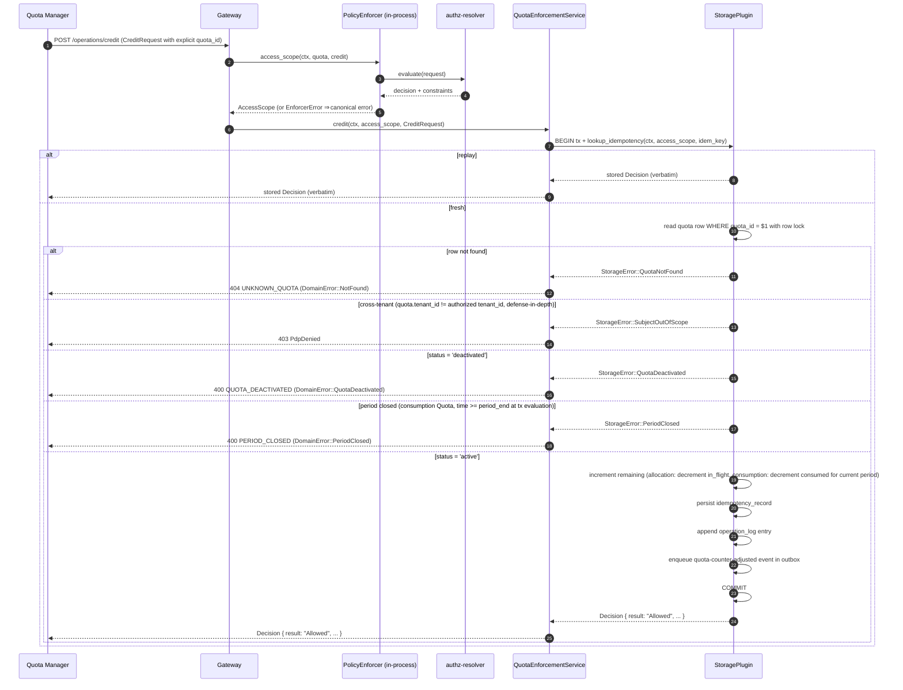

**Description.** Single-Quota counter increment scoped to the Quota Manager actor
(`cpt-cf-quota-enforcement-fr-credit`). Credit takes an **explicit `quota_id`** — there is no subject resolution and no
Engine invocation (per `cpt-cf-quota-enforcement-fr-credit`). Four rejection arms fire **before any mutation**, all
inside the transaction with a row-locked read so the check and the mutation share atomic semantics:

1. **Unknown quota.** `quota_id` does not exist → `StorageError::QuotaNotFound` →
   `DomainError::NotFound { kind: "quota", id }` → 404.
1. **Cross-tenant quota.** Row exists but `quota.tenant_id ≠ authorized tenant_id` (the PDP layer should already have caught
   this; storage check is defense-in-depth per `cpt-cf-quota-enforcement-nfr-tenant-isolation-integrity`) →
   `StorageError::SubjectOutOfScope` → `DomainError::PdpDenied` → 403.
1. **Deactivated quota.** Row exists, tenant scope matches, but `status = 'deactivated'` →
   `StorageError::QuotaDeactivated` → `DomainError::QuotaDeactivated { id }` → 400 (per the §3.3 mapping table:
   `FailedPrecondition`; PRD §5.5 deactivated Quotas accept no new mutation).
1. **Period closed (consumption Quotas only).** Row is active but the consumption Quota's calendar window has elapsed
   (`time >= period_end` at the moment the transaction is evaluated, per PRD §5.5 calendar-keyed credit closure) →
   `StorageError::PeriodClosed` → `DomainError::PeriodClosed` → 400 (`FailedPrecondition` per §3.3). Closure is keyed on
   calendar time, not on `period-rollover` event emission — credit is rejected immediately at the calendar boundary even
   while the settlement window is still draining cross-period lease commits into the closing period's counter (rollback
   closure is intentionally asymmetric, settlement-keyed per `cpt-cf-quota-enforcement-fr-rollback`). Allocation Quotas
   have no period and are unaffected by this arm.

The `quota-counter-adjusted` notification event is emitted exclusively for credits (PRD §5.15 event catalogue); rollback
uses the dedicated `quota-rollback-applied` event surfaced from the rollback flow. Same-tx outbox enqueue (I11)
guarantees event delivery regardless of dispatcher liveness.

#### Rollback

**ID**: `cpt-cf-quota-enforcement-seq-rollback`

**FR**: `cpt-cf-quota-enforcement-fr-rollback`

**Actors**: `cpt-cf-quota-enforcement-actor-quota-consumer`

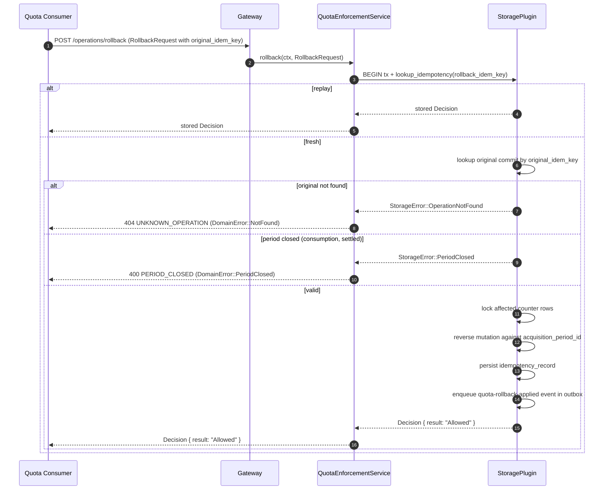

**Description.** Reversal of a previously committed debit (or lease-commit-derived debit;
`cpt-cf-quota-enforcement-fr-rollback`). Period attribution is taken from the original operation's
`acquisition_period_id`, not the wall-clock current period (I5). Backdated rollbacks against a settled period
(post-`period-rollover` emit) are rejected with `PERIOD_CLOSED` (PRD §5.5 cross-period rules). Rollback is idempotent
under its own `idem_key`; replay returns the stored Decision verbatim.

#### Lease Acquisition

**ID**: `cpt-cf-quota-enforcement-seq-lease-acquire`

**Use cases**: `cpt-cf-quota-enforcement-usecase-reserve-and-commit`

**Actors**: `cpt-cf-quota-enforcement-actor-quota-consumer`

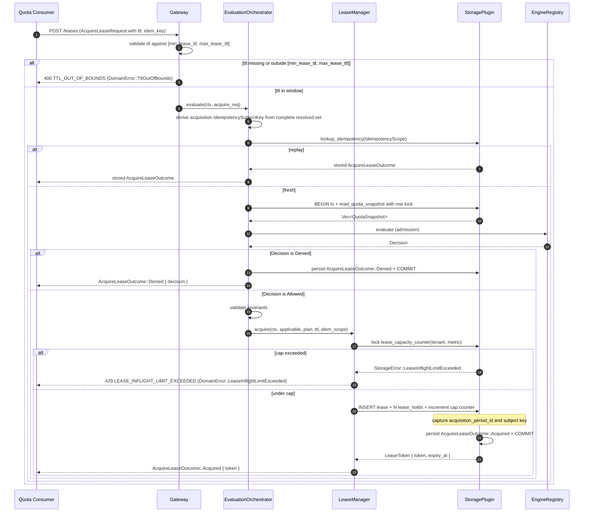

**Description.** Atomic multi-Quota acquisition (`cpt-cf-quota-enforcement-fr-lease-acquire`). TTL bounds are enforced
at the gateway before idempotency lookup: `ttl` is required, and a missing field or a value outside
`[min_lease_ttl, max_lease_ttl]` is rejected with `TTL_OUT_OF_BOUNDS` and never reaches the Engine, idempotency, or
capacity-hold paths (mirrors the `INVALID_AMOUNT` fail-fast). The active-lease cap (default 1000 per `(tenant, metric)`,
PRD §5.6) is enforced atomically same-tx with the lease insert (I7); over-cap requests are rejected without holding any
Quota. `acquisition_period_id` is captured at this step for every consumption Quota in the plan, locking in the period
attribution for the lease's lifetime regardless of when commit / release actually fires (I5).

#### Lease Commit (with cross-period boundary)

**ID**: `cpt-cf-quota-enforcement-seq-lease-commit`

**Use cases**: `cpt-cf-quota-enforcement-usecase-reserve-and-commit`

**Actors**: `cpt-cf-quota-enforcement-actor-quota-consumer`

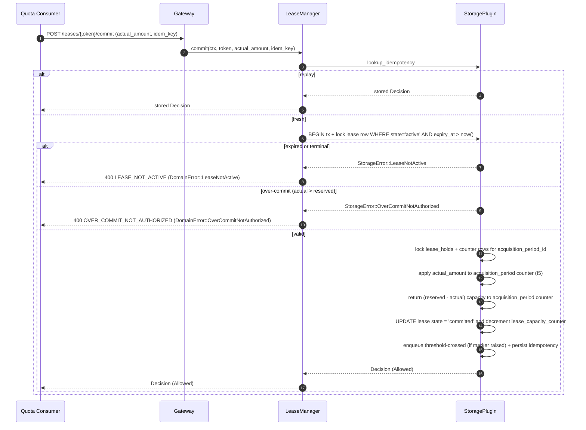

**Description.** Lease commit with the cross-period invariant front and centre: counter mutation lands on the
`acquisition_period_id`'s counter row even when wall-clock time is already in a subsequent period
(`cpt-cf-quota-enforcement-fr-lease-commit` cross-period section). The lazy-expiry guard (`expiry_at > now()` in the
WHERE clause, I4) means commit on an expired lease is rejected without depending on sweeper liveness. Over-commit
(`actual > reserved`) is rejected unconditionally (no clamping in P1 per `enforcement_mode = hard`).

#### Lease Release

**ID**: `cpt-cf-quota-enforcement-seq-lease-release`

**Use cases**: `cpt-cf-quota-enforcement-usecase-reserve-and-commit`

**Actors**: `cpt-cf-quota-enforcement-actor-quota-consumer`

Symmetric inverse of commit: full `held_amount` returned to acquisition-period counters, lease state → `Released`,
capacity counter decremented, idempotent under `idem_key`. Sequence shape identical to
`cpt-cf-quota-enforcement-seq-lease-commit` save for the counter direction; not separately diagrammed.

#### Lease TTL Auto-Release (sweeper)

**ID**: `cpt-cf-quota-enforcement-seq-lease-auto-release`

**Use cases**: `cpt-cf-quota-enforcement-usecase-reserve-and-commit` (alternative flow: TTL expired before commit)

**Actors**: implicit — `LeaseSweeper` background task with `system:quota-enforcement-sweeper` identity.

```mermaid
sequenceDiagram
    autonumber
    participant Sched as Tokio scheduler
    participant LS as LeaseSweeper
    participant CA as CoordinationAdapter (cluster election)
    participant SP as StoragePlugin

    LS ->> CA: SingletonCoordinator::run_while_leader(LeaseSweeper, sweep)
    Note over CA: adapter owns the LeaderWatch (changed() loop, resign on shutdown).<br/>Resolved cluster backend joins election qe/lease-sweeper and renews the claim
    alt follower
        Note over LS: no sweep body runs on this replica
    else elected
        CA -->> LS: start sweep with child CancellationToken
        loop every tick (60 s) until cancelled
            Sched -->> LS: tick
            LS ->> SP: reclaim_expired_leases(batch=1000, before=now())
            loop for each batch
                SP ->> SP: BEGIN tx<br/>UPDATE leases SET state='auto-released' WHERE expiry_at <= now() AND state='active'<br/>DECREMENT lease_capacity_counter per row<br/>RETURN held_amount to acquisition_period counters<br/>ENQUEUE lease-auto-released events in outbox<br/>COMMIT
                SP -->> LS: Vec<ExpiredLease>
            end
            LS ->> LS: emit lease_unreclaimed_expired gauge per canonical registered metric
        end
        CA -->> LS: leadership lost: cancel token (abort after stop timeout)
        Note over CA: re-enrols automatically; sweep restarts on re-election
    end
```

**Description.** The physical reclamation tier of `cpt-cf-quota-enforcement-fr-lease-timeout`. Lazy semantic release
(I4) means correctness does not depend on this sweeper running on schedule — even if the sweeper is paused for hours,
evaluation paths treat expired leases as released. The sweeper exists to (a) reclaim physical rows and (b) emit
`lease-auto-released` events as the canonical emission point. Single-leader execution under the
`lease-sweeper` cluster election through the `CoordinationAdapter`: the sweep runs only while this replica leads, the
resolved cluster backend renews the claim, and leadership loss cancels the sweep before its next batch. The election
backend is the operator's cluster profile binding.

#### Batch Debit

**ID**: `cpt-cf-quota-enforcement-seq-batch-debit`

**Use cases**: `cpt-cf-quota-enforcement-usecase-batch-debit`

**Actors**: `cpt-cf-quota-enforcement-actor-quota-consumer`

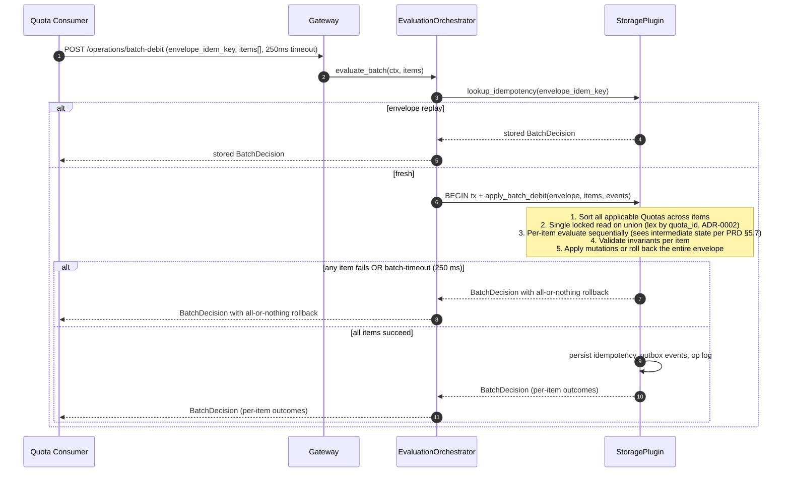

**Description.** Atomic envelope batch (`cpt-cf-quota-enforcement-fr-batch-debit`). The union of applicable Quotas
across all items is locked once up front in lexicographic `quota_id` order
(`cpt-cf-quota-enforcement-adr-acquisition-ordering`); per-item evaluation then proceeds sequentially within the held
lock set. Per-item outcomes are visible to later items (PRD §5.7 normative). Envelope failure (any item denied /
errored, or the 250 ms batch-level tokio timeout) rolls back the entire transaction.

#### Evaluate Preview (read-only)

**ID**: `cpt-cf-quota-enforcement-seq-evaluate-preview`

**FR**: `cpt-cf-quota-enforcement-fr-evaluate-preview`

**Actors**: `cpt-cf-quota-enforcement-actor-quota-consumer`, `cpt-cf-quota-enforcement-actor-quota-manager`,
`cpt-cf-quota-enforcement-actor-quota-reader`

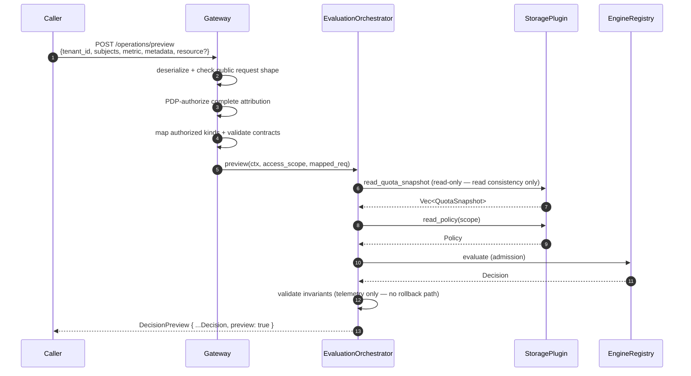

**Description.** Read-only counterpart of debit (`cpt-cf-quota-enforcement-fr-evaluate-preview`). No idempotency, no row
mutation, no outbox enqueue, no operation-log entry, no holding of capacity (I3). Verdict can be invalidated by
concurrent debits between the preview and a follow-up real debit; the response carries `preview: true` so callers cannot
conflate it with an admission. PDP scoping and tenant isolation apply identically to debit.

#### Consumer-Backed Self-Service Snapshot

**ID**: `cpt-cf-quota-enforcement-seq-end-user-snapshot`

**Use cases**: `cpt-cf-quota-enforcement-usecase-end-user-quota-snapshot-read`

**FR**: `cpt-cf-quota-enforcement-fr-end-user-quota-snapshot-read`

**Actors**: `cpt-cf-quota-enforcement-actor-quota-consumer` (the consuming product backend serves the end-user view).

The backend uses the same S2S `POST /v1/quota-enforcement/snapshot` endpoint as manager/operator reads; there is no
end-user QE route. It supplies explicit tenant/user attribution under its authenticated service principal:

1. **Explicit target is authorized.** PDP checks the supplied tenant/user/metric tuple against the service principal;
   QE maps authorized scope kinds through the catalogue. Unauthorized cross-user or cross-tenant targets are rejected
   before storage. Every Quota applicable to the mapped set is returned.
1. **No Policy attribution in the response.** Unlike `evaluate_preview`, the response shape carries no `policy_id` /
   `policy_version` / Engine diagnostics. End-user surfaces consume per-Quota state (`cap`, `consumed`, `remaining`,
   period boundary, validity window, metadata) without exposing arbitration internals.

The gateway and storage pipeline are otherwise identical to the manager/operator call. End-user authentication,
presentation, and rate limiting belong to the consuming product — not QE.

#### Quota Create

**ID**: `cpt-cf-quota-enforcement-seq-quota-create`

**Use cases**: `cpt-cf-quota-enforcement-usecase-create-quota`

**FR**: `cpt-cf-quota-enforcement-fr-quota-lifecycle`, `cpt-cf-quota-enforcement-fr-metric-identity-validation`

**Actors**: `cpt-cf-quota-enforcement-actor-platform-operator`, `cpt-cf-quota-enforcement-actor-quota-manager`

```mermaid
sequenceDiagram
    autonumber
    participant Op as Operator / QM
    participant GW as Gateway
    participant PEP as PolicyEnforcer
    participant PDP as authz-resolver
    participant QMS as QuotaManagementService
    participant TR as types-registry<br/>(via TypesRegistryClient)
    participant SP as StoragePlugin

    Op ->> GW: POST /quotas (QuotaDraft)
    GW ->> GW: deserialize + check public target shape
    GW ->> PEP: access_scope(ctx, target, create_quota)
    PEP ->> PDP: evaluate(request)
    PDP -->> PEP: decision + constraints
    PEP -->> GW: AccessScope (or canonical error)
    GW ->> QMS: create(ctx, access_scope, draft)
    QMS ->> QMS: validate (cap ≥ 0, thresholds-require-bounded-cap, period rule, source enum)
    QMS ->> TR: resolve metric + owner projection + request/constraint contracts (QMS LRU)
    alt unknown metric
        TR -->> QMS: Err(MetricNotRegistered)
        QMS -->> Op: 400 METRIC_NOT_REGISTERED (DomainError::MetricNotRegistered)
    else metric is registered (QuotaGated or Direct)
        QMS ->> QMS: validate registered concrete subject projection<br/>require configured-catalogue membership<br/>validate derivation + metric admission + quota.metadata<br/>snapshot accepted contract id/version
        QMS ->> SP: BEGIN tx + create_quota(ctx, quota)
        Note over SP: 1. INSERT into `quotas` (server-assigned UUIDv7 quota_id, status='active')<br/>2. INSERT corresponding counter row(s) — `quota_allocation_counters` for allocation type, lazy `quota_consumption_counters` row created on first evaluate for consumption<br/>3. Enqueue quota-changed (change_kind='created') in outbox<br/>4. Append operation_log entry<br/>5. COMMIT
        SP -->> QMS: QuotaId
        QMS -->> Op: 201 + Quota body
        opt metric mode is Direct
            Note over QMS: Quota is inert until the metric flips to QuotaGated (PRD §3.2);<br/>active inert Quotas are surfaced via the quota_for_direct_metric_total gauge.
        end
    end
```

**Description.** Quota creation (`cpt-cf-quota-enforcement-fr-quota-lifecycle`). `QuotaManagementService` validates the
draft against PRD §5.2 rules (cap non-negative, thresholds-require-bounded-cap, the period rule — consumption Quotas
require an explicit valid period, `one_time` included, allocation Quotas reject any period field — and source enum
membership), then calls `TypesRegistryClient` (platform `types-registry-sdk`, ClientHub-mediated) to confirm the metric
is **registered** (`cpt-cf-quota-enforcement-fr-metric-identity-validation`); the in-process LRU cache and fail-closed
mapping for the registry-unavailable case live inside `QuotaManagementService`. Unknown metric → `MetricNotRegistered`
(400). Metric mode (`QuotaGated` / `Direct`) is **not** a create-time rejection criterion — per PRD §3.2 a Quota MAY be
created on a `Direct` metric (forward-compat for `Direct → QuotaGated` flip); such a Quota is inert until the metric
flips and is surfaced through the `quota_for_direct_metric_total` gauge. Admission-time rejection of writes / previews
against `Direct`-metric Quotas (`MetricNotQuotaGated`) happens on the debit / credit / rollback / reserve / commit /
release / batch-debit / evaluate-preview paths, not here. Validation runs **outside** the transaction so the database
lock is held for the minimum window. The storage primitive inserts the Quota row, materialises the allocation counter
(consumption counter rows are created lazily on first evaluate per `cpt-cf-quota-enforcement-fr-period-rollover`), and
enqueues the `quota-changed (created)` event same-tx (I11). Operator-side rejection of cap reduction below current
consumed (`CAP_BELOW_CONSUMED`) is a separate update path and is covered by I6.

#### Quota Deactivation Cascade

**ID**: `cpt-cf-quota-enforcement-seq-quota-deactivate-cascade`

**FR**: `cpt-cf-quota-enforcement-fr-quota-lifecycle`

**Actors**: `cpt-cf-quota-enforcement-actor-platform-operator`, `cpt-cf-quota-enforcement-actor-quota-manager`

```mermaid
sequenceDiagram
    autonumber
    participant Op as Operator / QM
    participant GW as Gateway
    participant QMS as QuotaManagementService
    participant SP as StoragePlugin

    Op ->> GW: POST /quotas/{id}/deactivate
    GW ->> QMS: deactivate(ctx, access_scope, quota_id)
    QMS ->> QMS: PDP admission (deactivate on the Quota resource); read the row for the event's subject
    QMS ->> SP: BEGIN tx + deactivate_quota(ctx, access_scope, quota_id, events)
    Note over SP: 1. lock quota row WHERE status='active'<br/>2. UPDATE quota SET status='deactivated'<br/>3. lock active leases on this quota<br/>4. UPDATE each lease state='resolved-by-deactivation'<br/>5. Decrement lease_capacity_counters<br/>6. Return held capacity to acquisition-period counters<br/>7. Enqueue quota-changed (deactivated) event<br/>8. Enqueue one lease-resolved-by-deactivation event per affected lease<br/>9. COMMIT
    SP -->> QMS: DeactivateOutcome { resolved_leases }
    QMS -->> Op: 200 + resolved_leases summary
```

**Description.** Atomic deactivation cascade (per `cpt-cf-quota-enforcement-fr-quota-lifecycle` deactivation rule).
The quota-lifecycle feature delivers steps 1, 2, 7, and 9 (status flip under the row lock, `quota-changed` event,
operation-log entry); the lease steps 3–6 and 8 land with the lease-operations feature, and until then
`resolved_leases` is empty. Deactivation never partially completes — either every active lease for the Quota is resolved or none is. The storage
primitive returns the affected lease references so the gateway can attribute telemetry, and one outbox event is emitted
per affected lease (same-tx I11) for downstream sinks. Subsequent commits / releases against any of these resolved
leases return `LEASE_NOT_ACTIVE` (the deactivation timestamp serves as the implicit lease-resolve event).

#### Period Rollover (lazy detection)

**ID**: `cpt-cf-quota-enforcement-seq-period-rollover`

**Use cases**: implicit; triggered by debit / lease-commit / lease-release whose evaluate crosses a period boundary.

**Actors**: any `cpt-cf-quota-enforcement-actor-quota-consumer` triggers; sweeper as fallback.

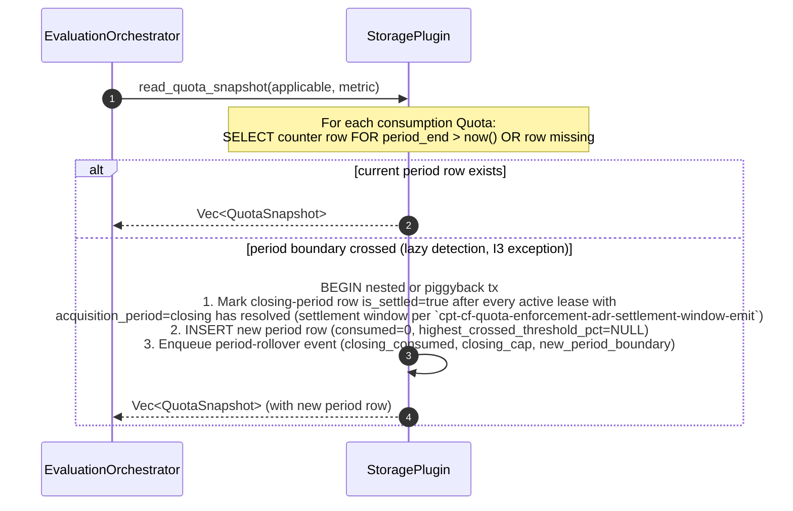

**Description.** Lazy period detection (`cpt-cf-quota-enforcement-fr-period-rollover`). On any evaluate that observes
`now() >= period_end` for a consumption Quota, the storage plugin atomically materialises the new period row, emits the
`period-rollover` event for the closing period, and resets the threshold marker. The new `quota_consumption_counters`
row MUST carry `highest_crossed_threshold_pct = NULL` per storage-plugin invariant **I13** (PRD §5.15: "the marker
resets at period rollover so thresholds can fire again in the new period"; threshold-emission rule of
`cpt-cf-quota-enforcement-fr-notification-plugin`). During the settlement window (between `period_end` and the moment
all active leases acquired in the closing period have resolved), cross-period commits/releases mutate the closing-period
counter and emit no `quota-counter-adjusted` or `threshold-crossed` events
(`cpt-cf-quota-enforcement-adr-settlement-window-emit`).

A known P1 limitation: for Quotas with no operations in the new period, the `period-rollover` event for the closing
period does not fire until the next operation arrives. P2 introduces an active rollover scheduler for batched event
emission and silent- Quota coverage.

#### Notification Outbox Dispatch

**ID**: `cpt-cf-quota-enforcement-seq-notification-dispatch`

**Use cases**: implicit; consumes events enqueued by every mutating sequence above.

**Actors**: `cpt-cf-quota-enforcement-actor-notification-sink` (consumer side); dispatcher runs with
`system:quota-enforcement-dispatcher` identity.

```mermaid
sequenceDiagram
    autonumber
    participant OB as toolkit-db Outbox (leased processor)
    participant ND as NotificationDispatcher (LeasedHandler)
    participant Sinks as Registered sinks (1..N)

    OB ->> OB: claim batch under DB lease
    OB ->> ND: handle(ctx_system, events)  %% cancel point at lease_duration − ack_headroom
    par Fan out (tokio::join_all, per-sink operator-configurable timeout)
        ND ->> Sinks: dispatch(ctx_system, event)
        Sinks -->> ND: Result<(), DispatchError>
    end
    alt every sink Success
        ND -->> OB: Ack
    else any Permanent, or attempts ≥ configured max
        ND -->> OB: Reject(reason)
        Note over OB: framework dead-letters the event;<br/>operators replay via dead_letter_replay
    else any Timeout / Transient below max
        ND -->> OB: Retry
        Note over OB: framework re-delivers to ALL sinks later —<br/>duplicates permitted, sinks idempotent on event_id
    end
    Note over OB,ND: an expired lease drops the handler future;<br/>another replica's processor claims the batch —<br/>no cluster election involved
```

**Description.** The dispatcher is a `toolkit-db` Outbox leased handler: the framework claims batches under a DB
lease, drops the handler future at the cancel point so an expired holder cannot overlap its successor, re-delivers on
retry, and owns the dead-letter store. The handler fans every event out to all registered `QuotaNotificationSinkV1`
implementations with per-sink failure isolation. Sustained failures surface via `outbox_rejections_total` for
operator alerting;
counter mutation is unaffected (PRD §5.15 best-effort delivery normative).

#### Idempotency Replay (cross-cutting)

**ID**: `cpt-cf-quota-enforcement-seq-idempotency-replay`

Idempotency lookup is the first storage call in every mutating sequence above. Behaviour:

- **Cache hit, payload hash match** → return stored `decision_blob` verbatim. Engine is **not** re-invoked (satisfies
  the idempotency-replay rule of `cpt-cf-quota-enforcement-fr-idempotency` for time-gated CEL — `time` binding stays
  captured, never re-bound on replay).
- **Cache hit, payload hash mismatch** → return `IdempotencyPayloadMismatch` (409).
- **Cache miss** → proceed with full evaluation pipeline; persist record same-tx with the mutation (I1, I2).

The `decision_blob` is JSON-typed and schema-versioned (top-level `__version`); additive shape changes in P2/P3 do not
require migration of existing blobs.

#### Policy Versioning Update

**ID**: `cpt-cf-quota-enforcement-seq-policy-version-update`

**Use cases**: `cpt-cf-quota-enforcement-usecase-configure-policy`

**Actors**: `cpt-cf-quota-enforcement-actor-platform-operator`

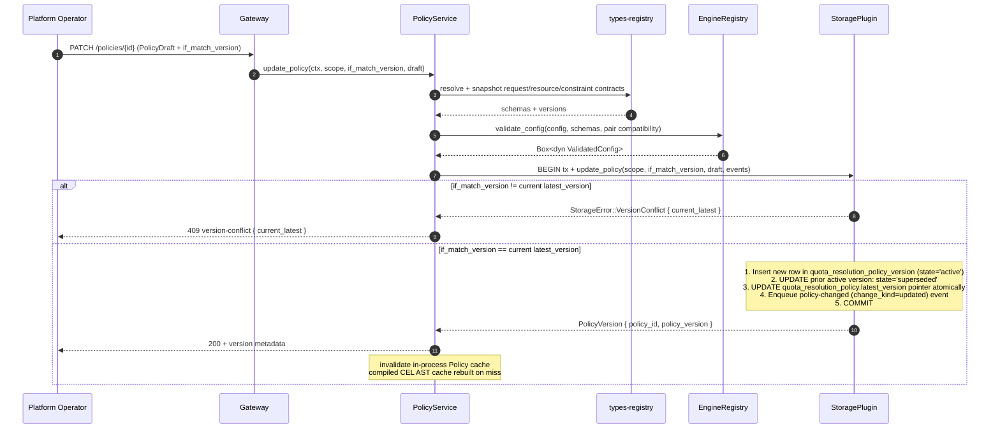

**Description.** Update creates a new immutable version row and atomically updates the explicit `latest_version` pointer
(`cpt-cf-quota-enforcement-fr-quota-resolution-policy-versioning`). Engine `validate_config` runs before the database
transaction, so invalid configs fail fast without holding a lock. On a successful update, the compiled artifact is
published to the Engine's `ValidatedConfig` cache after the transaction commits per the Engine Plugin Trait contract.

**Policy DELETE response shape.** `DELETE /v1/quota-enforcement/policies/{id}` returns **204 No Content** on success —
consistent with the platform DELETE convention (precedent: `resource-group` types-registry
`cpt-cf-resource-group-...delete-type`, `account-management` tenant-metadata DELETE). The operation is idempotent per
`cpt-cf-quota-enforcement-fr-quota-resolution-policy-versioning` ("A subsequent `delete_policy` against an
already-deleted `policy_id` is a no-op"): repeat DELETE against the same `policy_id` after a successful soft-delete also
returns 204; the second call performs no state change and emits no second `policy-changed (deleted)` event. **404** is
returned only when `policy_id` was never created — distinct from the deleted-then-replayed case to avoid masking
misconfigured clients. Attempting DELETE against the seeded `global` Policy surfaces a canonical `FailedPrecondition`
error (HTTP 400, `reason = "CANNOT_DELETE_SEEDED_GLOBAL_POLICY"`) per the §3.3 mapping table.

**Policy CREATE / UPDATE / ROLLBACK response shape.** `POST /policies` returns **201 Created** with the new
`PolicyVersion` body; `PATCH /policies/{id}` and `POST /policies/{id}/rollback` return **200 OK** with the new
`PolicyVersion` body (both produce a new immutable version row whose metadata the caller needs).

### 3.7 Database schemas & tables

- [ ] `p1` - **ID**: `cpt-cf-quota-enforcement-db-schema`

> **Scope discipline.** Concrete table layouts (column types, primary keys, indexes, constraints, partitioning rules,
> isolation level, lock-timeout configuration) are **plugin-internal** and live in the storage-plugin DESIGN document.
> The list below is the contract-level table inventory: which logical entities the storage plugin must persist, what
> foreign-key invariants hold across them, and the retention boundaries. The P1 storage-plugin realisation — schema DDL,
> migrations, indexes — is authored in the storage-plugin DESIGN doc once authored (precedent: a sibling gear
> pattern).

#### Table inventory

QE-core requires the storage plugin to persist the following entities. Names below are the canonical logical names; the
plugin chooses physical layout.

| Logical table                     | Purpose                                                                                                                                                                                               | Retention                                                                                                                                                  |
| --------------------------------- | ----------------------------------------------------------------------------------------------------------------------------------------------------------------------------------------------------- | ---------------------------------------------------------------------------------------------------------------------------------------------------------- |
| `quotas`                          | Quota records (declarative caps). P1 reference plugin: `qe_quotas`, `id` a `UUIDv7`, `cap BIGINT NULL CHECK (cap >= 0)`, enums as GTS instance ids, thresholds and metadata as canonical JSON text, constraint contract type/version written with the metadata it validated.  | Indefinite for active; deactivated retained until P2 audit-aware purge (`cpt-cf-quota-enforcement-fr-quota-lifecycle`)                                     |
| `quota_allocation_counters`       | Per-Quota in-flight counter (allocation type); created with the Quota and read under its row lock by the I6 cap guard (P1 reference plugin: `qe_quota_allocation_counters`)                            | Co-terminus with the Quota                                                                                                                                 |
| `quota_consumption_counters`      | Per-(Quota, period) consumed counter; carries `highest_crossed_threshold_pct`                                                                                                                         | Active period + operator-configurable historical window (default 13 months); reclaimed via partition drop                                                  |
| `leases`                          | Lease rows with state, expiry, acquisition_period_id                                                                                                                                                  | Active until terminal; retained as ledger entries within operation-log retention                                                                           |
| `lease_holds`                     | Per-Quota lease hold rows                                                                                                                                                                             | Co-terminus with the lease row                                                                                                                             |
| `lease_capacity_counters`         | Per-(tenant, metric) active-lease counter                                                                                                                                                             | Co-terminus with QE deployment                                                                                                                             |
| `quota_resolution_policy`         | Policy entity + `latest_version` pointer                                                                                                                                                              | Indefinite (seeded `global` cannot be deleted)                                                                                                             |
| `quota_resolution_policy_version` | Immutable version rows (`active` / `superseded` / `rolled_back` / `deleted` per PRD §5.9 four-state enum)                                                                                             | Operator-configured retention (default 90 days for `superseded` / `rolled_back` / `deleted` terminals); seeded `global` Policy versions kept indefinitely. |
| `idempotency_records`             | Replay-safety records keyed by `(tenant_id, subject_key, operation_type, idem_key)` per `cpt-cf-quota-enforcement-fr-idempotency`; `subject_key` fingerprints the complete PDP-authorized, catalogue-mapped subject set. | Operator-configurable per-`(tenant, metric)` (default 24 h); reclaimed by `RetentionSweeper` |
| `operation_log`                   | Operation ledger (P1; audit-grade attribution deferred to P2). P1 reference plugin: `qe_operation_log`, one row per accepted mutation with the actor and content-free detail                          | Operator-configurable (default 30 days); partitioned by date for `DROP PARTITION` retention                                                                |
| `notification_outbox`             | Same-tx event queue (toolkit-db Outbox under the table prefix `qe_outbox`; queue `qe_notifications`, eight tenant-keyed partitions, the event kind as payload type). The plugin enqueues; the dispatcher of the notifications feature binds the handle and drains.  | Co-terminus with successful delivery; dead-letter rows retained per operator config                                                                        |
| `contention_timeout_config`       | Per-metric contention timeout configuration                                                                                                                                                           | Indefinite                                                                                                                                                 |
| `lease_capacity_config`           | Per-`(tenant, metric)` active-lease cap overrides; `tenant_id IS NULL` and `metric IS NULL` row = platform default (1000 per PRD §5.6 / `cpt-cf-quota-enforcement-fr-lease-timeout`); enforced by I7. | Indefinite                                                                                                                                                 |
| `idempotency_retention_config`    | Per-`(tenant, metric)` idempotency retention overrides                                                                                                                                                | Indefinite                                                                                                                                                 |

**Cross-table invariants** (enforced by the storage plugin under I1):

- Every `lease_holds.lease_id` references an existing `leases.lease_id` (FK, ON DELETE CASCADE).
- Every `lease_holds.quota_id` references an existing `quotas.quota_id` (FK, ON DELETE RESTRICT — Quota cannot be
  hard-deleted while leases hold it).
- Every `lease_holds.period_id` (consumption Quotas) references the lease's `acquisition_period_id` on a
  `quota_consumption_counters` row.
- `quota_resolution_policy.latest_version` always references an existing version row.
- Outbox events for a mutation are inserted in the same transaction as the mutation; no partial enqueue is observable.
- Idempotency record `payload_hash` is the canonical SHA-256 of the sorted-JSON payload; the plugin stores it as
  fixed-width binary for index efficiency.

#### Bootstrap seeded state

`bootstrap()` is responsible (idempotently) for:

1. Verifying schema is at the trait's major version (returns `SchemaVersionMismatch` otherwise).
1. Seeding the `global` Quota Resolution Policy with the `most-restrictive-wins` Engine if it does not exist (cannot be
   deleted thereafter per `cpt-cf-quota-enforcement-fr-quota-resolution-policy`).
1. Registering the abstract QE bases `gts.cf.core.qe.subj.v1~`, `gts.cf.core.qe.res.v1~`,
   `gts.cf.core.qe.request.v1~`, and `gts.cf.core.qe.constraint.v1~`, plus
   `gts.cf.core.qe.scope.v1~` and its P1 well-known instances
   `gts.cf.core.qe.scope.v1~cf.core.qe.user.v1` and
   `gts.cf.core.qe.scope.v1~cf.core.qe.tenant.v1`, through `TypesRegistryClient` if missing. Concrete owner
   projections are published by their owners; QE seeds no platform-wide subject instances.
1. Resolving every configured subject/resource projection and per-metric request contract into a candidate
   `ProjectionContractCatalog`.
1. Checking derivation of every configured concrete owner projection from the QE base, concrete (non-abstract) status,
   and that every admitted metric reference resolves to a registered instance of the metric base (a narrowed
   `x-gts-ref` is a prefix match only, so neither registration nor the instance-of relationship is covered by it),
   uniqueness of every admitted `(metric, scope)` pair across the configured projection set, exactly one concrete
   request contract per admitted metric, and a registered concrete constraint contract attached by that request
   contract. QE reads
   each projection's registry-validated effective `scope` trait and compares its `GtsInstanceId` directly. Any
   invalid reference, contract mismatch, or `(metric, scope)` pair claimed by two configured projections fails
   bootstrap. Bootstrap also fails when the configured catalogue is incompatible with any active Quota or Policy.
   Registered projections outside the configured catalogue remain discoverable, but P1 rejects Quota and Policy writes
   that reference them. The immutable catalogue is published to Gateway only after all checks pass. Resolution
   re-derives each selected contract with the `gts` library the registry validates with: the type, its parent chain,
   and every type reached through a `gts://` reference are loaded into a local store, and the resolved body keeps its
   Draft-07 dialect and `x-gts-ref` constraints for the compiled contract to assert at ingress. Request contracts are
   discovered from the registry listing under `gts.cf.core.qe.request.v1~` and filtered to the admitted metrics, so an
   unrelated owner's contract cannot fail bootstrap. The active-Quota compatibility check reads the distinct
   `(metric, projection_type)` pairs through the caller-less, bootstrap-only storage primitive
   `read_active_projection_bindings()`, realised by the reference plugin as a distinct query over `qe_quotas`. After
   the compatibility check, every distinct bound metric is classified once: a metric the registry no longer knows is
   flagged with a structured warning and never deactivated, a registry that does not answer fails readiness. A
   consistency-set failure names `catalog` as the failed dependency (health code `qe_catalog_unavailable`); a
   registry that does not answer names `types_registry`.
1. Seeding default rows for `contention_timeout_config(metric=NULL, timeout_ms=0)`,
   `lease_capacity_config(tenant_id=NULL, metric=NULL, max_active_leases=1000)`, and
   `idempotency_retention_config(tenant=NULL, metric=NULL, retention_seconds=86400)` when missing.

Separately, in the gear lifecycle `start` and not in the storage `bootstrap()`, QE resolves the cluster
leader-election facade for the `quota-enforcement` profile with the `Linearizable` requirement (§3.3 "Cluster
Coordination"). A capability mismatch or an unbound profile fails startup in the embedded profile and readiness in the
deployed profile. The cluster resolver validates the operator's binding; QE runs no probe of its own.

### 3.8 Deployment Topology

- [ ] `p1` - **ID**: `cpt-cf-quota-enforcement-topology`

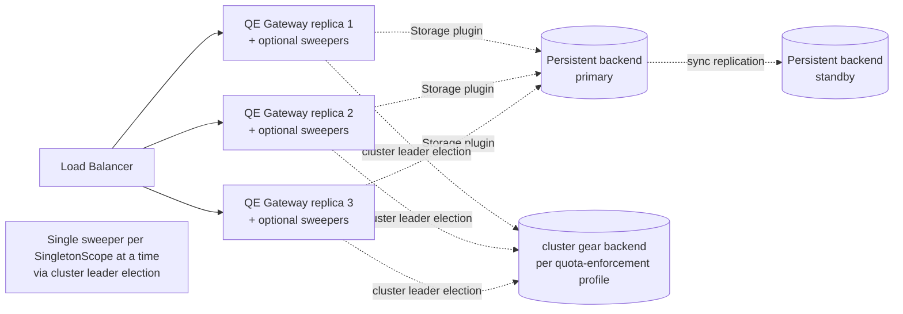

**P1 deployment shape.**

- **Single region.** Multi-region is out of P1 scope; the platform's standard region-pair active-passive pattern applies
  and `cpt-cf-quota-enforcement-nfr-fault-tolerance` (RPO=0) is delivered by the storage plugin's durable-commit
  guarantee (concrete realization is plugin-internal).
- **Stateless gateway.** Multi-replica behind a platform load balancer. Ordinary updates that keep the same projection
  catalogue are rolling-update safe. Breaking projection-version activation is not supported in P1; bootstrap rejects
  a configured catalogue that is incompatible with any active Quota or Policy.
- **Sweeper coordination.** `LeaseSweeper` and `RetentionSweeper` each join a distinct cluster election
  (`qe/lease-sweeper`, `qe/retention-sweeper`) through the `CoordinationAdapter` at startup. The elected replica runs
  the background loop; the others stay followers and serve only request traffic. The resolved cluster backend renews
  the claim; on leadership loss the adapter cancels the loop and the replica returns to follower mode, and re-election
  is automatic.
  RTO ≤ 15 min per `cpt-cf-quota-enforcement-nfr-recovery` is bounded by the election TTL plus observation lag. The
  operator selects the election backend in the cluster profile YAML, independently of the storage backend.
- **Bundling.** Sweepers + dispatcher run in the same binary as the gateway by default (single deployment artefact).
  Operators MAY split them into a dedicated binary by feature-flag if their workload warrants — e.g., a sweeper-only
  replica with reduced HTTP concurrency. For the two sweepers, the cluster election semantics work identically
  across both layouts; the dispatcher continues to use the Outbox lease.
- **Connection pooling.** Provided by the storage plugin; sized to satisfy `cpt-cf-quota-enforcement-nfr-throughput` (≥
  10 K ops/s). Concrete pooler choice is plugin-internal.
- **Schema migration.** Operator-runnable; the storage plugin's `bootstrap()` rejects mismatched schema versions before
  serving traffic (I12). Migration tooling itself is plugin-internal.

## 4. Additional context

### 4.1 Telemetry surface

The complete QE-specific metric catalogue exposed alongside the framework baseline
(`cpt-cf-quota-enforcement-fr-telemetry`):

| Metric                                     | Type      | Labels                   | Notes                                                                                                                                                                                                                       |
| ------------------------------------------ | --------- | ------------------------ | --------------------------------------------------------------------------------------------------------------------------------------------------------------------------------------------------------------------------- |
| `denial_total`                             | Counter   | `reason`                 | Closed `reason` enum (`cpt-cf-quota-enforcement-constraint-bounded-cardinality`)                                                                                                                                            |
| `lease_contention_rejected_total`          | Counter   | `metric`                 | Increments on `LEASE_CONTENTION_TIMEOUT` (I8); `metric` is the canonical registered identity                                                                                                                                 |
| `lease_acquisition_wait_seconds`           | Histogram | `metric`                 | Wait time during lease acquisition (successful or rejected); `metric` is the canonical registered identity; buckets sized for the SLO of `cpt-cf-quota-enforcement-nfr-evaluation-latency` (p95 ≤ 100 ms).                |
| `lease_inflight_limit_exceeded_total`      | Counter   | `metric`                 | Per-(tenant, metric) cap (I7); `metric` is the canonical registered identity                                                                                                                                                  |
| `lease_unreclaimed_expired`                | Gauge     | `metric`                 | Sweeper visibility by canonical registered metric                                                                                                                                                                            |
| `engine_bootstrap_failures_total`          | Counter   | `engine_id`              | Gear-bootstrap fail-fast                                                                                                                                                                                                  |
| `engine_evaluation_seconds`                | Histogram | `engine_id`              | Engine `evaluate()` latency; bucket sizing aligns with the per-Policy timeout (default 5 ms) — exact bucket configuration is operator-tunable.                                                                              |
| `debit_plan_invariant_violations_total`    | Counter   | `engine_id`, `invariant` | `invariant` ∈ closed set of 4 (PRD §5.16)                                                                                                                                                                                   |
| `quota_cap_zero_total`                     | Gauge     | —                        | Quotas with lifecycle status `active` and `cap = 0`, whatever their validity window (config drift surface)                                                                                                                  |
| `quota_cap_unbounded_total`                | Gauge     | —                        | Quotas with lifecycle status `active` and `cap = null`, whatever their validity window                                                                                                                                      |
| `quota_for_direct_metric_total`            | Gauge     | —                        | Quotas with lifecycle status `active` whose metric is currently classified `Direct` (PRD §3.2 inertness signal); deactivation and a mode change take effect at the next refresh                                            |
| `notification_dispatch_failures_total`     | Counter   | `sink_id`, `event_kind`  | Per-sink dispatch failures (PRD §5.15 best-effort delivery)                                                                                                                                                                 |
| `outbox_pending_rows`                      | Gauge     | `queue`                  | Outbox backlog visibility; requires a `toolkit-db` pending-count API (tracked upstream prerequisite)                                                                                                                                                                                                   |
| `outbox_rejections_total`                  | Counter   | `queue`                  | Handler `Reject` outcomes; this is not a durable dead-letter row count                                                                                                                                                       |
| `policy_version_transitions_total`         | Counter   | `transition_kind`        | `{create, update, rollback, delete}`                                                                                                                                                                                        |
| `policy_version_conflict_rejections_total` | Counter   | —                        | Policy versioning concurrency rejections                                                                                                                                                                                    |
| `contract_validation_failures_total`       | Counter   | `surface`, `reason`      | `surface` ∈ `{request_subject, request_resource, caller_attribution, arbitration, policy_pair, bootstrap}`; `reason` ∈ `{shape_invalid, metadata_missing, kind_unknown, kind_not_admitted, schema_violation, schema_invalid, unregistered, abstract, not_derived, scope_invalid, metric_unregistered, metric_not_instance, duplicate_pair, request_contract_missing, request_contract_ambiguous, constraint_invalid, definition_conflict, projection_not_resolvable, incompatible_state}`                                                                 |
| `admitted_metric_violations_total`         | Counter   | `surface`                | Projection/metric incompatibility at request, Quota/Policy write, or bootstrap; no metric label                                                                                                                              |

**Lifecycle gauges.** The three `quota_*_total` gauges are storage-backed: the replica that holds the
`lifecycle-gauges` election refreshes them on a bounded schedule through `read_active_quota_counts()` and one
classification lookup per distinct metric, and publishes one sample that the observable callbacks read without any
I/O. A sample is published only after a refresh that succeeded in the current leadership term; a failed refresh, a
timed-out one, or a `Stale` classification keeps the last sample and warns, and after the configured staleness bound
the sample is withdrawn, so a failed read is never reported as zero. Leadership loss, a `Lagged` or `Reset` watch
event, or shutdown withdraw the sample and discard any late refresh result; followers publish nothing, not zero, so
identical global counts are never summed across replicas. Telemetry backends must treat a former leader's series as
stale once it stops updating, so a failover cannot double-count.

Label cardinality is bounded at compile time (`cpt-cf-quota-enforcement-constraint-bounded-cardinality`).
High/unbounded-cardinality identifiers (`tenant_id`, `subject_id`, `quota_id`, `policy_id`, `idempotency_key`,
`lease_token`), projection type, caller attribution, and raw/unregistered metric input appear only on traces and
structured log fields, never on metric labels. Canonical registered `metric` labels are used only by instruments that
declare them in the catalogue above and are populated only after registry/catalogue validation.

Caller attribution is intentionally not a metric dimension: although typed, the registry does not bound the number of
service projection types across deployments. It is available on sampled traces and structured diagnostics instead.

**Tracing.** OpenTelemetry traces propagate from the `qe.gateway.handle_request` root. Stage spans:
`subject_resolution`, `applicable_quotas_fetch`, `policy_lookup`, `engine_evaluate`, `invariant_check`,
`storage.apply_debit_plan`, `notification.enqueue`. Attribute keys: `qe.tenant_id`, `qe.metric`, `qe.engine_id`,
`qe.policy_id`, `qe.policy_version`, `qe.result`.

**Structured logging.** Tracing crate. The system never logs metric values, metadata content, or subject identifiers
verbatim at INFO level.

### 4.2 Capacity envelope

Estimated steady-state at the P1 NFR floor (`cpt-cf-quota-enforcement-nfr-throughput` ≥ 10 K ops/s,
`cpt-cf-quota-enforcement-nfr-subject-scale` ≥ 100 M subjects, `cpt-cf-quota-enforcement-nfr-quota-density` ≥ 1 B
Quotas):

| Data class                        | Estimate                              | Notes                                                                                                                   |
| --------------------------------- | ------------------------------------- | ----------------------------------------------------------------------------------------------------------------------- |
| `quotas`                          | ≈ 250 GB at 1 B rows × ~250 B         | Hot index on `(projection_type, subject_id, metric)` partial-where-active sized to fit the storage-plugin in-memory cache. |
| `quota_consumption_counters`      | ≈ 1.5 GB / month / metric at peak     | 13-month retention via partition drop.                                                                                  |
| `leases` (active + ledger window) | ≤ 1 GB                                | Ledger entries kept within operation-log retention.                                                                     |
| `idempotency_records`             | ≈ 432 GB at 24 h × 10 K ops/s × 500 B | **Significant** — operator may split to a dedicated storage tier.                                                       |
| `operation_log`                   | ≈ 1 TB at 30 days                     | **Significant** — partitioned by date; cold-tier migration to a longer-term store is a P2 candidate.                    |
| `notification_outbox`             | bounded by dispatch lag               | Operator alert on `outbox_pending_rows` > threshold.                                                                    |

Capacity / cost budgets at the deployment level are managed by SRE, not at the QE gear level —
`cpt-cf-quota-enforcement-nfr-...` allocations identify the mechanism; absolute infrastructure sizing is governed in the
platform infrastructure repo. Capacity / cost budgets are managed at deployment level by SRE — `Not applicable` at QE
gear level.

**Storage-plugin tuning** is plugin-internal (connection pooling, buffer sizing, replication knobs, vacuum strategy,
partitioning). QE-core's contract over the storage plugin is: hot-path admission stays within the SLO of
`cpt-cf-quota-enforcement-nfr-evaluation-latency`, throughput sustains `cpt-cf-quota-enforcement-nfr-throughput`, and
durability satisfies `cpt-cf-quota-enforcement-nfr-fault-tolerance` (RPO = 0).

**Performance verification.** A Criterion benchmark suite in `quota-enforcement/benches/` covers single-Quota debit @ 10
K ops/s, 10-Quota cascade @ 5 K ops/s, lease 3-phase cycle, and 100 M-subject load. CI gates p95 ≤ 100 ms before merge
(`cpt-cf-quota-enforcement-nfr-evaluation-latency`).

### 4.3 Future considerations

The following deferred work has explicit hooks in the P1 design; each entry names the hook so future authors can extend
additively without breaking existing callers.

| Topic                                                                            | Phase | Hook in P1 design                                                                                                                                                                                                                                                                                                                                                                 |
|----------------------------------------------------------------------------------|-------|-----------------------------------------------------------------------------------------------------------------------------------------------------------------------------------------------------------------------------------------------------------------------------------------------------------------------------------------------------------------------------------|
| Sharded counters                                                                 | P2    | Counter tables additive `shard_id` column; acquisition ordering grows to `(quota_id, shard_id)`; queries aggregate via `SUM`.                                                                                                                                                                                                                                                     |
| Runtime projection-catalog refresh                                               | P2    | `ProjectionContractCatalog` is already built and published atomically at bootstrap; a refresh path replaces the same value under the same atomicity guarantee. It does not by itself enable breaking-version activation.                                                                                                                                                |
| Breaking projection-version activation                                           | P2    | Requires an authoritative admission transition plus version-independent idempotency correlation before catalogue, Quota, and Policy versions can change safely.                                                                                                                                                                                                     |
| Bulk Quota CRUD endpoints                                                        | P2    | REST surface adds `/v1/quota-enforcement/quotas/bulk-*`; Storage plugin already exposes transactional batch primitives via `apply_batch_debit` precedent. Quota Manager depends on this surface for projection-version replacement at scale; QE still gains no Quota/counter migration verb.                                                                                      |
| Additional owner projection scopes                                               | P2    | Owners publish a new scope instance and derived projection; callers can supply the new `{kind,id}` without changing the raw QE envelope. QE gains no registration API.                                                                                                                                                                                                             |
| Derived or attested attribution (`cost-center` etc.)                              | P3    | Adds a wrapper that produces the same raw attribution tuple after its own latency/security design; QE core and Engine contracts remain unchanged.                                                                                                                                                                                                                                  |
| Rate Quota type (`rate`)                                                         | P3    | `quota_type` reserves the `rate` GTS instance (`gts.cf.qe.quota.type.v1~cf.qe.quota.rate.v1`); runtime currently rejects Quota creation referencing it with the canonical `Unimplemented` error per `cpt-cf-quota-enforcement-fr-quota-type-rate-rejection`. Schema migration adds optional `rate_spec` JSON field at activation time per PRD §5.3 (zero-cost reservation in P1). |
| Cap-clamp admission (`hard-with-clamp`)                                          | P3    | `EnforcementMode` is the closed enum of `cpt-cf-quota-enforcement-fr-enforcement-mode` and admits additive variants in P3; `Decision::AllowedWithClamp` is an additive arm.                                                                                                                                                                                                       |
| EventBus integration replacing in-process notification dispatch                  | P2    | `QuotaNotificationSinkV1` trait remains; an `EventBus`-backed sink implementation plugs in alongside operator-supplied sinks (PRD §13 EventBus OQ).                                                                                                                                                                                                                               |
| QM tenant-scoped subscription primitive                                          | P2    | P1: subscriber-side filtering on the tenant arm of `event.scope`; platform-scoped policy events reach every sink. P2 introduces a QE-side primitive without breaking P1 sinks.                                                                                                                                                                                                                                                                  |
| Active period-rollover scheduler (silent-Quota coverage)                         | P2    | P1 lazy detection has the known limitation that Quotas with no operations after a period boundary do not emit `period-rollover` until the next op. P2 adds a scheduled scan keyed off `period_end`.                                                                                                                                                                               |
| Cold-tier migration of `operation_log` and `idempotency_records`                 | P2    | Both have partition-by-date layouts in the storage plugin; cold-tier migration is a standard data-platform extension point.                                                                                                                                                                                                                                                       |
| Composable Policy patterns / Shadow evaluation / CEL-based notification policies | P2    | All sit on top of the existing Engine and Notification plugin contracts; each is a new Engine or new Policy semantic, not a contract change.                                                                                                                                                                                                                                      |
| Per-resource counter axis                                                        | Open  | Resource projections already provide the contract. If a concrete high-cardinality consumer emerges, add resource to the counter/applicable-set key so counters materialize per resource; do not simulate this with properties.                                                                                                                                                    |
| Engine deprecation lifecycle                                                     | P2    | Kept open; relevant when additional Engine plugins (Wasm / Starlark / Lua) land in the deployment binary. P1 fail-fast on bootstrap-time registration failures (`cpt-cf-quota-enforcement-fr-quota-resolution-engine`) covers built-in Engine outages but not intentional removals — the latter await the P2 deprecation roadmap.                                                 |
| Audit-grade retention + audit infrastructure                                     | P2    | Operation-log retention covers the ledger; audit-grade attribution awaits the platform audit infra.                                                                                                                                                                                                                                                                               |

### 4.4 Risks and mitigations

| Risk                                                                               | Mitigation                                                                                                                                                                                                                                                                                                 |
| ---------------------------------------------------------------------------------- | ---------------------------------------------------------------------------------------------------------------------------------------------------------------------------------------------------------------------------------------------------------------------------------------------------------- |
| Hot-key contention on a popular metric (single-row write hotspot per PRD §12 risk) | Per-metric acquisition contention timeout (`cpt-cf-quota-enforcement-fr-lease-acquire`, I8) makes contention behaviour observable and operator-tunable; `lease_contention_rejected_total` plus `lease_acquisition_wait_seconds` histogram drive operator action. Sharded counters are the P2 escape hatch. |
| Sweeper outage allowing lease rows to accumulate                                   | Lazy expiry (I4) preserves correctness regardless of sweeper liveness. The active-lease cap (I7) bounds row growth; `lease_unreclaimed_expired` gauge surfaces the backlog.                                                                                                                                |
| Notification delivery storms or sustained sink failure                             | Outbox-based delivery (I11) decouples mutation from dispatch. Per-sink failure isolation + dead-letter queue + `notification_dispatch_failures_total` per-`(sink_id, event_kind)` localise the operational impact.                                                                                         |
| Engine misconfiguration producing invalid Decision shapes                          | Strict-engine-boundary discipline at `EvaluationOrchestrator` (`cpt-cf-quota-enforcement-principle-strict-engine-boundary`) enforces the closed Debit-Plan invariant set; `debit_plan_invariant_violations_total` per-`(engine_id, invariant)` identifies the failing Engine.                              |
| PDP unavailability disabling all writes                                            | Fail-closed by design (`cpt-cf-quota-enforcement-principle-fail-closed`). Decision caching, if ever needed, is the platform PEP's concern — QE holds no PDP cache.                                                                                                                                                 |
| Idempotency storage size growth                                                    | Operator-configurable retention per `(tenant, metric)`; storage-plugin retention sweeper; partitioning; cold-tier P2 hook.                                                                                                                                                                                 |
| Cross-period commit / rollback ambiguity                                           | Period attribution at acquisition time (I5) is the load-bearing invariant; settlement-window emit policy (`cpt-cf-quota-enforcement-adr-settlement-window-emit`) closes the cross-period emit ambiguity.                                                                                                   |

## 5. Traceability

- **PRD**: [PRD.md](./PRD.md)
- **ADRs**: [ADR/](./ADR/) —
  [0001 Pluggable storage backend](./ADR/0001-cpt-cf-quota-enforcement-adr-storage-backend.md),
  [0002 Acquisition ordering](./ADR/0002-cpt-cf-quota-enforcement-adr-acquisition-ordering.md),
  [0003 Metadata snapshot timing](./ADR/0003-cpt-cf-quota-enforcement-adr-metadata-snapshot-timing.md),
  [0004 Settlement window emit](./ADR/0004-cpt-cf-quota-enforcement-adr-settlement-window-emit.md),
  [0005 Pluggable evaluation engine](./ADR/0005-cpt-cf-quota-enforcement-adr-evaluation-engine.md),
  [0006 Coordination via the cluster gear](./ADR/0006-cpt-cf-quota-enforcement-adr-coordination-plugin.md),
  [0007 Declarative projection contracts](./ADR/0007-cpt-cf-quota-enforcement-adr-projection-contracts.md)
- **Storage plugin DESIGN**: authored separately by the plugin owner once the plugin crate is created
- **Features**: `features/` (eleven per-feature implementation guides, one per DECOMPOSITION entry)
