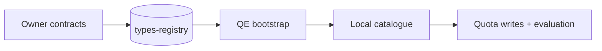
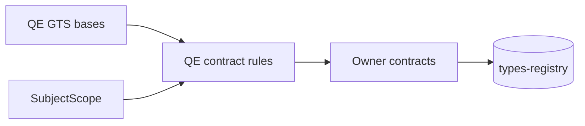
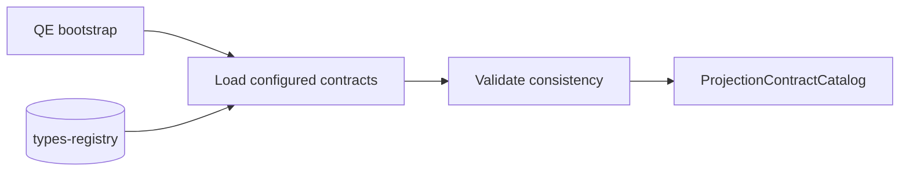
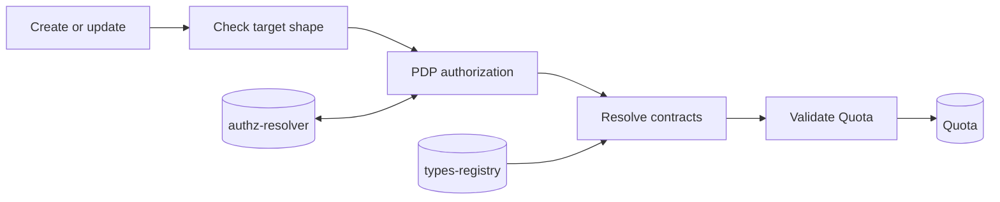
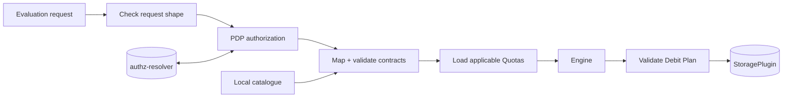

# Quota Enforcement: GTS Projection Contract Flows

Scope: the Quota Enforcement (QE) gear, its public request boundaries, and the two platform services it directly consumes for these flows: `types-registry` and `authz-resolver`.

Source terminology and relationships come from [ADR 0007](./ADR/0007-cpt-cf-quota-enforcement-adr-projection-contracts.md) (`The contract model`, `Projection contents`, `Resolution, validation, and failure surface`), [PRD](./PRD.md) (`3.1 Subject Model & Attribution`, `5.1 Projection Contracts & Subject Attribution`), and [DESIGN](./DESIGN.md) (`3.1 Domain Model`, `3.2 Component Model`, `3.3 API Contracts`, `3.6 Interactions & Sequences`, `3.7 Database schemas & tables`).

## Tiny overview

## Flow 1 — Contract model

QE owns four abstract GTS bases. They cover subjects, resources, requests, and constraints.

QE also owns the `SubjectScope` type. P1 defines user and tenant scope instances.

A metric owner publishes concrete contracts derived from the QE bases. The contracts are registered in `types-registry`, not through QE.

## Flow 2 — Bootstrap

QE registers any missing QE-owned definitions. It loads the configured contracts from `types-registry`.

QE checks contract derivation and admitted metrics. It checks that each `(metric, scope)` pair is unique.

QE requires one request contract per metric. It also checks the attached constraint contract.

If a check fails, QE bootstrap fails. If all checks pass, QE builds `ProjectionContractCatalog`.

## Flow 3 — Quota write

A caller sends a Quota create or update request. QE first checks the public target shape.

The Gateway asks PDP to authorize the complete target. QE does not resolve contracts for an unauthorized target.

`QuotaManagementService` resolves the metric and its contracts. It checks that the projection is in the active catalogue.

It validates `quota.metadata` against the constraint contract. It performs this validation before persistence.

QE stores the Quota with its projection identity. QE also stores the accepted constraint contract identity and version.

## Flow 4 — S2S evaluation

A service sends `tenant_id`, subjects, metric, metadata, and an optional resource. It does not send `projection_type`.

QE first rejects missing required fields, wrong public types, empty ids, duplicate kinds, and repeated tenant scope. These failures are `InvalidArgument`.

The Gateway asks PDP to authorize the complete attribution. A denial is `PermissionDenied`.

After authorization, the Gateway uses `ProjectionContractCatalog`. It maps subjects and validates request/resource contracts.

`EvaluationOrchestrator` loads the applicable Quotas. It builds `EvaluationContext` without a live `types-registry` lookup.

The Engine returns a Decision and Debit Plan. QE validates the Debit Plan before `StoragePlugin` applies the mutation.
